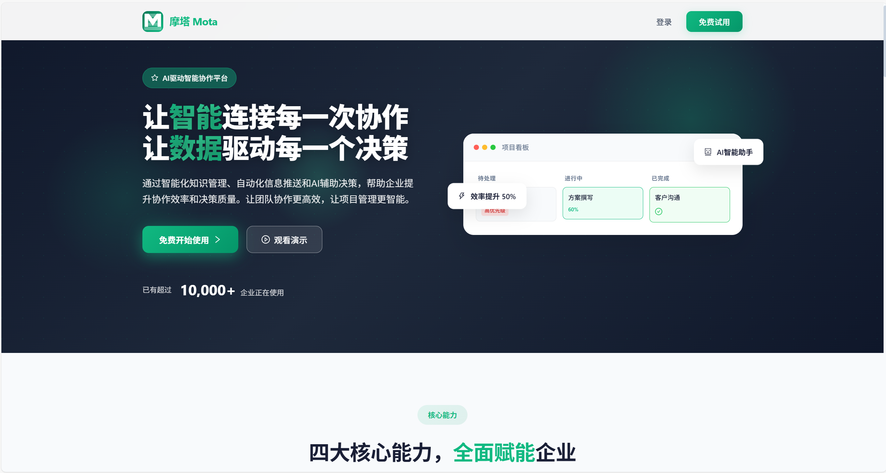

# 🚀 Mota - AI驱动的智能项目管理平台

<p align="center">
  
</p>

<p align="center">
  <strong>让项目管理更智能、更高效</strong>
</p>

<p align="center">
  <a href="#快速开始">快速开始</a> •
  <a href="#核心功能">核心功能</a> •
  <a href="#技术架构">技术架构</a> •
  <a href="#项目结构">项目结构</a> •
  <a href="#开发指南">开发指南</a>
</p>

---

## 📖 产品简介

**摩塔 Mota** 是一款面向企业的 AI 原生项目管理和团队协作平台，致力于通过人工智能技术重新定义团队协作方式。平台深度融合 AI 能力，提供智能任务分解、知识图谱构建、智能决策支持等创新功能，帮助企业实现知识资产化和数据驱动的高效协作。

### ✨ 核心差异化优势

| 特性 | 描述 |
|------|------|
| 🤖 **AI 驱动的智能协作** | 深度集成多种 AI 模型，提供智能任务分解、风险预警、进度预测等能力 |
| 📚 **企业知识资产化** | 基于 RAG 架构构建企业专属知识库，实现知识的沉淀、检索和复用 |
| 📊 **数据驱动的决策支持** | 多维度数据分析和可视化，为管理决策提供数据支撑 |
| 🔗 **全链路协作体验** | 从项目规划到交付的全流程数字化管理 |

---

## ✨ 核心功能

### 📊 项目管理
- **多视图支持**：看板、列表、甘特图、日历、时间线
- **里程碑管理**：项目阶段划分与进度跟踪
- **资源管理**：工作量统计、团队分布、冲突检测
- **报表分析**：燃尽图、燃起图、速度趋势、AI 进度预测

### ✅ 任务协作
- **任务管理**：创建、分配、优先级、标签、评论
- **子任务**：多级子任务、检查清单
- **任务依赖**：完成-开始、开始-开始等多种依赖关系
- **自定义工作流**：灵活配置任务状态流转

### 📚 知识管理
- **文档协作**：实时协作编辑、版本控制、评论批注
- **知识图谱**：实体识别、关系抽取、可视化展示
- **模板库**：项目模板、任务模板、文档模板
- **智能分类**：AI 自动标签、智能归档

### 🤖 AI 能力
- **AI 助手**：智能问答、任务建议、文档摘要
- **AI 方案生成**：根据需求自动生成方案文档
- **智能搜索**：语义搜索、向量检索、混合搜索
- **智能新闻推送**：行业动态、政策监控、个性化推荐

### 📅 日程管理
- **多日历支持**：个人日历、团队日历、项目日历
- **事件提醒**：多渠道提醒（站内、邮件、推送）
- **日历共享**：团队协作、权限控制

### 🔔 通知中心
- **多渠道通知**：站内、邮件、移动推送、企微/钉钉
- **智能聚合**：相似通知合并、重要置顶
- **免打扰模式**：自定义静默时段

---

## 🏗️ 技术架构

### 整体架构

```
┌─────────────────────────────────────────────────────────────────┐
│                         客户端层                                  │
├─────────────┬─────────────┬─────────────┬─────────────────────────┤
│  Web端      │  移动App    │  管理后台   │  第三方集成              │
│  Next.js 14 │  Expo       │  Ant Design │  企微/钉钉/飞书         │
│             │  React Native│  Pro        │                        │
└─────────────┴─────────────┴─────────────┴─────────────────────────┘
                              │
┌─────────────────────────────────────────────────────────────────┐
│                         网关层                                    │
├─────────────────────────────────────────────────────────────────┤
│  Nginx (反向代理 + 负载均衡 + SSL)                                │
│  Spring Cloud Gateway (路由 + 认证 + 限流 + 熔断)                 │
└─────────────────────────────────────────────────────────────────┘
                              │
┌─────────────────────────────────────────────────────────────────┐
│                         BFF层                                     │
├─────────────┬─────────────┬─────────────────────────────────────┤
│  user-bff   │  app-bff    │  admin-bff                          │
│  (NestJS)   │  (NestJS)   │  (NestJS)                           │
└─────────────┴─────────────┴─────────────────────────────────────┘
                              │
┌─────────────────────────────────────────────────────────────────┐
│                       微服务层                                    │
├───────┬───────┬───────┬───────┬───────┬───────┬───────┬────────┤
│ user  │project│ task  │collab │knowl- │  ai   │notify │calendar│
│service│service│service│service│edge   │service│service│service │
├───────┴───────┴───────┴───────┴───────┴───────┴───────┴────────┤
│ search-service │ file-service │ report-service │ tenant-service │
└─────────────────────────────────────────────────────────────────┘
                              │
┌─────────────────────────────────────────────────────────────────┐
│                       中间件层                                    │
├───────┬───────┬───────┬───────┬───────┬───────┬────────────────┤
│ MySQL │ Redis │ Kafka │  ES   │Milvus │ MinIO │     Nacos      │
│ 8.0   │ 7.2   │ 3.6   │ 8.11  │ 2.3   │       │   (注册中心)    │
└───────┴───────┴───────┴───────┴───────┴───────┴────────────────┘
```

### 技术栈

| 层级 | 技术选型 |
|------|---------|
| **前端 Web** | Next.js 14, React 18, TypeScript, Ant Design 5, TanStack Query, Zustand |
| **移动端** | Expo, React Native, React Navigation |
| **管理后台** | Ant Design Pro |
| **BFF 层** | NestJS, TypeScript |
| **微服务** | Spring Boot 3, Spring Cloud, MyBatis-Plus |
| **数据库** | MySQL 8.0, Redis 7.2, Elasticsearch 8.11, Milvus 2.3 |
| **消息队列** | Apache Kafka |
| **对象存储** | MinIO |
| **注册中心** | Nacos |
| **容器化** | Docker, Docker Compose |
| **监控** | Prometheus, Grafana, SkyWalking |

---

## 📁 项目结构

```
mota/
├── README.md                 # 本文档
├── start.bat                 # Windows 一键启动脚本
├── start.sh                  # Linux/Mac 一键启动脚本
│
├── docs/                     # 项目文档
│   ├── 技术架构方案/          # 技术架构设计
│   │   ├── 最佳技术架构方案.md
│   │   └── 重构实施清单.md
│   ├── UI设计规范/            # UI 设计规范
│   └── images/               # 文档图片
│
├── mota-web-next/            # 前端 Web 项目 (Next.js 14)
│   ├── src/
│   │   ├── app/              # 页面路由 (App Router)
│   │   │   ├── (auth)/       # 认证页面
│   │   │   └── (console)/    # 控制台页面
│   │   ├── components/       # 公共组件
│   │   ├── hooks/            # 自定义 Hooks
│   │   ├── lib/              # 工具库
│   │   ├── providers/        # Context Providers
│   │   └── stores/           # 状态管理
│   └── package.json
│
├── mota-service/             # 后端微服务 (Spring Cloud)
│   ├── deploy/               # 部署配置
│   │   ├── docker-compose.yml
│   │   ├── docker-compose.middleware.yml
│   │   ├── docker-compose.services.yml
│   │   └── docker-compose.monitor.yml
│   ├── mota-gateway/         # API 网关
│   ├── mota-user-service/    # 用户服务
│   ├── mota-project-service/ # 项目服务
│   ├── mota-task-service/    # 任务服务
│   ├── mota-ai-service/      # AI 服务
│   ├── mota-knowledge-service/ # 知识服务
│   ├── mota-notify-service/  # 通知服务
│   ├── mota-calendar-service/# 日历服务
│   └── mota-common/          # 公共模块
│
├── mota-bff/                 # BFF 聚合层 (NestJS)
│   ├── mota-user-bff/        # 用户端 BFF
│   ├── mota-app-bff/         # 移动端 BFF
│   └── mota-admin-bff/       # 管理端 BFF
│
└── mota-admin/               # 运营管理后台 (待开发)
```

---

## 🚀 快速开始

### 环境要求

- **Node.js** >= 18.17.0
- **npm** >= 9.0.0
- **Docker** >= 24.0 (用于后端服务，可选)
- **Docker Compose** >= 2.0 (可选)

### 方式一：一键启动脚本（推荐）

项目提供了功能完整的一键启动脚本，支持前端、后端、全栈启动等多种模式。

**Windows 用户：**
```bash
# 双击运行 start.bat 或在命令行执行
mota\start.bat
```

**Linux/Mac 用户：**
```bash
cd mota
chmod +x start.sh
./start.sh
```

**启动脚本功能菜单：**
```
请选择启动模式:

  [前端]
  1. 启动前端开发服务器 (使用 Mock 数据，无需后端)
  2. 构建前端生产版本

  [后端 - Docker 轻量版] (推荐，国内网络友好)
  3. 启动轻量版中间件 (MySQL + Redis + Nacos)

  [后端 - Docker 完整版] (需要良好网络)
  4. 启动全部服务 (中间件 + 微服务)
  5. 仅启动完整中间件 (MySQL, Redis, Nacos, Kafka, ES, Milvus, MinIO)
  6. 仅启动微服务 (需要先启动中间件)

  [管理]
  7. 停止所有服务
  8. 查看服务状态
  9. 查看服务日志

  0. 退出
```

### 推荐启动方式

| 场景 | 推荐选项 | 说明 |
|------|---------|------|
| **快速预览** | 选项 1 | 仅启动前端，使用 Mock 数据 |
| **开发环境** | 选项 3 | 轻量版中间件，国内网络友好 |
| **完整测试** | 选项 4 | 完整后端服务，需要良好网络 |

### 方式二：手动启动

#### 仅启动前端（使用 Mock 数据）

```bash
# 1. 进入前端项目目录
cd mota/mota-web-next

# 2. 安装依赖
npm install

# 3. 启动开发服务器
npm run dev

# 4. 访问 http://localhost:3000
```

#### 启动完整后端服务

```bash
# 1. 进入部署目录
cd mota/mota-service/deploy

# 2. 创建环境变量文件
cp .env.example .env
# 根据需要修改 .env 中的配置

# 3. 启动中间件服务
docker-compose -f docker-compose.middleware.yml up -d

# 4. 等待中间件就绪（约60秒）
# 可以通过以下命令检查状态
docker-compose -f docker-compose.middleware.yml ps

# 5. 启动微服务
docker-compose -f docker-compose.services.yml up -d

# 6. 查看所有服务状态
docker-compose -f docker-compose.middleware.yml ps
docker-compose -f docker-compose.services.yml ps
```

### 服务访问地址

启动完成后，可以通过以下地址访问各服务：

| 服务 | 地址 | 说明 |
|------|------|------|
| **前端 Web** | http://localhost:3000 | Next.js 开发服务器 |
| **API 网关** | http://localhost:8080 | Spring Cloud Gateway |
| **Nacos 控制台** | http://localhost:8848/nacos | 服务注册与配置中心 |
| **MinIO 控制台** | http://localhost:9001 | 对象存储管理 |
| **MySQL** | localhost:3306 | 数据库 |
| **Redis** | localhost:6379 | 缓存 |
| **Elasticsearch** | localhost:9200 | 搜索引擎 |
| **Milvus** | localhost:19530 | 向量数据库 |
| **Kafka** | localhost:9092 | 消息队列 |

> **提示**：前端项目内置 Mock 数据，无需启动后端即可预览所有功能。

---

## 📱 功能页面

| 页面 | 路径 | 说明 |
|------|------|------|
| 登录 | `/login` | 账号密码登录、手机号登录 |
| 注册 | `/register` | 新用户注册 |
| 仪表盘 | `/dashboard` | 数据概览、待办任务、AI 建议 |
| 项目列表 | `/projects` | 项目管理、多视图切换 |
| 项目详情 | `/projects/[id]` | 看板、甘特图、时间线 |
| 任务列表 | `/tasks` | 任务管理、筛选排序 |
| 任务详情 | `/tasks/[id]` | 任务编辑、子任务、评论 |
| 日历 | `/calendar` | 日程管理、多日历视图 |
| 文档 | `/documents` | 文档协作、版本控制 |
| 知识库 | `/knowledge` | 知识管理、知识图谱 |
| 通知中心 | `/notifications` | 消息通知、订阅管理 |
| AI 助手 | `/ai/assistant` | 智能问答、任务建议 |
| AI 方案 | `/ai/proposal` | 方案生成向导 |
| 智能搜索 | `/search` | 全文搜索、语义搜索 |
| 新闻推送 | `/news` | 行业动态、个性化推荐 |
| 模型管理 | `/ai/models` | AI 模型配置 |
| 系统设置 | `/settings` | 个人设置、系统配置 |

---

## 🔧 开发指南

### 前端开发

```bash
cd mota/mota-web-next

# 开发模式
npm run dev

# 类型检查
npm run type-check

# 代码检查
npm run lint

# 代码格式化
npm run format

# 构建生产版本
npm run build
```

### 后端开发

```bash
cd mota/mota-service

# 编译所有模块
mvn clean package -DskipTests

# 运行单个服务
cd mota-user-service
mvn spring-boot:run
```

### 代码规范

- **前端**：ESLint + Prettier + TypeScript
- **后端**：阿里巴巴 Java 开发规范
- **Git**：Conventional Commits 规范

---

## 📊 项目进度

| 阶段 | 内容 | 状态 |
|------|------|------|
| 第一阶段 | 基础设施搭建 | ✅ 已完成 |
| 第二阶段 | 后端服务重构 | ✅ 已完成 |
| 第三阶段 | 前端 Web 端重构 | ✅ 已完成 |
| 第四阶段 | 移动 App 开发 | ⏳ 待实施 |
| 第五阶段 | 运营管理后台 | ⏳ 待实施 |
| 第六阶段 | 监控与运维体系 | ⏳ 待实施 |

详细进度请查看：[重构实施清单](docs/技术架构方案/重构实施清单.md)

---

## 📄 相关文档

- [最佳技术架构方案](docs/技术架构方案/最佳技术架构方案.md)
- [重构实施清单](docs/技术架构方案/重构实施清单.md)
- [UI 设计规范](docs/UI设计规范/README.md)
- [产品核心功能概览](docs/产品核心功能概览.md)
- [功能清单](docs/功能清单.md)

---

## 🤝 贡献指南

1. Fork 本仓库
2. 创建特性分支 (`git checkout -b feature/AmazingFeature`)
3. 提交更改 (`git commit -m 'feat: Add some AmazingFeature'`)
4. 推送到分支 (`git push origin feature/AmazingFeature`)
5. 提交 Pull Request

---

## 📝 许可证

本项目采用 MIT 许可证 - 查看 [LICENSE](LICENSE) 文件了解详情

---

<p align="center">
  Made with ❤️ by Mota Team
</p>