# 摩塔 Mota - 产品架构

## 1. 整体架构图

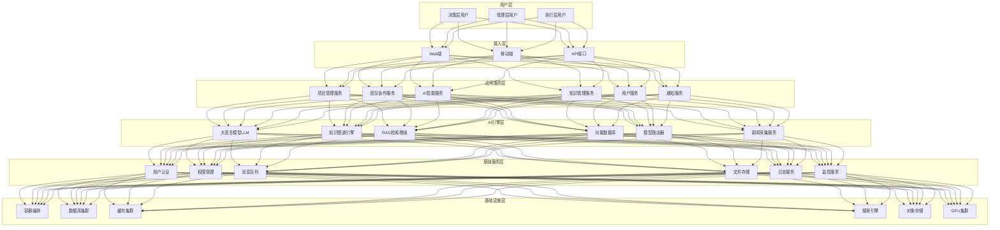

## 2. 功能模块架构

### 2.1 核心功能模块

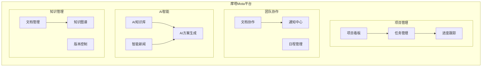

### 2.2 模块依赖关系

| 模块 | 依赖模块 | 说明 |
|-----|---------|------|
| 项目管理 | 用户服务、通知服务 | 项目和任务的核心管理 |
| 团队协作 | 项目管理、通知服务 | 文档协作和日程管理 |
| AI智能 | 知识管理、AI引擎 | 基于知识库的智能服务 |
| 知识管理 | 文件存储、搜索引擎 | 文档和知识的管理 |
| AI方案生成 | AI知识库、智能新闻 | 结合知识和热点生成方案 |

## 3. AI技术架构

### 3.1 AI引擎架构

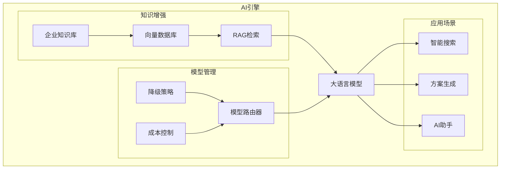

**AI技术栈**:
- 大语言模型: GPT-4 / Claude / 通义千问 / 文心一言
- 向量数据库: Milvus / Pinecone / Weaviate
- 知识图谱: Neo4j / JanusGraph
- AI框架: LangChain / LlamaIndex
- Embedding: OpenAI Embeddings / HuggingFace

### 3.2 RAG检索增强架构

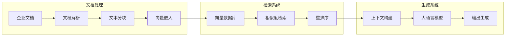

### 3.3 多模型管理架构

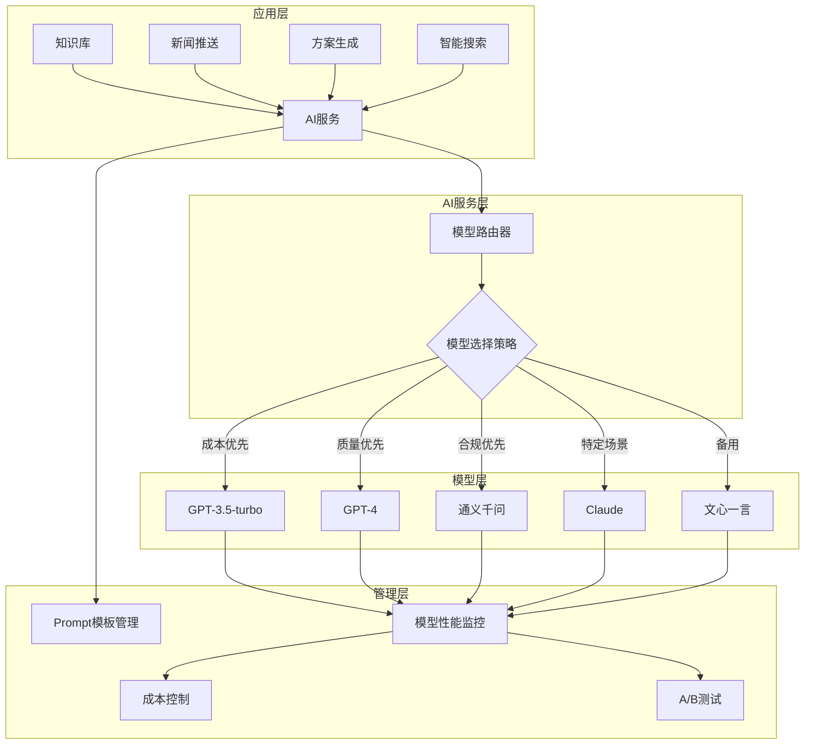

## 4. 前端技术架构

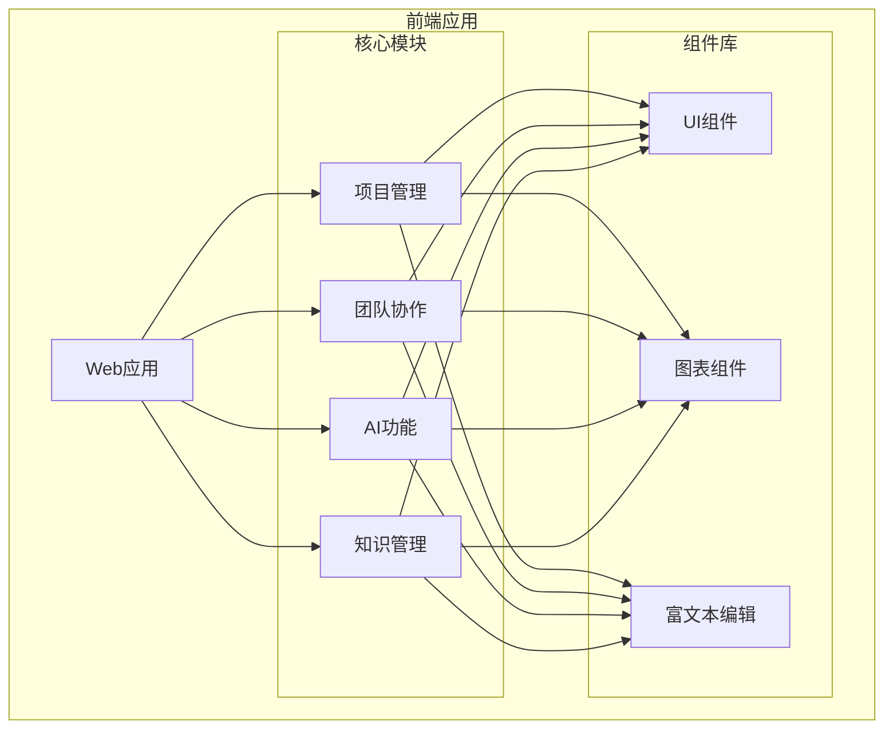

**技术栈**:
- 框架: React 18 + TypeScript
- 状态管理: Redux Toolkit + RTK Query
- UI组件库: Ant Design
- 图表库: ECharts / Recharts
- 富文本: TipTap / Slate
- 构建工具: Vite

## 5. 后端技术架构

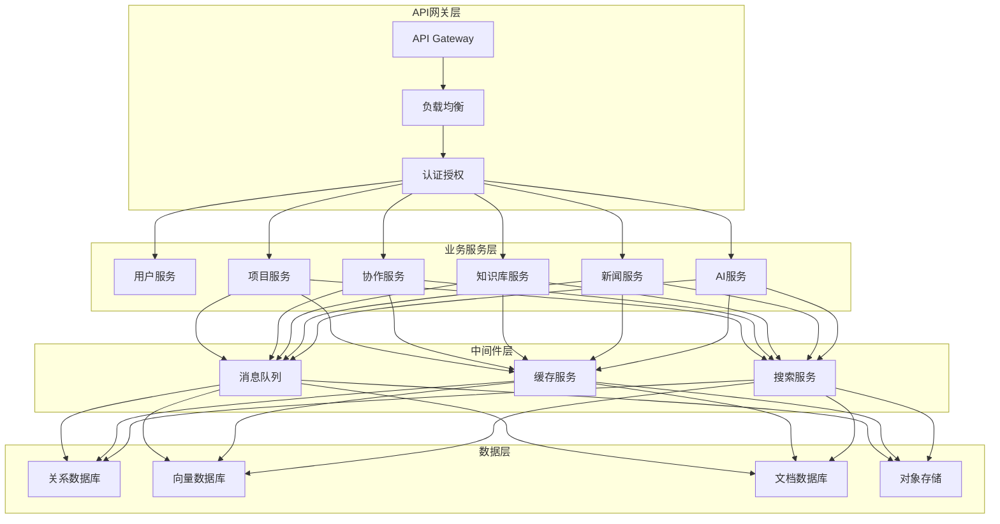

**技术栈**:
- 语言: Python / Java / Go / Node.js
- 框架: FastAPI / Spring Cloud / Gin / NestJS
- 数据库: PostgreSQL / MongoDB
- 向量库: Milvus / Pinecone
- 缓存: Redis
- 消息队列: Kafka / RabbitMQ
- 搜索: Elasticsearch
- 容器: Docker / Kubernetes

### 5.1 微服务拆分

| 服务名称 | 职责 | 技术栈 |
|---------|------|--------|
| user-service | 用户认证、授权、管理 | Spring Boot, JWT |
| project-service | 项目、任务、看板管理 | Spring Boot, PostgreSQL |
| collaboration-service | 文档协作、日程管理 | Node.js, WebSocket |
| ai-service | AI模型调用、Prompt管理 | Python, FastAPI |
| knowledge-service | 知识库、文档管理 | Spring Boot, Elasticsearch |
| news-service | 新闻采集、推送 | Python, Celery |
| notification-service | 统一通知服务 | Node.js, RabbitMQ |
| file-service | 文件上传、存储、预览 | Spring Boot, MinIO |
| search-service | 全局搜索服务 | Python, Elasticsearch |
| analytics-service | 数据分析、报表 | Python, Pandas |

## 6. 数据架构

### 6.1 数据流架构

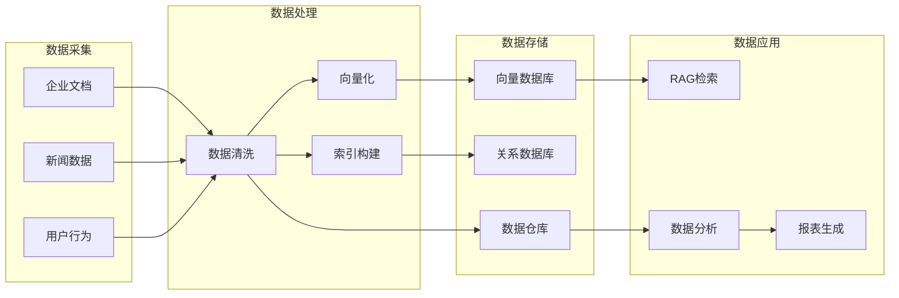

### 6.2 核心数据模型

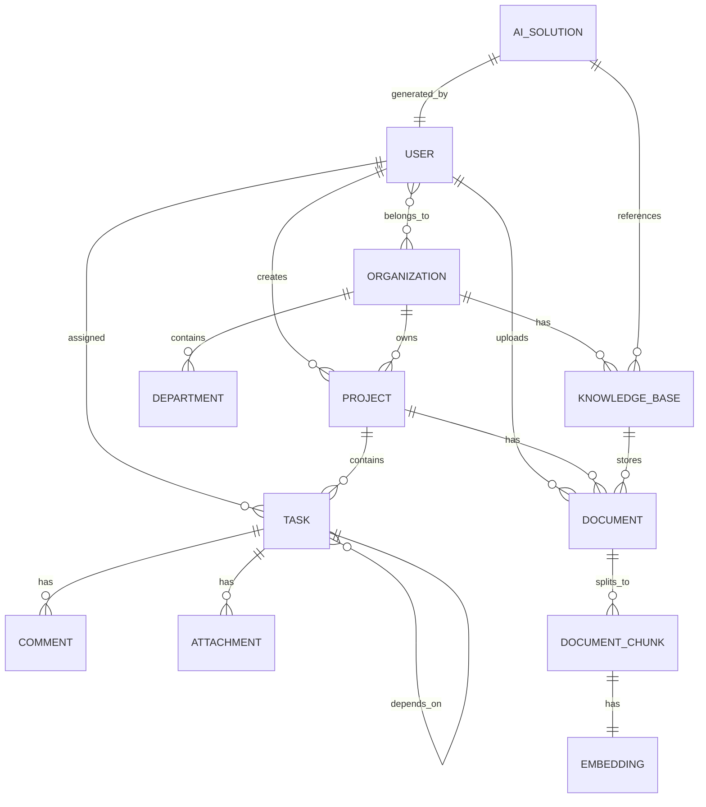

## 7. 部署架构

### 7.1 SaaS 部署架构

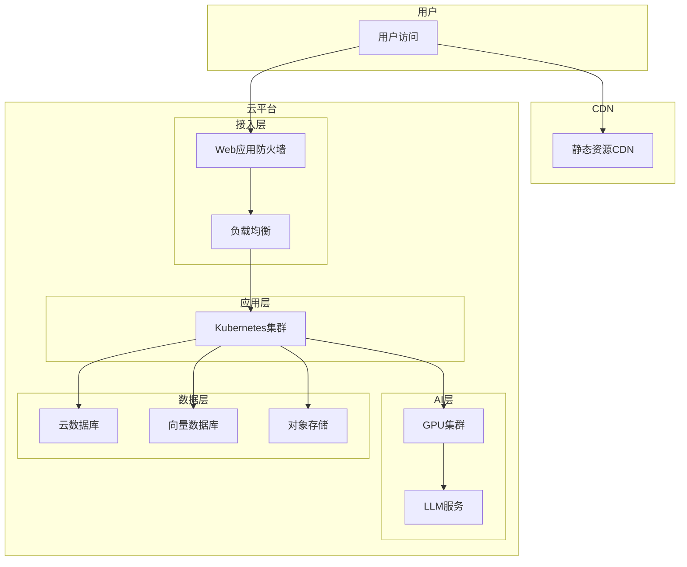

### 7.2 私有部署架构

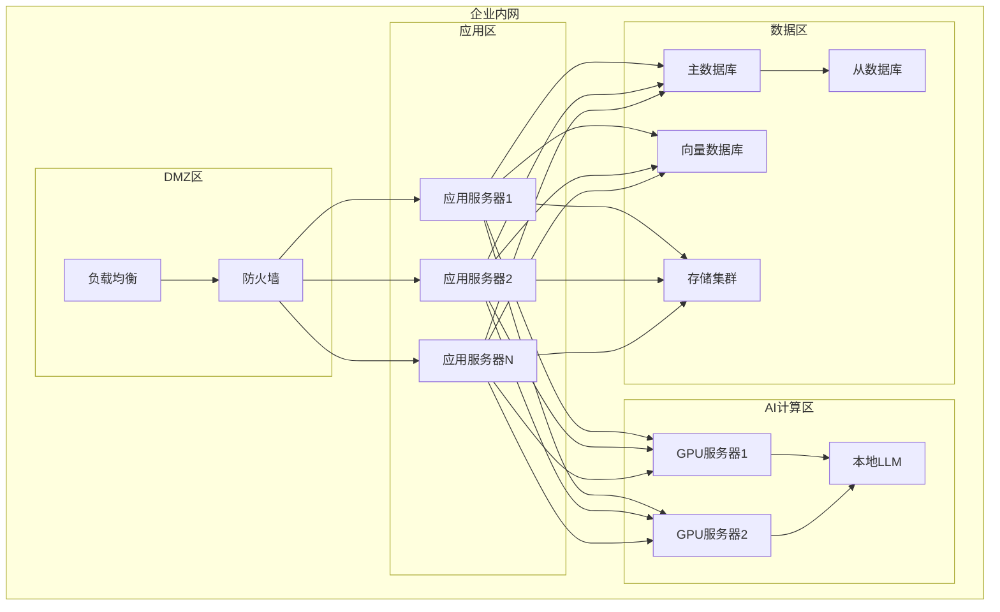

## 8. 安全架构

### 8.1 安全分层

| 层级 | 安全措施 |
|-----|---------|
| 网络层 | DDoS防护、WAF、VPN |
| 传输层 | HTTPS/TLS加密 |
| 应用层 | 身份认证、访问控制、API安全 |
| AI层 | 模型隔离、数据脱敏、输出过滤 |
| 数据层 | 数据加密、备份、多租户隔离 |

### 8.2 认证授权

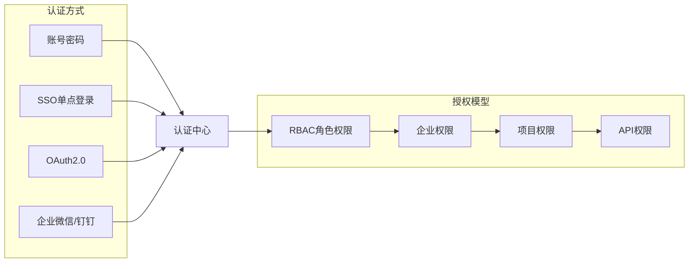

## 9. 扩展架构

### 9.1 API开放平台

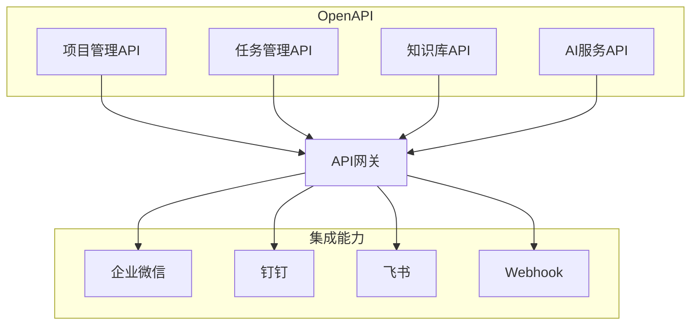

### 9.2 插件系统

- 自定义工作流插件
- 第三方LLM接入
- 数据源连接器
- 报表模板扩展

---

*摩塔 Mota - AI驱动的项目管理与团队协作平台*