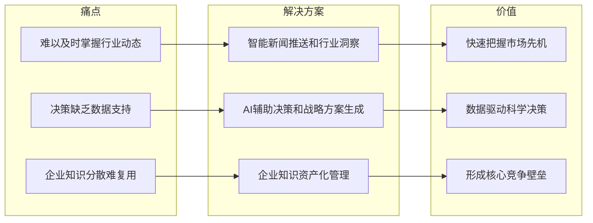
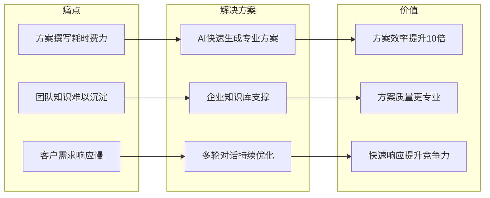
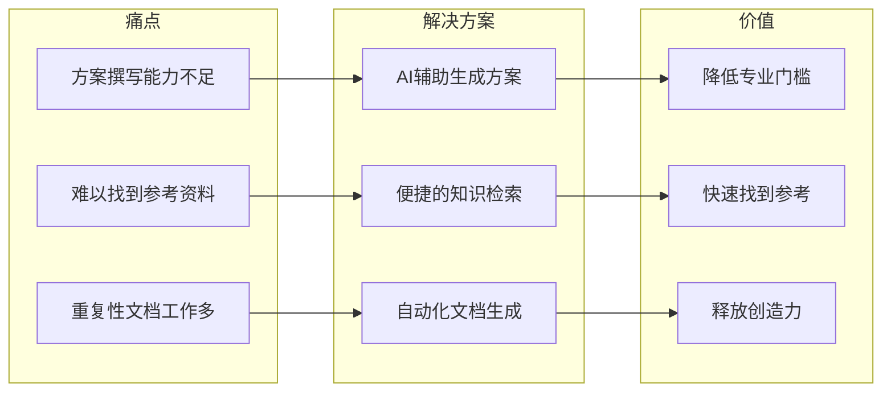
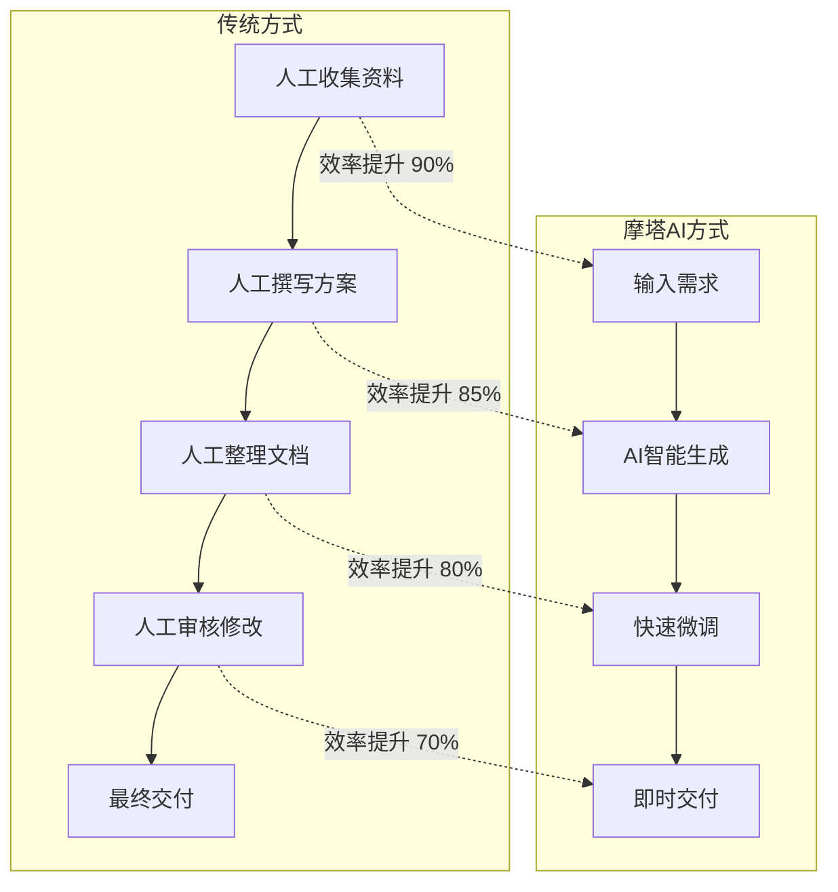
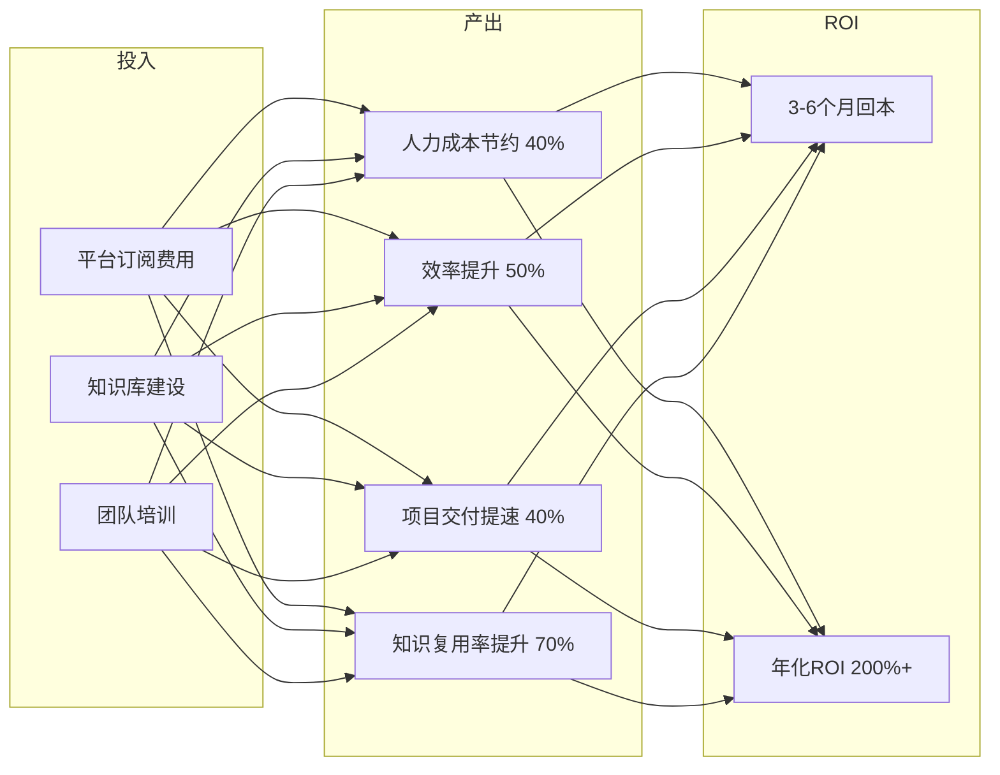

# 摩塔 Mota - 核心价值

## 1. 价值主张

### 1.1 AI驱动的项目管理与团队协作平台

```
智能化 · 高效化 · 协作化 · 知识化
```

摩塔 Mota 通过AI技术赋能企业，打造以AI为核心驱动力的新一代项目管理与团队协作平台，通过智能化知识管理、自动化信息推送和AI辅助决策，帮助企业提升协作效率和决策质量。

### 1.2 核心价值矩阵

| 价值维度 | 具体价值 | 量化指标 |
|---------|---------|---------|
| 协作效率 | 项目管理与团队协作 | 协作效率提升 50%+ |
| 知识沉淀 | 企业知识资产化 | 知识复用率提升 80%+ |
| 智能决策 | AI辅助决策支持 | 决策效率提升 50%+ |
| 信息敏感 | 行业动态实时掌握 | 信息获取速度提升 90%+ |

## 2. 分角色价值

### 2.1 决策层用户



**核心功能**:
- 智能新闻推送和行业洞察报告
- AI辅助决策和战略方案生成
- 企业知识库和知识图谱
- 竞品动态监控和分析

**价值体现**:
- 实时掌握行业动态和政策变化
- 基于企业知识的AI智能决策支持
- 企业知识持续积累，形成核心竞争力

### 2.2 管理层用户



**核心功能**:
- AI智能方案生成
- 智能PPT生成
- 营销方案和策略生成
- 项目管理和团队协作

**价值体现**:
- AI一键生成专业方案，效率提升10倍
- 基于企业知识库，方案更专业更贴合业务
- 快速响应客户需求，提升市场竞争力

### 2.3 执行层用户



**核心功能**:
- AI辅助方案生成
- 智能知识检索
- AI助手对话
- 文档自动化生成

**价值体现**:
- AI辅助降低方案撰写门槛
- 智能搜索快速找到所需资料和案例
- 自动化文档生成，释放创造力

## 3. 业务价值

### 3.1 效率提升对比

| 场景 | 传统方式 | 使用摩塔后 | 效率提升 |
|-----|---------|-----------|---------|
| 商务方案 | 1-2天 | 10-30分钟 | 90%+ |
| 技术方案 | 2-3天 | 30-60分钟 | 85%+ |
| 营销方案 | 1天 | 20分钟 | 90%+ |
| PPT制作 | 4-8小时 | 10分钟 | 95%+ |
| 知识检索 | 30分钟 | 1分钟 | 95%+ |
| 行业分析 | 1周 | 1天 | 80%+ |

### 3.2 质量提升

| 质量维度 | 保障措施 | 预期效果 |
|---------|---------|---------|
| 专业性 | 企业知识库支撑 | 内容专业度提升 60% |
| 一致性 | 统一模板和规范 | 风格一致性 100% |
| 准确性 | RAG检索增强 | 信息准确率 95%+ |
| 时效性 | 实时新闻追踪 | 信息时效性提升 80% |

### 3.3 AI赋能对比



## 4. 使用场景价值

### 4.1 快速生成商务方案

**场景描述**:
1. 销售人员接到客户需求
2. 进入AI方案生成，选择商务方案类型
3. 输入客户背景和需求描述
4. 选择企业知识库增强生成效果
5. AI一键生成专业商务方案
6. 通过对话优化方案细节
7. 导出Word/PDF发送给客户

**价值体现**:
- 方案生成时间从1-2天缩短到30分钟
- 方案专业度提升，基于企业知识库
- 快速响应客户，提升成单率

### 4.2 智能PPT制作

**场景描述**:
1. 市场人员需要制作产品介绍PPT
2. 将已有方案一键转换为PPT
3. 选择专业模板风格
4. AI自动排版和生成图表
5. 在线编辑微调
6. 导出精美PPT

**价值体现**:
- PPT制作时间从4-8小时缩短到10分钟
- 专业模板保证视觉效果
- 内容与方案保持一致

### 4.3 构建企业知识库

**场景描述**:
1. 企业上传历史方案、产品资料、行业报告等
2. AI自动解析文档内容
3. 智能分类和添加标签
4. 构建知识图谱
5. 训练企业专属AI模型
6. 知识库用于增强方案生成

**价值体现**:
- 企业知识资产化
- AI越用越懂企业业务
- 知识复用率提升80%

### 4.4 行业动态追踪

**场景描述**:
1. 配置业务关键词和关注行业
2. 系统实时追踪相关新闻
3. AI分析热点趋势和竞品动态
4. 生成行业洞察报告
5. 将有价值的新闻引用到方案中

**价值体现**:
- 实时掌握行业动态
- 方案内容更具时效性
- 决策更有数据支撑

## 5. 行业解决方案

### 5.1 科技/互联网公司

**特点**: 敏捷开发、快速迭代、技术文档多
**方案**: 敏捷项目管理 + 技术知识库 + AI辅助文档
**价值**: 开发效率提升40%，知识沉淀率提升80%

### 5.2 咨询/专业服务

**特点**: 项目交付多、知识密集、方案产出量大
**方案**: 项目管理 + AI方案生成 + 知识图谱
**价值**: 方案产出效率提升85%，服务能力翻倍

### 5.3 制造业

**特点**: 项目周期长、流程复杂、文档管理需求大
**方案**: 项目进度管理 + 文档协作 + 知识库
**价值**: 项目管理效率提升50%，文档管理规范化

### 5.4 金融/保险

**特点**: 合规要求高、项目管理严格、知识更新快
**方案**: 合规项目管理 + 智能新闻 + 知识库
**价值**: 合规效率提升60%，风险预警及时

### 5.5 教育/培训

**特点**: 课程项目多、知识共享需求大、协作频繁
**方案**: 课程项目管理 + 知识共享 + 团队协作
**价值**: 课程开发效率提升70%，知识共享便捷

### 5.6 政府/事业单位

**特点**: 项目管理规范、文档要求严格、审批流程多
**方案**: 规范化项目管理 + 文档管理 + 审批流程
**价值**: 项目管理规范化，文档管理标准化

## 6. 投资回报

### 6.1 成本节约

| 成本类型 | 节约方式 | 预期节约 |
|---------|---------|---------|
| 人力成本 | AI替代重复性工作 | 30-50% |
| 时间成本 | 项目协作自动化 | 50-70% |
| 工具成本 | 一站式平台整合 | 40-60% |
| 培训成本 | AI辅助新人上手 | 30-50% |

### 6.2 价值创造

| 价值类型 | 创造方式 | 预期收益 |
|---------|---------|---------|
| 项目交付 | 提升项目管理效率 | 交付速度提升 40%+ |
| 团队效能 | 提升协作效率 | 团队效能提升 50%+ |
| 知识资产 | 企业知识持续积累 | 长期竞争力提升 |
| 决策质量 | AI辅助决策 | 决策准确率提升 30%+ |

### 6.3 ROI分析



## 7. 竞争优势

### 7.1 核心差异化

| 优势 | 描述 |
|-----|------|
| AI原生设计 | 从底层架构就以AI为核心，而非后期添加 |
| 知识驱动 | 基于企业知识库的智能服务，越用越懂您的业务 |
| 方案专业 | AI生成的方案基于企业知识，更专业更贴合业务 |
| 多模型支持 | 支持多种AI模型，灵活选择最适合的方案 |
| 灵活部署 | SaaS + 私有化双模式，满足不同需求 |

### 7.2 技术壁垒

- 先进的RAG检索增强技术
- 企业级知识图谱构建能力
- 多模型路由和成本优化
- 实时新闻追踪和智能匹配
- 高性能向量检索引擎
- 企业专属模型训练能力

### 7.3 与竞品对比

| 对比维度 | 摩塔 Mota | ChatGPT/Claude | 文心一言 | Notion AI |
|---------|-----------|----------------|----------|-----------|
| 方案生成 | ⭐⭐⭐⭐⭐ | ⭐⭐⭐ | ⭐⭐⭐ | ⭐⭐ |
| 企业知识库 | ⭐⭐⭐⭐⭐ | ⭐ | ⭐⭐ | ⭐⭐⭐ |
| 业务理解 | ⭐⭐⭐⭐⭐ | ⭐⭐ | ⭐⭐ | ⭐⭐ |
| 新闻追踪 | ⭐⭐⭐⭐⭐ | ⭐ | ⭐⭐ | ⭐ |
| 本土化 | ⭐⭐⭐⭐⭐ | ⭐⭐ | ⭐⭐⭐⭐⭐ | ⭐⭐⭐ |
| 私有部署 | ⭐⭐⭐⭐⭐ | ⭐ | ⭐⭐⭐ | ⭐ |

---

*摩塔 Mota - AI驱动的项目管理与团队协作平台*