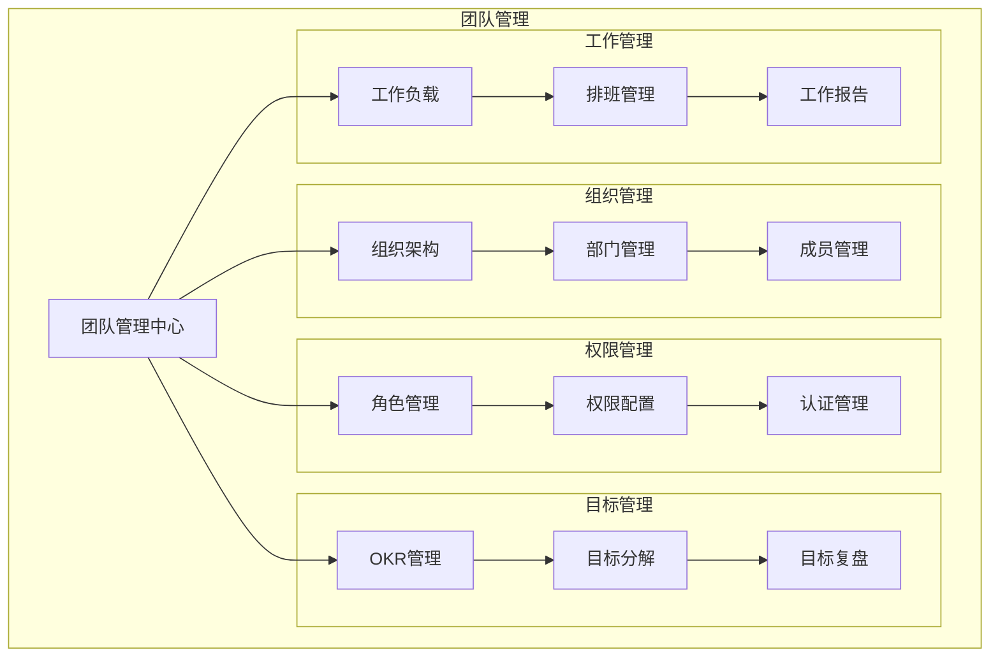
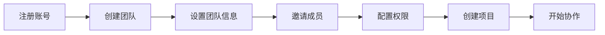
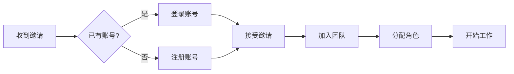
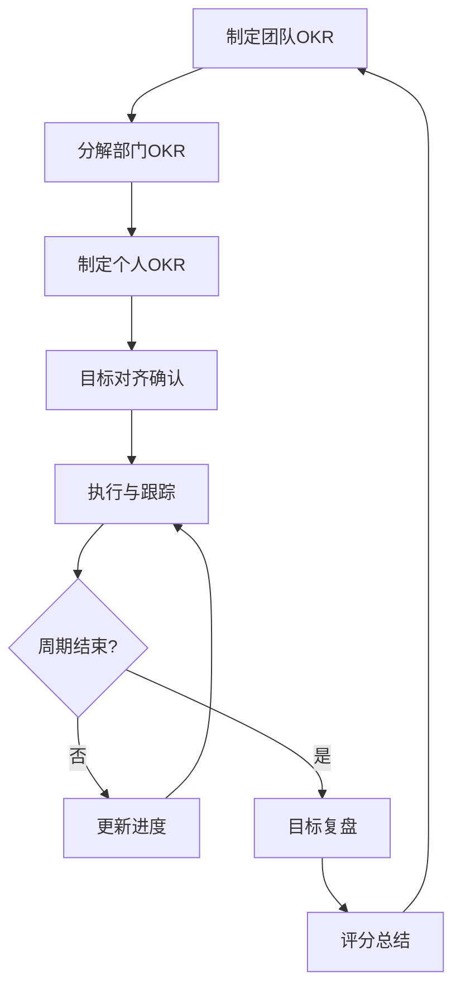

# 团队管理 - 功能概述

## 1. 模块简介

团队管理是摩塔 Mota 平台的基础模块，提供团队创建、成员管理、权限配置等核心功能，是AI方案生成、知识库管理等所有功能模块的基础支撑，确保企业数据安全和协作顺畅。

## 2. 功能架构



## 3. 核心功能

### 3.1 团队创建与设置

| 功能 | 描述 |
|-----|------|
| 创建团队 | 创建新的团队空间，设置团队基本信息 |
| 团队设置 | 配置团队名称、Logo、描述等基本信息 |
| 团队域名 | 设置团队专属访问域名 |
| 团队公告 | 发布团队公告，通知全体成员 |

### 3.2 成员管理

| 功能 | 描述 |
|-----|------|
| 邀请成员 | 通过邮件、链接等方式邀请成员加入团队 |
| 成员列表 | 查看和管理团队所有成员 |
| 成员分组 | 按部门、项目等维度对成员进行分组 |
| 成员状态 | 管理成员的启用、禁用状态 |

### 3.3 权限管理

| 功能 | 描述 |
|-----|------|
| 角色定义 | 定义团队角色，如管理员、开发者、访客等 |
| 权限配置 | 为角色配置具体的功能权限 |
| 成员授权 | 为成员分配角色和权限 |
| 权限继承 | 支持权限的层级继承 |

### 3.4 目标管理（OKR）

| 功能 | 描述 |
|-----|------|
| 目标设定 | 设定团队和个人的 OKR 目标 |
| 目标对齐 | 将个人目标与团队目标对齐 |
| 进度跟踪 | 跟踪目标完成进度 |
| 目标复盘 | 定期复盘目标执行情况 |

### 3.5 工作负载

| 功能 | 描述 |
|-----|------|
| 负载视图 | 查看成员的工作负载情况 |
| 任务分配 | 根据负载情况合理分配任务 |
| 工时统计 | 统计成员的工时投入 |
| 负载预警 | 对超负荷成员进行预警 |

## 4. 用户流程

### 4.1 团队创建流程



### 4.2 成员加入流程



### 4.3 OKR 管理流程



## 5. 界面设计

### 5.1 团队首页

```
┌─────────────────────────────────────────────────────────────────┐
│  摩塔 Mota                                    🔔 👤 设置        │
├─────────────────────────────────────────────────────────────────┤
│  ┌─────────┐                                                    │
│  │ 团队Logo │  团队名称                                          │
│  └─────────┘  团队描述信息                                       │
├─────────────────────────────────────────────────────────────────┤
│                                                                 │
│  📊 团队概览                                                     │
│  ┌──────────┐ ┌──────────┐ ┌──────────┐ ┌──────────┐           │
│  │ 成员数量  │ │ 项目数量  │ │ 进行中任务│ │ 本周完成  │           │
│  │   128    │ │    25    │ │   342    │ │   156    │           │
│  └──────────┘ └──────────┘ └──────────┘ └──────────┘           │
│                                                                 │
│  📢 团队公告                                                     │
│  ┌─────────────────────────────────────────────────────────┐   │
│  │ [置顶] 本周五进行系统升级维护，请提前保存工作...           │   │
│  │ [新] 欢迎新成员张三加入团队...                            │   │
│  └─────────────────────────────────────────────────────────┘   │
│                                                                 │
│  🎯 团队目标                                                     │
│  ┌─────────────────────────────────────────────────────────┐   │
│  │ Q4 目标完成进度                                          │   │
│  │ ████████████████████░░░░░░░░░░  65%                     │   │
│  └─────────────────────────────────────────────────────────┘   │
│                                                                 │
└─────────────────────────────────────────────────────────────────┘
```

### 5.2 成员管理页面

```
┌─────────────────────────────────────────────────────────────────┐
│  成员管理                                      [+ 邀请成员]      │
├─────────────────────────────────────────────────────────────────┤
│  🔍 搜索成员...                    筛选: [全部▼] [全部角色▼]     │
├─────────────────────────────────────────────────────────────────┤
│                                                                 │
│  ┌─────────────────────────────────────────────────────────┐   │
│  │ 👤 头像 │ 姓名    │ 邮箱           │ 角色   │ 状态 │ 操作 │   │
│  ├─────────────────────────────────────────────────────────┤   │
│  │ [头像]  │ 张三    │ zhang@xx.com  │ 管理员 │ 正常 │ ⚙️   │   │
│  │ [头像]  │ 李四    │ li@xx.com     │ 开发者 │ 正常 │ ⚙️   │   │
│  │ [头像]  │ 王五    │ wang@xx.com   │ 测试   │ 正常 │ ⚙️   │   │
│  │ [头像]  │ 赵六    │ zhao@xx.com   │ 访客   │ 禁用 │ ⚙️   │   │
│  └─────────────────────────────────────────────────────────┘   │
│                                                                 │
│  共 128 名成员                              < 1 2 3 4 5 ... >   │
│                                                                 │
└─────────────────────────────────────────────────────────────────┘
```

### 5.3 OKR 管理页面

```
┌─────────────────────────────────────────────────────────────────┐
│  目标管理 (OKR)                               [+ 创建目标]       │
├─────────────────────────────────────────────────────────────────┤
│  周期: [2024 Q4 ▼]        视图: [列表] [树形] [对齐图]          │
├─────────────────────────────────────────────────────────────────┤
│                                                                 │
│  🎯 团队目标                                                     │
│  ┌─────────────────────────────────────────────────────────┐   │
│  │ O1: 提升产品用户体验                              进度 70% │   │
│  │   ├─ KR1: 用户满意度达到 4.5 分                      80%  │   │
│  │   ├─ KR2: 页面加载时间降低到 2s 以内                 60%  │   │
│  │   └─ KR3: 用户投诉率降低 50%                         70%  │   │
│  ├─────────────────────────────────────────────────────────┤   │
│  │ O2: 提高研发效率                                  进度 60% │   │
│  │   ├─ KR1: 需求交付周期缩短 30%                       50%  │   │
│  │   ├─ KR2: 自动化测试覆盖率达到 80%                   70%  │   │
│  │   └─ KR3: 线上故障率降低 40%                         60%  │   │
│  └─────────────────────────────────────────────────────────┘   │
│                                                                 │
│  👤 我的目标                                                     │
│  ┌─────────────────────────────────────────────────────────┐   │
│  │ O1: 完成用户中心重构                              进度 80% │   │
│  │   ├─ KR1: 完成技术方案设计                          100%  │   │
│  │   ├─ KR2: 完成核心功能开发                           80%  │   │
│  │   └─ KR3: 完成性能优化                               60%  │   │
│  └─────────────────────────────────────────────────────────┘   │
│                                                                 │
└─────────────────────────────────────────────────────────────────┘
```

## 6. 数据模型

### 6.1 团队数据模型

```
Team (团队)
├── id: 团队ID
├── name: 团队名称
├── domain: 团队域名
├── logo: 团队Logo
├── description: 团队描述
├── owner_id: 创建者ID
├── settings: 团队设置
├── created_at: 创建时间
└── updated_at: 更新时间

Member (成员)
├── id: 成员ID
├── team_id: 所属团队ID
├── user_id: 用户ID
├── role_id: 角色ID
├── department_id: 部门ID
├── status: 状态
├── joined_at: 加入时间
└── updated_at: 更新时间

Role (角色)
├── id: 角色ID
├── team_id: 所属团队ID
├── name: 角色名称
├── description: 角色描述
├── permissions: 权限列表
├── is_system: 是否系统角色
└── created_at: 创建时间
```

### 6.2 OKR 数据模型

```
Objective (目标)
├── id: 目标ID
├── team_id: 所属团队ID
├── owner_id: 负责人ID
├── parent_id: 父目标ID
├── title: 目标标题
├── description: 目标描述
├── period: 周期
├── progress: 进度
├── status: 状态
├── created_at: 创建时间
└── updated_at: 更新时间

KeyResult (关键结果)
├── id: 关键结果ID
├── objective_id: 所属目标ID
├── title: 关键结果标题
├── target_value: 目标值
├── current_value: 当前值
├── unit: 单位
├── progress: 进度
├── status: 状态
└── updated_at: 更新时间
```

## 7. 接口设计

### 7.1 团队管理接口

| 接口 | 方法 | 描述 |
|-----|------|------|
| /api/teams | POST | 创建团队 |
| /api/teams/:id | GET | 获取团队信息 |
| /api/teams/:id | PUT | 更新团队信息 |
| /api/teams/:id | DELETE | 删除团队 |
| /api/teams/:id/members | GET | 获取团队成员列表 |
| /api/teams/:id/members | POST | 添加团队成员 |
| /api/teams/:id/members/:memberId | DELETE | 移除团队成员 |

### 7.2 OKR 管理接口

| 接口 | 方法 | 描述 |
|-----|------|------|
| /api/okr/objectives | POST | 创建目标 |
| /api/okr/objectives | GET | 获取目标列表 |
| /api/okr/objectives/:id | GET | 获取目标详情 |
| /api/okr/objectives/:id | PUT | 更新目标 |
| /api/okr/objectives/:id | DELETE | 删除目标 |
| /api/okr/objectives/:id/key-results | POST | 添加关键结果 |
| /api/okr/objectives/:id/key-results/:krId | PUT | 更新关键结果 |

---

*摩塔 Mota - 让每家企业都拥有懂自己业务的AI助手*