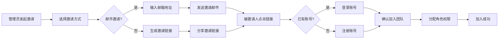
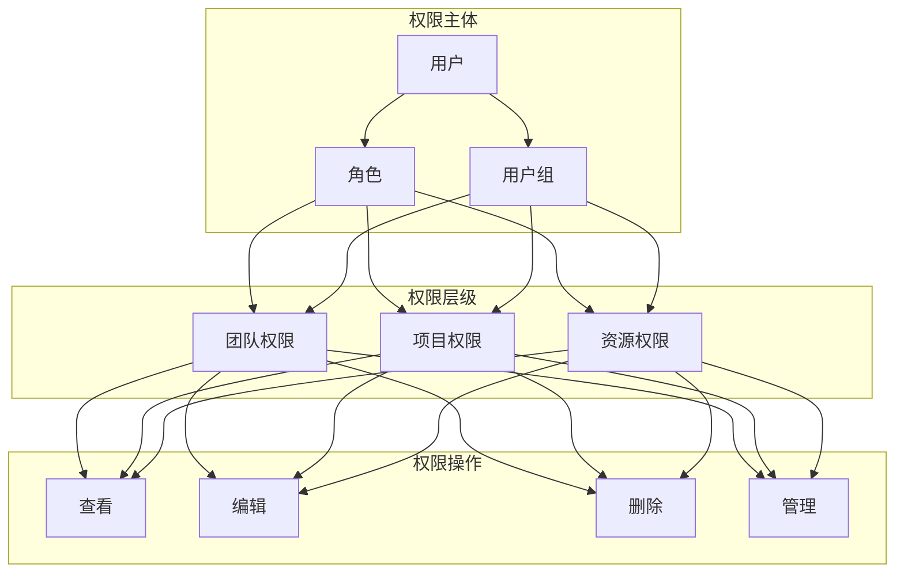
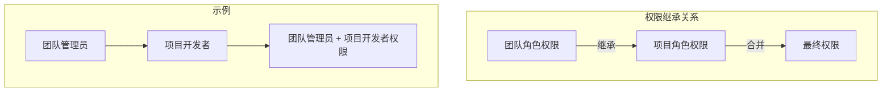
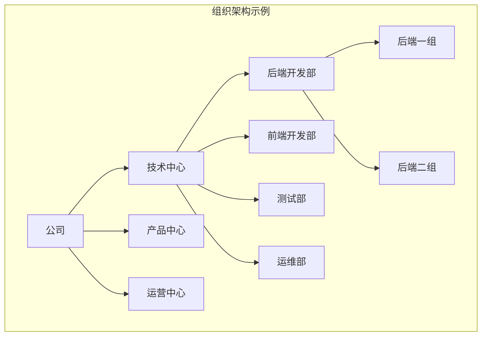

# 成员与权限管理

## 1. 功能概述

成员与权限管理是团队管理的核心功能，提供完善的成员邀请、角色定义、权限配置等能力，确保团队协作的安全性和规范性。

## 2. 成员管理

### 2.1 邀请成员

#### 2.1.1 邀请方式

| 邀请方式 | 描述 | 适用场景 |
|---------|------|---------|
| 邮件邀请 | 通过邮箱发送邀请链接 | 单个成员邀请 |
| 链接邀请 | 生成邀请链接分享 | 批量邀请 |
| 批量导入 | 通过 Excel 批量导入 | 大规模团队迁移 |
| SSO 同步 | 从企业 SSO 系统同步 | 企业级部署 |

#### 2.1.2 邀请流程



#### 2.1.3 邀请设置

```
┌─────────────────────────────────────────────────────────────────┐
│  邀请成员                                                        │
├─────────────────────────────────────────────────────────────────┤
│                                                                 │
│  邀请方式: ○ 邮件邀请  ● 链接邀请  ○ 批量导入                     │
│                                                                 │
│  ┌─────────────────────────────────────────────────────────┐   │
│  │ 邀请链接                                                 │   │
│  │ https://mota.example.com/invite/abc123xyz               │   │
│  │                                          [复制链接]      │   │
│  └─────────────────────────────────────────────────────────┘   │
│                                                                 │
│  链接设置:                                                       │
│  ├─ 有效期: [7天 ▼]                                             │
│  ├─ 使用次数: [不限 ▼]                                          │
│  └─ 默认角色: [开发者 ▼]                                        │
│                                                                 │
│  加入审批: ○ 无需审批  ● 需要审批                                 │
│                                                                 │
│                              [取消]  [生成链接]                  │
│                                                                 │
└─────────────────────────────────────────────────────────────────┘
```

### 2.2 成员列表

#### 2.2.1 列表功能

| 功能 | 描述 |
|-----|------|
| 搜索 | 按姓名、邮箱搜索成员 |
| 筛选 | 按角色、部门、状态筛选 |
| 排序 | 按加入时间、姓名排序 |
| 导出 | 导出成员列表为 Excel |

#### 2.2.2 成员操作

| 操作 | 描述 | 权限要求 |
|-----|------|---------|
| 查看详情 | 查看成员详细信息 | 所有成员 |
| 修改角色 | 修改成员的角色 | 管理员 |
| 修改部门 | 修改成员所属部门 | 管理员 |
| 禁用成员 | 禁用成员账号 | 管理员 |
| 移除成员 | 将成员移出团队 | 管理员 |

### 2.3 成员详情

```
┌─────────────────────────────────────────────────────────────────┐
│  成员详情                                              [编辑]    │
├─────────────────────────────────────────────────────────────────┤
│                                                                 │
│  ┌─────────┐  张三                                              │
│  │  头像   │  zhang@example.com                                 │
│  │         │  开发工程师                                         │
│  └─────────┘                                                    │
│                                                                 │
│  基本信息                                                        │
│  ├─ 姓名: 张三                                                  │
│  ├─ 邮箱: zhang@example.com                                     │
│  ├─ 手机: 138****8888                                           │
│  ├─ 部门: 研发部 / 后端组                                        │
│  ├─ 角色: 开发者                                                 │
│  ├─ 状态: 正常                                                   │
│  └─ 加入时间: 2024-01-15                                        │
│                                                                 │
│  参与项目                                                        │
│  ├─ 摩塔核心平台 (管理员)                                        │
│  ├─ 用户中心服务 (开发者)                                        │
│  └─ 数据分析平台 (开发者)                                        │
│                                                                 │
│  最近活动                                                        │
│  ├─ 2024-03-15 提交代码到 feature/user-center                   │
│  ├─ 2024-03-14 完成任务「用户登录功能开发」                       │
│  └─ 2024-03-13 创建合并请求 #123                                │
│                                                                 │
└─────────────────────────────────────────────────────────────────┘
```

## 3. 权限管理

### 3.1 权限模型

摩塔采用 RBAC（基于角色的访问控制）权限模型，支持多层级权限管理。



### 3.2 系统角色

#### 3.2.1 团队级角色

| 角色 | 描述 | 主要权限 |
|-----|------|---------|
| 团队所有者 | 团队创建者，拥有最高权限 | 所有权限 |
| 团队管理员 | 团队管理人员 | 团队设置、成员管理、项目管理 |
| 普通成员 | 团队普通成员 | 查看团队信息、参与项目 |

#### 3.2.2 项目级角色

| 角色 | 描述 | 主要权限 |
|-----|------|---------|
| 项目管理员 | 项目负责人 | 项目设置、成员管理、所有功能 |
| 开发者 | 开发人员 | 代码提交、构建部署、任务管理 |
| 产品经理 | 产品人员 | 需求管理、项目规划 |
| 访客 | 只读访问 | 查看项目信息 |

### 3.3 权限配置

#### 3.3.1 功能权限矩阵

| 功能模块 | 团队所有者 | 团队管理员 | 项目管理员 | 开发者 | 产品经理 | 访客 |
|---------|-----------|-----------|-----------|-------|---------|-----|
| 团队设置 | ✓ | ✓ | - | - | - | - |
| 成员管理 | ✓ | ✓ | - | - | - | - |
| 项目创建 | ✓ | ✓ | - | - | - | - |
| 项目设置 | ✓ | ✓ | ✓ | - | - | - |
| 代码提交 | ✓ | ✓ | ✓ | ✓ | - | - |
| 代码评审 | ✓ | ✓ | ✓ | ✓ | - | - |
| 构建部署 | ✓ | ✓ | ✓ | ✓ | - | - |
| 需求管理 | ✓ | ✓ | ✓ | ✓ | ✓ | - |
| 查看项目 | ✓ | ✓ | ✓ | ✓ | ✓ | ✓ |

#### 3.3.2 自定义角色

```
┌─────────────────────────────────────────────────────────────────┐
│  创建自定义角色                                                   │
├─────────────────────────────────────────────────────────────────┤
│                                                                 │
│  角色名称: [技术负责人                    ]                       │
│                                                                 │
│  角色描述: [负责技术方案评审和代码质量把控  ]                       │
│                                                                 │
│  权限配置:                                                       │
│  ┌─────────────────────────────────────────────────────────┐   │
│  │ □ 团队管理                                               │   │
│  │   □ 团队设置                                             │   │
│  │   □ 成员管理                                             │   │
│  │   □ 角色管理                                             │   │
│  │                                                         │   │
│  │ ☑ 项目管理                                               │   │
│  │   ☑ 项目设置                                             │   │
│  │   ☑ 成员管理                                             │   │
│  │   □ 删除项目                                             │   │
│  │                                                         │   │
│  │ ☑ 代码管理                                               │   │
│  │   ☑ 代码查看                                             │   │
│  │   ☑ 代码提交                                             │   │
│  │   ☑ 代码评审                                             │   │
│  │   ☑ 合并请求审批                                         │   │
│  │   ☑ 分支保护设置                                         │   │
│  │                                                         │   │
│  │ ☑ 持续集成                                               │   │
│  │   ☑ 查看构建                                             │   │
│  │   ☑ 触发构建                                             │   │
│  │   □ 构建配置                                             │   │
│  └─────────────────────────────────────────────────────────┘   │
│                                                                 │
│                              [取消]  [保存]                      │
│                                                                 │
└─────────────────────────────────────────────────────────────────┘
```

### 3.4 权限继承



## 4. 认证管理

### 4.1 认证方式

| 认证方式 | 描述 | 配置要求 |
|---------|------|---------|
| 账号密码 | 传统账号密码登录 | 默认支持 |
| 手机验证码 | 手机号 + 验证码登录 | 配置短信服务 |
| 扫码登录 | 微信/企业微信扫码 | 配置第三方应用 |
| SSO 单点登录 | 企业 SSO 系统集成 | 配置 SSO 服务 |
| LDAP/AD | 企业目录服务集成 | 配置 LDAP 服务 |
| OAuth2.0 | 第三方 OAuth 登录 | 配置 OAuth 应用 |

### 4.2 SSO 配置

```
┌─────────────────────────────────────────────────────────────────┐
│  SSO 单点登录配置                                                │
├─────────────────────────────────────────────────────────────────┤
│                                                                 │
│  启用 SSO: [开启 ▼]                                              │
│                                                                 │
│  SSO 类型: ○ SAML 2.0  ● OAuth 2.0  ○ OIDC                      │
│                                                                 │
│  OAuth 2.0 配置:                                                 │
│  ├─ Client ID: [your-client-id                    ]             │
│  ├─ Client Secret: [••••••••••••••••              ]             │
│  ├─ Authorization URL: [https://sso.example.com/auth]           │
│  ├─ Token URL: [https://sso.example.com/token     ]             │
│  └─ User Info URL: [https://sso.example.com/userinfo]           │
│                                                                 │
│  用户属性映射:                                                    │
│  ├─ 用户名: [username                             ]             │
│  ├─ 邮箱: [email                                  ]             │
│  └─ 姓名: [name                                   ]             │
│                                                                 │
│  自动创建用户: ☑ 首次登录自动创建用户                              │
│  默认角色: [普通成员 ▼]                                          │
│                                                                 │
│                              [测试连接]  [保存]                  │
│                                                                 │
└─────────────────────────────────────────────────────────────────┘
```

### 4.3 安全策略

| 策略 | 描述 | 配置项 |
|-----|------|-------|
| 密码策略 | 密码复杂度要求 | 最小长度、必须包含字符类型 |
| 登录限制 | 登录失败限制 | 失败次数、锁定时间 |
| 会话管理 | 登录会话控制 | 会话超时、并发登录 |
| 二次验证 | 双因素认证 | 短信验证、TOTP |
| IP 白名单 | 访问 IP 限制 | 允许访问的 IP 范围 |

## 5. 部门管理

### 5.1 组织架构



### 5.2 部门管理功能

| 功能 | 描述 |
|-----|------|
| 创建部门 | 创建新的部门节点 |
| 编辑部门 | 修改部门名称、描述 |
| 删除部门 | 删除空部门 |
| 调整层级 | 调整部门的上下级关系 |
| 成员调动 | 将成员调动到其他部门 |
| 部门负责人 | 设置部门负责人 |

## 6. 审计日志

### 6.1 日志类型

| 日志类型 | 记录内容 |
|---------|---------|
| 登录日志 | 用户登录、登出记录 |
| 操作日志 | 用户操作行为记录 |
| 权限变更 | 角色、权限变更记录 |
| 成员变更 | 成员加入、移除记录 |

### 6.2 日志查询

```
┌─────────────────────────────────────────────────────────────────┐
│  审计日志                                          [导出日志]    │
├─────────────────────────────────────────────────────────────────┤
│  时间范围: [2024-03-01] 至 [2024-03-15]                         │
│  操作类型: [全部 ▼]  操作人: [全部 ▼]  关键词: [          ]      │
├─────────────────────────────────────────────────────────────────┤
│                                                                 │
│  ┌─────────────────────────────────────────────────────────┐   │
│  │ 时间              │ 操作人 │ 操作类型 │ 操作内容        │   │
│  ├─────────────────────────────────────────────────────────┤   │
│  │ 2024-03-15 10:30 │ 张三   │ 登录    │ 登录成功         │   │
│  │ 2024-03-15 10:25 │ 李四   │ 权限变更│ 修改角色为管理员  │   │
│  │ 2024-03-15 10:20 │ 王五   │ 成员管理│ 邀请新成员赵六   │   │
│  │ 2024-03-15 10:15 │ 张三   │ 项目管理│ 创建项目「新项目」│   │
│  └─────────────────────────────────────────────────────────┘   │
│                                                                 │
│  共 1,234 条记录                            < 1 2 3 4 5 ... >   │
│                                                                 │
└─────────────────────────────────────────────────────────────────┘
```

---

*摩塔 Mota - 为研发团队打造的数字化软件工厂*