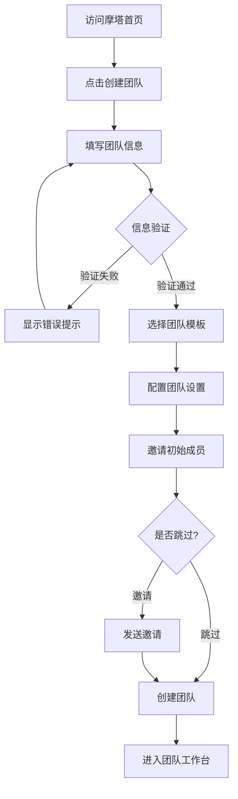
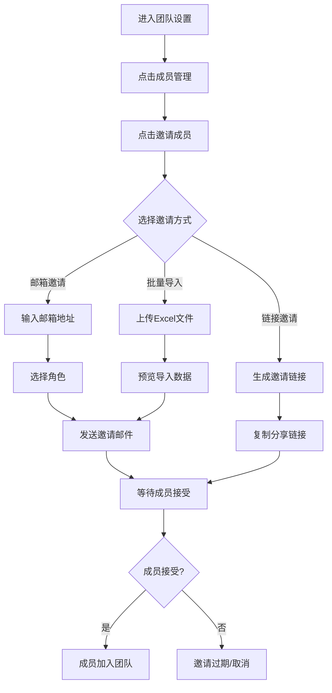
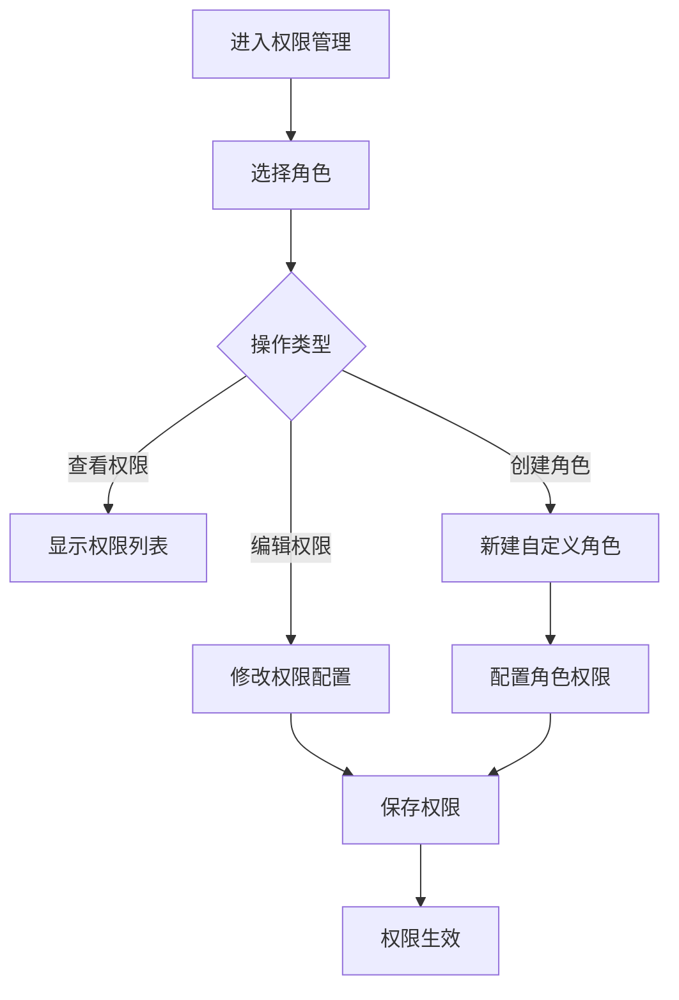
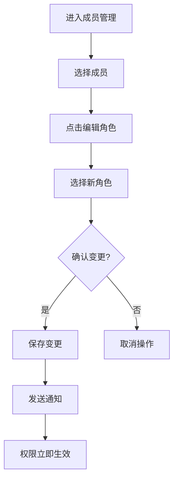
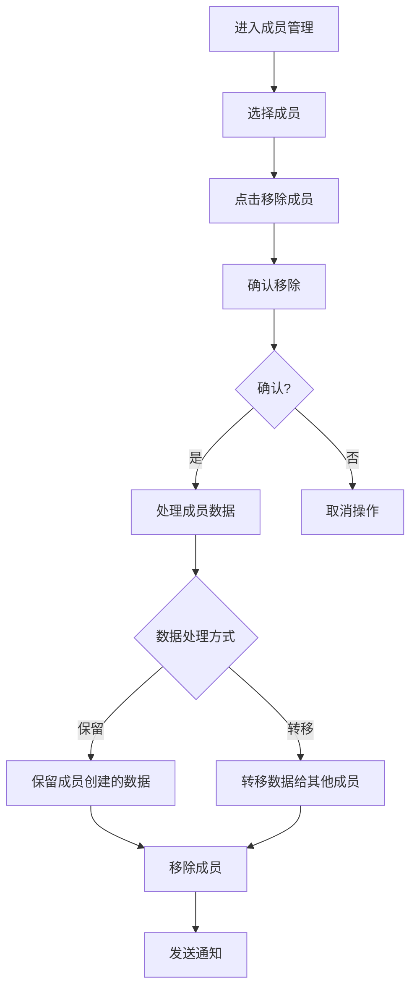

# 团队管理 - 用户流程文档

## 概述

本文档详细描述团队管理模块的所有用户操作流程，包括详细步骤说明、界面交互和异常处理。

---

## 1. 创建团队流程

### 1.1 流程图



### 1.2 详细步骤

#### 步骤1：访问创建团队页面

**操作路径**: 首页 → 点击「创建团队」按钮

**界面说明**:
```
┌─────────────────────────────────────────────────────────────────┐
│  摩塔 Mota                                    [登录] [注册]      │
├─────────────────────────────────────────────────────────────────┤
│                                                                 │
│                    欢迎使用摩塔 Mota                             │
│                 一站式研发协作管理平台                            │
│                                                                 │
│              ┌─────────────┐  ┌─────────────┐                   │
│              │  加入团队    │  │  创建团队   │ ← 点击此按钮       │
│              └─────────────┘  └─────────────┘                   │
│                                                                 │
│                    已有团队？输入邀请码加入                        │
│                    ┌──────────────────────┐                     │
│                    │ 请输入邀请码...       │                     │
│                    └──────────────────────┘                     │
│                                                                 │
└─────────────────────────────────────────────────────────────────┘
```

#### 步骤2：填写团队基本信息

**界面说明**:
```
┌─────────────────────────────────────────────────────────────────┐
│  创建团队                                              步骤 1/4  │
├─────────────────────────────────────────────────────────────────┤
│                                                                 │
│  团队名称 *                                                      │
│  ┌─────────────────────────────────────────────────────────┐   │
│  │ 请输入团队名称（2-50个字符）                              │   │
│  └─────────────────────────────────────────────────────────┘   │
│                                                                 │
│  团队标识 *                                                      │
│  ┌─────────────────────────────────────────────────────────┐   │
│  │ 请输入团队标识（用于URL，仅支持字母、数字、下划线）        │   │
│  └─────────────────────────────────────────────────────────┘   │
│  访问地址预览: https://mota.example.com/t/[团队标识]            │
│                                                                 │
│  团队描述                                                        │
│  ┌─────────────────────────────────────────────────────────┐   │
│  │ 请输入团队描述（选填）                                    │   │
│  │                                                         │   │
│  │                                                         │   │
│  └─────────────────────────────────────────────────────────┘   │
│                                                                 │
│  团队规模                                                        │
│  ○ 1-10人   ○ 11-50人   ○ 51-200人   ○ 200人以上               │
│                                                                 │
│                                        [取消]  [下一步]          │
│                                                                 │
└─────────────────────────────────────────────────────────────────┘
```

**字段说明**:

| 字段 | 必填 | 规则 | 说明 |
|-----|-----|------|------|
| 团队名称 | 是 | 2-50个字符 | 团队的显示名称 |
| 团队标识 | 是 | 3-30个字符，仅字母数字下划线 | 用于URL访问，创建后不可修改 |
| 团队描述 | 否 | 最多500字符 | 团队简介 |
| 团队规模 | 是 | 单选 | 用于推荐合适的配置 |

**验证规则**:
- 团队名称不能为空，长度2-50字符
- 团队标识必须唯一，仅支持字母、数字、下划线
- 团队标识不能以数字开头

**错误提示**:
- "团队名称不能为空"
- "团队标识已被使用，请更换"
- "团队标识格式不正确，仅支持字母、数字、下划线"

#### 步骤3：选择团队模板

**界面说明**:
```
┌─────────────────────────────────────────────────────────────────┐
│  创建团队                                              步骤 2/4  │
├─────────────────────────────────────────────────────────────────┤
│                                                                 │
│  选择团队模板                                                    │
│                                                                 │
│  ┌─────────────────┐  ┌─────────────────┐  ┌─────────────────┐ │
│  │ 🚀 敏捷研发团队  │  │ 📋 传统项目团队  │  │ ⚙️ 空白团队     │ │
│  │                 │  │                 │  │                 │ │
│  │ 适合敏捷开发    │  │ 适合瀑布模式    │  │ 自定义配置      │ │
│  │ 迭代式交付      │  │ 阶段式推进      │  │ 从零开始        │ │
│  │                 │  │                 │  │                 │ │
│  │ 包含:           │  │ 包含:           │  │ 包含:           │ │
│  │ • 迭代管理      │  │ • 里程碑管理    │  │ • 基础项目管理  │ │
│  │ • 看板视图      │  │ • 甘特图        │  │                 │ │
│  │ • 燃尽图        │  │ • 阶段审批      │  │                 │ │
│  │                 │  │                 │  │                 │ │
│  │    [选择] ✓     │  │    [选择]       │  │    [选择]       │ │
│  └─────────────────┘  └─────────────────┘  └─────────────────┘ │
│                                                                 │
│                                   [上一步]  [下一步]             │
│                                                                 │
└─────────────────────────────────────────────────────────────────┘
```

**模板说明**:

| 模板 | 适用场景 | 预设功能 |
|-----|---------|---------|
| 敏捷研发团队 | 互联网产品开发、快速迭代 | 迭代管理、看板、燃尽图、每日站会 |
| 传统项目团队 | 外包项目、合规项目 | 里程碑、甘特图、阶段审批、文档管理 |
| 空白团队 | 自定义需求 | 仅基础功能，可自行配置 |

#### 步骤4：配置团队设置

**界面说明**:
```
┌─────────────────────────────────────────────────────────────────┐
│  创建团队                                              步骤 3/4  │
├─────────────────────────────────────────────────────────────────┤
│                                                                 │
│  团队设置                                                        │
│                                                                 │
│  ┌─ 基础设置 ─────────────────────────────────────────────────┐ │
│  │                                                           │ │
│  │  团队Logo                                                 │ │
│  │  ┌──────┐                                                │ │
│  │  │  📷  │  [上传图片]  支持 JPG、PNG，建议 200x200        │ │
│  │  └──────┘                                                │ │
│  │                                                           │ │
│  │  时区设置                                                 │ │
│  │  [Asia/Shanghai (UTC+8) ▼]                               │ │
│  │                                                           │ │
│  │  工作日设置                                               │ │
│  │  ☑ 周一  ☑ 周二  ☑ 周三  ☑ 周四  ☑ 周五  ☐ 周六  ☐ 周日  │ │
│  │                                                           │ │
│  └───────────────────────────────────────────────────────────┘ │
│                                                                 │
│  ┌─ 功能开关 ─────────────────────────────────────────────────┐ │
│  │                                                           │ │
│  │  ☑ 启用代码托管      ☑ 启用持续集成                       │ │
│  │  ☑ 启用制品管理      ☑ 启用持续部署                       │ │
│  │  ☑ 启用知识管理      ☑ 启用效能洞察                       │ │
│  │                                                           │ │
│  └───────────────────────────────────────────────────────────┘ │
│                                                                 │
│                                   [上一步]  [下一步]             │
│                                                                 │
└─────────────────────────────────────────────────────────────────┘
```

#### 步骤5：邀请初始成员

**界面说明**:
```
┌─────────────────────────────────────────────────────────────────┐
│  创建团队                                              步骤 4/4  │
├─────────────────────────────────────────────────────────────────┤
│                                                                 │
│  邀请团队成员（可跳过，稍后邀请）                                  │
│                                                                 │
│  通过邮箱邀请                                                    │
│  ┌─────────────────────────────────────────────────────────┐   │
│  │ 输入邮箱地址，多个邮箱用逗号分隔                          │   │
│  └─────────────────────────────────────────────────────────┘   │
│                                                                 │
│  已添加成员:                                                     │
│  ┌─────────────────────────────────────────────────────────┐   │
│  │ 👤 zhangsan@example.com          [管理员 ▼]    [删除]    │   │
│  │ 👤 lisi@example.com              [开发者 ▼]    [删除]    │   │
│  │ 👤 wangwu@example.com            [开发者 ▼]    [删除]    │   │
│  └─────────────────────────────────────────────────────────┘   │
│                                                                 │
│  或者复制邀请链接                                                │
│  ┌─────────────────────────────────────────────────────────┐   │
│  │ https://mota.example.com/invite/abc123xyz        [复制]  │   │
│  └─────────────────────────────────────────────────────────┘   │
│  链接有效期: 7天  │  可邀请人数: 不限                            │
│                                                                 │
│                              [跳过]  [完成创建]                  │
│                                                                 │
└─────────────────────────────────────────────────────────────────┘
```

#### 步骤6：创建完成

**界面说明**:
```
┌─────────────────────────────────────────────────────────────────┐
│                                                                 │
│                         🎉 团队创建成功！                        │
│                                                                 │
│                    团队名称: 摩塔研发团队                         │
│                    团队标识: mota-dev                            │
│                    成员数量: 4人                                 │
│                                                                 │
│              ┌─────────────────────────────────────┐            │
│              │                                     │            │
│              │         [进入团队工作台]             │            │
│              │                                     │            │
│              └─────────────────────────────────────┘            │
│                                                                 │
│              快速开始:                                           │
│              • 创建第一个项目                                    │
│              • 完善团队设置                                      │
│              • 邀请更多成员                                      │
│                                                                 │
└─────────────────────────────────────────────────────────────────┘
```

### 1.3 异常处理

| 异常场景 | 处理方式 |
|---------|---------|
| 团队标识已存在 | 提示用户更换标识，建议可用标识 |
| 网络超时 | 显示重试按钮，保留已填写信息 |
| 邮箱格式错误 | 高亮错误邮箱，提示正确格式 |
| 邀请发送失败 | 显示失败邮箱列表，支持重新发送 |

---

## 2. 邀请成员流程

### 2.1 流程图



### 2.2 详细步骤

#### 步骤1：进入成员管理

**操作路径**: 团队设置 → 成员管理 → 邀请成员

**界面说明**:
```
┌─────────────────────────────────────────────────────────────────┐
│  团队设置 / 成员管理                                             │
├─────────────────────────────────────────────────────────────────┤
│                                                                 │
│  [成员列表]  [待处理邀请]  [用户组]                               │
│                                                                 │
│  🔍 搜索成员...                              [+ 邀请成员]        │
│                                                                 │
│  ┌─────────────────────────────────────────────────────────┐   │
│  │ 👤 张三 (zhangsan@example.com)                          │   │
│  │    角色: 团队管理员  │  加入时间: 2024-03-01             │   │
│  ├─────────────────────────────────────────────────────────┤   │
│  │ 👤 李四 (lisi@example.com)                              │   │
│  │    角色: 开发者  │  加入时间: 2024-03-05                 │   │
│  ├─────────────────────────────────────────────────────────┤   │
│  │ 👤 王五 (wangwu@example.com)                            │   │
│  │    角色: 开发者  │  加入时间: 2024-03-10                 │   │
│  └─────────────────────────────────────────────────────────┘   │
│                                                                 │
│  共 3 名成员                                                     │
│                                                                 │
└─────────────────────────────────────────────────────────────────┘
```

#### 步骤2：选择邀请方式

**界面说明**:
```
┌─────────────────────────────────────────────────────────────────┐
│  邀请成员                                                  [×]  │
├─────────────────────────────────────────────────────────────────┤
│                                                                 │
│  [邮箱邀请]  [链接邀请]  [批量导入]                              │
│                                                                 │
│  ─────────────────────────────────────────────────────────────  │
│                                                                 │
│  📧 邮箱邀请                                                     │
│                                                                 │
│  输入成员邮箱（多个邮箱用逗号或换行分隔）                          │
│  ┌─────────────────────────────────────────────────────────┐   │
│  │ user1@example.com                                       │   │
│  │ user2@example.com                                       │   │
│  │ user3@example.com                                       │   │
│  └─────────────────────────────────────────────────────────┘   │
│                                                                 │
│  选择角色                                                        │
│  ┌─────────────────────────────────────────────────────────┐   │
│  │ 开发者                                              ▼   │   │
│  └─────────────────────────────────────────────────────────┘   │
│                                                                 │
│  角色说明:                                                       │
│  • 团队管理员: 拥有团队所有权限                                   │
│  • 开发者: 可参与项目开发，无团队管理权限                          │
│  • 访客: 仅可查看，无编辑权限                                     │
│                                                                 │
│                                        [取消]  [发送邀请]        │
│                                                                 │
└─────────────────────────────────────────────────────────────────┘
```

#### 步骤3：链接邀请方式

**界面说明**:
```
┌─────────────────────────────────────────────────────────────────┐
│  邀请成员                                                  [×]  │
├─────────────────────────────────────────────────────────────────┤
│                                                                 │
│  [邮箱邀请]  [链接邀请]  [批量导入]                              │
│                                                                 │
│  ─────────────────────────────────────────────────────────────  │
│                                                                 │
│  🔗 链接邀请                                                     │
│                                                                 │
│  生成邀请链接，分享给需要加入的成员                               │
│                                                                 │
│  邀请链接                                                        │
│  ┌─────────────────────────────────────────────────────────┐   │
│  │ https://mota.example.com/invite/team123/abc456   [复制] │   │
│  └─────────────────────────────────────────────────────────┘   │
│                                                                 │
│  链接设置                                                        │
│  ├─ 有效期: [7天 ▼]                                             │
│  ├─ 可邀请人数: [不限 ▼]                                        │
│  └─ 默认角色: [开发者 ▼]                                        │
│                                                                 │
│  ⚠️ 请妥善保管邀请链接，任何获得链接的人都可以加入团队            │
│                                                                 │
│                              [重新生成]  [关闭]                  │
│                                                                 │
└─────────────────────────────────────────────────────────────────┘
```

#### 步骤4：批量导入方式

**界面说明**:
```
┌─────────────────────────────────────────────────────────────────┐
│  邀请成员                                                  [×]  │
├─────────────────────────────────────────────────────────────────┤
│                                                                 │
│  [邮箱邀请]  [链接邀请]  [批量导入]                              │
│                                                                 │
│  ─────────────────────────────────────────────────────────────  │
│                                                                 │
│  📥 批量导入                                                     │
│                                                                 │
│  ┌─────────────────────────────────────────────────────────┐   │
│  │                                                         │   │
│  │              📄 点击或拖拽上传 Excel 文件                │   │
│  │                                                         │   │
│  │              支持 .xlsx, .xls 格式                       │   │
│  │              单次最多导入 500 人                         │   │
│  │                                                         │   │
│  └─────────────────────────────────────────────────────────┘   │
│                                                                 │
│  [下载导入模板]                                                  │
│                                                                 │
│  模板格式说明:                                                   │
│  | 姓名 | 邮箱 | 角色 | 部门 |                                  │
│  | 张三 | zhangsan@example.com | 开发者 | 研发部 |              │
│                                                                 │
│                                        [取消]  [开始导入]        │
│                                                                 │
└─────────────────────────────────────────────────────────────────┘
```

### 2.3 异常处理

| 异常场景 | 处理方式 |
|---------|---------|
| 邮箱已是团队成员 | 跳过该邮箱，提示已存在 |
| 邮箱格式错误 | 高亮错误邮箱，阻止提交 |
| 邀请链接过期 | 提示链接已过期，引导重新获取 |
| Excel格式错误 | 显示错误行号和原因 |
| 超出邀请人数限制 | 提示升级套餐或分批邀请 |

---

## 3. 权限配置流程

### 3.1 流程图



### 3.2 详细步骤

#### 步骤1：进入权限管理

**操作路径**: 团队设置 → 权限管理

**界面说明**:
```
┌─────────────────────────────────────────────────────────────────┐
│  团队设置 / 权限管理                                             │
├─────────────────────────────────────────────────────────────────┤
│                                                                 │
│  [角色管理]  [权限配置]                                          │
│                                                                 │
│  系统角色                                          [+ 新建角色]  │
│  ┌─────────────────────────────────────────────────────────┐   │
│  │ 👑 团队所有者                                    [查看]  │   │
│  │    拥有团队所有权限，不可修改                             │   │
│  ├─────────────────────────────────────────────────────────┤   │
│  │ 🔧 团队管理员                              [查看] [编辑]  │   │
│  │    可管理团队设置和成员，无法删除团队                      │   │
│  ├─────────────────────────────────────────────────────────┤   │
│  │ 💻 开发者                                  [查看] [编辑]  │   │
│  │    可参与项目开发，无团队管理权限                         │   │
│  ├─────────────────────────────────────────────────────────┤   │
│  │ 👁️ 访客                                    [查看] [编辑]  │   │
│  │    仅可查看，无编辑权限                                   │   │
│  └─────────────────────────────────────────────────────────┘   │
│                                                                 │
│  自定义角色                                                      │
│  ┌─────────────────────────────────────────────────────────┐   │
│  │ 📋 产品经理                          [查看] [编辑] [删除] │   │
│  │    可管理产品需求和项目规划                               │   │
│  └─────────────────────────────────────────────────────────┘   │
│                                                                 │
└─────────────────────────────────────────────────────────────────┘
```

#### 步骤2：编辑角色权限

**界面说明**:
```
┌─────────────────────────────────────────────────────────────────┐
│  编辑角色: 开发者                                          [×]  │
├─────────────────────────────────────────────────────────────────┤
│                                                                 │
│  角色名称                                                        │
│  ┌─────────────────────────────────────────────────────────┐   │
│  │ 开发者                                                  │   │
│  └─────────────────────────────────────────────────────────┘   │
│                                                                 │
│  角色描述                                                        │
│  ┌─────────────────────────────────────────────────────────┐   │
│  │ 可参与项目开发，无团队管理权限                            │   │
│  └─────────────────────────────────────────────────────────┘   │
│                                                                 │
│  权限配置                                                        │
│  ┌─────────────────────────────────────────────────────────┐   │
│  │ ▼ 项目管理                                              │   │
│  │   ☑ 查看项目        ☑ 创建项目        ☐ 删除项目        │   │
│  │   ☑ 编辑项目设置    ☐ 管理项目成员                       │   │
│  │                                                         │   │
│  │ ▼ 代码托管                                              │   │
│  │   ☑ 查看代码        ☑ 提交代码        ☑ 创建分支        │   │
│  │   ☑ 创建合并请求    ☑ 代码评审        ☐ 合并代码        │   │
│  │                                                         │   │
│  │ ▼ 持续集成                                              │   │
│  │   ☑ 查看构建        ☑ 触发构建        ☐ 配置流水线      │   │
│  │                                                         │   │
│  │ ▼ 制品管理                                              │   │
│  │   ☑ 查看制品        ☑ 上传制品        ☐ 删除制品        │   │
│  │                                                         │   │
│  │ ▼ 持续部署                                              │   │
│  │   ☑ 查看部署        ☐ 执行部署        ☐ 配置部署        │   │
│  └─────────────────────────────────────────────────────────┘   │
│                                                                 │
│                                        [取消]  [保存]           │
│                                                                 │
└─────────────────────────────────────────────────────────────────┘
```

### 3.3 权限说明

| 权限类别 | 权限项 | 说明 |
|---------|-------|------|
| 项目管理 | 查看项目 | 查看项目列表和详情 |
| 项目管理 | 创建项目 | 创建新项目 |
| 项目管理 | 删除项目 | 删除项目及所有数据 |
| 代码托管 | 查看代码 | 浏览代码仓库 |
| 代码托管 | 提交代码 | 推送代码到仓库 |
| 代码托管 | 合并代码 | 执行合并请求合并 |
| 持续集成 | 触发构建 | 手动触发构建任务 |
| 持续集成 | 配置流水线 | 编辑流水线配置 |
| 持续部署 | 执行部署 | 执行部署操作 |
| 持续部署 | 配置部署 | 配置部署策略和环境 |

---

## 4. 成员角色变更流程

### 4.1 流程图



### 4.2 详细步骤

**界面说明**:
```
┌─────────────────────────────────────────────────────────────────┐
│  编辑成员角色                                              [×]  │
├─────────────────────────────────────────────────────────────────┤
│                                                                 │
│  成员信息                                                        │
│  ┌─────────────────────────────────────────────────────────┐   │
│  │ 👤 李四                                                  │   │
│  │    邮箱: lisi@example.com                               │   │
│  │    当前角色: 开发者                                      │   │
│  │    加入时间: 2024-03-05                                 │   │
│  └─────────────────────────────────────────────────────────┘   │
│                                                                 │
│  变更角色                                                        │
│  ┌─────────────────────────────────────────────────────────┐   │
│  │ ○ 团队管理员                                            │   │
│  │   拥有团队所有管理权限                                   │   │
│  │                                                         │   │
│  │ ● 开发者 (当前)                                         │   │
│  │   可参与项目开发，无团队管理权限                          │   │
│  │                                                         │   │
│  │ ○ 产品经理                                              │   │
│  │   可管理产品需求和项目规划                               │   │
│  │                                                         │   │
│  │ ○ 访客                                                  │   │
│  │   仅可查看，无编辑权限                                   │   │
│  └─────────────────────────────────────────────────────────┘   │
│                                                                 │
│  ⚠️ 角色变更后，成员权限将立即生效                              │
│                                                                 │
│                                        [取消]  [确认变更]        │
│                                                                 │
└─────────────────────────────────────────────────────────────────┘
```

---

## 5. 移除成员流程

### 5.1 流程图



### 5.2 详细步骤

**界面说明**:
```
┌─────────────────────────────────────────────────────────────────┐
│  移除成员                                                  [×]  │
├─────────────────────────────────────────────────────────────────┤
│                                                                 │
│  ⚠️ 确定要移除以下成员吗？                                       │
│                                                                 │
│  ┌─────────────────────────────────────────────────────────┐   │
│  │ 👤 李四                                                  │   │
│  │    邮箱: lisi@example.com                               │   │
│  │    角色: 开发者                                          │   │
│  │    加入时间: 2024-03-05                                 │   │
│  └─────────────────────────────────────────────────────────┘   │
│                                                                 │
│  该成员的数据统计:                                               │
│  • 创建的任务: 23 个                                            │
│  • 负责的任务: 15 个                                            │
│  • 代码提交: 156 次                                             │
│  • 创建的文档: 8 篇                                             │
│                                                                 │
│  数据处理方式                                                    │
│  ○ 保留数据 - 成员创建的数据保留，负责人置空                      │
│  ● 转移数据 - 将负责的任务转移给:                                │
│    ┌─────────────────────────────────────────────────────┐     │
│    │ 选择成员...                                      ▼  │     │
│    └─────────────────────────────────────────────────────┘     │
│                                                                 │
│  ⚠️ 移除后，该成员将无法访问团队任何资源                          │
│                                                                 │
│                                        [取消]  [确认移除]        │
│                                                                 │
└─────────────────────────────────────────────────────────────────┘
```

---

## 6. 团队设置流程

### 6.1 基本信息设置

**界面说明**:
```
┌─────────────────────────────────────────────────────────────────┐
│  团队设置 / 基本信息                                             │
├─────────────────────────────────────────────────────────────────┤
│                                                                 │
│  团队Logo                                                        │
│  ┌──────┐                                                       │
│  │ 🏢   │  [更换Logo]  [删除]                                   │
│  └──────┘                                                       │
│                                                                 │
│  团队名称 *                                                      │
│  ┌─────────────────────────────────────────────────────────┐   │
│  │ 摩塔研发团队                                             │   │
│  └─────────────────────────────────────────────────────────┘   │
│                                                                 │
│  团队标识                                                        │
│  ┌─────────────────────────────────────────────────────────┐   │
│  │ mota-dev                                          🔒    │   │
│  └─────────────────────────────────────────────────────────┘   │
│  团队标识创建后不可修改                                          │
│                                                                 │
│  团队描述                                                        │
│  ┌─────────────────────────────────────────────────────────┐   │
│  │ 摩塔产品研发团队，负责摩塔平台的开发和维护                 │   │
│  │                                                         │   │
│  └─────────────────────────────────────────────────────────┘   │
│                                                                 │
│  团队公告                                                        │
│  ┌─────────────────────────────────────────────────────────┐   │
│  │ 本周五下午3点全员会议，请准时参加                         │   │
│  │                                                         │   │
│  └─────────────────────────────────────────────────────────┘   │
│  ☑ 在团队首页显示公告                                           │
│                                                                 │
│                                                    [保存设置]    │
│                                                                 │
└─────────────────────────────────────────────────────────────────┘
```

### 6.2 安全设置

**界面说明**:
```
┌─────────────────────────────────────────────────────────────────┐
│  团队设置 / 安全设置                                             │
├─────────────────────────────────────────────────────────────────┤
│                                                                 │
│  登录安全                                                        │
│  ┌─────────────────────────────────────────────────────────┐   │
│  │ ☑ 启用双因素认证                                        │   │
│  │   成员登录时需要进行二次验证                             │   │
│  │                                                         │   │
│  │ ☑ 登录失败锁定                                          │   │
│  │   连续 [5] 次登录失败后锁定账号 [30] 分钟               │   │
│  │                                                         │   │
│  │ ☐ IP白名单                                              │   │
│  │   仅允许指定IP地址访问团队                               │   │
│  └─────────────────────────────────────────────────────────┘   │
│                                                                 │
│  密码策略                                                        │
│  ┌─────────────────────────────────────────────────────────┐   │
│  │ 最小密码长度: [8] 位                                    │   │
│  │                                                         │   │
│  │ 密码复杂度要求:                                         │   │
│  │ ☑ 必须包含大写字母                                      │   │
│  │ ☑ 必须包含小写字母                                      │   │
│  │ ☑ 必须包含数字                                          │   │
│  │ ☐ 必须包含特殊字符                                      │   │
│  │                                                         │   │
│  │ 密码有效期: [90] 天 (0表示永不过期)                     │   │
│  └─────────────────────────────────────────────────────────┘   │
│                                                                 │
│  会话管理                                                        │
│  ┌─────────────────────────────────────────────────────────┐   │
│  │ 会话超时时间: [24] 小时                                 │   │
│  │ ☑ 允许同时登录多个设备                                  │   │
│  └─────────────────────────────────────────────────────────┘   │
│                                                                 │
│                                                    [保存设置]    │
│                                                                 │
└─────────────────────────────────────────────────────────────────┘
```

---

## 7. 常见问题

### Q1: 如何转让团队所有权？
**A**: 团队设置 → 高级设置 → 转让团队，选择新的所有者并确认。转让后原所有者将变为管理员角色。

### Q2: 成员忘记密码怎么办？
**A**: 成员可以在登录页点击"忘记密码"，通过邮箱重置密码。管理员也可以在成员管理中重置成员密码。

### Q3: 如何批量修改成员角色？
**A**: 成员管理 → 勾选多个成员 → 批量操作 → 修改角色。

### Q4: 邀请链接可以设置使用次数吗？
**A**: 可以。生成邀请链接时可以设置"可邀请人数"，达到限制后链接自动失效。

### Q5: 如何查看成员的操作记录？
**A**: 团队设置 → 审计日志，可以查看所有成员的操作记录。

---

*摩塔 Mota - 为研发团队打造的数字化软件工厂*