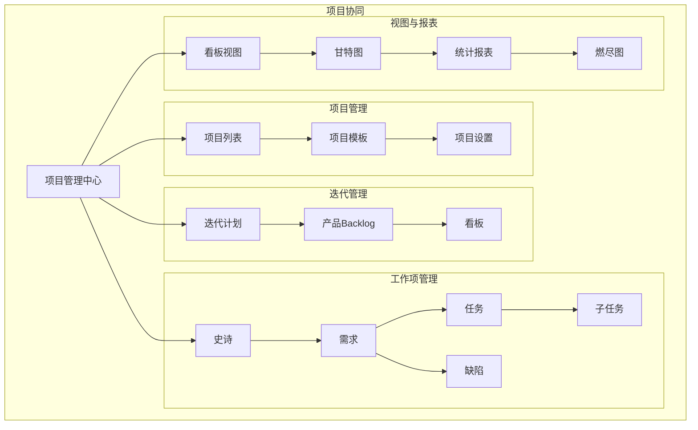
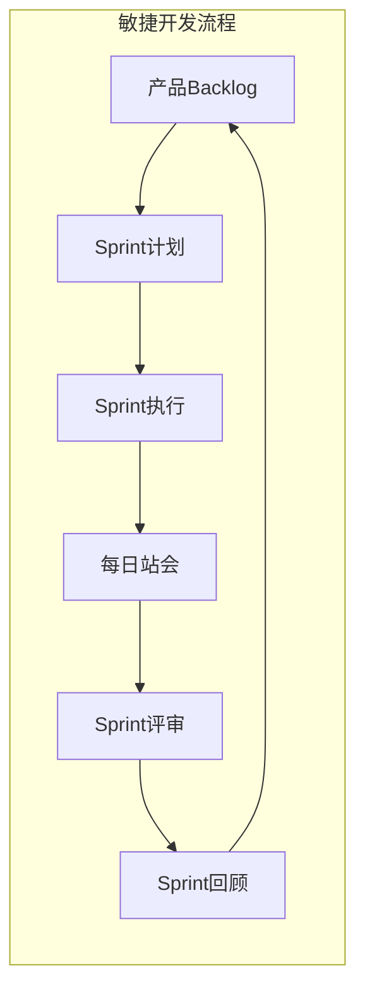
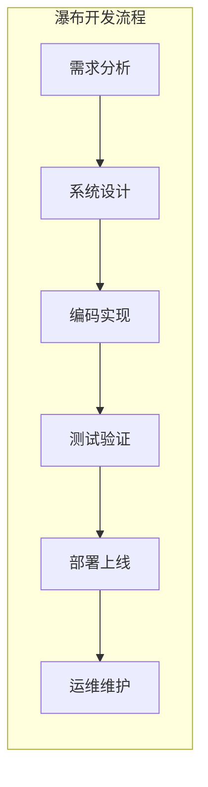
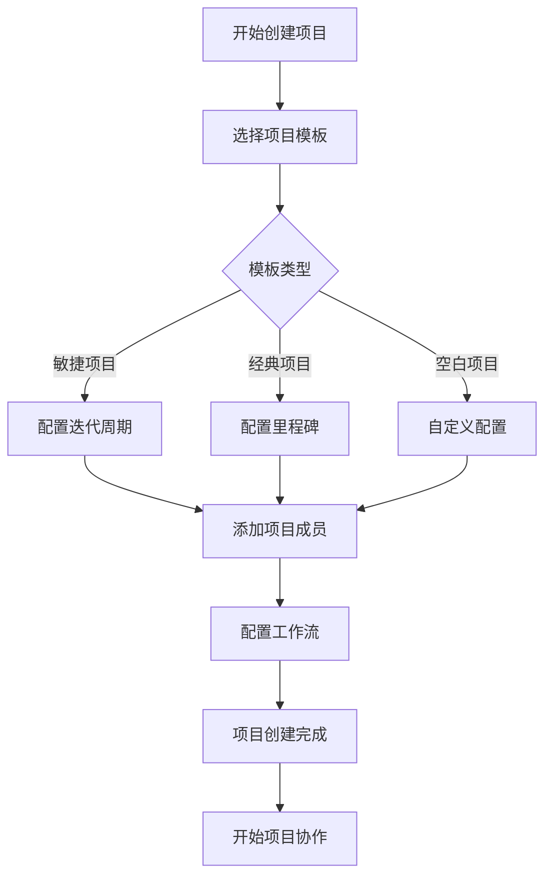
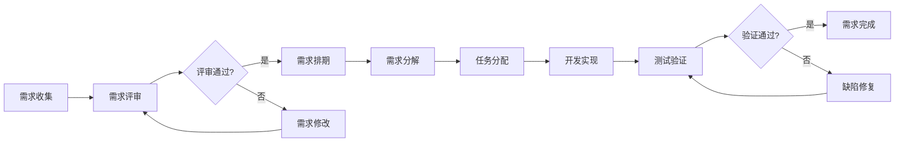
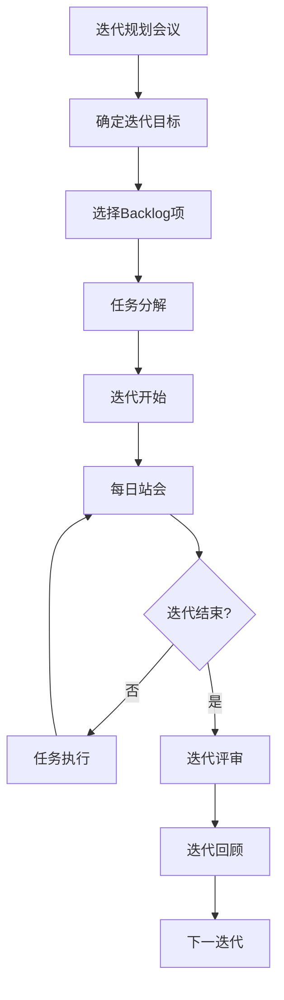
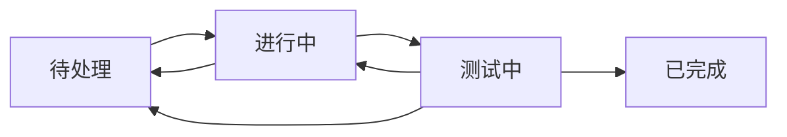

# 项目协同 - 功能概述

## 1. 模块简介

项目协同是摩塔 Mota 平台的协作支撑模块，提供轻量级的项目管理能力，帮助团队高效管理方案项目、任务分配和进度跟踪，与AI方案生成模块深度集成，实现从方案生成到项目执行的闭环管理。

## 2. 功能架构



## 3. 项目管理模式

### 3.1 敏捷模式（Scrum）



**特点**:
- 迭代式开发
- 快速响应变化
- 持续交付价值
- 团队自组织

**适用场景**:
- 互联网产品开发
- 需求变化频繁的项目
- 创新型项目

### 3.2 瀑布模式（经典）



**特点**:
- 阶段式推进
- 文档驱动
- 严格的里程碑
- 变更控制

**适用场景**:
- 需求明确的项目
- 合规性要求高的项目
- 外包项目

## 4. 核心功能

### 4.1 项目管理

| 功能 | 描述 |
|-----|------|
| 创建项目 | 创建新项目，选择项目模板 |
| 项目设置 | 配置项目基本信息、成员、权限 |
| 项目模板 | 预设项目模板，快速创建项目 |
| 项目归档 | 归档已完成的项目 |
| 项目集 | 管理多个相关项目 |

### 4.2 工作项管理

| 工作项类型 | 描述 | 层级关系 |
|-----------|------|---------|
| 史诗（Epic） | 大型功能或业务目标 | 最高层级 |
| 需求（Story） | 用户故事或功能需求 | 属于史诗 |
| 任务（Task） | 具体的开发任务 | 属于需求 |
| 缺陷（Bug） | 软件缺陷或问题 | 独立或关联需求 |
| 子任务（Subtask） | 任务的细分项 | 属于任务 |

### 4.3 迭代管理

| 功能 | 描述 |
|-----|------|
| 创建迭代 | 创建新的迭代周期 |
| 迭代规划 | 将工作项规划到迭代 |
| 迭代看板 | 查看迭代进度 |
| 迭代燃尽图 | 查看迭代燃尽趋势 |
| 迭代回顾 | 迭代结束后的回顾总结 |

### 4.4 视图与报表

| 视图类型 | 描述 |
|---------|------|
| 列表视图 | 工作项列表展示 |
| 看板视图 | 卡片式看板展示 |
| 甘特图 | 时间线视图 |
| 日历视图 | 日历形式展示 |
| 统计报表 | 多维度统计分析 |

## 5. 用户流程

### 5.1 项目创建流程



### 5.2 需求管理流程



### 5.3 迭代执行流程



## 6. 界面设计

### 6.1 项目列表页

```
┌─────────────────────────────────────────────────────────────────┐
│  项目列表                                      [+ 创建项目]      │
├─────────────────────────────────────────────────────────────────┤
│  🔍 搜索项目...              筛选: [全部▼] [进行中▼] [我参与▼]   │
├─────────────────────────────────────────────────────────────────┤
│                                                                 │
│  ┌─────────────────────────────────────────────────────────┐   │
│  │ 📁 摩塔核心平台                                    ⭐ ⚙️  │   │
│  │ 一站式研发协作管理平台                                    │   │
│  │ 👥 12人  📋 45个需求  🐛 8个缺陷  📅 更新于 2小时前       │   │
│  ├─────────────────────────────────────────────────────────┤   │
│  │ 📁 用户中心服务                                    ⭐ ⚙️  │   │
│  │ 统一用户认证和管理服务                                    │   │
│  │ 👥 6人   📋 23个需求  🐛 3个缺陷  📅 更新于 1天前         │   │
│  ├─────────────────────────────────────────────────────────┤   │
│  │ 📁 数据分析平台                                       ⚙️  │   │
│  │ 研发效能数据分析平台                                      │   │
│  │ 👥 8人   📋 34个需求  🐛 5个缺陷  📅 更新于 3天前         │   │
│  └─────────────────────────────────────────────────────────┘   │
│                                                                 │
│  共 15 个项目                               < 1 2 3 ... >       │
│                                                                 │
└─────────────────────────────────────────────────────────────────┘
```

### 6.2 项目概览页

```
┌─────────────────────────────────────────────────────────────────┐
│  摩塔核心平台 / 概览                                             │
├─────────────────────────────────────────────────────────────────┤
│                                                                 │
│  📊 项目统计                                                     │
│  ┌──────────┐ ┌──────────┐ ┌──────────┐ ┌──────────┐           │
│  │ 总需求数  │ │ 进行中   │ │ 已完成   │ │ 待处理缺陷│           │
│  │   45     │ │   12     │ │   28     │ │    8     │           │
│  └──────────┘ └──────────┘ └──────────┘ └──────────┘           │
│                                                                 │
│  📅 当前迭代: Sprint 12 (2024-03-11 ~ 2024-03-24)               │
│  ┌─────────────────────────────────────────────────────────┐   │
│  │ 迭代进度                                                 │   │
│  │ ████████████████████░░░░░░░░░░  65%                     │   │
│  │                                                         │   │
│  │ 待处理: 5  │  进行中: 8  │  已完成: 15                    │   │
│  └─────────────────────────────────────────────────────────┘   │
│                                                                 │
│  📈 燃尽图                                                       │
│  ┌─────────────────────────────────────────────────────────┐   │
│  │     ╲                                                   │   │
│  │      ╲  理想线                                          │   │
│  │       ╲                                                 │   │
│  │    ────╲────                                            │   │
│  │          ╲   实际线                                      │   │
│  │           ╲                                             │   │
│  │            ╲                                            │   │
│  └─────────────────────────────────────────────────────────┘   │
│                                                                 │
│  🕐 最近活动                                                     │
│  ├─ 张三 完成了任务「用户登录功能」              10分钟前         │
│  ├─ 李四 创建了缺陷「登录页面样式问题」          30分钟前         │
│  └─ 王五 提交了代码到 feature/user-center       1小时前         │
│                                                                 │
└─────────────────────────────────────────────────────────────────┘
```

### 6.3 看板视图

```
┌─────────────────────────────────────────────────────────────────┐
│  摩塔核心平台 / 看板                    [筛选▼] [分组▼] [+ 新建] │
├─────────────────────────────────────────────────────────────────┤
│                                                                 │
│  待处理 (5)      │  进行中 (8)      │  测试中 (3)    │  已完成 (15)│
│  ───────────────┼─────────────────┼───────────────┼────────────│
│  ┌───────────┐  │  ┌───────────┐  │  ┌───────────┐│  ┌────────┐│
│  │ #101      │  │  │ #98       │  │  │ #95      ││  │ #92    ││
│  │ 用户注册   │  │  │ 用户登录   │  │  │ 密码重置  ││  │ 首页   ││
│  │ 功能开发   │  │  │ 功能开发   │  │  │ 功能测试  ││  │ 优化   ││
│  │ 👤 待分配  │  │  │ 👤 张三    │  │  │ 👤 王五   ││  │ 👤 李四 ││
│  │ 📅 03-20  │  │  │ 📅 03-18  │  │  │ 📅 03-15 ││  │ ✓ 完成 ││
│  └───────────┘  │  └───────────┘  │  └───────────┘│  └────────┘│
│  ┌───────────┐  │  ┌───────────┐  │  ┌───────────┐│  ┌────────┐│
│  │ #102      │  │  │ #99       │  │  │ #96      ││  │ #93    ││
│  │ 权限管理   │  │  │ 角色配置   │  │  │ 权限校验  ││  │ 日志   ││
│  │ 需求分析   │  │  │ 功能开发   │  │  │ 功能测试  ││  │ 记录   ││
│  │ 👤 待分配  │  │  │ 👤 李四    │  │  │ 👤 赵六   ││  │ 👤 张三 ││
│  │ 📅 03-22  │  │  │ 📅 03-19  │  │  │ 📅 03-16 ││  │ ✓ 完成 ││
│  └───────────┘  │  └───────────┘  │  └───────────┘│  └────────┘│
│                 │                 │               │            │
│  [+ 添加卡片]   │  [+ 添加卡片]   │  [+ 添加卡片] │            │
│                                                                 │
└─────────────────────────────────────────────────────────────────┘
```

### 6.4 甘特图视图

```
┌─────────────────────────────────────────────────────────────────┐
│  摩塔核心平台 / 甘特图                          [今天] [周▼]     │
├─────────────────────────────────────────────────────────────────┤
│                                                                 │
│  工作项          │ 03-11 │ 03-12 │ 03-13 │ 03-14 │ 03-15 │ ... │
│  ────────────────┼───────┼───────┼───────┼───────┼───────┼─────│
│  ▼ Sprint 12     │███████████████████████████████████████│     │
│    ├─ 用户模块   │  ████████████████████                 │     │
│    │  ├─ 登录    │  ██████████                           │     │
│    │  ├─ 注册    │       ████████████                    │     │
│    │  └─ 密码    │            ████████                   │     │
│    ├─ 权限模块   │       ████████████████████            │     │
│    │  ├─ 角色    │       ██████████                      │     │
│    │  └─ 权限    │            ████████████               │     │
│    └─ 日志模块   │                 ████████████████      │     │
│                  │       │       │   ▼   │       │       │     │
│                  │       │       │  今天  │       │       │     │
│                                                                 │
│  图例: ███ 进行中  ░░░ 已完成  ─── 延期                          │
│                                                                 │
└─────────────────────────────────────────────────────────────────┘
```

## 7. 数据模型

### 7.1 项目数据模型

```
Project (项目)
├── id: 项目ID
├── team_id: 所属团队ID
├── name: 项目名称
├── key: 项目标识
├── description: 项目描述
├── template_type: 模板类型 (agile/waterfall/blank)
├── status: 状态 (active/archived)
├── owner_id: 负责人ID
├── settings: 项目设置
├── created_at: 创建时间
└── updated_at: 更新时间

Issue (工作项)
├── id: 工作项ID
├── project_id: 所属项目ID
├── type: 类型 (epic/story/task/bug/subtask)
├── title: 标题
├── description: 描述
├── status: 状态
├── priority: 优先级
├── assignee_id: 负责人ID
├── reporter_id: 创建人ID
├── parent_id: 父工作项ID
├── sprint_id: 所属迭代ID
├── story_points: 故事点
├── estimated_hours: 预估工时
├── actual_hours: 实际工时
├── due_date: 截止日期
├── labels: 标签
├── created_at: 创建时间
└── updated_at: 更新时间

Sprint (迭代)
├── id: 迭代ID
├── project_id: 所属项目ID
├── name: 迭代名称
├── goal: 迭代目标
├── start_date: 开始日期
├── end_date: 结束日期
├── status: 状态 (planning/active/completed)
├── created_at: 创建时间
└── updated_at: 更新时间
```

## 8. 工作流配置

### 8.1 默认工作流



### 8.2 自定义工作流

支持自定义工作流状态和流转规则：

| 配置项 | 描述 |
|-------|------|
| 状态定义 | 自定义状态名称和类型 |
| 流转规则 | 定义状态间的流转关系 |
| 流转条件 | 设置流转的前置条件 |
| 流转动作 | 流转时触发的自动动作 |
| 权限控制 | 控制谁可以执行流转 |

---

*摩塔 Mota - 让每家企业都拥有懂自己业务的AI助手*