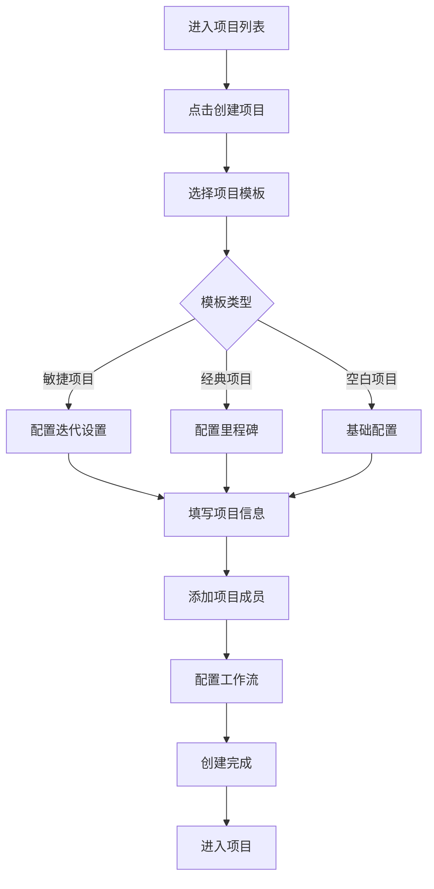
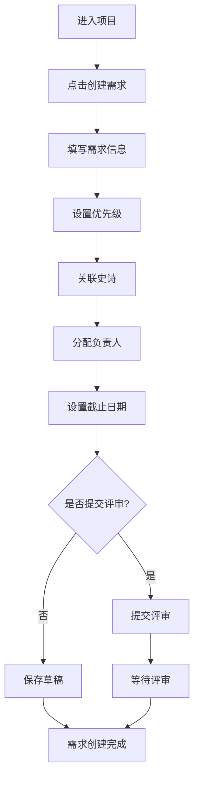
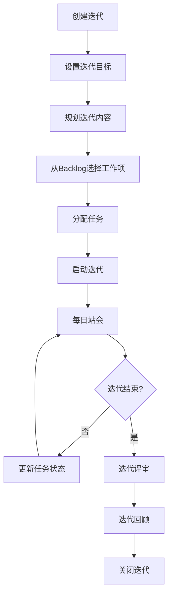
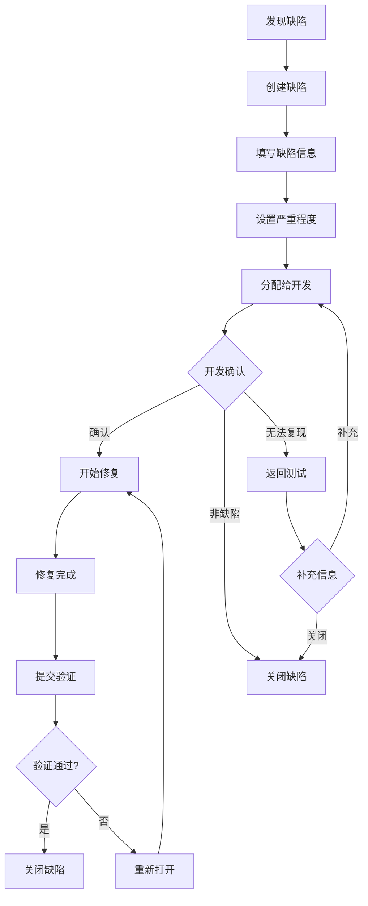
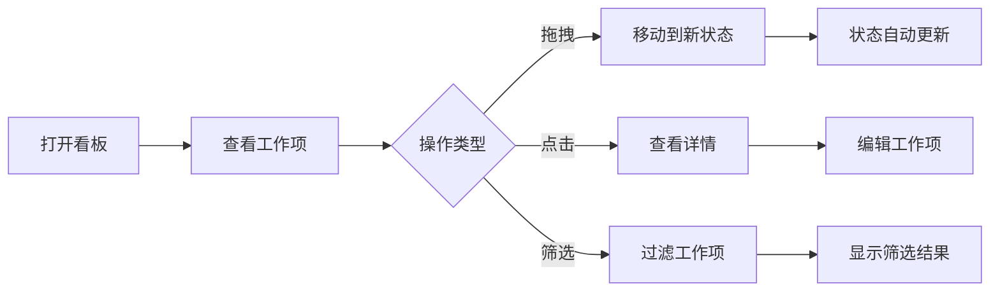

# 项目协同 - 用户流程文档

## 概述

本文档详细描述项目协同模块的所有用户操作流程，包括项目管理、需求管理、任务管理、迭代管理等核心流程。

---

## 1. 创建项目流程

### 1.1 流程图



### 1.2 详细步骤

#### 步骤1：选择项目模板

**操作路径**: 项目列表 → 创建项目

**界面说明**:
```
┌─────────────────────────────────────────────────────────────────┐
│  创建项目                                              步骤 1/4  │
├─────────────────────────────────────────────────────────────────┤
│                                                                 │
│  选择项目模板                                                    │
│                                                                 │
│  ┌─────────────────┐  ┌─────────────────┐  ┌─────────────────┐ │
│  │ 🚀 敏捷项目      │  │ 📋 经典项目      │  │ ⚙️ 空白项目     │ │
│  │    (Scrum)      │  │   (瀑布)        │  │                 │ │
│  │                 │  │                 │  │                 │ │
│  │ 适合:           │  │ 适合:           │  │ 适合:           │ │
│  │ • 互联网产品    │  │ • 外包项目      │  │ • 自定义需求    │ │
│  │ • 快速迭代      │  │ • 合规项目      │  │ • 特殊场景      │ │
│  │ • 需求多变      │  │ • 需求明确      │  │                 │ │
│  │                 │  │                 │  │                 │ │
│  │ 包含:           │  │ 包含:           │  │ 包含:           │ │
│  │ • 迭代管理      │  │ • 里程碑        │  │ • 基础任务管理  │ │
│  │ • 看板视图      │  │ • 甘特图        │  │                 │ │
│  │ • 燃尽图        │  │ • 阶段审批      │  │                 │ │
│  │ • 每日站会      │  │ • 文档管理      │  │                 │ │
│  │                 │  │                 │  │                 │ │
│  │    [选择] ✓     │  │    [选择]       │  │    [选择]       │ │
│  └─────────────────┘  └─────────────────┘  └─────────────────┘ │
│                                                                 │
│                                             [取消]  [下一步]     │
│                                                                 │
└─────────────────────────────────────────────────────────────────┘
```

#### 步骤2：填写项目信息

**界面说明**:
```
┌─────────────────────────────────────────────────────────────────┐
│  创建项目                                              步骤 2/4  │
├─────────────────────────────────────────────────────────────────┤
│                                                                 │
│  项目名称 *                                                      │
│  ┌─────────────────────────────────────────────────────────┐   │
│  │ 摩塔核心平台                                             │   │
│  └─────────────────────────────────────────────────────────┘   │
│                                                                 │
│  项目标识 *                                                      │
│  ┌─────────────────────────────────────────────────────────┐   │
│  │ MOTA                                                    │   │
│  └─────────────────────────────────────────────────────────┘   │
│  用于工作项编号前缀，如 MOTA-101                                 │
│                                                                 │
│  项目描述                                                        │
│  ┌─────────────────────────────────────────────────────────┐   │
│  │ 摩塔一站式研发协作管理平台核心功能开发项目                 │   │
│  │                                                         │   │
│  └─────────────────────────────────────────────────────────┘   │
│                                                                 │
│  项目负责人 *                                                    │
│  ┌─────────────────────────────────────────────────────────┐   │
│  │ 👤 张三                                             ▼   │   │
│  └─────────────────────────────────────────────────────────┘   │
│                                                                 │
│  计划周期                                                        │
│  开始日期: [2024-03-01]  结束日期: [2024-12-31]                 │
│                                                                 │
│                                   [上一步]  [下一步]             │
│                                                                 │
└─────────────────────────────────────────────────────────────────┘
```

#### 步骤3：添加项目成员

**界面说明**:
```
┌─────────────────────────────────────────────────────────────────┐
│  创建项目                                              步骤 3/4  │
├─────────────────────────────────────────────────────────────────┤
│                                                                 │
│  添加项目成员                                                    │
│                                                                 │
│  从团队成员中选择                                                │
│  ┌─────────────────────────────────────────────────────────┐   │
│  │ 🔍 搜索成员...                                          │   │
│  └─────────────────────────────────────────────────────────┘   │
│                                                                 │
│  ┌─────────────────────────────────────────────────────────┐   │
│  │ ☑ 👤 张三 (zhangsan@example.com)        [项目管理员 ▼]  │   │
│  │ ☑ 👤 李四 (lisi@example.com)            [开发者 ▼]      │   │
│  │ ☑ 👤 王五 (wangwu@example.com)          [开发者 ▼]      │   │
│  │ ☐ 👤 赵六 (zhaoliu@example.com)         [测试 ▼]        │   │
│  │ ☐ 👤 钱七 (qianqi@example.com)          [访客 ▼]        │   │
│  └─────────────────────────────────────────────────────────┘   │
│                                                                 │
│  已选择 3 名成员                                                 │
│                                                                 │
│  项目角色说明:                                                   │
│  • 项目管理员: 可管理项目设置和成员                              │
│  • 开发者: 可创建和处理工作项                                    │
│  • 测试: 可创建缺陷和执行测试                                    │
│  • 访客: 仅可查看项目内容                                        │
│                                                                 │
│                                   [上一步]  [下一步]             │
│                                                                 │
└─────────────────────────────────────────────────────────────────┘
```

#### 步骤4：配置工作流

**界面说明**:
```
┌─────────────────────────────────────────────────────────────────┐
│  创建项目                                              步骤 4/4  │
├─────────────────────────────────────────────────────────────────┤
│                                                                 │
│  配置工作流                                                      │
│                                                                 │
│  需求工作流                                                      │
│  ┌─────────────────────────────────────────────────────────┐   │
│  │ [待评审] → [已评审] → [开发中] → [测试中] → [已完成]     │   │
│  │                                            [自定义]      │   │
│  └─────────────────────────────────────────────────────────┘   │
│                                                                 │
│  任务工作流                                                      │
│  ┌─────────────────────────────────────────────────────────┐   │
│  │ [待处理] → [进行中] → [已完成]                           │   │
│  │                                            [自定义]      │   │
│  └─────────────────────────────────────────────────────────┘   │
│                                                                 │
│  缺陷工作流                                                      │
│  ┌─────────────────────────────────────────────────────────┐   │
│  │ [待确认] → [已确认] → [修复中] → [待验证] → [已关闭]     │   │
│  │                                            [自定义]      │   │
│  └─────────────────────────────────────────────────────────┘   │
│                                                                 │
│  ☑ 使用默认工作流（可在项目设置中修改）                          │
│                                                                 │
│                                   [上一步]  [完成创建]           │
│                                                                 │
└─────────────────────────────────────────────────────────────────┘
```

### 1.3 异常处理

| 异常场景 | 处理方式 |
|---------|---------|
| 项目标识已存在 | 提示更换标识，建议可用标识 |
| 必填字段为空 | 高亮必填字段，阻止下一步 |
| 无项目创建权限 | 提示联系团队管理员 |

---

## 2. 创建需求流程

### 2.1 流程图



### 2.2 详细步骤

#### 步骤1：创建需求

**操作路径**: 项目 → 需求 → 创建需求

**界面说明**:
```
┌─────────────────────────────────────────────────────────────────┐
│  创建需求                                                  [×]  │
├─────────────────────────────────────────────────────────────────┤
│                                                                 │
│  需求标题 *                                                      │
│  ┌─────────────────────────────────────────────────────────┐   │
│  │ 用户登录功能                                             │   │
│  └─────────────────────────────────────────────────────────┘   │
│                                                                 │
│  需求描述                                                        │
│  ┌─────────────────────────────────────────────────────────┐   │
│  │ B I U 📎 🔗 📷 </> ≡                                    │   │
│  ├─────────────────────────────────────────────────────────┤   │
│  │ ## 用户故事                                             │   │
│  │ 作为一个用户，我希望能够通过账号密码登录系统，            │   │
│  │ 以便访问我的个人工作台。                                 │   │
│  │                                                         │   │
│  │ ## 验收标准                                             │   │
│  │ 1. 支持邮箱/手机号登录                                  │   │
│  │ 2. 支持记住登录状态                                     │   │
│  │ 3. 登录失败显示错误提示                                 │   │
│  │ 4. 支持忘记密码功能                                     │   │
│  └─────────────────────────────────────────────────────────┘   │
│                                                                 │
│  ┌─ 基本信息 ─────────────────────────────────────────────────┐ │
│  │                                                           │ │
│  │  所属史诗          优先级            故事点               │ │
│  │  [用户模块 ▼]      [高 ▼]            [5 ▼]               │ │
│  │                                                           │ │
│  │  负责人            截止日期          迭代                 │ │
│  │  [张三 ▼]          [2024-03-20]      [Sprint 12 ▼]       │ │
│  │                                                           │ │
│  └───────────────────────────────────────────────────────────┘ │
│                                                                 │
│  标签: [+ 添加标签]  前端  登录  用户体验                        │
│                                                                 │
│                              [保存草稿]  [提交评审]  [创建]      │
│                                                                 │
└─────────────────────────────────────────────────────────────────┘
```

#### 步骤2：需求评审

**界面说明**:
```
┌─────────────────────────────────────────────────────────────────┐
│  需求评审 - MOTA-101 用户登录功能                                │
├─────────────────────────────────────────────────────────────────┤
│                                                                 │
│  评审状态: 🟡 评审中                                             │
│                                                                 │
│  评审人                                                          │
│  ┌─────────────────────────────────────────────────────────┐   │
│  │ 👤 李四 (产品经理)           ✅ 已通过                    │   │
│  │    评审意见: 需求描述清晰，验收标准明确                   │   │
│  │                                                         │   │
│  │ 👤 王五 (技术负责人)         ⏳ 待评审                    │   │
│  │                                                         │   │
│  │ 👤 赵六 (测试负责人)         ❌ 需修改                    │   │
│  │    评审意见: 建议补充异常场景的处理说明                   │   │
│  └─────────────────────────────────────────────────────────┘   │
│                                                                 │
│  评审进度: 1/3 通过                                              │
│                                                                 │
│  添加评审意见                                                    │
│  ┌─────────────────────────────────────────────────────────┐   │
│  │ 请输入您的评审意见...                                    │   │
│  └─────────────────────────────────────────────────────────┘   │
│                                                                 │
│                    [需要修改]  [评论]  [通过]                    │
│                                                                 │
└─────────────────────────────────────────────────────────────────┘
```

### 2.3 需求分解流程

**界面说明**:
```
┌─────────────────────────────────────────────────────────────────┐
│  MOTA-101 用户登录功能 / 分解任务                                │
├─────────────────────────────────────────────────────────────────┤
│                                                                 │
│  将需求分解为开发任务                              [+ 添加任务]  │
│                                                                 │
│  ┌─────────────────────────────────────────────────────────┐   │
│  │ ☐ MOTA-102 设计登录页面UI                               │   │
│  │   负责人: 设计师小明  │  预估: 2天  │  状态: 待处理       │   │
│  ├─────────────────────────────────────────────────────────┤   │
│  │ ☐ MOTA-103 实现登录接口                                 │   │
│  │   负责人: 后端张三    │  预估: 3天  │  状态: 待处理       │   │
│  ├─────────────────────────────────────────────────────────┤   │
│  │ ☐ MOTA-104 实现登录页面前端                             │   │
│  │   负责人: 前端李四    │  预估: 2天  │  状态: 待处理       │   │
│  ├─────────────────────────────────────────────────────────┤   │
│  │ ☐ MOTA-105 登录功能联调测试                             │   │
│  │   负责人: 测试王五    │  预估: 1天  │  状态: 待处理       │   │
│  └─────────────────────────────────────────────────────────┘   │
│                                                                 │
│  任务汇总: 4个任务  │  总预估: 8天  │  已完成: 0个              │
│                                                                 │
│  快速添加任务                                                    │
│  ┌─────────────────────────────────────────────────────────┐   │
│  │ 输入任务标题，按回车创建...                              │   │
│  └─────────────────────────────────────────────────────────┘   │
│                                                                 │
└─────────────────────────────────────────────────────────────────┘
```

---

## 3. 迭代管理流程

### 3.1 流程图



### 3.2 详细步骤

#### 步骤1：创建迭代

**操作路径**: 项目 → 迭代 → 创建迭代

**界面说明**:
```
┌─────────────────────────────────────────────────────────────────┐
│  创建迭代                                                  [×]  │
├─────────────────────────────────────────────────────────────────┤
│                                                                 │
│  迭代名称 *                                                      │
│  ┌─────────────────────────────────────────────────────────┐   │
│  │ Sprint 12                                               │   │
│  └─────────────────────────────────────────────────────────┘   │
│                                                                 │
│  迭代目标                                                        │
│  ┌─────────────────────────────────────────────────────────┐   │
│  │ 完成用户登录和注册功能，实现基础的用户认证体系            │   │
│  │                                                         │   │
│  └─────────────────────────────────────────────────────────┘   │
│                                                                 │
│  迭代周期                                                        │
│  开始日期: [2024-03-11]  结束日期: [2024-03-24]                 │
│  迭代时长: 2 周                                                  │
│                                                                 │
│  迭代容量                                                        │
│  ┌─────────────────────────────────────────────────────────┐   │
│  │ 故事点容量: [40]  │  工时容量: [160] 小时                │   │
│  └─────────────────────────────────────────────────────────┘   │
│                                                                 │
│                                        [取消]  [创建迭代]        │
│                                                                 │
└─────────────────────────────────────────────────────────────────┘
```

#### 步骤2：迭代规划

**界面说明**:
```
┌─────────────────────────────────────────────────────────────────┐
│  Sprint 12 - 迭代规划                                            │
├─────────────────────────────────────────────────────────────────┤
│                                                                 │
│  产品Backlog                    │  Sprint 12 待办               │
│  ─────────────────────────────  │  ─────────────────────────── │
│                                 │                               │
│  ┌───────────────────────────┐  │  ┌───────────────────────┐   │
│  │ MOTA-101 用户登录功能     │──┼─→│ MOTA-101 用户登录     │   │
│  │ 🔴 高优先级  │  5 SP      │  │  │ 5 SP                  │   │
│  └───────────────────────────┘  │  └───────────────────────┘   │
│  ┌───────────────────────────┐  │  ┌───────────────────────┐   │
│  │ MOTA-106 用户注册功能     │──┼─→│ MOTA-106 用户注册     │   │
│  │ 🔴 高优先级  │  5 SP      │  │  │ 5 SP                  │   │
│  └───────────────────────────┘  │  └───────────────────────┘   │
│  ┌───────────────────────────┐  │  ┌───────────────────────┐   │
│  │ MOTA-110 密码重置功能     │──┼─→│ MOTA-110 密码重置     │   │
│  │ 🟡 中优先级  │  3 SP      │  │  │ 3 SP                  │   │
│  └───────────────────────────┘  │  └───────────────────────┘   │
│  ┌───────────────────────────┐  │                               │
│  │ MOTA-115 用户头像上传     │  │  ─────────────────────────── │
│  │ 🟢 低优先级  │  2 SP      │  │  已规划: 13 SP / 40 SP      │
│  └───────────────────────────┘  │  剩余容量: 27 SP             │
│                                 │                               │
│  拖拽工作项到右侧添加到迭代     │                               │
│                                                                 │
│                                        [取消]  [确认规划]        │
│                                                                 │
└─────────────────────────────────────────────────────────────────┘
```

#### 步骤3：迭代看板

**界面说明**:
```
┌─────────────────────────────────────────────────────────────────┐
│  Sprint 12 - 迭代看板                    [筛选▼] [成员▼] [更多]  │
├─────────────────────────────────────────────────────────────────┤
│                                                                 │
│  待处理 (5)     │  进行中 (3)     │  测试中 (2)    │  已完成 (8) │
│  ──────────────┼────────────────┼───────────────┼────────────  │
│  ┌──────────┐  │  ┌──────────┐  │  ┌──────────┐ │  ┌────────┐  │
│  │ MOTA-102 │  │  │ MOTA-103 │  │  │ MOTA-107 │ │  │MOTA-108│  │
│  │ 登录UI   │  │  │ 登录接口 │  │  │ 注册接口 │ │  │ 完成   │  │
│  │ 👤 小明  │  │  │ 👤 张三  │  │  │ 👤 王五  │ │  │ ✓      │  │
│  │ 📅 03-15 │  │  │ 📅 03-18 │  │  │ 📅 03-16 │ │  └────────┘  │
│  └──────────┘  │  └──────────┘  │  └──────────┘ │  ┌────────┐  │
│  ┌──────────┐  │  ┌──────────┐  │  ┌──────────┐ │  │MOTA-109│  │
│  │ MOTA-104 │  │  │ MOTA-105 │  │  │ MOTA-111 │ │  │ 完成   │  │
│  │ 登录前端 │  │  │ 联调测试 │  │  │ 密码重置 │ │  │ ✓      │  │
│  │ 👤 李四  │  │  │ 👤 测试  │  │  │ 👤 赵六  │ │  └────────┘  │
│  │ 📅 03-17 │  │  │ 📅 03-19 │  │  │ 📅 03-18 │ │              │
│  └──────────┘  │  └──────────┘  │  └──────────┘ │              │
│                │                │               │              │
│  [+ 添加]      │  [+ 添加]      │  [+ 添加]     │              │
│                                                                 │
│  迭代进度: ████████████░░░░░░░░  65%  │  剩余 5 天              │
│                                                                 │
└─────────────────────────────────────────────────────────────────┘
```

#### 步骤4：迭代燃尽图

**界面说明**:
```
┌─────────────────────────────────────────────────────────────────┐
│  Sprint 12 - 燃尽图                                              │
├─────────────────────────────────────────────────────────────────┤
│                                                                 │
│  故事点                                                          │
│  40 ┤╲                                                          │
│     │ ╲  理想线                                                 │
│  30 ┤  ╲                                                        │
│     │   ╲                                                       │
│  20 ┤    ╲───╲                                                  │
│     │        ╲  实际线                                          │
│  10 ┤         ╲                                                 │
│     │          ╲                                                │
│   0 ┼────┬────┬────┬────┬────┬────┬────┬────┬────┬────         │
│     03-11 12  13  14  15  16  17  18  19  20  21  22  23  24    │
│                              ▲                                  │
│                             今天                                │
│                                                                 │
│  统计信息                                                        │
│  ┌──────────┐ ┌──────────┐ ┌──────────┐ ┌──────────┐           │
│  │ 总故事点  │ │ 已完成   │ │ 进行中   │ │ 剩余     │           │
│  │   40     │ │   26     │ │   8      │ │   6      │           │
│  └──────────┘ └──────────┘ └──────────┘ └──────────┘           │
│                                                                 │
│  预测: 按当前速度，预计可在迭代结束前完成所有工作项               │
│                                                                 │
└─────────────────────────────────────────────────────────────────┘
```

#### 步骤5：迭代回顾

**界面说明**:
```
┌─────────────────────────────────────────────────────────────────┐
│  Sprint 12 - 迭代回顾                                            │
├─────────────────────────────────────────────────────────────────┤
│                                                                 │
│  迭代总结                                                        │
│  ┌─────────────────────────────────────────────────────────┐   │
│  │ 目标完成情况: ✅ 已完成                                  │   │
│  │ 计划故事点: 40  │  完成故事点: 38  │  完成率: 95%        │   │
│  └─────────────────────────────────────────────────────────┘   │
│                                                                 │
│  做得好的 👍                        需要改进的 👎               │
│  ┌─────────────────────────────┐  ┌─────────────────────────┐ │
│  │ + 团队协作顺畅              │  │ - 需求变更较多          │ │
│  │ + 代码评审及时              │  │ - 测试时间不足          │ │
│  │ + 每日站会高效              │  │ - 文档更新滞后          │ │
│  │                             │  │                         │ │
│  │ [+ 添加]                    │  │ [+ 添加]                │ │
│  └─────────────────────────────┘  └─────────────────────────┘ │
│                                                                 │
│  改进行动项                                                      │
│  ┌─────────────────────────────────────────────────────────┐   │
│  │ ☐ 建立需求变更评审机制                    负责人: 张三   │   │
│  │ ☐ 预留更多测试时间                        负责人: 王五   │   │
│  │ ☐ 任务完成时同步更新文档                  负责人: 全员   │   │
│  │                                                         │   │
│  │ [+ 添加行动项]                                          │   │
│  └─────────────────────────────────────────────────────────┘   │
│                                                                 │
│                                        [保存]  [关闭迭代]        │
│                                                                 │
└─────────────────────────────────────────────────────────────────┘
```

---

## 4. 缺陷管理流程

### 4.1 流程图



### 4.2 详细步骤

#### 步骤1：创建缺陷

**操作路径**: 项目 → 缺陷 → 创建缺陷

**界面说明**:
```
┌─────────────────────────────────────────────────────────────────┐
│  创建缺陷                                                  [×]  │
├─────────────────────────────────────────────────────────────────┤
│                                                                 │
│  缺陷标题 *                                                      │
│  ┌─────────────────────────────────────────────────────────┐   │
│  │ 登录页面在Safari浏览器下样式错乱                         │   │
│  └─────────────────────────────────────────────────────────┘   │
│                                                                 │
│  缺陷描述 *                                                      │
│  ┌─────────────────────────────────────────────────────────┐   │
│  │ ## 问题描述                                             │   │
│  │ 在Safari浏览器下打开登录页面，输入框和按钮位置错乱       │   │
│  │                                                         │   │
│  │ ## 复现步骤                                             │   │
│  │ 1. 使用Safari浏览器访问登录页面                         │   │
│  │ 2. 观察页面布局                                         │   │
│  │                                                         │   │
│  │ ## 期望结果                                             │   │
│  │ 页面布局正常，与Chrome浏览器一致                        │   │
│  │                                                         │   │
│  │ ## 实际结果                                             │   │
│  │ 输入框偏移，按钮位置错误                                │   │
│  └─────────────────────────────────────────────────────────┘   │
│                                                                 │
│  ┌─ 缺陷信息 ─────────────────────────────────────────────────┐ │
│  │                                                           │ │
│  │  严重程度          优先级            缺陷类型             │ │
│  │  [一般 ▼]          [中 ▼]            [UI问题 ▼]          │ │
│  │                                                           │ │
│  │  关联需求          负责人            所属迭代             │ │
│  │  [MOTA-101 ▼]      [李四 ▼]          [Sprint 12 ▼]       │ │
│  │                                                           │ │
│  └───────────────────────────────────────────────────────────┘ │
│                                                                 │
│  附件: [+ 上传截图]  screenshot1.png  screenshot2.png           │
│                                                                 │
│  环境信息                                                        │
│  ┌─────────────────────────────────────────────────────────┐   │
│  │ 操作系统: macOS 14.0  │  浏览器: Safari 17.0            │   │
│  └─────────────────────────────────────────────────────────┘   │
│                                                                 │
│                                        [取消]  [创建缺陷]        │
│                                                                 │
└─────────────────────────────────────────────────────────────────┘
```

#### 步骤2：缺陷处理

**界面说明**:
```
┌─────────────────────────────────────────────────────────────────┐
│  MOTA-120 登录页面在Safari浏览器下样式错乱                       │
├─────────────────────────────────────────────────────────────────┤
│  [详情]  [活动]  [关联]                                          │
├─────────────────────────────────────────────────────────────────┤
│                                                                 │
│  状态: 🟡 修复中                                    [变更状态 ▼] │
│                                                                 │
│  ┌─ 缺陷信息 ─────────────────────────────────────────────────┐ │
│  │ 严重程度: 一般      优先级: 中        类型: UI问题         │ │
│  │ 创建人: 王五        创建时间: 2024-03-15 10:30            │ │
│  │ 负责人: 李四        关联需求: MOTA-101                    │ │
│  └───────────────────────────────────────────────────────────┘ │
│                                                                 │
│  处理记录                                                        │
│  ┌─────────────────────────────────────────────────────────┐   │
│  │ 📝 李四 确认缺陷                          03-15 14:00    │   │
│  │    已确认问题，是Safari的flexbox兼容性问题               │   │
│  │                                                         │   │
│  │ 📝 李四 开始修复                          03-15 14:30    │   │
│  │    正在修复CSS兼容性问题                                 │   │
│  │                                                         │   │
│  │ 🔗 李四 关联代码提交                      03-15 16:00    │   │
│  │    fix: 修复Safari浏览器下登录页面样式问题 (abc123)      │   │
│  └─────────────────────────────────────────────────────────┘   │
│                                                                 │
│  添加处理记录                                                    │
│  ┌─────────────────────────────────────────────────────────┐   │
│  │ 输入处理记录...                                          │   │
│  └─────────────────────────────────────────────────────────┘   │
│                                                                 │
│                    [转交]  [提交验证]  [关闭]                    │
│                                                                 │
└─────────────────────────────────────────────────────────────────┘
```

---

## 5. 看板视图操作流程

### 5.1 流程图



### 5.2 看板操作说明

**界面说明**:
```
┌─────────────────────────────────────────────────────────────────┐
│  项目看板                                                        │
├─────────────────────────────────────────────────────────────────┤
│                                                                 │
│  筛选: [类型▼] [负责人▼] [优先级▼] [标签▼]    🔍 搜索...        │
│                                                                 │
│  分组: [状态▼]  │  泳道: [负责人▼]  │  [展开全部] [收起全部]    │
│                                                                 │
├─────────────────────────────────────────────────────────────────┤
│                                                                 │
│  待处理        │  进行中        │  测试中       │  已完成        │
│  ─────────────┼───────────────┼──────────────┼───────────────  │
│               │               │              │                 │
│  👤 张三 (3)  │               │              │                 │
│  ┌─────────┐  │  ┌─────────┐  │              │  ┌─────────┐    │
│  │ #101    │  │  │ #103    │  │              │  │ #105    │    │
│  │ 需求A   │──┼─→│ 任务B   │  │              │  │ 已完成  │    │
│  │ 🔴 高   │  │  │ 🟡 中   │  │              │  │ ✓       │    │
│  └─────────┘  │  └─────────┘  │              │  └─────────┘    │
│               │               │              │                 │
│  👤 李四 (2)  │               │              │                 │
│  ┌─────────┐  │  ┌─────────┐  │  ┌─────────┐ │  ┌─────────┐    │
│  │ #102    │  │  │ #104    │  │  │ #106    │ │  │ #107    │    │
│  │ 需求B   │  │  │ 任务C   │  │  │ 测试中  │ │  │ 已完成  │    │
│  │ 🟡 中   │  │  │ 🟢 低   │  │  │ 🟡 中   │ │  │ ✓       │    │
│  └─────────┘  │  └─────────┘  │  └─────────┘ │  └─────────┘    │
│               │               │              │                 │
│  拖拽卡片可改变状态                                              │
│                                                                 │
└─────────────────────────────────────────────────────────────────┘
```

**操作说明**:

| 操作 | 方式 | 效果 |
|-----|------|------|
| 移动状态 | 拖拽卡片到目标列 | 工作项状态自动更新 |
| 查看详情 | 点击卡片 | 打开工作项详情弹窗 |
| 快速编辑 | 双击卡片标题 | 直接编辑标题 |
| 筛选 | 选择筛选条件 | 只显示符合条件的卡片 |
| 分组 | 选择分组方式 | 按选定维度分组显示 |
| 泳道 | 选择泳道维度 | 按负责人/优先级等分行显示 |

---

## 6. 甘特图操作流程

### 6.1 界面说明

```
┌─────────────────────────────────────────────────────────────────┐
│  项目甘特图                                      [今天] [周▼]    │
├─────────────────────────────────────────────────────────────────┤
│                                                                 │
│  工作项          │ 03-11 │ 03-12 │ 03-13 │ 03-14 │ 03-15 │ ... │
│  ────────────────┼───────┼───────┼───────┼───────┼───────┼─────│
│  ▼ 用户模块      │███████████████████████████████████████│     │
│    ├─ 登录功能   │  ████████████████████                 │     │
│    │  ├─ UI设计  │  ██████████                           │     │
│    │  ├─ 后端    │       ████████████                    │     │
│    │  └─ 前端    │            ████████                   │     │
│    ├─ 注册功能   │       ████████████████████            │     │
│    │  ├─ UI设计  │       ██████████                      │     │
│    │  └─ 开发    │            ████████████               │     │
│    └─ 密码重置   │                 ████████████████      │     │
│                  │       │       │   ▼   │       │       │     │
│                  │       │       │  今天  │       │       │     │
│                                                                 │
│  操作说明:                                                       │
│  • 拖拽条形图可调整时间                                          │
│  • 拖拽条形图边缘可调整工期                                      │
│  • 点击工作项可查看详情                                          │
│  • 双击可快速编辑                                                │
│                                                                 │
│  图例: ███ 进行中  ░░░ 已完成  ─── 延期  ◆ 里程碑               │
│                                                                 │
└─────────────────────────────────────────────────────────────────┘
```

### 6.2 操作说明

| 操作 | 方式 | 效果 |
|-----|------|------|
| 调整开始时间 | 拖拽整个条形图 | 修改工作项开始和结束日期 |
| 调整工期 | 拖拽条形图右边缘 | 修改工作项结束日期 |
| 建立依赖 | 从一个条形图拖拽到另一个 | 创建前后置依赖关系 |
| 展开/收起 | 点击工作项前的箭头 | 展开或收起子工作项 |
| 缩放视图 | 选择周/月/季度 | 调整时间轴显示粒度 |
| 定位今天 | 点击"今天"按钮 | 滚动到当前日期 |

---

## 7. 常见问题

### Q1: 如何批量修改工作项？
**A**: 在列表视图中勾选多个工作项，点击"批量操作"，可以批量修改状态、负责人、迭代等属性。

### Q2: 如何设置工作项的前后置依赖？
**A**: 在工作项详情页的"关联"标签中，点击"添加依赖"，选择依赖类型（前置/后置）和目标工作项。

### Q3: 如何导出项目数据？
**A**: 项目设置 → 数据管理 → 导出数据，可以选择导出格式（Excel/CSV）和数据范围。

### Q4: 如何复制工作项？
**A**: 在工作项详情页点击"更多"→"复制"，可以复制工作项到当前项目或其他项目。

### Q5: 如何设置工作项模板？
**A**: 项目设置 → 工作项配置 → 模板管理，可以创建和管理工作项模板。

---

*摩塔 Mota - 为研发团队打造的数字化软件工厂*