# 项目协同模块功能设计稿 V2.0

## 文档信息
- **版本**: v2.0
- **创建日期**: 2025-12-23
- **文档状态**: 设计阶段
- **设计目标**: 打造适用于全类型企业团队的AI驱动项目协同平台

---

## 1. 设计背景与目标

### 1.1 设计背景

当前项目协同模块的设计主要面向研发团队，采用了敏捷开发（Scrum）的概念体系，包括迭代（Sprint）、史诗（Epic）、用户故事（Story）、缺陷（Bug）等。这种设计虽然适合软件开发团队，但对于市场部、运营部、行政部等非技术部门来说，学习成本较高，使用体验不够友好。

### 1.2 设计目标

重新设计项目协同模块，使其：
1. **通用性强**：适用于企业各类部门（市场、技术、运营、行政、财务等）
2. **层级清晰**：支持项目→部门任务→子任务的层级结构
3. **角色明确**：不同角色（项目负责人、部门负责人、执行人员）有清晰的职责和视图
4. **流程规范**：支持工作计划/方案的上传和审批
5. **进度透明**：实时跟踪项目进度，支持多维度的进度展示
6. **AI赋能**：利用AI辅助项目规划、任务分解、进度分析

### 1.3 核心理念

```
项目协同 = 项目管理 + 部门协作 + 任务执行 + 进度追踪 + AI辅助
```

---

## 2. 核心概念定义

### 2.1 概念体系

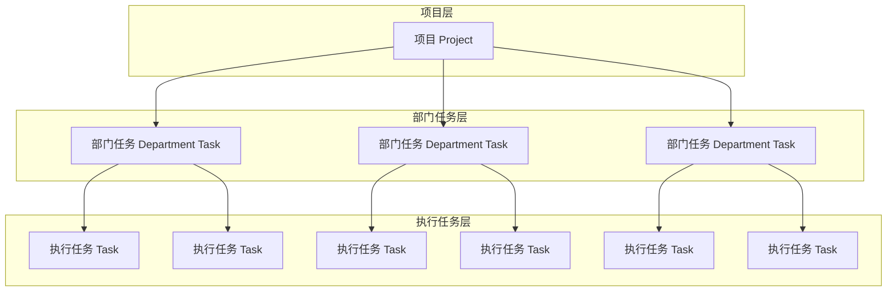

### 2.2 核心概念说明

| 概念 | 英文 | 说明 | 负责人 |
|------|------|------|--------|
| **项目** | Project | 企业级项目，包含明确的目标、时间范围和参与部门 | 项目负责人 |
| **部门任务** | Department Task | 分配给特定部门的工作包，需要部门负责人制定执行计划 | 部门负责人 |
| **执行任务** | Task | 具体的执行工作项，由部门成员完成 | 执行人员 |
| **工作计划** | Work Plan | 部门负责人针对部门任务制定的详细执行方案 | 部门负责人 |
| **里程碑** | Milestone | 项目中的关键节点，标志重要阶段的完成 | 项目负责人 |
| **交付物** | Deliverable | 任务完成后需要提交的成果文件 | 执行人员 |

### 2.3 角色定义

| 角色 | 职责 | 权限范围 |
|------|------|----------|
| **项目负责人** | 创建项目、分配部门任务、监控整体进度、协调资源 | 项目全局视图、所有部门任务可见 |
| **部门负责人** | 接收部门任务、制定工作计划、分解执行任务、管理部门进度 | 本部门任务及子任务的完整管理权限 |
| **执行人员** | 执行具体任务、更新任务状态、提交交付物 | 个人任务的执行和状态更新 |
| **项目成员** | 参与项目、查看相关信息 | 查看权限，可评论和协作 |

---

## 3. 功能架构

### 3.1 功能模块总览

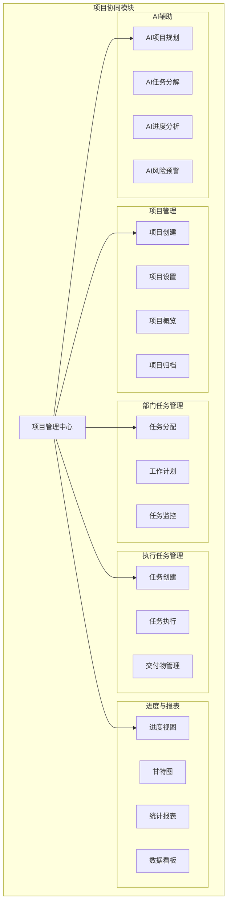

### 3.2 核心功能清单

#### 3.2.1 项目管理

| 功能 | 描述 | 优先级 |
|------|------|--------|
| 创建项目 | 填写项目基本信息，设置时间范围，选择参与部门和成员 | P0 |
| 项目设置 | 配置项目属性、权限、通知规则等 | P0 |
| 项目概览 | 展示项目整体进度、各部门完成情况、关键指标 | P0 |
| 里程碑管理 | 设置和跟踪项目关键节点 | P1 |
| 项目归档 | 归档已完成的项目，保留历史数据 | P1 |
| 项目模板 | 保存项目为模板，快速创建类似项目 | P2 |

#### 3.2.2 部门任务管理

| 功能 | 描述 | 优先级 |
|------|------|--------|
| 任务分配 | 项目负责人将任务分配给指定部门 | P0 |
| 工作计划上传 | 部门负责人上传工作开展计划或方案 | P0 |
| 计划审批 | 项目负责人审批部门工作计划 | P1 |
| 任务拆解 | 部门负责人将部门任务拆解为执行任务 | P0 |
| 进度汇报 | 部门负责人汇报部门任务整体进度 | P0 |

#### 3.2.3 执行任务管理

| 功能 | 描述 | 优先级 |
|------|------|--------|
| 任务创建 | 创建具体执行任务，设置负责人和截止时间 | P0 |
| 状态更新 | 执行人员更新任务状态（待开始/进行中/已完成等） | P0 |
| 进度填报 | 填写任务完成百分比和工作说明 | P0 |
| 交付物提交 | 上传任务相关的交付成果 | P1 |
| 任务评论 | 任务相关的沟通和讨论 | P1 |

#### 3.2.4 进度与报表

| 功能 | 描述 | 优先级 |
|------|------|--------|
| 项目进度视图 | 多维度展示项目整体进度 | P0 |
| 部门进度视图 | 展示各部门任务完成情况 | P0 |
| 甘特图 | 时间线视图展示任务安排 | P1 |
| 统计报表 | 项目数据统计和分析报表 | P1 |
| 数据看板 | 可视化数据展示面板 | P2 |

---

## 4. 用户流程设计

### 4.1 项目全生命周期流程

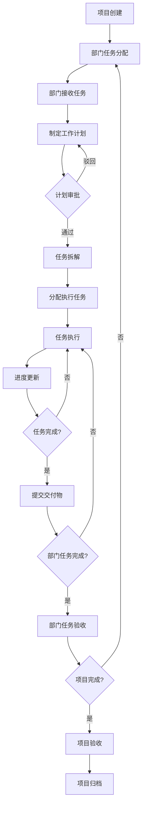

### 4.2 项目创建流程

#### 4.2.1 流程图

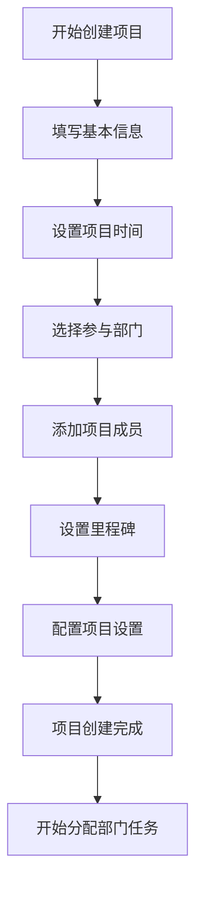

#### 4.2.2 界面设计

```
┌─────────────────────────────────────────────────────────────────┐
│  创建项目                                              步骤 1/4  │
├─────────────────────────────────────────────────────────────────┤
│                                                                 │
│  项目名称 *                                                      │
│  ┌─────────────────────────────────────────────────────────┐   │
│  │ 2025年Q1品牌推广项目                                     │   │
│  └─────────────────────────────────────────────────────────┘   │
│                                                                 │
│  项目描述                                                        │
│  ┌─────────────────────────────────────────────────────────┐   │
│  │ 通过线上线下多渠道推广，提升品牌知名度和市场占有率。       │   │
│  │ 目标：品牌曝光量提升50%，新客户增长30%。                  │   │
│  │                                                         │   │
│  └─────────────────────────────────────────────────────────┘   │
│                                                                 │
│  项目时间 *                                                      │
│  开始日期: [2025-01-01]  结束日期: [2025-03-31]                 │
│                                                                 │
│  项目负责人 *                                                    │
│  ┌─────────────────────────────────────────────────────────┐   │
│  │ 👤 张总监                                           ▼   │   │
│  └─────────────────────────────────────────────────────────┘   │
│                                                                 │
│                                             [取消]  [下一步]     │
│                                                                 │
└─────────────────────────────────────────────────────────────────┘
```

```
┌─────────────────────────────────────────────────────────────────┐
│  创建项目                                              步骤 2/4  │
├─────────────────────────────────────────────────────────────────┤
│                                                                 │
│  选择参与部门 *                                                  │
│                                                                 │
│  ┌─────────────────────────────────────────────────────────┐   │
│  │ ☑ 市场部                                                │   │
│  │   负责人: 李经理  │  成员: 12人                          │   │
│  ├─────────────────────────────────────────────────────────┤   │
│  │ ☑ 技术部                                                │   │
│  │   负责人: 王经理  │  成员: 25人                          │   │
│  ├─────────────────────────────────────────────────────────┤   │
│  │ ☑ 运营部                                                │   │
│  │   负责人: 赵经理  │  成员: 8人                           │   │
│  ├─────────────────────────────────────────────────────────┤   │
│  │ ☐ 财务部                                                │   │
│  │   负责人: 钱经理  │  成员: 6人                           │   │
│  ├─────────────────────────────────────────────────────────┤   │
│  │ ☐ 人力资源部                                            │   │
│  │   负责人: 孙经理  │  成员: 5人                           │   │
│  └─────────────────────────────────────────────────────────┘   │
│                                                                 │
│  已选择 3 个部门                                                 │
│                                                                 │
│                                   [上一步]  [下一步]             │
│                                                                 │
└─────────────────────────────────────────────────────────────────┘
```

```
┌─────────────────────────────────────────────────────────────────┐
│  创建项目                                              步骤 3/4  │
├─────────────────────────────────────────────────────────────────┤
│                                                                 │
│  添加项目成员                                                    │
│                                                                 │
│  从已选部门中选择成员参与项目                                    │
│  ┌─────────────────────────────────────────────────────────┐   │
│  │ 🔍 搜索成员...                                          │   │
│  └─────────────────────────────────────────────────────────┘   │
│                                                                 │
│  ▼ 市场部 (已选 5 人)                                           │
│  ┌─────────────────────────────────────────────────────────┐   │
│  │ ☑ 👤 李经理 (部门负责人)                                 │   │
│  │ ☑ 👤 小王 (市场专员)                                     │   │
│  │ ☑ 👤 小李 (品牌专员)                                     │   │
│  │ ☑ 👤 小张 (活动策划)                                     │   │
│  │ ☑ 👤 小刘 (新媒体运营)                                   │   │
│  └─────────────────────────────────────────────────────────┘   │
│                                                                 │
│  ▼ 技术部 (已选 3 人)                                           │
│  ┌─────────────────────────────────────────────────────────┐   │
│  │ ☑ 👤 王经理 (部门负责人)                                 │   │
│  │ ☑ 👤 小陈 (前端开发)                                     │   │
│  │ ☑ 👤 小周 (后端开发)                                     │   │
│  └─────────────────────────────────────────────────────────┘   │
│                                                                 │
│  ▶ 运营部 (已选 2 人)                                           │
│                                                                 │
│  已选择 10 名成员                                                │
│                                                                 │
│                                   [上一步]  [下一步]             │
│                                                                 │
└─────────────────────────────────────────────────────────────────┘
```

```
┌─────────────────────────────────────────────────────────────────┐
│  创建项目                                              步骤 4/4  │
├─────────────────────────────────────────────────────────────────┤
│                                                                 │
│  设置项目里程碑 (可选)                                           │
│                                                                 │
│  ┌─────────────────────────────────────────────────────────┐   │
│  │ 📍 里程碑1: 方案确定                                     │   │
│  │    日期: 2025-01-15  │  [编辑] [删除]                    │   │
│  ├─────────────────────────────────────────────────────────┤   │
│  │ 📍 里程碑2: 物料准备完成                                 │   │
│  │    日期: 2025-02-01  │  [编辑] [删除]                    │   │
│  ├─────────────────────────────────────────────────────────┤   │
│  │ 📍 里程碑3: 活动上线                                     │   │
│  │    日期: 2025-02-15  │  [编辑] [删除]                    │   │
│  ├─────────────────────────────────────────────────────────┤   │
│  │ 📍 里程碑4: 项目复盘                                     │   │
│  │    日期: 2025-03-31  │  [编辑] [删除]                    │   │
│  └─────────────────────────────────────────────────────────┘   │
│                                                                 │
│  [+ 添加里程碑]                                                  │
│                                                                 │
│  ☑ 使用AI智能生成里程碑建议                                      │
│                                                                 │
│                                   [上一步]  [完成创建]           │
│                                                                 │
└─────────────────────────────────────────────────────────────────┘
```

### 4.3 部门任务分配流程

#### 4.3.1 流程图

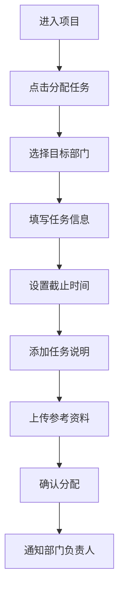

#### 4.3.2 界面设计

```
┌─────────────────────────────────────────────────────────────────┐
│  分配部门任务                                              [×]  │
├─────────────────────────────────────────────────────────────────┤
│                                                                 │
│  目标部门 *                                                      │
│  ┌─────────────────────────────────────────────────────────┐   │
│  │ 市场部 - 李经理                                     ▼   │   │
│  └─────────────────────────────────────────────────────────┘   │
│                                                                 │
│  任务名称 *                                                      │
│  ┌─────────────────────────────────────────────────────────┐   │
│  │ 线上推广活动策划与执行                                   │   │
│  └─────────────────────────────────────────────────────────┘   │
│                                                                 │
│  任务描述                                                        │
│  ┌─────────────────────────────────────────────────────────┐   │
│  │ 负责Q1品牌推广项目的线上推广部分，包括：                  │   │
│  │ 1. 制定线上推广方案                                      │   │
│  │ 2. 设计推广物料                                          │   │
│  │ 3. 执行推广活动                                          │   │
│  │ 4. 数据分析与复盘                                        │   │
│  │                                                         │   │
│  │ 预期成果：线上曝光量达到100万+，转化率不低于5%           │   │
│  └─────────────────────────────────────────────────────────┘   │
│                                                                 │
│  任务时间 *                                                      │
│  开始日期: [2025-01-05]  截止日期: [2025-03-15]                 │
│                                                                 │
│  优先级                                                          │
│  ○ 低  ● 中  ○ 高  ○ 紧急                                       │
│                                                                 │
│  参考资料                                                        │
│  ┌─────────────────────────────────────────────────────────┐   │
│  │ 📎 品牌推广总体方案.pdf                                  │   │
│  │ 📎 竞品分析报告.xlsx                                     │   │
│  │ [+ 上传文件]                                             │   │
│  └─────────────────────────────────────────────────────────┘   │
│                                                                 │
│  ☑ 要求部门负责人提交工作计划                                    │
│  ☐ 需要项目负责人审批工作计划                                    │
│                                                                 │
│                                        [取消]  [确认分配]        │
│                                                                 │
└─────────────────────────────────────────────────────────────────┘
```

### 4.4 部门负责人工作流程

#### 4.4.1 流程图

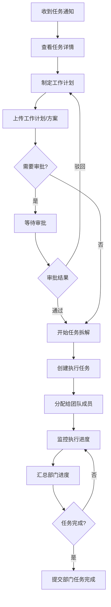

#### 4.4.2 工作计划上传界面

```
┌─────────────────────────────────────────────────────────────────┐
│  提交工作计划 - 线上推广活动策划与执行                           │
├─────────────────────────────────────────────────────────────────┤
│                                                                 │
│  工作计划概述 *                                                  │
│  ┌─────────────────────────────────────────────────────────┐   │
│  │ 本次线上推广活动将分为三个阶段执行：                      │   │
│  │                                                         │   │
│  │ 第一阶段（1月5日-1月20日）：方案策划与物料准备           │   │
│  │ - 完成推广方案设计                                       │   │
│  │ - 设计制作推广物料                                       │   │
│  │ - 确定推广渠道和预算                                     │   │
│  │                                                         │   │
│  │ 第二阶段（1月21日-2月28日）：活动执行                    │   │
│  │ - 各渠道推广投放                                         │   │
│  │ - 实时监控数据                                           │   │
│  │ - 优化投放策略                                           │   │
│  │                                                         │   │
│  │ 第三阶段（3月1日-3月15日）：数据分析与复盘               │   │
│  │ - 汇总推广数据                                           │   │
│  │ - 分析效果                                               │   │
│  │ - 输出复盘报告                                           │   │
│  └─────────────────────────────────────────────────────────┘   │
│                                                                 │
│  上传工作计划文档 *                                              │
│  ┌─────────────────────────────────────────────────────────┐   │
│  │ 📄 Q1线上推广工作计划.docx                    [预览][删除]│   │
│  │ 📊 推广预算明细.xlsx                          [预览][删除]│   │
│  │ 📋 推广渠道分析.pdf                           [预览][删除]│   │
│  │                                                         │   │
│  │ [+ 上传更多文件]                                         │   │
│  └─────────────────────────────────────────────────────────┘   │
│                                                                 │
│  预计资源需求                                                    │
│  ┌─────────────────────────────────────────────────────────┐   │
│  │ 人力: 5人  │  预算: ¥50,000  │  其他: 需要技术部支持     │   │
│  └─────────────────────────────────────────────────────────┘   │
│                                                                 │
│  ☑ 使用AI分析工作计划并生成任务拆解建议                          │
│                                                                 │
│                                        [保存草稿]  [提交计划]    │
│                                                                 │
└─────────────────────────────────────────────────────────────────┘
```

#### 4.4.3 任务拆解界面

```
┌─────────────────────────────────────────────────────────────────┐
│  任务拆解 - 线上推广活动策划与执行                               │
├─────────────────────────────────────────────────────────────────┤
│                                                                 │
│  部门任务进度: ████████░░░░░░░░░░░░  40%                        │
│                                                                 │
│  执行任务列表                                      [+ 添加任务]  │
│                                                                 │
│  ┌─────────────────────────────────────────────────────────┐   │
│  │ ☑ 1. 制定推广方案                                       │   │
│  │    负责人: 小王  │  截止: 01-15  │  状态: ✅ 已完成       │   │
│  │    进度: ████████████████████  100%                     │   │
│  ├─────────────────────────────────────────────────────────┤   │
│  │ ☐ 2. 设计推广物料                                       │   │
│  │    负责人: 小李  │  截止: 01-25  │  状态: 🔄 进行中       │   │
│  │    进度: ████████████░░░░░░░░  60%                      │   │
│  ├─────────────────────────────────────────────────────────┤   │
│  │ ☐ 3. 确定推广渠道                                       │   │
│  │    负责人: 小张  │  截止: 01-20  │  状态: 🔄 进行中       │   │
│  │    进度: ████████░░░░░░░░░░░░  40%                      │   │
│  ├─────────────────────────────────────────────────────────┤   │
│  │ ☐ 4. 执行推广投放                                       │   │
│  │    负责人: 小刘  │  截止: 02-28  │  状态: ⏳ 待开始       │   │
│  │    进度: ░░░░░░░░░░░░░░░░░░░░  0%                       │   │
│  ├─────────────────────────────────────────────────────────┤   │
│  │ ☐ 5. 数据分析与复盘                                     │   │
│  │    负责人: 小王  │  截止: 03-15  │  状态: ⏳ 待开始       │   │
│  │    进度: ░░░░░░░░░░░░░░░░░░░░  0%                       │   │
│  └─────────────────────────────────────────────────────────┘   │
│                                                                 │
│  快速添加任务                                                    │
│  ┌─────────────────────────────────────────────────────────┐   │
│  │ 输入任务名称，按回车创建...                              │   │
│  └─────────────────────────────────────────────────────────┘   │
│                                                                 │
│  [🤖 AI智能拆解]  根据工作计划自动生成任务建议                   │
│                                                                 │
└─────────────────────────────────────────────────────────────────┘
```

### 4.5 执行人员工作流程

#### 4.5.1 流程图

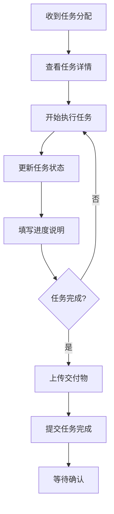

#### 4.5.2 任务执行界面

```
┌─────────────────────────────────────────────────────────────────┐
│  任务详情 - 设计推广物料                                         │
├─────────────────────────────────────────────────────────────────┤
│                                                                 │
│  所属项目: 2025年Q1品牌推广项目                                  │
│  所属部门任务: 线上推广活动策划与执行                            │
│                                                                 │
│  任务状态                                                        │
│  ┌─────────────────────────────────────────────────────────┐   │
│  │ ⏳ 待开始  →  🔄 进行中  →  ✅ 已完成                     │   │
│  │              ▲                                          │   │
│  │            当前                                          │   │
│  └─────────────────────────────────────────────────────────┘   │
│                                                                 │
│  任务进度                                                        │
│  ┌─────────────────────────────────────────────────────────┐   │
│  │ 完成度: [60] %                                          │   │
│  │ ████████████░░░░░░░░                                    │   │
│  └─────────────────────────────────────────────────────────┘   │
│                                                                 │
│  任务信息                                                        │
│  ┌─────────────────────────────────────────────────────────┐   │
│  │ 负责人: 小李                                             │   │
│  │ 开始时间: 2025-01-16                                     │   │
│  │ 截止时间: 2025-01-25                                     │   │
│  │ 优先级: 中                                               │   │
│  └─────────────────────────────────────────────────────────┘   │
│                                                                 │
│  任务描述                                                        │
│  ┌─────────────────────────────────────────────────────────┐   │
│  │ 根据推广方案设计以下物料：                               │   │
│  │ 1. 主视觉海报 (3张)                                      │   │
│  │ 2. 社交媒体配图 (10张)                                   │   │
│  │ 3. 活动落地页设计                                        │   │
│  │ 4. 广告Banner (5个尺寸)                                  │   │
│  └─────────────────────────────────────────────────────────┘   │
│                                                                 │
│  进度说明                                                        │
│  ┌─────────────────────────────────────────────────────────┐   │
│  │ 已完成主视觉海报设计，社交媒体配图完成6张，              │   │
│  │ 落地页设计进行中...                                      │   │
│  └─────────────────────────────────────────────────────────┘   │
│                                                                 │
│  交付物                                                          │
│  ┌─────────────────────────────────────────────────────────┐   │
│  │ 📎 主视觉海报_v1.psd                          [预览]     │   │
│  │ 📎 社交媒体配图_1-6.zip                       [预览]     │   │
│  │ [+ 上传交付物]                                           │   │
│  └─────────────────────────────────────────────────────────┘   │
│                                                                 │
│                              [保存进度]  [标记完成]              │
│                                                                 │
└─────────────────────────────────────────────────────────────────┘
```

---

## 5. 角色视图设计

### 5.1 项目负责人视图

项目负责人需要看到项目的全局情况，包括各部门的任务分配和完成情况。

```
┌─────────────────────────────────────────────────────────────────┐
│  2025年Q1品牌推广项目 - 项目概览                                 │
├─────────────────────────────────────────────────────────────────┤
│                                                                 │
│  📊 项目统计                                                     │
│  ┌──────────┐ ┌──────────┐ ┌──────────┐ ┌──────────┐           │
│  │ 整体进度  │ │ 部门任务  │ │ 执行任务  │ │ 已完成   │           │
│  │   45%    │ │   3个    │ │   15个   │ │   6个    │           │
│  └──────────┘ └──────────┘ └──────────┘ └──────────┘           │
│                                                                 │
│  📅 项目时间线                                                   │
│  ┌─────────────────────────────────────────────────────────┐   │
│  │ 01-01 ──────────────────────────────────────── 03-31    │   │
│  │        ▲                    ▲                           │   │
│  │      今天                里程碑2                         │   │
│  │      (01-20)            (02-01)                         │   │
│  └─────────────────────────────────────────────────────────┘   │
│                                                                 │
│  📋 部门任务完成情况                                             │
│  ┌─────────────────────────────────────────────────────────┐   │
│  │                                                         │   │
│  │  市场部 - 线上推广活动策划与执行                         │   │
│  │  负责人: 李经理  │  状态: 进行中  │  截止: 03-15         │   │
│  │  ████████░░░░░░░░░░░░  40%                              │   │
│  │  执行任务: 5个 (完成1个, 进行中2个, 待开始2个)           │   │
│  │                                                         │   │
│  ├─────────────────────────────────────────────────────────┤   │
│  │                                                         │   │
│  │  技术部 - 活动页面开发                                   │   │
│  │  负责人: 王经理  │  状态: 进行中  │  截止: 02-10         │   │
│  │  ██████████████░░░░░░  70%                              │   │
│  │  执行任务: 4个 (完成2个, 进行中2个, 待开始0个)           │   │
│  │                                                         │   │
│  ├─────────────────────────────────────────────────────────┤   │
│  │                                                         │   │
│  │  运营部 - 活动运营支持                                   │   │
│  │  负责人: 赵经理  │  状态: 待开始  │  截止: 03-20         │   │
│  │  ░░░░░░░░░░░░░░░░░░░░  0%                               │   │
│  │  执行任务: 6个 (完成0个, 进行中0个, 待开始6个)           │   │
│  │                                                         │   │
│  └─────────────────────────────────────────────────────────┘   │
│                                                                 │
│  ⚠️ 风险提醒                                                     │
│  ┌─────────────────────────────────────────────────────────┐   │
│  │ 🔴 市场部"确定推广渠道"任务即将逾期 (截止: 01-20)        │   │
│  │ 🟡 技术部开发进度略有延迟，建议关注                      │   │
│  └─────────────────────────────────────────────────────────┘   │
│                                                                 │
└─────────────────────────────────────────────────────────────────┘
```

### 5.2 部门负责人视图

部门负责人需要看到本部门的任务详情和团队成员的执行情况。

```
┌─────────────────────────────────────────────────────────────────┐
│  我的部门任务 - 市场部                                           │
├─────────────────────────────────────────────────────────────────┤
│                                                                 │
│  📋 当前部门任务                                                 │
│                                                                 │
│  ┌─────────────────────────────────────────────────────────┐   │
│  │ 📁 线上推广活动策划与执行                                │   │
│  │    项目: 2025年Q1品牌推广项目                            │   │
│  │    状态: 🔄 进行中  │  进度: 40%  │  截止: 03-15         │   │
│  │                                                         │   │
│  │    团队成员执行情况:                                     │   │
│  │    ┌─────────────────────────────────────────────────┐  │   │
│  │    │ 👤 小王  │  任务: 2个  │  完成: 1个  │  进行中: 1个│  │   │
│  │    │ 👤 小李  │  任务: 1个  │  完成: 0个  │  进行中: 1个│  │   │
│  │    │ 👤 小张  │  任务: 1个  │  完成: 0个  │  进行中: 1个│  │   │
│  │    │ 👤 小刘  │  任务: 1个  │  完成: 0个  │  待开始: 1个│  │   │
│  │    └─────────────────────────────────────────────────┘  │   │
│  │                                                         │   │
│  │    [查看详情]  [任务拆解]  [进度汇报]                    │   │
│  └─────────────────────────────────────────────────────────┘   │
│                                                                 │
│  📊 团队工作量分布                                               │
│  ┌─────────────────────────────────────────────────────────┐   │
│  │ 小王  ████████████████░░░░  80%                         │   │
│  │ 小李  ████████████░░░░░░░░  60%                         │   │
│  │ 小张  ████████░░░░░░░░░░░░  40%                         │   │
│  │ 小刘  ████░░░░░░░░░░░░░░░░  20%                         │   │
│  └─────────────────────────────────────────────────────────┘   │
│                                                                 │
│  ⏰ 即将到期的任务                                               │
│  ┌─────────────────────────────────────────────────────────┐   │
│  │ 🔴 确定推广渠道 - 小张 - 截止: 01-20 (今天)              │   │
│  │ 🟡 设计推广物料 - 小李 - 截止: 01-25 (5天后)             │   │
│  └─────────────────────────────────────────────────────────┘   │
│                                                                 │
└─────────────────────────────────────────────────────────────────┘
```

### 5.3 执行人员视图

执行人员需要看到分配给自己的任务和待办事项。

```
┌─────────────────────────────────────────────────────────────────┐
│  我的任务                                                        │
├─────────────────────────────────────────────────────────────────┤
│                                                                 │
│  📋 进行中的任务 (2)                                             │
│                                                                 │
│  ┌─────────────────────────────────────────────────────────┐   │
│  │ 🔄 设计推广物料                                          │   │
│  │    项目: 2025年Q1品牌推广项目                            │   │
│  │    部门任务: 线上推广活动策划与执行                      │   │
│  │    进度: ████████████░░░░░░░░  60%                      │   │
│  │    截止: 01-25 (还剩5天)                                 │   │
│  │    [更新进度]  [查看详情]                                │   │
│  ├─────────────────────────────────────────────────────────┤   │
│  │ 🔄 制定推广方案修订版                                    │   │
│  │    项目: 2025年Q1品牌推广项目                            │   │
│  │    部门任务: 线上推广活动策划与执行                      │   │
│  │    进度: ████████░░░░░░░░░░░░  40%                      │   │
│  │    截止: 01-22 (还剩2天)                                 │   │
│  │    [更新进度]  [查看详情]                                │   │
│  └─────────────────────────────────────────────────────────┘   │
│                                                                 │
│  📋 待开始的任务 (1)                                             │
│                                                                 │
│  ┌─────────────────────────────────────────────────────────┐   │
│  │ ⏳ 数据分析与复盘                                        │   │
│  │    项目: 2025年Q1品牌推广项目                            │   │
│  │    部门任务: 线上推广活动策划与执行                      │   │
│  │    开始: 03-01  │  截止: 03-15                           │   │
│  │    [查看详情]                                            │   │
│  └─────────────────────────────────────────────────────────┘   │
│                                                                 │
│  ✅ 已完成的任务 (1)                                             │
│                                                                 │
│  ┌─────────────────────────────────────────────────────────┐   │
│  │ ✅ 制定推广方案                                          │   │
│  │    完成时间: 01-15                                       │   │
│  │    [查看详情]                                            │   │
│  └─────────────────────────────────────────────────────────┘   │
│                                                                 │
└─────────────────────────────────────────────────────────────────┘
```

---

## 6. 数据模型设计

### 6.1 核心实体关系图

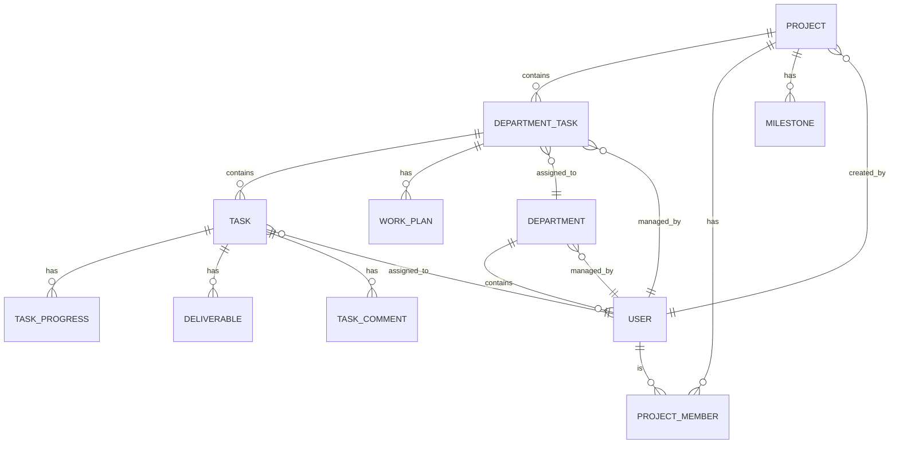

### 6.2 数据表设计

#### 6.2.1 项目表 (projects)

```sql
CREATE TABLE projects (
    id BIGINT PRIMARY KEY AUTO_INCREMENT,
    name VARCHAR(200) NOT NULL COMMENT '项目名称',
    description TEXT COMMENT '项目描述',
    owner_id BIGINT NOT NULL COMMENT '项目负责人ID',
    status ENUM('planning', 'in_progress', 'completed', 'suspended', 'cancelled') 
        DEFAULT 'planning' COMMENT '项目状态',
    priority ENUM('low', 'medium', 'high', 'urgent') DEFAULT 'medium' COMMENT '优先级',
    start_date DATE NOT NULL COMMENT '开始日期',
    end_date DATE NOT NULL COMMENT '结束日期',
    progress INT DEFAULT 0 COMMENT '项目进度(0-100)',
    team_id BIGINT COMMENT '所属团队ID',
    created_at TIMESTAMP DEFAULT CURRENT_TIMESTAMP,
    updated_at TIMESTAMP DEFAULT CURRENT_TIMESTAMP ON UPDATE CURRENT_TIMESTAMP,
    
    INDEX idx_owner (owner_id),
    INDEX idx_status (status),
    INDEX idx_team (team_id)
) COMMENT '项目表';
```

#### 6.2.2 部门任务表 (department_tasks)

```sql
CREATE TABLE department_tasks (
    id BIGINT PRIMARY KEY AUTO_INCREMENT,
    project_id BIGINT NOT NULL COMMENT '所属项目ID',
    department_id BIGINT NOT NULL COMMENT '负责部门ID',
    manager_id BIGINT NOT NULL COMMENT '部门负责人ID',
    name VARCHAR(200) NOT NULL COMMENT '任务名称',
    description TEXT COMMENT '任务描述',
    status ENUM('pending', 'plan_submitted', 'plan_approved', 'in_progress', 'completed', 'cancelled') 
        DEFAULT 'pending' COMMENT '任务状态',
    priority ENUM('low', 'medium', 'high', 'urgent') DEFAULT 'medium' COMMENT '优先级',
    start_date DATE COMMENT '开始日期',
    end_date DATE NOT NULL COMMENT '截止日期',
    progress INT DEFAULT 0 COMMENT '任务进度(0-100)',
    require_plan BOOLEAN DEFAULT TRUE COMMENT '是否需要提交工作计划',
    require_approval BOOLEAN DEFAULT FALSE COMMENT '工作计划是否需要审批',
    created_by BIGINT NOT NULL COMMENT '创建人ID',
    created_at TIMESTAMP DEFAULT CURRENT_TIMESTAMP,
    updated_at TIMESTAMP DEFAULT CURRENT_TIMESTAMP ON UPDATE CURRENT_TIMESTAMP,
    
    FOREIGN KEY (project_id) REFERENCES projects(id),
    INDEX idx_project (project_id),
    INDEX idx_department (department_id),
    INDEX idx_manager (manager_id),
    INDEX idx_status (status)
) COMMENT '部门任务表';
```

#### 6.2.3 工作计划表 (work_plans)

```sql
CREATE TABLE work_plans (
    id BIGINT PRIMARY KEY AUTO_INCREMENT,
    department_task_id BIGINT NOT NULL COMMENT '所属部门任务ID',
    summary TEXT COMMENT '计划概述',
    resource_requirement TEXT COMMENT '资源需求说明',
    status ENUM('draft', 'submitted', 'approved', 'rejected') 
        DEFAULT 'draft' COMMENT '计划状态',
    submitted_by BIGINT COMMENT '提交人ID',
    submitted_at TIMESTAMP COMMENT '提交时间',
    reviewed_by BIGINT COMMENT '审批人ID',
    reviewed_at TIMESTAMP COMMENT '审批时间',
    review_comment TEXT COMMENT '审批意见',
    version INT DEFAULT 1 COMMENT '版本号',
    created_at TIMESTAMP DEFAULT CURRENT_TIMESTAMP,
    updated_at TIMESTAMP DEFAULT CURRENT_TIMESTAMP ON UPDATE CURRENT_TIMESTAMP,
    
    FOREIGN KEY (department_task_id) REFERENCES department_tasks(id),
    INDEX idx_department_task (department_task_id),
    INDEX idx_status (status)
) COMMENT '工作计划表';
```

#### 6.2.4 工作计划附件表 (work_plan_attachments)

```sql
CREATE TABLE work_plan_attachments (
    id BIGINT PRIMARY KEY AUTO_INCREMENT,
    work_plan_id BIGINT NOT NULL COMMENT '所属工作计划ID',
    file_name VARCHAR(255) NOT NULL COMMENT '文件名',
    file_url VARCHAR(500) NOT NULL COMMENT '文件URL',
    file_size BIGINT COMMENT '文件大小(字节)',
    file_type VARCHAR(50) COMMENT '文件类型',
    uploaded_by BIGINT NOT NULL COMMENT '上传人ID',
    created_at TIMESTAMP DEFAULT CURRENT_TIMESTAMP,
    
    FOREIGN KEY (work_plan_id) REFERENCES work_plans(id),
    INDEX idx_work_plan (work_plan_id)
) COMMENT '工作计划附件表';
```

#### 6.2.5 执行任务表 (tasks)

```sql
CREATE TABLE tasks (
    id BIGINT PRIMARY KEY AUTO_INCREMENT,
    department_task_id BIGINT NOT NULL COMMENT '所属部门任务ID',
    name VARCHAR(255) NOT NULL COMMENT '任务名称',
    description TEXT COMMENT '任务描述',
    assignee_id BIGINT COMMENT '执行人ID',
    status ENUM('pending', 'in_progress', 'completed', 'cancelled') 
        DEFAULT 'pending' COMMENT '任务状态',
    priority ENUM('low', 'medium', 'high', 'urgent') DEFAULT 'medium' COMMENT '优先级',
    start_date DATE COMMENT '开始日期',
    end_date DATE COMMENT '截止日期',
    progress INT DEFAULT 0 COMMENT '任务进度(0-100)',
    progress_note TEXT COMMENT '进度说明',
    sort_order INT DEFAULT 0 COMMENT '排序顺序',
    created_by BIGINT NOT NULL COMMENT '创建人ID',
    created_at TIMESTAMP DEFAULT CURRENT_TIMESTAMP,
    updated_at TIMESTAMP DEFAULT CURRENT_TIMESTAMP ON UPDATE CURRENT_TIMESTAMP,
    completed_at TIMESTAMP COMMENT '完成时间',
    
    FOREIGN KEY (department_task_id) REFERENCES department_tasks(id),
    INDEX idx_department_task (department_task_id),
    INDEX idx_assignee (assignee_id),
    INDEX idx_status (status)
) COMMENT '执行任务表';
```

#### 6.2.6 任务交付物表 (deliverables)

```sql
CREATE TABLE deliverables (
    id BIGINT PRIMARY KEY AUTO_INCREMENT,
    task_id BIGINT NOT NULL COMMENT '所属任务ID',
    name VARCHAR(255) NOT NULL COMMENT '交付物名称',
    file_name VARCHAR(255) COMMENT '文件名',
    file_url VARCHAR(500) COMMENT '文件URL',
    file_size BIGINT COMMENT '文件大小(字节)',
    file_type VARCHAR(50) COMMENT '文件类型',
    description TEXT COMMENT '交付物说明',
    uploaded_by BIGINT NOT NULL COMMENT '上传人ID',
    created_at TIMESTAMP DEFAULT CURRENT_TIMESTAMP,
    
    FOREIGN KEY (task_id) REFERENCES tasks(id),
    INDEX idx_task (task_id)
) COMMENT '任务交付物表';
```

#### 6.2.7 项目里程碑表 (milestones)

```sql
CREATE TABLE milestones (
    id BIGINT PRIMARY KEY AUTO_INCREMENT,
    project_id BIGINT NOT NULL COMMENT '所属项目ID',
    name VARCHAR(200) NOT NULL COMMENT '里程碑名称',
    description TEXT COMMENT '里程碑描述',
    target_date DATE NOT NULL COMMENT '目标日期',
    status ENUM('pending', 'completed', 'delayed') DEFAULT 'pending' COMMENT '状态',
    completed_at TIMESTAMP COMMENT '完成时间',
    sort_order INT DEFAULT 0 COMMENT '排序顺序',
    created_at TIMESTAMP DEFAULT CURRENT_TIMESTAMP,
    updated_at TIMESTAMP DEFAULT CURRENT_TIMESTAMP ON UPDATE CURRENT_TIMESTAMP,
    
    FOREIGN KEY (project_id) REFERENCES projects(id),
    INDEX idx_project (project_id),
    INDEX idx_target_date (target_date)
) COMMENT '项目里程碑表';
```

#### 6.2.8 项目成员表 (project_members)

```sql
CREATE TABLE project_members (
    id BIGINT PRIMARY KEY AUTO_INCREMENT,
    project_id BIGINT NOT NULL COMMENT '项目ID',
    user_id BIGINT NOT NULL COMMENT '用户ID',
    role ENUM('owner', 'department_manager', 'member', 'viewer') 
        DEFAULT 'member' COMMENT '项目角色',
    department_id BIGINT COMMENT '所属部门ID',
    joined_at TIMESTAMP DEFAULT CURRENT_TIMESTAMP,
    
    FOREIGN KEY (project_id) REFERENCES projects(id),
    UNIQUE KEY uk_project_user (project_id, user_id),
    INDEX idx_project (project_id),
    INDEX idx_user (user_id)
) COMMENT '项目成员表';
```

---

## 7. AI辅助功能设计

### 7.1 AI项目规划

基于项目描述和目标，AI自动生成项目规划建议。

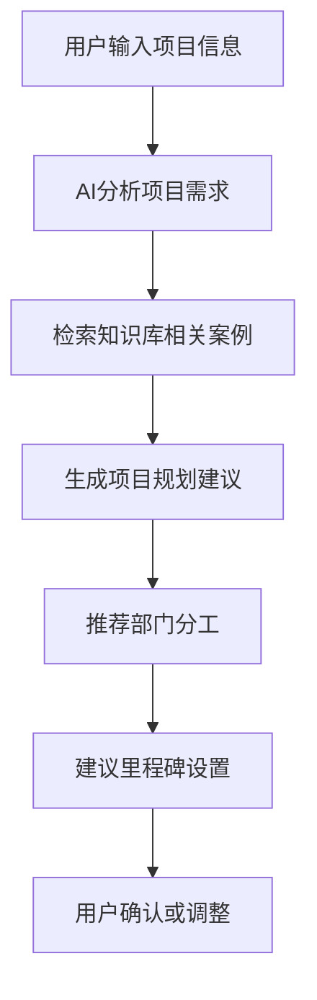

**功能说明**：
- 根据项目描述自动识别项目类型
- 推荐参与部门和职责分工
- 生成里程碑和时间节点建议
- 参考历史类似项目的成功经验

### 7.2 AI任务分解

帮助部门负责人将部门任务智能拆解为执行任务。

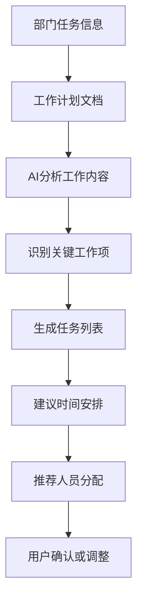

**功能说明**：
- 分析工作计划文档内容
- 自动识别可拆解的工作项
- 建议任务的时间安排和依赖关系
- 根据团队成员能力推荐任务分配

### 7.3 AI进度分析

实时分析项目进度，预测风险并提供建议。

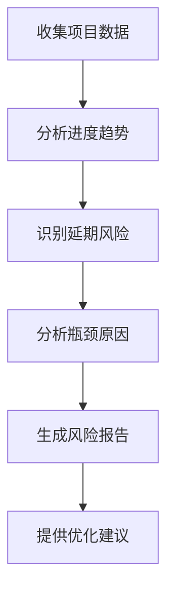

**功能说明**：
- 实时监控项目进度数据
- 预测任务延期风险
- 识别项目瓶颈和问题
- 提供资源调配和进度优化建议

### 7.4 AI风险预警

主动识别项目风险并发出预警。

**预警类型**：
| 预警类型 | 触发条件 | 预警级别 |
|---------|---------|---------|
| 任务逾期预警 | 任务截止日期临近但进度不足 | 🔴 高 |
| 进度滞后预警 | 实际进度低于计划进度20%以上 | 🟡 中 |
| 资源冲突预警 | 成员任务过载 | 🟡 中 |
| 依赖阻塞预警 | 前置任务未完成影响后续任务 | 🔴 高 |
| 里程碑风险预警 | 里程碑可能无法按时达成 | 🔴 高 |

---

## 8. 通知与提醒系统设计

### 8.1 通知系统架构

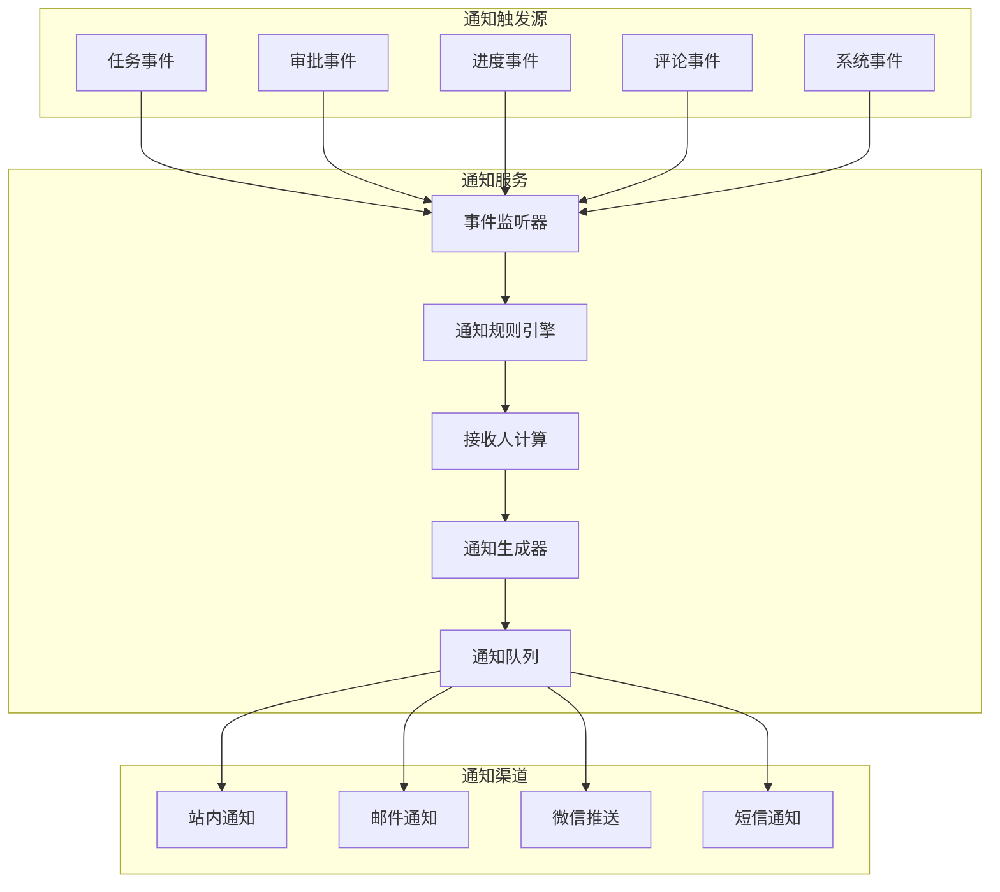

### 8.2 通知类型详细设计

#### 8.2.1 任务相关通知

| 通知类型 | 触发时机 | 接收人 | 通知内容 | 优先级 |
|---------|---------|--------|---------|--------|
| 部门任务分配 | 项目负责人分配部门任务 | 部门负责人 | 您收到新的部门任务：任务名称 | 高 |
| 执行任务分配 | 部门负责人分配执行任务 | 执行人员 | 您收到新的任务：任务名称 | 高 |
| 任务状态变更 | 任务状态发生变化 | 任务创建人、相关负责人 | 任务名称状态已更新为：新状态 | 中 |
| 任务进度更新 | 执行人员更新进度 | 部门负责人 | 执行人更新了任务进度：进度% | 低 |
| 任务完成 | 任务标记为完成 | 部门负责人、项目负责人 | 任务名称已完成 | 中 |
| 任务逾期预警 | 任务即将逾期 | 任务负责人、部门负责人 | 任务任务名称将于日期到期 | 高 |
| 任务已逾期 | 任务超过截止日期 | 任务负责人、部门负责人、项目负责人 | 任务任务名称已逾期天数天 | 紧急 |

#### 8.2.2 审批相关通知

| 通知类型 | 触发时机 | 接收人 | 通知内容 | 优先级 |
|---------|---------|--------|---------|--------|
| 计划待审批 | 部门负责人提交工作计划 | 项目负责人 | 部门提交了工作计划，请审批 | 高 |
| 计划审批通过 | 项目负责人通过审批 | 部门负责人 | 您的工作计划已审批通过 | 高 |
| 计划审批驳回 | 项目负责人驳回审批 | 部门负责人 | 您的工作计划被驳回，原因：原因 | 高 |
| 审批催办 | 审批超时未处理 | 项目负责人 | 有数量个工作计划待您审批 | 中 |

#### 8.2.3 协作相关通知

| 通知类型 | 触发时机 | 接收人 | 通知内容 | 优先级 |
|---------|---------|--------|---------|--------|
| 新评论 | 有人在任务下评论 | 任务相关人员 | 用户在任务名称中发表了评论 | 中 |
| @提及 | 评论中@某人 | 被@的用户 | 用户在任务名称中@了您 | 高 |
| 回复评论 | 有人回复了您的评论 | 原评论者 | 用户回复了您的评论 | 中 |
| 工作反馈 | 收到工作反馈 | 任务执行人 | 用户对您的工作提出了反馈 | 高 |

#### 8.2.4 项目相关通知

| 通知类型 | 触发时机 | 接收人 | 通知内容 | 优先级 |
|---------|---------|--------|---------|--------|
| 加入项目 | 被添加为项目成员 | 新成员 | 您已被添加到项目：项目名称 | 高 |
| 里程碑临近 | 里程碑日期临近 | 项目成员 | 项目里程碑名称将于日期到期 | 中 |
| 里程碑完成 | 里程碑标记完成 | 项目成员 | 项目里程碑名称已完成 | 中 |
| 项目进度周报 | 每周定时生成 | 项目负责人 | 项目名称本周进度报告已生成 | 低 |

### 8.3 通知提醒规则

#### 8.3.1 任务截止提醒规则

```
提醒时间线：
├── 截止前7天：首次提醒（仅高优先级任务）
├── 截止前3天：常规提醒
├── 截止前1天：紧急提醒
├── 截止当天：最后提醒（上午9:00）
├── 逾期第1天：逾期通知
├── 逾期第3天：逾期升级通知（抄送上级）
└── 逾期第7天：严重逾期通知（抄送项目负责人）
```

#### 8.3.2 审批超时提醒规则

```
审批提醒时间线：
├── 提交后24小时：首次催办
├── 提交后48小时：二次催办
└── 提交后72小时：升级催办（抄送更高级别）
```

### 8.4 通知渠道配置

#### 8.4.1 渠道优先级

| 通知优先级 | 站内通知 | 邮件 | 微信推送 | 短信 |
|-----------|---------|------|---------|------|
| 紧急 | ✅ | ✅ | ✅ | ✅ |
| 高 | ✅ | ✅ | ✅ | ❌ |
| 中 | ✅ | ✅ | ❌ | ❌ |
| 低 | ✅ | ❌ | ❌ | ❌ |

#### 8.4.2 用户通知偏好设置

```
┌─────────────────────────────────────────────────────────────────┐
│  通知设置                                                        │
├─────────────────────────────────────────────────────────────────┤
│                                                                 │
│  通知渠道                                                        │
│  ┌─────────────────────────────────────────────────────────┐   │
│  │ ☑ 站内通知    ☑ 邮件通知    ☑ 微信推送    ☐ 短信通知   │   │
│  └─────────────────────────────────────────────────────────┘   │
│                                                                 │
│  通知类型偏好                                                    │
│  ┌─────────────────────────────────────────────────────────┐   │
│  │ 任务分配通知          [全部渠道 ▼]                       │   │
│  │ 任务进度更新          [仅站内 ▼]                         │   │
│  │ 评论和@提及           [站内+邮件 ▼]                      │   │
│  │ 审批相关通知          [全部渠道 ▼]                       │   │
│  │ 逾期提醒              [全部渠道 ▼]                       │   │
│  │ 项目周报              [仅邮件 ▼]                         │   │
│  └─────────────────────────────────────────────────────────┘   │
│                                                                 │
│  免打扰时段                                                      │
│  ┌─────────────────────────────────────────────────────────┐   │
│  │ ☑ 启用免打扰    时段: [22:00] - [08:00]                 │   │
│  │ ☐ 周末免打扰                                             │   │
│  └─────────────────────────────────────────────────────────┘   │
│                                                                 │
│                                              [恢复默认]  [保存]  │
│                                                                 │
└─────────────────────────────────────────────────────────────────┘
```

### 8.5 通知中心界面设计

```
┌─────────────────────────────────────────────────────────────────┐
│  通知中心                                    [全部标为已读] [设置]│
├─────────────────────────────────────────────────────────────────┤
│                                                                 │
│  筛选: [全部▼]  [未读▼]  [任务▼]  [审批▼]  [评论▼]              │
│                                                                 │
│  今天                                                            │
│  ┌─────────────────────────────────────────────────────────┐   │
│  │ 🔴 任务逾期                                    10:30     │   │
│  │    任务"确定推广渠道"已逾期1天                           │   │
│  │    项目: 2025年Q1品牌推广项目                            │   │
│  │    [查看任务]                                            │   │
│  ├─────────────────────────────────────────────────────────┤   │
│  │ 💬 新评论                                       09:15     │   │
│  │    李经理在"设计推广物料"中@了您：                       │   │
│  │    "请尽快完成海报设计，客户催得比较急"                  │   │
│  │    [查看评论] [回复]                                     │   │
│  ├─────────────────────────────────────────────────────────┤   │
│  │ ✅ 任务完成                                     08:45     │   │
│  │    小王完成了任务"制定推广方案"                          │   │
│  │    [查看任务]                                            │   │
│  └─────────────────────────────────────────────────────────┘   │
│                                                                 │
│  昨天                                                            │
│  ┌─────────────────────────────────────────────────────────┐   │
│  │ 📋 新任务分配                                   16:20     │   │
│  │    您收到新的任务"数据分析与复盘"                        │   │
│  │    截止日期: 2025-03-15                                  │   │
│  │    [查看任务]                                            │   │
│  ├─────────────────────────────────────────────────────────┤   │
│  │ 📝 工作反馈                                     14:30     │   │
│  │    张总监对您的工作计划提出了反馈                        │   │
│  │    "整体方案不错，建议补充预算明细"                      │   │
│  │    [查看反馈] [回复]                                     │   │
│  └─────────────────────────────────────────────────────────┘   │
│                                                                 │
│  更早                                                            │
│  [加载更多...]                                                   │
│                                                                 │
└─────────────────────────────────────────────────────────────────┘
```

---

## 9. 工作反馈与任务讨论功能设计

### 9.1 功能概述

工作反馈与任务讨论功能旨在促进项目成员之间的沟通协作，包括：
- **任务评论**：在任务下进行讨论和沟通
- **工作反馈**：上级对下级工作的评价和建议
- **进度汇报**：执行人员向上级汇报工作进展
- **问题反馈**：遇到问题时向上级或相关人员求助

### 9.2 任务讨论功能

#### 9.2.1 功能流程

```mermaid
graph TB
    A[进入任务详情] --> B[查看讨论区]
    B --> C{操作类型}
    C -->|发表评论| D[输入评论内容]
    C -->|回复评论| E[选择要回复的评论]
    C -->|@提及| F[选择要@的人员]
    D --> G[发布评论]
    E --> G
    F --> G
    G --> H[通知相关人员]
    H --> I[更新讨论列表]
```

#### 9.2.2 讨论区界面设计

```
┌─────────────────────────────────────────────────────────────────┐
│  任务讨论 - 设计推广物料                                         │
├─────────────────────────────────────────────────────────────────┤
│                                                                 │
│  讨论 (5)                                          [按时间排序▼] │
│                                                                 │
│  ┌─────────────────────────────────────────────────────────┐   │
│  │ 👤 李经理 (部门负责人)                      01-18 09:30  │   │
│  │                                                         │   │
│  │ @小李 海报设计的整体风格很好，但是有几点建议：           │   │
│  │ 1. 主色调可以再鲜艳一些，突出品牌特色                    │   │
│  │ 2. 文案部分字体可以再大一点                              │   │
│  │ 3. 建议增加一个二维码入口                                │   │
│  │                                                         │   │
│  │ 📎 参考案例.png                                          │   │
│  │                                                         │   │
│  │ [回复] [👍 2]                                            │   │
│  │                                                         │   │
│  │   └─ 👤 小李                              01-18 10:15    │   │
│  │      收到，我会按照您的建议修改，预计今天下午完成。       │   │
│  │      [回复] [👍 1]                                       │   │
│  │                                                         │   │
│  │   └─ 👤 李经理                            01-18 10:20    │   │
│  │      好的，辛苦了！                                      │   │
│  │      [回复] [👍 0]                                       │   │
│  │                                                         │   │
│  └─────────────────────────────────────────────────────────┘   │
│                                                                 │
│  ┌─────────────────────────────────────────────────────────┐   │
│  │ 👤 小王 (市场专员)                          01-17 16:45  │   │
│  │                                                         │   │
│  │ 我这边推广方案已经定稿了，@小李 可以参考方案中的         │   │
│  │ 视觉风格要求来设计物料。                                 │   │
│  │                                                         │   │
│  │ 📎 Q1推广方案_终版.pdf                                   │   │
│  │                                                         │   │
│  │ [回复] [👍 3]                                            │   │
│  └─────────────────────────────────────────────────────────┘   │
│                                                                 │
│  发表评论                                                        │
│  ┌─────────────────────────────────────────────────────────┐   │
│  │ 输入评论内容... 支持@成员                                │   │
│  │                                                         │   │
│  │                                                         │   │
│  └─────────────────────────────────────────────────────────┘   │
│  [📎 附件] [@提及]                                    [发布]    │
│                                                                 │
└─────────────────────────────────────────────────────────────────┘
```

### 9.3 工作反馈功能

#### 9.3.1 反馈类型

| 反馈类型 | 说明 | 发起人 | 接收人 |
|---------|------|--------|--------|
| 工作指导 | 对工作方向和方法的指导建议 | 上级 | 下级 |
| 工作评价 | 对已完成工作的评价 | 上级 | 下级 |
| 问题反馈 | 工作中遇到的问题和困难 | 下级 | 上级 |
| 协作请求 | 需要其他成员协助的事项 | 任意成员 | 相关成员 |
| 进度汇报 | 定期或临时的工作进度汇报 | 下级 | 上级 |

#### 9.3.2 工作反馈流程

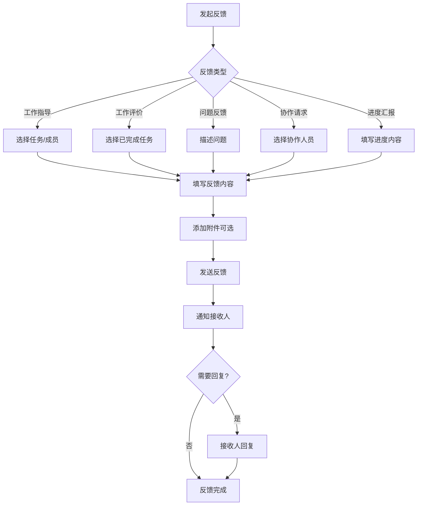

#### 9.3.3 工作反馈界面设计

**发起反馈**
```
┌─────────────────────────────────────────────────────────────────┐
│  发起工作反馈                                              [×]  │
├─────────────────────────────────────────────────────────────────┤
│                                                                 │
│  反馈类型 *                                                      │
│  ┌─────────────────────────────────────────────────────────┐   │
│  │ ○ 工作指导    ● 工作评价    ○ 问题反馈                   │   │
│  │ ○ 协作请求    ○ 进度汇报                                 │   │
│  └─────────────────────────────────────────────────────────┘   │
│                                                                 │
│  关联任务                                                        │
│  ┌─────────────────────────────────────────────────────────┐   │
│  │ 设计推广物料 - 小李                                 ▼   │   │
│  └─────────────────────────────────────────────────────────┘   │
│                                                                 │
│  反馈对象 *                                                      │
│  ┌─────────────────────────────────────────────────────────┐   │
│  │ 👤 小李                                             ▼   │   │
│  └─────────────────────────────────────────────────────────┘   │
│                                                                 │
│  评价等级                                                        │
│  ┌─────────────────────────────────────────────────────────┐   │
│  │ ⭐⭐⭐⭐☆  良好                                         │   │
│  └─────────────────────────────────────────────────────────┘   │
│                                                                 │
│  反馈内容 *                                                      │
│  ┌─────────────────────────────────────────────────────────┐   │
│  │ 本次海报设计整体完成度较高，有以下亮点：                 │   │
│  │ 1. 色彩搭配协调，符合品牌调性                            │   │
│  │ 2. 排版清晰，信息层次分明                                │   │
│  │                                                         │   │
│  │ 改进建议：                                               │   │
│  │ 1. 可以尝试更多创意元素                                  │   │
│  │ 2. 注意不同尺寸的适配效果                                │   │
│  └─────────────────────────────────────────────────────────┘   │
│                                                                 │
│  附件                                                            │
│  ┌─────────────────────────────────────────────────────────┐   │
│  │ [+ 上传附件]                                             │   │
│  └─────────────────────────────────────────────────────────┘   │
│                                                                 │
│  ☐ 需要对方回复确认                                              │
│  ☑ 同时发送通知提醒                                              │
│                                                                 │
│                                        [取消]  [发送反馈]        │
│                                                                 │
└─────────────────────────────────────────────────────────────────┘
```

**查看反馈记录**
```
┌─────────────────────────────────────────────────────────────────┐
│  工作反馈记录                                                    │
├─────────────────────────────────────────────────────────────────┤
│                                                                 │
│  筛选: [全部类型▼]  [全部状态▼]  [最近30天▼]                    │
│                                                                 │
│  收到的反馈 (3)                                                  │
│  ┌─────────────────────────────────────────────────────────┐   │
│  │ 📝 工作评价                                   01-18      │   │
│  │    来自: 李经理                                          │   │
│  │    任务: 设计推广物料                                    │   │
│  │    评价: ⭐⭐⭐⭐☆ 良好                                  │   │
│  │    "本次海报设计整体完成度较高..."                       │   │
│  │    状态: 🟢 已读                                         │   │
│  │    [查看详情] [回复]                                     │   │
│  ├─────────────────────────────────────────────────────────┤   │
│  │ 💡 工作指导                                   01-15      │   │
│  │    来自: 李经理                                          │   │
│  │    任务: 设计推广物料                                    │   │
│  │    "设计时注意以下几点..."                               │   │
│  │    状态: 🟢 已回复                                       │   │
│  │    [查看详情]                                            │   │
│  └─────────────────────────────────────────────────────────┘   │
│                                                                 │
│  发出的反馈 (2)                                                  │
│  ┌─────────────────────────────────────────────────────────┐   │
│  │ ❓ 问题反馈                                   01-16      │   │
│  │    发给: 李经理                                          │   │
│  │    任务: 设计推广物料                                    │   │
│  │    "关于设计风格有个问题想请教..."                       │   │
│  │    状态: 🟢 已回复                                       │   │
│  │    [查看详情]                                            │   │
│  └─────────────────────────────────────────────────────────┘   │
│                                                                 │
└─────────────────────────────────────────────────────────────────┘
```

### 9.4 进度汇报功能

#### 9.4.1 汇报类型

| 汇报类型 | 频率 | 内容要求 | 接收人 |
|---------|------|---------|--------|
| 日报 | 每日 | 今日完成、明日计划、问题风险 | 部门负责人 |
| 周报 | 每周 | 本周总结、下周计划、数据指标 | 部门负责人、项目负责人 |
| 里程碑汇报 | 里程碑节点 | 阶段成果、问题总结、下阶段计划 | 项目负责人 |
| 临时汇报 | 随时 | 重要进展或问题 | 相关负责人 |

#### 9.4.2 进度汇报界面

```
┌─────────────────────────────────────────────────────────────────┐
│  提交进度汇报                                              [×]  │
├─────────────────────────────────────────────────────────────────┤
│                                                                 │
│  汇报类型 *                                                      │
│  ┌─────────────────────────────────────────────────────────┐   │
│  │ ○ 日报    ● 周报    ○ 里程碑汇报    ○ 临时汇报          │   │
│  └─────────────────────────────────────────────────────────┘   │
│                                                                 │
│  汇报周期: 2025年1月第3周 (01-13 ~ 01-19)                       │
│                                                                 │
│  本周工作完成情况 *                                              │
│  ┌─────────────────────────────────────────────────────────┐   │
│  │ 1. 完成推广方案初稿设计                                  │   │
│  │ 2. 完成3张主视觉海报设计                                 │   │
│  │ 3. 完成6张社交媒体配图                                   │   │
│  │ 4. 与技术部对接落地页需求                                │   │
│  └─────────────────────────────────────────────────────────┘   │
│                                                                 │
│  关联任务完成情况                                                │
│  ┌─────────────────────────────────────────────────────────┐   │
│  │ ☑ 制定推广方案 - 100%                                   │   │
│  │ ☑ 设计推广物料 - 60% (本周+30%)                         │   │
│  │ ☐ 确定推广渠道 - 40% (本周+20%)                         │   │
│  └─────────────────────────────────────────────────────────┘   │
│                                                                 │
│  下周工作计划 *                                                  │
│  ┌─────────────────────────────────────────────────────────┐   │
│  │ 1. 完成剩余推广物料设计                                  │   │
│  │ 2. 确定最终推广渠道                                      │   │
│  │ 3. 准备推广投放素材                                      │   │
│  └─────────────────────────────────────────────────────────┘   │
│                                                                 │
│  问题与风险                                                      │
│  ┌─────────────────────────────────────────────────────────┐   │
│  │ 1. 落地页开发进度可能影响整体上线时间                    │   │
│  │ 2. 部分渠道报价超出预算，需要协调                        │   │
│  └─────────────────────────────────────────────────────────┘   │
│                                                                 │
│  需要的支持                                                      │
│  ┌─────────────────────────────────────────────────────────┐   │
│  │ 希望能协调技术部加快落地页开发进度                       │   │
│  └─────────────────────────────────────────────────────────┘   │
│                                                                 │
│  汇报对象: 李经理、张总监                                        │
│                                                                 │
│                                        [保存草稿]  [提交汇报]    │
│                                                                 │
└─────────────────────────────────────────────────────────────────┘
```

### 9.5 数据模型补充

#### 9.5.1 任务评论表 (task_comments)

```sql
CREATE TABLE task_comments (
    id BIGINT PRIMARY KEY AUTO_INCREMENT,
    task_id BIGINT NOT NULL COMMENT '所属任务ID',
    parent_id BIGINT COMMENT '父评论ID(用于回复)',
    user_id BIGINT NOT NULL COMMENT '评论人ID',
    content TEXT NOT NULL COMMENT '评论内容',
    mentioned_users JSON COMMENT '@提及的用户ID列表',
    like_count INT DEFAULT 0 COMMENT '点赞数',
    created_at TIMESTAMP DEFAULT CURRENT_TIMESTAMP,
    updated_at TIMESTAMP DEFAULT CURRENT_TIMESTAMP ON UPDATE CURRENT_TIMESTAMP,
    deleted_at TIMESTAMP COMMENT '删除时间(软删除)',
    
    FOREIGN KEY (task_id) REFERENCES tasks(id),
    FOREIGN KEY (parent_id) REFERENCES task_comments(id),
    INDEX idx_task (task_id),
    INDEX idx_parent (parent_id),
    INDEX idx_user (user_id)
) COMMENT '任务评论表';
```

#### 9.5.2 评论附件表 (comment_attachments)

```sql
CREATE TABLE comment_attachments (
    id BIGINT PRIMARY KEY AUTO_INCREMENT,
    comment_id BIGINT NOT NULL COMMENT '所属评论ID',
    file_name VARCHAR(255) NOT NULL COMMENT '文件名',
    file_url VARCHAR(500) NOT NULL COMMENT '文件URL',
    file_size BIGINT COMMENT '文件大小(字节)',
    file_type VARCHAR(50) COMMENT '文件类型',
    created_at TIMESTAMP DEFAULT CURRENT_TIMESTAMP,
    
    FOREIGN KEY (comment_id) REFERENCES task_comments(id),
    INDEX idx_comment (comment_id)
) COMMENT '评论附件表';
```

#### 9.5.3 工作反馈表 (work_feedbacks)

```sql
CREATE TABLE work_feedbacks (
    id BIGINT PRIMARY KEY AUTO_INCREMENT,
    project_id BIGINT COMMENT '关联项目ID',
    task_id BIGINT COMMENT '关联任务ID',
    feedback_type ENUM('guidance', 'evaluation', 'problem', 'collaboration', 'report')
        NOT NULL COMMENT '反馈类型',
    from_user_id BIGINT NOT NULL COMMENT '发起人ID',
    to_user_id BIGINT NOT NULL COMMENT '接收人ID',
    title VARCHAR(200) COMMENT '反馈标题',
    content TEXT NOT NULL COMMENT '反馈内容',
    rating INT COMMENT '评价等级(1-5)',
    require_reply BOOLEAN DEFAULT FALSE COMMENT '是否需要回复',
    status ENUM('pending', 'read', 'replied') DEFAULT 'pending' COMMENT '状态',
    reply_content TEXT COMMENT '回复内容',
    replied_at TIMESTAMP COMMENT '回复时间',
    created_at TIMESTAMP DEFAULT CURRENT_TIMESTAMP,
    updated_at TIMESTAMP DEFAULT CURRENT_TIMESTAMP ON UPDATE CURRENT_TIMESTAMP,
    
    FOREIGN KEY (project_id) REFERENCES projects(id),
    FOREIGN KEY (task_id) REFERENCES tasks(id),
    INDEX idx_from_user (from_user_id),
    INDEX idx_to_user (to_user_id),
    INDEX idx_task (task_id),
    INDEX idx_type (feedback_type)
) COMMENT '工作反馈表';
```

#### 9.5.4 进度汇报表 (progress_reports)

```sql
CREATE TABLE progress_reports (
    id BIGINT PRIMARY KEY AUTO_INCREMENT,
    project_id BIGINT NOT NULL COMMENT '关联项目ID',
    department_task_id BIGINT COMMENT '关联部门任务ID',
    report_type ENUM('daily', 'weekly', 'milestone', 'adhoc')
        NOT NULL COMMENT '汇报类型',
    reporter_id BIGINT NOT NULL COMMENT '汇报人ID',
    report_period_start DATE COMMENT '汇报周期开始',
    report_period_end DATE COMMENT '汇报周期结束',
    completed_work TEXT COMMENT '已完成工作',
    planned_work TEXT COMMENT '计划工作',
    issues_risks TEXT COMMENT '问题与风险',
    support_needed TEXT COMMENT '需要的支持',
    task_progress JSON COMMENT '关联任务进度快照',
    recipients JSON COMMENT '汇报接收人ID列表',
    status ENUM('draft', 'submitted', 'read') DEFAULT 'draft' COMMENT '状态',
    submitted_at TIMESTAMP COMMENT '提交时间',
    created_at TIMESTAMP DEFAULT CURRENT_TIMESTAMP,
    updated_at TIMESTAMP DEFAULT CURRENT_TIMESTAMP ON UPDATE CURRENT_TIMESTAMP,
    
    FOREIGN KEY (project_id) REFERENCES projects(id),
    FOREIGN KEY (department_task_id) REFERENCES department_tasks(id),
    INDEX idx_project (project_id),
    INDEX idx_reporter (reporter_id),
    INDEX idx_type (report_type),
    INDEX idx_period (report_period_start, report_period_end)
) COMMENT '进度汇报表';
```

#### 9.5.5 通知表 (notifications)

```sql
CREATE TABLE notifications (
    id BIGINT PRIMARY KEY AUTO_INCREMENT,
    user_id BIGINT NOT NULL COMMENT '接收用户ID',
    type VARCHAR(50) NOT NULL COMMENT '通知类型',
    title VARCHAR(200) NOT NULL COMMENT '通知标题',
    content TEXT COMMENT '通知内容',
    priority ENUM('low', 'medium', 'high', 'urgent') DEFAULT 'medium' COMMENT '优先级',
    source_type VARCHAR(50) COMMENT '来源类型(task/feedback/comment等)',
    source_id BIGINT COMMENT '来源ID',
    is_read BOOLEAN DEFAULT FALSE COMMENT '是否已读',
    read_at TIMESTAMP COMMENT '阅读时间',
    channels JSON COMMENT '发送渠道记录',
    created_at TIMESTAMP DEFAULT CURRENT_TIMESTAMP,
    
    INDEX idx_user (user_id),
    INDEX idx_type (type),
    INDEX idx_is_read (is_read),
    INDEX idx_created (created_at)
) COMMENT '通知表';
```

---

## 10. 权限设计

### 9.1 权限矩阵

| 功能 | 项目负责人 | 部门负责人 | 执行人员 | 项目成员 |
|------|-----------|-----------|---------|---------|
| 创建项目 | ✅ | ❌ | ❌ | ❌ |
| 编辑项目信息 | ✅ | ❌ | ❌ | ❌ |
| 分配部门任务 | ✅ | ❌ | ❌ | ❌ |
| 查看所有部门任务 | ✅ | ❌ | ❌ | ❌ |
| 审批工作计划 | ✅ | ❌ | ❌ | ❌ |
| 提交工作计划 | ❌ | ✅ | ❌ | ❌ |
| 拆解执行任务 | ❌ | ✅ | ❌ | ❌ |
| 分配执行任务 | ❌ | ✅ | ❌ | ❌ |
| 查看部门任务详情 | ✅ | ✅(本部门) | ✅(相关) | 👁️ |
| 更新任务进度 | ❌ | ✅ | ✅(本人) | ❌ |
| 上传交付物 | ❌ | ✅ | ✅(本人) | ❌ |
| 查看项目概览 | ✅ | ✅(本部门) | ✅(本人) | 👁️ |
| 评论任务 | ✅ | ✅ | ✅ | ✅ |

说明：✅ 完全权限 | 👁️ 只读权限 | ❌ 无权限

### 9.2 数据权限

- **项目负责人**：可查看项目所有数据
- **部门负责人**：可查看本部门任务及子任务的所有数据
- **执行人员**：可查看分配给自己的任务数据
- **项目成员**：可查看项目基本信息和公开数据

---

## 10. 与现有系统的关系

### 10.1 与团队管理模块的关系

- 复用团队管理模块的组织架构（部门、成员）
- 复用用户权限体系
- 项目成员从团队成员中选择

### 10.2 与AI智能模块的关系

- 调用AI服务进行项目规划建议
- 调用AI服务进行任务智能拆解
- 调用AI服务进行进度分析和风险预警

### 10.3 与知识管理模块的关系

- 工作计划文档可存储到知识库
- 交付物可归档到知识库
- AI分析时可检索知识库中的历史案例

---

## 11. 实施建议

### 11.1 开发优先级

**第一阶段（P0 - 核心功能）**：
1. 项目创建与基本管理
2. 部门任务分配
3. 执行任务管理
4. 基础进度跟踪

**第二阶段（P1 - 增强功能）**：
1. 工作计划上传与审批
2. 交付物管理
3. 甘特图视图
4. 通知提醒系统

**第三阶段（P2 - AI功能）**：
1. AI项目规划建议
2. AI任务智能拆解
3. AI进度分析
4. AI风险预警

### 11.2 迁移策略

如果需要从现有的敏捷模式迁移：
- 保留现有数据结构，新增部门任务层
- 将原有的Sprint/Epic概念映射为部门任务
- 将原有的Story/Task映射为执行任务
- 提供数据迁移工具

---

## 12. 总结

本设计稿重新定义了项目协同模块的核心概念和功能架构，主要变化包括：

1. **概念简化**：用"项目→部门任务→执行任务"的三层结构替代复杂的敏捷概念
2. **角色明确**：清晰定义项目负责人、部门负责人、执行人员的职责和权限
3. **流程规范**：增加工作计划提交和审批流程，确保执行有据可依
4. **视图差异化**：不同角色看到不同维度的项目信息
5. **AI赋能**：利用AI辅助项目规划、任务分解和风险预警

这种设计更适合企业各类部门使用，降低了学习成本，提高了协作效率。

---

**文档版本**: v2.0  
**最后更新**: 2025-12-23  
**维护者**: 产品团队