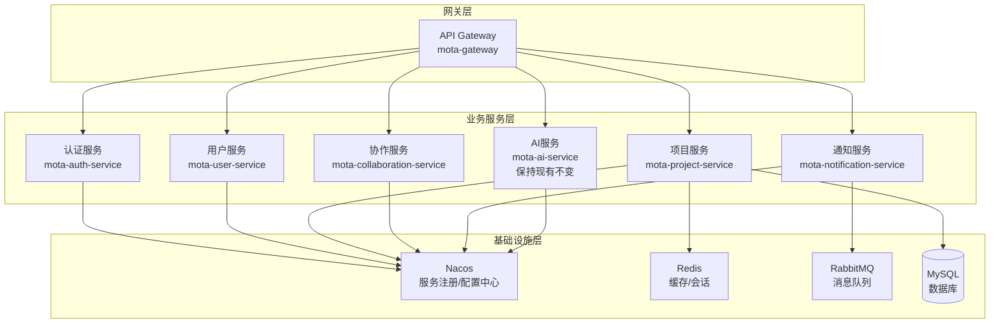
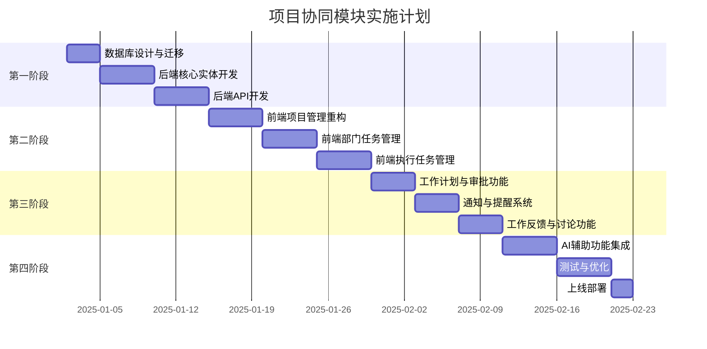

# 项目协同模块实施计划

## 文档信息
- **版本**: v1.1
- **创建日期**: 2025-12-23
- **更新日期**: 2025-12-23
- **文档状态**: 规划阶段
- **关联文档**: [项目协同功能设计稿 V2.0](./03-项目协同功能设计稿-v2.md)

---

## 1. 项目概述

### 1.1 实施目标

将项目协同模块从当前的敏捷开发模式（Sprint/Epic/Story/Bug）重构为通用的企业协同模式（项目→部门任务→执行任务），使其适用于企业各类部门。

### 1.2 技术栈

| 层级 | 技术选型 |
|------|---------|
| **前端框架** | React 18 + TypeScript + Ant Design + Vite |
| **微前端** | qiankun（乾坤）微前端框架 |
| **后端框架** | Spring Boot 3 + Spring Cloud |
| **微服务** | Spring Cloud Gateway + Nacos + OpenFeign |
| **数据层** | MyBatis Plus + MySQL + Redis |
| **消息队列** | RabbitMQ / Kafka |
| **通用** | RESTful API + JWT认证 + OAuth2 |

### 1.3 架构设计原则

#### 1.3.1 前端架构原则

1. **保持现有UI布局结构和样式**
   - 复用现有的 `ConsoleLayout` 布局组件
   - 保持现有的导航结构和菜单样式
   - 沿用现有的主题色和设计规范
   - 保持 Ant Design 组件的使用方式一致

2. **微前端架构**
   - 主应用（基座）：负责整体布局、路由分发、公共状态管理
   - 子应用：项目协同模块作为独立子应用
   - 应用间通信：通过 qiankun 的 props 传递和全局状态共享

3. **渐进式重构**
   - 新功能以微前端子应用形式开发
   - 现有页面逐步迁移，保持兼容性
   - 共享组件库统一管理

#### 1.3.2 后端架构原则

1. **微服务拆分**
   - 按业务领域拆分服务
   - 服务间通过 OpenFeign 调用
   - 统一网关入口

2. **服务治理**
   - Nacos 服务注册与发现
   - 配置中心统一管理
   - 链路追踪和监控

### 1.4 现有代码分析

#### 后端微服务架构（目标架构）
```
mota-service/
├── mota-gateway/                  # API网关服务
│   └── 路由转发、认证鉴权、限流熔断
│
├── mota-auth-service/             # 认证服务
│   └── 用户认证、Token管理、OAuth2
│
├── mota-user-service/             # 用户服务
│   └── 用户管理、组织架构、部门管理
│
├── mota-project-service/          # 项目服务（核心重构）
│   ├── entity/
│   │   ├── Project.java           # 项目实体（需扩展）
│   │   ├── DepartmentTask.java    # 部门任务实体（新增）
│   │   ├── Task.java              # 执行任务实体（新增）
│   │   ├── WorkPlan.java          # 工作计划实体（新增）
│   │   ├── Milestone.java         # 里程碑实体（新增）
│   │   └── ProjectMember.java     # 项目成员实体（新增）
│   ├── controller/
│   │   ├── ProjectController.java
│   │   ├── DepartmentTaskController.java
│   │   └── TaskController.java
│   └── service/
│       ├── ProjectService.java
│       ├── DepartmentTaskService.java
│       └── TaskService.java
│
├── mota-collaboration-service/    # 协作服务（新增）
│   ├── entity/
│   │   ├── TaskComment.java       # 任务评论
│   │   ├── WorkFeedback.java      # 工作反馈
│   │   └── ProgressReport.java    # 进度汇报
│   └── 评论、反馈、汇报功能
│
├── mota-notification-service/     # 通知服务（新增）
│   └── 站内通知、邮件、微信推送
│
├── mota-ai-service/               # AI服务（保持现有，仅新增接口）
│   └── 现有AI功能保持不变，新增项目协同相关接口
│
└── mota-common/                   # 公共模块
    ├── mota-common-core/          # 核心工具类
    ├── mota-common-security/      # 安全模块
    ├── mota-common-mybatis/       # MyBatis配置
    └── mota-common-redis/         # Redis配置
```

#### 前端微前端架构（目标架构）
```
mota-frontend/
├── mota-main/                     # 主应用（基座）
│   ├── src/
│   │   ├── layouts/
│   │   │   └── ConsoleLayout/     # 保持现有布局结构
│   │   ├── micro/                 # 微前端配置
│   │   │   ├── apps.ts            # 子应用注册
│   │   │   └── lifecycle.ts       # 生命周期管理
│   │   ├── store/                 # 全局状态（共享给子应用）
│   │   └── router/                # 主路由配置
│   └── 负责整体布局、导航、公共状态
│
├── mota-user/                     # 现有主应用（逐步迁移为子应用）
│   ├── src/pages/
│   │   ├── projects/              # 项目列表页（保持现有样式）
│   │   ├── dashboard/             # 仪表盘（保持现有样式）
│   │   └── ...                    # 其他现有页面
│   └── 保持现有UI布局和样式不变
│
├── mota-project-app/              # 项目协同子应用（新增）
│   ├── src/
│   │   ├── pages/
│   │   │   ├── project-detail/    # 项目详情（新设计）
│   │   │   ├── department-tasks/  # 部门任务管理
│   │   │   ├── tasks/             # 执行任务管理
│   │   │   └── work-plan/         # 工作计划管理
│   │   ├── components/            # 子应用专用组件
│   │   └── services/              # API服务
│   └── 遵循现有UI设计规范
│
└── mota-shared/                   # 共享资源
    ├── components/                # 共享组件库
    ├── styles/                    # 共享样式（保持一致性）
    ├── utils/                     # 工具函数
    └── types/                     # TypeScript类型定义
```

#### 现有前端页面结构（保持不变）
```
mota-user/src/pages/
├── projects/
│   ├── index.tsx                  # 项目列表页（保持现有布局和样式）
│   └── create/index.tsx           # 创建项目页（扩展功能，保持样式）
├── project-detail/index.tsx       # 项目详情页（扩展功能，保持样式）
├── issues/                        # 任务管理（逐步迁移）
├── iterations/                    # 迭代管理（可保留）
├── kanban/                        # 看板视图（保持现有样式）
└── ...                            # 其他页面保持不变
```

---

## 2. 微前端与微服务架构设计

### 2.1 微前端架构详细设计

#### 2.1.1 技术选型：qiankun

选择 qiankun 作为微前端框架的原因：
- 基于 single-spa 封装，成熟稳定
- 支持多种前端框架（React、Vue、Angular）
- 提供 JS 沙箱和样式隔离
- 支持预加载和资源复用
- 社区活跃，文档完善

#### 2.1.2 主应用配置

```typescript
// mota-main/src/micro/apps.ts
import { registerMicroApps, start, setDefaultMountApp } from 'qiankun';

const microApps = [
  {
    name: 'mota-user',
    entry: '//localhost:3001',
    container: '#subapp-container',
    activeRule: '/app',
    props: {
      routerBase: '/app',
      getGlobalState: () => globalState,
    },
  },
  {
    name: 'mota-project-app',
    entry: '//localhost:3002',
    container: '#subapp-container',
    activeRule: '/project',
    props: {
      routerBase: '/project',
      getGlobalState: () => globalState,
    },
  },
];

registerMicroApps(microApps, {
  beforeLoad: [async (app) => console.log('before load', app.name)],
  beforeMount: [async (app) => console.log('before mount', app.name)],
  afterMount: [async (app) => console.log('after mount', app.name)],
});

setDefaultMountApp('/app/dashboard');
start({ prefetch: 'all' });
```

#### 2.1.3 子应用配置

```typescript
// mota-project-app/src/main.tsx
import { createRoot } from 'react-dom/client';
import App from './App';

let root: ReturnType<typeof createRoot> | null = null;

// 独立运行时
if (!window.__POWERED_BY_QIANKUN__) {
  root = createRoot(document.getElementById('root')!);
  root.render(<App />);
}

// 生命周期钩子
export async function bootstrap() {
  console.log('project-app bootstraped');
}

export async function mount(props: any) {
  const { container, routerBase, getGlobalState } = props;
  const mountNode = container
    ? container.querySelector('#root')
    : document.getElementById('root');
  
  root = createRoot(mountNode);
  root.render(
    <App
      routerBase={routerBase}
      globalState={getGlobalState()}
    />
  );
}

export async function unmount() {
  root?.unmount();
  root = null;
}
```

#### 2.1.4 样式隔离策略

```typescript
// qiankun 配置样式隔离
start({
  sandbox: {
    strictStyleIsolation: true,  // 严格样式隔离（Shadow DOM）
    // 或使用实验性样式隔离
    experimentalStyleIsolation: true,
  },
});

// 共享样式通过 CSS Variables 实现
// mota-shared/styles/variables.css
:root {
  --primary-color: #1677ff;
  --success-color: #52c41a;
  --warning-color: #faad14;
  --error-color: #ff4d4f;
  --font-size-base: 14px;
  --border-radius-base: 6px;
  /* 保持与现有样式一致 */
}
```

### 2.2 微服务架构详细设计

#### 2.2.1 服务拆分原则



#### 2.2.2 服务间通信

```java
// 使用 OpenFeign 进行服务间调用
// mota-project-service 调用 mota-user-service

@FeignClient(name = "mota-user-service", path = "/api/v1/users")
public interface UserServiceClient {
    
    @GetMapping("/{id}")
    Result<UserDTO> getUserById(@PathVariable Long id);
    
    @GetMapping("/department/{departmentId}")
    Result<List<UserDTO>> getUsersByDepartment(@PathVariable Long departmentId);
    
    @PostMapping("/batch")
    Result<List<UserDTO>> getUsersByIds(@RequestBody List<Long> ids);
}
```

#### 2.2.3 网关配置

```yaml
# mota-gateway/src/main/resources/application.yml
spring:
  cloud:
    gateway:
      routes:
        - id: auth-service
          uri: lb://mota-auth-service
          predicates:
            - Path=/api/v1/auth/**
          filters:
            - StripPrefix=0
            
        - id: user-service
          uri: lb://mota-user-service
          predicates:
            - Path=/api/v1/users/**,/api/v1/departments/**
          filters:
            - StripPrefix=0
            
        - id: project-service
          uri: lb://mota-project-service
          predicates:
            - Path=/api/v1/projects/**,/api/v1/department-tasks/**,/api/v1/tasks/**
          filters:
            - StripPrefix=0
            - AuthFilter
            
        - id: collaboration-service
          uri: lb://mota-collaboration-service
          predicates:
            - Path=/api/v1/comments/**,/api/v1/feedbacks/**,/api/v1/reports/**
          filters:
            - StripPrefix=0
            - AuthFilter
            
        - id: notification-service
          uri: lb://mota-notification-service
          predicates:
            - Path=/api/v1/notifications/**
          filters:
            - StripPrefix=0
            - AuthFilter
```

#### 2.2.4 分布式事务处理

```java
// 使用 Seata 处理分布式事务
@GlobalTransactional(rollbackFor = Exception.class)
public void createProjectWithTasks(ProjectDTO projectDTO) {
    // 1. 创建项目
    Project project = projectService.create(projectDTO);
    
    // 2. 创建部门任务（可能涉及多个服务）
    for (DepartmentTaskDTO taskDTO : projectDTO.getDepartmentTasks()) {
        departmentTaskService.create(taskDTO);
    }
    
    // 3. 发送通知（调用通知服务）
    notificationClient.sendProjectCreatedNotification(project.getId());
}
```

---

## 3. 实施阶段规划

### 3.1 阶段总览



### 3.2 阶段详情

| 阶段 | 名称 | 预计工期 | 主要内容 |
|------|------|---------|---------|
| 第一阶段 | 后端基础架构 | 2周 | 数据库设计、核心实体、基础API |
| 第二阶段 | 前端核心功能 | 3周 | 项目管理、部门任务、执行任务 |
| 第三阶段 | 协作功能 | 2周 | 工作计划、通知系统、反馈讨论 |
| 第四阶段 | AI与优化 | 2周 | AI功能、测试优化、部署上线 |

---

## 4. 第一阶段：后端基础架构与微服务搭建

### 4.1 微服务基础设施搭建

#### 4.1.1 基础设施清单

| 组件 | 说明 | 优先级 |
|------|------|--------|
| Nacos | 服务注册与配置中心 | P0 |
| Spring Cloud Gateway | API网关 | P0 |
| OpenFeign | 服务间调用 | P0 |
| Sentinel | 流量控制与熔断 | P1 |
| Seata | 分布式事务 | P1 |
| SkyWalking | 链路追踪 | P2 |

#### 4.1.2 服务拆分计划

| 服务 | 说明 | 状态 |
|------|------|------|
| mota-gateway | API网关 | 已有，需扩展 |
| mota-auth-service | 认证服务 | 已有 |
| mota-user-service | 用户服务 | 已有 |
| mota-project-service | 项目服务 | 已有，需重构 |
| mota-collaboration-service | 协作服务 | 新增 |
| mota-notification-service | 通知服务 | 新增 |

### 4.2 数据库设计与迁移

#### 4.2.1 新增数据表

| 表名 | 说明 | 优先级 |
|------|------|--------|
| `department_tasks` | 部门任务表 | P0 |
| `work_plans` | 工作计划表 | P0 |
| `work_plan_attachments` | 工作计划附件表 | P0 |
| `tasks` | 执行任务表（重构自issue） | P0 |
| `deliverables` | 任务交付物表 | P1 |
| `milestones` | 项目里程碑表 | P1 |
| `project_members` | 项目成员表 | P0 |
| `task_comments` | 任务评论表 | P1 |
| `comment_attachments` | 评论附件表 | P1 |
| `work_feedbacks` | 工作反馈表 | P1 |
| `progress_reports` | 进度汇报表 | P1 |
| `notifications` | 通知表 | P1 |

#### 4.2.2 修改现有表

| 表名 | 修改内容 |
|------|---------|
| `project` | 新增字段：start_date, end_date, priority, team_id |

#### 4.2.3 数据迁移策略

```sql
-- 1. 备份现有数据
CREATE TABLE issue_backup AS SELECT * FROM issue;

-- 2. 创建新表结构
-- (执行设计稿中的建表SQL)

-- 3. 数据迁移脚本
-- 将现有issue数据迁移到新的tasks表
INSERT INTO tasks (id, department_task_id, name, description, ...)
SELECT id, NULL, title, description, ...
FROM issue;

-- 4. 验证数据完整性
-- 5. 切换应用使用新表
-- 6. 保留备份表一段时间后删除
```

### 4.3 后端核心实体开发

#### 4.3.1 新增实体类

| 实体类 | 包路径 | 说明 |
|--------|--------|------|
| `DepartmentTask.java` | `com.mota.project.entity` | 部门任务实体 |
| `WorkPlan.java` | `com.mota.project.entity` | 工作计划实体 |
| `WorkPlanAttachment.java` | `com.mota.project.entity` | 工作计划附件实体 |
| `Task.java` | `com.mota.project.entity` | 执行任务实体 |
| `Deliverable.java` | `com.mota.project.entity` | 交付物实体 |
| `Milestone.java` | `com.mota.project.entity` | 里程碑实体 |
| `ProjectMember.java` | `com.mota.project.entity` | 项目成员实体 |
| `TaskComment.java` | `com.mota.project.entity` | 任务评论实体 |
| `WorkFeedback.java` | `com.mota.project.entity` | 工作反馈实体 |
| `ProgressReport.java` | `com.mota.project.entity` | 进度汇报实体 |

#### 4.3.2 实体类示例

```java
// DepartmentTask.java
@Data
@EqualsAndHashCode(callSuper = true)
@TableName("department_tasks")
public class DepartmentTask extends BaseEntityDO {
    
    private Long projectId;
    private Long departmentId;
    private Long managerId;
    private String name;
    private String description;
    private String status;  // pending, plan_submitted, plan_approved, in_progress, completed, cancelled
    private String priority; // low, medium, high, urgent
    private LocalDate startDate;
    private LocalDate endDate;
    private Integer progress;
    private Boolean requirePlan;
    private Boolean requireApproval;
    private Long createdBy;
}
```

### 4.4 后端API开发

#### 4.4.1 API清单

| 模块 | API路径 | 方法 | 说明 |
|------|---------|------|------|
| **项目管理** | `/api/v1/projects` | GET | 获取项目列表 |
| | `/api/v1/projects` | POST | 创建项目（扩展） |
| | `/api/v1/projects/{id}` | GET | 获取项目详情（扩展） |
| | `/api/v1/projects/{id}` | PUT | 更新项目 |
| | `/api/v1/projects/{id}/members` | GET | 获取项目成员 |
| | `/api/v1/projects/{id}/members` | POST | 添加项目成员 |
| | `/api/v1/projects/{id}/milestones` | GET | 获取项目里程碑 |
| **部门任务** | `/api/v1/projects/{id}/department-tasks` | GET | 获取部门任务列表 |
| | `/api/v1/projects/{id}/department-tasks` | POST | 创建部门任务 |
| | `/api/v1/department-tasks/{id}` | GET | 获取部门任务详情 |
| | `/api/v1/department-tasks/{id}` | PUT | 更新部门任务 |
| | `/api/v1/department-tasks/{id}/work-plan` | POST | 提交工作计划 |
| | `/api/v1/department-tasks/{id}/work-plan/approve` | POST | 审批工作计划 |
| **执行任务** | `/api/v1/department-tasks/{id}/tasks` | GET | 获取执行任务列表 |
| | `/api/v1/department-tasks/{id}/tasks` | POST | 创建执行任务 |
| | `/api/v1/tasks/{id}` | GET | 获取任务详情 |
| | `/api/v1/tasks/{id}` | PUT | 更新任务 |
| | `/api/v1/tasks/{id}/progress` | PUT | 更新任务进度 |
| | `/api/v1/tasks/{id}/deliverables` | POST | 上传交付物 |
| | `/api/v1/tasks/{id}/comments` | GET | 获取任务评论 |
| | `/api/v1/tasks/{id}/comments` | POST | 发表评论 |
| **工作反馈** | `/api/v1/feedbacks` | GET | 获取反馈列表 |
| | `/api/v1/feedbacks` | POST | 发起反馈 |
| | `/api/v1/feedbacks/{id}/reply` | POST | 回复反馈 |
| **进度汇报** | `/api/v1/progress-reports` | GET | 获取汇报列表 |
| | `/api/v1/progress-reports` | POST | 提交汇报 |
| **通知** | `/api/v1/notifications` | GET | 获取通知列表 |
| | `/api/v1/notifications/{id}/read` | PUT | 标记已读 |
| | `/api/v1/notifications/read-all` | PUT | 全部标记已读 |

#### 4.4.2 Controller示例

```java
@RestController
@RequestMapping("/api/v1/department-tasks")
@RequiredArgsConstructor
public class DepartmentTaskController {

    private final DepartmentTaskService departmentTaskService;

    @GetMapping
    public Result<List<DepartmentTask>> list(
            @RequestParam Long projectId,
            @RequestParam(required = false) String status) {
        return Result.success(departmentTaskService.getList(projectId, status));
    }

    @PostMapping
    public Result<DepartmentTask> create(@RequestBody DepartmentTaskDTO dto) {
        return Result.success(departmentTaskService.create(dto));
    }

    @GetMapping("/{id}")
    public Result<DepartmentTaskVO> detail(@PathVariable Long id) {
        return Result.success(departmentTaskService.getDetail(id));
    }

    @PutMapping("/{id}")
    public Result<DepartmentTask> update(
            @PathVariable Long id, 
            @RequestBody DepartmentTaskDTO dto) {
        return Result.success(departmentTaskService.update(id, dto));
    }

    @PostMapping("/{id}/work-plan")
    public Result<WorkPlan> submitWorkPlan(
            @PathVariable Long id,
            @RequestBody WorkPlanDTO dto) {
        return Result.success(departmentTaskService.submitWorkPlan(id, dto));
    }

    @PostMapping("/{id}/work-plan/approve")
    public Result<WorkPlan> approveWorkPlan(
            @PathVariable Long id,
            @RequestBody ApprovalDTO dto) {
        return Result.success(departmentTaskService.approveWorkPlan(id, dto));
    }
}
```

---

## 5. 第二阶段：前端核心功能与微前端搭建

### 5.1 微前端基础设施搭建

#### 5.1.1 主应用改造

| 任务 | 说明 | 优先级 |
|------|------|--------|
| 安装 qiankun | 主应用安装微前端框架 | P0 |
| 配置子应用注册 | 注册项目协同子应用 | P0 |
| 全局状态共享 | 配置跨应用状态管理 | P0 |
| 样式隔离配置 | 配置 CSS 隔离策略 | P0 |
| 公共依赖提取 | 提取共享依赖减少包体积 | P1 |

#### 5.1.2 子应用创建

| 任务 | 说明 | 优先级 |
|------|------|--------|
| 创建项目协同子应用 | 使用 Vite + React 创建 | P0 |
| 配置生命周期钩子 | bootstrap/mount/unmount | P0 |
| 配置路由 | 子应用路由配置 | P0 |
| 样式规范对接 | 使用共享样式变量 | P0 |

#### 5.1.3 共享资源库

```
mota-shared/
├── components/                # 共享组件
│   ├── DepartmentSelector/    # 部门选择器
│   ├── MemberSelector/        # 成员选择器
│   ├── FileUploader/          # 文件上传
│   └── RichTextEditor/        # 富文本编辑器
├── styles/
│   ├── variables.css          # CSS变量（与现有样式一致）
│   ├── mixins.css             # 样式混入
│   └── antd-override.css      # Ant Design 样式覆盖
├── utils/
│   ├── request.ts             # 统一请求封装
│   ├── auth.ts                # 认证工具
│   └── storage.ts             # 存储工具
└── types/
    ├── project.ts             # 项目相关类型
    ├── task.ts                # 任务相关类型
    └── user.ts                # 用户相关类型
```

### 5.2 项目管理重构（保持现有UI）

#### 5.2.1 页面清单

| 页面 | 路径 | 说明 | UI要求 |
|------|------|------|--------|
| 项目列表 | `/projects` | 扩展现有页面 | **保持现有布局和样式** |
| 创建项目 | `/projects/create` | 扩展创建流程 | **保持现有抽屉样式** |
| 项目详情 | `/projects/:id` | 扩展详情页面 | **保持现有卡片布局** |
| 项目设置 | `/projects/:id/settings` | 新增设置页面 | 沿用现有设置抽屉样式 |

#### 5.2.2 创建项目流程扩展（保持现有UI）

**保持现有抽屉式创建流程**，在现有基础上扩展：

现有流程（保持）：
```
填写项目名称 → 填写项目标识 → 选择颜色 → 创建完成
```

扩展流程（在现有抽屉中增加步骤）：
```
步骤1: 基本信息（保持现有样式，增加时间、负责人字段）
步骤2: 选择参与部门（新增，使用现有选择器样式）
步骤3: 添加项目成员（新增，使用现有成员选择样式）
步骤4: 设置里程碑（可选，新增）
```

**UI保持原则**：
- 使用现有的 `Drawer` 组件样式
- 保持现有的表单布局（左侧表单 + 右侧预览）
- 沿用现有的颜色选择器样式
- 保持现有的按钮样式和位置

#### 5.2.3 组件开发清单

| 组件 | 路径 | 说明 | UI要求 |
|------|------|------|--------|
| `ProjectCreateSteps` | `components/ProjectCreateSteps` | 项目创建步骤（扩展现有抽屉） | 保持现有抽屉样式 |
| `DepartmentSelector` | `components/DepartmentSelector` | 部门选择器 | 使用 Ant Design Checkbox 样式 |
| `MemberSelector` | `components/MemberSelector` | 成员选择器 | 使用现有成员列表样式 |
| `MilestoneEditor` | `components/MilestoneEditor` | 里程碑编辑器 | 使用现有表单样式 |
| `ProjectOverview` | `components/ProjectOverview` | 项目概览组件 | 使用现有卡片样式 |

### 5.3 部门任务管理

#### 5.3.1 页面清单

| 页面 | 路径 | 说明 | UI要求 |
|------|------|------|--------|
| 部门任务列表 | `/projects/:id/department-tasks` | 部门任务列表 | 使用现有列表/卡片样式 |
| 部门任务详情 | `/department-tasks/:id` | 部门任务详情 | 使用现有详情页布局 |
| 工作计划提交 | `/department-tasks/:id/work-plan` | 工作计划提交页 | 使用现有表单样式 |

#### 5.3.2 组件开发清单

| 组件 | 说明 | UI要求 |
|------|------|--------|
| `DepartmentTaskCard` | 部门任务卡片 | 参考现有项目卡片样式 |
| `DepartmentTaskList` | 部门任务列表 | 使用现有列表布局 |
| `WorkPlanForm` | 工作计划表单 | 使用现有表单样式 |
| `WorkPlanApproval` | 工作计划审批组件 | 使用现有按钮和状态样式 |
| `TaskBreakdown` | 任务拆解组件 | 使用现有任务列表样式 |

### 5.4 执行任务管理

#### 5.4.1 页面清单

| 页面 | 路径 | 说明 | UI要求 |
|------|------|------|--------|
| 执行任务列表 | `/department-tasks/:id/tasks` | 执行任务列表 | 使用现有任务列表样式 |
| 任务详情 | `/tasks/:id` | 任务详情页 | 参考现有 issue 详情样式 |
| 我的任务 | `/my-tasks` | 个人任务视图 | 使用现有仪表盘卡片样式 |

#### 5.4.2 组件开发清单

| 组件 | 说明 | UI要求 |
|------|------|--------|
| `TaskCard` | 任务卡片 | 参考现有 issue 卡片样式 |
| `TaskList` | 任务列表 | 使用现有列表布局 |
| `TaskDetail` | 任务详情 | 参考现有 issue 详情布局 |
| `ProgressUpdater` | 进度更新组件 | 使用 Ant Design Progress |
| `DeliverableUploader` | 交付物上传组件 | 使用现有上传组件样式 |
| `TaskStatusFlow` | 任务状态流转组件 | 使用现有状态标签样式 |

---

## 6. 第三阶段：协作功能

### 6.1 工作计划与审批功能

#### 6.1.1 功能点

| 功能 | 说明 | 优先级 |
|------|------|--------|
| 工作计划编辑 | 富文本编辑器支持 | P0 |
| 附件上传 | 支持多文件上传 | P0 |
| 计划提交 | 提交审批流程 | P0 |
| 计划审批 | 通过/驳回操作 | P0 |
| 版本管理 | 计划版本历史 | P1 |

#### 6.1.2 组件清单

| 组件 | 说明 |
|------|------|
| `WorkPlanEditor` | 工作计划编辑器 |
| `FileUploader` | 文件上传组件 |
| `ApprovalFlow` | 审批流程组件 |
| `ApprovalHistory` | 审批历史记录 |

### 6.2 通知与提醒系统

#### 6.2.1 功能点

| 功能 | 说明 | 优先级 |
|------|------|--------|
| 站内通知 | 实时通知推送 | P0 |
| 通知中心 | 通知列表和管理 | P0 |
| 通知偏好设置 | 用户自定义设置 | P1 |
| 邮件通知 | 邮件发送集成 | P1 |
| 微信推送 | 企业微信集成 | P2 |

#### 6.2.2 技术实现（微服务架构）

```
通知服务架构（mota-notification-service）：
├── 消息接收
│   ├── RabbitMQ 消息监听
│   └── OpenFeign 服务调用
├── 通知处理
│   ├── 通知规则引擎
│   ├── 接收人计算
│   └── 通知生成
├── 通知存储
│   └── MySQL + Redis缓存
├── 实时推送
│   ├── WebSocket（站内实时）
│   └── SSE（服务端推送）
└── 外部渠道
    ├── 邮件服务（SMTP）
    └── 企业微信（Webhook）
```

### 6.3 工作反馈与讨论功能

#### 6.3.1 功能点

| 功能 | 说明 | 优先级 |
|------|------|--------|
| 任务评论 | 嵌套评论支持 | P0 |
| @提及 | 用户提及功能 | P0 |
| 工作反馈 | 反馈发起和回复 | P1 |
| 进度汇报 | 日报/周报提交 | P1 |
| 附件支持 | 评论附件上传 | P1 |

#### 6.3.2 组件清单

| 组件 | 说明 |
|------|------|
| `CommentList` | 评论列表组件 |
| `CommentEditor` | 评论编辑器 |
| `MentionInput` | @提及输入框 |
| `FeedbackForm` | 反馈表单 |
| `ProgressReportForm` | 进度汇报表单 |

---

## 7. 第四阶段：AI与优化

### 7.1 AI辅助功能集成

> **重要说明**：AI模块保持现有功能不变，仅在现有AI服务基础上**新增**项目协同相关的接口，不修改任何现有AI功能。

#### 7.1.1 功能点（仅新增，不修改现有）

| 功能 | 说明 | 优先级 | 实现方式 |
|------|------|--------|---------|
| AI项目规划 | 根据描述生成规划建议 | P1 | **新增接口**，调用现有AI能力 |
| AI任务拆解 | 智能拆解部门任务 | P1 | **新增接口**，调用现有AI能力 |
| AI进度分析 | 分析项目进度趋势 | P2 | **新增接口**，调用现有AI能力 |
| AI风险预警 | 识别潜在风险 | P2 | **新增接口**，调用现有AI能力 |

#### 7.1.2 技术实现原则

```
AI功能扩展原则：
├── 保持现有AI模块不变
│   ├── 现有AI对话功能 - 不修改
│   ├── 现有AI历史记录 - 不修改
│   └── 现有AI配置 - 不修改
│
├── 仅新增项目协同相关接口
│   ├── /api/v1/ai/project/planning     # 新增：项目规划建议
│   ├── /api/v1/ai/project/task-split   # 新增：任务拆解建议
│   ├── /api/v1/ai/project/analysis     # 新增：进度分析
│   └── /api/v1/ai/project/risk-alert   # 新增：风险预警
│
└── 调用现有AI能力
    ├── 复用现有的AI模型调用逻辑
    ├── 复用现有的提示词管理
    └── 仅新增项目协同专用提示词模板
```

#### 7.1.3 新增接口设计

```java
// 在现有 AIController 中新增接口（不修改现有接口）

@RestController
@RequestMapping("/api/v1/ai/project")
@RequiredArgsConstructor
public class ProjectAIController {

    private final AIService aiService;  // 复用现有AI服务

    /**
     * 新增：AI项目规划建议
     */
    @PostMapping("/planning")
    public Result<ProjectPlanningVO> getProjectPlanning(
            @RequestBody ProjectPlanningRequest request) {
        // 调用现有AI能力，使用项目规划专用提示词
        return Result.success(aiService.generateProjectPlanning(request));
    }

    /**
     * 新增：AI任务拆解建议
     */
    @PostMapping("/task-split")
    public Result<TaskSplitVO> getTaskSplit(
            @RequestBody TaskSplitRequest request) {
        // 调用现有AI能力，使用任务拆解专用提示词
        return Result.success(aiService.generateTaskSplit(request));
    }

    /**
     * 新增：AI进度分析
     */
    @PostMapping("/analysis")
    public Result<ProgressAnalysisVO> getProgressAnalysis(
            @RequestBody ProgressAnalysisRequest request) {
        return Result.success(aiService.analyzeProgress(request));
    }

    /**
     * 新增：AI风险预警
     */
    @PostMapping("/risk-alert")
    public Result<RiskAlertVO> getRiskAlert(
            @RequestBody RiskAlertRequest request) {
        return Result.success(aiService.detectRisks(request));
    }
}
```

### 7.2 测试与优化

#### 7.2.1 测试计划

| 测试类型 | 内容 | 负责人 |
|---------|------|--------|
| 单元测试 | Service层测试 | 开发 |
| 接口测试 | API接口测试 | 开发 |
| 集成测试 | 前后端集成测试 | 测试 |
| 性能测试 | 接口性能测试 | 测试 |
| 用户测试 | UAT测试 | 产品 |

#### 7.2.2 优化重点

| 优化项 | 说明 |
|--------|------|
| 接口性能 | 优化慢查询，添加缓存 |
| 前端性能 | 组件懒加载，虚拟列表 |
| 用户体验 | 交互优化，加载状态 |
| 代码质量 | 代码审查，重构优化 |

---

## 8. 任务分解与排期

### 8.1 第一阶段任务（3周）

#### 8.1.1 微服务基础设施（1周）

| 任务 | 预计工时 | 优先级 | 依赖 |
|------|---------|--------|------|
| Nacos 部署与配置 | 4h | P0 | - |
| Spring Cloud Gateway 配置 | 8h | P0 | Nacos |
| OpenFeign 集成配置 | 4h | P0 | - |
| 服务注册与发现测试 | 4h | P0 | 全部 |
| 创建 mota-collaboration-service | 8h | P0 | - |
| 创建 mota-notification-service | 8h | P0 | - |

#### 8.1.2 数据库与实体开发（2周）

| 任务 | 预计工时 | 优先级 | 依赖 |
|------|---------|--------|------|
| 数据库表设计评审 | 4h | P0 | - |
| 创建数据库迁移脚本 | 8h | P0 | 表设计 |
| 执行数据库迁移 | 4h | P0 | 迁移脚本 |
| 创建DepartmentTask实体 | 4h | P0 | 数据库 |
| 创建WorkPlan实体 | 4h | P0 | 数据库 |
| 创建Task实体 | 4h | P0 | 数据库 |
| 创建其他实体类 | 8h | P0 | 数据库 |
| 开发DepartmentTaskController | 8h | P0 | 实体类 |
| 开发TaskController | 8h | P0 | 实体类 |
| 开发WorkPlanController | 8h | P0 | 实体类 |
| 开发Service层 | 16h | P0 | Controller |
| 开发Mapper层 | 8h | P0 | Service |
| 接口测试 | 8h | P0 | 全部API |

### 8.2 第二阶段任务（4周）

#### 8.2.1 微前端基础设施（1周）

| 任务 | 预计工时 | 优先级 | 依赖 |
|------|---------|--------|------|
| 主应用 qiankun 集成 | 8h | P0 | - |
| 创建项目协同子应用 | 8h | P0 | - |
| 配置子应用生命周期 | 4h | P0 | 子应用 |
| 全局状态共享配置 | 4h | P0 | - |
| 样式隔离配置 | 4h | P0 | - |
| 共享组件库搭建 | 8h | P0 | - |
| 共享样式变量配置 | 4h | P0 | - |

#### 8.2.2 前端核心功能（3周）

| 任务 | 预计工时 | 优先级 | 依赖 |
|------|---------|--------|------|
| 重构项目创建页面 | 16h | P0 | 后端API |
| 开发部门选择器组件 | 8h | P0 | - |
| 开发成员选择器组件 | 8h | P0 | - |
| 开发里程碑编辑器 | 8h | P1 | - |
| 重构项目详情页面 | 16h | P0 | 后端API |
| 开发部门任务列表页 | 12h | P0 | 后端API |
| 开发部门任务详情页 | 12h | P0 | 后端API |
| 开发工作计划提交页 | 12h | P0 | 后端API |
| 开发执行任务列表页 | 12h | P0 | 后端API |
| 开发任务详情页 | 12h | P0 | 后端API |
| 开发我的任务页面 | 8h | P0 | 后端API |
| 开发进度更新组件 | 8h | P0 | - |
| 开发交付物上传组件 | 8h | P1 | - |
| 前端集成测试 | 16h | P0 | 全部页面 |

### 8.3 第三阶段任务（2周）

| 任务 | 预计工时 | 优先级 | 依赖 |
|------|---------|--------|------|
| 开发工作计划编辑器 | 12h | P0 | - |
| 开发审批流程组件 | 12h | P0 | - |
| 开发通知服务后端 | 16h | P0 | - |
| 开发通知中心前端 | 12h | P0 | 通知服务 |
| 开发通知偏好设置 | 8h | P1 | 通知服务 |
| 开发评论列表组件 | 8h | P0 | - |
| 开发评论编辑器 | 8h | P0 | - |
| 开发@提及功能 | 8h | P0 | - |
| 开发工作反馈功能 | 12h | P1 | - |
| 开发进度汇报功能 | 12h | P1 | - |
| 集成测试 | 12h | P0 | 全部功能 |

### 8.4 第四阶段任务（2周）

| 任务 | 预计工时 | 优先级 | 依赖 | 说明 |
|------|---------|--------|------|------|
| AI项目规划接口（新增） | 16h | P1 | 现有AI服务 | 仅新增接口，不修改现有 |
| AI任务拆解接口（新增） | 16h | P1 | 现有AI服务 | 仅新增接口，不修改现有 |
| AI进度分析接口（新增） | 12h | P2 | 现有AI服务 | 仅新增接口，不修改现有 |
| AI风险预警接口（新增） | 12h | P2 | 现有AI服务 | 仅新增接口，不修改现有 |
| 性能测试 | 8h | P0 | - | - |
| 性能优化 | 16h | P0 | 性能测试 |
| 用户测试 | 16h | P0 | - |
| Bug修复 | 16h | P0 | 用户测试 |
| 文档更新 | 8h | P1 | - |
| 部署上线 | 8h | P0 | 全部完成 |

---

## 9. 风险评估与应对

### 9.1 技术风险

| 风险 | 影响 | 概率 | 应对措施 |
|------|------|------|---------|
| 数据迁移失败 | 高 | 低 | 完整备份，分步迁移，回滚方案 |
| 微服务通信问题 | 高 | 中 | 服务降级，熔断机制，重试策略 |
| 微前端样式冲突 | 中 | 中 | 严格样式隔离，CSS命名规范 |
| 接口性能问题 | 中 | 中 | 提前性能测试，优化方案预备 |
| 前后端联调问题 | 中 | 中 | 接口文档先行，Mock数据支持 |

### 9.2 进度风险

| 风险 | 影响 | 概率 | 应对措施 |
|------|------|------|---------|
| 需求变更 | 高 | 中 | 需求冻结期，变更评审流程 |
| 人员变动 | 高 | 低 | 文档完善，知识共享 |
| 技术难点 | 中 | 中 | 技术预研，备选方案 |

### 9.3 业务风险

| 风险 | 影响 | 概率 | 应对措施 |
|------|------|------|---------|
| 用户接受度低 | 高 | 中 | 用户培训，渐进式上线 |
| 历史数据兼容 | 中 | 中 | 数据迁移工具，兼容层 |

---

## 10. 验收标准

### 10.1 功能验收

| 模块 | 验收标准 |
|------|---------|
| 项目管理 | 支持创建项目、选择部门、添加成员、设置里程碑 |
| 部门任务 | 支持任务分配、工作计划提交、审批流程 |
| 执行任务 | 支持任务创建、进度更新、交付物上传 |
| 通知系统 | 支持站内通知、通知中心、偏好设置 |
| 协作功能 | 支持任务评论、工作反馈、进度汇报 |

### 10.2 性能验收

| 指标 | 标准 |
|------|------|
| 接口响应时间 | 95%请求 < 500ms |
| 页面加载时间 | 首屏 < 2s |
| 并发支持 | 100并发用户 |

### 10.3 质量验收

| 指标 | 标准 |
|------|------|
| 单元测试覆盖率 | > 70% |
| 严重Bug数量 | 0 |
| 一般Bug数量 | < 10 |

### 10.4 架构验收

| 指标 | 标准 |
|------|------|
| 微服务独立部署 | 各服务可独立部署和扩展 |
| 微前端独立运行 | 子应用可独立开发和部署 |
| UI一致性 | 新功能与现有UI风格一致 |
| 服务可用性 | 单服务故障不影响整体系统 |

---

## 11. 附录

### 11.1 相关文档

- [项目协同功能设计稿 V2.0](./03-项目协同功能设计稿-v2.md)
- [项目协同概述](./01-项目协同概述.md)
- [用户流程](./02-用户流程.md)

### 11.2 技术参考

- Spring Boot 官方文档
- MyBatis Plus 官方文档
- Ant Design 组件库文档
- React Router 文档

### 11.3 微前端参考

- qiankun 官方文档：https://qiankun.umijs.org/
- single-spa 文档：https://single-spa.js.org/
- 微前端最佳实践

### 11.4 微服务参考

- Spring Cloud 官方文档
- Nacos 官方文档：https://nacos.io/
- Sentinel 官方文档
- Seata 官方文档

---

**文档版本**: v1.1
**最后更新**: 2025-12-23
**维护者**: 技术团队