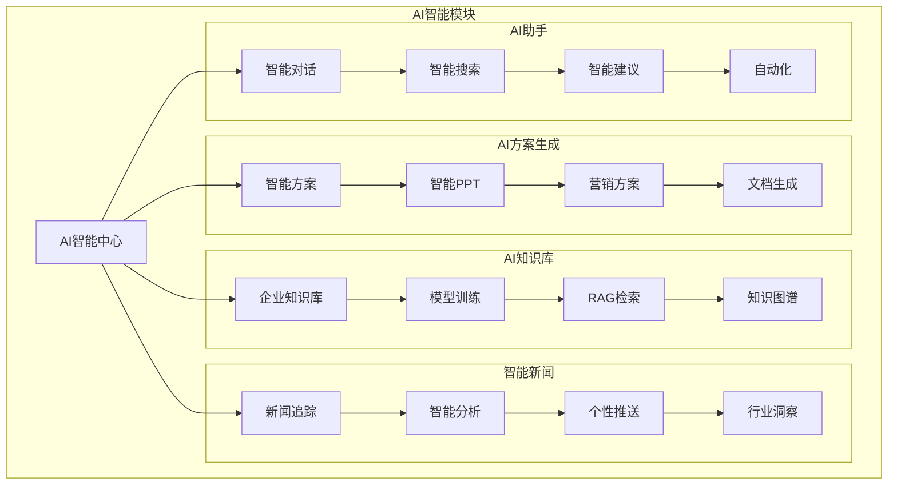
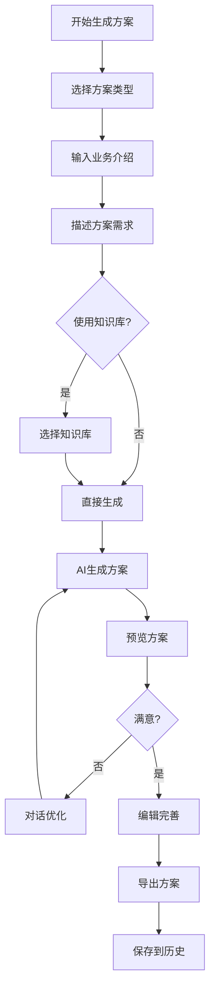
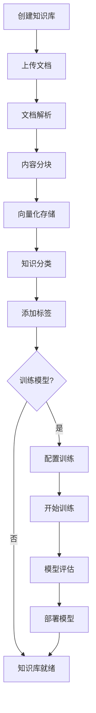
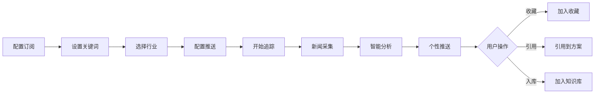
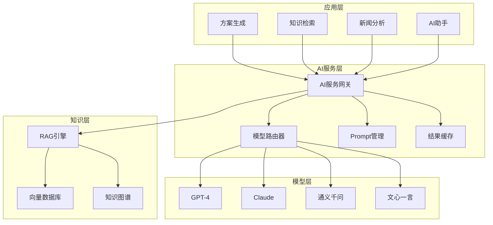
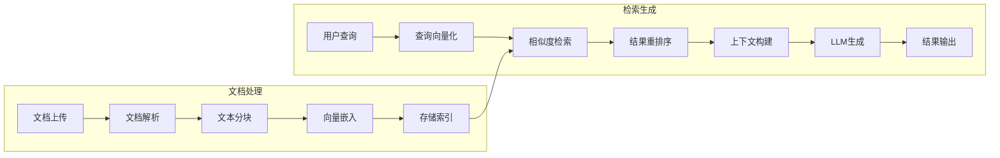

# AI智能 - 功能概述

## 1. 模块简介

AI智能是摩塔 Mota 平台的核心功能模块，通过先进的大语言模型和RAG技术，为企业提供智能方案生成、AI知识库、智能新闻追踪、AI助手等能力，让AI真正理解企业业务，成为企业的智能助手。

## 2. 功能架构



## 3. 核心功能

### 3.1 AI方案生成

#### 3.1.1 智能方案生成

| 功能 | 描述 |
|-----|------|
| 业务介绍输入 | 输入公司业务介绍，AI理解业务背景和特点 |
| 需求描述 | 描述方案需求，包括目标客户、场景、目的等 |
| 方案类型选择 | 选择方案类型：商务方案、技术方案、咨询报告等 |
| AI智能生成 | 基于输入信息和企业知识库，AI一键生成专业方案 |
| 方案预览 | 在线预览生成的方案内容 |
| 方案编辑 | 对生成的方案进行编辑和调整 |
| 多轮优化 | 通过对话方式持续优化方案内容 |
| 方案导出 | 导出为Word、PDF等格式 |

#### 3.1.2 智能PPT生成

| 功能 | 描述 |
|-----|------|
| 方案转PPT | 将生成的方案自动转换为PPT格式 |
| PPT模板选择 | 选择不同风格的PPT模板 |
| 智能排版 | AI自动进行内容排版和美化 |
| 图表生成 | 自动生成数据图表和可视化内容 |
| PPT预览 | 在线预览PPT效果 |
| PPT编辑 | 在线编辑PPT内容和样式 |
| PPT导出 | 导出为PPTX、PDF等格式 |

#### 3.1.3 营销方案生成

| 功能 | 描述 |
|-----|------|
| 营销目标设定 | 设定营销目标和KPI |
| 目标受众分析 | AI分析目标受众特征 |
| 营销策略生成 | 生成营销策略和推广方案 |
| 内容创意生成 | 生成营销文案和创意内容 |
| 渠道建议 | 推荐适合的营销渠道 |
| 预算规划 | 生成营销预算建议 |
| 效果预测 | 预测营销效果和ROI |

#### 3.1.4 其他方案类型

| 方案类型 | 描述 |
|---------|------|
| 产品介绍 | 生成产品介绍文档 |
| 投标文档 | 生成投标书和技术响应 |
| 咨询报告 | 生成行业分析和咨询报告 |
| 培训方案 | 生成培训计划和课程方案 |
| 项目计划 | 生成项目计划书 |
| 合作提案 | 生成商务合作提案 |

### 3.2 AI知识库

#### 3.2.1 企业知识库管理

| 功能 | 描述 |
|-----|------|
| 知识库创建 | 创建企业专属知识库 |
| 文档上传 | 上传企业文档、资料、案例等 |
| 批量导入 | 批量导入多个文档 |
| 文档解析 | 自动解析文档内容，支持PDF、Word、Excel、PPT等格式 |
| 知识分类 | 对知识进行分类管理 |
| 知识标签 | 为知识添加标签 |
| 知识搜索 | 搜索知识库内容 |
| 权限管理 | 配置知识库访问权限 |

#### 3.2.2 模型训练

| 功能 | 描述 |
|-----|------|
| 训练数据准备 | 准备和清洗训练数据 |
| 模型配置 | 配置模型训练参数 |
| 开始训练 | 启动模型训练任务 |
| 训练进度 | 查看训练进度和状态 |
| 训练日志 | 查看训练日志和指标 |
| 模型评估 | 评估模型效果 |
| 模型部署 | 部署训练好的模型 |

#### 3.2.3 模型管理

| 功能 | 描述 |
|-----|------|
| 模型列表 | 查看企业所有模型 |
| 模型版本 | 管理模型版本 |
| 模型切换 | 切换使用的模型版本 |
| 模型回滚 | 回滚到历史版本 |
| 模型删除 | 删除不需要的模型 |
| 使用统计 | 查看模型使用统计 |

#### 3.2.4 RAG检索增强

| 功能 | 描述 |
|-----|------|
| 向量化存储 | 将文档内容向量化存储 |
| 语义检索 | 基于语义的智能检索 |
| 混合检索 | 结合关键词和语义的混合检索 |
| 上下文构建 | 智能构建检索上下文 |
| 结果排序 | 智能排序检索结果 |

### 3.3 智能新闻追踪

#### 3.3.1 新闻订阅

| 功能 | 描述 |
|-----|------|
| 关键词设置 | 设置业务相关关键词 |
| 行业选择 | 选择关注的行业领域 |
| 竞品设置 | 设置竞争对手名单 |
| 新闻源配置 | 配置新闻来源 |
| 推送频率 | 设置新闻推送频率 |

#### 3.3.2 新闻追踪

| 功能 | 描述 |
|-----|------|
| 实时追踪 | 实时追踪相关新闻 |
| 新闻列表 | 查看追踪到的新闻列表 |
| 新闻详情 | 查看新闻详细内容 |
| 新闻收藏 | 收藏重要新闻 |
| 新闻分享 | 分享新闻给团队成员 |

#### 3.3.3 智能分析

| 功能 | 描述 |
|-----|------|
| 热点分析 | 分析行业热点趋势 |
| 情感分析 | 分析新闻情感倾向 |
| 竞品动态 | 分析竞品相关动态 |
| 趋势预测 | 预测行业发展趋势 |
| 洞察报告 | 生成行业洞察报告 |

#### 3.3.4 新闻应用

| 功能 | 描述 |
|-----|------|
| 引用到方案 | 将新闻引用到方案中 |
| 数据支撑 | 为方案提供数据支撑 |
| 热点借势 | 基于热点生成营销内容 |
| 知识入库 | 将新闻加入知识库 |

### 3.4 AI助手

#### 3.4.1 智能对话

| 功能 | 描述 |
|-----|------|
| 自然语言交互 | 支持自然语言对话 |
| 多轮对话 | 支持上下文连续对话 |
| 意图识别 | 智能识别用户意图 |
| 任务执行 | 根据对话执行任务 |

#### 3.4.2 智能搜索

| 功能 | 描述 |
|-----|------|
| 全局搜索 | 搜索项目、文档、知识等 |
| 语义搜索 | 基于语义的智能搜索 |
| 搜索建议 | 智能搜索建议 |
| 结果摘要 | AI生成搜索结果摘要 |

#### 3.4.3 智能建议

| 功能 | 描述 |
|-----|------|
| 任务建议 | 推荐下一步任务 |
| 内容建议 | 推荐相关内容 |
| 优化建议 | 提供优化建议 |
| 风险提示 | 智能风险提示 |

## 4. 用户流程

### 4.1 AI方案生成流程



### 4.2 知识库构建流程



### 4.3 智能新闻追踪流程



## 5. 界面设计

### 5.1 AI方案生成页面

```
┌─────────────────────────────────────────────────────────────────┐
│  AI方案生成                                                      │
├─────────────────────────────────────────────────────────────────┤
│                                                                 │
│  ┌─────────────────────────────────────────────────────────┐   │
│  │ 方案类型                                                 │   │
│  │ ┌────────┐ ┌────────┐ ┌────────┐ ┌────────┐ ┌────────┐ │   │
│  │ │ 商务方案│ │ 技术方案│ │ 营销方案│ │ 投标文档│ │ 更多... │ │   │
│  │ │   ✓    │ │        │ │        │ │        │ │        │ │   │
│  │ └────────┘ └────────┘ └────────┘ └────────┘ └────────┘ │   │
│  └─────────────────────────────────────────────────────────┘   │
│                                                                 │
│  ┌─────────────────────────────────────────────────────────┐   │
│  │ 业务介绍                                                 │   │
│  │ ┌───────────────────────────────────────────────────┐   │   │
│  │ │ 请输入您的公司/业务介绍，帮助AI更好地理解您的业务...  │   │   │
│  │ │                                                   │   │   │
│  │ │                                                   │   │   │
│  │ └───────────────────────────────────────────────────┘   │   │
│  └─────────────────────────────────────────────────────────┘   │
│                                                                 │
│  ┌─────────────────────────────────────────────────────────┐   │
│  │ 方案需求                                                 │   │
│  │ ┌───────────────────────────────────────────────────┐   │   │
│  │ │ 请描述您的方案需求，包括目标客户、使用场景、期望效果等│   │   │
│  │ │                                                   │   │   │
│  │ │                                                   │   │   │
│  │ └───────────────────────────────────────────────────┘   │   │
│  └─────────────────────────────────────────────────────────┘   │
│                                                                 │
│  ┌─────────────────────────────────────────────────────────┐   │
│  │ 知识库增强                                               │   │
│  │ ☑ 使用企业知识库增强生成效果                             │   │
│  │ 选择知识库: [产品知识库 ▼] [历史方案库 ▼] [行业资料库 ▼] │   │
│  └─────────────────────────────────────────────────────────┘   │
│                                                                 │
│                              [🚀 开始生成]                       │
│                                                                 │
└─────────────────────────────────────────────────────────────────┘
```

### 5.2 方案预览与编辑页面

```
┌─────────────────────────────────────────────────────────────────┐
│  方案预览                              [编辑] [导出▼] [保存]     │
├─────────────────────────────────────────────────────────────────┤
│                                                                 │
│  ┌─────────────────────┐ ┌─────────────────────────────────┐   │
│  │ AI对话优化          │ │ 方案内容                         │   │
│  │                     │ │                                 │   │
│  │ 💬 您好，我已为您生 │ │ # 智能制造解决方案               │   │
│  │ 成方案初稿，请查看  │ │                                 │   │
│  │ 右侧内容。          │ │ ## 1. 项目背景                   │   │
│  │                     │ │                                 │   │
│  │ 👤 请帮我增加一个   │ │ 随着工业4.0的深入推进，制造业    │   │
│  │ 实施计划章节        │ │ 正面临数字化转型的关键时期...    │   │
│  │                     │ │                                 │   │
│  │ 💬 好的，我已添加   │ │ ## 2. 解决方案                   │   │
│  │ 实施计划章节，包含  │ │                                 │   │
│  │ 三个阶段...         │ │ ### 2.1 整体架构                 │   │
│  │                     │ │                                 │   │
│  │ 👤 把预算部分的数   │ │ 本方案采用云边端协同架构...      │   │
│  │ 据调整为100万       │ │                                 │   │
│  │                     │ │ ### 2.2 核心功能                 │   │
│  │ 💬 已将预算调整为   │ │                                 │   │
│  │ 100万元。           │ │ - 设备互联                       │   │
│  │                     │ │ - 数据采集                       │   │
│  │ ┌───────────────┐   │ │ - 智能分析                       │   │
│  │ │ 输入优化建议... │   │ │                                 │   │
│  │ └───────────────┘   │ │ ## 3. 实施计划                   │   │
│  │         [发送]      │ │                                 │   │
│  └─────────────────────┘ │ ...                              │   │
│                          └─────────────────────────────────┘   │
│                                                                 │
└─────────────────────────────────────────────────────────────────┘
```

### 5.3 AI知识库页面

```
┌─────────────────────────────────────────────────────────────────┐
│  AI知识库                                      [+ 创建知识库]    │
├─────────────────────────────────────────────────────────────────┤
│  🔍 搜索知识...                                                  │
├─────────────────────────────────────────────────────────────────┤
│                                                                 │
│  📊 知识库概览                                                   │
│  ┌──────────┐ ┌──────────┐ ┌──────────┐ ┌──────────┐           │
│  │ 知识库数量│ │ 文档总数  │ │ 知识条目  │ │ 本月调用  │           │
│  │    5     │ │   234    │ │  12,456  │ │  3,890   │           │
│  └──────────┘ └──────────┘ └──────────┘ └──────────┘           │
│                                                                 │
│  📚 我的知识库                                                   │
│  ┌─────────────────────────────────────────────────────────┐   │
│  │ 📁 产品知识库                                    ⭐ ⚙️   │   │
│  │ 产品介绍、功能说明、使用手册                             │   │
│  │ 📄 56 文档  │  🧠 已训练  │  📅 更新于 2小时前           │   │
│  ├─────────────────────────────────────────────────────────┤   │
│  │ 📁 历史方案库                                       ⚙️   │   │
│  │ 历史项目方案、成功案例                                   │   │
│  │ 📄 128 文档 │  🧠 已训练  │  📅 更新于 1天前             │   │
│  ├─────────────────────────────────────────────────────────┤   │
│  │ 📁 行业资料库                                       ⚙️   │   │
│  │ 行业报告、市场分析、竞品资料                             │   │
│  │ 📄 45 文档  │  🧠 训练中  │  📅 更新于 3天前             │   │
│  └─────────────────────────────────────────────────────────┘   │
│                                                                 │
└─────────────────────────────────────────────────────────────────┘
```

### 5.4 智能新闻页面

```
┌─────────────────────────────────────────────────────────────────┐
│  智能新闻                                      [订阅设置] [刷新] │
├─────────────────────────────────────────────────────────────────┤
│  分类: [全部] [行业动态] [竞品资讯] [政策法规] [技术趋势]        │
├─────────────────────────────────────────────────────────────────┤
│                                                                 │
│  🔥 今日热点                                                     │
│  ┌─────────────────────────────────────────────────────────┐   │
│  │ 📰 工信部发布《智能制造发展规划》                  🔖 📤  │   │
│  │ 工信部今日发布最新智能制造发展规划，明确2025年目标...    │   │
│  │ 来源: 工信部官网  │  2小时前  │  相关度: 95%             │   │
│  │ 标签: [政策] [智能制造] [工业4.0]                        │   │
│  │                                    [引用到方案] [加入知识库]│   │
│  ├─────────────────────────────────────────────────────────┤   │
│  │ 📰 某竞品公司完成B轮融资，估值达10亿美元          🔖 📤  │   │
│  │ 据悉，某竞品公司近日完成B轮融资，由知名投资机构领投...   │   │
│  │ 来源: 36氪  │  5小时前  │  相关度: 88%                   │   │
│  │ 标签: [竞品动态] [融资] [行业]                           │   │
│  │                                    [引用到方案] [加入知识库]│   │
│  ├─────────────────────────────────────────────────────────┤   │
│  │ 📰 2024年制造业数字化转型趋势报告发布              🔖 📤  │   │
│  │ 某研究机构发布最新报告，分析制造业数字化转型趋势...      │   │
│  │ 来源: 艾瑞咨询  │  1天前  │  相关度: 82%                 │   │
│  │ 标签: [行业报告] [数字化转型] [趋势]                     │   │
│  │                                    [引用到方案] [加入知识库]│   │
│  └─────────────────────────────────────────────────────────┘   │
│                                                                 │
│  📊 行业洞察                                                     │
│  ┌─────────────────────────────────────────────────────────┐   │
│  │ 本周热点关键词                                           │   │
│  │ [智能制造] [数字化转型] [工业互联网] [AI应用] [碳中和]   │   │
│  │                                                         │   │
│  │ 行业情感趋势: 积极 ↑ 12%                                 │   │
│  │                                      [查看详细洞察报告]   │   │
│  └─────────────────────────────────────────────────────────┘   │
│                                                                 │
└─────────────────────────────────────────────────────────────────┘
```

### 5.5 AI助手页面

```
┌─────────────────────────────────────────────────────────────────┐
│  AI助手                                              [设置] [?] │
├─────────────────────────────────────────────────────────────────┤
│                                                                 │
│  ┌─────────────────────────────────────────────────────────┐   │
│  │                                                         │   │
│  │  💬 您好！我是摩塔AI助手，可以帮您：                      │   │
│  │     • 生成各类商务方案                                   │   │
│  │     • 搜索企业知识库                                     │   │
│  │     • 追踪行业新闻动态                                   │   │
│  │     • 回答业务相关问题                                   │   │
│  │                                                         │   │
│  │  请问有什么可以帮您的？                                  │   │
│  │                                                         │   │
│  │  ─────────────────────────────────────────────────────  │   │
│  │                                                         │   │
│  │  👤 帮我查一下最近关于智能制造的政策新闻                  │   │
│  │                                                         │   │
│  │  ─────────────────────────────────────────────────────  │   │
│  │                                                         │   │
│  │  💬 好的，我为您找到了以下相关新闻：                      │   │
│  │                                                         │   │
│  │  1. 《工信部发布智能制造发展规划》- 2小时前              │   │
│  │     摘要：明确2025年智能制造发展目标...                  │   │
│  │                                                         │   │
│  │  2. 《某省出台智能制造扶持政策》- 1天前                  │   │
│  │     摘要：提供最高500万元补贴...                         │   │
│  │                                                         │   │
│  │  需要我将这些新闻整理成报告吗？                          │   │
│  │                                                         │   │
│  └─────────────────────────────────────────────────────────┘   │
│                                                                 │
│  ┌─────────────────────────────────────────────────────────┐   │
│  │ 💭 输入您的问题...                              [发送] 🎤 │   │
│  └─────────────────────────────────────────────────────────┘   │
│                                                                 │
│  快捷操作: [生成方案] [搜索知识] [查看新闻] [创建任务]          │
│                                                                 │
└─────────────────────────────────────────────────────────────────┘
```

## 6. 数据模型

### 6.1 方案数据模型

```
Solution (方案)
├── id: 方案ID
├── team_id: 所属团队ID
├── creator_id: 创建人ID
├── type: 方案类型
├── title: 方案标题
├── content: 方案内容
├── business_intro: 业务介绍
├── requirements: 需求描述
├── knowledge_bases: 使用的知识库
├── version: 版本号
├── status: 状态
├── tags: 标签
├── created_at: 创建时间
└── updated_at: 更新时间

SolutionVersion (方案版本)
├── id: 版本ID
├── solution_id: 方案ID
├── version: 版本号
├── content: 内容快照
├── change_summary: 变更说明
├── editor_id: 编辑人ID
└── created_at: 创建时间

SolutionConversation (方案对话)
├── id: 对话ID
├── solution_id: 方案ID
├── role: 角色 (user/assistant)
├── content: 对话内容
├── created_at: 创建时间
└── updated_at: 更新时间
```

### 6.2 知识库数据模型

```
KnowledgeBase (知识库)
├── id: 知识库ID
├── team_id: 所属团队ID
├── name: 知识库名称
├── description: 描述
├── type: 类型
├── status: 状态
├── document_count: 文档数量
├── chunk_count: 分块数量
├── model_id: 关联模型ID
├── settings: 配置
├── created_at: 创建时间
└── updated_at: 更新时间

Document (文档)
├── id: 文档ID
├── knowledge_base_id: 所属知识库ID
├── name: 文档名称
├── type: 文档类型
├── size: 文件大小
├── content: 原始内容
├── status: 处理状态
├── chunk_count: 分块数量
├── uploader_id: 上传人ID
├── created_at: 创建时间
└── updated_at: 更新时间

DocumentChunk (文档分块)
├── id: 分块ID
├── document_id: 文档ID
├── content: 分块内容
├── embedding: 向量嵌入
├── metadata: 元数据
├── position: 位置
└── created_at: 创建时间

TrainedModel (训练模型)
├── id: 模型ID
├── knowledge_base_id: 知识库ID
├── name: 模型名称
├── version: 版本
├── base_model: 基础模型
├── status: 状态
├── metrics: 评估指标
├── config: 训练配置
├── created_at: 创建时间
└── updated_at: 更新时间
```

### 6.3 新闻数据模型

```
NewsSubscription (新闻订阅)
├── id: 订阅ID
├── team_id: 团队ID
├── user_id: 用户ID
├── keywords: 关键词列表
├── industries: 行业列表
├── competitors: 竞品列表
├── sources: 新闻源
├── frequency: 推送频率
├── is_active: 是否启用
├── created_at: 创建时间
└── updated_at: 更新时间

NewsArticle (新闻文章)
├── id: 文章ID
├── title: 标题
├── content: 内容
├── summary: 摘要
├── source: 来源
├── url: 原文链接
├── published_at: 发布时间
├── sentiment: 情感分析
├── relevance: 相关度
├── tags: 标签
├── created_at: 创建时间
└── updated_at: 更新时间

NewsCollection (新闻收藏)
├── id: 收藏ID
├── user_id: 用户ID
├── article_id: 文章ID
├── note: 备注
├── created_at: 创建时间
└── updated_at: 更新时间
```

## 7. 技术架构

### 7.1 AI引擎架构



### 7.2 RAG检索流程



### 7.3 多模型管理

| 模型 | 适用场景 | 优势 |
|-----|---------|------|
| GPT-4 | 复杂方案生成 | 推理能力强 |
| Claude | 长文档处理 | 上下文窗口大 |
| 通义千问 | 中文场景 | 中文理解好 |
| 文心一言 | 备用模型 | 国产合规 |

## 8. 接口设计

### 8.1 方案生成接口

| 接口 | 方法 | 描述 |
|-----|------|------|
| /api/ai/solutions | POST | 创建方案 |
| /api/ai/solutions/:id | GET | 获取方案详情 |
| /api/ai/solutions/:id | PUT | 更新方案 |
| /api/ai/solutions/:id/generate | POST | 生成方案内容 |
| /api/ai/solutions/:id/optimize | POST | 优化方案内容 |
| /api/ai/solutions/:id/export | POST | 导出方案 |
| /api/ai/solutions/:id/versions | GET | 获取版本历史 |

### 8.2 知识库接口

| 接口 | 方法 | 描述 |
|-----|------|------|
| /api/ai/knowledge-bases | POST | 创建知识库 |
| /api/ai/knowledge-bases | GET | 获取知识库列表 |
| /api/ai/knowledge-bases/:id | GET | 获取知识库详情 |
| /api/ai/knowledge-bases/:id/documents | POST | 上传文档 |
| /api/ai/knowledge-bases/:id/search | POST | 搜索知识 |
| /api/ai/knowledge-bases/:id/train | POST | 开始训练 |
| /api/ai/knowledge-bases/:id/models | GET | 获取模型列表 |

### 8.3 新闻接口

| 接口 | 方法 | 描述 |
|-----|------|------|
| /api/ai/news/subscriptions | POST | 创建订阅 |
| /api/ai/news/subscriptions | GET | 获取订阅配置 |
| /api/ai/news/articles | GET | 获取新闻列表 |
| /api/ai/news/articles/:id | GET | 获取新闻详情 |
| /api/ai/news/collections | POST | 收藏新闻 |
| /api/ai/news/insights | GET | 获取行业洞察 |

### 8.4 AI助手接口

| 接口 | 方法 | 描述 |
|-----|------|------|
| /api/ai/assistant/chat | POST | 发送对话 |
| /api/ai/assistant/search | POST | 智能搜索 |
| /api/ai/assistant/suggest | GET | 获取建议 |
| /api/ai/assistant/history | GET | 获取对话历史 |

---

*摩塔 Mota - 让每家企业都拥有懂自己业务的AI助手*