# AI智能 - 用户流程

## 1. AI方案生成流程

### 1.1 完整流程图

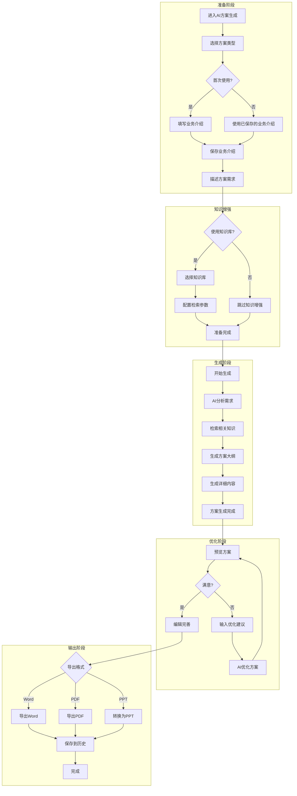

### 1.2 方案类型选择

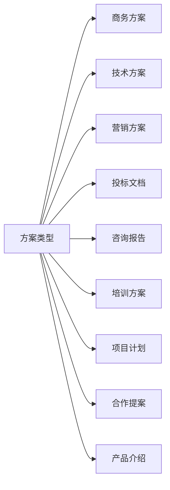

### 1.3 多轮对话优化流程

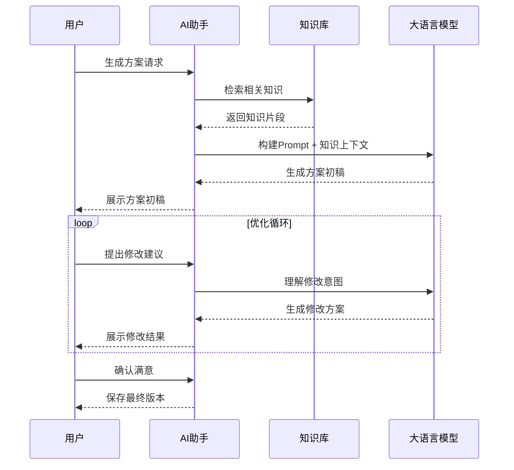

## 2. AI知识库流程

### 2.1 知识库创建流程

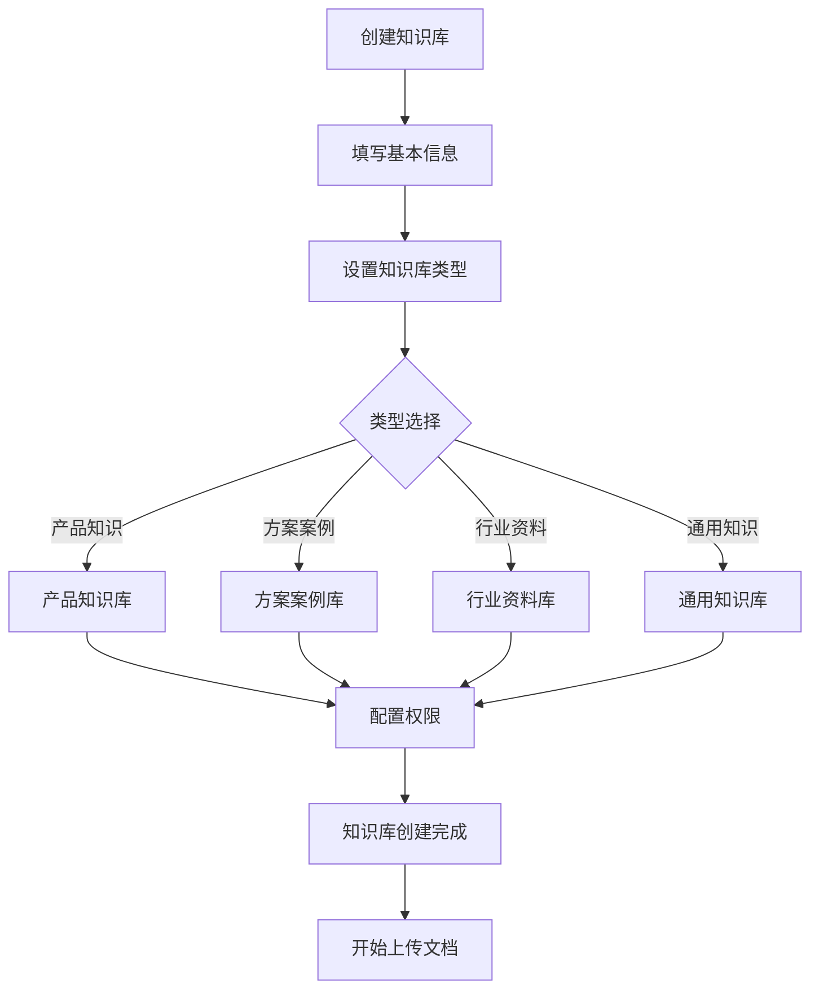

### 2.2 文档上传与处理流程

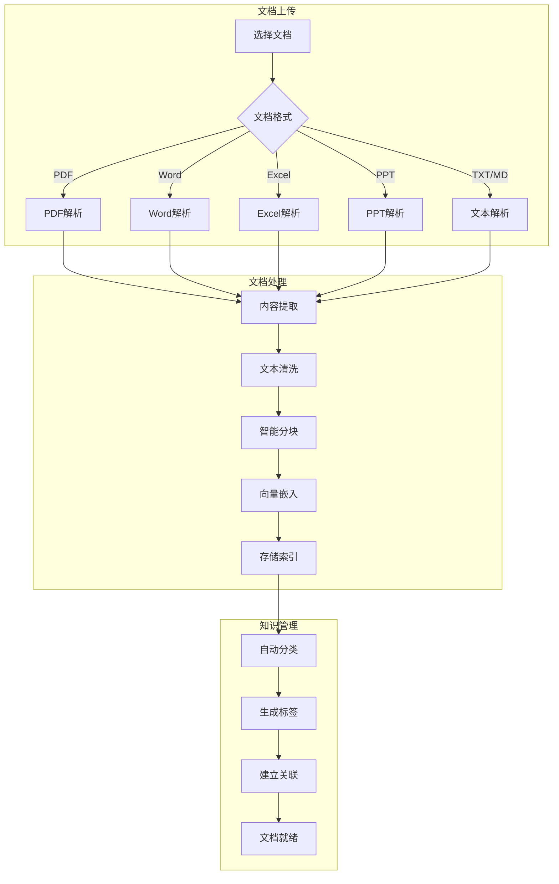

### 2.3 模型训练流程

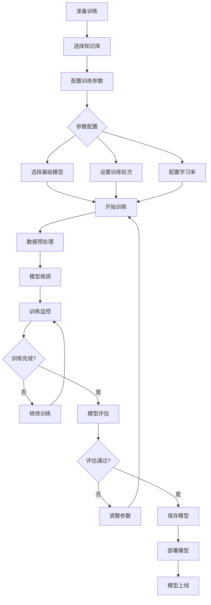

### 2.4 知识检索流程

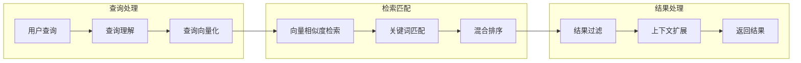

## 3. 智能新闻流程

### 3.1 新闻订阅配置流程

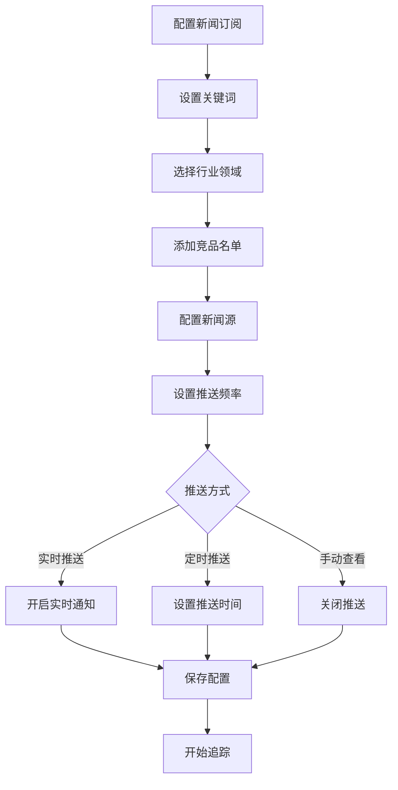

### 3.2 新闻追踪与分析流程

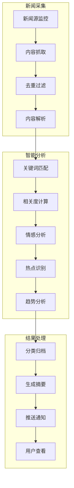

### 3.3 新闻应用流程

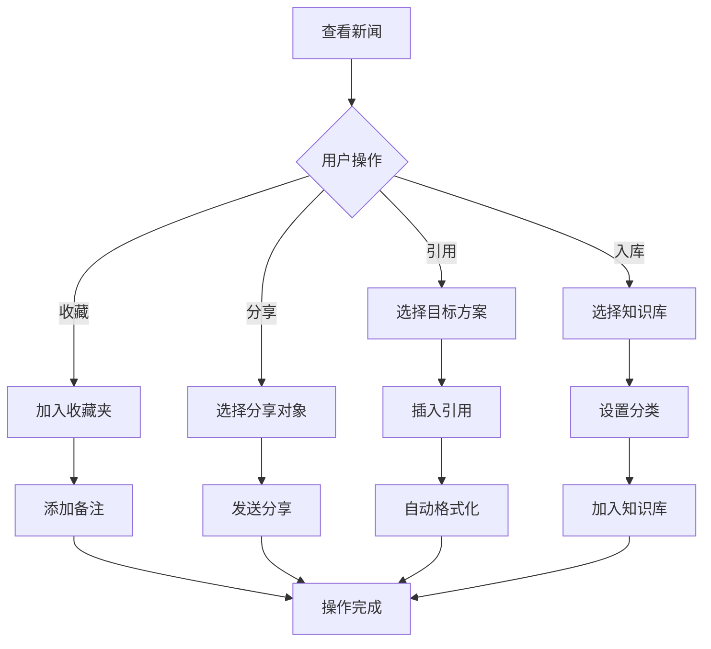

## 4. AI助手流程

### 4.1 智能对话流程

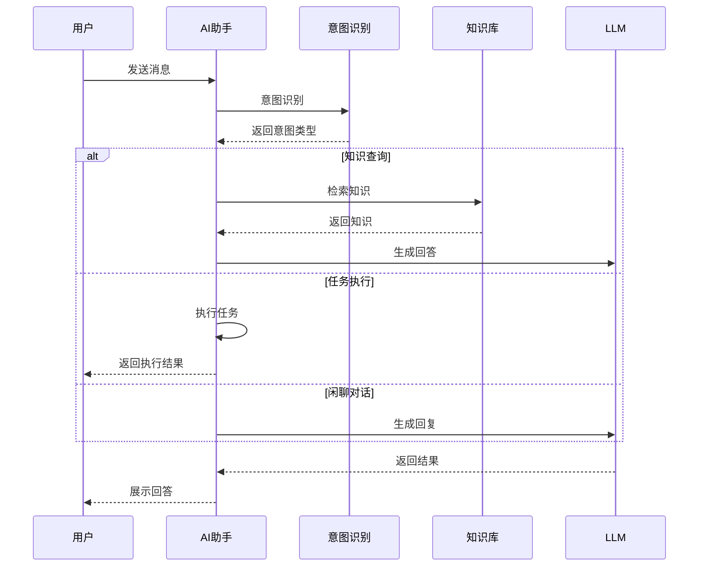

### 4.2 智能搜索流程

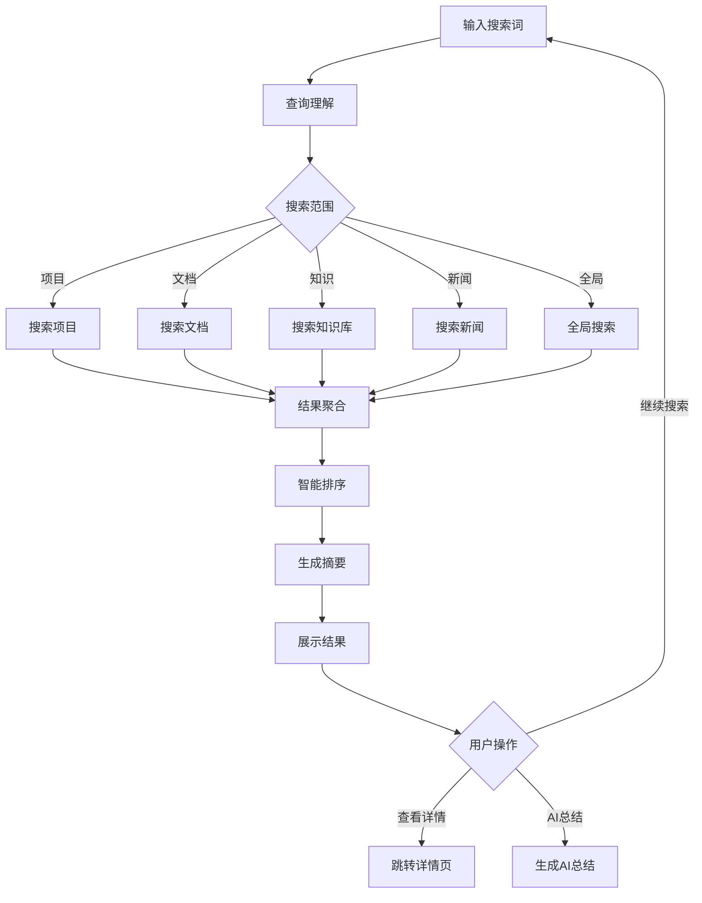

### 4.3 智能建议流程

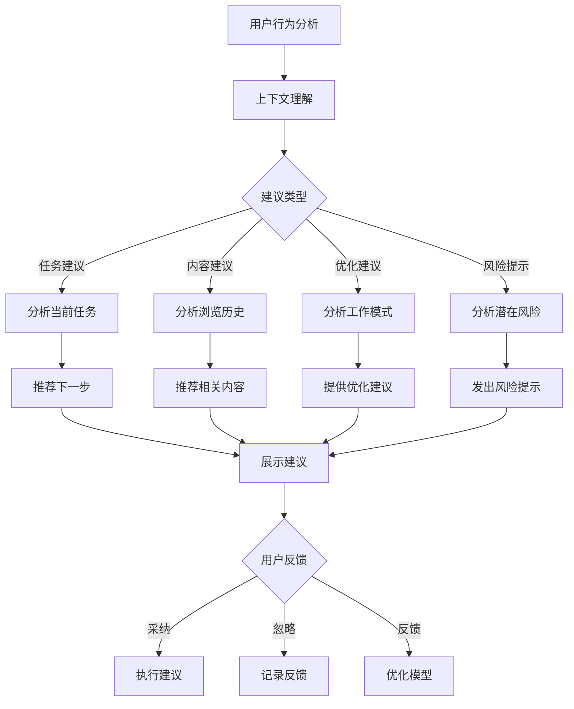

## 5. 历史记录管理流程

### 5.1 方案历史管理

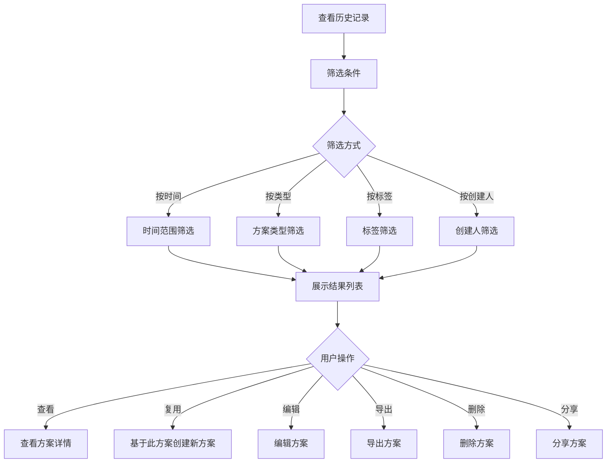

### 5.2 版本管理流程

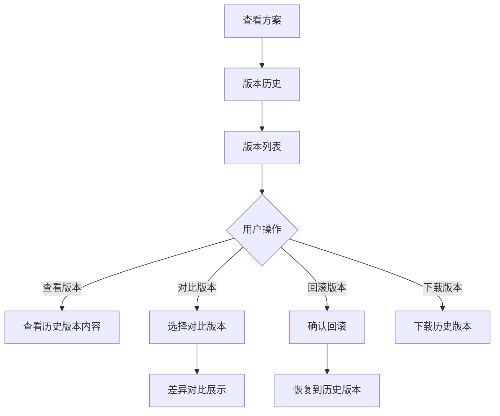

## 6. 协作流程

### 6.1 方案协作流程

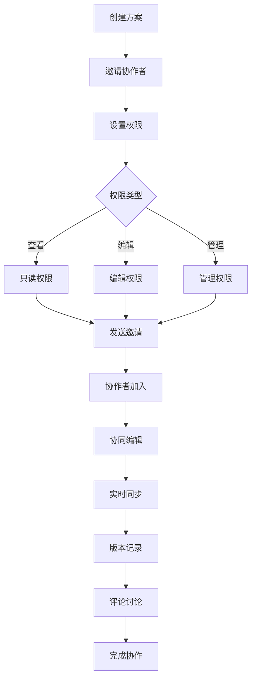

### 6.2 知识共享流程

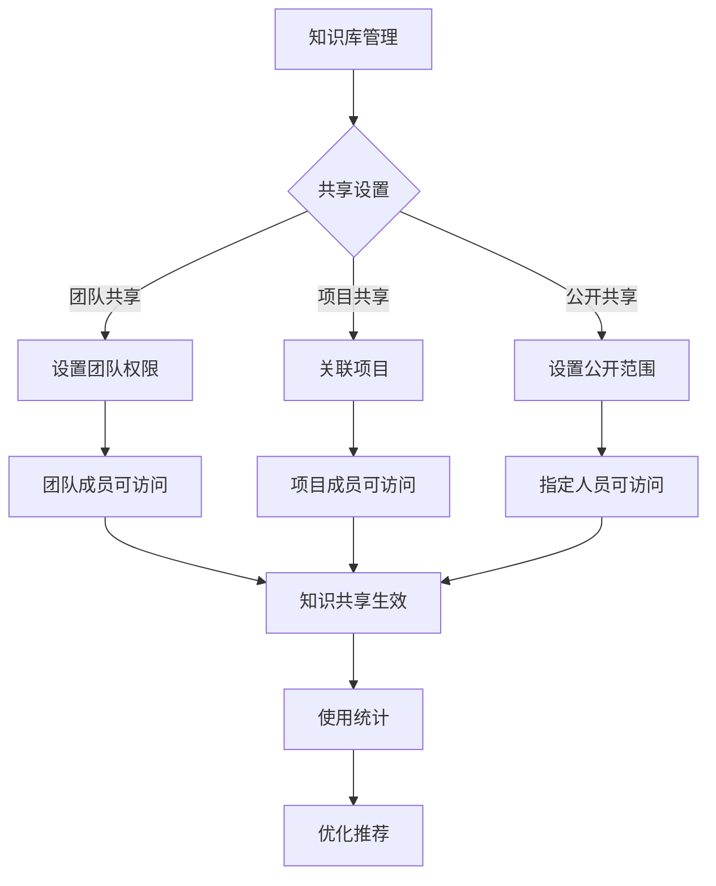

## 7. 典型使用场景

### 7.1 场景一：快速生成商务方案

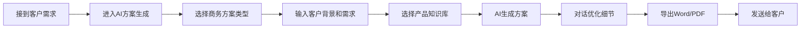

### 7.2 场景二：基于新闻生成营销内容

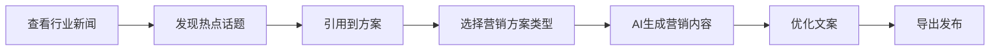

### 7.3 场景三：构建企业知识库

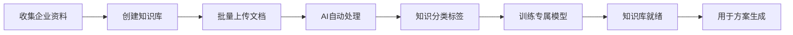

---

*摩塔 Mota - 让每家企业都拥有懂自己业务的AI助手*