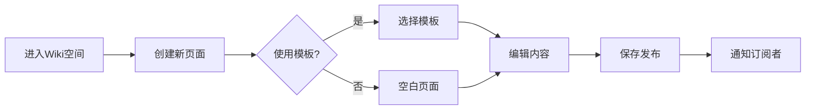

# 知识管理 - 功能概述

## 1. 模块简介

知识管理是摩塔 Mota 平台的核心支撑模块，与AI知识库深度集成，提供 Wiki 文档、文件管理等能力，帮助企业沉淀和共享知识，为AI方案生成提供知识支撑，让AI越用越懂企业业务。

## 2. 功能架构

```mermaid
graph TB
    subgraph 知识管理
        KM[知识管理中心]
        
        subgraph Wiki文档
            WIKI[Wiki空间]
            PAGE[文档页面]
            TEMPLATE[文档模板]
            HISTORY[版本历史]
        end

        subgraph 文件管理
            FILE[文件列表]
            FOLDER[文件夹]
            UPLOAD[文件上传]
            SHARE[文件分享]
        end

        subgraph 协作功能
            EDIT[协同编辑]
            COMMENT[评论讨论]
            MENTION[@提及]
            SUBSCRIBE[订阅通知]
        end

        subgraph 搜索发现
            SEARCH[全文搜索]
            TAG[标签分类]
            RECENT[最近访问]
            RECOMMEND[智能推荐]
        end
    end

    KM --> WIKI & FILE & EDIT & SEARCH
    WIKI --> PAGE --> TEMPLATE --> HISTORY
    FILE --> FOLDER --> UPLOAD --> SHARE
    EDIT --> COMMENT --> MENTION --> SUBSCRIBE
    SEARCH --> TAG --> RECENT --> RECOMMEND
```

## 3. 核心功能

### 3.1 Wiki 文档

| 功能 | 描述 |
|-----|------|
| 创建空间 | 创建 Wiki 知识空间 |
| 创建页面 | 创建文档页面 |
| 富文本编辑 | 支持富文本编辑器 |
| Markdown | 支持 Markdown 语法 |
| 文档模板 | 使用预设模板创建文档 |
| 版本管理 | 文档版本历史和回滚 |
| 导入导出 | 支持多种格式导入导出 |

### 3.2 文件管理

| 功能 | 描述 |
|-----|------|
| 文件上传 | 上传各类文件 |
| 文件夹管理 | 创建和管理文件夹 |
| 文件预览 | 在线预览常见文件格式 |
| 文件下载 | 下载文件到本地 |
| 文件分享 | 生成分享链接 |
| 版本管理 | 文件版本控制 |

### 3.3 协作功能

| 功能 | 描述 |
|-----|------|
| 协同编辑 | 多人实时协同编辑 |
| 评论讨论 | 在文档中添加评论 |
| @提及 | 提及团队成员 |
| 订阅通知 | 订阅文档变更通知 |
| 权限控制 | 文档访问权限管理 |

## 4. 用户流程

### 4.1 文档创建流程



### 4.2 文档协作流程

```mermaid
graph TB
    A[打开文档] --> B{有编辑权限?}
    B -->|否| C[只读查看]
    B -->|是| D[进入编辑]
    D --> E[实时协同]
    E --> F[自动保存]
    F --> G[版本记录]
    C --> H[添加评论]
    H --> I[@提及相关人]
```

## 5. 界面设计

### 5.1 Wiki 空间列表

```
┌─────────────────────────────────────────────────────────────────┐
│  知识库                                        [+ 创建空间]      │
├─────────────────────────────────────────────────────────────────┤
│  🔍 搜索文档...                                                  │
├─────────────────────────────────────────────────────────────────┤
│                                                                 │
│  ┌─────────────────────────────────────────────────────────┐   │
│  │ 📚 产品文档                                        ⭐ ⚙️  │   │
│  │ 产品需求、设计文档、用户手册                              │   │
│  │ 📄 45 篇文档  │  👥 12 成员  │  📅 更新于 2小时前         │   │
│  ├─────────────────────────────────────────────────────────┤   │
│  │ 📚 技术文档                                        ⭐ ⚙️  │   │
│  │ 技术方案、架构设计、API文档                               │   │
│  │ 📄 78 篇文档  │  👥 8 成员   │  📅 更新于 1天前           │   │
│  ├─────────────────────────────────────────────────────────┤   │
│  │ 📚 团队规范                                           ⚙️  │   │
│  │ 开发规范、流程规范、最佳实践                              │   │
│  │ 📄 23 篇文档  │  👥 全员     │  📅 更新于 1周前           │   │
│  ├─────────────────────────────────────────────────────────┤   │
│  │ 📚 会议纪要                                           ⚙️  │   │
│  │ 周会、评审会、复盘会议记录                                │   │
│  │ 📄 56 篇文档  │  👥 全员     │  📅 更新于 3天前           │   │
│  └─────────────────────────────────────────────────────────┘   │
│                                                                 │
└─────────────────────────────────────────────────────────────────┘
```

### 5.2 Wiki 文档页面

```
┌─────────────────────────────────────────────────────────────────┐
│  产品文档 / 摩塔产品需求文档                     [编辑] [更多▼]  │
├─────────────────────────────────────────────────────────────────┤
│  📑 目录                │  文档内容                              │
│  ├─ 1. 产品概述         │  ─────────────────────────────────────│
│  ├─ 2. 功能需求         │                                       │
│  │  ├─ 2.1 用户管理     │  # 摩塔产品需求文档                    │
│  │  ├─ 2.2 项目管理     │                                       │
│  │  └─ 2.3 代码管理     │  ## 1. 产品概述                        │
│  ├─ 3. 非功能需求       │                                       │
│  └─ 4. 附录             │  摩塔是一款面向软件研发团队的一站式    │
│                         │  研发协作管理平台...                   │
│                         │                                       │
│                         │  ## 2. 功能需求                        │
│                         │                                       │
│                         │  ### 2.1 用户管理                      │
│                         │                                       │
│                         │  用户管理模块提供以下功能：            │
│                         │  - 用户注册                            │
│                         │  - 用户登录                            │
│                         │  - 密码管理                            │
│                         │                                       │
│                         │  ...                                   │
├─────────────────────────────────────────────────────────────────┤
│  💬 评论 (3)                                                     │
│  ┌─────────────────────────────────────────────────────────┐   │
│  │ 👤 张三  2小时前                                         │   │
│  │ 建议在用户管理部分增加权限说明                            │   │
│  │                                              [回复]      │   │
│  └─────────────────────────────────────────────────────────┘   │
│  [添加评论...]                                                   │
└─────────────────────────────────────────────────────────────────┘
```

### 5.3 文档编辑器

```
┌─────────────────────────────────────────────────────────────────┐
│  编辑: 摩塔产品需求文档                    [保存] [预览] [发布]  │
├─────────────────────────────────────────────────────────────────┤
│  工具栏:                                                         │
│  [B] [I] [U] [S] │ [H1] [H2] [H3] │ [•] [1.] │ [链接] [图片]    │
│  [代码] [引用] [表格] │ [任务列表] │ [分割线] │ [更多...]        │
├─────────────────────────────────────────────────────────────────┤
│                                                                 │
│  # 摩塔产品需求文档                                              │
│                                                                 │
│  ## 1. 产品概述                                                  │
│                                                                 │
│  摩塔是一款面向软件研发团队的一站式研发协作管理平台，提供从      │
│  需求规划、代码开发、构建测试到部署运维的全流程 DevOps 解决      │
│  方案。                                                          │
│                                                                 │
│  ## 2. 功能需求                                                  │
│                                                                 │
│  ### 2.1 用户管理                                                │
│                                                                 │
│  用户管理模块提供以下功能：                                      │
│  - 用户注册                                                      │
│  - 用户登录                                                      │
│  - 密码管理                                                      │
│                                                                 │
│  |                                                              │
│                                                                 │
├─────────────────────────────────────────────────────────────────┤
│  👥 协作者: 张三(编辑中) 李四(查看中)        自动保存于 10秒前   │
└─────────────────────────────────────────────────────────────────┘
```

### 5.4 文件管理页面

```
┌─────────────────────────────────────────────────────────────────┐
│  文件管理                                      [上传] [新建文件夹]│
├─────────────────────────────────────────────────────────────────┤
│  📁 全部文件 / 设计稿                                            │
│  🔍 搜索文件...                    排序: [修改时间▼] 视图: [列表]│
├─────────────────────────────────────────────────────────────────┤
│                                                                 │
│  ┌─────────────────────────────────────────────────────────┐   │
│  │ ☐ │ 名称              │ 大小    │ 修改时间   │ 操作     │   │
│  ├─────────────────────────────────────────────────────────┤   │
│  │ ☐ │ 📁 UI设计稿       │ -       │ 2024-03-15│ ⚙️       │   │
│  │ ☐ │ 📁 原型图         │ -       │ 2024-03-14│ ⚙️       │   │
│  │ ☐ │ 📄 产品架构图.png │ 2.5 MB  │ 2024-03-13│ ⚙️       │   │
│  │ ☐ │ 📄 流程图.pdf     │ 1.2 MB  │ 2024-03-12│ ⚙️       │   │
│  │ ☐ │ 📄 需求文档.docx  │ 500 KB  │ 2024-03-11│ ⚙️       │   │
│  └─────────────────────────────────────────────────────────┘   │
│                                                                 │
│  已使用 156 MB / 1 GB                                           │
│                                                                 │
└─────────────────────────────────────────────────────────────────┘
```

## 6. 数据模型

### 6.1 Wiki 数据模型

```
WikiSpace (Wiki空间)
├── id: 空间ID
├── project_id: 所属项目ID
├── name: 空间名称
├── description: 空间描述
├── visibility: 可见性
├── home_page_id: 首页ID
├── created_at: 创建时间
└── updated_at: 更新时间

WikiPage (Wiki页面)
├── id: 页面ID
├── space_id: 所属空间ID
├── parent_id: 父页面ID
├── title: 页面标题
├── content: 页面内容
├── format: 格式 (markdown/richtext)
├── version: 版本号
├── creator_id: 创建人ID
├── last_editor_id: 最后编辑人ID
├── created_at: 创建时间
└── updated_at: 更新时间

WikiPageVersion (页面版本)
├── id: 版本ID
├── page_id: 页面ID
├── version: 版本号
├── content: 内容快照
├── editor_id: 编辑人ID
├── change_summary: 变更说明
└── created_at: 创建时间
```

### 6.2 文件数据模型

```
File (文件)
├── id: 文件ID
├── project_id: 所属项目ID
├── folder_id: 所属文件夹ID
├── name: 文件名
├── size: 文件大小
├── mime_type: 文件类型
├── storage_path: 存储路径
├── version: 版本号
├── uploader_id: 上传人ID
├── created_at: 创建时间
└── updated_at: 更新时间

Folder (文件夹)
├── id: 文件夹ID
├── project_id: 所属项目ID
├── parent_id: 父文件夹ID
├── name: 文件夹名
├── created_at: 创建时间
└── updated_at: 更新时间
```

## 7. 文档模板

### 7.1 内置模板

| 模板类型 | 描述 |
|---------|------|
| 需求文档 | 产品需求说明书模板 |
| 技术方案 | 技术设计方案模板 |
| API 文档 | 接口文档模板 |
| 会议纪要 | 会议记录模板 |
| 周报模板 | 工作周报模板 |
| 复盘报告 | 项目复盘模板 |

### 7.2 自定义模板

支持用户创建和管理自定义文档模板，提高文档创建效率。

## 8. 导入导出

### 8.1 支持格式

| 格式 | 导入 | 导出 |
|-----|------|------|
| Markdown | ✓ | ✓ |
| Word (.docx) | ✓ | ✓ |
| PDF | - | ✓ |
| HTML | ✓ | ✓ |
| Confluence | ✓ | - |

---

*摩塔 Mota - 让每家企业都拥有懂自己业务的AI助手*