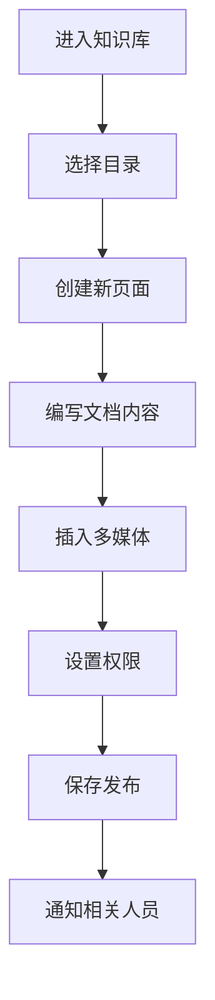
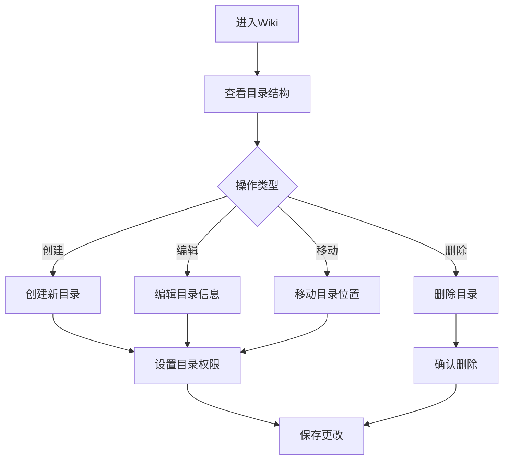
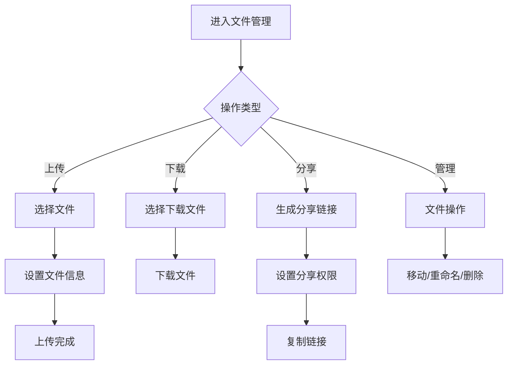
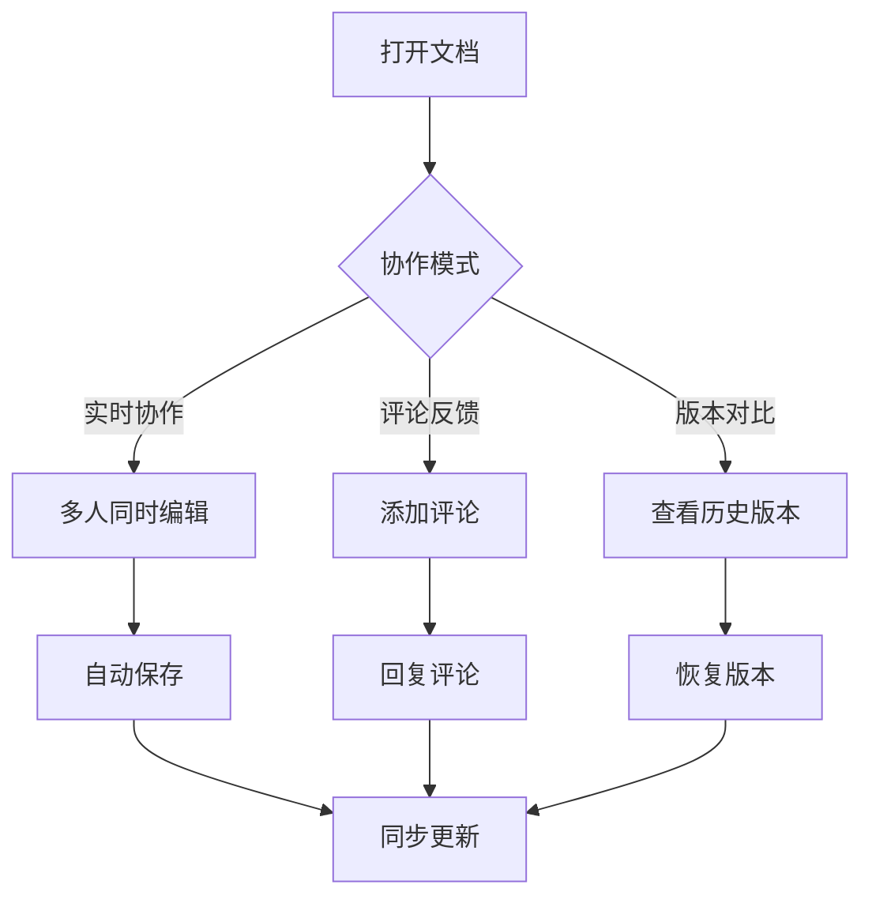

# 知识管理 - 用户流程文档

## 概述

本文档详细描述知识管理模块的所有用户操作流程，包括Wiki文档管理、文件管理、知识库协作等核心流程。

---

## 1. 创建Wiki文档流程

### 1.1 流程图



### 1.2 详细步骤

#### 步骤1：创建Wiki页面

**操作路径**: 知识管理 → Wiki → 创建页面

**界面说明**:
```
┌─────────────────────────────────────────────────────────────────┐
│  创建Wiki页面                                                    │
├─────────────────────────────────────────────────────────────────┤
│                                                                 │
│  页面标题 *                                                      │
│  ┌─────────────────────────────────────────────────────────┐   │
│  │ 摩塔Mota开发规范                                        │   │
│  └─────────────────────────────────────────────────────────┘   │
│                                                                 │
│  所属目录                                                        │
│  ┌─────────────────────────────────────────────────────────┐   │
│  │ 📁 技术文档 / 开发规范                              ▼   │   │
│  └─────────────────────────────────────────────────────────┘   │
│                                                                 │
│  页面模板                                                        │
│  ┌─────────────────────────────────────────────────────────┐   │
│  │ ○ 空白页面                                              │   │
│  │ ● 技术文档模板                                          │   │
│  │ ○ 会议纪要模板                                          │   │
│  │ ○ 需求文档模板                                          │   │
│  │ ○ API文档模板                                           │   │
│  └─────────────────────────────────────────────────────────┘   │
│                                                                 │
│                                             [取消]  [创建]       │
│                                                                 │
└─────────────────────────────────────────────────────────────────┘
```

#### 步骤2：编辑Wiki内容

**界面说明**:
```
┌─────────────────────────────────────────────────────────────────┐
│  📄 摩塔Mota开发规范                    [预览] [历史] [设置]     │
├─────────────────────────────────────────────────────────────────┤
│                                                                 │
│  工具栏                                                          │
│  ┌─────────────────────────────────────────────────────────┐   │
│  │ B  I  U  S  │ H1 H2 H3 │ • ─ 1. │ 🔗 📷 📎 📊 💻 │ ⟲ ⟳ │   │
│  └─────────────────────────────────────────────────────────┘   │
│                                                                 │
│  编辑区域                                                        │
│  ┌─────────────────────────────────────────────────────────┐   │
│  │ # 摩塔Mota开发规范                                      │   │
│  │                                                         │   │
│  │ ## 1. 概述                                              │   │
│  │                                                         │   │
│  │ 本文档定义了摩塔Mota项目的开发规范，包括代码风格、       │   │
│  │ 提交规范、分支管理等内容。                               │   │
│  │                                                         │   │
│  │ ## 2. 代码风格                                          │   │
│  │                                                         │   │
│  │ ### 2.1 命名规范                                        │   │
│  │                                                         │   │
│  │ - 类名使用大驼峰命名法：`UserService`                   │   │
│  │ - 方法名使用小驼峰命名法：`getUserById`                 │   │
│  │ - 常量使用全大写下划线：`MAX_RETRY_COUNT`               │   │
│  │                                                         │   │
│  │ ### 2.2 代码格式                                        │   │
│  │                                                         │   │
│  │ ```java                                                 │   │
│  │ public class UserService {                              │   │
│  │     private final UserRepository userRepository;        │   │
│  │                                                         │   │
│  │     public User getUserById(Long id) {                  │   │
│  │         return userRepository.findById(id)              │   │
│  │             .orElseThrow(() -> new NotFoundException());│   │
│  │     }                                                   │   │
│  │ }                                                       │   │
│  │ ```                                                     │   │
│  │                                                         │   │
│  │ ## 3. Git提交规范                                       │   │
│  │                                                         │   │
│  │ 提交信息格式：                                           │   │
│  │ ```                                                     │   │
│  │ <type>(<scope>): <subject>                              │   │
│  │ ```                                                     │   │
│  │                                                         │   │
│  └─────────────────────────────────────────────────────────┘   │
│                                                                 │
│  目录大纲                                                        │
│  ┌─────────────────────────────────────────────────────────┐   │
│  │ ▼ 1. 概述                                               │   │
│  │ ▼ 2. 代码风格                                           │   │
│  │   ├ 2.1 命名规范                                        │   │
│  │   └ 2.2 代码格式                                        │   │
│  │ ▼ 3. Git提交规范                                        │   │
│  └─────────────────────────────────────────────────────────┘   │
│                                                                 │
│  最后编辑: 张三 于 2024-03-15 10:30                              │
│                                                                 │
│                              [保存草稿]  [发布]                  │
│                                                                 │
└─────────────────────────────────────────────────────────────────┘
```

#### 步骤3：插入多媒体内容

**界面说明**:
```
┌─────────────────────────────────────────────────────────────────┐
│  插入内容                                                  [×]  │
├─────────────────────────────────────────────────────────────────┤
│                                                                 │
│  [图片]  [附件]  [表格]  [代码块]  [流程图]  [链接]              │
│                                                                 │
│  ─────────────────────────────────────────────────────────────  │
│                                                                 │
│  插入图片                                                        │
│                                                                 │
│  上传方式                                                        │
│  ┌─────────────────────────────────────────────────────────┐   │
│  │                                                         │   │
│  │              📁 拖拽图片到此处上传                       │   │
│  │                                                         │   │
│  │              或 [选择文件]                               │   │
│  │                                                         │   │
│  │              支持格式: PNG, JPG, GIF, SVG               │   │
│  │              最大大小: 10MB                              │   │
│  │                                                         │   │
│  └─────────────────────────────────────────────────────────┘   │
│                                                                 │
│  或输入图片URL                                                   │
│  ┌─────────────────────────────────────────────────────────┐   │
│  │ https://                                                │   │
│  └─────────────────────────────────────────────────────────┘   │
│                                                                 │
│  图片设置                                                        │
│  ┌─────────────────────────────────────────────────────────┐   │
│  │ 图片描述: [                                         ]   │   │
│  │ 对齐方式: ○ 左对齐  ● 居中  ○ 右对齐                    │   │
│  │ 图片宽度: [自适应 ▼]                                    │   │
│  └─────────────────────────────────────────────────────────┘   │
│                                                                 │
│                                             [取消]  [插入]       │
│                                                                 │
└─────────────────────────────────────────────────────────────────┘
```

#### 步骤4：设置页面权限

**界面说明**:
```
┌─────────────────────────────────────────────────────────────────┐
│  页面设置 - 摩塔Mota开发规范                               [×]  │
├─────────────────────────────────────────────────────────────────┤
│                                                                 │
│  [基本信息]  [权限设置]  [通知设置]                              │
│                                                                 │
│  ─────────────────────────────────────────────────────────────  │
│                                                                 │
│  访问权限                                                        │
│  ┌─────────────────────────────────────────────────────────┐   │
│  │ ● 继承父目录权限                                        │   │
│  │ ○ 自定义权限                                            │   │
│  └─────────────────────────────────────────────────────────┘   │
│                                                                 │
│  当前权限                                                        │
│  ┌─────────────────────────────────────────────────────────┐   │
│  │ 角色/成员              │ 查看 │ 编辑 │ 删除 │ 管理     │   │
│  ├─────────────────────────────────────────────────────────┤   │
│  │ 👥 全体成员            │  ✓  │  ✗  │  ✗  │  ✗       │   │
│  │ 👥 开发组              │  ✓  │  ✓  │  ✗  │  ✗       │   │
│  │ 👤 张三 (创建者)       │  ✓  │  ✓  │  ✓  │  ✓       │   │
│  │ 👤 李四                │  ✓  │  ✓  │  ✗  │  ✗       │   │
│  └─────────────────────────────────────────────────────────┘   │
│                                                                 │
│  [+ 添加成员/角色]                                               │
│                                                                 │
│  编辑锁定                                                        │
│  ┌─────────────────────────────────────────────────────────┐   │
│  │ ☐ 锁定页面，禁止他人编辑                                │   │
│  └─────────────────────────────────────────────────────────┘   │
│                                                                 │
│                                             [取消]  [保存]       │
│                                                                 │
└─────────────────────────────────────────────────────────────────┘
```

---

## 2. Wiki目录管理流程

### 2.1 流程图



### 2.2 详细步骤

#### 步骤1：管理目录结构

**界面说明**:
```
┌─────────────────────────────────────────────────────────────────┐
│  Wiki知识库                                    [+ 新建] [设置]   │
├─────────────────────────────────────────────────────────────────┤
│                                                                 │
│  🔍 搜索文档...                                                  │
│                                                                 │
│  目录结构                                                        │
│  ┌─────────────────────────────────────────────────────────┐   │
│  │ 📁 技术文档                                    [⋮]      │   │
│  │   ├ 📁 开发规范                                [⋮]      │   │
│  │   │   ├ 📄 代码规范                                     │   │
│  │   │   ├ 📄 Git规范                                      │   │
│  │   │   └ 📄 API设计规范                                  │   │
│  │   ├ 📁 架构设计                                [⋮]      │   │
│  │   │   ├ 📄 系统架构                                     │   │
│  │   │   └ 📄 数据库设计                                   │   │
│  │   └ 📁 部署文档                                [⋮]      │   │
│  │       ├ 📄 环境配置                                     │   │
│  │       └ 📄 部署流程                                     │   │
│  │                                                         │   │
│  │ 📁 产品文档                                    [⋮]      │   │
│  │   ├ 📄 产品需求文档                                     │   │
│  │   ├ 📄 功能说明                                         │   │
│  │   └ 📄 用户手册                                         │   │
│  │                                                         │   │
│  │ 📁 会议纪要                                    [⋮]      │   │
│  │   ├ 📄 周会纪要-2024W11                                 │   │
│  │   └ 📄 周会纪要-2024W10                                 │   │
│  │                                                         │   │
│  │ 📁 团队知识                                    [⋮]      │   │
│  │   ├ 📄 新人入职指南                                     │   │
│  │   └ 📄 常见问题FAQ                                      │   │
│  └─────────────────────────────────────────────────────────┘   │
│                                                                 │
│  目录操作菜单 [⋮]                                                │
│  ┌─────────────────────┐                                        │
│  │ 📄 新建页面         │                                        │
│  │ 📁 新建子目录       │                                        │
│  │ ✏️ 重命名           │                                        │
│  │ 📋 复制             │                                        │
│  │ 📦 移动             │                                        │
│  │ ⚙️ 权限设置         │                                        │
│  │ 🗑️ 删除             │                                        │
│  └─────────────────────┘                                        │
│                                                                 │
└─────────────────────────────────────────────────────────────────┘
```

#### 步骤2：创建新目录

**界面说明**:
```
┌─────────────────────────────────────────────────────────────────┐
│  创建目录                                                  [×]  │
├─────────────────────────────────────────────────────────────────┤
│                                                                 │
│  目录名称 *                                                      │
│  ┌─────────────────────────────────────────────────────────┐   │
│  │ 技术文档                                                │   │
│  └─────────────────────────────────────────────────────────┘   │
│                                                                 │
│  父目录                                                          │
│  ┌─────────────────────────────────────────────────────────┐   │
│  │ 📁 技术文档                                         ▼   │   │
│  └─────────────────────────────────────────────────────────┘   │
│                                                                 │
│  目录描述                                                        │
│  ┌─────────────────────────────────────────────────────────┐   │
│  │ 存放技术相关的文档，包括开发规范、架构设计等             │   │
│  └─────────────────────────────────────────────────────────┘   │
│                                                                 │
│  目录图标                                                        │
│  ┌─────────────────────────────────────────────────────────┐   │
│  │ 📁 📂 📚 📖 📋 📝 🔧 ⚙️ 🎯 💡                          │   │
│  └─────────────────────────────────────────────────────────┘   │
│                                                                 │
│  权限设置                                                        │
│  ┌─────────────────────────────────────────────────────────┐   │
│  │ ● 继承父目录权限                                        │   │
│  │ ○ 自定义权限                                            │   │
│  └─────────────────────────────────────────────────────────┘   │
│                                                                 │
│                                             [取消]  [创建]       │
│                                                                 │
└─────────────────────────────────────────────────────────────────┘
```

---

## 3. 文件管理流程

### 3.1 流程图



### 3.2 详细步骤

#### 步骤1：上传文件

**操作路径**: 知识管理 → 文件 → 上传

**界面说明**:
```
┌─────────────────────────────────────────────────────────────────┐
│  文件管理                                      [上传] [新建文件夹]│
├─────────────────────────────────────────────────────────────────┤
│                                                                 │
│  当前路径: 📁 项目文档 / 设计稿                                  │
│                                                                 │
│  🔍 搜索文件...                    [列表视图] [网格视图]         │
│                                                                 │
│  ┌─────────────────────────────────────────────────────────┐   │
│  │ ☐ │ 名称              │ 大小    │ 修改时间    │ 操作   │   │
│  ├─────────────────────────────────────────────────────────┤   │
│  │ ☐ │ 📁 UI设计         │ -       │ 2024-03-15 │ [⋮]    │   │
│  │ ☐ │ 📁 原型图         │ -       │ 2024-03-14 │ [⋮]    │   │
│  │ ☐ │ 📄 需求文档.docx  │ 2.5 MB  │ 2024-03-15 │ [⋮]    │   │
│  │ ☐ │ 📄 架构图.png     │ 1.2 MB  │ 2024-03-14 │ [⋮]    │   │
│  │ ☐ │ 📄 接口文档.pdf   │ 3.8 MB  │ 2024-03-13 │ [⋮]    │   │
│  └─────────────────────────────────────────────────────────┘   │
│                                                                 │
│  上传区域                                                        │
│  ┌─────────────────────────────────────────────────────────┐   │
│  │                                                         │   │
│  │              📁 拖拽文件到此处上传                       │   │
│  │                                                         │   │
│  │              或 [选择文件] [选择文件夹]                  │   │
│  │                                                         │   │
│  │              支持所有文件类型，单文件最大 100MB          │   │
│  │                                                         │   │
│  └─────────────────────────────────────────────────────────┘   │
│                                                                 │
│  上传队列                                                        │
│  ┌─────────────────────────────────────────────────────────┐   │
│  │ 📄 设计规范.pdf      ████████████████████░░  85%  [×]   │   │
│  │ 📄 图标资源.zip      ████████░░░░░░░░░░░░░░  40%  [×]   │   │
│  │ 📄 字体文件.ttf      等待中...                    [×]   │   │
│  └─────────────────────────────────────────────────────────┘   │
│                                                                 │
│  已选择 0 个文件                    [全选] [删除] [移动] [下载]  │
│                                                                 │
└─────────────────────────────────────────────────────────────────┘
```

#### 步骤2：分享文件

**界面说明**:
```
┌─────────────────────────────────────────────────────────────────┐
│  分享文件 - 需求文档.docx                                  [×]  │
├─────────────────────────────────────────────────────────────────┤
│                                                                 │
│  分享方式                                                        │
│  ┌─────────────────────────────────────────────────────────┐   │
│  │ ● 生成分享链接                                          │   │
│  │ ○ 分享给指定成员                                        │   │
│  └─────────────────────────────────────────────────────────┘   │
│                                                                 │
│  链接权限                                                        │
│  ┌─────────────────────────────────────────────────────────┐   │
│  │ ● 仅查看                                                │   │
│  │ ○ 可下载                                                │   │
│  │ ○ 可编辑                                                │   │
│  └─────────────────────────────────────────────────────────┘   │
│                                                                 │
│  访问限制                                                        │
│  ┌─────────────────────────────────────────────────────────┐   │
│  │ ☑ 需要登录才能访问                                      │   │
│  │ ☑ 设置访问密码: [********]                              │   │
│  │ ☑ 设置有效期: [7天 ▼]                                   │   │
│  │ ☐ 限制下载次数: [   ] 次                                │   │
│  └─────────────────────────────────────────────────────────┘   │
│                                                                 │
│  分享链接                                                        │
│  ┌─────────────────────────────────────────────────────────┐   │
│  │ https://mota.example.com/share/abc123xyz         [复制] │   │
│  └─────────────────────────────────────────────────────────┘   │
│                                                                 │
│  二维码                                                          │
│  ┌─────────────────────────────────────────────────────────┐   │
│  │         ▄▄▄▄▄▄▄ ▄▄▄▄▄ ▄▄▄▄▄▄▄                          │   │
│  │         █ ▄▄▄ █ ▀▄▄▀█ █ ▄▄▄ █                          │   │
│  │         █ ███ █ ▄▀▄▄▄ █ ███ █                          │   │
│  │         █▄▄▄▄▄█ ▄▀▄▀▄ █▄▄▄▄▄█                          │   │
│  │                                                         │   │
│  │                                          [下载二维码]    │   │
│  └─────────────────────────────────────────────────────────┘   │
│                                                                 │
│                                        [取消]  [创建分享]        │
│                                                                 │
└─────────────────────────────────────────────────────────────────┘
```

---

## 4. 文档协作流程

### 4.1 流程图



### 4.2 详细步骤

#### 步骤1：实时协作编辑

**界面说明**:
```
┌─────────────────────────────────────────────────────────────────┐
│  📄 API接口文档                    👤张三 👤李四 正在编辑        │
├─────────────────────────────────────────────────────────────────┤
│                                                                 │
│  工具栏                                                          │
│  ┌─────────────────────────────────────────────────────────┐   │
│  │ B  I  U  │ H1 H2 H3 │ • ─ 1. │ 🔗 📷 │ 💬 │ ⟲ ⟳ │ 👥  │   │
│  └─────────────────────────────────────────────────────────┘   │
│                                                                 │
│  编辑区域                                                        │
│  ┌─────────────────────────────────────────────────────────┐   │
│  │ # API接口文档                                           │   │
│  │                                                         │   │
│  │ ## 1. 用户接口                                          │   │
│  │                                                         │   │
│  │ ### 1.1 用户登录                                        │   │
│  │                                                         │   │
│  │ **请求地址**: `POST /api/v1/auth/login`                 │   │
│  │                                                         │   │
│  │ **请求参数**:                                           │   │
│  │ | 参数名   | 类型   | 必填 | 说明     |                  │   │
│  │ |---------|--------|------|----------|                  │   │
│  │ | username| string | 是   | 用户名   |                  │   │
│  │ | password| string | 是   | 密码     | ← 👤李四正在编辑 │   │
│  │                                                         │   │
│  │ **响应示例**:                                           │   │
│  │ ```json                                                 │   │
│  │ {                                                       │   │
│  │   "code": 200,                                          │   │
│  │   "data": {                                             │   │
│  │     "token": "eyJhbGciOiJIUzI1NiIs...",                │   │
│  │     "expires_in": 7200                                  │   │
│  │   }                                                     │   │
│  │ }                                                       │   │
│  │ ```                                                     │   │
│  │                                                         │   │
│  └─────────────────────────────────────────────────────────┘   │
│                                                                 │
│  协作者                                                          │
│  ┌─────────────────────────────────────────────────────────┐   │
│  │ 👤 张三 (你)  - 正在编辑第15行                          │   │
│  │ 👤 李四      - 正在编辑第12行                           │   │
│  │ 👤 王五      - 正在查看                                 │   │
│  └─────────────────────────────────────────────────────────┘   │
│                                                                 │
│  自动保存于 10:35:20                                             │
│                                                                 │
└─────────────────────────────────────────────────────────────────┘
```

#### 步骤2：添加评论

**界面说明**:
```
┌─────────────────────────────────────────────────────────────────┐
│  📄 API接口文档                                    [评论面板 ▶]  │
├─────────────────────────────────────────────────────────────────┤
│                                                                 │
│  文档内容                              │  评论                   │
│  ─────────────────────────────────────│─────────────────────── │
│                                        │                        │
│  ### 1.1 用户登录                      │  📍 第12行             │
│                                        │  ┌────────────────┐   │
│  **请求地址**:                         │  │ 👤 李四        │   │
│  `POST /api/v1/auth/login`             │  │ 3分钟前        │   │
│                                        │  │                │   │
│  **请求参数**:                         │  │ 这里需要补充   │   │
│  | 参数名   | 类型   | 必填 |          │  │ 密码加密方式   │   │
│  |---------|--------|------|          │  │ 的说明         │   │
│  | username| string | 是   |          │  │                │   │
│  | password| string | 是   | 💬       │  │ [回复]         │   │
│                                        │  └────────────────┘   │
│  **响应示例**:                         │                        │
│  ```json                               │  📍 第25行             │
│  {                                     │  ┌────────────────┐   │
│    "code": 200,                        │  │ 👤 王五        │   │
│    "data": {                           │  │ 1小时前        │   │
│      "token": "eyJhbG..."              │  │                │   │
│    }                                   │  │ 建议增加错误   │   │
│  }                                     │  │ 码说明         │   │
│  ```                                   │  │                │   │
│                                        │  │ ✓ 已解决       │   │
│                                        │  └────────────────┘   │
│                                        │                        │
│                                        │  添加评论              │
│                                        │  ┌────────────────┐   │
│                                        │  │ 输入评论...    │   │
│                                        │  │                │   │
│                                        │  │        [发送]  │   │
│                                        │  └────────────────┘   │
│                                        │                        │
└─────────────────────────────────────────────────────────────────┘
```

#### 步骤3：查看版本历史

**界面说明**:
```
┌─────────────────────────────────────────────────────────────────┐
│  版本历史 - API接口文档                                    [×]  │
├─────────────────────────────────────────────────────────────────┤
│                                                                 │
│  版本列表                              │  版本对比               │
│  ─────────────────────────────────────│─────────────────────── │
│                                        │                        │
│  ┌─────────────────────────────────┐  │  版本 v5 vs v4         │
│  │ ● v5 (当前版本)                 │  │                        │
│  │   👤 张三 · 10分钟前            │  │  ┌────────────────┐   │
│  │   更新了响应示例                │  │  │ - "expires_in" │   │
│  │                                 │  │  │ + "expires_in" │   │
│  │ ○ v4                            │  │  │ + "refresh_to" │   │
│  │   👤 李四 · 1小时前             │  │  └────────────────┘   │
│  │   添加了密码参数说明            │  │                        │
│  │                                 │  │  变更统计:             │
│  │ ○ v3                            │  │  +15 行  -3 行         │
│  │   👤 张三 · 2小时前             │  │                        │
│  │   添加了用户登录接口            │  │                        │
│  │                                 │  │                        │
│  │ ○ v2                            │  │                        │
│  │   👤 王五 · 昨天                │  │                        │
│  │   初始化文档结构                │  │                        │
│  │                                 │  │                        │
│  │ ○ v1                            │  │                        │
│  │   👤 张三 · 3天前               │  │                        │
│  │   创建文档                      │  │                        │
│  └─────────────────────────────────┘  │                        │
│                                        │                        │
│  [恢复到此版本]  [下载此版本]          │  [查看完整对比]         │
│                                        │                        │
└─────────────────────────────────────────────────────────────────┘
```

---

## 5. 知识库搜索流程

### 5.1 搜索界面

**界面说明**:
```
┌─────────────────────────────────────────────────────────────────┐
│  知识库搜索                                                      │
├─────────────────────────────────────────────────────────────────┤
│                                                                 │
│  ┌─────────────────────────────────────────────────────────┐   │
│  │ 🔍 API接口                                       [搜索] │   │
│  └─────────────────────────────────────────────────────────┘   │
│                                                                 │
│  筛选条件                                                        │
│  ┌─────────────────────────────────────────────────────────┐   │
│  │ 类型: [全部▼]  目录: [全部▼]  作者: [全部▼]  时间: [全部▼]│   │
│  └─────────────────────────────────────────────────────────┘   │
│                                                                 │
│  搜索结果 (共 12 条)                                             │
│  ┌─────────────────────────────────────────────────────────┐   │
│  │ 📄 API接口文档                                          │   │
│  │    技术文档 / 开发规范                                  │   │
│  │    ...用户登录**API接口**，请求地址POST /api/v1/auth... │   │
│  │    👤 张三 · 更新于 2024-03-15                          │   │
│  ├─────────────────────────────────────────────────────────┤   │
│  │ 📄 API设计规范                                          │   │
│  │    技术文档 / 开发规范                                  │   │
│  │    ...本文档定义了**API接口**的设计规范，包括命名规则... │   │
│  │    👤 李四 · 更新于 2024-03-14                          │   │
│  ├─────────────────────────────────────────────────────────┤   │
│  │ 📄 第三方API对接指南                                    │   │
│  │    技术文档 / 集成文档                                  │   │
│  │    ...如何对接第三方**API接口**，包括认证方式、请求格式...│   │
│  │    👤 王五 · 更新于 2024-03-10                          │   │
│  └─────────────────────────────────────────────────────────┘   │
│                                                                 │
│  相关搜索: API文档  接口规范  RESTful  接口测试                  │
│                                                                 │
└─────────────────────────────────────────────────────────────────┘
```

---

## 6. 文档模板管理

### 6.1 模板列表

**界面说明**:
```
┌─────────────────────────────────────────────────────────────────┐
│  文档模板管理                                      [+ 创建模板]  │
├─────────────────────────────────────────────────────────────────┤
│                                                                 │
│  [系统模板]  [团队模板]  [我的模板]                              │
│                                                                 │
│  ─────────────────────────────────────────────────────────────  │
│                                                                 │
│  系统模板                                                        │
│  ┌─────────────────────────────────────────────────────────┐   │
│  │ ┌─────────────┐  ┌─────────────┐  ┌─────────────┐      │   │
│  │ │ 📋          │  │ 📋          │  │ 📋          │      │   │
│  │ │ 技术文档    │  │ 会议纪要    │  │ 需求文档    │      │   │
│  │ │             │  │             │  │             │      │   │
│  │ │ 适用于技术  │  │ 适用于记录  │  │ 适用于产品  │      │   │
│  │ │ 方案、架构  │  │ 会议内容    │  │ 需求描述    │      │   │
│  │ │ 设计等      │  │ 和决议      │  │             │      │   │
│  │ │             │  │             │  │             │      │   │
│  │ │    [使用]   │  │    [使用]   │  │    [使用]   │      │   │
│  │ └─────────────┘  └─────────────┘  └─────────────┘      │   │
│  │                                                         │   │
│  │ ┌─────────────┐  ┌─────────────┐  ┌─────────────┐      │   │
│  │ │ 📋          │  │ 📋          │  │ 📋          │      │   │
│  │ │ API文档     │  │ 故障报告    │  │ 复盘总结    │      │   │
│  │ │             │  │             │  │             │      │   │
│  │ │ 适用于接口  │  │ 适用于故障  │  │ 适用于项目  │      │   │
│  │ │ 文档编写    │  │ 分析报告    │  │ 复盘记录    │      │   │
│  │ │             │  │             │  │             │      │   │
│  │ │    [使用]   │  │    [使用]   │  │    [使用]   │      │   │
│  │ └─────────────┘  └─────────────┘  └─────────────┘      │   │
│  └─────────────────────────────────────────────────────────┘   │
│                                                                 │
└─────────────────────────────────────────────────────────────────┘
```

### 6.2 创建自定义模板

**界面说明**:
```
┌─────────────────────────────────────────────────────────────────┐
│  创建文档模板                                                    │
├─────────────────────────────────────────────────────────────────┤
│                                                                 │
│  模板名称 *                                                      │
│  ┌─────────────────────────────────────────────────────────┐   │
│  │ 周报模板                                                │   │
│  └─────────────────────────────────────────────────────────┘   │
│                                                                 │
│  模板描述                                                        │
│  ┌─────────────────────────────────────────────────────────┐   │
│  │ 用于编写每周工作总结和下周计划                          │   │
│  └─────────────────────────────────────────────────────────┘   │
│                                                                 │
│  模板范围                                                        │
│  ┌─────────────────────────────────────────────────────────┐   │
│  │ ○ 仅自己可用                                            │   │
│  │ ● 团队共享                                              │   │
│  └─────────────────────────────────────────────────────────┘   │
│                                                                 │
│  模板内容                                                        │
│  ┌─────────────────────────────────────────────────────────┐   │
│  │ # 周报 - {{date}}                                       │   │
│  │                                                         │   │
│  │ ## 本周工作总结                                         │   │
│  │                                                         │   │
│  │ ### 已完成工作                                          │   │
│  │ - [ ] 工作项1                                           │   │
│  │ - [ ] 工作项2                                           │   │
│  │                                                         │   │
│  │ ### 进行中工作                                          │   │
│  │ - [ ] 工作项1 (进度: %)                                 │   │
│  │                                                         │   │
│  │ ## 下周工作计划                                         │   │
│  │ - [ ] 计划项1                                           │   │
│  │ - [ ] 计划项2                                           │   │
│  │                                                         │   │
│  │ ## 问题与风险                                           │   │
│  │ 暂无                                                    │   │
│  │                                                         │   │
│  └─────────────────────────────────────────────────────────┘   │
│                                                                 │
│  可用变量: {{date}} {{author}} {{project}}                      │
│                                                                 │
│                                        [取消]  [保存模板]        │
│                                                                 │
└─────────────────────────────────────────────────────────────────┘
```

---

## 7. 常见问题

### Q1: 如何恢复误删的文档？
**A**: 进入回收站，找到误删的文档，点击"恢复"即可。回收站保留30天。

### Q2: 如何导出整个知识库？
**A**: 知识库设置 → 导出 → 选择导出格式(Markdown/HTML/PDF) → 开始导出。

### Q3: 如何设置文档的访问统计？
**A**: 文档设置 → 统计设置 → 启用访问统计，可查看阅读量、访问者等数据。

### Q4: 如何批量移动文档？
**A**: 在文件列表中多选文档 → 点击"移动" → 选择目标目录 → 确认移动。

### Q5: 如何设置文档的自动备份？
**A**: 知识库设置 → 备份设置 → 启用自动备份 → 设置备份频率和保留策略。

---

*摩塔 Mota - 为研发团队打造的数字化软件工厂*