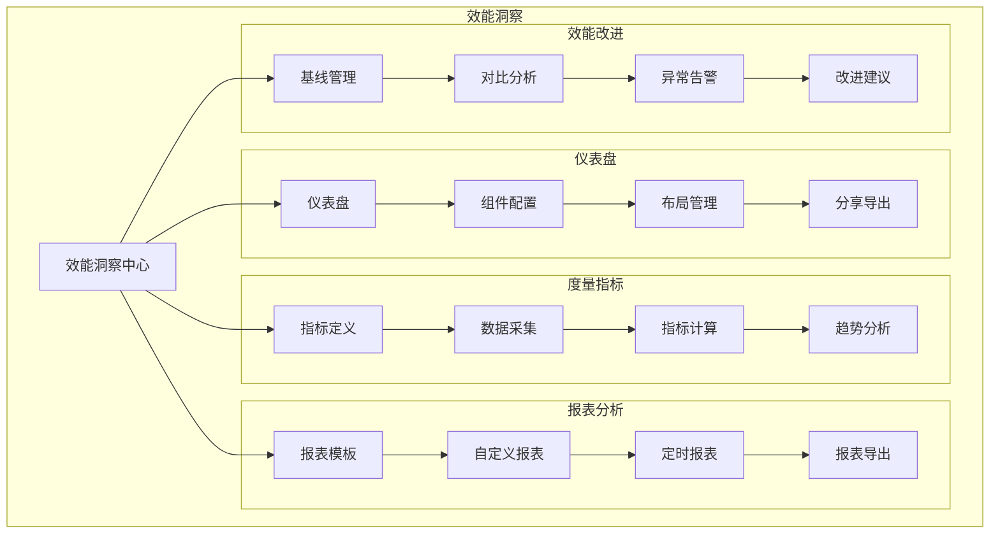
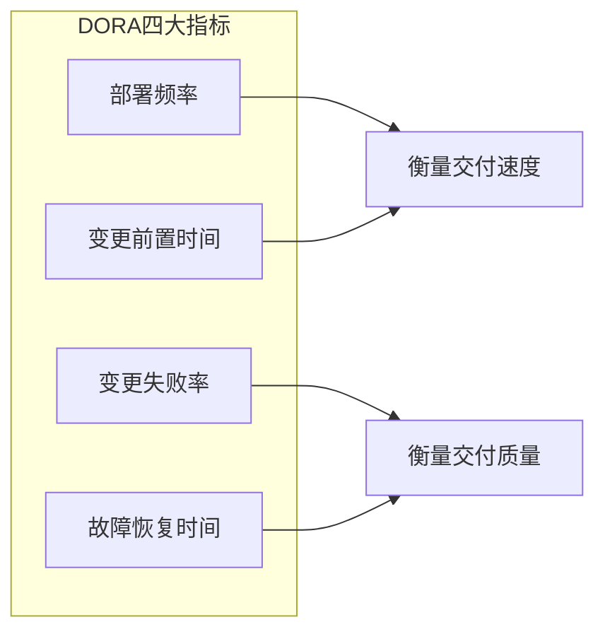
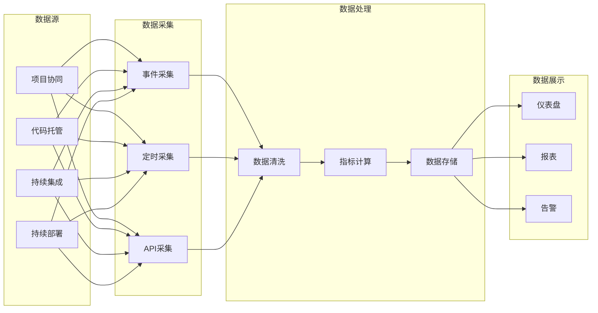

# 效能洞察 - 功能概述

## 1. 模块简介

效能洞察是摩塔 Mota 平台的数据分析功能模块，对AI使用效能、方案产出效率、知识库使用情况等数据进行可视化呈现，帮助企业持续分析和优化AI使用效果，提升整体业务效能。

## 2. 功能架构



## 3. 核心功能

### 3.1 仪表盘

| 功能 | 描述 |
|-----|------|
| 仪表盘创建 | 创建自定义仪表盘 |
| 组件配置 | 添加和配置图表组件 |
| 布局调整 | 拖拽调整组件布局 |
| 数据筛选 | 按时间、项目等维度筛选 |
| 分享导出 | 分享仪表盘或导出图片 |

### 3.2 度量指标

| 指标类别 | 指标示例 |
|---------|---------|
| 需求交付 | 需求吞吐量、需求交付周期、需求完成率 |
| 代码质量 | 代码提交量、代码评审率、代码缺陷密度 |
| 构建部署 | 构建成功率、构建时长、部署频率 |
| 测试质量 | 测试覆盖率、缺陷发现率、缺陷修复时长 |
| 团队效能 | 人均产出、工时利用率、协作效率 |

### 3.3 报表分析

| 功能 | 描述 |
|-----|------|
| 预设报表 | 系统预设的标准报表 |
| 自定义报表 | 自定义报表内容和格式 |
| 定时发送 | 定时生成并发送报表 |
| 多格式导出 | 支持 PDF、Excel 等格式 |

### 3.4 效能改进

| 功能 | 描述 |
|-----|------|
| 基线设定 | 设定效能基线标准 |
| 趋势分析 | 分析效能变化趋势 |
| 对比分析 | 跨项目/团队对比 |
| 异常告警 | 效能异常自动告警 |
| 改进建议 | 智能改进建议 |

## 4. 度量指标体系

### 4.1 DORA 指标



| 指标 | 描述 | 计算方式 |
|-----|------|---------|
| 部署频率 | 代码部署到生产环境的频率 | 部署次数 / 时间周期 |
| 变更前置时间 | 从代码提交到生产部署的时间 | 部署时间 - 提交时间 |
| 变更失败率 | 导致生产故障的变更比例 | 失败部署数 / 总部署数 |
| 故障恢复时间 | 从故障发生到恢复的时间 | 恢复时间 - 故障时间 |

### 4.2 需求交付指标

| 指标 | 描述 | 计算方式 |
|-----|------|---------|
| 需求吞吐量 | 单位时间完成的需求数量 | 完成需求数 / 时间周期 |
| 需求交付周期 | 需求从创建到完成的时间 | 完成时间 - 创建时间 |
| 需求完成率 | 计划需求的完成比例 | 完成需求数 / 计划需求数 |
| 需求变更率 | 需求变更的比例 | 变更需求数 / 总需求数 |

### 4.3 代码质量指标

| 指标 | 描述 | 计算方式 |
|-----|------|---------|
| 代码提交量 | 代码提交的数量 | 提交次数统计 |
| 代码评审率 | 经过评审的代码比例 | 评审代码量 / 总代码量 |
| 评审通过率 | 一次通过评审的比例 | 一次通过数 / 总评审数 |
| 代码缺陷密度 | 每千行代码的缺陷数 | 缺陷数 / 代码行数 × 1000 |

### 4.4 构建部署指标

| 指标 | 描述 | 计算方式 |
|-----|------|---------|
| 构建成功率 | 构建成功的比例 | 成功构建数 / 总构建数 |
| 平均构建时长 | 构建的平均耗时 | 总构建时长 / 构建次数 |
| 部署成功率 | 部署成功的比例 | 成功部署数 / 总部署数 |
| 回滚率 | 需要回滚的部署比例 | 回滚次数 / 部署次数 |

## 5. 界面设计

### 5.1 效能概览仪表盘

```
┌─────────────────────────────────────────────────────────────────┐
│  效能洞察                              时间范围: [最近30天 ▼]    │
├─────────────────────────────────────────────────────────────────┤
│                                                                 │
│  📊 核心指标                                                     │
│  ┌──────────┐ ┌──────────┐ ┌──────────┐ ┌──────────┐           │
│  │ 需求吞吐量│ │ 交付周期  │ │ 构建成功率│ │ 部署频率  │           │
│  │   156    │ │  5.2天   │ │  94.5%   │ │ 12次/周  │           │
│  │  ↑ 12%   │ │  ↓ 8%    │ │  ↑ 2%    │ │  ↑ 15%   │           │
│  └──────────┘ └──────────┘ └──────────┘ └──────────┘           │
│                                                                 │
│  📈 需求交付趋势                                                 │
│  ┌─────────────────────────────────────────────────────────┐   │
│  │     ▲                                                   │   │
│  │  60 │        ╱╲                                         │   │
│  │     │       ╱  ╲    ╱╲                                  │   │
│  │  40 │      ╱    ╲  ╱  ╲  ╱╲                             │   │
│  │     │     ╱      ╲╱    ╲╱  ╲                            │   │
│  │  20 │    ╱                   ╲                          │   │
│  │     │   ╱                     ╲                         │   │
│  │   0 └────────────────────────────────────────────▶      │   │
│  │       W1    W2    W3    W4    W5    W6                   │   │
│  │       ── 完成需求  ── 新增需求                           │   │
│  └─────────────────────────────────────────────────────────┘   │
│                                                                 │
│  ┌─────────────────────────┐ ┌─────────────────────────────┐   │
│  │ 🔧 构建统计              │ │ 🚀 部署统计                  │   │
│  │                         │ │                             │   │
│  │ 总构建: 234             │ │ 总部署: 48                   │   │
│  │ 成功: 221 (94.5%)       │ │ 成功: 46 (95.8%)            │   │
│  │ 失败: 13 (5.5%)         │ │ 失败: 2 (4.2%)              │   │
│  │                         │ │                             │   │
│  │ 平均构建时长: 3分25秒    │ │ 平均部署时长: 5分12秒        │   │
│  └─────────────────────────┘ └─────────────────────────────┘   │
│                                                                 │
└─────────────────────────────────────────────────────────────────┘
```

### 5.2 团队效能报表

```
┌─────────────────────────────────────────────────────────────────┐
│  团队效能报表                          [导出] [定时发送] [分享]  │
├─────────────────────────────────────────────────────────────────┤
│  报表周期: [2024年3月 ▼]    项目: [全部项目 ▼]                   │
├─────────────────────────────────────────────────────────────────┤
│                                                                 │
│  📊 团队产出统计                                                 │
│  ┌─────────────────────────────────────────────────────────┐   │
│  │ 成员    │ 完成需求 │ 代码提交 │ 评审次数 │ 缺陷修复 │ 工时  │   │
│  ├─────────────────────────────────────────────────────────┤   │
│  │ 张三    │   12    │   45    │   23    │   8     │ 168h │   │
│  │ 李四    │   10    │   38    │   18    │   6     │ 160h │   │
│  │ 王五    │   8     │   32    │   15    │   5     │ 152h │   │
│  │ 赵六    │   15    │   52    │   28    │   10    │ 176h │   │
│  │ 团队合计│   45    │   167   │   84    │   29    │ 656h │   │
│  └─────────────────────────────────────────────────────────┘   │
│                                                                 │
│  📈 效能趋势对比                                                 │
│  ┌─────────────────────────────────────────────────────────┐   │
│  │                                                         │   │
│  │  本月 vs 上月                                            │   │
│  │                                                         │   │
│  │  需求吞吐量  ████████████████████  +12%                  │   │
│  │  交付周期    ████████████████      -8%                   │   │
│  │  代码质量    ██████████████████    +5%                   │   │
│  │  构建成功率  ████████████████████  +2%                   │   │
│  │                                                         │   │
│  └─────────────────────────────────────────────────────────┘   │
│                                                                 │
│  🎯 改进建议                                                     │
│  ┌─────────────────────────────────────────────────────────┐   │
│  │ 1. 代码评审周期较长，建议增加评审人员或优化评审流程        │   │
│  │ 2. 周三构建失败率较高，建议检查该时段的代码提交质量        │   │
│  │ 3. 测试环境部署频率低于开发环境，可能存在环境瓶颈          │   │
│  └─────────────────────────────────────────────────────────┘   │
│                                                                 │
└─────────────────────────────────────────────────────────────────┘
```

### 5.3 项目效能对比

```
┌─────────────────────────────────────────────────────────────────┐
│  项目效能对比                                                    │
├─────────────────────────────────────────────────────────────────┤
│  对比项目: [摩塔核心平台 ▼] vs [用户中心服务 ▼]                  │
│  时间范围: [最近30天 ▼]                                          │
├─────────────────────────────────────────────────────────────────┤
│                                                                 │
│  📊 指标对比                                                     │
│  ┌─────────────────────────────────────────────────────────┐   │
│  │                    │ 摩塔核心平台 │ 用户中心服务 │ 差异   │   │
│  ├─────────────────────────────────────────────────────────┤   │
│  │ 需求吞吐量         │     45      │     23      │ +96%  │   │
│  │ 平均交付周期       │    5.2天    │    4.8天    │ +8%   │   │
│  │ 代码提交量         │    167      │     89      │ +88%  │   │
│  │ 代码评审率         │    92%      │     88%     │ +4%   │   │
│  │ 构建成功率         │   94.5%     │    96.2%    │ -2%   │   │
│  │ 部署频率           │   12次/周   │    8次/周   │ +50%  │   │
│  │ 缺陷密度           │   2.3/千行  │   1.8/千行  │ +28%  │   │
│  └─────────────────────────────────────────────────────────┘   │
│                                                                 │
│  📈 趋势对比图                                                   │
│  ┌─────────────────────────────────────────────────────────┐   │
│  │     ▲                                                   │   │
│  │  50 │    ╱╲                                             │   │
│  │     │   ╱  ╲  ╱╲                                        │   │
│  │  30 │  ╱    ╲╱  ╲                                       │   │
│  │     │ ╱          ╲    ────────────                      │   │
│  │  10 │╱            ╲──╱                                  │   │
│  │   0 └────────────────────────────────────────────▶      │   │
│  │       W1    W2    W3    W4                               │   │
│  │       ── 摩塔核心平台  ── 用户中心服务                    │   │
│  └─────────────────────────────────────────────────────────┘   │
│                                                                 │
└─────────────────────────────────────────────────────────────────┘
```

## 6. 数据模型

### 6.1 度量数据模型

```
Metric (度量指标)
├── id: 指标ID
├── name: 指标名称
├── code: 指标编码
├── category: 指标类别
├── description: 指标描述
├── formula: 计算公式
├── unit: 单位
├── direction: 方向 (higher_better/lower_better)
└── created_at: 创建时间

MetricData (度量数据)
├── id: 数据ID
├── metric_id: 指标ID
├── project_id: 项目ID
├── team_id: 团队ID
├── value: 指标值
├── period_type: 周期类型 (day/week/month)
├── period_start: 周期开始
├── period_end: 周期结束
├── created_at: 创建时间
└── updated_at: 更新时间

Dashboard (仪表盘)
├── id: 仪表盘ID
├── name: 仪表盘名称
├── description: 描述
├── owner_id: 所有者ID
├── layout: 布局配置
├── widgets: 组件配置
├── filters: 筛选条件
├── is_public: 是否公开
├── created_at: 创建时间
└── updated_at: 更新时间
```

## 7. 数据采集

### 7.1 数据来源

| 数据来源 | 采集内容 |
|---------|---------|
| 项目协同 | 需求、任务、缺陷数据 |
| 代码托管 | 提交、分支、合并请求数据 |
| 持续集成 | 构建记录、测试结果 |
| 持续部署 | 部署记录、发布数据 |

### 7.2 采集方式



## 8. 告警配置

### 8.1 告警规则

| 告警类型 | 触发条件 | 通知方式 |
|---------|---------|---------|
| 构建失败率告警 | 失败率 > 10% | 邮件、企业微信 |
| 部署失败告警 | 部署失败 | 即时通知 |
| 交付周期告警 | 周期 > 基线 × 1.5 | 邮件 |
| 缺陷积压告警 | 未关闭缺陷 > 阈值 | 邮件、企业微信 |

### 8.2 告警配置界面

```
┌─────────────────────────────────────────────────────────────────┐
│  告警配置                                      [+ 创建告警]      │
├─────────────────────────────────────────────────────────────────┤
│                                                                 │
│  ┌─────────────────────────────────────────────────────────┐   │
│  │ 🔔 构建失败率告警                              [启用] ⚙️  │   │
│  │ 当构建失败率超过 10% 时触发告警                          │   │
│  │ 通知方式: 邮件、企业微信                                 │   │
│  │ 通知人: 项目负责人、开发负责人                           │   │
│  ├─────────────────────────────────────────────────────────┤   │
│  │ 🔔 部署失败告警                                [启用] ⚙️  │   │
│  │ 当生产环境部署失败时立即触发告警                         │   │
│  │ 通知方式: 即时通知、电话                                 │   │
│  │ 通知人: 运维负责人、项目负责人                           │   │
│  ├─────────────────────────────────────────────────────────┤   │
│  │ 🔔 交付周期告警                                [禁用] ⚙️  │   │
│  │ 当需求交付周期超过基线 1.5 倍时触发告警                  │   │
│  │ 通知方式: 邮件                                           │   │
│  │ 通知人: 项目经理                                         │   │
│  └─────────────────────────────────────────────────────────┘   │
│                                                                 │
└─────────────────────────────────────────────────────────────────┘
```

---

*摩塔 Mota - 让每家企业都拥有懂自己业务的AI助手*