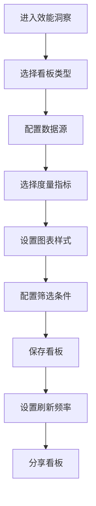
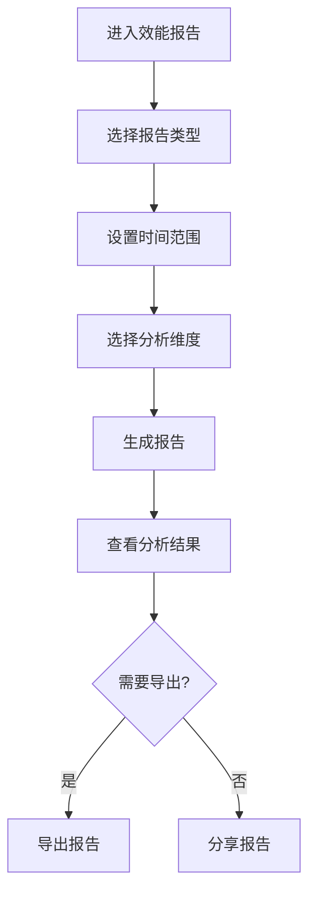
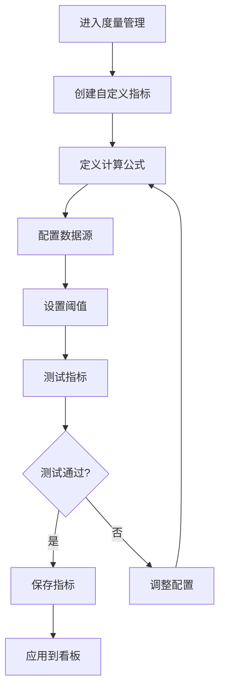
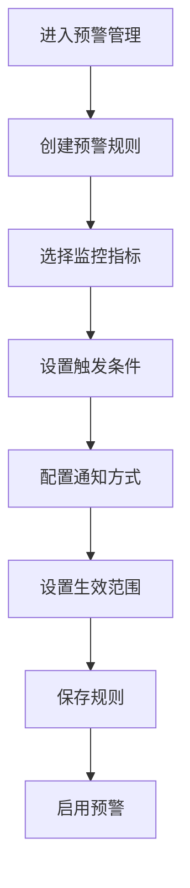

# 效能洞察 - 用户流程文档

## 概述

本文档详细描述效能洞察模块的所有用户操作流程，包括数据看板配置、度量指标分析、报表生成、效能改进等核心流程。

---

## 1. 配置效能看板流程

### 1.1 流程图



### 1.2 详细步骤

#### 步骤1：创建效能看板

**操作路径**: 效能洞察 → 看板管理 → 创建看板

**界面说明**:
```
┌─────────────────────────────────────────────────────────────────┐
│  创建效能看板                                                    │
├─────────────────────────────────────────────────────────────────┤
│                                                                 │
│  看板名称 *                                                      │
│  ┌─────────────────────────────────────────────────────────┐   │
│  │ 研发效能总览                                            │   │
│  └─────────────────────────────────────────────────────────┘   │
│                                                                 │
│  看板描述                                                        │
│  ┌─────────────────────────────────────────────────────────┐   │
│  │ 展示团队整体研发效能指标，包括交付效率、质量、协作等     │   │
│  └─────────────────────────────────────────────────────────┘   │
│                                                                 │
│  看板模板                                                        │
│  ┌─────────────────────────────────────────────────────────┐   │
│  │ ┌─────────────┐  ┌─────────────┐  ┌─────────────┐      │   │
│  │ │ 📊          │  │ 📊          │  │ 📊          │      │   │
│  │ │ 空白看板    │  │ 研发效能    │  │ 项目进度    │      │   │
│  │ │             │  │ 总览        │  │ 看板        │      │   │
│  │ │ ○           │  │ ●           │  │ ○           │      │   │
│  │ └─────────────┘  └─────────────┘  └─────────────┘      │   │
│  │                                                         │   │
│  │ ┌─────────────┐  ┌─────────────┐  ┌─────────────┐      │   │
│  │ │ 📊          │  │ 📊          │  │ 📊          │      │   │
│  │ │ 代码质量    │  │ 测试覆盖    │  │ 部署频率    │      │   │
│  │ │ 看板        │  │ 看板        │  │ 看板        │      │   │
│  │ │ ○           │  │ ○           │  │ ○           │      │   │
│  │ └─────────────┘  └─────────────┘  └─────────────┘      │   │
│  └─────────────────────────────────────────────────────────┘   │
│                                                                 │
│  数据范围                                                        │
│  ┌─────────────────────────────────────────────────────────┐   │
│  │ ● 全部项目                                              │   │
│  │ ○ 指定项目: [选择项目...]                               │   │
│  └─────────────────────────────────────────────────────────┘   │
│                                                                 │
│                                             [取消]  [创建]       │
│                                                                 │
└─────────────────────────────────────────────────────────────────┘
```

#### 步骤2：配置看板组件

**界面说明**:
```
┌─────────────────────────────────────────────────────────────────┐
│  研发效能总览 - 编辑模式                    [预览] [保存] [发布] │
├─────────────────────────────────────────────────────────────────┤
│                                                                 │
│  组件库                    │  看板画布                          │
│  ─────────────────────────│──────────────────────────────────── │
│                            │                                    │
│  📊 图表组件               │  ┌──────────┐ ┌──────────┐        │
│  ┌─────────────────────┐  │  │ 需求交付 │ │ 代码提交 │        │
│  │ 📈 折线图           │  │  │ 周期     │ │ 频率     │        │
│  │ 📊 柱状图           │  │  │ 5.2天    │ │ 128次/周 │        │
│  │ 🥧 饼图             │  │  └──────────┘ └──────────┘        │
│  │ 📉 面积图           │  │                                    │
│  │ 🎯 仪表盘           │  │  ┌──────────┐ ┌──────────┐        │
│  │ 📋 表格             │  │  │ 缺陷密度 │ │ 测试覆盖 │        │
│  │ 🔢 数字卡片         │  │  │ 0.5/千行 │ │ 85%      │        │
│  └─────────────────────┘  │  └──────────┘ └──────────┘        │
│                            │                                    │
│  📏 度量指标               │  ┌────────────────────────────┐   │
│  ┌─────────────────────┐  │  │                            │   │
│  │ 需求交付周期        │  │  │     需求交付趋势图         │   │
│  │ 代码提交频率        │  │  │     📈                     │   │
│  │ 构建成功率          │  │  │                            │   │
│  │ 部署频率            │  │  │  ─────────────────────     │   │
│  │ 缺陷密度            │  │  │  周一 周二 周三 周四 周五  │   │
│  │ 测试覆盖率          │  │  │                            │   │
│  │ 代码评审率          │  │  └────────────────────────────┘   │
│  │ 平均修复时间        │  │                                    │
│  └─────────────────────┘  │  ┌────────────────────────────┐   │
│                            │  │                            │   │
│  拖拽组件到画布            │  │     缺陷趋势分析           │   │
│                            │  │     📊                     │   │
│                            │  │                            │   │
│                            │  └────────────────────────────┘   │
│                            │                                    │
└─────────────────────────────────────────────────────────────────┘
```

#### 步骤3：配置图表详情

**界面说明**:
```
┌─────────────────────────────────────────────────────────────────┐
│  配置图表 - 需求交付趋势                                   [×]  │
├─────────────────────────────────────────────────────────────────┤
│                                                                 │
│  [数据]  [样式]  [交互]                                          │
│                                                                 │
│  ─────────────────────────────────────────────────────────────  │
│                                                                 │
│  数据源                                                          │
│  ┌─────────────────────────────────────────────────────────┐   │
│  │ 项目协同数据                                        ▼   │   │
│  └─────────────────────────────────────────────────────────┘   │
│                                                                 │
│  度量指标                                                        │
│  ┌─────────────────────────────────────────────────────────┐   │
│  │ Y轴: 需求交付周期 (天)                              ▼   │   │
│  │ X轴: 时间 (按周)                                    ▼   │   │
│  └─────────────────────────────────────────────────────────┘   │
│                                                                 │
│  数据筛选                                                        │
│  ┌─────────────────────────────────────────────────────────┐   │
│  │ 项目: [全部项目 ▼]                                      │   │
│  │ 时间范围: [最近30天 ▼]                                  │   │
│  │ 需求类型: [全部 ▼]                                      │   │
│  └─────────────────────────────────────────────────────────┘   │
│                                                                 │
│  聚合方式                                                        │
│  ┌─────────────────────────────────────────────────────────┐   │
│  │ ● 平均值  ○ 中位数  ○ P90  ○ 总和                      │   │
│  └─────────────────────────────────────────────────────────┘   │
│                                                                 │
│  数据预览                                                        │
│  ┌─────────────────────────────────────────────────────────┐   │
│  │ 周次      │ 交付周期(天) │ 需求数量                     │   │
│  ├─────────────────────────────────────────────────────────┤   │
│  │ 第10周    │ 5.2          │ 15                           │   │
│  │ 第11周    │ 4.8          │ 18                           │   │
│  │ 第12周    │ 5.5          │ 12                           │   │
│  └─────────────────────────────────────────────────────────┘   │
│                                                                 │
│                                             [取消]  [确定]       │
│                                                                 │
└─────────────────────────────────────────────────────────────────┘
```

---

## 2. 查看效能报告流程

### 2.1 流程图



### 2.2 详细步骤

#### 步骤1：查看效能报告

**操作路径**: 效能洞察 → 效能报告

**界面说明**:
```
┌─────────────────────────────────────────────────────────────────┐
│  效能报告 - 2024年3月                          [导出] [分享]     │
├─────────────────────────────────────────────────────────────────┤
│                                                                 │
│  报告周期: [2024年3月 ▼]  对比周期: [2024年2月 ▼]               │
│                                                                 │
│  ─────────────────────────────────────────────────────────────  │
│                                                                 │
│  📊 效能概览                                                     │
│  ┌─────────────────────────────────────────────────────────┐   │
│  │ ┌──────────┐ ┌──────────┐ ┌──────────┐ ┌──────────┐    │   │
│  │ │ 需求吞吐 │ │ 交付周期 │ │ 缺陷密度 │ │ 部署频率 │    │   │
│  │ │   45个   │ │  5.2天   │ │ 0.5/千行 │ │  12次    │    │   │
│  │ │  ↑ 12%   │ │  ↓ 8%   │ │  ↓ 15%   │ │  ↑ 20%   │    │   │
│  │ └──────────┘ └──────────┘ └──────────┘ └──────────┘    │   │
│  └─────────────────────────────────────────────────────────┘   │
│                                                                 │
│  📈 趋势分析                                                     │
│  ┌─────────────────────────────────────────────────────────┐   │
│  │                                                         │   │
│  │  需求交付趋势                                           │   │
│  │  60 ┤                                                   │   │
│  │  50 ┤        ╭─╮                                        │   │
│  │  40 ┤    ╭───╯ ╰───╮    ╭───╮                          │   │
│  │  30 ┤╭───╯         ╰────╯   ╰───╮                      │   │
│  │  20 ┤                           ╰───                    │   │
│  │  10 ┤                                                   │   │
│  │   0 └────────────────────────────────────────────────   │   │
│  │      W1   W2   W3   W4   W5   W6   W7   W8              │   │
│  │                                                         │   │
│  │  ── 本月  ── 上月                                       │   │
│  └─────────────────────────────────────────────────────────┘   │
│                                                                 │
│  📋 详细数据                                                     │
│  ┌─────────────────────────────────────────────────────────┐   │
│  │ 指标          │ 本月   │ 上月   │ 环比    │ 目标    │   │
│  ├─────────────────────────────────────────────────────────┤   │
│  │ 需求吞吐量    │ 45     │ 40     │ +12.5%  │ 50     │   │
│  │ 平均交付周期  │ 5.2天  │ 5.6天  │ -7.1%   │ 5天    │   │
│  │ 缺陷密度      │ 0.5    │ 0.6    │ -16.7%  │ 0.5    │   │
│  │ 部署频率      │ 12次   │ 10次   │ +20%    │ 15次   │   │
│  │ 构建成功率    │ 95%    │ 92%    │ +3.3%   │ 95%    │   │
│  │ 代码评审率    │ 88%    │ 85%    │ +3.5%   │ 90%    │   │
│  └─────────────────────────────────────────────────────────┘   │
│                                                                 │
└─────────────────────────────────────────────────────────────────┘
```

#### 步骤2：查看团队效能对比

**界面说明**:
```
┌─────────────────────────────────────────────────────────────────┐
│  团队效能对比                                                    │
├─────────────────────────────────────────────────────────────────┤
│                                                                 │
│  对比维度: [团队 ▼]  时间范围: [最近3个月 ▼]                    │
│                                                                 │
│  ─────────────────────────────────────────────────────────────  │
│                                                                 │
│  团队效能雷达图                                                  │
│  ┌─────────────────────────────────────────────────────────┐   │
│  │                                                         │   │
│  │                    交付效率                             │   │
│  │                       ▲                                 │   │
│  │                      /│\                                │   │
│  │                     / │ \                               │   │
│  │                    /  │  \                              │   │
│  │        代码质量 ◄─────┼─────► 协作效率                  │   │
│  │                    \  │  /                              │   │
│  │                     \ │ /                               │   │
│  │                      \│/                                │   │
│  │                       ▼                                 │   │
│  │                    响应速度                             │   │
│  │                                                         │   │
│  │  ── 前端团队  ── 后端团队  ── 测试团队                  │   │
│  └─────────────────────────────────────────────────────────┘   │
│                                                                 │
│  团队排名                                                        │
│  ┌─────────────────────────────────────────────────────────┐   │
│  │ 排名 │ 团队     │ 综合得分 │ 交付效率 │ 代码质量 │ 协作 │   │
│  ├─────────────────────────────────────────────────────────┤   │
│  │ 🥇 1 │ 后端团队 │ 92       │ 95       │ 90       │ 91   │   │
│  │ 🥈 2 │ 前端团队 │ 88       │ 85       │ 92       │ 87   │   │
│  │ 🥉 3 │ 测试团队 │ 85       │ 82       │ 88       │ 85   │   │
│  │   4  │ 运维团队 │ 82       │ 80       │ 85       │ 81   │   │
│  └─────────────────────────────────────────────────────────┘   │
│                                                                 │
└─────────────────────────────────────────────────────────────────┘
```

---

## 3. DORA指标分析流程

### 3.1 DORA指标看板

**界面说明**:
```
┌─────────────────────────────────────────────────────────────────┐
│  DORA指标分析                                    [设置] [导出]   │
├─────────────────────────────────────────────────────────────────┤
│                                                                 │
│  时间范围: [最近90天 ▼]  项目: [全部项目 ▼]                     │
│                                                                 │
│  ─────────────────────────────────────────────────────────────  │
│                                                                 │
│  四大关键指标                                                    │
│  ┌─────────────────────────────────────────────────────────┐   │
│  │                                                         │   │
│  │  ┌─────────────────────┐  ┌─────────────────────┐      │   │
│  │  │ 📦 部署频率         │  │ ⏱️ 变更前置时间     │      │   │
│  │  │                     │  │                     │      │   │
│  │  │    12次/周          │  │    2.5天            │      │   │
│  │  │                     │  │                     │      │   │
│  │  │ 🟢 精英级           │  │ 🟢 精英级           │      │   │
│  │  │ (每天多次部署)      │  │ (小于1周)           │      │   │
│  │  └─────────────────────┘  └─────────────────────┘      │   │
│  │                                                         │   │
│  │  ┌─────────────────────┐  ┌─────────────────────┐      │   │
│  │  │ 🔄 变更失败率       │  │ 🔧 服务恢复时间     │      │   │
│  │  │                     │  │                     │      │   │
│  │  │    5%               │  │    30分钟           │      │   │
│  │  │                     │  │                     │      │   │
│  │  │ 🟢 精英级           │  │ 🟢 精英级           │      │   │
│  │  │ (0-15%)             │  │ (小于1小时)         │      │   │
│  │  └─────────────────────┘  └─────────────────────┘      │   │
│  │                                                         │   │
│  └─────────────────────────────────────────────────────────┘   │
│                                                                 │
│  DORA成熟度评估                                                  │
│  ┌─────────────────────────────────────────────────────────┐   │
│  │                                                         │   │
│  │  综合评级: 🟢 精英级 (Elite)                            │   │
│  │                                                         │   │
│  │  ┌─────────────────────────────────────────────────┐   │   │
│  │  │ 低效 │ 中等 │ 高效 │ 精英                      │   │   │
│  │  │      │      │      │  ●                        │   │   │
│  │  └─────────────────────────────────────────────────┘   │   │
│  │                                                         │   │
│  │  行业对比: 超过 95% 的团队                              │   │
│  │                                                         │   │
│  └─────────────────────────────────────────────────────────┘   │
│                                                                 │
│  趋势分析                                                        │
│  ┌─────────────────────────────────────────────────────────┐   │
│  │                                                         │   │
│  │  部署频率趋势                                           │   │
│  │  15 ┤                    ╭───╮                          │   │
│  │  12 ┤              ╭─────╯   ╰───╮                      │   │
│  │   9 ┤        ╭─────╯             ╰───                   │   │
│  │   6 ┤  ╭─────╯                                          │   │
│  │   3 ┤──╯                                                │   │
│  │   0 └────────────────────────────────────────────────   │   │
│  │      1月    2月    3月    4月    5月    6月             │   │
│  │                                                         │   │
│  └─────────────────────────────────────────────────────────┘   │
│                                                                 │
└─────────────────────────────────────────────────────────────────┘
```

---

## 4. 自定义度量指标流程

### 4.1 流程图



### 4.2 详细步骤

#### 步骤1：创建自定义指标

**操作路径**: 效能洞察 → 度量管理 → 创建指标

**界面说明**:
```
┌─────────────────────────────────────────────────────────────────┐
│  创建自定义度量指标                                              │
├─────────────────────────────────────────────────────────────────┤
│                                                                 │
│  指标名称 *                                                      │
│  ┌─────────────────────────────────────────────────────────┐   │
│  │ 需求按时交付率                                          │   │
│  └─────────────────────────────────────────────────────────┘   │
│                                                                 │
│  指标描述                                                        │
│  ┌─────────────────────────────────────────────────────────┐   │
│  │ 在计划时间内完成的需求占总需求的比例                     │   │
│  └─────────────────────────────────────────────────────────┘   │
│                                                                 │
│  指标分类                                                        │
│  ┌─────────────────────────────────────────────────────────┐   │
│  │ [交付效率 ▼]                                            │   │
│  └─────────────────────────────────────────────────────────┘   │
│                                                                 │
│  计算公式                                                        │
│  ┌─────────────────────────────────────────────────────────┐   │
│  │ 公式类型: ● 比率  ○ 计数  ○ 平均值  ○ 自定义           │   │
│  │                                                         │   │
│  │ 分子: [按时完成的需求数 ▼]                              │   │
│  │ 分母: [总需求数 ▼]                                      │   │
│  │                                                         │   │
│  │ 计算公式预览:                                           │   │
│  │ ┌─────────────────────────────────────────────────┐    │   │
│  │ │ (按时完成的需求数 / 总需求数) × 100%            │    │   │
│  │ └─────────────────────────────────────────────────┘    │   │
│  └─────────────────────────────────────────────────────────┘   │
│                                                                 │
│  数据筛选条件                                                    │
│  ┌─────────────────────────────────────────────────────────┐   │
│  │ 需求状态: [已完成 ▼]                                    │   │
│  │ 需求类型: [全部 ▼]                                      │   │
│  │ 时间范围: [按迭代 ▼]                                    │   │
│  └─────────────────────────────────────────────────────────┘   │
│                                                                 │
│  阈值设置                                                        │
│  ┌─────────────────────────────────────────────────────────┐   │
│  │ 🟢 优秀: >= 90%                                         │   │
│  │ 🟡 良好: 70% - 90%                                      │   │
│  │ 🔴 需改进: < 70%                                        │   │
│  └─────────────────────────────────────────────────────────┘   │
│                                                                 │
│                              [测试指标]  [取消]  [保存]          │
│                                                                 │
└─────────────────────────────────────────────────────────────────┘
```

#### 步骤2：测试指标计算

**界面说明**:
```
┌─────────────────────────────────────────────────────────────────┐
│  测试指标 - 需求按时交付率                                 [×]  │
├─────────────────────────────────────────────────────────────────┤
│                                                                 │
│  测试参数                                                        │
│  ┌─────────────────────────────────────────────────────────┐   │
│  │ 项目: [摩塔核心项目 ▼]                                  │   │
│  │ 时间范围: [Sprint 12 ▼]                                 │   │
│  └─────────────────────────────────────────────────────────┘   │
│                                                                 │
│  [执行测试]                                                      │
│                                                                 │
│  ─────────────────────────────────────────────────────────────  │
│                                                                 │
│  测试结果                                                        │
│  ┌─────────────────────────────────────────────────────────┐   │
│  │ ✅ 计算成功                                             │   │
│  │                                                         │   │
│  │ 计算过程:                                               │   │
│  │ ┌─────────────────────────────────────────────────┐    │   │
│  │ │ 总需求数: 25                                    │    │   │
│  │ │ 按时完成数: 22                                  │    │   │
│  │ │ 计算结果: 22 / 25 × 100% = 88%                 │    │   │
│  │ └─────────────────────────────────────────────────┘    │   │
│  │                                                         │   │
│  │ 指标值: 88%                                             │   │
│  │ 评级: 🟡 良好                                           │   │
│  │                                                         │   │
│  │ 数据明细:                                               │   │
│  │ ┌─────────────────────────────────────────────────┐    │   │
│  │ │ 需求ID  │ 计划完成 │ 实际完成 │ 是否按时        │    │   │
│  │ ├─────────────────────────────────────────────────┤    │   │
│  │ │ REQ-101 │ 03-15   │ 03-14   │ ✅              │    │   │
│  │ │ REQ-102 │ 03-16   │ 03-18   │ ❌              │    │   │
│  │ │ REQ-103 │ 03-17   │ 03-17   │ ✅              │    │   │
│  │ │ ...     │ ...     │ ...     │ ...             │    │   │
│  │ └─────────────────────────────────────────────────┘    │   │
│  └─────────────────────────────────────────────────────────┘   │
│                                                                 │
│                                                    [关闭]        │
│                                                                 │
└─────────────────────────────────────────────────────────────────┘
```

---

## 5. 效能预警配置流程

### 5.1 流程图



### 5.2 详细步骤

#### 步骤1：创建预警规则

**操作路径**: 效能洞察 → 预警管理 → 创建规则

**界面说明**:
```
┌─────────────────────────────────────────────────────────────────┐
│  创建效能预警规则                                                │
├─────────────────────────────────────────────────────────────────┤
│                                                                 │
│  规则名称 *                                                      │
│  ┌─────────────────────────────────────────────────────────┐   │
│  │ 构建成功率下降预警                                      │   │
│  └─────────────────────────────────────────────────────────┘   │
│                                                                 │
│  监控指标                                                        │
│  ┌─────────────────────────────────────────────────────────┐   │
│  │ [构建成功率 ▼]                                          │   │
│  └─────────────────────────────────────────────────────────┘   │
│                                                                 │
│  触发条件                                                        │
│  ┌─────────────────────────────────────────────────────────┐   │
│  │ 条件类型: ● 阈值触发  ○ 趋势触发  ○ 异常检测           │   │
│  │                                                         │   │
│  │ 当 [构建成功率] [小于 ▼] [90] [% ▼]                    │   │
│  │ 持续 [3] [次 ▼] 时触发预警                              │   │
│  └─────────────────────────────────────────────────────────┘   │
│                                                                 │
│  预警级别                                                        │
│  ┌─────────────────────────────────────────────────────────┐   │
│  │ ○ 🔴 严重 - 需要立即处理                                │   │
│  │ ● 🟡 警告 - 需要关注                                    │   │
│  │ ○ 🔵 提示 - 仅作提醒                                    │   │
│  └─────────────────────────────────────────────────────────┘   │
│                                                                 │
│  通知方式                                                        │
│  ┌─────────────────────────────────────────────────────────┐   │
│  │ ☑ 站内消息                                              │   │
│  │ ☑ 邮件通知                                              │   │
│  │ ☑ 企业微信/钉钉                                         │   │
│  │ ☐ 短信通知                                              │   │
│  └─────────────────────────────────────────────────────────┘   │
│                                                                 │
│  通知对象                                                        │
│  ┌─────────────────────────────────────────────────────────┐   │
│  │ ☑ 项目负责人                                            │   │
│  │ ☑ 团队负责人                                            │   │
│  │ ☐ 指定成员: [选择成员...]                               │   │
│  └─────────────────────────────────────────────────────────┘   │
│                                                                 │
│  生效范围                                                        │
│  ┌─────────────────────────────────────────────────────────┐   │
│  │ ● 全部项目                                              │   │
│  │ ○ 指定项目: [选择项目...]                               │   │
│  └─────────────────────────────────────────────────────────┘   │
│                                                                 │
│                                             [取消]  [保存]       │
│                                                                 │
└─────────────────────────────────────────────────────────────────┘
```

#### 步骤2：查看预警记录

**界面说明**:
```
┌─────────────────────────────────────────────────────────────────┐
│  预警记录                                        [导出] [设置]   │
├─────────────────────────────────────────────────────────────────┤
│                                                                 │
│  筛选: [全部级别▼] [全部状态▼] [最近7天▼]        🔍 搜索...     │
│                                                                 │
│  ─────────────────────────────────────────────────────────────  │
│                                                                 │
│  预警列表                                                        │
│  ┌─────────────────────────────────────────────────────────┐   │
│  │ 🟡 构建成功率下降预警                          2小时前   │   │
│  │    项目: 摩塔核心项目                                   │   │
│  │    当前值: 85%  │  阈值: 90%                            │   │
│  │    状态: 🔴 未处理                                      │   │
│  │                                    [查看详情] [标记处理] │   │
│  ├─────────────────────────────────────────────────────────┤   │
│  │ 🔴 部署失败率上升预警                          5小时前   │   │
│  │    项目: 摩塔前端项目                                   │   │
│  │    当前值: 25%  │  阈值: 15%                            │   │
│  │    状态: 🟢 已处理                                      │   │
│  │    处理人: 张三  │  处理时间: 3小时前                   │   │
│  │                                    [查看详情]           │   │
│  ├─────────────────────────────────────────────────────────┤   │
│  │ 🔵 代码评审率下降提示                          1天前    │   │
│  │    项目: 摩塔后端项目                                   │   │
│  │    当前值: 78%  │  阈值: 80%                            │   │
│  │    状态: 🟡 处理中                                      │   │
│  │    处理人: 李四                                         │   │
│  │                                    [查看详情]           │   │
│  └─────────────────────────────────────────────────────────┘   │
│                                                                 │
│  预警统计                                                        │
│  ┌─────────────────────────────────────────────────────────┐   │
│  │ 本周预警: 8次  │  已处理: 6次  │  处理率: 75%           │   │
│  │                                                         │   │
│  │ 按级别: 🔴 严重 2  │  🟡 警告 4  │  🔵 提示 2           │   │
│  └─────────────────────────────────────────────────────────┘   │
│                                                                 │
└─────────────────────────────────────────────────────────────────┘
```

---

## 6. 生成效能报告流程

### 6.1 报告生成

**界面说明**:
```
┌─────────────────────────────────────────────────────────────────┐
│  生成效能报告                                                    │
├─────────────────────────────────────────────────────────────────┤
│                                                                 │
│  报告类型                                                        │
│  ┌─────────────────────────────────────────────────────────┐   │
│  │ ● 周报  ○ 月报  ○ 季报  ○ 自定义周期                   │   │
│  └─────────────────────────────────────────────────────────┘   │
│                                                                 │
│  报告周期                                                        │
│  ┌─────────────────────────────────────────────────────────┐   │
│  │ 2024年第12周 (03-18 ~ 03-24)                        ▼   │   │
│  └─────────────────────────────────────────────────────────┘   │
│                                                                 │
│  报告范围                                                        │
│  ┌─────────────────────────────────────────────────────────┐   │
│  │ ☑ 摩塔核心项目                                          │   │
│  │ ☑ 摩塔前端项目                                          │   │
│  │ ☑ 摩塔后端项目                                          │   │
│  │ ☐ 摩塔测试项目                                          │   │
│  └─────────────────────────────────────────────────────────┘   │
│                                                                 │
│  报告内容                                                        │
│  ┌─────────────────────────────────────────────────────────┐   │
│  │ ☑ 效能概览                                              │   │
│  │ ☑ DORA指标分析                                          │   │
│  │ ☑ 需求交付分析                                          │   │
│  │ ☑ 代码质量分析                                          │   │
│  │ ☑ 测试覆盖分析                                          │   │
│  │ ☑ 团队效能对比                                          │   │
│  │ ☑ 改进建议                                              │   │
│  └─────────────────────────────────────────────────────────┘   │
│                                                                 │
│  报告格式                                                        │
│  ┌─────────────────────────────────────────────────────────┐   │
│  │ ● PDF  ○ Word  ○ HTML  ○ Markdown                      │   │
│  └─────────────────────────────────────────────────────────┘   │
│                                                                 │
│  定时生成                                                        │
│  ┌─────────────────────────────────────────────────────────┐   │
│  │ ☑ 启用定时生成                                          │   │
│  │   生成时间: 每周一 09:00                                │   │
│  │   自动发送: ☑ 邮件  ☑ 企业微信                         │   │
│  └─────────────────────────────────────────────────────────┘   │
│                                                                 │
│                              [预览报告]  [取消]  [生成报告]      │
│                                                                 │
└─────────────────────────────────────────────────────────────────┘
```

---

## 7. 常见问题

### Q1: 如何理解DORA指标的评级标准？
**A**: DORA指标分为四个级别：
- 精英级：部署频率每天多次，变更前置时间小于1天
- 高效级：部署频率每天到每周，变更前置时间1天到1周
- 中等级：部署频率每周到每月，变更前置时间1周到1月
- 低效级：部署频率每月到每半年，变更前置时间1月到6月

### Q2: 如何设置效能目标？
**A**: 效能洞察 → 目标管理 → 设置目标，可以为各项指标设置团队目标值。

### Q3: 如何对比不同时期的效能数据？
**A**: 在效能报告中选择对比周期，系统会自动计算环比变化。

### Q4: 如何导出效能数据进行自定义分析？
**A**: 在看板或报告页面点击"导出"，支持导出CSV、Excel格式的原始数据。

### Q5: 如何配置效能数据的采集频率？
**A**: 效能洞察 → 设置 → 数据采集，可以配置各类数据的采集频率和保留周期。

---

*摩塔 Mota - 为研发团队打造的数字化软件工厂*