# 摩塔 Mota - 技术架构方案

## 1. 架构概述

### 1.1 设计目标

摩塔 Mota 是一款**AI驱动的项目管理与团队协作平台**，技术架构遵循以下设计目标：

| 目标 | 描述 |
|-----|------|
| **高可用性** | 系统可用性达到 99.9%，支持故障自动恢复 |
| **高性能** | 支持万级并发用户，接口响应时间 < 200ms |
| **可扩展性** | 支持水平扩展，业务模块独立部署 |
| **安全性** | 多层安全防护，数据加密存储和传输 |
| **可维护性** | 模块化设计，支持独立开发、测试、部署 |
| **AI原生** | 深度集成AI能力，支持多模型路由和智能服务 |

### 1.2 技术选型总览

| 层级 | 技术选型 |
|-----|---------|
| 前端框架 | React 18 + TypeScript |
| 微前端 | qiankun 2.x |
| 状态管理 | Redux Toolkit / Zustand |
| UI 组件库 | Ant Design 5.x |
| 后端框架 | Java 21 + Spring Boot 3.2 / Python + FastAPI |
| 微服务 | Spring Cloud 2023.x |
| 服务网关 | Spring Cloud Gateway |
| 服务注册 | Nacos 2.x |
| 配置中心 | Nacos Config |
| 关系数据库 | PostgreSQL 16 / MySQL 8.0 |
| 文档数据库 | MongoDB 7.x |
| 向量数据库 | Milvus 2.x |
| 缓存 | Redis 7.x (Cluster) |
| 消息队列 | Apache Kafka 3.x |
| 搜索引擎 | Elasticsearch 8.x |
| 对象存储 | MinIO / 阿里云 OSS |
| AI框架 | LangChain / LlamaIndex |
| 大语言模型 | OpenAI GPT-4 / Claude / 通义千问 / 文心一言 |
| 容器编排 | Kubernetes 1.28+ |
| CI/CD | GitLab CI / Jenkins |
| 监控 | Prometheus + Grafana |
| 日志 | ELK Stack (Elasticsearch + Logstash + Kibana) |
| 链路追踪 | SkyWalking / Jaeger |

### 1.3 整体架构图

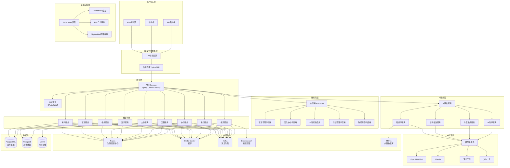

---

## 2. 前端架构设计

### 2.1 微前端架构

采用 **qiankun** 微前端框架，将系统拆分为一个主应用和多个子应用，实现独立开发、独立部署。

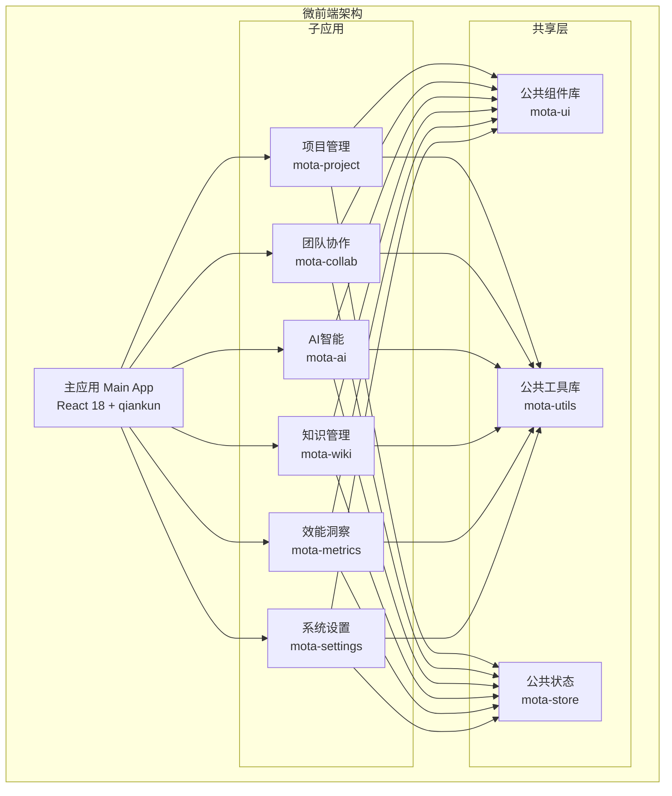

### 2.2 前端项目结构

```
mota-frontend/
├── packages/
│   ├── main-app/                 # 主应用（基座）
│   │   ├── src/
│   │   │   ├── layouts/          # 布局组件
│   │   │   ├── components/       # 公共组件
│   │   │   ├── micro/            # 微前端配置
│   │   │   ├── router/           # 路由配置
│   │   │   ├── store/            # 全局状态
│   │   │   ├── services/         # API服务
│   │   │   ├── utils/            # 工具函数
│   │   │   └── App.tsx
│   │   ├── package.json
│   │   └── vite.config.ts
│   │
│   ├── project-app/              # 项目管理子应用
│   │   ├── src/
│   │   │   ├── pages/
│   │   │   │   ├── Projects/     # 项目列表
│   │   │   │   ├── Tasks/        # 任务管理
│   │   │   │   ├── Kanban/       # 看板视图
│   │   │   │   ├── Backlog/      # 需求池
│   │   │   │   ├── Sprints/      # 迭代管理
│   │   │   │   └── Gantt/        # 甘特图
│   │   │   ├── components/
│   │   │   ├── hooks/
│   │   │   └── services/
│   │   └── package.json
│   │
│   ├── collab-app/               # 团队协作子应用
│   │   ├── src/
│   │   │   ├── pages/
│   │   │   │   ├── Documents/    # 文档协作
│   │   │   │   ├── Calendar/     # 日程管理
│   │   │   │   ├── Notifications/# 通知中心
│   │   │   │   └── Members/      # 成员管理
│   │   │   └── ...
│   │   └── package.json
│   │
│   ├── ai-app/                   # AI智能子应用
│   │   ├── src/
│   │   │   ├── pages/
│   │   │   │   ├── KnowledgeBase/# AI知识库
│   │   │   │   ├── News/         # 智能新闻
│   │   │   │   ├── Solution/     # AI方案生成
│   │   │   │   ├── Assistant/    # AI助手
│   │   │   │   └── History/      # 生成历史
│   │   │   └── ...
│   │   └── package.json
│   │
│   ├── wiki-app/                 # 知识管理子应用
│   │   ├── src/
│   │   │   ├── pages/
│   │   │   │   ├── Spaces/       # 知识空间
│   │   │   │   ├── Pages/        # 文档页面
│   │   │   │   ├── Editor/       # 文档编辑器
│   │   │   │   └── Files/        # 文件管理
│   │   │   └── ...
│   │   └── package.json
│   │
│   ├── metrics-app/              # 效能洞察子应用
│   │   ├── src/
│   │   │   ├── pages/
│   │   │   │   ├── Dashboard/    # 效能仪表盘
│   │   │   │   ├── Reports/      # 效能报表
│   │   │   │   └── Alerts/       # 告警配置
│   │   │   └── ...
│   │   └── package.json
│   │
│   ├── mota-ui/                  # 公共组件库
│   │   ├── src/
│   │   │   ├── components/       # UI组件
│   │   │   ├── styles/           # 样式变量
│   │   │   └── index.ts
│   │   └── package.json
│   │
│   └── mota-utils/               # 公共工具库
│       ├── src/
│       │   ├── request/          # HTTP请求封装
│       │   ├── auth/             # 认证工具
│       │   ├── storage/          # 存储工具
│       │   └── index.ts
│       └── package.json
│
├── pnpm-workspace.yaml           # pnpm工作空间配置
├── package.json
└── turbo.json                    # Turborepo配置
```

### 2.3 前端技术栈详情

| 类别 | 技术 | 版本 | 说明 |
|-----|------|------|------|
| 框架 | React | 18.2+ | 核心UI框架 |
| 语言 | TypeScript | 5.0+ | 类型安全 |
| 构建工具 | Vite | 5.0+ | 快速构建 |
| 微前端 | qiankun | 2.10+ | 微前端框架 |
| 状态管理 | Zustand | 4.4+ | 轻量状态管理 |
| 路由 | React Router | 6.x | 路由管理 |
| UI组件 | Ant Design | 5.x | 企业级UI组件库 |
| 图表 | ECharts | 5.x | 数据可视化 |
| 富文本 | TipTap | 2.x | 协同编辑器 |
| HTTP | Axios | 1.x | HTTP客户端 |
| 工具库 | Lodash | 4.x | 工具函数 |
| 日期 | Day.js | 1.x | 日期处理 |
| 包管理 | pnpm | 8.x | 高效包管理 |
| Monorepo | Turborepo | 1.x | Monorepo构建 |

### 2.4 主应用配置

```typescript
// main-app/src/micro/apps.ts
import type { RegistrableApp } from 'qiankun';

export const microApps: RegistrableApp<object>[] = [
  {
    name: 'project-app',
    entry: '//localhost:3001',
    container: '#micro-container',
    activeRule: '/project',
    props: {
      routerBase: '/project',
    },
  },
  {
    name: 'collab-app',
    entry: '//localhost:3002',
    container: '#micro-container',
    activeRule: '/collab',
    props: {
      routerBase: '/collab',
    },
  },
  {
    name: 'ai-app',
    entry: '//localhost:3003',
    container: '#micro-container',
    activeRule: '/ai',
    props: {
      routerBase: '/ai',
    },
  },
  {
    name: 'wiki-app',
    entry: '//localhost:3004',
    container: '#micro-container',
    activeRule: '/wiki',
    props: {
      routerBase: '/wiki',
    },
  },
  {
    name: 'metrics-app',
    entry: '//localhost:3005',
    container: '#micro-container',
    activeRule: '/metrics',
    props: {
      routerBase: '/metrics',
    },
  },
];
```

### 2.5 应用间通信

```typescript
// mota-utils/src/communication/index.ts
import { initGlobalState, MicroAppStateActions } from 'qiankun';

// 全局状态定义
interface GlobalState {
  user: {
    id: string;
    name: string;
    avatar: string;
    orgId: string;
  } | null;
  theme: 'light' | 'dark';
  locale: 'zh-CN' | 'en-US';
  permissions: string[];
}

// 初始化全局状态
const initialState: GlobalState = {
  user: null,
  theme: 'light',
  locale: 'zh-CN',
  permissions: [],
};

const actions: MicroAppStateActions = initGlobalState(initialState);

export { actions, GlobalState };

// 子应用中使用
export function useGlobalState() {
  const [state, setState] = useState<GlobalState>(initialState);
  
  useEffect(() => {
    actions.onGlobalStateChange((newState) => {
      setState(newState as GlobalState);
    }, true);
  }, []);
  
  return {
    state,
    setGlobalState: actions.setGlobalState,
  };
}
```

---

## 3. 后端微服务架构

### 3.1 微服务划分

基于业务领域驱动设计（DDD），将系统划分为以下微服务：

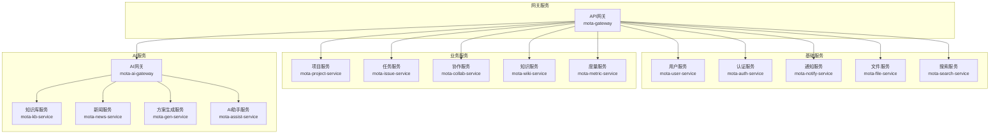

### 3.2 服务职责说明

| 服务名称 | 职责描述 | 核心功能 |
|---------|---------|---------|
| mota-gateway | API网关 | 路由转发、限流熔断、认证鉴权、日志记录 |
| mota-auth-service | 认证授权 | 登录认证、Token管理、OAuth2、SSO |
| mota-user-service | 用户管理 | 用户CRUD、个人设置、账号安全 |
| mota-project-service | 项目管理 | 项目CRUD、项目设置、项目模板 |
| mota-issue-service | 任务管理 | 需求/任务/缺陷管理、迭代管理、工作流 |
| mota-collab-service | 团队协作 | 文档协作、日程管理、成员管理 |
| mota-wiki-service | 知识管理 | Wiki空间、文档管理、协同编辑、版本控制 |
| mota-file-service | 文件服务 | 文件上传下载、预览、存储管理 |
| mota-notify-service | 通知服务 | 站内信、邮件、企业微信/钉钉推送 |
| mota-search-service | 搜索服务 | 全文搜索、语义搜索、索引管理 |
| mota-metric-service | 度量服务 | 数据采集、指标计算、报表生成 |
| mota-ai-gateway | AI网关 | AI服务路由、模型选择、成本控制 |
| mota-kb-service | 知识库服务 | 文档解析、向量化、知识图谱 |
| mota-news-service | 新闻服务 | 新闻采集、智能匹配、个性化推送 |
| mota-gen-service | 方案生成服务 | AI方案生成、RAG检索、质量评估 |
| mota-assist-service | AI助手服务 | 智能问答、任务辅助、多轮对话 |

### 3.3 后端项目结构

```
mota-backend/
├── mota-gateway/                    # API网关
│   ├── src/main/java/
│   │   └── com/mota/gateway/
│   │       ├── config/              # 网关配置
│   │       ├── filter/              # 过滤器
│   │       ├── handler/             # 异常处理
│   │       └── GatewayApplication.java
│   ├── src/main/resources/
│   │   └── application.yml
│   └── pom.xml
│
├── mota-auth-service/               # 认证服务
├── mota-user-service/               # 用户服务
├── mota-project-service/            # 项目服务
├── mota-issue-service/              # 任务服务
├── mota-collab-service/             # 协作服务
├── mota-wiki-service/               # 知识服务
├── mota-file-service/               # 文件服务
├── mota-notify-service/             # 通知服务
├── mota-search-service/             # 搜索服务
├── mota-metric-service/             # 度量服务
│
├── mota-ai/                         # AI服务模块
│   ├── mota-ai-gateway/             # AI网关
│   ├── mota-kb-service/             # 知识库服务
│   │   ├── src/main/python/
│   │   │   ├── api/                 # API接口
│   │   │   ├── services/            # 业务逻辑
│   │   │   │   ├── document_parser.py    # 文档解析
│   │   │   │   ├── embedding_service.py  # 向量化服务
│   │   │   │   ├── knowledge_graph.py    # 知识图谱
│   │   │   │   └── retrieval_service.py  # 检索服务
│   │   │   ├── models/              # 数据模型
│   │   │   └── main.py
│   │   └── requirements.txt
│   │
│   ├── mota-news-service/           # 新闻服务
│   │   ├── src/main/python/
│   │   │   ├── api/
│   │   │   ├── services/
│   │   │   │   ├── news_crawler.py       # 新闻采集
│   │   │   │   ├── business_profiler.py  # 业务画像
│   │   │   │   ├── relevance_matcher.py  # 相关性匹配
│   │   │   │   └── push_service.py       # 推送服务
│   │   │   └── main.py
│   │   └── requirements.txt
│   │
│   ├── mota-gen-service/            # 方案生成服务
│   │   ├── src/main/python/
│   │   │   ├── api/
│   │   │   ├── services/
│   │   │   │   ├── prompt_manager.py     # Prompt管理
│   │   │   │   ├── rag_service.py        # RAG服务
│   │   │   │   ├── generator.py          # 方案生成
│   │   │   │   └── quality_evaluator.py  # 质量评估
│   │   │   └── main.py
│   │   └── requirements.txt
│   │
│   └── mota-assist-service/         # AI助手服务
│
├── mota-common/                     # 公共模块
│   ├── mota-common-core/            # 核心工具
│   ├── mota-common-security/        # 安全模块
│   ├── mota-common-redis/           # Redis模块
│   ├── mota-common-kafka/           # Kafka模块
│   ├── mota-common-mybatis/         # MyBatis模块
│   └── mota-common-log/             # 日志模块
│
├── mota-api/                        # API定义模块
│   ├── mota-api-user/               # 用户服务API
│   ├── mota-api-project/            # 项目服务API
│   ├── mota-api-ai/                 # AI服务API
│   └── ...
│
└── pom.xml                          # 父POM
```

### 3.4 技术栈详情

| 类别 | 技术 | 版本 | 说明 |
|-----|------|------|------|
| JDK | OpenJDK | 21 | LTS版本，支持虚拟线程 |
| 框架 | Spring Boot | 3.2.x | 微服务基础框架 |
| 微服务 | Spring Cloud | 2023.0.x | 微服务套件 |
| 服务发现 | Nacos | 2.3.x | 服务注册与发现 |
| 配置中心 | Nacos Config | 2.3.x | 配置管理 |
| 网关 | Spring Cloud Gateway | 4.1.x | API网关 |
| 负载均衡 | Spring Cloud LoadBalancer | 4.1.x | 客户端负载均衡 |
| 熔断降级 | Sentinel | 1.8.x | 流量控制、熔断降级 |
| RPC | OpenFeign | 4.1.x | 声明式HTTP客户端 |
| ORM | MyBatis-Plus | 3.5.x | ORM框架 |
| 数据库连接池 | HikariCP | 5.x | 高性能连接池 |
| 缓存 | Spring Data Redis | 3.2.x | Redis客户端 |
| 消息队列 | Spring Kafka | 3.1.x | Kafka客户端 |
| 搜索 | Spring Data Elasticsearch | 5.2.x | ES客户端 |
| 对象存储 | MinIO SDK | 8.x | 对象存储客户端 |
| 安全 | Spring Security | 6.2.x | 安全框架 |
| JWT | jjwt | 0.12.x | JWT工具 |
| 文档 | SpringDoc OpenAPI | 2.3.x | API文档 |
| 校验 | Hibernate Validator | 8.x | 参数校验 |
| 工具 | MapStruct | 1.5.x | 对象映射 |
| 工具 | Lombok | 1.18.x | 代码简化 |
| 测试 | JUnit 5 | 5.10.x | 单元测试 |
| 测试 | Mockito | 5.x | Mock框架 |
| Python | Python | 3.11+ | AI服务开发语言 |
| AI框架 | FastAPI | 0.109+ | Python Web框架 |
| AI框架 | LangChain | 0.1.x | AI应用开发框架 |
| AI框架 | LlamaIndex | 0.10.x | 知识检索框架 |

---

## 4. AI服务架构设计

### 4.1 AI服务总体架构

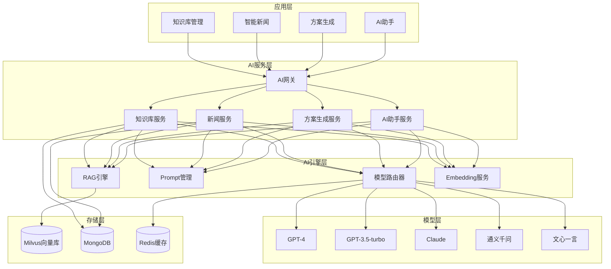

### 4.2 知识库服务设计

#### 4.2.1 文档处理流程

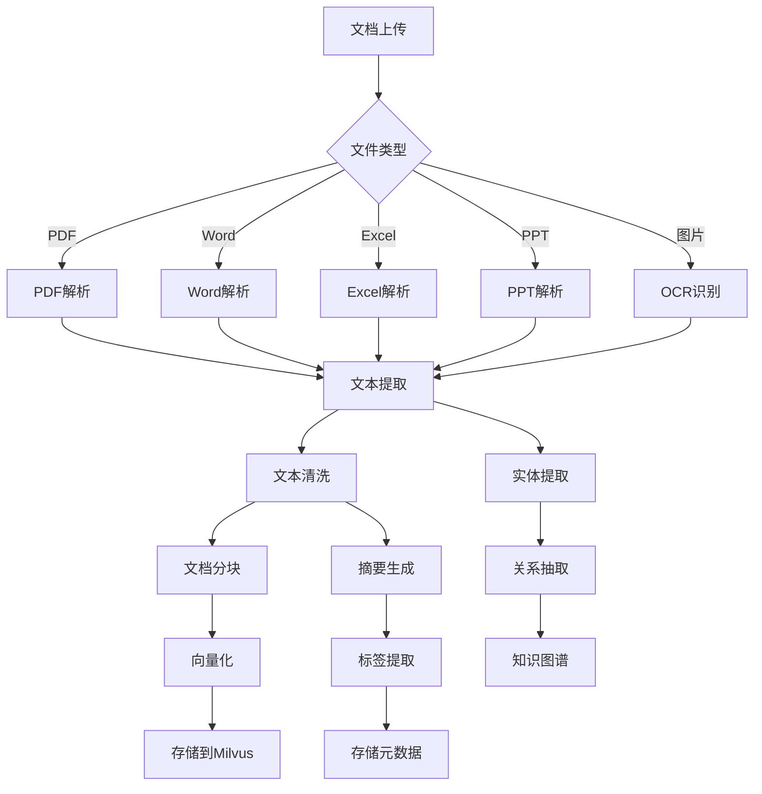

#### 4.2.2 分块策略

```python
# 语义分块实现
def semantic_chunk(text: str, max_tokens: int = 512) -> List[str]:
    """基于语义的文档分块"""
    paragraphs = split_paragraphs(text)
    chunks = []
    current_chunk = []
    current_tokens = 0
    
    for para in paragraphs:
        para_tokens = count_tokens(para)
        if current_tokens + para_tokens > max_tokens:
            chunks.append(''.join(current_chunk))
            current_chunk = [para]
            current_tokens = para_tokens
        else:
            current_chunk.append(para)
            current_tokens += para_tokens
    
    if current_chunk:
        chunks.append(''.join(current_chunk))
    
    return chunks
```

#### 4.2.3 向量化方案

| 模型 | 维度 | 性能 | 场景 |
|------|------|------|------|
| OpenAI text-embedding-3-small | 1536 | 性价比高 | 通用场景 |
| OpenAI text-embedding-3-large | 3072 | 最高质量 | 高精度需求 |
| bge-large-zh | 1024 | 中文SOTA | 中文为主场景 |
| m3e-base | 768 | 中文优秀 | 成本敏感场景 |

### 4.3 智能新闻推送设计

#### 4.3.1 业务画像构建

```python
# 业务画像数据结构
business_profile = {
    "org_id": "org_001",
    "industry": ["科技", "人工智能", "SaaS"],
    "keywords": ["项目管理", "团队协作", "AI", "企业服务"],
    "entities": ["OpenAI", "微软", "阿里云"],
    "business_areas": ["产品研发", "市场营销", "客户服务"],
    "concern_topics": ["政策法规", "技术趋势", "融资动态"],
    "update_frequency": "daily",
    "last_updated": "2025-12-22"
}
```

#### 4.3.2 相关性匹配算法

```python
def calculate_relevance(article: dict, profile: dict) -> float:
    """计算新闻与企业的相关性"""
    scores = {
        'industry_match': 0.0,
        'keyword_match': 0.0,
        'entity_match': 0.0,
        'semantic_similarity': 0.0
    }
    
    # 1. 行业匹配
    article_industries = classify_industry(article['content'])
    scores['industry_match'] = jaccard_similarity(
        article_industries, profile['industry']
    )
    
    # 2. 关键词匹配
    article_keywords = extract_keywords(article['content'])
    scores['keyword_match'] = keyword_overlap_score(
        article_keywords, profile['keywords']
    )
    
    # 3. 实体匹配
    article_entities = extract_entities(article['content'])
    scores['entity_match'] = entity_overlap_score(
        article_entities, profile['entities']
    )
    
    # 4. 语义相似度
    profile_embedding = create_profile_embedding(profile)
    article_embedding = embed(article['content'])
    scores['semantic_similarity'] = cosine_similarity(
        profile_embedding, article_embedding
    )
    
    # 加权平均
    weights = {
        'industry_match': 0.25,
        'keyword_match': 0.20,
        'entity_match': 0.15,
        'semantic_similarity': 0.40
    }
    
    return sum(scores[k] * weights[k] for k in scores)
```

### 4.4 AI方案生成设计

#### 4.4.1 RAG增强生成流程

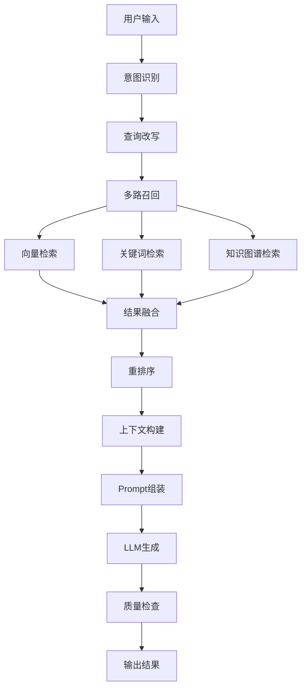

#### 4.4.2 Prompt模板管理

```python
SOLUTION_PROMPTS = {
    "project_plan": """
你是一位经验丰富的项目经理。基于以下信息生成详细的项目方案:

【企业背景】
{company_background}

【项目需求】
{project_requirements}

【参考资料】
{reference_materials}

请生成包含以下章节的项目方案:
1. 项目概述
2. 项目目标
3. 项目范围
4. 项目计划
5. 资源需求
6. 风险管理
7. 成功标准

要求:
- 结构清晰，逻辑严密
- 符合{company_name}的业务特点
- 参考行业最佳实践
- 输出格式为Markdown
""",
    
    "marketing_plan": """...""",
    "technical_solution": """..."""
}
```

### 4.5 多模型路由策略

```python
class ModelRouter:
    def __init__(self):
        self.models = {
            'gpt-4': {
                'cost': 0.06,  # per 1k tokens
                'quality': 0.95,
                'speed': 0.7,
                'max_tokens': 8192
            },
            'gpt-3.5-turbo': {
                'cost': 0.002,
                'quality': 0.85,
                'speed': 0.95,
                'max_tokens': 16384
            },
            'claude-3-opus': {
                'cost': 0.015,
                'quality': 0.93,
                'speed': 0.75,
                'max_tokens': 200000
            },
            'qwen-turbo': {
                'cost': 0.001,
                'quality': 0.80,
                'speed': 0.90,
                'max_tokens': 8000
            }
        }
    
    def route(self, task: dict, strategy: str = 'balanced') -> str:
        if strategy == 'cost':
            return self._route_by_cost(task)
        elif strategy == 'quality':
            return self._route_by_quality(task)
        elif strategy == 'speed':
            return self._route_by_speed(task)
        else:
            return self._route_balanced(task)
    
    def _route_balanced(self, task: dict) -> str:
        scores = {}
        for model, specs in self.models.items():
            score = (
                (1 - specs['cost'] / 0.06) * 0.3 +
                specs['quality'] * 0.5 +
                specs['speed'] * 0.2
            )
            scores[model] = score
        return max(scores, key=scores.get)
```

---

## 5. 数据库架构设计

### 5.1 数据库选型策略

| 数据类型 | 数据库 | 说明 |
|---------|--------|------|
| 结构化业务数据 | PostgreSQL 16 / MySQL 8.0 | 用户、项目、任务等核心业务数据 |
| 文档型数据 | MongoDB 7.x | Wiki文档、AI生成内容、配置数据 |
| 向量数据 | Milvus 2.x | 文档Embedding、语义检索 |
| 缓存数据 | Redis 7.x | 会话、热点数据、分布式锁 |
| 搜索数据 | Elasticsearch 8.x | 全文搜索索引 |

### 5.2 数据库分库策略

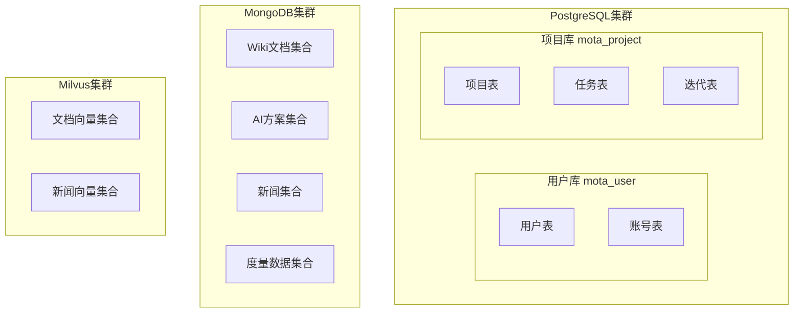

### 5.3 核心数据模型

#### 5.3.1 用户相关表

```sql
-- 用户表
CREATE TABLE "user" (
    id BIGSERIAL PRIMARY KEY,
    username VARCHAR(50) NOT NULL UNIQUE,
    email VARCHAR(100) NOT NULL UNIQUE,
    phone VARCHAR(20),
    password_hash VARCHAR(255) NOT NULL,
    nickname VARCHAR(50),
    avatar VARCHAR(255),
    status SMALLINT DEFAULT 1,
    last_login_at TIMESTAMP,
    created_at TIMESTAMP DEFAULT CURRENT_TIMESTAMP,
    updated_at TIMESTAMP DEFAULT CURRENT_TIMESTAMP
);

CREATE INDEX idx_user_email ON "user"(email);
CREATE INDEX idx_user_phone ON "user"(phone);
```

#### 5.3.2 项目相关表

```sql
-- 项目表
CREATE TABLE project (
    id BIGSERIAL PRIMARY KEY,
    org_id BIGINT NOT NULL,
    name VARCHAR(100) NOT NULL,
    key VARCHAR(20) NOT NULL,
    description TEXT,
    template_type VARCHAR(20) DEFAULT 'agile',
    status VARCHAR(20) DEFAULT 'active',
    owner_id BIGINT NOT NULL,
    settings JSONB,
    created_at TIMESTAMP DEFAULT CURRENT_TIMESTAMP,
    updated_at TIMESTAMP DEFAULT CURRENT_TIMESTAMP,
    UNIQUE(org_id, key)
);

-- 任务表
CREATE TABLE issue (
    id BIGSERIAL PRIMARY KEY,
    project_id BIGINT NOT NULL,
    issue_key VARCHAR(30) NOT NULL UNIQUE,
    type VARCHAR(20) NOT NULL,
    title VARCHAR(255) NOT NULL,
    description TEXT,
    status VARCHAR(30) NOT NULL,
    priority VARCHAR(20) DEFAULT 'medium',
    assignee_id BIGINT,
    reporter_id BIGINT NOT NULL,
    parent_id BIGINT,
    sprint_id BIGINT,
    story_points INT,
    estimated_hours DECIMAL(10,2),
    due_date DATE,
    created_at TIMESTAMP DEFAULT CURRENT_TIMESTAMP,
    updated_at TIMESTAMP DEFAULT CURRENT_TIMESTAMP
);

CREATE INDEX idx_issue_project ON issue(project_id);
CREATE INDEX idx_issue_assignee ON issue(assignee_id);
CREATE INDEX idx_issue_sprint ON issue(sprint_id);
```

#### 5.3.3 AI相关数据模型（MongoDB）

```javascript
// AI方案文档
{
    "_id": ObjectId("..."),
    "orgId": "org_001",
    "userId": "user_001",
    "title": "2025年Q1市场推广方案",
    "solutionType": "marketing",
    "inputPrompt": "生成2025年Q1市场推广方案",
    "generatedContent": "# 2025年Q1市场推广方案\n\n## 1. 市场分析\n...",
    "modelUsed": "gpt-4",
    "tokensUsed": 2500,
    "qualityScore": 0.85,
    "status": "finalized",
    "referencedDocs": ["doc_001", "doc_002"],
    "createdAt": ISODate("2025-12-22T10:00:00Z"),
    "updatedAt": ISODate("2025-12-22T10:30:00Z")
}

// 知识库文档
{
    "_id": ObjectId("..."),
    "orgId": "org_001",
    "knowledgeBaseId": "kb_001",
    "title": "产品需求文档",
    "fileName": "PRD_v1.0.pdf",
    "fileType": "pdf",
    "fileSize": 1024000,
    "fileUrl": "https://storage.mota.ai/files/xxx.pdf",
    "contentText": "...",
    "summary": "本文档描述了...",
    "tags": ["需求", "产品"],
    "chunkCount": 15,
    "status": "indexed",
    "uploadedBy": "user_001",
    "createdAt": ISODate("2025-12-22T08:00:00Z"),
    "indexedAt": ISODate("2025-12-22T08:05:00Z")
}

// 新闻文章
{
    "_id": ObjectId("..."),
    "title": "OpenAI发布GPT-5",
    "summary": "OpenAI今日宣布...",
    "content": "...",
    "source": "36氪",
    "sourceUrl": "https://36kr.com/xxx",
    "author": "张三",
    "publishedAt": ISODate("2025-12-22T09:00:00Z"),
    "category": "科技",
    "tags": ["AI", "OpenAI", "GPT"],
    "imageUrl": "https://...",
    "crawledAt": ISODate("2025-12-22T09:30:00Z")
}
```

### 5.4 Milvus向量集合

```python
# 文档向量集合定义
collection_schema = {
    "collection_name": "document_vectors",
    "dimension": 1536,
    "fields": [
        {"name": "id", "type": "INT64", "is_primary": True},
        {"name": "vector", "type": "FLOAT_VECTOR", "dim": 1536},
        {"name": "chunk_id", "type": "INT64"},
        {"name": "document_id", "type": "VARCHAR", "max_length": 64},
        {"name": "org_id", "type": "VARCHAR", "max_length": 64},
        {"name": "content", "type": "VARCHAR", "max_length": 65535},
        {"name": "metadata", "type": "JSON"}
    ],
    "index_params": {
        "metric_type": "L2",
        "index_type": "IVF_FLAT",
        "params": {"nlist": 1024}
    }
}
```

---

## 6. API 网关设计

### 6.1 网关架构

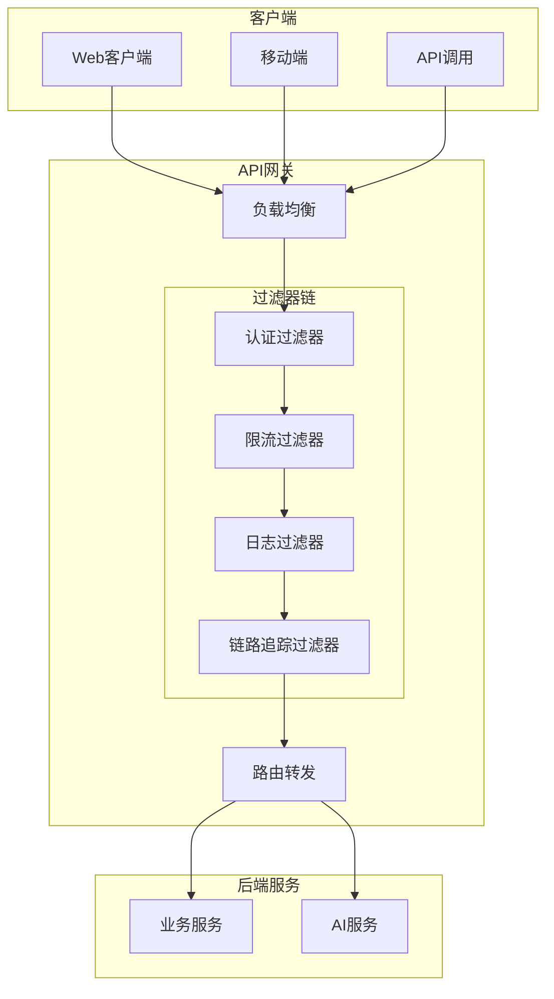

### 6.2 网关配置

```yaml
# application.yml
spring:
  cloud:
    gateway:
      routes:
        # 认证服务
        - id: auth-service
          uri: lb://mota-auth-service
          predicates:
            - Path=/api/v1/auth/**
          filters:
            - StripPrefix=0
            
        # 用户服务
        - id: user-service
          uri: lb://mota-user-service
          predicates:
            - Path=/api/v1/users/**
          filters:
            - StripPrefix=0
            - AuthFilter
            
        # 项目服务
        - id: project-service
          uri: lb://mota-project-service
          predicates:
            - Path=/api/v1/projects/**
          filters:
            - StripPrefix=0
            - AuthFilter
            
        # 任务服务
        - id: issue-service
          uri: lb://mota-issue-service
          predicates:
            - Path=/api/v1/issues/**, /api/v1/sprints/**
          filters:
            - StripPrefix=0
            - AuthFilter
            
        # AI服务
        - id: ai-service
          uri: lb://mota-ai-gateway
          predicates:
            - Path=/api/v1/ai/**
          filters:
            - StripPrefix=0
            - AuthFilter
            
        # 知识库服务
        - id: kb-service
          uri: lb://mota-kb-service
          predicates:
            - Path=/api/v1/knowledge/**
          filters:
            - StripPrefix=0
            - AuthFilter
            
        # 知识服务
        - id: wiki-service
          uri: lb://mota-wiki-service
          predicates:
            - Path=/api/v1/wiki/**
          filters:
            - StripPrefix=0
            - AuthFilter
```

---

## 7. 安全架构设计

### 7.1 安全架构总览

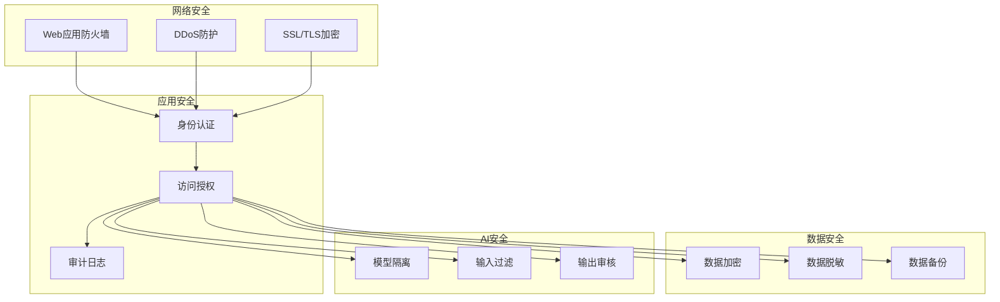

### 7.2 认证方案

#### 7.2.1 JWT Token 结构

```json
{
  "header": {
    "alg": "RS256",
    "typ": "JWT"
  },
  "payload": {
    "sub": "1001",
    "username": "zhangsan",
    "orgId": "org_001",
    "roles": ["admin", "developer"],
    "permissions": ["project:read", "project:write", "ai:use"],
    "iat": 1710489600,
    "exp": 1710576000,
    "jti": "unique-token-id"
  }
}
```

### 7.3 AI安全措施

| 安全措施 | 描述 |
|---------|------|
| 模型隔离 | 不同组织的知识库和模型调用相互隔离 |
| 输入过滤 | 过滤恶意Prompt注入攻击 |
| 输出审核 | 检查AI生成内容的合规性 |
| 成本控制 | 限制API调用频率和Token消耗 |
| 数据脱敏 | 敏感信息在传输给AI模型前进行脱敏 |

---

## 8. 基础设施架构

### 8.1 Kubernetes 部署架构

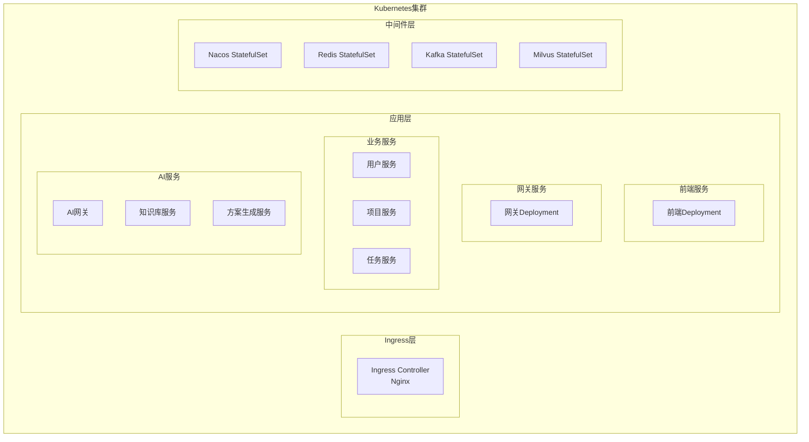

### 8.2 监控架构

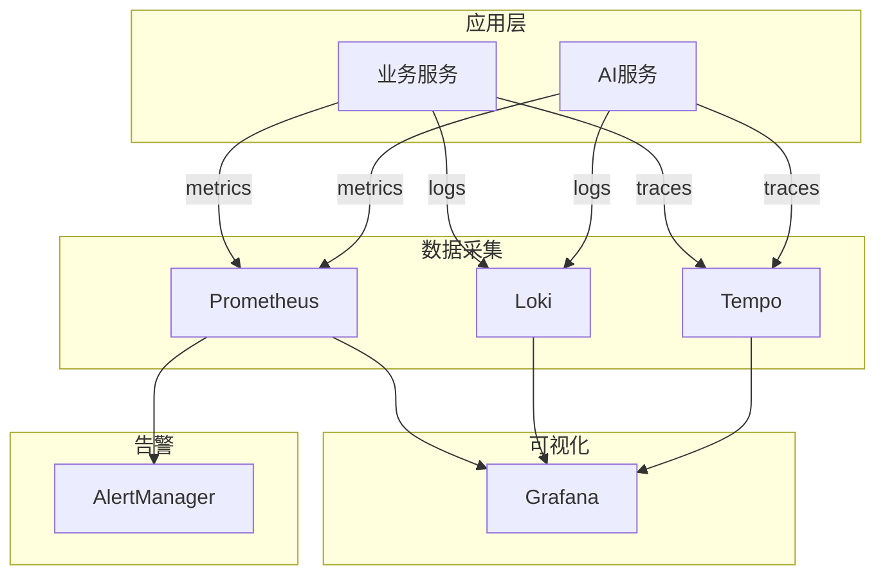

---

## 9. 部署方案

### 9.1 环境规划

| 环境 | 用途 | 配置 |
|-----|------|------|
| 开发环境 (dev) | 开发调试 | 单节点，最小配置 |
| 测试环境 (test) | 功能测试 | 双节点，中等配置 |
| 预发环境 (staging) | 预发验证 | 与生产一致 |
| 生产环境 (prod) | 正式运行 | 高可用，多节点 |

### 9.2 生产环境资源规划

| 服务 | 实例数 | CPU | 内存 | 存储 |
|-----|--------|-----|------|------|
| API网关 | 3 | 2核 | 4GB | - |
| 用户服务 | 3 | 2核 | 4GB | - |
| 项目服务 | 3 | 2核 | 4GB | - |
| 任务服务 | 5 | 4核 | 8GB | - |
| 协作服务 | 3 | 2核 | 4GB | - |
| 知识服务 | 3 | 2核 | 4GB | - |
| AI网关 | 3 | 2核 | 4GB | - |
| 知识库服务 | 3 | 4核 | 8GB | - |
| 方案生成服务 | 3 | 4核 | 8GB | - |
| 新闻服务 | 2 | 2核 | 4GB | - |
| PostgreSQL | 3 (1主2从) | 8核 | 32GB | 500GB SSD |
| MongoDB | 3 (副本集) | 4核 | 16GB | 200GB SSD |
| Milvus | 3 | 4核 | 16GB | 200GB SSD |
| Redis | 6 (3主3从) | 4核 | 16GB | 50GB SSD |
| Kafka | 3 | 4核 | 16GB | 200GB SSD |
| Elasticsearch | 3 | 4核 | 16GB | 500GB SSD |

---

## 10. 技术风险与应对

### 10.1 风险识别

| 风险类型 | 风险描述 | 影响程度 | 应对措施 |
|---------|---------|---------|---------|
| 性能风险 | 高并发场景下系统响应变慢 | 高 | 多级缓存、读写分离、异步处理 |
| 可用性风险 | 单点故障导致服务不可用 | 高 | 多节点部署、自动故障转移 |
| 数据风险 | 数据丢失或损坏 | 高 | 定期备份、主从复制、异地容灾 |
| 安全风险 | 数据泄露或被攻击 | 高 | 多层安全防护、加密存储、审计日志 |
| AI风险 | AI模型不稳定或成本失控 | 中 | 多模型备份、成本监控、降级策略 |
| 扩展性风险 | 业务增长后系统无法扩展 | 中 | 微服务架构、水平扩展设计 |

### 10.2 AI服务容灾

```python
class ModelFallback:
    def __init__(self, primary_model: str, fallback_models: List[str]):
        self.primary = primary_model
        self.fallbacks = fallback_models
        self.retry_config = {
            'max_retries': 3,
            'timeout': 30
        }
    
    async def call_with_fallback(self, prompt: str) -> str:
        models = [self.primary] + self.fallbacks
        
        for model in models:
            try:
                response = await self.call_model(
                    model, prompt,
                    timeout=self.retry_config['timeout']
                )
                return response
            except Exception as e:
                logger.warning(f"Model {model} failed: {e}")
                continue
        
        raise Exception("All models failed")
```

---

## 11. 实施路线图

### 11.1 阶段规划

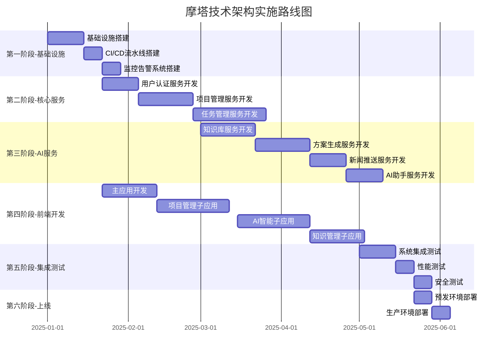

### 11.2 里程碑

| 里程碑 | 目标日期 | 交付物 |
|-------|---------|--------|
| M1 | 2025-01-21 | 基础设施就绪，CI/CD流水线可用 |
| M2 | 2025-02-28 | 核心服务（用户、项目、任务）上线 |
| M3 | 2025-04-30 | AI服务（知识库、方案生成、新闻推送）上线 |
| M4 | 2025-05-15 | 前端应用全部完成 |
| M5 | 2025-05-21 | 系统测试完成，预发环境验证通过 |
| M6 | 2025-06-01 | 生产环境正式上线 |

---

## 12. 附录

### 12.1 技术栈版本清单

| 组件 | 版本 | 说明 |
|-----|------|------|
| JDK | 21 LTS | OpenJDK 或 Eclipse Temurin |
| Python | 3.11+ | AI服务开发语言 |
| Spring Boot | 3.2.x | 最新稳定版 |
| Spring Cloud | 2023.0.x | 与 Spring Boot 3.2 兼容 |
| FastAPI | 0.109+ | Python Web框架 |
| LangChain | 0.1.x | AI应用开发框架 |
| React | 18.2.x | 最新稳定版 |
| TypeScript | 5.x | 最新稳定版 |
| PostgreSQL | 16.x | 最新稳定版 |
| MongoDB | 7.x | 最新稳定版 |
| Milvus | 2.3.x | 向量数据库 |
| Redis | 7.x | 最新稳定版 |
| Kafka | 3.6.x | 最新稳定版 |
| Elasticsearch | 8.x | 最新稳定版 |
| Kubernetes | 1.28+ | 最新稳定版 |

### 12.2 参考文档

- [Spring Boot 官方文档](https://docs.spring.io/spring-boot/docs/current/reference/html/)
- [Spring Cloud 官方文档](https://spring.io/projects/spring-cloud)
- [FastAPI 官方文档](https://fastapi.tiangolo.com/)
- [LangChain 官方文档](https://python.langchain.com/)
- [React 官方文档](https://react.dev/)
- [qiankun 微前端文档](https://qiankun.umijs.org/)
- [Milvus 官方文档](https://milvus.io/docs)
- [Kubernetes 官方文档](https://kubernetes.io/docs/)

---

*摩塔 Mota - AI驱动的项目管理与团队协作平台*