# monday.com 商业模式与业务分析报告

## 摘要

本报告深入分析 monday.com 的业务模式、商业理念和商业模式，并结合摩塔 Mota 项目的定位，提出可借鉴的策略和建议。

---

## 1. monday.com 公司概述

### 1.1 公司背景

| 项目 | 信息 |
|-----|------|
| 成立时间 | 2012年（原名 dapulse，2017年更名为 monday.com） |
| 总部 | 以色列特拉维夫 |
| 上市 | 2021年6月在纳斯达克上市（MNDY） |
| 市值 | 约 100-150 亿美元（2024年） |
| 员工数 | 约 1,800+ 人 |
| 客户数 | 225,000+ 付费客户 |
| 年收入 | 约 7.3 亿美元（2023年） |

### 1.2 发展历程

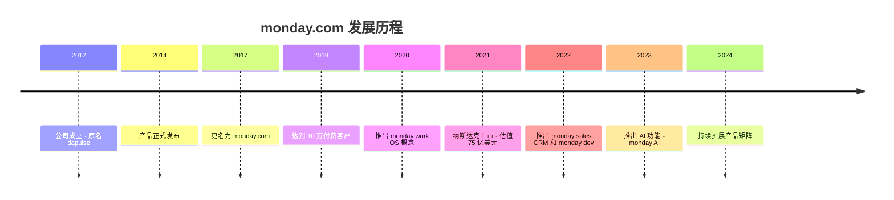

---

## 2. 商业理念分析

### 2.1 核心理念：Work OS（工作操作系统）

monday.com 将自己定位为 **Work OS（工作操作系统）**，而非简单的项目管理工具。这一理念的核心是：

```
┌─────────────────────────────────────────────────────────────────┐
│                    Work OS 核心理念                              │
├─────────────────────────────────────────────────────────────────┤
│  "让每个团队都能构建和运行自己需要的工作流程"                      │
├─────────────────────────────────────────────────────────────────┤
│  • 灵活性：适应任何工作流程，而非强制用户适应工具                   │
│  • 可定制：低代码/无代码方式构建自定义应用                         │
│  • 可扩展：从小团队到大企业都能使用                               │
│  • 透明性：让工作可见，促进协作                                   │
└─────────────────────────────────────────────────────────────────┘
```

### 2.2 产品哲学

| 哲学原则 | 具体体现 |
|---------|---------|
| **简单至上** | 界面直观，5分钟即可上手 |
| **视觉优先** | 丰富的颜色编码、图标、可视化 |
| **灵活适配** | 支持多种视图（看板、甘特图、日历等） |
| **协作透明** | 所有工作进度对团队可见 |
| **自动化** | 减少重复性工作，提升效率 |

### 2.3 品牌定位

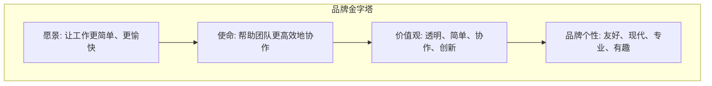

**品牌特色**：
- 鲜明的视觉识别（彩色方块 logo）
- 轻松友好的品牌调性
- 强调"工作也可以很有趣"

---

## 3. 商业模式分析

### 3.1 收入模式

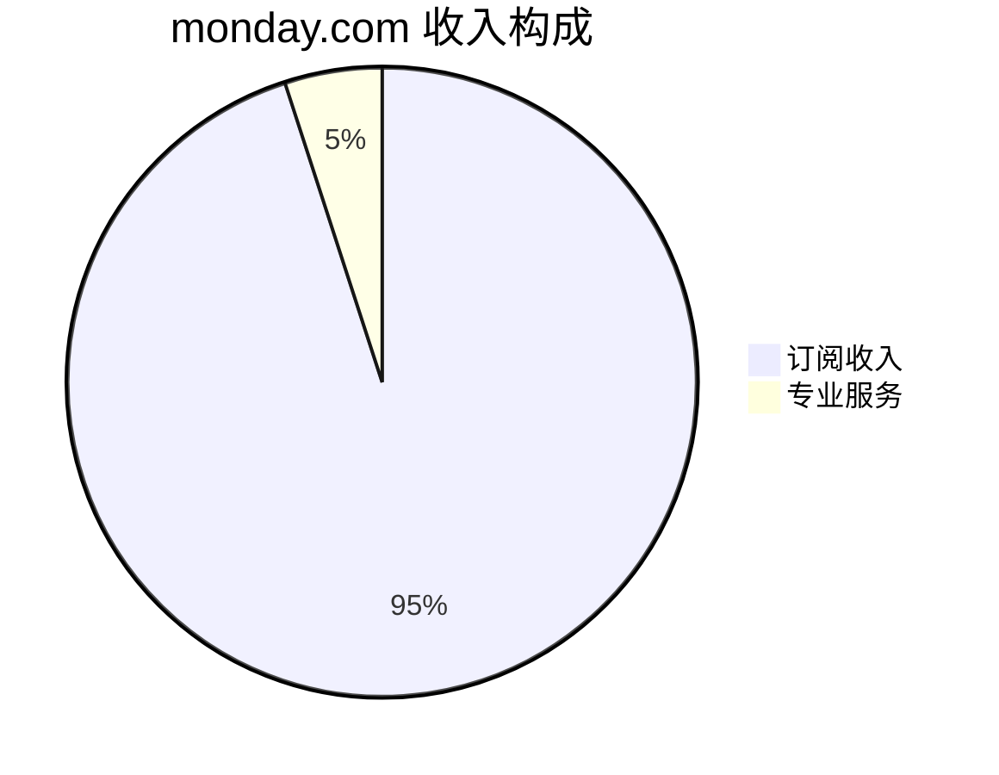

**订阅模式特点**：
- 按席位（seat）收费
- 按年付费有折扣（约18%）
- 最低3个席位起购

### 3.2 定价策略

| 套餐 | 价格/席位/月 | 目标用户 | 核心功能 |
|-----|-------------|---------|---------|
| **Free** | $0 | 个人/小团队 | 最多2人，基础功能 |
| **Basic** | $9 | 小型团队 | 无限看板、200+模板 |
| **Standard** | $12 | 中型团队 | 时间线、甘特图、自动化 |
| **Pro** | $19 | 大型团队 | 高级报表、时间追踪 |
| **Enterprise** | 定制 | 大型企业 | 高级安全、专属支持 |

**定价策略分析**：

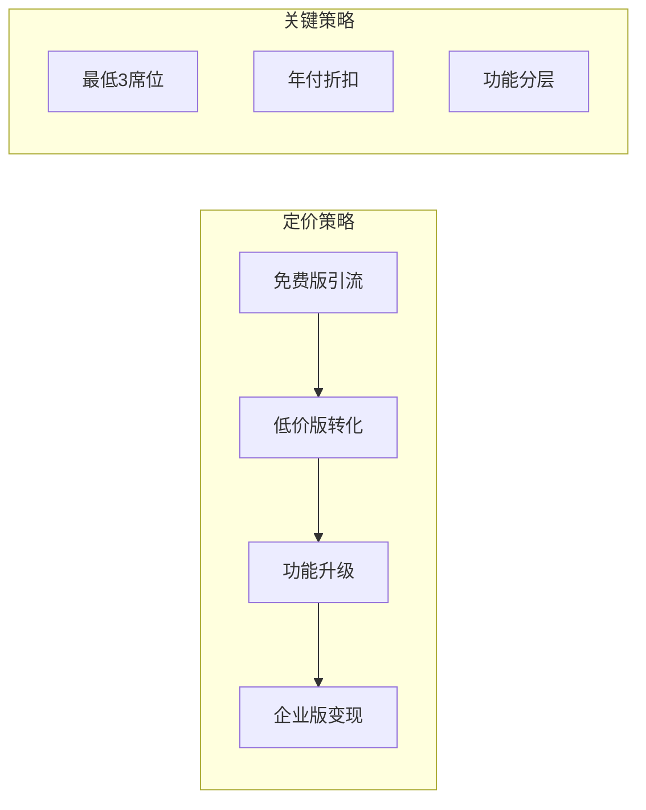

### 3.3 产品矩阵

monday.com 采用 **产品矩阵** 策略，围绕 Work OS 核心平台扩展多个垂直产品：

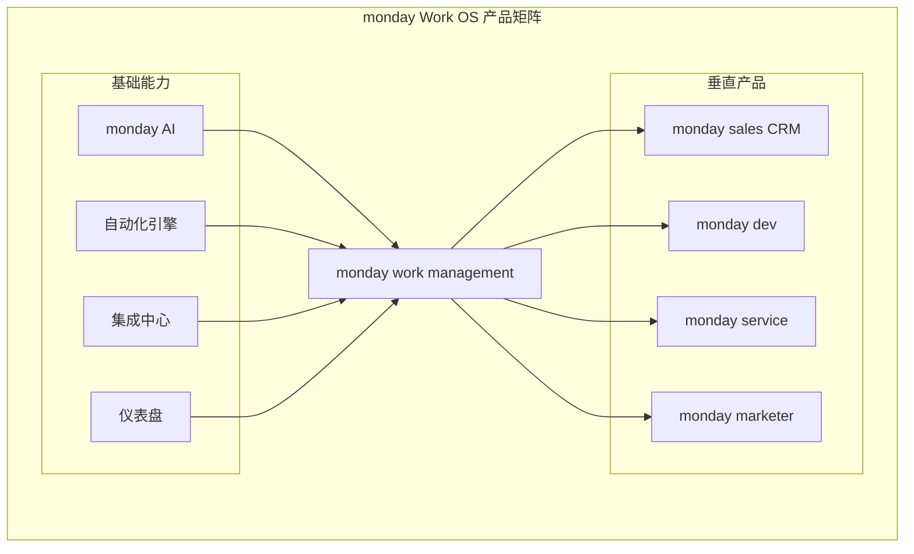

| 产品 | 定位 | 目标用户 |
|-----|------|---------|
| monday work management | 通用项目管理 | 所有团队 |
| monday sales CRM | 销售管理 | 销售团队 |
| monday dev | 软件开发管理 | 研发团队 |
| monday service | 客户服务管理 | 客服团队 |
| monday marketer | 营销管理 | 市场团队 |

### 3.4 增长飞轮

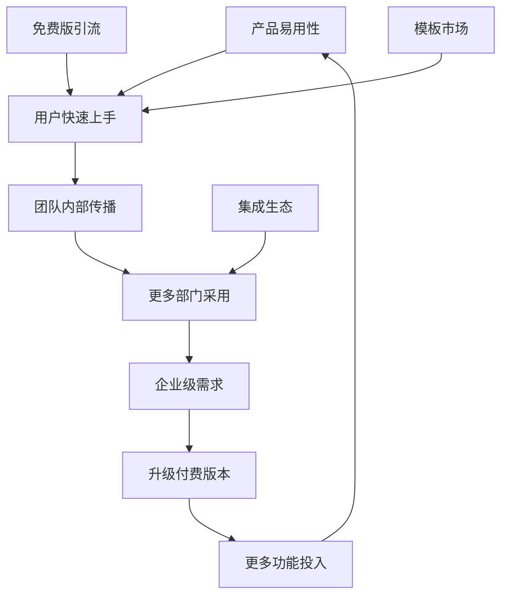

---

## 4. 核心竞争力分析

### 4.1 产品竞争力

| 竞争力 | 具体表现 | 竞争优势 |
|-------|---------|---------|
| **极致易用性** | 5分钟上手，无需培训 | 降低获客成本 |
| **高度灵活性** | 支持任何工作流程 | 适用场景广泛 |
| **丰富模板** | 200+行业模板 | 快速启动项目 |
| **强大自动化** | 无代码自动化 | 提升效率 |
| **可视化** | 多种视图、仪表盘 | 数据洞察 |

### 4.2 技术竞争力

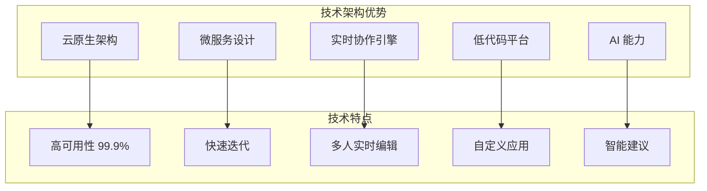

### 4.3 生态竞争力

**集成生态**：
- 200+ 原生集成（Slack、Teams、Zoom、Google、Salesforce等）
- 开放 API
- 应用市场（monday apps）
- 开发者平台

**合作伙伴生态**：
- 全球合作伙伴网络
- 认证顾问计划
- 系统集成商合作

---

## 5. 市场策略分析

### 5.1 获客策略

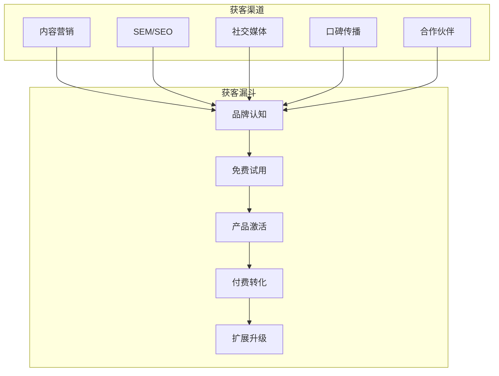

**关键获客策略**：

| 策略 | 具体做法 | 效果 |
|-----|---------|------|
| **PLG（产品驱动增长）** | 免费版 + 自助服务 | 降低获客成本 |
| **内容营销** | 博客、视频、白皮书 | 建立专业形象 |
| **模板营销** | 行业模板库 | 快速展示价值 |
| **病毒传播** | 邀请机制、团队协作 | 自然增长 |
| **品牌广告** | 超级碗广告等 | 提升知名度 |

### 5.2 客户成功策略

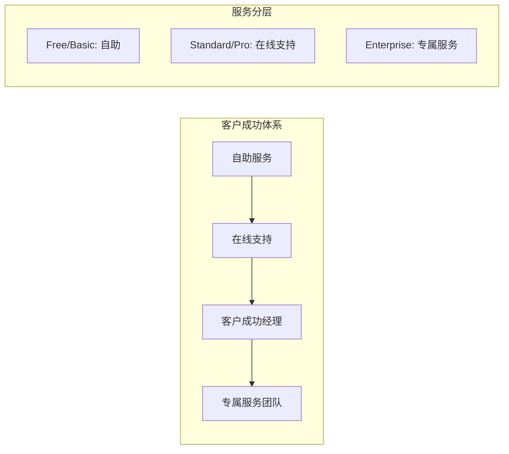

### 5.3 扩展策略

**土地扩张（Land and Expand）**：
1. **Land**：从一个团队/部门切入
2. **Expand**：扩展到更多团队
3. **Upgrade**：升级到更高版本
4. **Cross-sell**：销售其他产品（CRM、Dev等）

---

## 6. AI 战略分析

### 6.1 monday AI 功能

monday.com 于 2023 年推出 AI 功能，主要包括：

| AI 功能 | 描述 | 价值 |
|--------|------|------|
| **AI 助手** | 自然语言交互 | 快速操作 |
| **智能公式** | AI 生成公式 | 降低门槛 |
| **内容生成** | 生成任务描述、邮件等 | 提升效率 |
| **智能摘要** | 自动总结更新 | 节省时间 |
| **智能建议** | 推荐下一步行动 | 辅助决策 |

### 6.2 AI 战略定位

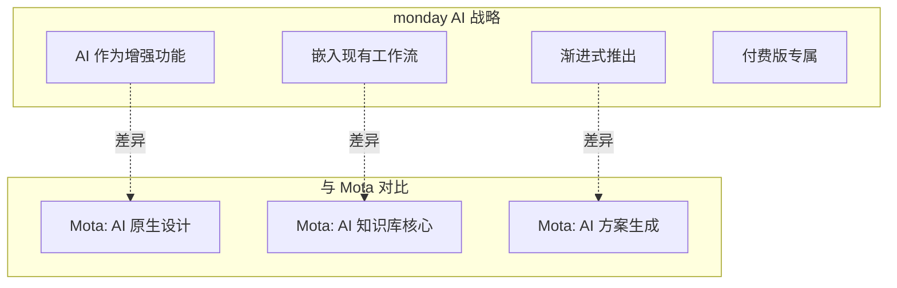

---

## 7. 与摩塔 Mota 对比分析

### 7.1 定位对比

| 维度 | monday.com | 摩塔 Mota |
|-----|-----------|-----------|
| **核心定位** | Work OS（工作操作系统） | AI驱动的项目管理平台 |
| **AI 定位** | 增强功能 | 核心驱动力 |
| **目标市场** | 全球市场 | 中国市场 |
| **产品策略** | 横向扩展（多产品） | 纵向深耕（AI能力） |
| **技术特色** | 低代码平台 | RAG + 知识图谱 |

### 7.2 功能对比

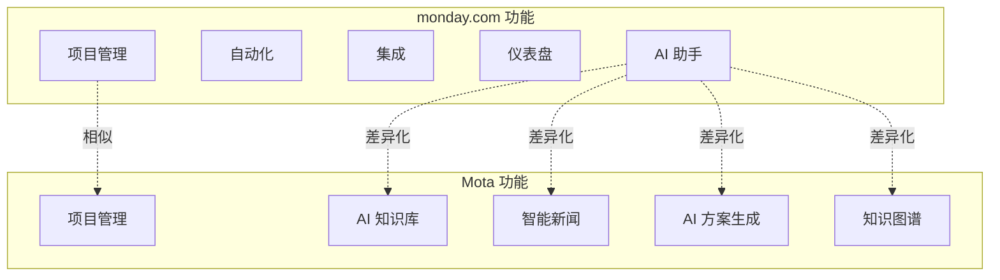

### 7.3 优劣势对比

| 维度 | monday.com 优势 | Mota 优势 |
|-----|----------------|-----------|
| **易用性** | ⭐⭐⭐⭐⭐ 极致简单 | ⭐⭐⭐⭐ 良好 |
| **AI 深度** | ⭐⭐⭐ 辅助功能 | ⭐⭐⭐⭐⭐ 核心能力 |
| **知识管理** | ⭐⭐⭐ 基础 | ⭐⭐⭐⭐⭐ 深度 |
| **本土化** | ⭐⭐ 一般 | ⭐⭐⭐⭐⭐ 深度 |
| **生态系统** | ⭐⭐⭐⭐⭐ 丰富 | ⭐⭐ 待建设 |
| **品牌知名度** | ⭐⭐⭐⭐⭐ 全球知名 | ⭐⭐ 待提升 |

---

## 8. 可借鉴的策略与建议

### 8.1 产品策略借鉴

#### 8.1.1 极致易用性

**monday.com 做法**：
- 5分钟上手，无需培训
- 直观的拖拽操作
- 丰富的视觉反馈

**Mota 建议**：
```
┌─────────────────────────────────────────────────────────────────┐
│  建议1：简化首次使用体验                                          │
├─────────────────────────────────────────────────────────────────┤
│  • 设计引导式新手教程                                             │
│  • 提供预设模板，一键创建项目                                      │
│  • 简化 AI 功能入口，降低使用门槛                                  │
│  • 优化界面，减少认知负担                                         │
└─────────────────────────────────────────────────────────────────┘
```

#### 8.1.2 模板市场

**monday.com 做法**：
- 200+ 行业模板
- 用户可分享模板
- 模板作为获客工具

**Mota 建议**：
```
┌─────────────────────────────────────────────────────────────────┐
│  建议2：建设 AI 增强的模板市场                                    │
├─────────────────────────────────────────────────────────────────┤
│  • 提供行业项目模板（科技、咨询、制造等）                          │
│  • AI 自动推荐适合的模板                                          │
│  • 模板包含预设的 AI 知识库配置                                   │
│  • 支持用户分享和评价模板                                         │
└─────────────────────────────────────────────────────────────────┘
```

#### 8.1.3 多视图支持

**monday.com 做法**：
- 看板、表格、时间线、甘特图、日历、地图等多种视图
- 一键切换，数据同步

**Mota 建议**：
- 当前已支持看板、列表、甘特图
- 建议增加日历视图、时间线视图
- 考虑增加 AI 智能视图（自动推荐最佳视图）

### 8.2 商业模式借鉴

#### 8.2.1 定价策略

**monday.com 做法**：
- 免费版引流
- 功能分层定价
- 最低席位限制

**Mota 建议**：
```
┌─────────────────────────────────────────────────────────────────┐
│  建议3：设计合理的定价体系                                        │
├─────────────────────────────────────────────────────────────────┤
│  套餐设计建议：                                                   │
│  • 免费版：基础项目管理 + 有限 AI 调用                            │
│  • 专业版：完整功能 + 标准 AI 额度                                │
│  • 企业版：高级功能 + 无限 AI + 私有部署                          │
│                                                                   │
│  定价策略：                                                       │
│  • 按席位 + AI 调用量混合计费                                     │
│  • 年付优惠 15-20%                                                │
│  • 最低 3 席位起购（团队版）                                      │
└─────────────────────────────────────────────────────────────────┘
```

#### 8.2.2 PLG（产品驱动增长）

**monday.com 做法**：
- 自助注册、自助服务
- 产品内引导升级
- 病毒式传播机制

**Mota 建议**：
```
┌─────────────────────────────────────────────────────────────────┐
│  建议4：实施 PLG 增长策略                                         │
├─────────────────────────────────────────────────────────────────┤
│  • 提供免费试用，降低使用门槛                                      │
│  • 设计邀请机制，鼓励用户邀请同事                                  │
│  • 产品内嵌升级提示，引导付费转化                                  │
│  • 建设自助服务体系，降低服务成本                                  │
└─────────────────────────────────────────────────────────────────┘
```

### 8.3 市场策略借鉴

#### 8.3.1 内容营销

**monday.com 做法**：
- 高质量博客内容
- 视频教程和案例
- 行业白皮书

**Mota 建议**：
```
┌─────────────────────────────────────────────────────────────────┐
│  建议5：建设内容营销体系                                          │
├─────────────────────────────────────────────────────────────────┤
│  • 发布 AI + 项目管理相关的专业内容                               │
│  • 制作产品使用教程视频                                           │
│  • 发布行业解决方案白皮书                                         │
│  • 分享客户成功案例                                               │
│  • 利用 AI 能力自动生成部分内容                                   │
└─────────────────────────────────────────────────────────────────┘
```

#### 8.3.2 生态建设

**monday.com 做法**：
- 200+ 集成
- 开放 API
- 开发者平台
- 合作伙伴网络

**Mota 建议**：
```
┌─────────────────────────────────────────────────────────────────┐
│  建议6：逐步建设生态系统                                          │
├─────────────────────────────────────────────────────────────────┤
│  第一阶段：                                                       │
│  • 集成企业微信、钉钉、飞书                                       │
│  • 提供开放 API                                                   │
│                                                                   │
│  第二阶段：                                                       │
│  • 建设应用市场                                                   │
│  • 发展合作伙伴                                                   │
│                                                                   │
│  第三阶段：                                                       │
│  • 开发者平台                                                     │
│  • 插件生态                                                       │
└─────────────────────────────────────────────────────────────────┘
```

### 8.4 差异化策略建议

基于分析，Mota 应该在以下方面建立差异化优势：

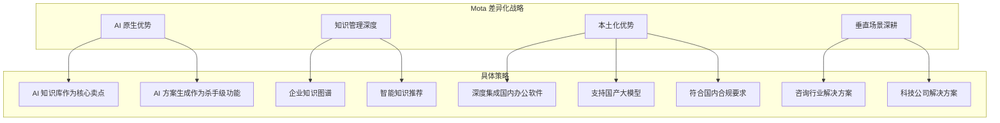

#### 8.4.1 强化 AI 原生优势

```
┌─────────────────────────────────────────────────────────────────┐
│  建议7：将 AI 能力作为核心差异化                                  │
├─────────────────────────────────────────────────────────────────┤
│  monday.com 的 AI 是"锦上添花"                                   │
│  Mota 的 AI 应该是"核心引擎"                                     │
│                                                                   │
│  具体做法：                                                       │
│  • 强调"AI 原生"定位，区别于传统工具                             │
│  • 将 AI 知识库作为核心卖点                                       │
│  • AI 方案生成作为杀手级功能                                      │
│  • 智能新闻推送作为独特价值                                       │
│  • 持续投入 AI 能力建设                                           │
└─────────────────────────────────────────────────────────────────┘
```

#### 8.4.2 深耕本土市场

```
┌─────────────────────────────────────────────────────────────────┐
│  建议8：发挥本土化优势                                            │
├─────────────────────────────────────────────────────────────────┤
│  • 深度集成企业微信、钉钉、飞书                                   │
│  • 支持国产大模型（通义千问、文心一言等）                          │
│  • 符合国内数据安全和合规要求                                     │
│  • 提供私有化部署选项                                             │
│  • 本地化客户服务                                                 │
│  • 针对国内企业习惯优化产品                                       │
└─────────────────────────────────────────────────────────────────┘
```

---

## 9. 实施路线图建议

### 9.1 短期（0-6个月）

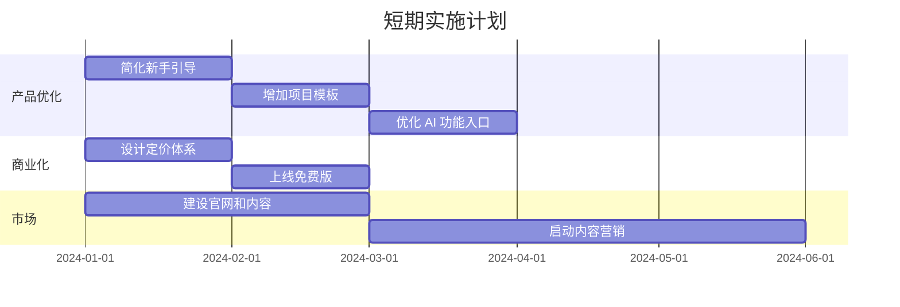

**关键任务**：
1. 优化产品易用性
2. 设计并上线定价体系
3. 建设官网和基础内容

### 9.2 中期（6-12个月）

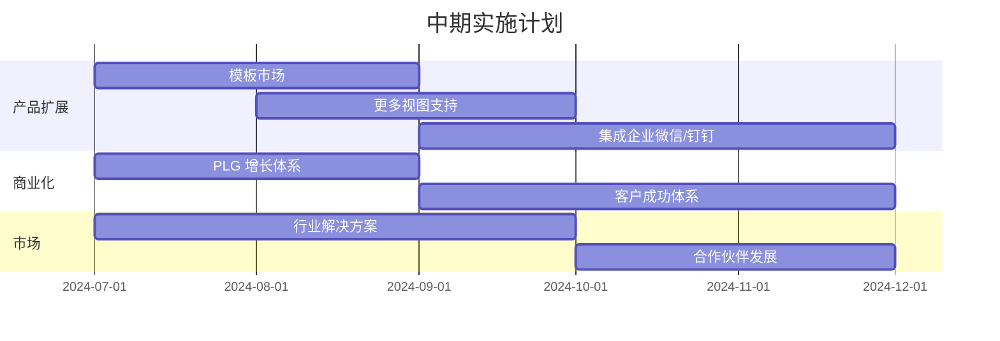

**关键任务**：
1. 建设模板市场
2. 完善集成生态
3. 建立 PLG 增长体系

### 9.3 长期（12-24个月）

**关键任务**：
1. 开放 API 和开发者平台
2. 建设应用市场
3. 发展合作伙伴网络
4. 考虑垂直产品扩展

---

## 10. 总结

### 10.1 核心借鉴点

| 借鉴点 | 优先级 | 实施难度 | 预期价值 |
|-------|-------|---------|---------|
| 极致易用性 | 高 | 中 | 高 |
| 模板市场 | 高 | 低 | 高 |
| PLG 增长策略 | 高 | 中 | 高 |
| 定价体系设计 | 高 | 低 | 高 |
| 内容营销 | 中 | 中 | 中 |
| 集成生态 | 中 | 高 | 高 |
| 多产品矩阵 | 低 | 高 | 中 |

### 10.2 差异化方向

```
┌─────────────────────────────────────────────────────────────────┐
│  Mota 的差异化定位                                               │
├─────────────────────────────────────────────────────────────────┤
│                                                                   │
│  monday.com = Work OS（工作操作系统）                            │
│                                                                   │
│  Mota = AI-Native Work Platform（AI原生工作平台）                │
│                                                                   │
│  核心差异：                                                       │
│  • AI 不是功能，而是核心引擎                                      │
│  • 知识管理不是附加，而是基础设施                                 │
│  • 智能化不是锦上添花，而是核心价值                               │
│                                                                   │
└─────────────────────────────────────────────────────────────────┘
```

### 10.3 最终建议

1. **学习 monday.com 的产品哲学**：简单、灵活、可视化
2. **借鉴其商业模式**：PLG + 分层定价 + 生态建设
3. **保持差异化优势**：AI 原生、知识管理深度、本土化
4. **循序渐进实施**：先优化核心体验，再扩展生态

---

*报告生成时间：2024年12月*
*报告版本：v1.0*