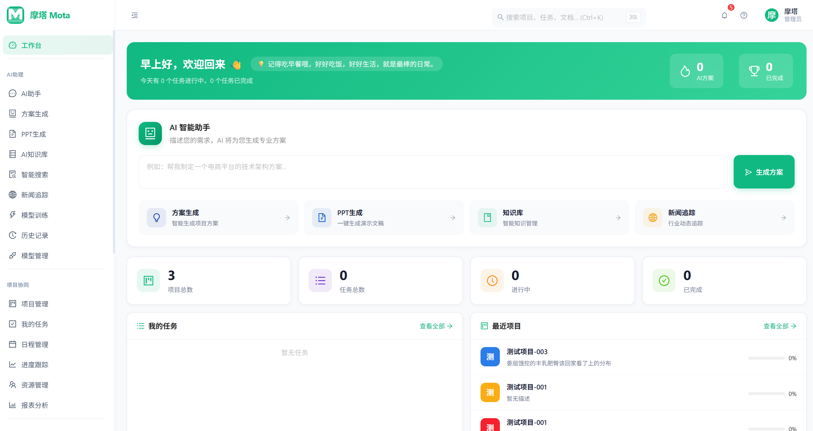
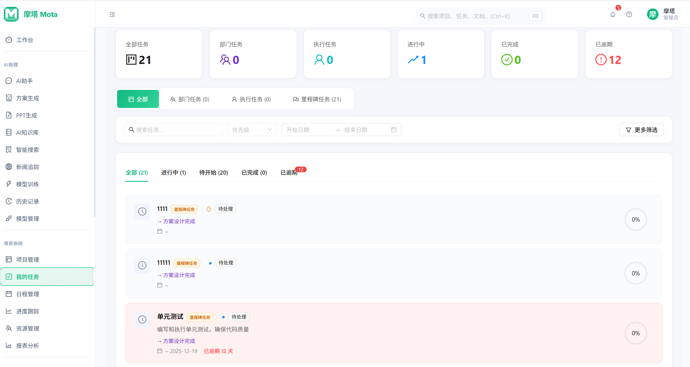
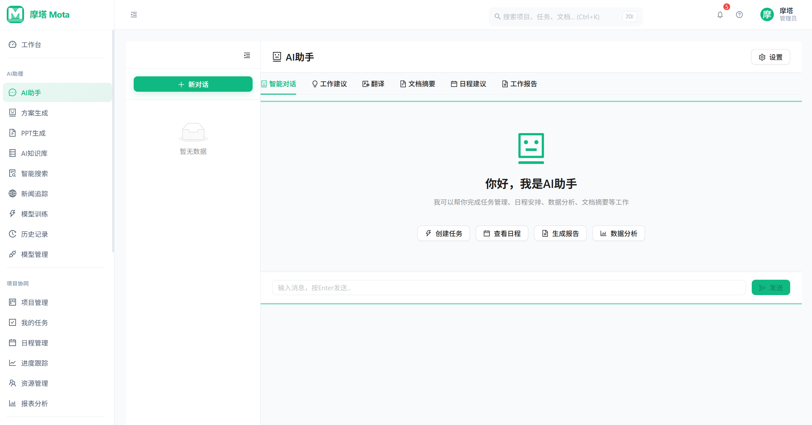
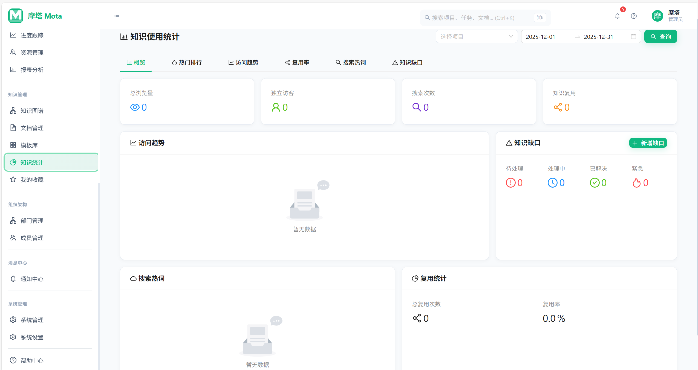
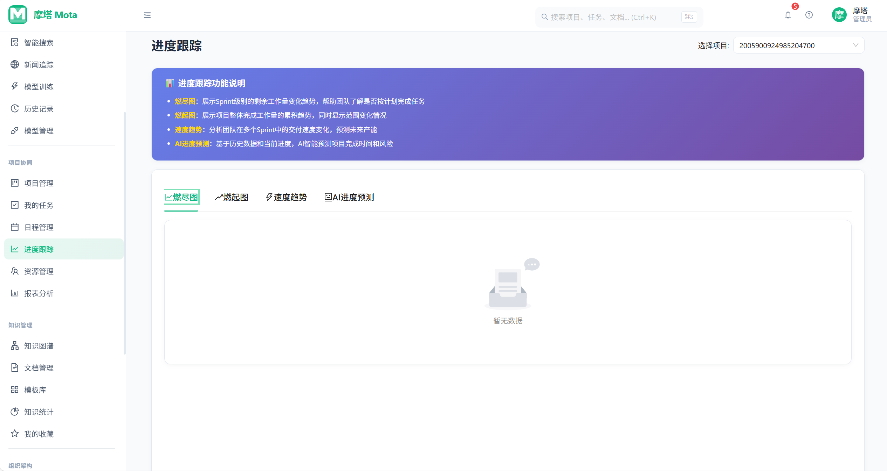
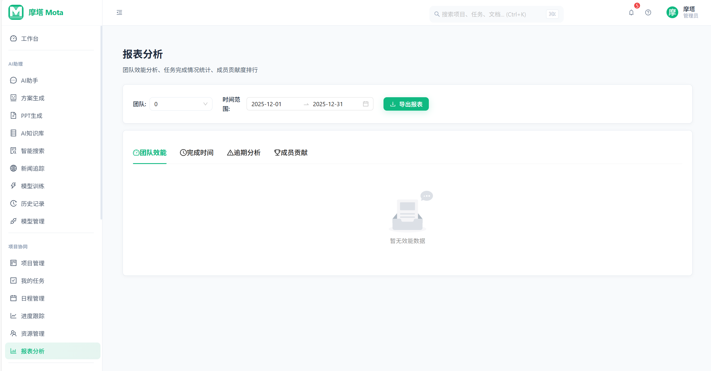

# 📚 摩塔 Mota - 项目文档中心

<div align="center">


**AI原生的企业级项目管理和团队协作平台**

[](https://reactjs.org/)
[](https://www.typescriptlang.org/)
[](https://spring.io/projects/spring-boot)
[](../LICENSE)

</div>

---

## 🎯 项目简介

**摩塔 Mota** 是一款面向企业的 AI 原生项目管理和团队协作平台，致力于通过人工智能技术重新定义团队协作方式。平台深度融合 AI 能力，提供智能任务分解、知识图谱构建、智能决策支持等创新功能，帮助企业实现知识资产化和数据驱动的高效协作。

### ✨ 核心差异化优势

| 特性 | 描述 |
|------|------|
| 🤖 **AI 驱动的智能协作** | 深度集成多种 AI 模型，提供智能任务分解、风险预警、进度预测等能力 |
| 📚 **企业知识资产化** | 基于 RAG 架构构建企业专属知识库，实现知识的沉淀、检索和复用 |
| 📊 **数据驱动的决策支持** | 多维度数据分析和可视化，为管理决策提供数据支撑 |
| 🔗 **全链路协作体验** | 从项目规划到交付的全流程数字化管理 |

---

## 📸 功能预览

> 💡 **提示**：截图待补充，请将截图放置在 [`images/`](./images/) 目录下

<table>
<tr>
<td align="center" width="50%">

### 🏠 工作台仪表盘



*项目概览、任务统计、团队动态一目了然*

</td>
<td align="center" width="50%">

### 📋 任务看板



*拖拽式任务管理，支持多种视图切换*

</td>
</tr>
<tr>
<td align="center" width="50%">

### 🤖 AI 智能助手



*智能任务分解、风险预警、效能分析*

</td>
<td align="center" width="50%">

### 📚 知识库管理



*文档管理、知识图谱、智能问答*

</td>
</tr>
<tr>
<td align="center" width="50%">

### 📊 甘特图视图



*项目进度可视化，依赖关系清晰展示*

</td>
<td align="center" width="50%">

### 📈 数据分析



*多维度数据分析，支持决策制定*

</td>
</tr>
</table>

---

## 📖 文档概述

本文档中心包含摩塔平台的完整产品设计、技术架构和开发规范文档，共计 **17 份** 核心文档，涵盖产品设计、技术方案、UI 规范等多个维度。

### 📊 文档统计

| 分类 | 数量 | 说明 |
|------|------|------|
| 产品文档 | 5 份 | 产品介绍、架构、核心价值、功能清单等 |
| 技术方案 | 5 份 | AI 方案、技术架构、重构报告等 |
| UI 设计规范 | 6 份 | 完整的设计系统和组件规范 |
| 功能设计 | 1 份 | 核心功能概览 |

---

## 📂 文档结构

### 🏢 产品文档

产品定位、架构设计和核心价值相关文档。

| 文档 | 描述 | 适用人群 |
|------|------|----------|
| [01-产品详细介绍](./01-产品详细介绍.md) | 产品完整介绍和功能说明 | 产品经理、业务人员 |
| [02-产品架构](./02-产品架构.md) | 产品整体架构设计 | 产品经理、架构师 |
| [03-产品核心价值](./03-产品核心价值.md) | 产品价值主张和竞争优势 | 全员 |
| [产品核心功能概览](./产品核心功能概览.md) | 五大核心模块介绍（项目管理、任务管理、团队协作、知识库、AI智能） | 全员 |
| [功能清单](./功能清单.md) | 完整功能列表（203项功能） | 产品经理、开发人员 |

### 🔧 技术方案

技术架构、AI 方案和开发相关文档。

| 文档 | 描述 | 适用人群 |
|------|------|----------|
| [06-技术方案](./06-技术方案.md) | 整体技术架构和选型 | 架构师、开发人员 |
| [企业专属AI大脑方案](./企业专属AI大脑方案.md) | RAG 架构与知识管理系统设计 | 架构师、AI 工程师 |
| [AI驱动的团队协作优化方案](./AI驱动的团队协作优化方案.md) | AI 在团队协作各阶段的应用 | 产品经理、开发人员 |
| [AI智能新闻推送功能设计](./AI智能新闻推送功能设计.md) | 智能新闻推送系统设计 | 产品经理、开发人员 |
| [重构完成报告](./重构完成报告.md) | 前端代码重构记录和总结 | 开发人员 |

### 🎨 UI 设计规范

完整的设计系统和组件规范文档。

| 文档 | 描述 | 适用人群 |
|------|------|----------|
| [UI设计规范索引](./UI设计规范/README.md) | 设计规范总览和导航 | 设计师、前端开发 |
| [01-UI设计方案](./UI设计规范/01-UI设计方案.md) | 整体 UI 设计系统 | 设计师、前端开发 |
| [02-组件库规范](./UI设计规范/02-组件库规范.md) | 详细组件库规范 | 前端开发 |
| [03-页面设计规范](./UI设计规范/03-页面设计规范.md) | 页面级设计规范 | 设计师、前端开发 |
| [04-交互设计规范](./UI设计规范/04-交互设计规范.md) | 交互与动效规范 | 设计师、前端开发 |
| [05-设计理念](./UI设计规范/05-设计理念.md) | 设计理念与价值观 | 全员 |

### 📋 其他文档

| 文档 | 描述 | 适用人群 |
|------|------|----------|
| [05-产品UI方案](./05-产品UI方案.md) | 产品 UI 整体方案 | 产品经理、设计师 |

---

## 🚀 快速导航

### 按使用场景

<table>
<tr>
<td width="50%">

#### 🆕 新人入门
1. [产品核心功能概览](./产品核心功能概览.md)
2. [03-产品核心价值](./03-产品核心价值.md)
3. [01-产品详细介绍](./01-产品详细介绍.md)

</td>
<td width="50%">

#### 💻 开发人员
1. [06-技术方案](./06-技术方案.md)
2. [02-组件库规范](./UI设计规范/02-组件库规范.md)
3. [功能清单](./功能清单.md)

</td>
</tr>
<tr>
<td width="50%">

#### 🎨 设计师
1. [05-设计理念](./UI设计规范/05-设计理念.md)
2. [01-UI设计方案](./UI设计规范/01-UI设计方案.md)
3. [04-交互设计规范](./UI设计规范/04-交互设计规范.md)

</td>
<td width="50%">

#### 🤖 AI 工程师
1. [企业专属AI大脑方案](./企业专属AI大脑方案.md)
2. [AI驱动的团队协作优化方案](./AI驱动的团队协作优化方案.md)
3. [AI智能新闻推送功能设计](./AI智能新闻推送功能设计.md)

</td>
</tr>
</table>

---

## 🛠️ 技术栈

### 前端技术

```
React 18 + TypeScript + Ant Design + Zustand
├── 框架：React 18.x
├── 语言：TypeScript 5.x
├── UI 组件库：Ant Design 5.x
├── 状态管理：Zustand
├── 构建工具：Vite
└── 样式方案：CSS Modules
```

### 后端技术

```
Spring Boot 3.x + Java 17
├── 框架：Spring Boot 3.x
├── 语言：Java 17
├── 安全：Spring Security + JWT
├── ORM：MyBatis Plus
└── API 文档：Swagger/OpenAPI
```

### 数据存储

```
多数据库架构
├── 关系型数据库：MySQL 8.x
├── 缓存：Redis 7.x
├── 向量数据库：Milvus
├── 图数据库：Neo4j
└── 搜索引擎：Elasticsearch 8.x
```

### AI 能力

```
RAG 架构 + 多模型支持
├── 架构：RAG (Retrieval-Augmented Generation)
├── 向量化：多种 Embedding 模型
└── LLM 支持：
    ├── OpenAI GPT-4/GPT-4o
    ├── Anthropic Claude
    ├── 阿里云通义千问
    └── 百度文心一言
```

---

## 🎯 功能模块概览

摩塔平台包含 **203 项** 功能，AI 能力深度集成于各核心模块：

```
摩塔 Mota
├── 📁 项目管理（AI增强）
│   ├── 项目创建与模板
│   ├── 进度追踪与里程碑
│   ├── 🤖 AI智能规划与风险预警
│   └── 🤖 AI项目健康度分析
├── ✅ 任务管理（AI增强）
│   ├── 任务分解与依赖
│   ├── 看板与甘特图
│   ├── 🤖 AI智能任务分解
│   └── 🤖 AI工时估算与优先级建议
├── 👥 团队协作（AI增强）
│   ├── 实时协作与评论
│   ├── 通知与日历
│   ├── 🤖 AI智能任务分配
│   └── 🤖 AI工作负载均衡
├── 📚 知识库（AI增强）
│   ├── 文档管理与版本控制
│   ├── 全文搜索
│   ├── 🤖 AI知识图谱构建
│   └── 🤖 AI智能问答（RAG）
└── 🤖 AI智能中枢
    ├── 企业专属AI大脑
    ├── 多模型支持
    ├── 智能新闻推送
    └── 效能分析与洞察
```

---

## 📝 更新日志

| 日期 | 版本 | 更新内容 |
|------|------|----------|
| 2024-12-31 | v1.0.0 | 初始化文档中心，整理所有产品和技术文档 |

---

## 🤝 贡献指南

欢迎为摩塔项目文档做出贡献！

1. **文档规范**：请遵循现有文档的格式和风格
2. **命名规范**：使用有意义的文件名，中文文档使用中文命名
3. **链接检查**：确保所有内部链接有效
4. **图片资源**：图片请放置在对应目录的 `assets` 文件夹中

---


<div align="center">

**摩塔 Mota** - 让团队协作更智能

Copyright © 2024 Mota Team. All rights reserved.

</div>