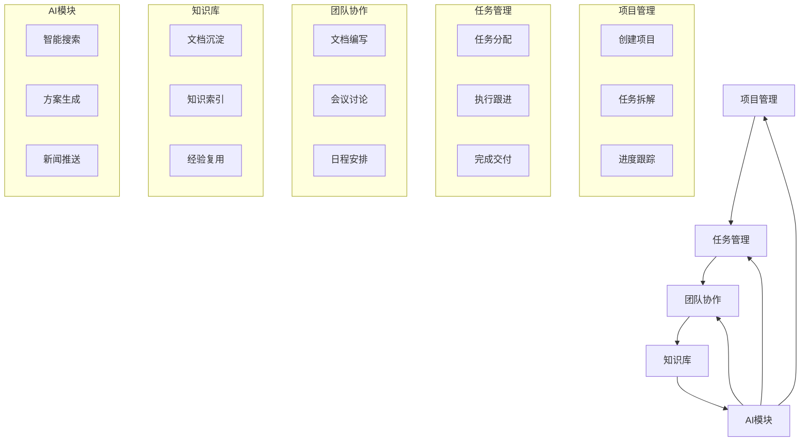

# 魔塔 Mota - 产品核心功能概览

## 📋 产品定位

**魔塔（Mota）** —— 一款为现代团队打造的AI原生项目管理平台。

我们相信，项目管理的核心不在于功能的堆砌，而在于如何让团队的每一个决策都更智能、每一份经验都能沉淀复用。魔塔通过深度集成大语言模型，让AI成为项目管理的智能助手，让企业知识成为团队成长的加速器。

### 核心价值主张

**为项目经理**
- 🎯 **专注本质** - 摒弃冗余功能，聚焦项目管理核心价值，让您专注于真正重要的事
- 🤖 **AI智能助手** - 从方案撰写到进度分析，AI随时为您提供专业建议，让决策更高效

**为团队成员**
- 📚 **知识即资产** - 自动沉淀项目经验，构建企业知识图谱，让新人快速上手，让经验持续复用
- 💡 **智能工作流** - AI推送相关资讯、智能搜索历史方案，减少重复劳动，提升工作效率

**为企业管理者**
- 📈 **数据驱动决策** - 项目数据实时可视化，团队效能一目了然，管理决策有据可依
- 🔄 **持续进化** - 企业知识不断积累，AI能力持续提升，组织智慧螺旋上升

---

## 🎯 五大核心模块

### 1️⃣ 项目管理模块

**功能清单**
- ✅ 项目看板（Kanban视图、列表视图、甘特图）
- ✅ 任务管理（创建、分配、依赖、优先级）
- ✅ 进度跟踪（燃尽图、里程碑、进度报表）
- ✅ 资源管理（人员工作量、工时统计）
- ✅ 数据分析（项目仪表盘、团队效能分析）

**核心特点**
- 支持敏捷（Scrum/Kanban）和瀑布流程
- 任务依赖关系自动计算
- 实时进度同步和可视化
- 自定义工作流和字段

---

### 2️⃣ 任务管理模块

**功能清单**
- ✅ 任务CRUD（创建、编辑、删除）
- ✅ 任务分配和责任人管理
- ✅ 优先级管理（高/中/低/紧急）
- ✅ 子任务和检查清单
- ✅ 任务标签和分类
- ✅ 任务评论和附件
- ✅ 时间估算和实际工时记录

**核心特点**
- 任务状态自定义流转
- 任务依赖关系可视化
- 逾期任务自动提醒
- 任务模板快速创建

---

### 3️⃣ 团队协作模块

> **注意：不包含即时通讯和会议管理功能**

#### 3.1 文档协作
- ✅ Markdown/富文本编辑器
- ✅ 实时多人协作编辑
- ✅ 文档评论和批注
- ✅ 版本历史和回滚
- ✅ 文档模板库
- ✅ 文档权限控制（查看/编辑/管理）
- ✅ 文档导出（PDF/Word/Markdown）

#### 3.2 日程管理
- ✅ 个人日历
- ✅ 团队日历
- ✅ 项目日历（里程碑、截止日期）
- ✅ 任务截止日期提醒
- ✅ 循环事件
- ✅ 日历视图（日/周/月）

#### 3.3 通知中心
- ✅ 站内通知（任务分配、截止提醒、@提醒）
- ✅ 邮件通知
- ✅ 移动推送
- ✅ 通知聚合和智能分类
- ✅ 免打扰模式
- ✅ 通知订阅管理

---

### 4️⃣ 知识库模块

**功能清单**
- ✅ 文档上传（支持PDF、Word、Excel、PPT、图片、视频）
- ✅ 文档自动解析和内容提取
- ✅ OCR文字识别（图片/PDF）
- ✅ 知识分类和标签
- ✅ 知识图谱构建
- ✅ 版本控制
- ✅ 权限管理（查看/编辑/下载）
- ✅ 全文检索和语义搜索

**核心特点**
- 自动提取文档关键信息
- 构建实体关系知识图谱
- 智能推荐相关知识
- 知识使用统计和分析

---

### 5️⃣ AI智能模块

#### 5.1 AI知识库
**核心能力**
- ✅ 自动学习企业业务知识
- ✅ 文档向量化和语义索引
- ✅ 智能语义搜索
- ✅ 知识关联推荐

**技术实现**
- 向量数据库（Milvus）
- 文本向量化（OpenAI Embeddings）
- RAG检索增强生成
- 知识图谱可视化

#### 5.2 智能新闻推送
**核心能力**
- ✅ 自动识别企业行业和业务领域
- ✅ 精准推送行业新闻和政策
- ✅ 个性化推荐
- ✅ 新闻收藏和管理

**推送策略**
- 基于企业知识库构建业务画像
- 新闻相关性智能匹配
- 推送时机优化
- 阅读反馈学习

#### 5.3 AI方案生成
**核心能力**
- ✅ 智能理解用户需求
- ✅ 调用企业知识库
- ✅ 生成结构化方案
- ✅ 多轮对话优化
- ✅ 方案质量评估

**支持的方案类型**
- 项目方案
- 营销方案
- 技术方案
- 商业计划
- 工作报告

**技术实现**
- Prompt模板管理
- RAG知识检索
- 多模型支持（GPT-4/Claude/通义千问）
- 质量自动评分

#### 5.4 AI助手
**核心能力**
- ✅ 智能问答
- ✅ 会议纪要总结
- ✅ 文档摘要生成
- ✅ 任务建议
- ✅ 数据分析辅助

---

## 🔄 模块间协作流程

---

## 💡 与竞品的差异化

| 对比项 | 传统项目管理工具 | 魔塔 Mota |
|--------|----------------|-----------|
| **IM功能** | 大多集成IM | ❌ 不做IM，专注项目管理 |
| **知识管理** | 简单文件存储 | ✅ 智能知识图谱 |
| **AI能力** | 无或浅层集成 | ✅ 深度AI原生集成 |
| **方案生成** | 无 | ✅ AI自动生成方案 |
| **新闻推送** | 无 | ✅ 智能行业资讯推送 |
| **学习成本** | 较高 | ✅ AI辅助降低 |
| **定位** | 大而全 | ✅ 专而精 |

---

## 🎯 产品策略

### 聚焦策略
**不做的事情**
- ❌ 不做即时通讯（IM）
- ❌ 不做视频会议（集成第三方）
- ❌ 不做OA审批
- ❌ 不做CRM
- ❌ 不做财务管理

**专注做好的事情**
- ✅ 项目和任务管理
- ✅ 知识沉淀和复用
- ✅ AI辅助决策
- ✅ 文档协作
- ✅ 团队效能提升

### 差异化优势
1. **AI原生设计** - 从产品设计之初就将AI作为核心能力
2. **知识驱动** - 企业知识自动学习和智能应用
3. **专注项目** - 不做IM，专注做好项目管理
4. **轻量协作** - 提供必要的协作功能，不过度集成

---

## 📊 典型使用场景

### 场景1: 新项目启动
1. 创建项目，上传相关资料到知识库
2. AI分析资料，生成项目框架建议
3. 使用AI生成项目方案初稿
4. 团队协作完善方案（文档协作）
5. 拆解任务，分配责任人
6. 安排启动会议，记录纪要

### 场景2: 日常项目管理
1. 查看项目看板，了解进度
2. 更新任务状态
3. AI推送相关行业资讯
4. 文档协作编写技术方案
5. 会议讨论解决方案
6. 知识库搜索参考案例

### 场景3: 知识沉淀与复用
1. 项目完成后，整理项目文档
2. 上传到知识库
3. AI自动提取关键信息
4. 构建知识图谱
5. 后续项目可以智能搜索历史经验
6. AI基于历史知识生成新方案

---

## 🚀 核心技术栈

### 前端
- React 18 + TypeScript
- Redux Toolkit
- Ant Design

### 后端
- Java: Spring Boot 3.x (项目管理服务)
- Python: FastAPI (AI服务)
- Node.js: NestJS (协作服务)

### 数据库
- PostgreSQL (关系型数据)
- MongoDB (文档数据)
- Redis (缓存)
- Elasticsearch (全文检索)
- Milvus (向量数据库)

### AI技术
- OpenAI GPT-4 / GPT-3.5
- Anthropic Claude
- 阿里云通义千问
- LangChain / LlamaIndex

---

## 📈 商业模式

### 目标客户
- **初创团队**（10-50人）- 需要高效项目管理
- **中小企业**（50-500人）- 需要知识沉淀和AI辅助
- **大型企业**（500+人）- 需要私有化部署和定制

### 定价策略
| 版本 | 价格 | 适用对象 | 核心功能 |
|------|------|---------|---------|
| 免费版 | ¥0 | 10人以下 | 基础项目管理、有限AI调用 |
| 专业版 | ¥89/人/月 | 中小企业 | 完整功能、AI无限调用 |
| 企业版 | ¥179/人/月 | 大型企业 | 高级功能、专属支持 |
| 私有化 | 定制 | 政企客户 | 私有部署、定制开发 |

---

## 🎯 竞争优势总结

1. **专注定位** - 不做IM，专注项目管理和知识协作
2. **AI原生** - 深度集成AI，不是简单功能叠加
3. **知识驱动** - 企业知识自动学习和智能应用
4. **轻量高效** - 功能精简但强大，学习成本低
5. **开放集成** - 可与现有IM工具（钉钉、企微、飞书）集成

---

**让AI赋能项目管理，让知识驱动团队协作！** 🚀
