# AI驱动的项目管理与团队协作平台 - 产品设计文档

## 文档信息
- **产品名称**: 摩塔 Mota
- **版本**: v2.0
- **创建日期**: 2025-12-22
- **更新日期**: 2025-12-25
- **目标发布**: 6个月完整版
- **文档状态**: 设计阶段（已优化）

---

## 目录
1. [产品概述](#1-产品概述)
2. [产品定位与价值](#2-产品定位与价值)
3. [产品策略](#3-产品策略)
4. [目标用户](#4-目标用户)
5. [核心功能模块](#5-核心功能模块)
6. [产品架构](#6-产品架构)
7. [技术架构](#7-技术架构)
8. [数据架构](#8-数据架构)
9. [AI模块设计](#9-ai模块设计)
10. [用户界面设计](#10-用户界面设计)
11. [开发路线图](#11-开发路线图)
12. [部署方案](#12-部署方案)
13. [安全与合规](#13-安全与合规)

---

## 1. 产品概述

### 1.1 产品愿景
打造一款以AI为核心驱动力的新一代项目管理与团队协作平台，通过智能化知识管理、自动化信息推送和AI辅助决策，帮助企业提升协作效率和决策质量。

**我们相信**：项目管理的核心不在于功能的堆砌，而在于如何让团队的每一个决策都更智能、每一份经验都能沉淀复用。魔塔通过深度集成大语言模型，让AI成为项目管理的智能助手，让企业知识成为团队成长的加速器。

### 1.2 产品定位
- **市场定位**: 中高端企业级协作平台
- **技术定位**: AI原生、云原生、微服务架构
- **服务模式**: SaaS + 私有化部署双模式
- **差异化优势**: AI深度集成的智能协作平台，专注项目管理核心价值

### 1.3 核心价值主张

**为项目经理**
- 🎯 **专注本质** - 摒弃冗余功能，聚焦项目管理核心价值，让您专注于真正重要的事
- 🤖 **AI智能助手** - 从方案撰写到进度分析，AI随时为您提供专业建议，让决策更高效

**为团队成员**
- 📚 **知识即资产** - 自动沉淀项目经验，构建企业知识图谱，让新人快速上手，让经验持续复用
- 💡 **智能工作流** - AI推送相关资讯、智能搜索历史方案，减少重复劳动，提升工作效率

**为企业管理者**
- 📈 **数据驱动决策** - 项目数据实时可视化，团队效能一目了然，管理决策有据可依
- 🔄 **持续进化** - 企业知识不断积累，AI能力持续提升，组织智慧螺旋上升

### 1.4 核心特性
1. **AI知识库**: 自动学习企业业务知识，构建智能知识图谱，支持可视化展示
2. **智能新闻推送**: 基于企业业务精准推送行业资讯和政策
3. **AI方案生成**: 根据企业知识库智能生成各类业务方案
4. **灵活项目管理**: 支持敏捷、瀑布等多种项目管理模式，多视图切换
5. **实时文档协作**: 多人实时协作编辑，版本历史追踪
6. **日程管理**: 个人/团队/项目日历，任务截止日期提醒
7. **多模型支持**: 支持OpenAI、Claude、国产大模型等多种AI引擎

---

## 2. 产品定位与价值

### 2.1 市场分析

#### 2.1.1 目标市场
- **企业规模**: 全覆盖（10-10000+人）
  - 初创团队（10-50人）
  - 中小企业（50-500人）
  - 大型企业（500+人）
- **行业覆盖**: 不限行业，重点关注
  - 科技/互联网
  - 咨询/专业服务
  - 制造业
  - 金融/保险
  - 教育/培训

#### 2.1.2 竞品分析
| 竞品 | 优势 | 劣势 | 我们的差异化 |
|------|------|------|--------------|
| Jira/Confluence | 项目管理功能强大 | AI能力弱，学习曲线陡峭 | AI原生设计，智能辅助 |
| 飞书/钉钉 | 协作功能完善，用户基数大 | AI深度不足，方案生成弱 | 深度AI集成，知识驱动 |
| Notion | 灵活性强，文档协作好 | 项目管理弱，无AI方案 | 项目管理+AI方案输出 |
| Monday.com | 可视化好，易用性强 | 国际化产品，AI本土化弱 | 多模型支持，本土化AI |

### 2.2 用户价值主张

#### 2.2.1 对企业的价值
- **提升效率**: 通过AI自动化减少30-50%的重复性工作
- **知识沉淀**: 将企业隐性知识显性化、结构化
- **智能决策**: AI辅助生成方案，提升决策质量
- **信息敏感**: 实时掌握行业动态和政策变化
- **降本增效**: 整合多个工具，降低IT成本

#### 2.2.2 对团队的价值
- **协作便捷**: 一站式协作平台，减少工具切换
- **AI助手**: 智能辅助完成方案撰写、信息检索
- **知识共享**: 快速获取企业知识和最佳实践
- **工作透明**: 项目进度可视化，责任清晰

---

## 3. 产品策略

### 3.1 聚焦策略

#### 3.1.1 不做的事情（明确边界）
| 功能领域 | 决策 | 原因 |
|---------|------|------|
| 即时通讯（IM） | ❌ 不做 | 市场已有成熟产品（钉钉、企微、飞书），专注项目管理 |
| 视频会议 | ❌ 不做 | 集成第三方服务（腾讯会议、Zoom等） |
| OA审批 | ❌ 不做 | 非核心功能，可通过集成实现 |
| CRM客户管理 | ❌ 不做 | 专业领域，保持产品聚焦 |
| 财务管理 | ❌ 不做 | 专业领域，保持产品聚焦 |
| 人事管理 | ❌ 不做 | 专业领域，保持产品聚焦 |

#### 3.1.2 专注做好的事情
| 功能领域 | 决策 | 优先级 |
|---------|------|--------|
| 项目和任务管理 | ✅ 核心功能 | P0 |
| 知识沉淀和复用 | ✅ 核心功能 | P0 |
| AI辅助决策 | ✅ 核心功能 | P0 |
| 文档协作 | ✅ 重要功能 | P1 |
| 日程管理 | ✅ 重要功能 | P1 |
| 团队效能分析 | ✅ 重要功能 | P1 |
| 知识图谱可视化 | ✅ 差异化功能 | P1 |

### 3.2 差异化优势

| 对比项 | 传统项目管理工具 | 魔塔 Mota |
|--------|----------------|-----------|
| **IM功能** | 大多集成IM | ❌ 不做IM，专注项目管理 |
| **知识管理** | 简单文件存储 | ✅ 智能知识图谱 |
| **AI能力** | 无或浅层集成 | ✅ 深度AI原生集成 |
| **方案生成** | 无 | ✅ AI自动生成方案 |
| **新闻推送** | 无 | ✅ 智能行业资讯推送 |
| **学习成本** | 较高 | ✅ AI辅助降低 |
| **定位** | 大而全 | ✅ 专而精 |

### 3.3 集成策略

#### 3.3.1 第三方集成
- **即时通讯**: 钉钉、企业微信、飞书消息推送
- **视频会议**: 腾讯会议、Zoom、飞书会议
- **云存储**: 阿里云OSS、腾讯云COS、AWS S3
- **单点登录**: 企业微信SSO、钉钉SSO、LDAP

#### 3.3.2 开放API
- 提供完整的REST API
- 支持Webhook事件通知
- 提供SDK（JavaScript、Python、Java）

---

## 4. 目标用户

### 3.1 用户画像

#### 3.1.1 决策层用户
- **角色**: CEO、CTO、事业部总监
- **痛点**: 
  - 难以及时掌握行业动态和政策变化
  - 决策缺乏数据支持和智能建议
  - 企业知识分散，难以复用
- **需求**:
  - 智能新闻推送和行业洞察
  - AI辅助决策和方案生成
  - 全局项目监控和数据看板

#### 3.1.2 管理层用户
- **角色**: 项目经理、部门主管、团队Leader
- **痛点**:
  - 项目管理工具复杂，学习成本高
  - 方案撰写耗时，缺乏模板和参考
  - 团队协作效率低，信息同步难
- **需求**:
  - 易用的项目管理工具
  - AI辅助方案生成和优化
  - 高效的团队协作功能

#### 3.1.3 执行层用户
- **角色**: 开发工程师、设计师、市场专员、业务人员
- **痛点**:
  - 需要在多个工具间切换
  - 难以快速找到所需信息和知识
  - 重复性工作多，效率低
- **需求**:
  - 统一的协作平台
  - 便捷的知识检索
  - AI辅助完成日常任务

### 3.2 用户使用场景

#### 场景1: 新项目启动
1. 项目经理创建项目，上传相关业务资料到知识库
2. AI自动分析资料，生成项目框架建议
3. 团队成员协作完善项目计划
4. AI根据企业知识库生成项目方案初稿
5. 系统推送相关行业案例和最佳实践

#### 场景2: 日常协作
1. 团队成员在项目看板中更新任务状态
2. 即时通讯进行快速沟通
3. 文档协作共同编辑方案
4. AI实时推送相关行业新闻和政策
5. 会议管理记录和跟进行动项

#### 场景3: 方案输出
1. 用户输入方案需求（如"生成2025年Q1市场推广方案"）
2. AI调用知识库中的企业信息、历史方案、行业数据
3. 生成结构化方案初稿
4. 用户编辑优化
5. 保存到知识库供未来参考

#### 场景4: 知识管理
1. 企业定期上传各类业务资料（合同、方案、报告等）
2. AI自动提取关键信息，构建知识图谱
3. 员工通过智能搜索快速找到所需知识
4. AI基于访问频率和重要性推荐相关知识
5. 系统生成知识使用报告和优化建议

---

## 5. 核心功能模块

### 5.1 功能架构总览

```mermaid
graph TB
    A[魔塔平台] --> B[项目管理模块]
    A --> C[团队协作模块]
    A --> D[AI智能模块]
    A --> E[知识管理模块]
    A --> F[系统管理模块]
    
    B --> B1[项目看板-多视图]
    B --> B2[任务管理]
    B --> B3[进度跟踪]
    B --> B4[资源管理]
    B --> B5[报表分析]
    B --> B6[甘特图]
    B --> B7[燃尽图]
    
    C --> C1[文档协作]
    C --> C2[日程管理]
    C --> C3[通知中心]
    C --> C4[模板库]
    
    D --> D1[AI知识库]
    D --> D2[智能新闻推送]
    D --> D3[AI方案生成]
    D --> D4[智能搜索]
    D --> D5[AI助手]
    D --> D6[知识图谱可视化]
    
    E --> E1[文档上传]
    E --> E2[知识分类]
    E --> E3[知识图谱]
    E --> E4[版本控制]
    E --> E5[权限管理]
    E --> E6[模板管理]
    
    F --> F1[用户管理]
    F --> F2[角色权限]
    F --> F3[组织架构]
    F --> F4[系统配置]
    F --> F5[审计日志]
```



### 5.2 项目管理模块

#### 5.2.1 功能清单

##### 项目看板（多视图支持）
| 视图类型 | 功能描述 | 适用场景 |
|---------|---------|---------|
| 看板视图（Kanban） | 拖拽式任务卡片，按状态分列展示 | 敏捷开发、日常任务管理 |
| 列表视图 | 表格形式展示，支持排序筛选 | 批量操作、数据导出 |
| 甘特图视图 | 时间轴展示任务，显示依赖关系 | 项目规划、进度跟踪 |
| 日历视图 | 按日期展示任务和里程碑 | 日程安排、截止日期管理 |
| 时间线视图 | 按时间顺序展示项目活动 | 项目回顾、历史追溯 |

- **视图切换**: 一键切换不同视图，数据实时同步
- **自定义工作流状态**: 支持自定义任务状态和流转规则
- **拖拽式操作**: 支持任务拖拽排序和状态变更
- **视图保存**: 支持保存个人视图配置

##### 任务管理
- **基础功能**
  - 任务创建/编辑/删除
  - 任务分配和责任人
  - 优先级管理（紧急/高/中/低）
  - 任务标签和分类
  - 任务评论和附件
  - 时间估算和实际工时

- **子任务和检查清单** ⭐新增
  - 支持多级子任务
  - 检查清单（Checklist）
  - 子任务进度自动汇总
  - 检查项完成状态追踪

- **任务依赖关系** ⭐增强
  - 依赖类型：完成-开始（FS）、开始-开始（SS）、完成-完成（FF）、开始-完成（SF）
  - 依赖关系可视化（甘特图中显示连线）
  - 依赖冲突检测和提醒
  - 关键路径自动计算

- **任务模板** ⭐新增
  - 创建任务模板
  - 模板分类管理
  - 一键从模板创建任务
  - 团队共享模板

##### 进度跟踪
- **项目进度**
  - 项目进度百分比（自动计算）
  - 里程碑管理
  - 逾期任务提醒
  - 进度报告自动生成

- **燃尽图/燃起图** ⭐增强
  - 实时燃尽图展示
  - 理想进度线对比
  - 速度趋势分析
  - Sprint燃尽图
  - 项目整体燃尽图

- **进度预测**
  - AI预测项目完成时间
  - 风险预警提示
  - 进度偏差分析

##### 资源管理
- **人员工作量统计**
  - 个人任务负载可视化
  - 团队工作量分布图
  - 工作量预警（过载/空闲）

- **资源分配可视化** ⭐增强
  - 资源日历视图
  - 资源利用率图表
  - 跨项目资源冲突检测

- **工时管理**
  - 工时记录
  - 工时审批流程
  - 工时统计报表

##### 报表分析
- **项目仪表盘**
  - 项目总览卡片
  - 任务状态分布
  - 进度趋势图
  - 团队效能指标

- **团队效能分析**
  - 任务完成率
  - 平均完成时间
  - 逾期率统计
  - 成员贡献度

- **自定义报表**
  - 拖拽式报表设计
  - 多维度数据分析
  - 定时报表推送
  - 数据导出（Excel、PDF）

#### 5.2.2 技术要点
- **实时协作**: WebSocket实现多人实时编辑
- **数据同步**: 乐观锁机制防止冲突
- **性能优化**: 虚拟滚动处理大量任务
- **离线支持**: Service Worker实现离线可用
- **甘特图渲染**: 使用Canvas/SVG高性能渲染
- **依赖计算**: 拓扑排序算法计算关键路径

### 5.3 团队协作模块

> **注意：不包含即时通讯和会议管理功能**（参见产品策略章节）

#### 5.3.1 文档协作 ⭐增强

##### 文档编辑
- **编辑器支持**
  - Markdown编辑器（支持GFM语法）
  - 富文本编辑器（所见即所得）
  - 代码编辑器（语法高亮）

- **实时多人协作** ⭐核心功能
  - 多人同时编辑
  - 光标位置实时显示
  - 编辑冲突自动合并
  - 协作者在线状态

- **评论和批注**
  - 行内评论
  - 区域批注
  - 评论回复和讨论
  - @提醒协作者

- **版本历史**
  - 自动版本保存
  - 版本对比（Diff视图）
  - 一键回滚
  - 变更记录追踪

##### 文档管理
- **组织结构**
  - 文件夹层级管理
  - 文档标签
  - 收藏夹
  - 最近访问

- **文档模板库** ⭐新增
  - 系统预置模板（项目计划、会议纪要、技术方案等）
  - 自定义模板创建
  - 模板分类管理
  - 团队共享模板

- **权限控制**
  - 查看权限
  - 编辑权限
  - 管理权限
  - 下载权限

- **导出功能**
  - 导出为PDF
  - 导出为Word
  - 导出为Markdown
  - 导出为HTML

##### 支持格式
| 格式类型 | 支持操作 | 说明 |
|---------|---------|------|
| Markdown | 编辑/预览 | 原生支持 |
| 富文本 | 编辑/预览 | 所见即所得 |
| Word | 预览/导入/导出 | 支持.docx格式 |
| Excel | 预览/导入 | 支持.xlsx格式 |
| PPT | 预览 | 支持.pptx格式 |
| PDF | 预览 | 支持批注 |
| 代码文件 | 编辑/预览 | 语法高亮 |
| 思维导图 | 编辑/预览 | 原生支持 |

#### 5.3.2 日程管理 ⭐增强

##### 日历功能
- **多日历支持**
  - 个人日历：个人事项和提醒
  - 团队日历：团队共享事件
  - 项目日历：项目里程碑和截止日期
  - 任务日历：任务截止日期自动同步

- **日历视图**
  - 日视图：按小时展示
  - 周视图：一周概览
  - 月视图：月度规划
  - 议程视图：列表形式

- **事件管理**
  - 创建/编辑/删除事件
  - 循环事件（每日/每周/每月/自定义）
  - 事件提醒（提前5分钟/15分钟/1小时/1天）
  - 事件颜色标记

- **日历集成**
  - 任务截止日期自动同步
  - 里程碑自动显示
  - 日历订阅（iCal格式）
  - 外部日历导入

#### 5.3.3 通知中心 ⭐增强

##### 通知类型
| 通知类型 | 触发条件 | 优先级 |
|---------|---------|--------|
| 任务分配 | 被分配新任务 | 高 |
| 截止提醒 | 任务即将到期 | 高 |
| @提醒 | 被@提及 | 高 |
| 评论回复 | 评论被回复 | 中 |
| 状态变更 | 关注的任务状态变化 | 中 |
| AI推送 | AI推荐新闻/建议 | 低 |
| 系统公告 | 系统通知 | 低 |

##### 通知方式
- **站内通知**
  - 实时推送
  - 通知中心聚合
  - 已读/未读状态

- **外部通知**
  - 邮件通知
  - 移动推送（App）
  - 企业微信/钉钉推送

##### 智能通知功能 ⭐新增
- **通知聚合**
  - 相似通知合并
  - 按项目/类型分组
  - 摘要式展示

- **智能分类**
  - AI自动分类通知优先级
  - 重要通知置顶
  - 低优先级通知折叠

- **免打扰模式**
  - 设置免打扰时段
  - 仅接收紧急通知
  - 通知静音

- **通知订阅管理**
  - 自定义订阅规则
  - 按项目/类型订阅
  - 取消订阅

### 5.4 AI智能模块

#### 5.4.1 AI知识库

**功能架构**

```mermaid
graph LR
    A[文档上传] --> B[文档解析]
    B --> C[内容提取]
    C --> D[向量化]
    D --> E[知识图谱]
    E --> F[智能检索]
    F --> G[知识图谱可视化]
    
    B --> B1[PDF解析]
    B --> B2[Word解析]
    B --> B3[Excel解析]
    B --> B4[PPT解析]
    B --> B5[图片OCR]
    B --> B6[视频转文字]
    
    E --> E1[实体识别]
    E --> E2[关系抽取]
    E --> E3[图谱构建]
    E --> E4[图谱可视化]
```


**核心功能**
- **文档处理**
  - 自动文档解析和内容提取
  - 支持格式：PDF、Word、Excel、PPT、图片、视频
  - OCR文字识别
  - 语音转文字
  - 表格结构化提取
  - 图表识别和理解

- **知识提取**
  - 关键信息提取（实体、关系、事件）
  - 自动摘要生成
  - 主题分类
  - 标签自动打标
  - 知识图谱构建
  - 语义关联分析

- **向量化存储**
  - 文本向量化（Embedding）
  - 向量数据库存储（Milvus/Pinecone）
  - 语义相似度检索
  - 混合检索（向量+关键词）
  - 分块策略优化

- **学习机制**
  - 增量学习
  - 知识更新和版本管理
  - 知识质量评分
  - 使用频率统计
  - 知识推荐优化

#### 5.4.2 知识图谱构建与可视化 ⭐新增

**知识图谱架构**
```mermaid
graph TB
    subgraph 数据层
        A1[文档数据]
        A2[项目数据]
        A3[任务数据]
        A4[用户数据]
    end
    
    subgraph 处理层
        B1[实体识别NER]
        B2[关系抽取RE]
        B3[属性提取]
        B4[知识融合]
    end
    
    subgraph 存储层
        C1[图数据库Neo4j]
        C2[向量数据库Milvus]
    end
    
    subgraph 应用层
        D1[知识导航]
        D2[关联推荐]
        D3[智能问答]
        D4[图谱可视化]
    end
    
    A1 & A2 & A3 & A4 --> B1 & B2 & B3
    B1 & B2 & B3 --> B4
    B4 --> C1 & C2
    C1 & C2 --> D1 & D2 & D3 & D4
```

**核心功能**
- **图谱构建**
  - 实体识别（人物、组织、项目、技术等）
  - 关系抽取（负责、参与、依赖、引用等）
  - 属性提取（时间、地点、状态等）
  - 知识融合（去重、合并、冲突解决）

- **图谱可视化** ⭐核心功能
  - 交互式图谱展示
  - 节点聚类和布局
  - 关系路径查询
  - 子图筛选和导出
  - 缩放和拖拽操作

- **图谱应用**
  - 知识导航：从一个知识点导航到相关知识
  - 关联推荐：推荐相关文档、项目、人员
  - 路径查询：查找两个实体之间的关系路径
  - 知识推理：基于图谱进行推理和预测
  - 智能问答：基于图谱回答复杂问题

**技术实现**
```python
# 知识图谱实体定义
class KnowledgeEntity:
    entity_types = [
        'PERSON',      # 人物
        'ORGANIZATION',# 组织
        'PROJECT',     # 项目
        'DOCUMENT',    # 文档
        'TECHNOLOGY',  # 技术
        'CONCEPT',     # 概念
        'EVENT',       # 事件
        'LOCATION'     # 地点
    ]

# 关系类型定义
class KnowledgeRelation:
    relation_types = [
        'CREATED_BY',    # 创建者
        'BELONGS_TO',    # 属于
        'RELATED_TO',    # 相关
        'DEPENDS_ON',    # 依赖
        'REFERENCES',    # 引用
        'PARTICIPATES',  # 参与
        'MANAGES',       # 管理
        'USES'           # 使用
    ]

# 图谱可视化配置
visualization_config = {
    'layout': 'force-directed',  # 力导向布局
    'node_size': 'degree',       # 节点大小基于度数
    'node_color': 'entity_type', # 节点颜色基于类型
    'edge_width': 'weight',      # 边宽度基于权重
    'clustering': True,          # 启用聚类
    'zoom_range': [0.1, 10]      # 缩放范围
}
```

#### 4.4.2 智能新闻推送

**功能流程**

```mermaid
graph TB
    A[企业知识库] --> B[业务理解]
    C[新闻数据源] --> D[新闻采集]
    B --> E[行业识别]
    D --> F[内容解析]
    E --> G[匹配算法]
    F --> G
    G --> H[相关性评分]
    H --> I[个性化推荐]
    I --> J[推送给用户]
```


**核心功能**
- **业务理解**
  - 自动识别企业行业类别
  - 提取企业关键业务领域
  - 分析企业关注重点
  - 构建业务知识画像
  - 动态调整理解模型

- **新闻采集**
  - 第三方新闻API接入
  - 多数据源整合
  - 实时新闻抓取
  - 政策文件监控
  - 行业报告收集
  - 去重和质量过滤

- **智能匹配**
  - 语义相似度匹配
  - 关键词匹配
  - 实体匹配
  - 主题匹配
  - 时效性加权
  - 重要性评分

- **个性化推送**
  - 用户角色差异化推送
  - 阅读习惯学习
  - 推送时间优化
  - 推送频率控制
  - 推送效果反馈循环

- **新闻管理**
  - 新闻收藏和标注
  - 新闻分类管理
  - 已读/未读状态
  - 新闻摘要生成
  - 相关新闻关联

#### 4.4.3 AI方案生成

**生成流程**

```mermaid
graph TB
    A[用户输入指令] --> B[意图识别]
    B --> C[需求解析]
    C --> D[知识检索]
    D --> E[上下文构建]
    E --> F[AI模型生成]
    F --> G[内容结构化]
    G --> H[质量检查]
    H --> I[方案输出]
    I --> J[用户反馈]
    J --> K[模型优化]
```


**核心功能**
- **指令理解**
  - 自然语言解析
  - 意图分类（项目方案/营销方案/技术方案等）
  - 关键要素提取（时间、目标、预算等）
  - 上下文关联
  - 模糊指令澄清

- **知识调用**
  - 企业知识库检索
  - 历史方案参考
  - 行业最佳实践
  - 模板库调用
  - 外部知识整合

- **方案生成**
  - 结构化内容生成
  - 章节自动编排
  - 数据表格生成
  - 图表建议
  - 参考文献引用
  - 多轮对话优化

- **质量保证**
  - 内容一致性检查
  - 逻辑完整性验证
  - 专业术语准确性
  - 格式规范检查
  - 抄袭检测

- **方案管理**
  - 方案版本管理
  - 方案模板化
  - 方案复用
  - 方案评价和优化
  - 导出多种格式（Word、PDF、PPT）

#### 4.4.4 智能搜索

**搜索架构**
- **搜索能力**
  - 全文检索
  - 语义搜索
  - 向量检索
  - 混合检索
  - 多模态搜索（文字+图片）
  - 跨语言搜索

- **搜索优化**
  - 搜索意图识别
  - 自动纠错
  - 智能补全
  - 相关搜索推荐
  - 搜索结果排序优化
  - 个性化搜索

- **搜索范围**
  - 知识库文档
  - 项目和任务
  - 新闻资讯
  - 团队成员
  - 全局搜索

#### 4.4.5 AI助手

**助手功能**
- **对话交互**
  - 自然语言问答
  - 任务指令执行
  - 工作建议
  - 快捷操作
  - 多轮对话
  - 上下文记忆

- **智能辅助**
  - 文档摘要生成
  - 翻译功能
  - 数据分析建议
  - 日程安排建议
  - 工作报告生成

- **学习能力**
  - 用户习惯学习
  - 个性化服务
  - 主动推荐
  - 效率提升建议

### 5.5 知识管理模块

#### 5.5.1 文档管理
- **上传和存储**
  - 拖拽上传
  - 批量上传
  - 大文件上传（分片）
  - 云存储集成
  - 文件预览
  - 缩略图生成

- **组织结构**
  - 文件夹层级管理
  - 标签系统
  - 分类体系
  - 智能分类建议
  - 收藏夹
  - 最近访问

- **版本控制**
  - 自动版本保存
  - 版本历史查看
  - 版本对比
  - 版本回滚
  - 变更记录

#### 5.5.2 权限管理
- **访问控制**
  - 文档级权限（查看/编辑/下载/删除）
  - 文件夹级权限继承
  - 角色权限模板
  - 临时权限授予
  - 权限审计

- **分享机制**
  - 内部分享
  - 外部链接分享
  - 密码保护
  - 有效期设置
  - 访问统计

#### 5.5.3 知识图谱
- **图谱构建**
  - 实体识别和提取
  - 关系抽取
  - 属性提取
  - 知识融合
  - 图谱可视化

- **图谱应用**
  - 知识导航
  - 关联推荐
  - 路径查询
  - 知识推理
  - 智能问答

#### 5.5.4 模板库 ⭐新增

##### 文档模板
| 模板类型 | 模板名称 | 说明 |
|---------|---------|------|
| 项目管理 | 项目计划书 | 标准项目计划模板 |
| 项目管理 | 项目周报 | 周进度汇报模板 |
| 项目管理 | 项目总结 | 项目复盘模板 |
| 技术文档 | 技术方案 | 技术设计文档模板 |
| 技术文档 | API文档 | 接口文档模板 |
| 技术文档 | 部署文档 | 部署指南模板 |
| 会议记录 | 会议纪要 | 标准会议纪要模板 |
| 会议记录 | 评审记录 | 评审会议模板 |
| 营销方案 | 营销计划 | 营销推广方案模板 |
| 营销方案 | 竞品分析 | 竞品分析报告模板 |

##### 任务模板
- **开发任务模板**: 需求分析→设计→开发→测试→上线
- **Bug修复模板**: 问题确认→原因分析→修复→验证
- **需求评审模板**: 需求收集→评审→确认→排期
- **发布任务模板**: 代码冻结→测试→预发布→正式发布

##### 模板管理
- 创建自定义模板
- 模板分类管理
- 模板版本控制
- 团队共享模板
- 模板使用统计

#### 5.5.5 知识使用统计 ⭐新增
- **访问统计**
  - 文档访问量
  - 热门文档排行
  - 访问趋势图

- **使用分析**
  - 知识复用率
  - 搜索热词分析
  - 知识缺口识别

- **推荐优化**
  - 基于使用频率推荐
  - 基于相关性推荐
  - 个性化推荐

### 5.6 系统管理模块

#### 4.6.1 用户管理
- 用户注册/登录（SSO单点登录）
- 用户信息管理
- 账号激活/禁用
- 密码策略
- 登录日志

#### 4.6.2 组织架构
- 部门管理
- 团队管理
- 岗位管理
- 人员调动
- 组织架构图

#### 4.6.3 角色权限
- 角色定义
- 权限配置
- 数据权限
- 功能权限
- RBAC模型

#### 4.6.4 系统配置
- AI模型配置（模型选择、参数调优）
- 新闻源配置
- 通知配置
- 外部集成配置
- 系统参数设置

#### 4.6.5 审计日志
- 操作日志记录
- 登录日志
- 数据变更日志
- 审计报告
- 合规性检查

---

## 6. 产品架构

### 5.1 整体架构

```mermaid
graph TB
    subgraph 客户端层
        A1[Web应用]
        A2[移动应用]
        A3[桌面应用]
    end
    
    subgraph 接入层
        B1[API网关]
        B2[负载均衡]
        B3[CDN]
    end
    
    subgraph 应用服务层
        C1[项目管理服务]
        C2[协作服务]
        C3[AI服务]
        C4[知识管理服务]
        C5[用户服务]
        C6[通知服务]
    end
    
    subgraph AI引擎层
        D1[OpenAI GPT]
        D2[Claude]
        D3[通义千问]
        D4[文心一言]
        D5[模型路由器]
    end
    
    subgraph 数据层
        E1[MySQL]
        E2[MongoDB]
        E3[Redis]
        E4[Elasticsearch]
        E5[MinIO]
        E6[向量数据库]
    end
    
    subgraph 基础设施层
        F1[容器编排Kubernetes]
        F2[消息队列RabbitMQ]
        F3[日志系统ELK]
        F4[监控Prometheus]
    end
    
    A1 & A2 & A3 --> B1
    B1 --> B2
    B2 --> C1 & C2 & C3 & C4 & C5 & C6
    C3 --> D5
    D5 --> D1 & D2 & D3 & D4
    C1 & C2 & C3 & C4 & C5 & C6 --> E1 & E2 & E3 & E4 & E5 & E6
    C1 & C2 & C3 & C4 & C5 & C6 --> F2
    F1 --> C1 & C2 & C3 & C4 & C5 & C6
```

### 5.2 微服务拆分

#### 5.2.1 核心服务
| 服务名称 | 职责 | 技术栈 |
|---------|------|--------|
| user-service | 用户认证、授权、管理 | Spring Boot, JWT |
| project-service | 项目、任务、看板管理 | Spring Boot, PostgreSQL |
| collaboration-service | 文档协作、日程管理 | Node.js, WebSocket |
| ai-service | AI模型调用、Prompt管理 | Python, FastAPI |
| knowledge-service | 知识库、文档管理 | Spring Boot, Elasticsearch |
| news-service | 新闻采集、推送 | Python, Celery |
| notification-service | 统一通知服务 | Node.js, RabbitMQ |
| file-service | 文件上传、存储、预览 | Spring Boot, MinIO |
| search-service | 全局搜索服务 | Python, Elasticsearch |
| analytics-service | 数据分析、报表 | Python, Pandas |

#### 5.2.2 服务间通信
- **同步通信**: REST API (HTTP/HTTPS)
- **异步通信**: 消息队列 (RabbitMQ/Kafka)
- **实时通信**: WebSocket
- **服务发现**: Consul/Eureka
- **配置中心**: Apollo/Nacos

---

## 7. 技术架构

### 6.1 技术选型

#### 6.1.1 前端技术栈
- **框架**: React 18 + TypeScript
- **状态管理**: Redux Toolkit + RTK Query
- **UI组件库**: Ant Design / Material-UI
- **图表库**: ECharts / Recharts
- **富文本编辑**: Quill / Slate.js
- **Markdown编辑**: MDEditor
- **实时协作**: Yjs / Automerge
- **构建工具**: Vite
- **移动端**: React Native

#### 6.1.2 后端技术栈
- **主框架**: 
  - Java: Spring Boot 3.x + Spring Cloud
  - Python: FastAPI / Django
  - Node.js: Express / NestJS
- **数据库**:
  - 关系型: PostgreSQL (主) / MySQL
  - 文档型: MongoDB
  - 缓存: Redis
  - 搜索: Elasticsearch
  - 向量: Milvus / Pinecone
- **消息队列**: RabbitMQ / Kafka
- **对象存储**: MinIO / AWS S3
- **API网关**: Kong / Traefik

#### 6.1.3 AI技术栈
- **大模型接入**:
  - OpenAI API (GPT-4, GPT-3.5)
  - Anthropic API (Claude)
  - 阿里云通义千问 API
  - 百度文心一言 API
- **向量化**:
  - OpenAI Embeddings
  - HuggingFace Embeddings
  - 本地Embedding模型
- **框架和工具**:
  - LangChain: AI应用开发框架
  - LlamaIndex: 知识检索框架
  - Haystack: NLP框架
  - Gradio: AI界面快速开发
- **向量数据库**:
  - Milvus (首选)
  - Pinecone (备选)
  - Weaviate (备选)

#### 6.1.4 DevOps
- **容器化**: Docker
- **编排**: Kubernetes
- **CI/CD**: GitLab CI / Jenkins
- **监控**: Prometheus + Grafana
- **日志**: ELK Stack (Elasticsearch, Logstash, Kibana)
- **链路追踪**: Jaeger / Zipkin
- **配置管理**: Apollo / Nacos

### 6.2 AI模型集成架构

```mermaid
graph TB
    subgraph 应用层
        A1[知识库] --> B1[AI服务]
        A2[新闻推送] --> B1
        A3[方案生成] --> B1
        A4[智能搜索] --> B1
    end
    
    subgraph AI服务层
        B1 --> C1[模型路由器]
        C1 --> C2{模型选择策略}
    end
    
    subgraph 模型层
        C2 -->|成本优先| D1[GPT-3.5-turbo]
        C2 -->|质量优先| D2[GPT-4]
        C2 -->|合规优先| D3[通义千问]
        C2 -->|特定场景| D4[Claude]
        C2 -->|备用| D5[文心一言]
    end
    
    subgraph 管理层
        E1[Prompt模板管理]
        E2[模型性能监控]
        E3[成本控制]
        E4[A/B测试]
    end
    
    B1 --> E1
    D1 & D2 & D3 & D4 & D5 --> E2
    E2 --> E3
    E2 --> E4
```

### 6.3 数据流架构

```mermaid
graph LR
    A[用户请求] --> B[API网关]
    B --> C[应用服务]
    C --> D{数据类型}
    D -->|结构化数据| E[PostgreSQL/MySQL]
    D -->|文档数据| F[MongoDB]
    D -->|缓存数据| G[Redis]
    D -->|搜索数据| H[Elasticsearch]
    D -->|向量数据| I[Milvus]
    D -->|文件数据| J[MinIO]
    
    C --> K[消息队列]
    K --> L[异步处理]
    L --> M[AI处理]
    L --> N[通知推送]
    L --> O[数据分析]
```



---

## 8. 数据架构

### 7.1 数据库设计

#### 7.1.1 核心实体ER图


#### 7.1.2 主要数据表

**用户与组织**
```sql
-- 用户表
CREATE TABLE users (
    id BIGINT PRIMARY KEY AUTO_INCREMENT,
    username VARCHAR(50) UNIQUE NOT NULL,
    email VARCHAR(100) UNIQUE NOT NULL,
    password_hash VARCHAR(255) NOT NULL,
    full_name VARCHAR(100),
    avatar_url VARCHAR(255),
    phone VARCHAR(20),
    status ENUM('active', 'inactive', 'suspended') DEFAULT 'active',
    created_at TIMESTAMP DEFAULT CURRENT_TIMESTAMP,
    updated_at TIMESTAMP DEFAULT CURRENT_TIMESTAMP ON UPDATE CURRENT_TIMESTAMP,
    last_login_at TIMESTAMP,
    INDEX idx_email (email),
    INDEX idx_status (status)
);

-- 组织表
CREATE TABLE organizations (
    id BIGINT PRIMARY KEY AUTO_INCREMENT,
    name VARCHAR(100) NOT NULL,
    code VARCHAR(50) UNIQUE,
    industry VARCHAR(50),
    description TEXT,
    logo_url VARCHAR(255),
    plan_type ENUM('free', 'basic', 'professional', 'enterprise') DEFAULT 'free',
    max_users INT DEFAULT 10,
    created_at TIMESTAMP DEFAULT CURRENT_TIMESTAMP,
    updated_at TIMESTAMP DEFAULT CURRENT_TIMESTAMP ON UPDATE CURRENT_TIMESTAMP,
    INDEX idx_code (code)
);

-- 部门表
CREATE TABLE departments (
    id BIGINT PRIMARY KEY AUTO_INCREMENT,
    org_id BIGINT NOT NULL,
    parent_id BIGINT,
    name VARCHAR(100) NOT NULL,
    code VARCHAR(50),
    manager_id BIGINT,
    created_at TIMESTAMP DEFAULT CURRENT_TIMESTAMP,
    FOREIGN KEY (org_id) REFERENCES organizations(id),
    FOREIGN KEY (parent_id) REFERENCES departments(id),
    FOREIGN KEY (manager_id) REFERENCES users(id)
);
```

**项目管理**
```sql
-- 项目表
CREATE TABLE projects (
    id BIGINT PRIMARY KEY AUTO_INCREMENT,
    org_id BIGINT NOT NULL,
    name VARCHAR(200) NOT NULL,
    code VARCHAR(50),
    description TEXT,
    owner_id BIGINT NOT NULL,
    status ENUM('planning', 'in_progress', 'on_hold', 'completed', 'cancelled') DEFAULT 'planning',
    priority ENUM('low', 'medium', 'high', 'urgent') DEFAULT 'medium',
    start_date DATE,
    end_date DATE,
    progress INT DEFAULT 0,
    created_at TIMESTAMP DEFAULT CURRENT_TIMESTAMP,
    updated_at TIMESTAMP DEFAULT CURRENT_TIMESTAMP ON UPDATE CURRENT_TIMESTAMP,
    FOREIGN KEY (org_id) REFERENCES organizations(id),
    FOREIGN KEY (owner_id) REFERENCES users(id),
    INDEX idx_org_status (org_id, status),
    INDEX idx_owner (owner_id)
);

-- 任务表
CREATE TABLE tasks (
    id BIGINT PRIMARY KEY AUTO_INCREMENT,
    project_id BIGINT NOT NULL,
    parent_task_id BIGINT,
    title VARCHAR(255) NOT NULL,
    description TEXT,
    assignee_id BIGINT,
    creator_id BIGINT NOT NULL,
    status VARCHAR(50) DEFAULT 'todo',
    priority ENUM('low', 'medium', 'high', 'urgent') DEFAULT 'medium',
    estimated_hours DECIMAL(10,2),
    actual_hours DECIMAL(10,2),
    start_date DATETIME,
    due_date DATETIME,
    completed_at DATETIME,
    tags JSON,
    custom_fields JSON,
    created_at TIMESTAMP DEFAULT CURRENT_TIMESTAMP,
    updated_at TIMESTAMP DEFAULT CURRENT_TIMESTAMP ON UPDATE CURRENT_TIMESTAMP,
    FOREIGN KEY (project_id) REFERENCES projects(id),
    FOREIGN KEY (parent_task_id) REFERENCES tasks(id),
    FOREIGN KEY (assignee_id) REFERENCES users(id),
    FOREIGN KEY (creator_id) REFERENCES users(id),
    INDEX idx_project_status (project_id, status),
    INDEX idx_assignee (assignee_id),
    INDEX idx_due_date (due_date)
);

-- 任务依赖关系表
CREATE TABLE task_dependencies (
    id BIGINT PRIMARY KEY AUTO_INCREMENT,
    task_id BIGINT NOT NULL,
    depends_on_task_id BIGINT NOT NULL,
    dependency_type ENUM('finish_to_start', 'start_to_start', 'finish_to_finish', 'start_to_finish') DEFAULT 'finish_to_start',
    created_at TIMESTAMP DEFAULT CURRENT_TIMESTAMP,
    FOREIGN KEY (task_id) REFERENCES tasks(id),
    FOREIGN KEY (depends_on_task_id) REFERENCES tasks(id),
    UNIQUE KEY uk_task_dependency (task_id, depends_on_task_id)
);
```

**知识管理**
```sql
-- 知识库表
CREATE TABLE knowledge_bases (
    id BIGINT PRIMARY KEY AUTO_INCREMENT,
    org_id BIGINT NOT NULL,
    name VARCHAR(100) NOT NULL,
    description TEXT,
    type ENUM('company', 'project', 'department', 'personal') DEFAULT 'company',
    visibility ENUM('public', 'private', 'restricted') DEFAULT 'private',
    created_by BIGINT NOT NULL,
    created_at TIMESTAMP DEFAULT CURRENT_TIMESTAMP,
    updated_at TIMESTAMP DEFAULT CURRENT_TIMESTAMP ON UPDATE CURRENT_TIMESTAMP,
    FOREIGN KEY (org_id) REFERENCES organizations(id),
    FOREIGN KEY (created_by) REFERENCES users(id)
);

-- 文档表
CREATE TABLE documents (
    id BIGINT PRIMARY KEY AUTO_INCREMENT,
    knowledge_base_id BIGINT NOT NULL,
    title VARCHAR(255) NOT NULL,
    file_name VARCHAR(255),
    file_type VARCHAR(50),
    file_size BIGINT,
    file_url VARCHAR(500),
    content_text LONGTEXT,
    summary TEXT,
    tags JSON,
    metadata JSON,
    version INT DEFAULT 1,
    status ENUM('draft', 'processing', 'active', 'archived') DEFAULT 'draft',
    uploaded_by BIGINT NOT NULL,
    created_at TIMESTAMP DEFAULT CURRENT_TIMESTAMP,
    updated_at TIMESTAMP DEFAULT CURRENT_TIMESTAMP ON UPDATE CURRENT_TIMESTAMP,
    indexed_at TIMESTAMP,
    FOREIGN KEY (knowledge_base_id) REFERENCES knowledge_bases(id),
    FOREIGN KEY (uploaded_by) REFERENCES users(id),
    INDEX idx_kb_status (knowledge_base_id, status),
    FULLTEXT idx_content (title, content_text)
);

-- 文档分块表（用于向量化）
CREATE TABLE document_chunks (
    id BIGINT PRIMARY KEY AUTO_INCREMENT,
    document_id BIGINT NOT NULL,
    chunk_index INT NOT NULL,
    content TEXT NOT NULL,
    token_count INT,
    metadata JSON,
    created_at TIMESTAMP DEFAULT CURRENT_TIMESTAMP,
    FOREIGN KEY (document_id) REFERENCES documents(id),
    INDEX idx_document (document_id)
);

-- 向量索引表（元数据，实际向量存在Milvus）
CREATE TABLE vector_indices (
    id BIGINT PRIMARY KEY AUTO_INCREMENT,
    chunk_id BIGINT NOT NULL,
    vector_id VARCHAR(100) NOT NULL,
    embedding_model VARCHAR(50),
    created_at TIMESTAMP DEFAULT CURRENT_TIMESTAMP,
    FOREIGN KEY (chunk_id) REFERENCES document_chunks(id),
    UNIQUE KEY uk_chunk (chunk_id)
);
```

**AI功能**
```sql
-- AI方案表
CREATE TABLE ai_solutions (
    id BIGINT PRIMARY KEY AUTO_INCREMENT,
    org_id BIGINT NOT NULL,
    user_id BIGINT NOT NULL,
    title VARCHAR(255) NOT NULL,
    solution_type ENUM('project', 'marketing', 'technical', 'business', 'other') NOT NULL,
    input_prompt TEXT NOT NULL,
    generated_content LONGTEXT NOT NULL,
    model_used VARCHAR(50),
    tokens_used INT,
    quality_score DECIMAL(3,2),
    status ENUM('draft', 'finalized', 'archived') DEFAULT 'draft',
    referenced_docs JSON,
    created_at TIMESTAMP DEFAULT CURRENT_TIMESTAMP,
    updated_at TIMESTAMP DEFAULT CURRENT_TIMESTAMP ON UPDATE CURRENT_TIMESTAMP,
    FOREIGN KEY (org_id) REFERENCES organizations(id),
    FOREIGN KEY (user_id) REFERENCES users(id),
    INDEX idx_org_user (org_id, user_id),
    INDEX idx_type (solution_type)
);

-- 新闻文章表
CREATE TABLE news_articles (
    id BIGINT PRIMARY KEY AUTO_INCREMENT,
    title VARCHAR(255) NOT NULL,
    summary TEXT,
    content LONGTEXT,
    source VARCHAR(100),
    source_url VARCHAR(500),
    author VARCHAR(100),
    published_at TIMESTAMP,
    category VARCHAR(50),
    tags JSON,
    image_url VARCHAR(500),
    relevance_score DECIMAL(5,4),
    crawled_at TIMESTAMP DEFAULT CURRENT_TIMESTAMP,
    INDEX idx_published (published_at),
    INDEX idx_category (category),
    FULLTEXT idx_content (title, summary, content)
);

-- 新闻推送记录表
CREATE TABLE news_push_records (
    id BIGINT PRIMARY KEY AUTO_INCREMENT,
    user_id BIGINT NOT NULL,
    article_id BIGINT NOT NULL,
    relevance_score DECIMAL(5,4),
    pushed_at TIMESTAMP DEFAULT CURRENT_TIMESTAMP,
    read_at TIMESTAMP,
    action ENUM('read', 'saved', 'shared', 'ignored'),
    FOREIGN KEY (user_id) REFERENCES users(id),
    FOREIGN KEY (article_id) REFERENCES news_articles(id),
    INDEX idx_user_pushed (user_id, pushed_at),
    INDEX idx_article (article_id)
);
```

**日程管理** ⭐新增
```sql
-- 日历事件表
CREATE TABLE calendar_events (
    id BIGINT PRIMARY KEY AUTO_INCREMENT,
    org_id BIGINT NOT NULL,
    user_id BIGINT NOT NULL,
    title VARCHAR(255) NOT NULL,
    description TEXT,
    event_type ENUM('personal', 'team', 'project', 'task') DEFAULT 'personal',
    start_time DATETIME NOT NULL,
    end_time DATETIME NOT NULL,
    all_day BOOLEAN DEFAULT FALSE,
    location VARCHAR(255),
    color VARCHAR(20),
    recurrence_rule VARCHAR(255),
    reminder_minutes INT,
    project_id BIGINT,
    task_id BIGINT,
    created_at TIMESTAMP DEFAULT CURRENT_TIMESTAMP,
    updated_at TIMESTAMP DEFAULT CURRENT_TIMESTAMP ON UPDATE CURRENT_TIMESTAMP,
    FOREIGN KEY (org_id) REFERENCES organizations(id),
    FOREIGN KEY (user_id) REFERENCES users(id),
    FOREIGN KEY (project_id) REFERENCES projects(id),
    FOREIGN KEY (task_id) REFERENCES tasks(id),
    INDEX idx_user_time (user_id, start_time, end_time),
    INDEX idx_org_type (org_id, event_type)
);

-- 日历事件参与者表
CREATE TABLE calendar_event_attendees (
    id BIGINT PRIMARY KEY AUTO_INCREMENT,
    event_id BIGINT NOT NULL,
    user_id BIGINT NOT NULL,
    status ENUM('pending', 'accepted', 'declined', 'tentative') DEFAULT 'pending',
    created_at TIMESTAMP DEFAULT CURRENT_TIMESTAMP,
    FOREIGN KEY (event_id) REFERENCES calendar_events(id),
    FOREIGN KEY (user_id) REFERENCES users(id),
    UNIQUE KEY uk_event_user (event_id, user_id)
);
```

**文档协作** ⭐新增
```sql
-- 文档协作会话表
CREATE TABLE document_collaboration_sessions (
    id BIGINT PRIMARY KEY AUTO_INCREMENT,
    document_id BIGINT NOT NULL,
    session_token VARCHAR(100) UNIQUE NOT NULL,
    created_by BIGINT NOT NULL,
    status ENUM('active', 'closed') DEFAULT 'active',
    created_at TIMESTAMP DEFAULT CURRENT_TIMESTAMP,
    closed_at TIMESTAMP,
    FOREIGN KEY (document_id) REFERENCES documents(id),
    FOREIGN KEY (created_by) REFERENCES users(id),
    INDEX idx_document_status (document_id, status)
);

-- 文档协作参与者表
CREATE TABLE document_collaborators (
    id BIGINT PRIMARY KEY AUTO_INCREMENT,
    session_id BIGINT NOT NULL,
    user_id BIGINT NOT NULL,
    cursor_position JSON,
    last_active_at TIMESTAMP DEFAULT CURRENT_TIMESTAMP,
    joined_at TIMESTAMP DEFAULT CURRENT_TIMESTAMP,
    left_at TIMESTAMP,
    FOREIGN KEY (session_id) REFERENCES document_collaboration_sessions(id),
    FOREIGN KEY (user_id) REFERENCES users(id),
    INDEX idx_session_user (session_id, user_id)
);

-- 文档版本历史表
CREATE TABLE document_versions (
    id BIGINT PRIMARY KEY AUTO_INCREMENT,
    document_id BIGINT NOT NULL,
    version_number INT NOT NULL,
    content LONGTEXT NOT NULL,
    change_summary VARCHAR(500),
    created_by BIGINT NOT NULL,
    created_at TIMESTAMP DEFAULT CURRENT_TIMESTAMP,
    FOREIGN KEY (document_id) REFERENCES documents(id),
    FOREIGN KEY (created_by) REFERENCES users(id),
    UNIQUE KEY uk_doc_version (document_id, version_number),
    INDEX idx_document (document_id)
);
```

**知识图谱** ⭐新增
```sql
-- 知识图谱实体表
CREATE TABLE knowledge_entities (
    id BIGINT PRIMARY KEY AUTO_INCREMENT,
    org_id BIGINT NOT NULL,
    name VARCHAR(255) NOT NULL,
    entity_type ENUM('PERSON', 'ORGANIZATION', 'PROJECT', 'DOCUMENT', 'TECHNOLOGY', 'CONCEPT', 'EVENT', 'LOCATION') NOT NULL,
    description TEXT,
    properties JSON,
    source_document_id BIGINT,
    confidence_score DECIMAL(3,2),
    created_at TIMESTAMP DEFAULT CURRENT_TIMESTAMP,
    updated_at TIMESTAMP DEFAULT CURRENT_TIMESTAMP ON UPDATE CURRENT_TIMESTAMP,
    FOREIGN KEY (org_id) REFERENCES organizations(id),
    FOREIGN KEY (source_document_id) REFERENCES documents(id),
    INDEX idx_org_type (org_id, entity_type),
    INDEX idx_name (name)
);

-- 知识图谱关系表
CREATE TABLE knowledge_relations (
    id BIGINT PRIMARY KEY AUTO_INCREMENT,
    org_id BIGINT NOT NULL,
    source_entity_id BIGINT NOT NULL,
    target_entity_id BIGINT NOT NULL,
    relation_type ENUM('CREATED_BY', 'BELONGS_TO', 'RELATED_TO', 'DEPENDS_ON', 'REFERENCES', 'PARTICIPATES', 'MANAGES', 'USES') NOT NULL,
    properties JSON,
    weight DECIMAL(5,4) DEFAULT 1.0,
    source_document_id BIGINT,
    confidence_score DECIMAL(3,2),
    created_at TIMESTAMP DEFAULT CURRENT_TIMESTAMP,
    FOREIGN KEY (org_id) REFERENCES organizations(id),
    FOREIGN KEY (source_entity_id) REFERENCES knowledge_entities(id),
    FOREIGN KEY (target_entity_id) REFERENCES knowledge_entities(id),
    FOREIGN KEY (source_document_id) REFERENCES documents(id),
    INDEX idx_source (source_entity_id),
    INDEX idx_target (target_entity_id),
    INDEX idx_relation_type (relation_type)
);
```

**模板管理** ⭐新增
```sql
-- 模板表
CREATE TABLE templates (
    id BIGINT PRIMARY KEY AUTO_INCREMENT,
    org_id BIGINT NOT NULL,
    name VARCHAR(255) NOT NULL,
    template_type ENUM('document', 'task', 'project', 'workflow') NOT NULL,
    category VARCHAR(100),
    description TEXT,
    content LONGTEXT NOT NULL,
    variables JSON,
    is_system BOOLEAN DEFAULT FALSE,
    is_shared BOOLEAN DEFAULT TRUE,
    usage_count INT DEFAULT 0,
    created_by BIGINT NOT NULL,
    created_at TIMESTAMP DEFAULT CURRENT_TIMESTAMP,
    updated_at TIMESTAMP DEFAULT CURRENT_TIMESTAMP ON UPDATE CURRENT_TIMESTAMP,
    FOREIGN KEY (org_id) REFERENCES organizations(id),
    FOREIGN KEY (created_by) REFERENCES users(id),
    INDEX idx_org_type (org_id, template_type),
    INDEX idx_category (category)
);

-- 模板使用记录表
CREATE TABLE template_usage_logs (
    id BIGINT PRIMARY KEY AUTO_INCREMENT,
    template_id BIGINT NOT NULL,
    user_id BIGINT NOT NULL,
    used_at TIMESTAMP DEFAULT CURRENT_TIMESTAMP,
    result_type VARCHAR(50),
    result_id BIGINT,
    FOREIGN KEY (template_id) REFERENCES templates(id),
    FOREIGN KEY (user_id) REFERENCES users(id),
    INDEX idx_template (template_id),
    INDEX idx_user (user_id)
);
```

**通知偏好设置** ⭐新增
```sql
-- 通知偏好设置表
CREATE TABLE notification_preferences (
    id BIGINT PRIMARY KEY AUTO_INCREMENT,
    user_id BIGINT NOT NULL,
    notification_type VARCHAR(50) NOT NULL,
    channel_email BOOLEAN DEFAULT TRUE,
    channel_push BOOLEAN DEFAULT TRUE,
    channel_in_app BOOLEAN DEFAULT TRUE,
    channel_wechat BOOLEAN DEFAULT FALSE,
    channel_dingtalk BOOLEAN DEFAULT FALSE,
    is_enabled BOOLEAN DEFAULT TRUE,
    quiet_hours_start TIME,
    quiet_hours_end TIME,
    created_at TIMESTAMP DEFAULT CURRENT_TIMESTAMP,
    updated_at TIMESTAMP DEFAULT CURRENT_TIMESTAMP ON UPDATE CURRENT_TIMESTAMP,
    FOREIGN KEY (user_id) REFERENCES users(id),
    UNIQUE KEY uk_user_type (user_id, notification_type)
);

-- 通知聚合规则表
CREATE TABLE notification_aggregation_rules (
    id BIGINT PRIMARY KEY AUTO_INCREMENT,
    user_id BIGINT NOT NULL,
    rule_type ENUM('by_project', 'by_type', 'by_time') NOT NULL,
    aggregation_window_minutes INT DEFAULT 30,
    max_notifications INT DEFAULT 10,
    is_enabled BOOLEAN DEFAULT TRUE,
    created_at TIMESTAMP DEFAULT CURRENT_TIMESTAMP,
    FOREIGN KEY (user_id) REFERENCES users(id)
);
```

### 7.2 数据存储策略

#### 7.2.1 数据分层
- **热数据**: Redis缓存（用户会话、实时消息、频繁查询）
- **温数据**: PostgreSQL/MySQL（业务数据、最近3个月）
- **冷数据**: 归档存储（历史数据、超过1年）
- **大文件**: MinIO对象存储（文档、图片、视频）
- **向量数据**: Milvus向量数据库（文档Embedding）
- **搜索数据**: Elasticsearch（全文检索索引）

#### 7.2.2 数据备份
- **实时备份**: MySQL主从复制
- **定时备份**: 每日全量备份 + 增量备份
- **异地备份**: 跨区域数据复制
- **备份保留**: 30天滚动保留
- **灾备演练**: 季度灾备恢复演练

### 7.3 数据安全

#### 7.3.1 加密策略
- **传输加密**: TLS/SSL
- **存储加密**: 敏感字段AES-256加密
- **密码加密**: BCrypt哈希
- **数据脱敏**: 日志中脱敏处理

#### 7.3.2 访问控制
- **行级安全**: 基于租户的数据隔离
- **列级安全**: 敏感字段权限控制
- **审计日志**: 所有数据操作记录
- **最小权限**: 应用账号最小权限原则

---

## 8. AI模块设计

### 8.1 AI知识库详细设计

#### 8.1.1 文档处理流程

```mermaid
graph TB
    A[文档上传] --> B{文件类型}
    B -->|PDF| C1[PDF解析PyPDF2]
    B -->|Word| C2[python-docx]
    B -->|Excel| C3[pandas]
    B -->|PPT| C4[python-pptx]
    B -->|图片| C5[OCR Tesseract]
    B -->|视频| C6[语音转文字Whisper]
    
    C1 & C2 & C3 & C4 & C5 & C6 --> D[文本提取]
    D --> E[文本清洗]
    E --> F[文档分块]
    F --> G[向量化]
    G --> H[存储到Milvus]
    
    D --> I[实体提取]
    I --> J[关系抽取]
    J --> K[知识图谱]
    
    E --> L[摘要生成]
    L --> M[标签提取]
    M --> N[存储元数据]
```



#### 8.1.2 分块策略

**固定长度分块**
```python
# 配置参数
CHUNK_SIZE = 512  # tokens
CHUNK_OVERLAP = 50  # tokens

# 分块算法
def chunk_text(text, chunk_size=512, overlap=50):
    tokens = tokenize(text)
    chunks = []
    for i in range(0, len(tokens), chunk_size - overlap):
        chunk = tokens[i:i + chunk_size]
        chunks.append(detokenize(chunk))
    return chunks
```

**语义分块**
```python
# 基于段落或句子边界
def semantic_chunk(text, max_tokens=512):
    paragraphs = split_paragraphs(text)
    chunks = []
    current_chunk = []
    current_tokens = 0
    
    for para in paragraphs:
        para_tokens = count_tokens(para)
        if current_tokens + para_tokens > max_tokens:
            chunks.append(''.join(current_chunk))
            current_chunk = [para]
            current_tokens = para_tokens
        else:
            current_chunk.append(para)
            current_tokens += para_tokens
    
    if current_chunk:
        chunks.append(''.join(current_chunk))
    
    return chunks
```

#### 8.1.3 向量化方案

**Embedding模型选择**
| 模型 | 维度 | 性能 | 场景 |
|------|------|------|------|
| OpenAI text-embedding-ada-002 | 1536 | 高质量 | 通用场景，英文优秀 |
| OpenAI text-embedding-3-small | 1536 | 性价比高 | 成本敏感场景 |
| OpenAI text-embedding-3-large | 3072 | 最高质量 | 高精度需求 |
| HuggingFace m3e-base | 768 | 中文优秀 | 中文为主场景 |
| bge-large-zh | 1024 | 中文SOTA | 中文高精度需求 |

**向量存储**
```python
# Milvus集合定义
collection_schema = {
    "collection_name": "documents",
    "dimension": 1536,
    "fields": [
        {"name": "id", "type": "INT64", "is_primary": True},
        {"name": "vector", "type": "FLOAT_VECTOR", "dim": 1536},
        {"name": "chunk_id", "type": "INT64"},
        {"name": "document_id", "type": "INT64"},
        {"name": "content", "type": "VARCHAR", "max_length": 65535},
        {"name": "metadata", "type": "JSON"}
    ],
    "index_params": {
        "metric_type": "L2",
        "index_type": "IVF_FLAT",
        "params": {"nlist": 1024}
    }
}
```

#### 8.1.4 检索策略

**混合检索**
```python
def hybrid_search(query, top_k=10):
    # 1. 向量检索
    query_vector = embed(query)
    vector_results = milvus_search(query_vector, top_k=20)
    
    # 2. 关键词检索
    keyword_results = elasticsearch_search(query, top_k=20)
    
    # 3. 结果融合（RRF算法）
    combined_results = reciprocal_rank_fusion(
        vector_results, 
        keyword_results,
        k=60
    )
    
    # 4. 重排序
    reranked_results = rerank_with_cross_encoder(
        query,
        combined_results[:top_k * 2]
    )
    
    return reranked_results[:top_k]
```

**重排序模型**
```python
# 使用Cross-Encoder进行重排序
from sentence_transformers import CrossEncoder

reranker = CrossEncoder('cross-encoder/ms-marco-MiniLM-L-6-v2')

def rerank_with_cross_encoder(query, candidates):
    pairs = [[query, doc['content']] for doc in candidates]
    scores = reranker.predict(pairs)
    
    for doc, score in zip(candidates, scores):
        doc['rerank_score'] = score
    
    return sorted(candidates, key=lambda x: x['rerank_score'], reverse=True)
```

### 8.2 智能新闻推送详细设计

#### 8.2.1 业务画像构建

```mermaid
graph TB
    A[企业知识库] --> B[文本分析]
    B --> C[行业分类]
    B --> D[关键词提取]
    B --> E[实体识别]
    
    C --> F[业务画像]
    D --> F
    E --> F
    
    G[用户行为] --> H[阅读偏好]
    H --> F
    
    F --> I[推荐模型]
```



**画像维度**
```python
business_profile = {
    "org_id": 12345,
    "industry": ["科技", "人工智能", "SaaS"],
    "keywords": ["项目管理", "团队协作", "AI", "企业服务"],
    "entities": ["OpenAI", "微软", "阿里云"],
    "business_areas": ["产品研发", "市场营销", "客户服务"],
    "concern_topics": ["政策法规", "技术趋势", "融资动态"],
    "update_frequency": "daily",
    "last_updated": "2025-12-22"
}
```

#### 8.2.2 新闻采集

**数据源配置**
```python
news_sources = [
    {
        "name": "聚合数据",
        "api": "https://v.juhe.cn/toutiao/index",
        "type": "api",
        "categories": ["科技", "财经", "政策"],
        "update_frequency": "hourly"
    },
    {
        "name": "天聚数行",
        "api": "https://www.tianapi.com/apiview/154",
        "type": "api",
        "categories": ["实时新闻"],
        "update_frequency": "realtime"
    },
    {
        "name": "36氪",
        "url": "https://36kr.com",
        "type": "crawler",
        "categories": ["科技创投"],
        "update_frequency": "hourly"
    }
]
```

**爬虫实现**
```python
import requests
from bs4 import BeautifulSoup
import schedule

class NewsCrawler:
    def __init__(self, sources):
        self.sources = sources
    
    def crawl_api_source(self, source):
        response = requests.get(source['api'], params={
            'key': API_KEY,
            'type': source['categories']
        })
        articles = response.json()['result']['data']
        return self.parse_articles(articles)
    
    def crawl_web_source(self, source):
        response = requests.get(source['url'])
        soup = BeautifulSoup(response.text, 'html.parser')
        # 解析页面，提取新闻
        return self.parse_html(soup)
    
    def schedule_crawling(self):
        for source in self.sources:
            if source['update_frequency'] == 'hourly':
                schedule.every().hour.do(self.crawl, source)
            elif source['update_frequency'] == 'realtime':
                schedule.every(5).minutes.do(self.crawl, source)
```

#### 8.2.3 相关性匹配

**匹配算法**
```python
def calculate_relevance(article, business_profile):
    scores = {
        'industry_match': 0.0,
        'keyword_match': 0.0,
        'entity_match': 0.0,
        'topic_match': 0.0,
        'semantic_similarity': 0.0
    }
    
    # 1. 行业匹配
    article_industries = classify_industry(article['content'])
    scores['industry_match'] = jaccard_similarity(
        article_industries,
        business_profile['industry']
    )
    
    # 2. 关键词匹配
    article_keywords = extract_keywords(article['content'])
    scores['keyword_match'] = keyword_overlap_score(
        article_keywords,
        business_profile['keywords']
    )
    
    # 3. 实体匹配
    article_entities = extract_entities(article['content'])
    scores['entity_match'] = entity_overlap_score(
        article_entities,
        business_profile['entities']
    )
    
    # 4. 主题匹配
    article_topics = classify_topics(article['content'])
    scores['topic_match'] = topic_relevance(
        article_topics,
        business_profile['concern_topics']
    )
    
    # 5. 语义相似度
    profile_embedding = create_profile_embedding(business_profile)
    article_embedding = embed(article['content'])
    scores['semantic_similarity'] = cosine_similarity(
        profile_embedding,
        article_embedding
    )
    
    # 加权平均
    weights = {
        'industry_match': 0.25,
        'keyword_match': 0.20,
        'entity_match': 0.15,
        'topic_match': 0.15,
        'semantic_similarity': 0.25
    }
    
    total_score = sum(scores[k] * weights[k] for k in scores)
    return total_score, scores
```

#### 8.2.4 个性化推荐

**协同过滤**
```python
from surprise import SVD, Dataset, Reader

class NewsRecommender:
    def __init__(self):
        self.model = SVD()
        self.user_item_matrix = None
    
    def train(self, user_article_interactions):
        # 构建评分矩阵
        reader = Reader(rating_scale=(0, 1))
        data = Dataset.load_from_df(
            user_article_interactions[['user_id', 'article_id', 'score']],
            reader
        )
        trainset = data.build_full_trainset()
        self.model.fit(trainset)
    
    def predict(self, user_id, candidate_articles):
        predictions = []
        for article_id in candidate_articles:
            pred = self.model.predict(user_id, article_id)
            predictions.append((article_id, pred.est))
        
        return sorted(predictions, key=lambda x: x[1], reverse=True)
```

**推送时机优化**
```python
def optimize_push_timing(user_id):
    # 分析用户历史活跃时间
    user_activity = get_user_activity_history(user_id)
    
    # 识别活跃时段
    active_hours = identify_active_hours(user_activity)
    
    # 推荐推送时间
    best_times = [
        max(active_hours['morning'], default=9),
        max(active_hours['afternoon'], default=14),
        max(active_hours['evening'], default=20)
    ]
    
    return best_times
```

### 8.3 AI方案生成详细设计

#### 8.3.1 Prompt工程

**Prompt模板管理**
```python
SOLUTION_PROMPTS = {
    "project_plan": """
你是一位经验丰富的项目经理。基于以下信息生成详细的项目方案:

【企业背景】
{company_background}

【项目需求】
{project_requirements}

【参考资料】
{reference_materials}

请生成包含以下章节的项目方案:
1. 项目概述
2. 项目目标
3. 项目范围
4. 项目计划
5. 资源需求
6. 风险管理
7. 成功标准

要求:
- 结构清晰，逻辑严密
- 符合{company_name}的业务特点
- 参考行业最佳实践
- 输出格式为Markdown
""",
    
    "marketing_plan": """
你是一位资深的营销策划专家。基于以下信息生成营销推广方案:

【企业信息】
{company_info}

【产品信息】
{product_info}

【目标市场】
{target_market}

【营销目标】
{marketing_goals}

【参考案例】
{reference_cases}

请生成包含以下内容的营销方案:
1. 市场分析
2. 目标受众
3. 营销策略
4. 推广渠道
5. 内容计划
6. 预算分配
7. 效果评估

要求:
- 策略具有可执行性
- 符合{company_name}的品牌调性
- 数据驱动决策
- 创新性思维
""",
    
    "technical_solution": """
你是一位技术架构专家。基于以下信息设计技术解决方案:

【项目背景】
{project_background}

【技术需求】
{technical_requirements}

【技术栈】
{tech_stack}

【约束条件】
{constraints}

【参考文档】
{reference_docs}

请生成包含以下部分的技术方案:
1. 需求分析
2. 技术选型
3. 架构设计
4. 数据库设计
5. 接口设计
6. 
安全性考虑
7. 部署方案
8. 监控与运维

要求:
- 技术方案可行性高
- 性能和安全性兼顾
- 代码示例清晰
- 遵循最佳实践
"""
}
```

**动态Prompt构建**
```python
from langchain.prompts import PromptTemplate, ChatPromptTemplate
from langchain.chains import LLMChain

class SolutionGenerator:
    def __init__(self, knowledge_base):
        self.kb = knowledge_base
        self.llm = get_llm_instance()
    
    def generate_solution(self, user_input, solution_type):
        # 1. 解析用户意图
        intent = self.parse_intent(user_input)
        
        # 2. 检索相关知识
        relevant_docs = self.kb.search(
            query=intent['description'],
            filters={'type': solution_type},
            top_k=5
        )
        
        # 3. 构建上下文
        context = self.build_context(relevant_docs)
        
        # 4. 选择合适的Prompt模板
        template = SOLUTION_PROMPTS[solution_type]
        
        # 5. 填充Prompt
        prompt = template.format(
            company_name=get_company_name(),
            company_background=context['company_info'],
            **intent['parameters'],
            reference_materials=context['references']
        )
        
        # 6. 调用LLM生成
        response = self.llm.invoke(prompt)
        
        # 7. 结构化输出
        structured_solution = self.structure_output(response)
        
        return structured_solution
```

#### 8.3.2 RAG增强

**检索增强生成流程**
```python
def rag_enhanced_generation(query, knowledge_base):
    # 1. 查询改写
    refined_query = query_refinement(query)
    
    # 2. 多路召回
    results = {
        'vector': vector_search(refined_query, top_k=10),
        'keyword': keyword_search(refined_query, top_k=10),
        'graph': knowledge_graph_search(refined_query, top_k=5)
    }
    
    # 3. 结果融合
    merged_results = merge_search_results(results)
    
    # 4. 相关性过滤
    filtered_results = filter_by_relevance(
        merged_results,
        threshold=0.7
    )
    
    # 5. 上下文组装
    context = build_context_window(
        filtered_results,
        max_tokens=4000
    )
    
    # 6. Prompt构建
    prompt = f"""
基于以下企业知识库信息，{query}

【相关资料】
{context}

【要求】
- 充分利用提供的资料
- 符合企业实际情况
- 结构完整，逻辑清晰
"""
    
    # 7. 生成内容
    response = llm.generate(prompt)
    
    # 8. 引用标注
    annotated_response = add_citations(response, filtered_results)
    
    return annotated_response
```

#### 8.3.3 质量评估

**方案质量评分**
```python
class SolutionQualityEvaluator:
    def evaluate(self, solution):
        scores = {}
        
        # 1. 完整性评分
        scores['completeness'] = self.check_completeness(solution)
        
        # 2. 逻辑一致性
        scores['consistency'] = self.check_consistency(solution)
        
        # 3. 专业性
        scores['professionalism'] = self.check_professionalism(solution)
        
        # 4. 可执行性
        scores['feasibility'] = self.check_feasibility(solution)
        
        # 5. 创新性
        scores['innovation'] = self.check_innovation(solution)
        
        # 总分
        total_score = sum(scores.values()) / len(scores)
        
        return {
            'total_score': total_score,
            'details': scores,
            'suggestions': self.generate_suggestions(scores)
        }
    
    def check_completeness(self, solution):
        # 检查必要章节是否齐全
        required_sections = self.get_required_sections(solution.type)
        present_sections = self.extract_sections(solution.content)
        
        completeness = len(present_sections & required_sections) / len(required_sections)
        return completeness
    
    def check_consistency(self, solution):
        # 使用LLM检查逻辑一致性
        prompt = f"""
请评估以下方案的逻辑一致性（0-1分）:

{solution.content}

评估维度:
1. 前后逻辑是否自洽
2. 数据是否一致
3. 结论是否合理

仅返回分数（0-1之间的小数）。
"""
        score = float(llm.invoke(prompt).strip())
        return score
```

#### 8.3.4 迭代优化

**多轮对话优化**
```python
class IterativeSolutionRefinement:
    def __init__(self):
        self.conversation_history = []
    
    def refine(self, solution, user_feedback):
        # 记录对话历史
        self.conversation_history.append({
            'role': 'assistant',
            'content': solution
        })
        self.conversation_history.append({
            'role': 'user',
            'content': user_feedback
        })
        
        # 构建优化Prompt
        prompt = f"""
基于用户反馈优化方案:

【原方案】
{solution}

【用户反馈】
{user_feedback}

【对话历史】
{self.format_history()}

请根据反馈改进方案，重点关注用户提出的问题。
"""
        
        # 生成优化后的方案
        refined_solution = llm.invoke(prompt)
        
        return refined_solution
```

### 8.4 多模型管理

#### 8.4.1 模型路由策略

```python
class ModelRouter:
    def __init__(self):
        self.models = {
            'gpt-4': {
                'cost': 0.06,  # per 1k tokens
                'quality': 0.95,
                'speed': 0.7,
                'max_tokens': 8192
            },
            'gpt-3.5-turbo': {
                'cost': 0.002,
                'quality': 0.85,
                'speed': 0.95,
                'max_tokens': 16384
            },
            'claude-3-opus': {
                'cost': 0.015,
                'quality': 0.93,
                'speed': 0.75,
                'max_tokens': 200000
            },
            'qwen-turbo': {
                'cost': 0.001,
                'quality': 0.80,
                'speed': 0.90,
                'max_tokens': 8000
            }
        }
    
    def route(self, task, strategy='balanced'):
        if strategy == 'cost':
            return self.route_by_cost(task)
        elif strategy == 'quality':
            return self.route_by_quality(task)
        elif strategy == 'speed':
            return self.route_by_speed(task)
        else:
            return self.route_balanced(task)
    
    def route_balanced(self, task):
        # 综合评分
        scores = {}
        for model, specs in self.models.items():
            score = (
                (1 - specs['cost'] / 0.06) * 0.3 +  # 成本权重30%
                specs['quality'] * 0.5 +             # 质量权重50%
                specs['speed'] * 0.2                 # 速度权重20%
            )
            scores[model] = score
        
        return max(scores, key=scores.get)
```

#### 8.4.2 降级策略

```python
class ModelFallback:
    def __init__(self, primary_model, fallback_models):
        self.primary = primary_model
        self.fallbacks = fallback_models
        self.retry_config = {
            'max_retries': 3,
            'timeout': 30
        }
    
    async def call_with_fallback(self, prompt):
        models = [self.primary] + self.fallbacks
        
        for model in models:
            try:
                response = await self.call_model(
                    model,
                    prompt,
                    timeout=self.retry_config['timeout']
                )
                return response
            except Exception as e:
                logger.warning(f"Model {model} failed: {e}")
                continue
        
        raise Exception("All models failed")
```

---

## 9. 用户界面设计

### 9.1 设计原则

#### 9.1.1 核心原则
1. **简洁高效**: 减少认知负担，提高操作效率
2. **一致性**: 保持视觉和交互的一致性
3. **可访问性**: 支持无障碍访问
4. **响应式**: 适配多端设备
5. **AI优先**: AI功能无缝融入工作流

#### 9.1.2 设计语言
- **视觉风格**: 现代、专业、科技感
- **色彩方案**: 基于Ant Design配色，主色调为品牌色
- **排版**: 清晰的层级结构，合理的留白
- **图标**: 统一使用Ant Design Icons
- **动效**: 流畅自然，提升用户体验

### 9.2 主要页面设计

#### 9.2.1 登录页
```
┌─────────────────────────────────────┐
│         魔塔 Mota Logo              │
│   AI原生项目管理平台                │
│                                     │
│   ┌─────────────────────┐          │
│   │  邮箱地址            │          │
│   └─────────────────────┘          │
│   ┌─────────────────────┐          │
│   │  密码                │          │
│   └─────────────────────┘          │
│   □ 记住我      忘记密码？          │
│   ┌─────────────────────┐          │
│   │      登  录          │          │
│   └─────────────────────┘          │
│                                     │
│   还没有账号？ 立即注册              │
└─────────────────────────────────────┘
```

#### 9.2.2 项目看板
```
┌─────────────────────────────────────────────────┐
│ 魔塔 [搜索框] [AI助手]  [通知] [用户头像]      │
├─────────────────────────────────────────────────┤
│ 项目 │ 知识库 │                               │
├─────────────────────────────────────────────────┤
│ 项目名称 ▼   [成员] [设置] [+ 新建任务]        │
├──────┬──────┬──────┬──────┬──────────────────┤
│ 待处理 │进行中│待审核│ 完成 │                  │
├──────┼──────┼──────┼──────┤                  │
│┌────┐│┌────┐│┌────┐│┌────┐│                  │
││任务1││││任务3││││任务5││││任务7││                  │
││█▓░░││││██▓░││││███▓││││████││                  │
││@张三││││@李四││││@王五││││@赵六││                  │
│└────┘│└────┘│└────┘│└────┘│                  │
│┌────┐│┌────┐│      │      │                  │
││任务2││││任务4││      │      │                  │
│└────┘│└────┘│      │      │                  │
└──────┴──────┴──────┴──────┴──────────────────┘
```

#### 9.2.3 AI方案生成
```
┌─────────────────────────────────────────────────┐
│ AI方案生成                          [历史记录]  │
├─────────────────────────────────────────────────┤
│                                                 │
│  ┌─────────────────────────────────────────┐   │
│  │ 请描述您的方案需求...                   │   │
│  │                                         │   │
│  │ 例如："生成2025年Q1市场推广方案"       │   │
│  └─────────────────────────────────────────┘   │
│                                                 │
│  方案类型: [项目方案 ▼]                         │
│  参考资料: [选择知识库文档...]                   │
│                                                 │
│  ┌──────────┐                                  │
│  │ 生成方案 │                                  │
│  └──────────┘                                  │
│                                                 │
│  ───────── 生成结果 ─────────                  │
│                                                 │
│  # 2025年Q1市场推广方案                         │
│                                                 │
│  ## 一、市场分析                                │
│  ...                                           │
│                                                 │
│  [复制] [编辑] [导出Word] [保存到知识库]        │
└─────────────────────────────────────────────────┘
```

#### 9.2.4 知识库
```
┌─────────────────────────────────────────────────┐
│ 知识库                                          │
├─────────────────────────────────────────────────┤
│ [搜索] [上传文档] [新建文档]                    │
│                                                 │
│ 分类 ▼  状态 ▼  标签 ▼                         │
├───────────┬─────────────────────────────────────┤
│ 📁 全部    │ 📄 项目管理最佳实践.pdf            │
│ 📁 项目管理│    上传者：张三  2025-01-05         │
│ 📁 技术文档│                                     │
│ 📁 营销资料│ 📄 React开发规范.md                 │
│ 📁 设计规范│    上传者：李四  2025-01-08         │
│ 📁 公司制度│                                     │
│           │ 📄 API接口设计指南.pdf              │
│           │    上传者：张三  2025-01-12         │
│           │                                     │
│           │ 📄 品牌视觉规范.pdf                 │
│           │    上传者：王五  2025-02-01         │
└───────────┴─────────────────────────────────────┘
```

### 9.3 组件规范

#### 9.3.1 按钮
- **主要按钮**: 品牌色，用于主要操作
- **次要按钮**: 灰色边框，用于次要操作
- **危险按钮**: 红色，用于删除等危险操作
- **文本按钮**: 无背景，用于低优先级操作

#### 9.3.2 表单
- **输入框**: 统一高度40px
- **标签**: 左对齐，加粗显示
- **必填项**: 红色星号标记
- **验证**: 实时验证+提示

#### 9.3.3 卡片
- **圆角**: 8px
- **阴影**: 轻微阴影提升层次
- **间距**: 内边距24px
- **边框**: 1px浅灰色

### 9.4 响应式设计

#### 9.4.1 断点设计
- **XS**: < 576px (手机)
- **SM**: ≥ 576px (手机横屏)
- **MD**: ≥ 768px (平板)
- **LG**: ≥ 992px (桌面)
- **XL**: ≥ 1200px (大屏桌面)
- **XXL**: ≥ 1600px (超大屏)

#### 9.4.2 移动端优化
- 触控友好的按钮尺寸（≥44px）
- 简化导航结构
- 优化表单布局
- 适配手势操作

---

## 10. 开发路线图

### 10.1 总体规划

**开发周期**: 6个月（26周）
**团队规模**: 16人核心团队

### 10.2 阶段划分

#### 第一阶段：MVP版本（Week 1-8）

**目标**: 快速验证核心价值

**核心功能**:
- ✅ 用户认证和权限管理
- ✅ 基础项目管理（项目、任务、看板视图）
- ✅ 文档上传和管理
- ✅ AI知识库（文档解析、向量化）
- ✅ 简单的AI方案生成
- ✅ 基础团队协作（评论、通知）

**技术里程碑**:
- Week 1-2: 环境搭建、架构设计、数据库设计
- Week 3-4: 用户系统、项目管理基础、看板视图
- Week 5-6: AI知识库核心功能、文档解析
- Week 7-8: AI方案生成、集成测试

**交付物**:
- MVP可演示版本
- 基础技术文档
- API文档v1.0

#### 第二阶段：Beta版本（Week 9-14）

**目标**: 完善核心功能，开始内测

**新增功能**:
- ✅ 智能新闻推送
- ✅ 多视图项目管理（列表视图、甘特图视图） ⭐增强
- ✅ 任务依赖关系管理 ⭐新增
- ✅ 实时文档协作编辑 ⭐增强
- ✅ 日程管理（个人/团队/项目日历） ⭐新增
- ✅ 智能通知系统（分类、聚合） ⭐增强
- ✅ 移动端支持

**优化重点**:
- AI模型精度优化
- 检索效果提升
- 实时协作性能优化
- UI/UX改进

**交付物**:
- Beta测试版本
- 用户使用手册
- 管理员指南

#### 第三阶段：RC版本（Week 15-20）

**目标**: 功能完整，准备上线

**新增功能**:
- ✅ 多模型支持（OpenAI、Claude、通义千问等）
- ✅ 知识图谱构建与可视化 ⭐核心功能
- ✅ 燃尽图/燃起图 ⭐新增
- ✅ 任务模板和文档模板库 ⭐新增
- ✅ 子任务和检查清单 ⭐新增
- ✅ 资源管理（工作量统计、工时管理） ⭐新增
- ✅ 数据分析报表（团队效能、知识使用统计）
- ✅ 企业级安全
- ✅ SSO单点登录
- ✅ API开放平台

**质量保证**:
- 全面性能测试
- 安全渗透测试
- 压力测试
- 用户验收测试

**交付物**:
- RC候选版本
- 完整产品文档
- 运维手册

#### 第四阶段：正式发布（Week 21-23）

**目标**: 稳定上线，开始商业化

**关键任务**:
- 最终bug修复
- 性能调优
- 文档完善
- 市场营销准备

**发布内容**:
- v1.0正式版
- 官方网站
- 帮助中心
- 视频教程

#### 第五阶段：迭代优化（Week 24-26）

**目标**: 快速响应用户反馈

**工作重点**:
- 用户反馈收集
- 紧急bug修复
- 功能快速迭代
- 性能持续优化

### 10.3 功能优先级矩阵

| 功能 | 优先级 | 阶段 | 复杂度 | 价值 |
|------|--------|------|--------|------|
| 多视图项目看板 | P0 | Beta | 中 | 高 |
| 任务依赖可视化 | P0 | Beta | 高 | 高 |
| 实时文档协作 | P0 | Beta | 高 | 高 |
| 日程管理 | P1 | Beta | 中 | 高 |
| 知识图谱可视化 | P1 | RC | 高 | 高 |
| 燃尽图/燃起图 | P1 | RC | 中 | 中 |
| 智能通知分类 | P1 | Beta | 中 | 中 |
| 模板库 | P2 | RC | 低 | 中 |
| 子任务/检查清单 | P2 | RC | 低 | 中 |
| 资源管理 | P2 | RC | 中 | 中 |
| 知识使用统计 | P2 | RC | 低 | 低 |

### 10.4 团队配置

| 角色 | 人数 | 职责 |
|------|------|------|
| 产品经理 | 1 | 需求管理、产品规划 |
| 架构师 | 1 | 技术架构、技术选型 |
| 前端工程师 | 3 | Web前端、移动端开发 |
| 后端工程师 | 4 | 微服务开发、API开发 |
| AI工程师 | 2 | AI模型集成、算法优化 |
| UI/UX设计师 | 1 | 界面设计、交互设计 |
| 运维工程师 | 2 | 功能测试、自动化测试 |
| DevOps工程师 | 1 | CI/CD、运维部署 |
| 技术文档 | 1 | 文档编写、知识管理 |

### 10.4 风险管理

#### 技术风险
- **AI模型稳定性**: 多模型备份策略
- **性能瓶颈**: 提前压测，弹性扩容
- **数据安全**: 加密+权限+审计

#### 进度风险
- **需求变更**: 敏捷开发，快速迭代
- **技术难点**: 技术预研，降低风险
- **人员变动**: 知识文档化，团队备份

---

## 11. 部署方案

### 11.1 SaaS部署架构

#### 11.1.1 云平台选择
- **推荐**: 阿里云/腾讯云/华为云
- **备选**: AWS/Azure

#### 11.1.2 架构设计

```
                    [用户]
                      ↓
              [CDN + DNS负载均衡]
                      ↓
         ┌────────────────────────┐
         │   SLB负载均衡器          │
         └────────────┬───────────┘
                      ↓
         ┌────────────────────────┐
         │   Kubernetes集群        │
         │  ┌──────┬──────┬──────┐│
         │  │Web   │API   │AI    ││
         │  │Pod   │Pod   │Pod   ││
         │  └──────┴──────┴──────┘│
         └────────────┬───────────┘
                      ↓
    ┌─────────┬──────────┬─────────┐
    ↓         ↓          ↓         ↓
  [RDS]   [Redis]   [MongoDB]  [MinIO]
```

#### 11.1.3 容量规划

**初期规模**（1000企业，10000用户）:
- Web服务器: 4台（4核8G）
- API服务器: 6台（8核16G）
- AI服务器: 2台（8核32G + GPU）
- 数据库: 主从2台（16核64G）
- Redis: 主从2台（4核16G）
- 存储: 5TB SSD

**扩展策略**:
- 按企业数量线性扩展
- AI服务独立弹性伸缩
- 数据库读写分离+分库分表

### 11.2 私有化部署方案

#### 11.2.1 硬件要求

**最小配置**（100用户）:
- 服务器: 2台（16核64G）
- 存储: 2TB SSD
- 网络: 千兆网络

**推荐配置**（500用户）:
- 应用服务器: 3台（32核128G）
- 数据库服务器: 2台（32核256G）
- 存储服务器: 独立存储阵列10TB
- 网络: 万兆网络

#### 11.2.2 部署方式

**Docker Compose部署**（小规模）:
```yaml
version: '3.8'
services:
  web:
    image: mota/web:latest
    ports:
      - "80:80"
      - "443:443"
  
  api-gateway:
    image: mota/api-gateway:latest
    ports:
      - "8080:8080"
  
  project-service:
    image: mota/project-service:latest
    depends_on:
      - postgres
      - redis
  
  ai-service:
    image: mota/ai-service:latest
    runtime: nvidia
    environment:
      - CUDA_VISIBLE_DEVICES=0
  
  postgres:
    image: postgres:16
    volumes:
      - ./data/postgres:/var/lib/postgresql/data
  
  redis:
    image: redis:7-alpine
    volumes:
      - ./data/redis:/data
  
  minio:
    image: minio/minio:latest
    volumes:
      - ./data/minio:/data
```

**Kubernetes部署**（大规模）:
- Helm Charts方式部署
- 支持高可用
- 自动扩缩容
- 滚动更新

#### 11.2.3 数据迁移

**迁移工具**:
- 数据导出/导入脚本
- 增量同步工具
- 数据验证工具

**迁移步骤**:
1. 数据备份
2. 环境准备
3. 数据导入
4. 验证测试
5. 切换上线

### 11.3 监控与运维

#### 11.3.1 监控体系

**基础监控**:
- 服务器: CPU、内存、磁盘、网络
- 应用: QPS、响应时间、错误率
- 数据库: 连接数、慢查询、死锁

**业务监控**:
- 用户活跃度
- 功能使用率
- AI调用统计
- 成本分析

**工具选择**:
- Prometheus + Grafana
- ELK Stack（日志）
- Jaeger（链路追踪）
- Sentry（错误追踪）

#### 11.3.2 告警策略

**告警级别**:
- P0: 紧急（服务不可用）- 5分钟内响应
- P1: 严重（功能受影响）- 30分钟内响应
- P2: 警告（性能下降）- 2小时内响应
- P3: 提示（预警）- 工作日处理

**告警渠道**:
- 短信
- 电话
- 邮件
- 企业微信/钉钉

### 11.4 备份与恢复

#### 11.4.1 备份策略

**数据库备份**:
- 全量备份: 每日凌晨
- 增量备份: 每小时
- Binlog备份: 实时

**文件备份**:
- 对象存储: 跨区域复制
- 快照备份: 每日快照

**保留策略**:
- 每日备份保留7天
- 每周备份保留4周
- 每月备份保留12个月

#### 11.4.2 灾备方案

**RPO/RTO目标**:
- RPO（恢复点目标）: < 1小时
- RTO（恢复时间目标）: < 4小时

**异地容灾**:
- 主备双中心
- 数据实时同步
- 自动故障切换

---

## 12. 安全与合规

### 12.1 安全架构

#### 12.1.1 网络安全

**防护措施**:
- WAF（Web应用防火墙）
- DDoS防护
- SSL/TLS加密传输
- VPN访问控制
- 网络隔离（生产/测试）

**安全组规则**:
```
# 入站规则
443   HTTPS  0.0.0.0/0     允许
22    SSH    内网IP段      允许
3306  MySQL  应用服务器    允许

# 出站规则
默认全部允许
```

#### 12.1.2 应用安全

**认证授权**:
- JWT Token认证
- OAuth 2.0授权
- RBAC权限模型
- 多因素认证（MFA）

**数据加密**:
- 传输加密: TLS 1.3
- 存储加密: AES-256
- 密码加密: BCrypt + Salt
- 敏感字段: 字段级加密

**安全编码**:
- SQL注入防护
- XSS攻击防护
- CSRF保护
- 参数验证
- 错误信息脱敏

#### 12.1.3 数据安全

**访问控制**:
- 最小权限原则
- 数据权限隔离
- 行级安全策略
- 审计日志记录

**数据脱敏**:
- 开发/测试环境脱敏
- 日志中敏感信息脱敏
- 第三方服务数据脱敏

**数据备份**:
- 定期备份
- 异地备份
- 加密备份
- 备份测试

### 12.2 合规性

#### 12.2.1 等保合规

**等保三级要求**:
- 物理安全
- 网络安全
- 主机安全
- 应用安全
- 数据安全

**合规措施**:
- 定期安全评估
- 漏洞扫描
- 渗透测试
- 安全加固
- 应急演练

#### 12.2.2 隐私保护

**GDPR/个人信息保护法**:
- 用户同意机制
- 数据最小化
- 数据可携权
- 删除权
- 隐私政策

**隐私设计**:
- 默认隐私保护
- 数据匿名化
- 用户控制
- 透明度

### 12.3 审计与监控

#### 12.3.1 审计日志

**记录内容**:
- 用户登录/登出
- 数据访问
- 权限变更
- 配置修改
- 敏感操作

**日志格式**:
```json
{
  "timestamp": "2025-12-22T10:30:00Z",
  "user_id": "12345",
  "ip": "192.168.1.100",
  "action": "document_download",
  "resource": "project_plan.pdf",
  "result": "success"
}
```

**日志保留**: 
- 普通日志: 90天
- 审计日志: 3年
- 安全日志: 永久

#### 12.3.2 安全监控

**实时监控**:
- 异常登录检测
- 批量数据下载
- 权限提升
- 敏感操作

**告警规则**:
- 多次登录失败
- 异地登录
- 深夜操作
- 大量数据导出

### 12.4 应急响应

#### 12.4.1 应急预案

**安全事件分级**:
- 1级: 重大安全事件（数据泄露）
- 2级: 严重安全事件（服务中断）
- 3级: 一般安全事件（异常访问）

**响应流程**:
1. 事件发现
2. 初步评估
3. 启动预案
4. 问题处理
5. 事后分析
6. 改进措施

#### 12.4.2 应急团队

**角色分工**:
- 安全负责人
- 技术专家
- 运维工程师
- 公关负责人
- 法务顾问

**联系方式**:
- 7×24小时值班
- 应急联系电话
- 升级机制

---

## 总结

本产品设计文档全面阐述了**魔塔 Mota** AI驱动的项目管理与团队协作平台的设计理念、功能架构、技术实现和发展规划。

### 核心亮点

1. **AI深度集成**: 知识库、新闻推送、方案生成三位一体
2. **灵活部署**: SaaS + 私有化双模式，满足不同需求
3. **技术先进**: 微服务、云原生、多模型支持
4. **安全可靠**: 全面的安全防护和合规保障
5. **开放生态**: API开放平台，支持第三方集成

### 下一步行动

1. 成立项目团队，启动MVP开发
2. 进行技术预研和环境搭建
3. 开展用户调研，验证需求
4. 建立开发规范和流程
5. 启动市场推广准备

---

**文档版本**: v2.0
**最后更新**: 2025-12-25
**维护者**: 产品团队
**联系方式**: product@mota.ai

---

## 更新日志

### v2.0 (2025-12-25)
- 新增产品策略章节，明确聚焦策略和差异化优势
- 增强项目管理模块：多视图支持、任务依赖可视化、燃尽图/燃起图
- 增强团队协作模块：实时文档协作、日程管理、智能通知分类
- 新增知识图谱构建与可视化功能
- 新增模板库功能（文档模板、任务模板）
- 新增知识使用统计功能
- 更新数据库设计，添加新表结构
- 更新开发路线图，调整功能优先级

### v1.0 (2025-12-22)
- 初始版本发布
- 完成产品概述、功能模块、技术架构等核心章节