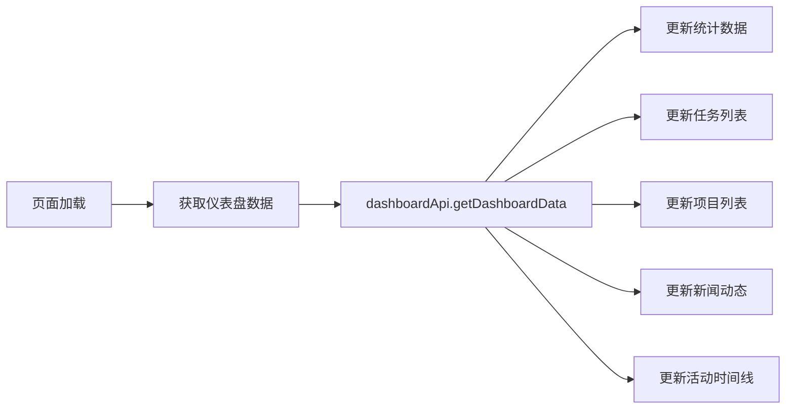
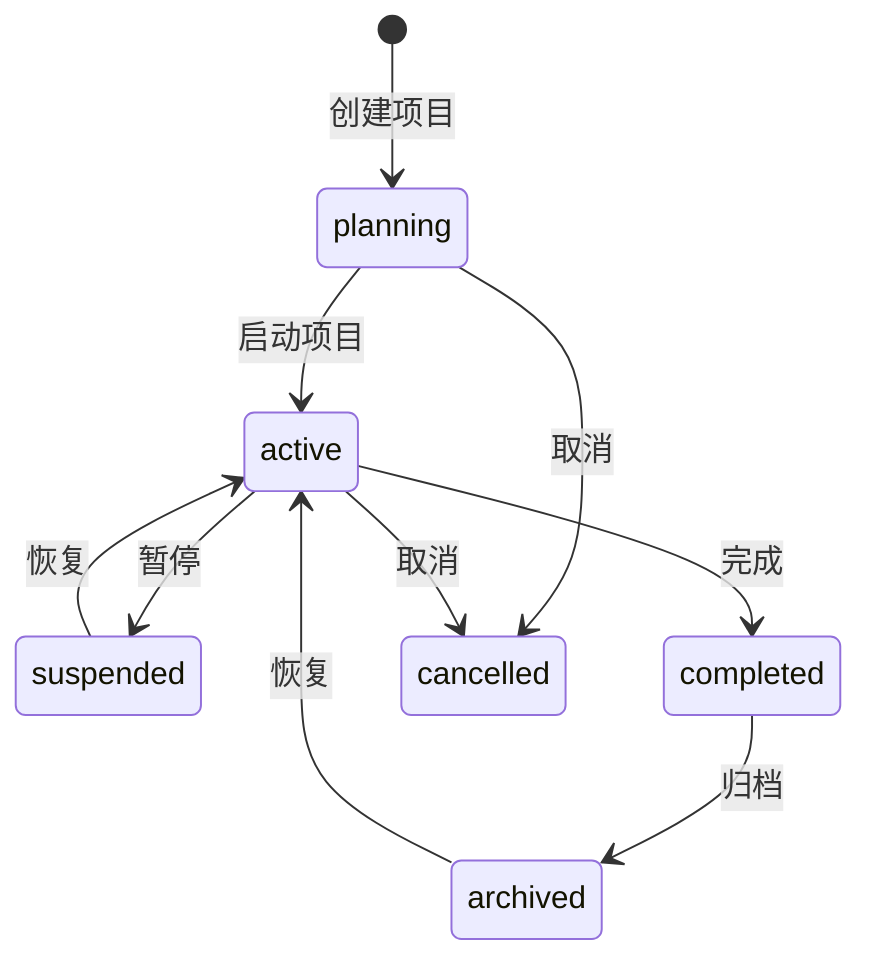

# 摩塔（Mota）产品逻辑与优化方案

> 文档版本：1.0  
> 更新日期：2025-12-27  
> 文档类型：产品分析与优化建议

---

## 目录

1. [产品概述](#1-产品概述)
2. [整体架构分析](#2-整体架构分析)
3. [功能模块详解](#3-功能模块详解)
4. [UI设计分析](#4-ui设计分析)
5. [问题识别与优化建议](#5-问题识别与优化建议)
6. [优化实施路线图](#6-优化实施路线图)

---

## 1. 产品概述

### 1.1 产品定位

摩塔（Mota）是一款 **AI驱动的项目管理与团队协作平台**，核心价值主张：

- **智能化知识管理**：企业知识资产化，AI语义检索
- **自动化信息推送**：行业新闻追踪，重要事项提醒
- **AI辅助决策**：智能方案生成，数据分析洞察

### 1.2 目标用户

| 行业 | 典型场景 |
|------|----------|
| 科技/互联网 | 项目迭代管理、技术文档沉淀 |
| 咨询/专业服务 | AI方案生成、项目交付管理 |
| 金融/保险 | 合规项目管理、智能新闻追踪 |
| 制造/贸易 | 项目进度管理、供应商协作 |
| 教育/培训 | 课程项目管理、教学资料共享 |

### 1.3 核心能力矩阵

```
┌─────────────────────────────────────────────────────────────┐
│                      摩塔核心能力                            │
├───────────────┬───────────────┬───────────────┬─────────────┤
│   项目管理    │   团队协作    │    AI智能     │  知识管理   │
├───────────────┼───────────────┼───────────────┼─────────────┤
│ • 多视图管理  │ • 成员权限    │ • AI方案生成  │ • Wiki文档  │
│ • 可视化看板  │ • 实时通知    │ • 智能新闻    │ • AI知识库  │
│ • 任务追踪    │ • 任务协作    │ • AI辅助决策  │ • 智能检索  │
│ • 进度监控    │ • 效能分析    │ • 智能PPT     │ • 知识图谱  │
└───────────────┴───────────────┴───────────────┴─────────────┘
```

---

## 2. 整体架构分析

### 2.1 技术栈

| 层级 | 技术选型 |
|------|----------|
| 前端框架 | React 18 + TypeScript |
| UI组件库 | Ant Design 5.x |
| 状态管理 | Zustand |
| 路由 | React Router 6 |
| 样式方案 | CSS Modules |
| 日期处理 | dayjs |
| HTTP客户端 | Axios (封装在 request.ts) |

### 2.2 页面路由结构

```
/                           # 官网首页
├── /login                  # 登录
├── /register               # 注册
├── /forgot-password        # 忘记密码
│
├── /dashboard              # 工作台（主入口）
│
├── /ai                     # AI模块
│   ├── /assistant          # AI助手
│   ├── /solution           # 方案生成
│   ├── /proposal           # 提案生成
│   ├── /ppt                # PPT生成
│   ├── /news               # 智能新闻
│   ├── /search             # 智能搜索
│   ├── /knowledge-base     # AI知识库
│   ├── /training           # 模型训练
│   ├── /model-management   # 模型管理
│   └── /history            # 历史记录
│
├── /projects               # 项目管理
│   ├── /create             # 创建项目
│   └── /:id                # 项目详情
│
├── /my-tasks               # 我的任务
├── /tasks/:id              # 任务详情
├── /department-tasks/:id   # 部门任务详情
│
├── /calendar               # 日历
├── /documents              # 文档管理
├── /knowledge              # 知识库
├── /knowledge-statistics   # 知识统计
├── /templates              # 模板库
│
├── /departments            # 部门管理
├── /members                # 成员管理
├── /enterprise             # 企业管理
│
├── /notifications          # 消息中心
├── /favorites              # 收藏
├── /profile                # 个人设置
├── /settings               # 系统设置
├── /system                 # 系统管理
├── /help                   # 帮助中心
│
├── /progress-tracking      # 进度追踪
├── /report-analytics       # 报表分析
└── /resource-management    # 资源管理
```

### 2.3 布局架构

#### 控制台布局 (ConsoleLayout)

```
┌──────────────────────────────────────────────────────────────┐
│  Header: Logo | 搜索框 | 通知 | 用户菜单                      │
├────────────┬─────────────────────────────────────────────────┤
│            │  Breadcrumb 面包屑导航                          │
│   侧边栏   ├─────────────────────────────────────────────────┤
│            │                                                 │
│  • AI助理  │                                                 │
│  • 项目协同│              主内容区域                          │
│  • 知识管理│                                                 │
│  • 组织架构│                                                 │
│  • 消息中心│                                                 │
│  • 系统管理│                                                 │
│            │                                                 │
└────────────┴─────────────────────────────────────────────────┘
```

**侧边栏菜单分组：**

| 分组 | 菜单项 |
|------|--------|
| AI助理 | AI助手、方案生成、提案生成、PPT生成、智能新闻、智能搜索、AI知识库 |
| 项目协同 | 工作台、项目管理、我的任务、日历、进度追踪、报表分析、资源管理 |
| 知识管理 | 知识库、文档管理、模板库、知识统计 |
| 组织架构 | 部门管理、成员管理、企业管理 |
| 消息中心 | 消息通知、收藏 |
| 系统管理 | 个人设置、系统设置、帮助中心 |

---

## 3. 功能模块详解

### 3.1 工作台 (Dashboard)

**文件位置：** [`mota-user/src/pages/dashboard/index.tsx`](mota-user/src/pages/dashboard/index.tsx)

#### 功能组成

```
┌─────────────────────────────────────────────────────────────┐
│  欢迎区域                                                    │
│  • 时间问候语（早上好/下午好/晚上好）                         │
│  • 用户名称                                                  │
│  • 日期显示                                                  │
├─────────────────────────────────────────────────────────────┤
│  AI助手快捷入口                                              │
│  • 输入框 + 快捷按钮（方案生成、PPT生成、智能搜索、新闻推送） │
├─────────────────────────────────────────────────────────────┤
│  统计卡片区                                                  │
│  ┌─────────┬─────────┬─────────┬─────────┐                  │
│  │ 项目总数 │ 任务总数 │ 已完成  │ 进行中  │                  │
│  └─────────┴─────────┴─────────┴─────────┘                  │
├─────────────────────────────────────────────────────────────┤
│  ┌─────────────────────┬───────────────────────────────────┐│
│  │  最近任务列表        │  最近项目列表                     ││
│  │  • 任务名称          │  • 项目名称                       ││
│  │  • 状态标签          │  • 进度条                         ││
│  │  • 截止日期          │  • 成员数量                       ││
│  └─────────────────────┴───────────────────────────────────┘│
├─────────────────────────────────────────────────────────────┤
│  ┌─────────────────────┬───────────────────────────────────┐│
│  │  新闻动态            │  活动时间线                       ││
│  │  • 新闻标题          │  • 用户操作记录                   ││
│  │  • 来源/时间         │  • 时间戳                         ││
│  └─────────────────────┴───────────────────────────────────┘│
├─────────────────────────────────────────────────────────────┤
│  燃尽图                                                      │
│  • 项目进度可视化                                            │
└─────────────────────────────────────────────────────────────┘
```

#### 数据流



---

### 3.2 项目管理 (Projects)

**文件位置：** [`mota-user/src/pages/projects/index.tsx`](mota-user/src/pages/projects/index.tsx) (3108行)

#### 功能架构

```
项目管理
├── 项目列表
│   ├── 多视图切换
│   │   ├── 网格视图 (Grid)
│   │   ├── 列表视图 (List)
│   │   ├── 甘特图视图 (Gantt)
│   │   ├── 日历视图 (Calendar)
│   │   └── 看板视图 (Kanban)
│   ├── 筛选功能
│   │   ├── 状态筛选
│   │   ├── 优先级筛选
│   │   ├── 日期范围筛选
│   │   └── 关键词搜索
│   └── 排序功能
│       ├── 按名称
│       ├── 按创建时间
│       ├── 按更新时间
│       └── 按优先级
│
├── 项目创建（2步向导）
│   ├── 步骤1：基本信息
│   │   ├── 项目名称
│   │   ├── 项目标识
│   │   ├── 项目描述
│   │   ├── 项目颜色
│   │   ├── 优先级
│   │   ├── 可见性
│   │   └── 项目周期
│   └── 步骤2：里程碑设置
│       ├── 手动添加里程碑
│       └── AI智能生成里程碑
│
├── 项目详情抽屉
│   ├── 概览标签页
│   │   ├── 项目进度
│   │   ├── 统计数据
│   │   └── 最近活动
│   ├── 部门任务标签页
│   ├── 执行任务标签页
│   ├── 里程碑标签页
│   ├── 成员标签页
│   └── AI助手标签页
│
└── 项目设置抽屉
    ├── 基本设置
    ├── 通知设置
    ├── 权限设置
    ├── 成员管理
    └── 危险操作（归档/删除）
```

#### 项目状态流转



#### 任务层级结构

```
项目 (Project)
├── 里程碑 (Milestone)
│   └── 部门任务 (Department Task)
│       └── 执行任务 (Task)
│           └── 子任务 (Subtask)
```

---

### 3.3 项目详情 (Project Detail)

**文件位置：** [`mota-user/src/pages/project-detail/index.tsx`](mota-user/src/pages/project-detail/index.tsx) (1821行)

#### 页面结构

```
┌─────────────────────────────────────────────────────────────┐
│  [归档提示横幅 - 仅归档项目显示]                              │
├─────────────────────────────────────────────────────────────┤
│  项目头部                                                    │
│  ┌────┬──────────────────────────────────────┬─────────────┐│
│  │头像│ 项目名称 | 标识 | 状态 | 优先级       │ 收藏|编辑|设置││
│  │    │ 项目描述                              │ 更多操作    ││
│  │    │ 成员数 | 部门任务数 | 里程碑数 | 周期 │             ││
│  └────┴──────────────────────────────────────┴─────────────┘│
├─────────────────────────────────────────────────────────────┤
│  统计卡片                                                    │
│  ┌─────────┬─────────┬─────────┬─────────┬─────────┐        │
│  │部门任务 │ 待分配  │ 进行中  │ 已完成  │ 已逾期  │        │
│  └─────────┴─────────┴─────────┴─────────┴─────────┘        │
├─────────────────────────────────────────────────────────────┤
│  标签页导航                                                  │
│  [概览][部门任务][执行任务][甘特图][燃尽图][看板][里程碑]     │
│  [成员][工作计划审批][AI助手][文档]                          │
├─────────────────────────────────────────────────────────────┤
│  标签页内容区域                                              │
│  • 概览：进度+部门任务列表+团队成员+最近活动                 │
│  • 部门任务：表格列表+分配任务                               │
│  • 执行任务：表格列表+新建任务                               │
│  • 甘特图：GanttChart组件                                    │
│  • 燃尽图：BurndownChart组件                                 │
│  • 看板：KanbanBoard组件                                     │
│  • 里程碑：MilestoneTimeline组件                             │
│  • 成员：成员表格+角色管理                                   │
│  • 工作计划审批：WorkPlanApproval组件                        │
│  • AI助手：AIProjectAssistant组件                            │
└─────────────────────────────────────────────────────────────┘
```

---

### 3.4 我的任务 (My Tasks)

**文件位置：** [`mota-user/src/pages/my-tasks/index.tsx`](mota-user/src/pages/my-tasks/index.tsx)

#### 功能设计

```
我的任务
├── 任务类型切换
│   ├── 全部任务
│   ├── 部门任务
│   └── 执行任务
│
├── 统计卡片
│   ├── 总任务数
│   ├── 进行中
│   ├── 待处理
│   └── 已完成
│
├── 筛选区域
│   ├── 状态筛选
│   ├── 优先级筛选
│   └── 日期范围筛选
│
├── 状态标签页
│   ├── 全部
│   ├── 进行中
│   ├── 待处理
│   ├── 已完成
│   └── 已逾期
│
└── 任务卡片列表
    ├── 任务名称
    ├── 所属项目
    ├── 优先级标签
    ├── 状态标签
    ├── 进度条
    └── 截止日期
```

---

### 3.5 AI助手 (AI Assistant)

**文件位置：** [`mota-user/src/pages/ai/assistant/index.tsx`](mota-user/src/pages/ai/assistant/index.tsx) (1004行)

#### 功能模块

```
AI助手
├── 侧边栏（可折叠）
│   ├── 新建对话按钮
│   └── 会话列表
│       ├── 会话标题
│       ├── 消息数量
│       └── 置顶标记
│
├── 主内容区
│   ├── 标签页导航
│   │   ├── 智能对话
│   │   ├── 工作建议
│   │   ├── 翻译
│   │   ├── 文档摘要
│   │   ├── 日程建议
│   │   └── 工作报告
│   │
│   └── 标签页内容
│       ├── 智能对话
│       │   ├── 欢迎界面（无消息时）
│       │   │   ├── AI头像+问候语
│       │   │   └── 快捷操作按钮
│       │   ├── 消息列表
│       │   │   ├── 用户消息
│       │   │   └── AI回复（含复制/点赞/点踩）
│       │   └── 输入区域
│       │
│       ├── 工作建议
│       │   ├── 建议卡片列表
│       │   └── 采纳/忽略操作
│       │
│       ├── 翻译
│       │   ├── 语言选择器
│       │   ├── 源文本输入
│       │   ├── 翻译结果
│       │   └── 翻译统计
│       │
│       ├── 文档摘要
│       │   ├── 文本输入
│       │   ├── 摘要结果
│       │   └── 关键点列表
│       │
│       ├── 日程建议
│       │   ├── 时间线展示
│       │   └── 应用建议操作
│       │
│       └── 工作报告
│           ├── 报告列表
│           └── 生成报告弹窗
│
└── 设置抽屉
    ├── 助手名称
    ├── 默认模型
    ├── Temperature
    ├── 最大Token数
    ├── 上下文设置
    └── 语言偏好
```

#### 意图识别类型

| 意图类型 | 说明 |
|----------|------|
| task_create | 创建任务 |
| task_query | 查询任务 |
| task_update | 更新任务 |
| schedule_query | 查询日程 |
| schedule_create | 创建日程 |
| report_generate | 生成报告 |
| data_analysis | 数据分析 |
| document_summary | 文档摘要 |
| translation | 翻译 |
| general_chat | 闲聊 |

---

### 3.6 AI方案生成 (AI Solution)

**文件位置：** [`mota-user/src/pages/ai/solution/index.tsx`](mota-user/src/pages/ai/solution/index.tsx)

#### 页面布局

```
┌─────────────────────────────────────────────────────────────┐
│  页面头部                                                    │
│  [AI图标] AI方案生成 | 输入业务信息，AI一键生成专业方案文档  │
│                                                   [历史记录] │
├─────────────────────────────────────────────────────────────┤
│  ┌─────────────────────────┬───────────────────────────────┐│
│  │  方案配置（左侧）        │  生成结果（右侧）             ││
│  │                         │                               ││
│  │  快捷模板标签            │  ┌───────────────────────┐   ││
│  │  • 电商平台方案          │  │                       │   ││
│  │  • 企业数字化转型        │  │   等待生成 / 生成中   │   ││
│  │  • 产品上市推广          │  │   / 生成结果          │   ││
│  │  • 团队培训计划          │  │                       │   ││
│  │                         │  │                       │   ││
│  │  表单                    │  │                       │   ││
│  │  • 方案类型              │  │                       │   ││
│  │  • 公司/项目名称         │  │                       │   ││
│  │  • 业务介绍              │  │                       │   ││
│  │  • 具体需求              │  │                       │   ││
│  │  • 补充信息              │  │                       │   ││
│  │                         │  └───────────────────────┘   ││
│  │  [重置] [生成方案]       │  [复制][编辑][重新生成][导出] ││
│  │                         │                               ││
│  │  生成进度（生成中显示）   │                               ││
│  │  1.分析需求 2.检索知识库  │                               ││
│  │  3.生成方案 4.完成        │                               ││
│  │                         │                               ││
│  │  生成技巧提示卡片        │                               ││
│  └─────────────────────────┴───────────────────────────────┘│
└─────────────────────────────────────────────────────────────┘
```

#### 方案类型

| 类型 | 说明 | 图标 |
|------|------|------|
| business | 商务方案 | 💼 |
| technical | 技术方案 | ⚙️ |
| marketing | 营销方案 | 📈 |
| consulting | 咨询报告 | 📊 |
| product | 产品介绍 | 🎯 |
| training | 培训方案 | 📚 |

---

### 3.7 部门管理 (Departments)

**文件位置：** [`mota-user/src/pages/departments/index.tsx`](mota-user/src/pages/departments/index.tsx)

#### 功能设计

```
部门管理
├── 视图切换
│   ├── 列表视图（表格）
│   └── 树形视图
│
├── 列表视图
│   ├── 表格列
│   │   ├── 部门名称
│   │   ├── 上级部门
│   │   ├── 部门人数
│   │   ├── 部门负责人
│   │   ├── 描述
│   │   ├── 创建时间
│   │   └── 操作（编辑/删除）
│   └── 行点击选中
│
├── 树形视图
│   ├── 左侧：组织架构树
│   └── 右侧：部门详情卡片
│
└── 新建/编辑弹窗
    ├── 部门名称
    ├── 上级部门
    └── 部门描述
```

---

### 3.8 官网首页 (Home)

**文件位置：** [`mota-user/src/pages/home/index.tsx`](mota-user/src/pages/home/index.tsx)

#### 页面结构

```
官网首页
├── 导航栏
│   ├── Logo + 品牌名
│   └── 登录 | 免费试用
│
├── Hero区域
│   ├── 标语：让智能连接每一次协作
│   ├── 副标题
│   ├── CTA按钮：免费开始使用 | 观看演示
│   ├── 信任背书：10,000+企业正在使用
│   └── 产品预览卡片（看板示意）
│
├── 核心能力（四大支柱）
│   ├── 项目管理
│   ├── 团队协作
│   ├── AI智能
│   └── 知识管理
│
├── 功能特性
│   ├── 可视化看板
│   ├── 进度管理
│   ├── AI方案生成
│   ├── 智能推送
│   ├── Wiki文档
│   └── 数据分析
│
├── 核心价值
│   ├── 50%+ 协作效率提升
│   ├── 80%+ 知识复用率提升
│   └── 90%+ 信息获取提速
│
├── 行业解决方案
│   ├── 科技/互联网
│   ├── 咨询/专业服务
│   ├── 金融/保险
│   ├── 制造/贸易
│   ├── 教育/培训
│   └── 更多行业
│
├── 技术优势
│   ├── 数据安全
│   ├── 多模型支持
│   ├── 开放集成
│   └── 高性能
│
├── CTA区域
│   ├── 免费开始使用
│   └── 联系我们（微信二维码）
│
└── 页脚
    ├── 品牌信息
    ├── 核心能力链接
    ├── 解决方案链接
    ├── 资源链接
    ├── 公司链接
    └── 版权信息
```

---

## 4. UI设计分析

### 4.1 设计系统

#### 主题色

| 颜色 | 色值 | 用途 |
|------|------|------|
| 主色 | #10B981 (薄荷绿) | 品牌色、主要按钮、激活状态 |
| 辅助色 | #2b7de9 (蓝色) | 链接、信息提示 |
| 成功色 | #52c41a | 成功状态 |
| 警告色 | #faad14 | 警告状态 |
| 错误色 | #ff4d4f | 错误状态 |
| 文字色 | #1a1a1a | 主要文字 |
| 次要文字 | #8c8c8c | 次要文字 |
| 边框色 | #e8e8e8 | 边框、分割线 |
| 背景色 | #f5f5f5 | 页面背景 |

#### 间距规范

| 级别 | 数值 | 用途 |
|------|------|------|
| xs | 4px | 紧凑间距 |
| sm | 8px | 小间距 |
| md | 16px | 中等间距 |
| lg | 24px | 大间距 |
| xl | 32px | 超大间距 |

#### 圆角规范

| 级别 | 数值 | 用途 |
|------|------|------|
| sm | 4px | 小元素 |
| md | 8px | 卡片、按钮 |
| lg | 12px | 大卡片 |
| xl | 16px | 弹窗 |
| full | 50% | 圆形头像 |

### 4.2 组件使用情况

#### 高频组件

| 组件 | 使用场景 |
|------|----------|
| Card | 内容容器、统计卡片 |
| Table | 数据列表展示 |
| Form | 表单输入 |
| Modal | 确认弹窗 |
| Drawer | 侧边抽屉（详情、设置） |
| Tabs | 标签页切换 |
| Tag | 状态标签、分类标签 |
| Button | 操作按钮 |
| Input/TextArea | 文本输入 |
| Select | 下拉选择 |
| DatePicker | 日期选择 |
| Progress | 进度条 |
| Avatar | 用户头像 |
| Space | 间距布局 |
| Tooltip | 提示信息 |
| Popconfirm | 确认气泡 |
| Empty | 空状态 |
| Spin | 加载状态 |

#### 自定义组件

| 组件 | 位置 | 功能 |
|------|------|------|
| KanbanBoard | components/KanbanBoard | 看板视图 |
| GanttChart | components/GanttChart | 甘特图 |
| BurndownChart | components/BurndownChart | 燃尽图 |
| MilestoneTimeline | components/MilestoneTimeline | 里程碑时间线 |
| AIProjectAssistant | components/AIProjectAssistant | 项目AI助手 |
| WorkPlanApproval | components/WorkPlanApproval | 工作计划审批 |
| ThemeSwitch | components/ThemeSwitch | 主题切换 |
| NewsFeed | components/NewsFeed | 新闻动态 |

---

## 5. 问题识别与优化建议

### 5.1 代码架构问题

#### 问题1：页面文件过大

| 文件 | 行数 | 问题 |
|------|------|------|
| projects/index.tsx | 3108行 | 严重超标，难以维护 |
| project-detail/index.tsx | 1821行 | 过大，需要拆分 |
| ai/assistant/index.tsx | 1004行 | 较大，建议拆分 |

**优化建议：**

```
projects/index.tsx 拆分方案：
├── index.tsx                    # 主入口，状态管理
├── components/
│   ├── ProjectHeader.tsx        # 页面头部
│   ├── ProjectFilters.tsx       # 筛选区域
│   ├── ProjectList.tsx          # 项目列表
│   ├── views/
│   │   ├── GridView.tsx         # 网格视图
│   │   ├── ListView.tsx         # 列表视图
│   │   ├── GanttView.tsx        # 甘特图视图
│   │   ├── CalendarView.tsx     # 日历视图
│   │   └── KanbanView.tsx       # 看板视图
│   ├── ProjectCreateWizard/
│   │   ├── index.tsx            # 创建向导
│   │   ├── BasicInfoStep.tsx    # 基本信息步骤
│   │   └── MilestoneStep.tsx    # 里程碑步骤
│   ├── ProjectDetailDrawer/
│   │   ├── index.tsx            # 详情抽屉
│   │   ├── OverviewTab.tsx      # 概览标签页
│   │   ├── TasksTab.tsx         # 任务标签页
│   │   └── MembersTab.tsx       # 成员标签页
│   └── ProjectSettingsDrawer/
│       ├── index.tsx            # 设置抽屉
│       ├── GeneralSettings.tsx  # 基本设置
│       └── DangerZone.tsx       # 危险操作
├── hooks/
│   ├── useProjects.ts           # 项目数据Hook
│   ├── useProjectFilters.ts     # 筛选Hook
│   └── useProjectActions.ts     # 操作Hook
└── types.ts                     # 类型定义
```

#### 问题2：状态管理分散

**现状：** 大量使用 useState，状态分散在各个组件中

**优化建议：**
- 使用 Zustand 创建项目状态 store
- 抽取公共状态到全局 store
- 使用 React Query 管理服务端状态

```typescript
// stores/projectStore.ts
import { create } from 'zustand'

interface ProjectState {
  projects: Project[]
  currentProject: Project | null
  filters: ProjectFilters
  viewMode: ViewMode
  loading: boolean
  
  // Actions
  setProjects: (projects: Project[]) => void
  setCurrentProject: (project: Project | null) => void
  setFilters: (filters: Partial<ProjectFilters>) => void
  setViewMode: (mode: ViewMode) => void
  fetchProjects: () => Promise<void>
}

export const useProjectStore = create<ProjectState>((set, get) => ({
  // ... implementation
}))
```

#### 问题3：API调用缺乏统一错误处理

**优化建议：**

```typescript
// utils/apiWrapper.ts
export async function apiCall<T>(
  fn: () => Promise<T>,
  options?: {
    successMessage?: string
    errorMessage?: string
    showLoading?: boolean
  }
): Promise<T | null> {
  try {
    const result = await fn()
    if (options?.successMessage) {
      message.success(options.successMessage)
    }
    return result
  } catch (error) {
    console.error(error)
    message.error(options?.errorMessage || '操作失败')
    return null
  }
}
```

### 5.2 UI/UX问题

#### 问题1：视图切换体验不一致

**现状：** 项目列表有5种视图，但切换时没有过渡动画，体验生硬

**优化建议：**
- 添加视图切换过渡动画
- 保持视图切换时的滚动位置
- 记住用户的视图偏好

#### 问题2：表单验证反馈不够友好

**现状：** 表单验证错误只显示红色边框和文字

**优化建议：**
- 添加实时验证
- 使用更明显的错误提示
- 添加成功状态反馈

#### 问题3：空状态设计单一

**现状：** 使用 Ant Design 默认的 Empty 组件

**优化建议：**
- 设计品牌化的空状态插图
- 添加引导性操作按钮
- 根据场景定制空状态文案

#### 问题4：加载状态体验

**现状：** 使用简单的 Spin 组件

**优化建议：**
- 使用骨架屏 (Skeleton) 替代 Spin
- 添加加载进度提示
- 优化首屏加载体验

### 5.3 功能逻辑问题

#### 问题1：任务层级关系复杂

**现状：** 项目 → 里程碑 → 部门任务 → 执行任务 → 子任务，层级过深

**优化建议：**
- 简化为：项目 → 任务 → 子任务
- 里程碑作为任务的属性而非层级
- 部门作为任务的分配属性

#### 问题2：AI功能入口分散

**现状：** AI功能分布在多个页面，用户需要切换

**优化建议：**
- 添加全局AI助手悬浮按钮
- 支持在任意页面唤起AI对话
- 统一AI功能入口

#### 问题3：权限控制不够细粒度

**现状：** 只有简单的角色区分

**优化建议：**
- 实现功能级权限控制
- 支持自定义角色
- 添加权限继承机制

### 5.4 性能问题

#### 问题1：大列表渲染性能

**现状：** 项目列表、任务列表直接渲染所有数据

**优化建议：**
- 使用虚拟滚动 (react-window)
- 实现分页加载
- 添加数据缓存

#### 问题2：组件重复渲染

**现状：** 缺少 memo 和 useMemo 优化

**优化建议：**
- 使用 React.memo 包装纯组件
- 使用 useMemo 缓存计算结果
- 使用 useCallback 缓存回调函数

#### 问题3：图片资源优化

**优化建议：**
- 使用 WebP 格式
- 实现图片懒加载
- 添加图片压缩

---

## 6. 优化实施路线图

### 6.1 第一阶段：代码重构（2周）

| 任务 | 优先级 | 预估工时 |
|------|--------|----------|
| 拆分 projects/index.tsx | P0 | 3天 |
| 拆分 project-detail/index.tsx | P0 | 2天 |
| 拆分 ai/assistant/index.tsx | P1 | 1天 |
| 创建项目状态 store | P1 | 1天 |
| 统一 API 错误处理 | P1 | 1天 |
| 添加 TypeScript 严格模式 | P2 | 1天 |

### 6.2 第二阶段：UI/UX优化（2周）

| 任务 | 优先级 | 预估工时 |
|------|--------|----------|
| 视图切换动画 | P1 | 1天 |
| 骨架屏加载 | P1 | 2天 |
| 空状态设计 | P2 | 1天 |
| 表单验证优化 | P2 | 1天 |
| 响应式适配优化 | P1 | 2天 |
| 主题色统一 | P2 | 1天 |

### 6.3 第三阶段：功能优化（3周）

| 任务 | 优先级 | 预估工时 |
|------|--------|----------|
| 全局AI助手 | P0 | 3天 |
| 任务层级简化 | P1 | 5天 |
| 权限系统升级 | P1 | 3天 |
| 通知系统优化 | P2 | 2天 |
| 搜索功能增强 | P2 | 2天 |

### 6.4 第四阶段：性能优化（1周）

| 任务 | 优先级 | 预估工时 |
|------|--------|----------|
| 虚拟滚动实现 | P1 | 2天 |
| 组件 memo 优化 | P1 | 1天 |
| 图片资源优化 | P2 | 1天 |
| 代码分割优化 | P2 | 1天 |

---

## 附录

### A. 文件清单

| 模块 | 文件路径 | 行数 |
|------|----------|------|
| 路由配置 | mota-user/src/router/index.tsx | ~200 |
| 主应用 | mota-user/src/App.tsx | ~50 |
| 控制台布局 | mota-user/src/layouts/ConsoleLayout/index.tsx | ~400 |
| 工作台 | mota-user/src/pages/dashboard/index.tsx | ~300 |
| 项目管理 | mota-user/src/pages/projects/index.tsx | 3108 |
| 项目详情 | mota-user/src/pages/project-detail/index.tsx | 1821 |
| 我的任务 | mota-user/src/pages/my-tasks/index.tsx | ~400 |
| AI助手 | mota-user/src/pages/ai/assistant/index.tsx | 1004 |
| AI方案 | mota-user/src/pages/ai/solution/index.tsx | 413 |
| 官网首页 | mota-user/src/pages/home/index.tsx | 646 |
| 部门管理 | mota-user/src/pages/departments/index.tsx | 417 |

### B. API服务清单

| 服务 | 文件路径 | 功能 |
|------|----------|------|
| 认证 | services/api/auth.ts | 登录、注册、密码重置 |
| 项目 | services/api/project.ts | 项目CRUD、成员管理 |
| 任务 | services/api/task.ts | 任务CRUD |
| 部门任务 | services/api/departmentTask.ts | 部门任务管理 |
| 里程碑 | services/api/milestone.ts | 里程碑管理 |
| 部门 | services/api/department.ts | 部门管理 |
| 用户 | services/api/user.ts | 用户管理 |
| AI助手 | services/api/aiAssistant.ts | AI对话、建议 |
| AI方案 | services/api/ai.ts | 方案生成 |
| 仪表盘 | services/api/dashboard.ts | 仪表盘数据 |

### C. 组件清单

| 组件 | 路径 | 功能 |
|------|------|------|
| KanbanBoard | components/KanbanBoard | 看板视图 |
| GanttChart | components/GanttChart | 甘特图 |
| BurndownChart | components/BurndownChart | 燃尽图 |
| MilestoneTimeline | components/MilestoneTimeline | 里程碑时间线 |
| AIProjectAssistant | components/AIProjectAssistant | 项目AI助手 |
| WorkPlanApproval | components/WorkPlanApproval | 工作计划审批 |
| ThemeSwitch | components/ThemeSwitch | 主题切换 |
| NewsFeed | components/NewsFeed | 新闻动态 |
| SubtaskList | components/SubtaskList | 子任务列表 |
| TaskComments | components/TaskComments | 任务评论 |
| ResourceCalendar | components/ResourceCalendar | 资源日历 |
| TeamDistribution | components/TeamDistribution | 团队分布 |
| VelocityTrend | components/VelocityTrend | 速度趋势 |
| WorkloadStats | components/WorkloadStats | 工作量统计 |

---

*文档结束*