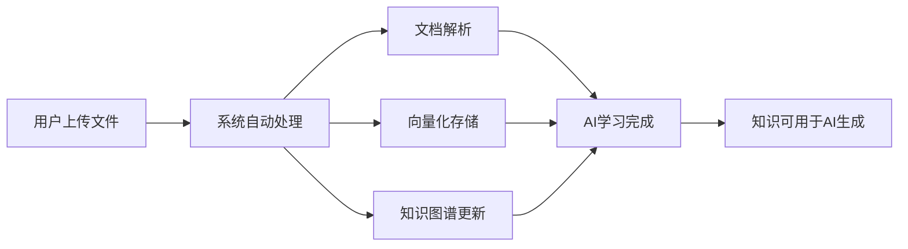

# 企业专属AI大脑方案

> 版本：1.0  
> 日期：2025-12-27  
> 状态：方案设计

---

## 1. 产品愿景

### 1.1 核心理念

将 **知识库** 和 **AI知识库** 合并，构建一个能够：
- 自动学习企业上传的所有文件和资料
- 理解企业的业务、流程、人员和历史经验
- 在生成方案、分配任务时提供基于企业知识的最佳建议

### 1.2 价值主张

```
┌─────────────────────────────────────────────────────────────────────────────┐
│                        企业专属AI大脑                                        │
│                                                                             │
│   "让AI真正理解你的企业，成为每个员工的智能助手"                              │
│                                                                             │
├─────────────────────────────────────────────────────────────────────────────┤
│                                                                             │
│   ┌─────────────┐    ┌─────────────┐    ┌─────────────┐    ┌─────────────┐ │
│   │  企业知识   │ -> │  AI学习     │ -> │  智能输出   │ -> │  持续优化   │ │
│   │  持续积累   │    │  深度理解   │    │  精准建议   │    │  越用越懂   │ │
│   └─────────────┘    └─────────────┘    └─────────────┘    └─────────────┘ │
│                                                                             │
└─────────────────────────────────────────────────────────────────────────────┘
```

---

## 2. 整体架构设计

### 2.1 系统架构图

```
┌─────────────────────────────────────────────────────────────────────────────┐
│                              用户交互层                                      │
├─────────────────────────────────────────────────────────────────────────────┤
│  ┌─────────────┐  ┌─────────────┐  ┌─────────────┐  ┌─────────────┐        │
│  │  统一知识库  │  │  AI助手     │  │  方案生成   │  │  智能分工   │        │
│  │  上传/管理   │  │  对话交互   │  │  PPT/文档   │  │  任务分配   │        │
│  └──────┬──────┘  └──────┬──────┘  └──────┬──────┘  └──────┬──────┘        │
│         │                │                │                │               │
└─────────┼────────────────┼────────────────┼────────────────┼───────────────┘
          │                │                │                │
          ▼                ▼                ▼                ▼
┌─────────────────────────────────────────────────────────────────────────────┐
│                           AI智能中枢层                                       │
├─────────────────────────────────────────────────────────────────────────────┤
│                                                                             │
│  ┌─────────────────────────────────────────────────────────────────────┐   │
│  │                      RAG 检索增强生成引擎                            │   │
│  │  ┌─────────────┐  ┌─────────────┐  ┌─────────────┐                  │   │
│  │  │  语义检索   │  │  上下文构建  │  │  答案生成   │                  │   │
│  │  │  Retrieval  │->│  Context    │->│  Generation │                  │   │
│  │  └─────────────┘  └─────────────┘  └─────────────┘                  │   │
│  └─────────────────────────────────────────────────────────────────────┘   │
│                                                                             │
│  ┌─────────────────────────────────────────────────────────────────────┐   │
│  │                      多模型协同层                                    │   │
│  │  ┌─────────────┐  ┌─────────────┐  ┌─────────────┐  ┌─────────────┐ │   │
│  │  │  豆包       │  │  GPT-4      │  │  Claude     │  │  通义千问   │ │   │
│  │  │  火山引擎   │  │  复杂推理   │  │  长文本     │  │  中文优化   │ │   │
│  │  │  (默认)     │  │             │  │             │  │             │ │   │
│  │  └─────────────┘  └─────────────┘  └─────────────┘  └─────────────┘ │   │
│  └─────────────────────────────────────────────────────────────────────┘   │
│                                                                             │
└─────────────────────────────────────────────────────────────────────────────┘
          │
          ▼
┌─────────────────────────────────────────────────────────────────────────────┐
│                           知识存储层                                         │
├─────────────────────────────────────────────────────────────────────────────┤
│                                                                             │
│  ┌─────────────────────┐  ┌─────────────────────┐  ┌─────────────────────┐ │
│  │    向量数据库        │  │    知识图谱          │  │    结构化数据        │ │
│  │    Milvus/Pinecone  │  │    Neo4j/JanusGraph │  │    MySQL/PostgreSQL │ │
│  │                     │  │                     │  │                     │ │
│  │  • 文档向量         │  │  • 实体关系         │  │  • 组织架构         │ │
│  │  • 语义索引         │  │  • 知识关联         │  │  • 人员技能         │ │
│  │  • 相似度检索       │  │  • 推理路径         │  │  • 项目历史         │ │
│  └─────────────────────┘  └─────────────────────┘  └─────────────────────┘ │
│                                                                             │
└─────────────────────────────────────────────────────────────────────────────┘
          │
          ▼
┌─────────────────────────────────────────────────────────────────────────────┐
│                           数据采集层                                         │
├─────────────────────────────────────────────────────────────────────────────┤
│                                                                             │
│  ┌─────────────┐  ┌─────────────┐  ┌─────────────┐  ┌─────────────┐        │
│  │  文档上传   │  │  项目数据   │  │  组织数据   │  │  行为数据   │        │
│  │  PDF/Word   │  │  任务/进度  │  │  部门/人员  │  │  操作记录   │        │
│  └─────────────┘  └─────────────┘  └─────────────┘  └─────────────┘        │
│                                                                             │
└─────────────────────────────────────────────────────────────────────────────┘
```

### 2.2 核心技术选型

| 模块 | 技术方案 | 说明 |
|------|----------|------|
| 向量数据库 | Milvus / Pinecone / Weaviate | 存储文档向量，支持语义检索 |
| 知识图谱 | Neo4j / JanusGraph | 存储实体关系，支持知识推理 |
| 文档解析 | LangChain / LlamaIndex | 文档切片、向量化、索引构建 |
| 大模型 | **豆包(默认)** / GPT-4 / Claude / 通义千问 | 多模型协同，智能路由，豆包作为默认首选 |
| RAG框架 | LangChain / LlamaIndex | 检索增强生成 |
| 嵌入模型 | text-embedding-3 / BGE | 文本向量化 |

### 2.3 豆包模型集成

豆包（Doubao）是火山引擎提供的大语言模型，作为系统默认的AI模型，具有以下优势：

**模型特点：**
- 🚀 **高性能**：响应速度快，适合实时交互场景
- 🇨🇳 **中文优化**：针对中文场景深度优化，理解更准确
- 💰 **成本优势**：相比国际模型，调用成本更低
- 🔒 **数据安全**：数据存储在国内，符合数据合规要求

**支持的模型版本：**

| 模型 | 上下文长度 | 适用场景 | 优先级 |
|------|------------|----------|--------|
| doubao-pro-32k | 32K tokens | 通用对话、方案生成 | 默认首选 |
| doubao-pro-128k | 128K tokens | 长文档处理、复杂分析 | 长文本场景 |
| doubao-lite-32k | 32K tokens | 轻量级任务、快速响应 | 简单任务 |
| doubao-lite-128k | 128K tokens | 长文档轻量处理 | 备选 |

**API接入信息：**
- API端点：`https://ark.cn-beijing.volces.com/api/v3/chat/completions`
- 认证方式：Bearer Token
- 接口格式：兼容OpenAI格式

---

## 3. 核心功能设计

### 3.1 统一知识库

**合并后的知识库功能：**

```
统一知识库
├── 文件管理
│   ├── 上传文件（自动触发AI处理）
│   ├── 文件预览
│   ├── 版本管理
│   └── 权限控制
│
├── AI处理（后台自动）
│   ├── 文档解析（PDF/Word/Excel等）
│   ├── OCR识别（图片文字）
│   ├── 语音转写（音视频）
│   ├── 内容切片（Chunking）
│   ├── 向量化存储（Embedding）
│   ├── 实体抽取（NER）
│   └── 知识图谱构建
│
├── 智能检索
│   ├── 语义搜索
│   ├── 知识问答
│   └── 相关推荐
│
└── 知识可视化
    ├── 知识图谱展示
    ├── 知识统计
    └── 学习进度
```

**用户体验流程：**



### 3.2 智能方案生成

**基于企业知识的方案生成流程：**

```
用户输入需求
      │
      ▼
┌─────────────────────────────────────────────────────────────┐
│                    RAG 检索增强生成                          │
├─────────────────────────────────────────────────────────────┤
│                                                             │
│  1. 意图理解                                                │
│     └── 分析用户需求，识别关键实体和意图                     │
│                                                             │
│  2. 知识检索                                                │
│     ├── 向量检索：找到语义相关的文档片段                     │
│     ├── 图谱检索：找到相关的实体和关系                       │
│     └── 历史检索：找到类似的历史项目/方案                    │
│                                                             │
│  3. 上下文构建                                              │
│     └── 将检索到的知识组织成结构化上下文                     │
│                                                             │
│  4. 方案生成                                                │
│     └── 基于企业知识 + 大模型能力生成定制化方案              │
│                                                             │
│  5. 质量校验                                                │
│     └── 检查方案与企业知识的一致性                          │
│                                                             │
└─────────────────────────────────────────────────────────────┘
      │
      ▼
输出企业专属方案
```

**示例场景：**

```
用户输入：帮我制定一个电商平台的技术架构方案

AI处理过程：
1. 检索企业知识库中的：
   - 历史技术架构文档
   - 技术选型规范
   - 已有项目的技术栈
   - 团队技术能力分布

2. 生成方案时考虑：
   - 复用企业已有的技术组件
   - 符合企业技术规范
   - 匹配团队技术能力
   - 参考历史成功案例

3. 输出：
   - 基于企业实际情况的技术架构方案
   - 而非通用的技术架构模板
```

### 3.3 智能任务分配

**基于组织架构和知识库的智能分工：**

```
┌─────────────────────────────────────────────────────────────────────────────┐
│                          智能任务分配引擎                                    │
├─────────────────────────────────────────────────────────────────────────────┤
│                                                                             │
│  输入数据                                                                   │
│  ┌─────────────┐  ┌─────────────┐  ┌─────────────┐  ┌─────────────┐        │
│  │  任务信息   │  │  组织架构   │  │  人员画像   │  │  历史数据   │        │
│  │  • 任务描述 │  │  • 部门结构 │  │  • 技能标签 │  │  • 完成率   │        │
│  │  • 技能要求 │  │  • 汇报关系 │  │  • 工作负载 │  │  • 质量评分 │        │
│  │  • 时间要求 │  │  • 职责范围 │  │  • 历史表现 │  │  • 协作记录 │        │
│  └─────────────┘  └─────────────┘  └─────────────┘  └─────────────┘        │
│         │                │                │                │               │
│         └────────────────┴────────────────┴────────────────┘               │
│                                    │                                        │
│                                    ▼                                        │
│  ┌─────────────────────────────────────────────────────────────────────┐   │
│  │                         AI分析引擎                                   │   │
│  │                                                                     │   │
│  │  1. 任务分解：将大任务拆解为可执行的子任务                           │   │
│  │  2. 技能匹配：分析任务所需技能，匹配合适人员                         │   │
│  │  3. 负载均衡：考虑人员当前工作量，合理分配                           │   │
│  │  4. 协作优化：考虑历史协作效率，优化团队组合                         │   │
│  │  5. 风险预警：识别潜在风险，提供预防建议                             │   │
│  │                                                                     │   │
│  └─────────────────────────────────────────────────────────────────────┘   │
│                                    │                                        │
│                                    ▼                                        │
│  输出结果                                                                   │
│  ┌─────────────────────────────────────────────────────────────────────┐   │
│  │  • 推荐负责人及理由                                                  │   │
│  │  • 推荐团队成员及分工                                                │   │
│  │  • 预估完成时间                                                      │   │
│  │  • 潜在风险提示                                                      │   │
│  │  • 历史参考案例                                                      │   │
│  └─────────────────────────────────────────────────────────────────────┘   │
│                                                                             │
└─────────────────────────────────────────────────────────────────────────────┘
```

**人员画像构建：**

```
人员画像
├── 基础信息
│   ├── 姓名、部门、职位
│   ├── 入职时间、工作年限
│   └── 汇报关系
│
├── 技能标签（AI自动提取）
│   ├── 从简历提取
│   ├── 从项目经历提取
│   ├── 从完成任务提取
│   └── 从知识库贡献提取
│
├── 工作表现（AI自动分析）
│   ├── 任务完成率
│   ├── 按时交付率
│   ├── 质量评分
│   └── 协作评价
│
├── 当前状态
│   ├── 在手任务数
│   ├── 工作负载
│   └── 可用时间
│
└── 协作网络
    ├── 常合作同事
    ├── 协作效率
    └── 沟通偏好
```

### 3.4 智能进度反馈

**AI驱动的项目进度分析：**

```
┌─────────────────────────────────────────────────────────────────────────────┐
│                          智能进度分析                                        │
├─────────────────────────────────────────────────────────────────────────────┤
│                                                                             │
│  数据采集                                                                   │
│  ┌─────────────┐  ┌─────────────┐  ┌─────────────┐  ┌─────────────┐        │
│  │  任务状态   │  │  时间记录   │  │  交付物     │  │  沟通记录   │        │
│  └─────────────┘  └─────────────┘  └─────────────┘  └─────────────┘        │
│                                                                             │
│  AI分析                                                                     │
│  ┌─────────────────────────────────────────────────────────────────────┐   │
│  │  • 进度偏差分析：对比计划与实际，识别延期风险                        │   │
│  │  • 瓶颈识别：找出阻塞任务和关键路径                                  │   │
│  │  • 资源分析：识别资源不足或过载情况                                  │   │
│  │  • 趋势预测：基于历史数据预测完成时间                                │   │
│  │  • 风险预警：提前识别潜在问题                                        │   │
│  └─────────────────────────────────────────────────────────────────────┘   │
│                                                                             │
│  智能输出                                                                   │
│  ┌─────────────────────────────────────────────────────────────────────┐   │
│  │  • 每日/周进度摘要                                                   │   │
│  │  • 风险预警通知                                                      │   │
│  │  • 优化建议                                                          │   │
│  │  • 自动生成进度报告                                                  │   │
│  └─────────────────────────────────────────────────────────────────────┘   │
│                                                                             │
└─────────────────────────────────────────────────────────────────────────────┘
```

---

## 4. 数据模型设计

### 4.1 知识库数据模型

```sql
-- 知识文档表
CREATE TABLE knowledge_document (
    id BIGINT PRIMARY KEY,
    title VARCHAR(255) NOT NULL,
    file_path VARCHAR(500),
    file_type VARCHAR(50),
    file_size BIGINT,
    
    -- 解析状态
    parse_status ENUM('pending', 'parsing', 'completed', 'failed'),
    parse_error TEXT,
    
    -- 内容信息
    content_text LONGTEXT,
    word_count INT,
    language VARCHAR(10),
    
    -- 向量化状态
    vector_status ENUM('pending', 'processing', 'completed', 'failed'),
    vector_count INT,
    
    -- 知识图谱状态
    graph_status ENUM('pending', 'processing', 'completed', 'failed'),
    entity_count INT,
    
    -- 元数据
    creator_id BIGINT,
    org_id BIGINT,
    created_at DATETIME,
    updated_at DATETIME
);

-- 文档向量表（存储在向量数据库）
CREATE TABLE document_vector (
    id BIGINT PRIMARY KEY,
    document_id BIGINT,
    chunk_index INT,
    chunk_text TEXT,
    vector VECTOR(1536),  -- OpenAI embedding维度
    metadata JSON,
    created_at DATETIME
);

-- 知识实体表
CREATE TABLE knowledge_entity (
    id BIGINT PRIMARY KEY,
    name VARCHAR(255),
    type VARCHAR(50),  -- person, organization, concept, technology, etc.
    description TEXT,
    properties JSON,
    source_document_id BIGINT,
    org_id BIGINT,
    created_at DATETIME
);

-- 实体关系表
CREATE TABLE entity_relation (
    id BIGINT PRIMARY KEY,
    source_entity_id BIGINT,
    target_entity_id BIGINT,
    relation_type VARCHAR(50),
    properties JSON,
    confidence DECIMAL(5,4),
    source_document_id BIGINT,
    created_at DATETIME
);
```

### 4.2 人员画像数据模型

```sql
-- 人员技能表
CREATE TABLE user_skill (
    id BIGINT PRIMARY KEY,
    user_id BIGINT,
    skill_name VARCHAR(100),
    skill_level ENUM('beginner', 'intermediate', 'advanced', 'expert'),
    source VARCHAR(50),  -- resume, project, task, manual
    confidence DECIMAL(5,4),
    last_used_at DATETIME,
    created_at DATETIME
);

-- 人员工作表现表
CREATE TABLE user_performance (
    id BIGINT PRIMARY KEY,
    user_id BIGINT,
    period_type ENUM('daily', 'weekly', 'monthly'),
    period_start DATE,
    period_end DATE,
    
    -- 统计指标
    task_count INT,
    completed_count INT,
    on_time_count INT,
    quality_score DECIMAL(5,2),
    collaboration_score DECIMAL(5,2),
    
    -- AI分析
    strengths JSON,
    improvements JSON,
    
    created_at DATETIME
);

-- 协作关系表
CREATE TABLE user_collaboration (
    id BIGINT PRIMARY KEY,
    user_id BIGINT,
    collaborator_id BIGINT,
    project_count INT,
    task_count INT,
    avg_efficiency DECIMAL(5,2),
    last_collaboration_at DATETIME,
    created_at DATETIME
);
```

---

## 5. 实施路线图

### 5.1 阶段规划

```
┌─────────────────────────────────────────────────────────────────────────────┐
│                          实施路线图                                          │
├─────────────────────────────────────────────────────────────────────────────┤
│                                                                             │
│  第一阶段：基础设施（4周）                                                   │
│  ┌─────────────────────────────────────────────────────────────────────┐   │
│  │  • 部署向量数据库（Milvus）                                          │   │
│  │  • 集成文档解析服务（LangChain）                                     │   │
│  │  • 实现文档向量化流程                                                │   │
│  │  • 合并知识库和AI知识库前端                                          │   │
│  └─────────────────────────────────────────────────────────────────────┘   │
│                                                                             │
│  第二阶段：RAG能力（4周）                                                    │
│  ┌─────────────────────────────────────────────────────────────────────┐   │
│  │  • 实现语义检索API                                                   │   │
│  │  • 构建RAG生成流程                                                   │   │
│  │  • 改造方案生成功能，接入RAG                                         │   │
│  │  • 改造PPT生成功能，接入RAG                                          │   │
│  └─────────────────────────────────────────────────────────────────────┘   │
│                                                                             │
│  第三阶段：知识图谱（4周）                                                   │
│  ┌─────────────────────────────────────────────────────────────────────┐   │
│  │  • 部署图数据库（Neo4j）                                             │   │
│  │  • 实现实体抽取服务                                                  │   │
│  │  • 构建知识图谱                                                      │   │
│  │  • 实现图谱可视化                                                    │   │
│  └─────────────────────────────────────────────────────────────────────┘   │
│                                                                             │
│  第四阶段：智能分工（4周）                                                   │
│  ┌─────────────────────────────────────────────────────────────────────┐   │
│  │  • 构建人员画像系统                                                  │   │
│  │  • 实现技能匹配算法                                                  │   │
│  │  • 实现智能任务分配                                                  │   │
│  │  • 实现进度预测和风险预警                                            │   │
│  └─────────────────────────────────────────────────────────────────────┘   │
│                                                                             │
│  第五阶段：持续优化（持续）                                                  │
│  ┌─────────────────────────────────────────────────────────────────────┐   │
│  │  • 收集用户反馈，优化模型                                            │   │
│  │  • 扩展知识类型支持                                                  │   │
│  │  • 优化检索和生成质量                                                │   │
│  │  • 增加更多智能场景                                                  │   │
│  └─────────────────────────────────────────────────────────────────────┘   │
│                                                                             │
└─────────────────────────────────────────────────────────────────────────────┘
```

### 5.2 第一阶段详细任务

| 周次 | 任务 | 交付物 |
|------|------|--------|
| 第1周 | 向量数据库部署和测试 | Milvus集群、测试报告 |
| 第2周 | 文档解析服务开发 | 解析API、支持PDF/Word/Excel |
| 第3周 | 向量化流程开发 | 向量化API、自动触发机制 |
| 第4周 | 前端合并和测试 | 统一知识库页面、集成测试 |

---

## 6. 技术挑战与解决方案

### 6.1 挑战一：知识更新实时性

**问题：** 用户上传新文档后，如何快速让AI"学会"？

**解决方案：**
```
1. 异步处理流程
   用户上传 -> 消息队列 -> 后台处理 -> 通知完成
   
2. 增量更新
   只处理新增/修改的文档，不重建整个索引
   
3. 热更新机制
   向量索引支持动态添加，无需重启服务
```

### 6.2 挑战二：检索准确性

**问题：** 如何确保检索到的知识与用户需求高度相关？

**解决方案：**
```
1. 混合检索
   向量检索 + 关键词检索 + 知识图谱检索
   
2. 重排序
   使用Cross-Encoder对检索结果重排序
   
3. 反馈学习
   收集用户反馈，持续优化检索模型
```

### 6.3 挑战三：生成质量

**问题：** 如何确保生成的方案符合企业实际情况？

**解决方案：**
```
1. 上下文增强
   将检索到的企业知识作为上下文注入提示词
   
2. 约束生成
   在提示词中明确要求参考企业知识
   
3. 后处理校验
   检查生成内容与企业知识的一致性
```

### 6.4 挑战四：数据安全

**问题：** 企业敏感数据如何保护？

**解决方案：**
```
1. 数据隔离
   每个企业独立的向量空间和知识图谱
   
2. 权限控制
   文档级别的访问权限控制
   
3. 私有化部署
   支持企业私有化部署，数据不出企业
   
4. 审计日志
   记录所有数据访问和AI调用
```

---

## 7. 预期效果

### 7.1 量化指标

| 指标 | 当前 | 目标 | 提升 |
|------|------|------|------|
| 方案生成时间 | 2小时 | 10分钟 | 92% |
| 方案质量评分 | 70分 | 90分 | 29% |
| 任务分配准确率 | 60% | 85% | 42% |
| 进度预测准确率 | 50% | 80% | 60% |
| 知识复用率 | 20% | 70% | 250% |

### 7.2 用户价值

```
┌─────────────────────────────────────────────────────────────────────────────┐
│                          用户价值                                            │
├─────────────────────────────────────────────────────────────────────────────┤
│                                                                             │
│  对于普通员工：                                                              │
│  ✓ 快速获取企业知识，不用到处找资料                                          │
│  ✓ AI辅助完成方案，提高工作效率                                              │
│  ✓ 智能推荐任务，匹配个人能力                                                │
│                                                                             │
│  对于项目经理：                                                              │
│  ✓ 智能分工建议，优化团队配置                                                │
│  ✓ 实时进度分析，提前预警风险                                                │
│  ✓ 自动生成报告，减少汇报负担                                                │
│                                                                             │
│  对于企业管理者：                                                            │
│  ✓ 知识资产化，避免人员流失带走知识                                          │
│  ✓ 决策有依据，基于数据和历史经验                                            │
│  ✓ 效率可量化，持续优化组织效能                                              │
│                                                                             │
└─────────────────────────────────────────────────────────────────────────────┘
```

---

## 8. 总结

这个方案的核心价值在于：

1. **知识资产化**：将企业的文档、经验、流程转化为AI可理解的知识
2. **智能化输出**：基于企业知识生成定制化的方案、建议、决策
3. **持续学习**：AI越用越懂企业，形成正向循环

这是一个非常有前景的方向，也是当前企业级AI应用的核心趋势。建议分阶段实施，先打通基础能力，再逐步扩展智能场景。

---

*文档结束*