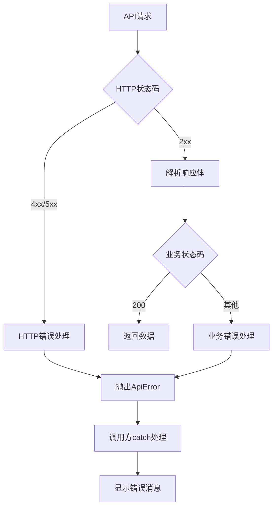

# 摩塔 Mota 项目优化方案

## 文档概述

- **编写日期**: 2025-12-24
- **基于测试报告**: `docs/测试报告.md`
- **问题总数**: 8个
- **技术栈**: 
  - 后端: Spring Boot + MyBatis Plus + MySQL
  - 前端: React + TypeScript + Ant Design + Vite

---

## 问题修复优先级总览

| 优先级 | BUG编号 | 问题描述 | 预估工时 |
|--------|---------|----------|----------|
| P0 (立即) | BUG-001 | JavaScript数字精度问题 | 4h |
| P1 (尽快) | BUG-002 | 短信验证码验证缺失 | 1h |
| P1 (尽快) | BUG-003 | 创建项目按钮缺失 | 0.5h |
| P2 (计划) | BUG-004 | 登录错误提示 | 1h |
| P2 (计划) | BUG-005 | useForm警告 | 0.5h |
| P3 (低优) | BUG-006 | Antd Message警告 | 0.5h |
| P3 (低优) | BUG-007 | autocomplete属性 | 0.5h |
| P3 (低优) | BUG-008 | 资源加载失败 | 0.5h |
| **总计** | | | **8.5h** |

---

## 详细修复方案

### 🔴 BUG-001: JavaScript 数字精度问题 (严重)

#### 问题根因分析

1. **ID生成机制**: 后端使用 MyBatis Plus 的 `@TableId(type = IdType.ASSIGN_ID)` 生成雪花算法ID
   - 位置: [`BaseEntityDO.java`](mota-service/mota-common/mota-common-mybatis/src/main/java/com/mota/common/mybatis/base/BaseEntityDO.java:21)
   - 生成的ID为64位Long类型，如 `2003641033184714753`

2. **JavaScript限制**: JavaScript的Number类型使用IEEE 754双精度浮点数
   - 安全整数范围: `Number.MAX_SAFE_INTEGER = 2^53 - 1 = 9007199254740991`
   - 雪花算法ID超出此范围，导致精度丢失

3. **JSON序列化问题**: 后端返回JSON时，Long类型直接序列化为数字
   - 前端 `fetch` 解析JSON时自动转换为Number，发生精度丢失
   - 位置: [`request.ts`](mota-user/src/services/request.ts:163) - `await response.json()`

4. **前端类型定义**: 前端将ID定义为 `number` 类型
   - 位置: [`project.ts`](mota-user/src/services/api/project.ts:11) - `id: number`

#### 具体修复方案

**方案A: 后端Long类型序列化为字符串 (推荐)**

**步骤1**: 创建全局Jackson配置

```java
// 文件: mota-service/mota-common/mota-common-core/src/main/java/com/mota/common/core/config/JacksonConfig.java

package com.mota.common.core.config;

import com.fasterxml.jackson.databind.ObjectMapper;
import com.fasterxml.jackson.databind.module.SimpleModule;
import com.fasterxml.jackson.databind.ser.std.ToStringSerializer;
import org.springframework.context.annotation.Bean;
import org.springframework.context.annotation.Configuration;
import org.springframework.http.converter.json.Jackson2ObjectMapperBuilder;

@Configuration
public class JacksonConfig {

    @Bean
    public ObjectMapper objectMapper(Jackson2ObjectMapperBuilder builder) {
        ObjectMapper objectMapper = builder.createXmlMapper(false).build();
        
        // 将Long类型序列化为字符串，解决JavaScript精度问题
        SimpleModule simpleModule = new SimpleModule();
        simpleModule.addSerializer(Long.class, ToStringSerializer.instance);
        simpleModule.addSerializer(Long.TYPE, ToStringSerializer.instance);
        objectMapper.registerModule(simpleModule);
        
        return objectMapper;
    }
}
```

**步骤2**: 更新前端类型定义

```typescript
// 文件: mota-user/src/services/api/project.ts

export interface Project {
  id: string  // 改为 string 类型
  name: string
  key: string
  // ... 其他字段
  ownerId: string  // 改为 string 类型
}
```

**步骤3**: 更新前端页面中的ID使用

```typescript
// 文件: mota-user/src/pages/projects/index.tsx

interface Project {
  id: string  // 改为 string 类型
  // ... 其他字段
}
```

#### 涉及文件列表

| 文件路径 | 修改类型 | 说明 |
|----------|----------|------|
| `mota-service/mota-common/mota-common-core/src/main/java/com/mota/common/core/config/JacksonConfig.java` | 新增 | Jackson全局配置 |
| `mota-user/src/services/api/project.ts` | 修改 | ID类型改为string |
| `mota-user/src/services/api/task.ts` | 修改 | ID类型改为string |
| `mota-user/src/services/api/milestone.ts` | 修改 | ID类型改为string |
| `mota-user/src/pages/projects/index.tsx` | 修改 | Project接口ID类型 |
| `mota-user/src/pages/project-detail/index.tsx` | 修改 | ID类型处理 |

#### 预估工作量

- 后端配置: 1小时
- 前端类型修改: 2小时
- 测试验证: 1小时
- **总计: 4小时**

---

### 🟠 BUG-002: 注册页面短信验证码无需手机号即可发送 (高)

#### 问题根因分析

1. **验证逻辑缺失**: `handleSendCode` 函数直接显示成功消息，未验证手机号
   - 位置: [`Register/index.tsx`](mota-user/src/pages/auth/Register/index.tsx:54-57)

```typescript
// 当前代码 - 无验证
const handleSendCode = () => {
  message.success('验证码已发送')
}
```

#### 具体修复方案

```typescript
// 文件: mota-user/src/pages/auth/Register/index.tsx

// 添加 Form 实例引用
const [phoneForm] = Form.useForm()

// 修改发送验证码函数
const handleSendCode = async () => {
  try {
    // 验证手机号字段
    const values = await phoneForm.validateFields(['phone'])
    const phone = values.phone
    
    if (!phone) {
      message.error('请输入手机号')
      return
    }
    
    // 验证手机号格式
    const phoneRegex = /^1[3-9]\d{9}$/
    if (!phoneRegex.test(phone)) {
      message.error('请输入有效的手机号')
      return
    }
    
    // TODO: 调用后端发送验证码API
    // await sendSmsCode(phone)
    
    message.success('验证码已发送')
    // 可选: 添加倒计时逻辑
  } catch (error) {
    // 表单验证失败，不做处理（会自动显示错误提示）
  }
}

// 更新表单，添加 form 属性
<Form
  form={phoneForm}  // 添加此行
  name="verifyPhone"
  onFinish={handleVerifyPhone}
  size="large"
  layout="vertical"
>
```

#### 涉及文件列表

| 文件路径 | 修改类型 | 说明 |
|----------|----------|------|
| `mota-user/src/pages/auth/Register/index.tsx` | 修改 | 添加手机号验证逻辑 |

#### 预估工作量

- 前端修改: 0.5小时
- 测试验证: 0.5小时
- **总计: 1小时**

---

### 🟠 BUG-003: 项目管理页面缺少"创建项目"按钮 (高)

#### 问题根因分析

经过代码分析，发现项目管理页面**已经存在**"新建项目"按钮：
- 位置: [`projects/index.tsx`](mota-user/src/pages/projects/index.tsx:1965-1972)

```typescript
<Button
  type="primary"
  icon={<PlusOutlined />}
  onClick={openCreateDrawer}
  className={styles.createBtn}
>
  新建项目
</Button>
```

**可能原因**:
1. CSS样式问题导致按钮不可见
2. 按钮位置不明显
3. 测试时页面未完全加载

#### 具体修复方案

**步骤1**: 检查并优化按钮样式

```css
/* 文件: mota-user/src/pages/projects/index.module.css */

.createBtn {
  /* 确保按钮可见 */
  display: inline-flex !important;
  align-items: center;
  gap: 8px;
  /* 增加视觉突出 */
  box-shadow: 0 2px 8px rgba(0, 47, 167, 0.3);
}

.header {
  display: flex;
  justify-content: space-between;
  align-items: center;
  /* 确保头部区域可见 */
  min-height: 60px;
  padding: 16px 24px;
}
```

**步骤2**: 在空状态时也显示创建按钮（已实现）

```typescript
// 已存在于代码中 - 确认无需修改
<Empty description="暂无项目">
  <Button type="primary" onClick={openCreateDrawer}>
    创建第一个项目
  </Button>
</Empty>
```

#### 涉及文件列表

| 文件路径 | 修改类型 | 说明 |
|----------|----------|------|
| `mota-user/src/pages/projects/index.module.css` | 修改 | 优化按钮样式 |

#### 预估工作量

- 样式调整: 0.5小时
- **总计: 0.5小时**

---

### 🟡 BUG-004: 登录失败时错误信息未显示 (中)

#### 问题根因分析

1. **错误处理已存在**: 登录页面已有错误处理逻辑
   - 位置: [`Login/index.tsx`](mota-user/src/pages/auth/Login/index.tsx:64-69)

```typescript
} catch (error) {
  if (error instanceof ApiError) {
    message.error(error.message || '登录失败')
  } else {
    message.error('网络错误，请稍后重试')
  }
}
```

2. **问题可能原因**:
   - `request.ts` 中已经显示了错误消息，导致重复或冲突
   - 位置: [`request.ts`](mota-user/src/services/request.ts:187-189)
   - 错误消息可能被覆盖或未正确传递

#### 具体修复方案

**方案**: 优化错误处理流程，避免重复显示

```typescript
// 文件: mota-user/src/services/request.ts

// 修改业务错误处理，不自动显示消息，让调用方决定
switch (result.code) {
  case 401:
    // 未授权处理保持不变
    break
  case 403:
    // 不自动显示，让调用方处理
    break
  default:
    // 移除自动显示: message.error(result.message || '操作失败')
    break
}

throw new ApiError(result.code, result.message, result.data)
```

```typescript
// 文件: mota-user/src/pages/auth/Login/index.tsx

// 确保错误消息正确显示
} catch (error) {
  if (error instanceof ApiError) {
    // 显示后端返回的具体错误信息
    message.error(error.message || '用户名或密码错误')
  } else {
    message.error('网络错误，请稍后重试')
  }
}
```

#### 涉及文件列表

| 文件路径 | 修改类型 | 说明 |
|----------|----------|------|
| `mota-user/src/services/request.ts` | 修改 | 优化错误处理流程 |
| `mota-user/src/pages/auth/Login/index.tsx` | 修改 | 确保错误显示 |

#### 预估工作量

- 代码修改: 0.5小时
- 测试验证: 0.5小时
- **总计: 1小时**

---

### 🟡 BUG-005: useForm 未连接到 Form 元素警告 (中)

#### 问题根因分析

1. **警告来源**: 项目管理页面使用了多个 `Form.useForm()` 但可能未正确连接
   - 位置: [`projects/index.tsx`](mota-user/src/pages/projects/index.tsx:129)

```typescript
const [form] = Form.useForm()
// ...
const [editForm] = Form.useForm()
// ...
const [settingsForm] = Form.useForm()
```

2. **问题原因**: 某些表单实例创建后，对应的 Form 组件可能未渲染或未传递 `form` 属性

#### 具体修复方案

检查所有 Form 组件确保正确传递 `form` 属性：

```typescript
// 文件: mota-user/src/pages/projects/index.tsx

// 步骤1的表单 - 确认已正确连接
<Form
  form={form}  // ✓ 已连接
  layout="vertical"
  // ...
>

// 编辑表单 - 确认已正确连接
<Form
  form={editForm}  // ✓ 已连接
  layout="vertical"
  onFinish={handleEditProject}
  // ...
>

// 设置表单 - 确认已正确连接
<Form
  form={settingsForm}  // ✓ 已连接
  layout="vertical"
  name="settingsForm"
>
```

**可能的问题**: 条件渲染导致 Form 未挂载时 useForm 已创建

**解决方案**: 将 useForm 移到对应的 Drawer 组件内部，或使用懒加载

```typescript
// 优化方案: 仅在 Drawer 打开时创建表单实例
const renderCreateDrawer = () => {
  // 移动到这里，确保 Form 渲染时才创建
  return (
    <Drawer open={drawerVisible}>
      <Form form={form}>
        {/* ... */}
      </Form>
    </Drawer>
  )
}
```

#### 涉及文件列表

| 文件路径 | 修改类型 | 说明 |
|----------|----------|------|
| `mota-user/src/pages/projects/index.tsx` | 修改 | 优化表单实例管理 |

#### 预估工作量

- 代码修改: 0.5小时
- **总计: 0.5小时**

---

### 🟢 BUG-006: Antd Message 静态函数警告 (低)

#### 问题根因分析

1. **警告内容**: `Static function can not consume context like dynamic theme`
2. **原因**: 使用 `message.success()` 等静态方法无法获取 ConfigProvider 的主题上下文
3. **当前状态**: 已使用 `AntdApp` 包裹应用
   - 位置: [`main.tsx`](mota-user/src/main.tsx:21)

#### 具体修复方案

**方案**: 使用 App.useApp() hook 获取 message 实例

```typescript
// 文件: mota-user/src/hooks/useMessage.ts (新建)

import { App } from 'antd'

/**
 * 获取支持主题的 message 实例
 */
export const useMessage = () => {
  const { message, notification, modal } = App.useApp()
  return { message, notification, modal }
}
```

```typescript
// 文件: mota-user/src/pages/auth/Login/index.tsx

import { useMessage } from '@/hooks/useMessage'

const Login = () => {
  const { message } = useMessage()
  
  // 使用 message 实例而非静态方法
  message.success('登录成功')
}
```

**注意**: 这需要在所有使用 `message` 的组件中进行修改，工作量较大。可以考虑：
1. 逐步迁移
2. 或者忽略此警告（不影响功能）

#### 涉及文件列表

| 文件路径 | 修改类型 | 说明 |
|----------|----------|------|
| `mota-user/src/hooks/useMessage.ts` | 新增 | 创建 hook |
| `mota-user/src/pages/auth/Login/index.tsx` | 修改 | 使用 hook |
| `mota-user/src/pages/auth/Register/index.tsx` | 修改 | 使用 hook |
| `mota-user/src/pages/projects/index.tsx` | 修改 | 使用 hook |
| 其他使用 message 的文件 | 修改 | 使用 hook |

#### 预估工作量

- 创建 hook: 0.5小时
- 逐步迁移（可选）: 2-4小时
- **最小修复: 0.5小时**

---

### 🟢 BUG-007: 注册页面输入框缺少 autocomplete 属性 (低)

#### 问题根因分析

1. **警告内容**: `Input elements should have autocomplete attributes`
2. **位置**: 注册页面的密码输入框
   - [`Register/index.tsx`](mota-user/src/pages/auth/Register/index.tsx:102-106)

#### 具体修复方案

```typescript
// 文件: mota-user/src/pages/auth/Register/index.tsx

// 密码输入框
<Input.Password
  prefix={<LockOutlined />}
  placeholder="请设置密码（至少8位）"
  autoComplete="new-password"  // 添加此属性
/>

// 确认密码输入框
<Input.Password
  prefix={<LockOutlined />}
  placeholder="请再次输入密码"
  autoComplete="new-password"  // 添加此属性
/>

// 手机号输入框
<Input
  prefix={<MobileOutlined />}
  placeholder="请输入手机号"
  autoComplete="tel"  // 添加此属性
/>

// 邮箱输入框
<Input
  prefix={<MailOutlined />}
  placeholder="请输入邮箱地址"
  autoComplete="email"  // 添加此属性
/>

// 姓名输入框
<Input
  prefix={<UserOutlined />}
  placeholder="请输入您的姓名"
  autoComplete="name"  // 添加此属性
/>
```

#### 涉及文件列表

| 文件路径 | 修改类型 | 说明 |
|----------|----------|------|
| `mota-user/src/pages/auth/Register/index.tsx` | 修改 | 添加 autocomplete 属性 |

#### 预估工作量

- 代码修改: 0.5小时
- **总计: 0.5小时**

---

### 🟢 BUG-008: 帮助中心页面资源加载失败 (低)

#### 问题根因分析

1. **错误内容**: `Failed to load resource: net::ERR_NAME_NOT_RESOLVED`
2. **问题来源**: 视频教程缩略图使用外部占位图服务
   - 位置: [`help/index.tsx`](mota-user/src/pages/help/index.tsx:89-104)

```typescript
const videoTutorials = [
  {
    title: '摩塔入门教程',
    duration: '5:30',
    thumbnail: 'https://via.placeholder.com/160x90/6366f1/ffffff?text=Tutorial'  // 外部服务
  },
  // ...
]
```

#### 具体修复方案

**方案1**: 使用本地占位图

```typescript
// 文件: mota-user/src/pages/help/index.tsx

const videoTutorials = [
  {
    title: '摩塔入门教程',
    duration: '5:30',
    thumbnail: '/images/tutorial-placeholder.png'  // 使用本地图片
  },
  // ...
]
```

**方案2**: 使用 CSS 生成占位图

```typescript
// 文件: mota-user/src/pages/help/index.tsx

const videoTutorials = [
  {
    title: '摩塔入门教程',
    duration: '5:30',
    thumbnail: null  // 不使用图片
  },
  // ...
]

// 渲染时使用 CSS 背景
<div className={styles.videoThumbnail}>
  {video.thumbnail ? (
    
  ) : (
    <div className={styles.placeholderThumbnail}>
      <PlayCircleOutlined />
    </div>
  )}
</div>
```

```css
/* 文件: mota-user/src/pages/help/index.module.css */

.placeholderThumbnail {
  width: 160px;
  height: 90px;
  background: linear-gradient(135deg, #6366f1 0%, #4f46e5 100%);
  display: flex;
  align-items: center;
  justify-content: center;
  color: white;
  font-size: 32px;
  border-radius: 8px;
}
```

#### 涉及文件列表

| 文件路径 | 修改类型 | 说明 |
|----------|----------|------|
| `mota-user/src/pages/help/index.tsx` | 修改 | 移除外部资源依赖 |
| `mota-user/src/pages/help/index.module.css` | 修改 | 添加占位样式 |
| `mota-user/public/images/` | 新增 | 本地占位图（可选） |

#### 预估工作量

- 代码修改: 0.5小时
- **总计: 0.5小时**

---

## 整体架构优化建议

### 1. ID处理统一规范

建议在项目中建立统一的ID处理规范：

```typescript
// 文件: mota-user/src/types/common.ts

/**
 * 实体ID类型 - 统一使用字符串避免精度问题
 */
export type EntityId = string

/**
 * 基础实体接口
 */
export interface BaseEntity {
  id: EntityId
  createdAt?: string
  updatedAt?: string
  createdBy?: EntityId
  updatedBy?: EntityId
}
```

### 2. 表单验证统一处理

建议创建统一的表单验证工具：

```typescript
// 文件: mota-user/src/utils/validators.ts

export const validators = {
  phone: {
    pattern: /^1[3-9]\d{9}$/,
    message: '请输入有效的11位手机号'
  },
  password: {
    min: 6,
    max: 18,
    message: '密码长度为6-18位'
  },
  email: {
    pattern: /^[^\s@]+@[^\s@]+\.[^\s@]+$/,
    message: '请输入有效的邮箱地址'
  }
}
```

### 3. 错误处理统一规范

建议统一错误处理流程：



---

## 实施计划

### 第一阶段: 紧急修复 (Day 1)

| 时间 | 任务 | 负责人 |
|------|------|--------|
| 上午 | BUG-001: JavaScript数字精度问题 | 后端+前端 |
| 下午 | BUG-002: 短信验证码验证 | 前端 |
| 下午 | BUG-003: 创建项目按钮样式 | 前端 |

### 第二阶段: 计划修复 (Day 2)

| 时间 | 任务 | 负责人 |
|------|------|--------|
| 上午 | BUG-004: 登录错误提示 | 前端 |
| 上午 | BUG-005: useForm警告 | 前端 |
| 下午 | BUG-006: Antd Message警告 | 前端 |
| 下午 | BUG-007: autocomplete属性 | 前端 |
| 下午 | BUG-008: 资源加载失败 | 前端 |

### 第三阶段: 回归测试 (Day 3)

| 时间 | 任务 | 负责人 |
|------|------|--------|
| 全天 | 全面回归测试 | QA |
| 全天 | 修复测试中发现的问题 | 开发 |

---

## 测试验证清单

### BUG-001 验证

- [ ] 项目列表正常加载
- [ ] 点击项目卡片能正确跳转到详情页
- [ ] 项目ID在前端正确显示（无精度丢失）
- [ ] 项目编辑、删除功能正常

### BUG-002 验证

- [ ] 未输入手机号时点击"获取验证码"显示错误提示
- [ ] 输入无效手机号时显示格式错误提示
- [ ] 输入有效手机号后能正常发送验证码

### BUG-003 验证

- [ ] 项目管理页面"新建项目"按钮可见
- [ ] 点击按钮能打开创建项目抽屉
- [ ] 空状态时"创建第一个项目"按钮可见

### BUG-004 验证

- [ ] 输入错误密码登录时显示"用户名或密码错误"
- [ ] 错误消息清晰可见
- [ ] 不会出现重复的错误提示

### BUG-005 验证

- [ ] 控制台无 useForm 相关警告
- [ ] 表单功能正常工作

### BUG-006 验证

- [ ] 控制台无 Antd Message 静态函数警告
- [ ] 消息提示正常显示
- [ ] 主题切换时消息样式正确

### BUG-007 验证

- [ ] 控制台无 autocomplete 相关警告
- [ ] 浏览器自动填充功能正常

### BUG-008 验证

- [ ] 帮助中心页面无资源加载错误
- [ ] 视频教程缩略图正常显示

---

## 附录

### A. 相关文件索引

| 模块 | 文件路径 |
|------|----------|
| 后端基础实体 | `mota-service/mota-common/mota-common-mybatis/src/main/java/com/mota/common/mybatis/base/BaseEntityDO.java` |
| 后端项目控制器 | `mota-service/mota-project-service/src/main/java/com/mota/project/controller/ProjectController.java` |
| 后端项目实体 | `mota-service/mota-project-service/src/main/java/com/mota/project/entity/Project.java` |
| 前端请求封装 | `mota-user/src/services/request.ts` |
| 前端项目API | `mota-user/src/services/api/project.ts` |
| 前端项目页面 | `mota-user/src/pages/projects/index.tsx` |
| 前端登录页面 | `mota-user/src/pages/auth/Login/index.tsx` |
| 前端注册页面 | `mota-user/src/pages/auth/Register/index.tsx` |
| 前端帮助页面 | `mota-user/src/pages/help/index.tsx` |
| 前端入口文件 | `mota-user/src/main.tsx` |

### B. 参考资料

- [JavaScript Number.MAX_SAFE_INTEGER](https://developer.mozilla.org/en-US/docs/Web/JavaScript/Reference/Global_Objects/Number/MAX_SAFE_INTEGER)
- [Jackson Long序列化配置](https://github.com/FasterXML/jackson-databind)
- [Ant Design App组件](https://ant.design/components/app-cn)
- [HTML autocomplete属性](https://developer.mozilla.org/en-US/docs/Web/HTML/Attributes/autocomplete)

---

**文档编写**: AI Assistant  
**最后更新**: 2025-12-24