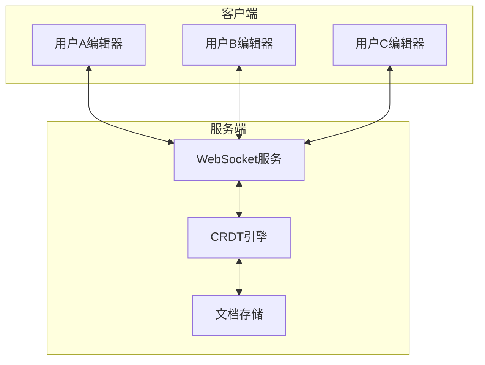
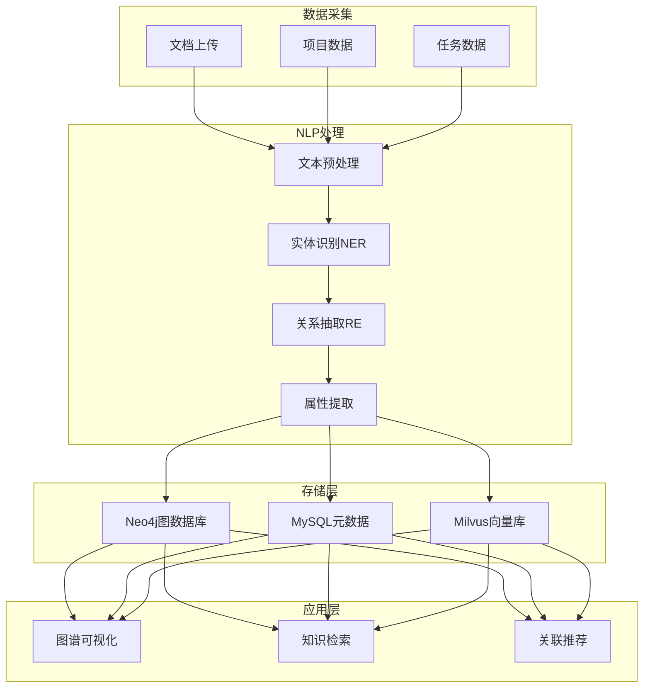

# 魔塔 Mota - 技术实施计划

## 文档信息
- **版本**: v1.1
- **创建日期**: 2025-12-25
- **最后更新**: 2025-12-25
- **基于**: 产品设计文档 v2.0
- **状态**: 实施中

---

## 目录
1. [现状分析](#1-现状分析)
2. [功能差距分析](#2-功能差距分析)
3. [实施优先级](#3-实施优先级)
4. [详细实施方案](#4-详细实施方案)
5. [数据库迁移计划](#5-数据库迁移计划)
6. [API设计规范](#6-api设计规范)
7. [前端组件规划](#7-前端组件规划)
8. [测试策略](#8-测试策略)
9. [风险评估](#9-风险评估)

---

## 1. 现状分析

### 1.1 已实现功能

#### 后端服务 (mota-service)

| 模块 | 实体 | 控制器 | 服务 | 状态 |
|------|------|--------|------|------|
| 项目管理 | Project | ProjectController | ProjectService | ✅ 已实现 |
| 部门任务 | DepartmentTask | DepartmentTaskController | DepartmentTaskService | ✅ 已实现 |
| 执行任务 | Task | TaskController | TaskService | ✅ 已实现 |
| 里程碑 | Milestone | MilestoneController | MilestoneService | ✅ 已实现 |
| 交付物 | Deliverable | DeliverableController | DeliverableService | ✅ 已实现 |
| 工作计划 | WorkPlan | WorkPlanController | WorkPlanService | ✅ 已实现 |
| 工作反馈 | WorkFeedback | WorkFeedbackController | WorkFeedbackService | ✅ 已实现 |
| 进度汇报 | ProgressReport | ProgressReportController | ProgressReportService | ✅ 已实现 |
| 任务评论 | TaskComment | TaskCommentController | TaskCommentService | ✅ 已实现 |
| 通知 | Notification | NotificationController | NotificationService | ✅ 已实现 |
| 活动记录 | Activity | ActivityController | - | ⚠️ 基础实现 |
| AI功能 | AIHistory, AINews | AIController | - | ⚠️ 基础实现 |
| 部门 | Department | DepartmentController | - | ✅ 已实现 |
| 用户 | User | UserController | - | ✅ 已实现 |

#### 前端应用 (mota-user)

| 页面/组件 | 路径 | 状态 |
|----------|------|------|
| 登录页 | /auth/Login | ✅ 已实现 |
| 注册页 | /auth/Register | ✅ 已实现 |
| 忘记密码 | /auth/ForgotPassword | ✅ 已实现 |
| 仪表盘 | /dashboard | ✅ 已实现 |
| 项目列表 | /projects | ✅ 已实现 |
| 项目详情 | /project-detail | ✅ 已实现 |
| 创建项目 | /projects/create | ✅ 已实现 |
| 任务详情 | /task-detail | ✅ 已实现 |
| 部门任务详情 | /department-task-detail | ✅ 已实现 |
| 我的任务 | /my-tasks | ✅ 已实现 |
| 成员管理 | /members | ✅ 已实现 |
| 通知中心 | /notifications | ✅ 已实现 |
| 个人设置 | /profile | ✅ 已实现 |
| 系统设置 | /settings | ✅ 已实现 |
| 帮助中心 | /help | ✅ 已实现 |
| 里程碑时间线 | MilestoneTimeline | ✅ 组件已实现 |
| 交付物列表 | DeliverableList | ✅ 组件已实现 |
| 工作计划上传 | WorkPlanUpload | ✅ 组件已实现 |
| 工作计划审批 | WorkPlanApproval | ✅ 组件已实现 |
| 工作反馈 | WorkFeedback | ✅ 组件已实现 |

#### 数据库 (V2.0)

已创建的表：
- `project` - 项目表
- `department` - 部门表
- `department_task` - 部门任务表
- `work_plan` - 工作计划表
- `work_plan_attachment` - 工作计划附件表
- `task` - 执行任务表
- `deliverable` - 交付物表
- `milestone` - 里程碑表
- `project_member` - 项目成员表
- `task_comment` - 任务评论表
- `comment_attachment` - 评论附件表
- `work_feedback` - 工作反馈表
- `progress_report` - 进度汇报表
- `notification` - 通知表
- `department_task_attachment` - 部门任务附件表
- `project_department` - 项目部门关联表

### 1.2 技术栈现状

| 层级 | 技术 | 版本 |
|------|------|------|
| 前端框架 | React + TypeScript | 18.x |
| 状态管理 | - | 待确认 |
| UI组件库 | Ant Design | 5.x |
| 构建工具 | Vite | - |
| 后端框架 | Spring Boot | 3.x |
| ORM | MyBatis-Plus | - |
| 数据库 | MySQL | 8.x |
| 缓存 | Redis | - |

---

## 2. 功能差距分析

### 2.1 项目管理模块差距

| 功能 | 设计要求 | 当前状态 | 差距 | 优先级 |
|------|---------|---------|------|--------|
| 看板视图 | 拖拽式任务卡片 | ⚠️ 基础列表 | 需要实现拖拽功能 | P0 |
| 列表视图 | 表格形式，支持排序筛选 | ✅ 已有 | 需增强筛选 | P1 |
| 甘特图视图 | 时间轴展示，显示依赖关系 | ❌ 未实现 | 需要完整实现 | P0 |
| 日历视图 | 按日期展示任务和里程碑 | ❌ 未实现 | 需要完整实现 | P1 |
| 时间线视图 | 按时间顺序展示项目活动 | ❌ 未实现 | 需要完整实现 | P2 |
| 任务依赖关系 | FS/SS/FF/SF四种类型 | ❌ 未实现 | 需要完整实现 | P0 |
| 子任务 | 多级子任务支持 | ❌ 未实现 | 需要完整实现 | P1 |
| 检查清单 | Checklist功能 | ❌ 未实现 | 需要完整实现 | P1 |
| 燃尽图 | Sprint和项目级别 | ❌ 未实现 | 需要完整实现 | P1 |
| 任务模板 | 模板创建和使用 | ❌ 未实现 | 需要完整实现 | P2 |

### 2.2 团队协作模块差距

| 功能 | 设计要求 | 当前状态 | 差距 | 优先级 |
|------|---------|---------|------|--------|
| 实时文档协作 | 多人同时编辑 | ❌ 未实现 | 需要WebSocket+CRDT | P0 |
| 文档版本历史 | 版本对比和回滚 | ❌ 未实现 | 需要完整实现 | P1 |
| 文档模板库 | 预置和自定义模板 | ❌ 未实现 | 需要完整实现 | P2 |
| 个人日历 | 个人事项管理 | ✅ 已实现 | - | P1 |
| 团队日历 | 团队共享事件 | ✅ 已实现 | - | P1 |
| 项目日历 | 里程碑和截止日期 | ✅ 已实现 | - | P1 |
| 通知聚合 | 相似通知合并 | ✅ 已实现 | - | P1 |
| 智能分类 | AI自动分类优先级 | ✅ 已实现 | - | P2 |
| 免打扰模式 | 设置免打扰时段 | ✅ 已实现 | - | P2 |

### 2.3 知识管理模块差距

| 功能 | 设计要求 | 当前状态 | 差距 | 优先级 |
|------|---------|---------|------|--------|
| 知识图谱构建 | 实体识别和关系抽取 | ❌ 未实现 | 需要NLP+图数据库 | P1 |
| 知识图谱可视化 | 交互式图谱展示 | ❌ 未实现 | 需要前端图谱组件 | P1 |
| 文档模板管理 | 模板CRUD | ❌ 未实现 | 需要完整实现 | P2 |
| 任务模板管理 | 模板CRUD | ❌ 未实现 | 需要完整实现 | P2 |
| 知识使用统计 | 访问量和热门排行 | ❌ 未实现 | 需要完整实现 | P2 |

### 2.4 AI智能模块差距

| 功能 | 设计要求 | 当前状态 | 差距 | 优先级 |
|------|---------|---------|------|--------|
| 多模型支持 | GPT-4/Claude/通义千问 | ⚠️ 基础实现 | 需要模型路由 | P1 |
| RAG检索增强 | 向量检索+知识库 | ❌ 未实现 | 需要向量数据库 | P1 |
| 方案生成 | 结构化方案输出 | ⚠️ 基础实现 | 需要增强 | P1 |
| 智能新闻推送 | 个性化推荐 | ⚠️ 基础实现 | 需要推荐算法 | P2 |

---

## 3. 实施优先级

### 3.1 Phase 1: MVP增强 (Week 1-4)

**目标**: 完善核心项目管理功能

| 序号 | 功能 | 工作量 | 负责人 | 依赖 |
|------|------|--------|--------|------|
| 1.1 | 任务依赖关系 | 5天 | 后端+前端 | 无 |
| 1.2 | 看板视图拖拽 | 3天 | 前端 | 无 |
| 1.3 | 甘特图视图 | 5天 | 前端 | 1.1 |
| 1.4 | 子任务功能 | 3天 | 后端+前端 | 无 |
| 1.5 | 检查清单功能 | 2天 | 后端+前端 | 无 |

### 3.2 Phase 2: 协作增强 (Week 5-8)

**目标**: 实现实时协作和日程管理

| 序号 | 功能 | 工作量 | 负责人 | 依赖 |
|------|------|--------|--------|------|
| 2.1 | 日历事件表设计 | 2天 | 后端 | 无 |
| 2.2 | 日历视图组件 | 4天 | 前端 | 2.1 |
| 2.3 | 实时文档协作 | 8天 | 全栈 | 无 |
| 2.4 | 通知聚合功能 | 3天 | 后端+前端 | 无 |
| 2.5 | 燃尽图组件 | 3天 | 前端 | 无 |

### 3.3 Phase 3: 知识图谱 (Week 9-12)

**目标**: 实现知识图谱构建和可视化

| 序号 | 功能 | 工作量 | 负责人 | 依赖 |
|------|------|--------|--------|------|
| 3.1 | 知识图谱数据库设计 | 3天 | 后端 | 无 |
| 3.2 | 实体识别服务 | 5天 | AI工程师 | 无 |
| 3.3 | 关系抽取服务 | 5天 | AI工程师 | 3.2 |
| 3.4 | 图谱可视化组件 | 5天 | 前端 | 3.1 |
| 3.5 | 模板库功能 | 4天 | 后端+前端 | 无 |

### 3.4 Phase 4: AI增强 (Week 13-16)

**目标**: 增强AI能力和智能推荐

| 序号 | 功能 | 工作量 | 负责人 | 依赖 |
|------|------|--------|--------|------|
| 4.1 | 向量数据库集成 | 5天 | 后端 | 无 |
| 4.2 | RAG检索增强 | 5天 | AI工程师 | 4.1 |
| 4.3 | 多模型路由 | 3天 | 后端 | 无 |
| 4.4 | 智能通知分类 | 3天 | AI工程师 | 无 |
| 4.5 | 知识使用统计 | 3天 | 后端+前端 | 无 |

---

## 4. 详细实施方案

### 4.1 任务依赖关系实现

#### 4.1.1 数据库设计

```sql
-- 任务依赖关系表
CREATE TABLE task_dependency (
    id BIGINT PRIMARY KEY AUTO_INCREMENT,
    task_id BIGINT NOT NULL COMMENT '任务ID',
    depends_on_task_id BIGINT NOT NULL COMMENT '依赖的任务ID',
    dependency_type ENUM('FS', 'SS', 'FF', 'SF') DEFAULT 'FS' COMMENT '依赖类型',
    lag_days INT DEFAULT 0 COMMENT '延迟天数',
    created_at TIMESTAMP DEFAULT CURRENT_TIMESTAMP,
    created_by BIGINT NOT NULL,
    
    FOREIGN KEY (task_id) REFERENCES task(id) ON DELETE CASCADE,
    FOREIGN KEY (depends_on_task_id) REFERENCES task(id) ON DELETE CASCADE,
    UNIQUE KEY uk_task_dependency (task_id, depends_on_task_id),
    INDEX idx_task (task_id),
    INDEX idx_depends_on (depends_on_task_id)
) ENGINE=InnoDB DEFAULT CHARSET=utf8mb4 COMMENT='任务依赖关系表';
```

#### 4.1.2 后端实现

**实体类**: `TaskDependency.java`
```java
@Data
@TableName("task_dependency")
public class TaskDependency extends BaseEntityDO {
    private Long taskId;
    private Long dependsOnTaskId;
    private String dependencyType; // FS, SS, FF, SF
    private Integer lagDays;
}
```

**服务接口**: `TaskDependencyService.java`
```java
public interface TaskDependencyService {
    // 添加依赖关系
    void addDependency(Long taskId, Long dependsOnTaskId, String type, Integer lagDays);
    
    // 删除依赖关系
    void removeDependency(Long taskId, Long dependsOnTaskId);
    
    // 获取任务的所有依赖
    List<TaskDependency> getDependencies(Long taskId);
    
    // 获取依赖此任务的所有任务
    List<TaskDependency> getDependents(Long taskId);
    
    // 检测循环依赖
    boolean hasCircularDependency(Long taskId, Long dependsOnTaskId);
    
    // 计算关键路径
    List<Task> calculateCriticalPath(Long projectId);
}
```

**API端点**:
- `POST /api/tasks/{taskId}/dependencies` - 添加依赖
- `DELETE /api/tasks/{taskId}/dependencies/{dependsOnTaskId}` - 删除依赖
- `GET /api/tasks/{taskId}/dependencies` - 获取依赖列表
- `GET /api/projects/{projectId}/critical-path` - 获取关键路径

#### 4.1.3 前端实现

**依赖关系组件**: `TaskDependencyEditor.tsx`
```typescript
interface TaskDependencyEditorProps {
  taskId: string;
  projectId: string;
  onDependencyChange?: () => void;
}

// 依赖类型选项
const DEPENDENCY_TYPES = [
  { value: 'FS', label: '完成-开始 (FS)' },
  { value: 'SS', label: '开始-开始 (SS)' },
  { value: 'FF', label: '完成-完成 (FF)' },
  { value: 'SF', label: '开始-完成 (SF)' },
];
```

### 4.2 甘特图视图实现

#### 4.2.1 技术选型

推荐使用 **DHTMLX Gantt** 或 **Frappe Gantt**：

| 库 | 优点 | 缺点 | 推荐度 |
|---|------|------|--------|
| DHTMLX Gantt | 功能完整，支持依赖关系 | 商业授权 | ⭐⭐⭐⭐⭐ |
| Frappe Gantt | 开源免费，轻量 | 功能较少 | ⭐⭐⭐⭐ |
| React-Gantt | React原生 | 功能有限 | ⭐⭐⭐ |

#### 4.2.2 组件设计

```typescript
interface GanttViewProps {
  projectId: string;
  tasks: Task[];
  dependencies: TaskDependency[];
  onTaskUpdate?: (task: Task) => void;
  onDependencyAdd?: (from: string, to: string) => void;
}

interface GanttTask {
  id: string;
  text: string;
  start_date: Date;
  end_date: Date;
  progress: number;
  parent?: string;
  dependencies?: string[];
}
```

#### 4.2.3 API设计

```typescript
// 获取甘特图数据
GET /api/projects/{projectId}/gantt
Response: {
  tasks: GanttTask[];
  dependencies: {
    id: string;
    source: string;
    target: string;
    type: string;
  }[];
  milestones: Milestone[];
}
```

### 4.3 实时文档协作实现

#### 4.3.1 技术架构



#### 4.3.2 技术选型

| 组件 | 推荐方案 | 备选方案 |
|------|---------|---------|
| 编辑器 | Slate.js | Quill |
| CRDT库 | Yjs | Automerge |
| WebSocket | Socket.io | ws |
| 后端 | Node.js | Spring WebSocket |

#### 4.3.3 数据库设计

```sql
-- 文档协作会话表
CREATE TABLE document_collaboration_session (
    id BIGINT PRIMARY KEY AUTO_INCREMENT,
    document_id BIGINT NOT NULL,
    session_token VARCHAR(100) UNIQUE NOT NULL,
    created_by BIGINT NOT NULL,
    status ENUM('active', 'closed') DEFAULT 'active',
    created_at TIMESTAMP DEFAULT CURRENT_TIMESTAMP,
    closed_at TIMESTAMP,
    
    FOREIGN KEY (document_id) REFERENCES document(id),
    INDEX idx_document_status (document_id, status)
) ENGINE=InnoDB DEFAULT CHARSET=utf8mb4;

-- 文档协作者表
CREATE TABLE document_collaborator (
    id BIGINT PRIMARY KEY AUTO_INCREMENT,
    session_id BIGINT NOT NULL,
    user_id BIGINT NOT NULL,
    cursor_position JSON,
    last_active_at TIMESTAMP DEFAULT CURRENT_TIMESTAMP,
    joined_at TIMESTAMP DEFAULT CURRENT_TIMESTAMP,
    left_at TIMESTAMP,
    
    FOREIGN KEY (session_id) REFERENCES document_collaboration_session(id),
    INDEX idx_session_user (session_id, user_id)
) ENGINE=InnoDB DEFAULT CHARSET=utf8mb4;

-- 文档版本历史表
CREATE TABLE document_version (
    id BIGINT PRIMARY KEY AUTO_INCREMENT,
    document_id BIGINT NOT NULL,
    version_number INT NOT NULL,
    content LONGTEXT NOT NULL,
    change_summary VARCHAR(500),
    created_by BIGINT NOT NULL,
    created_at TIMESTAMP DEFAULT CURRENT_TIMESTAMP,
    
    FOREIGN KEY (document_id) REFERENCES document(id),
    UNIQUE KEY uk_doc_version (document_id, version_number),
    INDEX idx_document (document_id)
) ENGINE=InnoDB DEFAULT CHARSET=utf8mb4;
```

### 4.4 日程管理实现

#### 4.4.1 数据库设计

```sql
-- 日历事件表
CREATE TABLE calendar_event (
    id BIGINT PRIMARY KEY AUTO_INCREMENT,
    org_id BIGINT NOT NULL,
    user_id BIGINT NOT NULL,
    title VARCHAR(255) NOT NULL,
    description TEXT,
    event_type ENUM('personal', 'team', 'project', 'task') DEFAULT 'personal',
    start_time DATETIME NOT NULL,
    end_time DATETIME NOT NULL,
    all_day BOOLEAN DEFAULT FALSE,
    location VARCHAR(255),
    color VARCHAR(20),
    recurrence_rule VARCHAR(255) COMMENT 'iCal RRULE格式',
    reminder_minutes INT,
    project_id BIGINT,
    task_id BIGINT,
    created_at TIMESTAMP DEFAULT CURRENT_TIMESTAMP,
    updated_at TIMESTAMP DEFAULT CURRENT_TIMESTAMP ON UPDATE CURRENT_TIMESTAMP,
    deleted INT DEFAULT 0,
    
    INDEX idx_user_time (user_id, start_time, end_time),
    INDEX idx_org_type (org_id, event_type)
) ENGINE=InnoDB DEFAULT CHARSET=utf8mb4;

-- 日历事件参与者表
CREATE TABLE calendar_event_attendee (
    id BIGINT PRIMARY KEY AUTO_INCREMENT,
    event_id BIGINT NOT NULL,
    user_id BIGINT NOT NULL,
    status ENUM('pending', 'accepted', 'declined', 'tentative') DEFAULT 'pending',
    created_at TIMESTAMP DEFAULT CURRENT_TIMESTAMP,
    
    FOREIGN KEY (event_id) REFERENCES calendar_event(id),
    UNIQUE KEY uk_event_user (event_id, user_id)
) ENGINE=InnoDB DEFAULT CHARSET=utf8mb4;
```

#### 4.4.2 API设计

```typescript
// 日历事件API
GET /api/calendar/events?start={date}&end={date}&type={type}
POST /api/calendar/events
PUT /api/calendar/events/{id}
DELETE /api/calendar/events/{id}

// 日历视图API
GET /api/calendar/view/day?date={date}
GET /api/calendar/view/week?date={date}
GET /api/calendar/view/month?date={date}

// 任务日历同步
GET /api/calendar/tasks?projectId={projectId}
```

#### 4.4.3 前端组件

推荐使用 **FullCalendar** 或 **React Big Calendar**：

```typescript
interface CalendarViewProps {
  userId: string;
  projectId?: string;
  view: 'day' | 'week' | 'month';
  onEventClick?: (event: CalendarEvent) => void;
  onEventCreate?: (start: Date, end: Date) => void;
}
```

### 4.5 知识图谱实现

#### 4.5.1 技术架构



#### 4.5.2 数据库设计

```sql
-- 知识实体表
CREATE TABLE knowledge_entity (
    id BIGINT PRIMARY KEY AUTO_INCREMENT,
    org_id BIGINT NOT NULL,
    name VARCHAR(255) NOT NULL,
    entity_type ENUM('PERSON', 'ORGANIZATION', 'PROJECT', 'DOCUMENT', 
                     'TECHNOLOGY', 'CONCEPT', 'EVENT', 'LOCATION') NOT NULL,
    description TEXT,
    properties JSON,
    source_document_id BIGINT,
    confidence_score DECIMAL(3,2),
    created_at TIMESTAMP DEFAULT CURRENT_TIMESTAMP,
    updated_at TIMESTAMP DEFAULT CURRENT_TIMESTAMP ON UPDATE CURRENT_TIMESTAMP,
    
    INDEX idx_org_type (org_id, entity_type),
    INDEX idx_name (name)
) ENGINE=InnoDB DEFAULT CHARSET=utf8mb4;

-- 知识关系表
CREATE TABLE knowledge_relation (
    id BIGINT PRIMARY KEY AUTO_INCREMENT,
    org_id BIGINT NOT NULL,
    source_entity_id BIGINT NOT NULL,
    target_entity_id BIGINT NOT NULL,
    relation_type ENUM('CREATED_BY', 'BELONGS_TO', 'RELATED_TO', 'DEPENDS_ON', 
                       'REFERENCES', 'PARTICIPATES', 'MANAGES', 'USES') NOT NULL,
    properties JSON,
    weight DECIMAL(5,4) DEFAULT 1.0,
    source_document_id BIGINT,
    confidence_score DECIMAL(3,2),
    created_at TIMESTAMP DEFAULT CURRENT_TIMESTAMP,
    
    FOREIGN KEY (source_entity_id) REFERENCES knowledge_entity(id),
    FOREIGN KEY (target_entity_id) REFERENCES knowledge_entity(id),
    INDEX idx_source (source_entity_id),
    INDEX idx_target (target_entity_id),
    INDEX idx_relation_type (relation_type)
) ENGINE=InnoDB DEFAULT CHARSET=utf8mb4;
```

#### 4.5.3 NLP服务设计

```python
# knowledge_extraction_service.py

from typing import List, Dict
import spacy
from transformers import pipeline

class KnowledgeExtractionService:
    def __init__(self):
        self.nlp = spacy.load("zh_core_web_lg")
        self.ner_pipeline = pipeline("ner", model="bert-base-chinese")
        self.re_pipeline = pipeline("text2text-generation", model="...")
    
    def extract_entities(self, text: str) -> List[Dict]:
        """提取实体"""
        doc = self.nlp(text)
        entities = []
        for ent in doc.ents:
            entities.append({
                "text": ent.text,
                "type": ent.label_,
                "start": ent.start_char,
                "end": ent.end_char
            })
        return entities
    
    def extract_relations(self, text: str, entities: List[Dict]) -> List[Dict]:
        """提取关系"""
        relations = []
        # 使用关系抽取模型
        for i, e1 in enumerate(entities):
            for e2 in entities[i+1:]:
                relation = self._predict_relation(text, e1, e2)
                if relation:
                    relations.append({
                        "source": e1,
                        "target": e2,
                        "relation": relation
                    })
        return relations
    
    def build_knowledge_graph(self, document_id: int, text: str):
        """构建知识图谱"""
        entities = self.extract_entities(text)
        relations = self.extract_relations(text, entities)
        
        # 存储到数据库
        self._save_entities(document_id, entities)
        self._save_relations(document_id, relations)
```

#### 4.5.4 图谱可视化组件

推荐使用 **D3.js** 或 **ECharts Graph**：

```typescript
interface KnowledgeGraphProps {
  orgId: string;
  entityTypes?: string[];
  relationTypes?: string[];
  centerEntityId?: string;
  depth?: number;
  onNodeClick?: (node: KnowledgeEntity) => void;
}

interface GraphData {
  nodes: {
    id: string;
    name: string;
    type: string;
    properties: Record<string, any>;
  }[];
  links: {
    source: string;
    target: string;
    type: string;
    weight: number;
  }[];
}
```

### 4.6 模板库实现

#### 4.6.1 数据库设计

```sql
-- 模板表
CREATE TABLE template (
    id BIGINT PRIMARY KEY AUTO_INCREMENT,
    org_id BIGINT NOT NULL,
    name VARCHAR(255) NOT NULL,
    template_type ENUM('document', 'task', 'project', 'workflow') NOT NULL,
    category VARCHAR(100),
    description TEXT,
    content LONGTEXT NOT NULL,
    variables JSON COMMENT '模板变量定义',
    is_system BOOLEAN DEFAULT FALSE,
    is_shared BOOLEAN DEFAULT TRUE,
    usage_count INT DEFAULT 0,
    created_by BIGINT NOT NULL,
    created_at TIMESTAMP DEFAULT CURRENT_TIMESTAMP,
    updated_at TIMESTAMP DEFAULT CURRENT_TIMESTAMP ON UPDATE CURRENT_TIMESTAMP,
    deleted INT DEFAULT 0,
    
    INDEX idx_org_type (org_id, template_type),
    INDEX idx_category (category)
) ENGINE=InnoDB DEFAULT CHARSET=utf8mb4;

-- 模板使用记录表
CREATE TABLE template_usage_log (
    id BIGINT PRIMARY KEY AUTO_INCREMENT,
    template_id BIGINT NOT NULL,
    user_id BIGINT NOT NULL,
    used_at TIMESTAMP DEFAULT CURRENT_TIMESTAMP,
    result_type VARCHAR(50),
    result_id BIGINT,
    
    FOREIGN KEY (template_id) REFERENCES template(id),
    INDEX idx_template (template_id),
    INDEX idx_user (user_id)
) ENGINE=InnoDB DEFAULT CHARSET=utf8mb4;
```

#### 4.6.2 预置模板

**文档模板**:
- 项目计划书
- 项目周报
- 项目总结
- 技术方案
- API文档
- 部署文档
- 会议纪要
- 评审记录
- 营销计划
- 竞品分析

**任务模板**:
- 开发任务：需求分析→设计→开发→测试→上线
- Bug修复：问题确认→原因分析→修复→验证
- 需求评审：需求收集→评审→确认→排期
- 发布任务：代码冻结→测试→预发布→正式发布

---

## 5. 数据库迁移计划

### 5.1 迁移脚本

```sql
-- V3.0__new_features_schema.sql

-- 1. 任务依赖关系表
CREATE TABLE IF NOT EXISTS task_dependency (
    id BIGINT PRIMARY KEY AUTO_INCREMENT,
    task_id BIGINT NOT NULL,
    depends_on_task_id BIGINT NOT NULL,
    dependency_type ENUM('FS', 'SS', 'FF', 'SF') DEFAULT 'FS',
    lag_days INT DEFAULT 0,
    created_at TIMESTAMP DEFAULT CURRENT_TIMESTAMP,
    created_by BIGINT NOT NULL,
    
    FOREIGN KEY (task_id) REFERENCES task(id) ON DELETE CASCADE,
    FOREIGN KEY (depends_on_task_id) REFERENCES task(id) ON DELETE CASCADE,
    UNIQUE KEY uk_task_dependency (task_id, depends_on_task_id)
) ENGINE=InnoDB DEFAULT CHARSET=utf8mb4;

-- 2. 子任务支持 - 修改task表
ALTER TABLE task 
ADD COLUMN parent_task_id BIGINT COMMENT '父任务ID',
ADD COLUMN task_level INT DEFAULT 0 COMMENT '任务层级',
ADD INDEX idx_parent_task (parent_task_id);

-- 3. 检查清单表
CREATE TABLE IF NOT EXISTS task_checklist (
    id BIGINT PRIMARY KEY AUTO_INCREMENT,
    task_id BIGINT NOT NULL,
    title VARCHAR(255) NOT NULL,
    is_completed BOOLEAN DEFAULT FALSE,
    completed_at TIMESTAMP,
    completed_by BIGINT,
    sort_order INT DEFAULT 0,
    created_at TIMESTAMP DEFAULT CURRENT_TIMESTAMP,
    
    FOREIGN KEY (task_id) REFERENCES task(id) ON DELETE CASCADE,
    INDEX idx_task (task_id)
) ENGINE=InnoDB DEFAULT CHARSET=utf8mb4;

-- 4. 日历事件表
CREATE TABLE IF NOT EXISTS calendar_event (
    id BIGINT PRIMARY KEY AUTO_INCREMENT,
    org_id BIGINT NOT NULL,
    user_id BIGINT NOT NULL,
    title VARCHAR(255) NOT NULL,
    description TEXT,
    event_type ENUM('personal', 'team', 'project', 'task') DEFAULT 'personal',
    start_time DATETIME NOT NULL,
    end_time DATETIME NOT NULL,
    all_day BOOLEAN DEFAULT FALSE,
    location VARCHAR(255),
    color VARCHAR(20),
    recurrence_rule VARCHAR(255),
    reminder_minutes INT,
    project_id BIGINT,
    task_id BIGINT,
    created_at TIMESTAMP DEFAULT CURRENT_TIMESTAMP,
    updated_at TIMESTAMP DEFAULT CURRENT_TIMESTAMP ON UPDATE CURRENT_TIMESTAMP,
    deleted INT DEFAULT 0,
    
    INDEX idx_user_time (user_id, start_time, end_time),
    INDEX idx_org_type (org_id, event_type)
) ENGINE=InnoDB DEFAULT CHARSET=utf8mb4;

-- 5. 日历事件参与者表
CREATE TABLE IF NOT EXISTS calendar_event_attendee (
    id BIGINT PRIMARY KEY AUTO_INCREMENT,
    event_id BIGINT NOT NULL,
    user_id BIGINT NOT NULL,
    status ENUM('pending', 'accepted', 'declined', 'tentative') DEFAULT 'pending',
    created_at TIMESTAMP DEFAULT CURRENT_TIMESTAMP,
    
    FOREIGN KEY (event_id) REFERENCES calendar_event(id) ON DELETE CASCADE,
    UNIQUE KEY uk_event_user (event_id, user_id)
) ENGINE=InnoDB DEFAULT CHARSET=utf8mb4;

-- 6. 知识实体表
CREATE TABLE IF NOT EXISTS knowledge_entity (
    id BIGINT PRIMARY KEY AUTO_INCREMENT,
    org_id BIGINT NOT NULL,
    name VARCHAR(255) NOT NULL,
    entity_type VARCHAR(50) NOT NULL,
    description TEXT,
    properties JSON,
    source_document_id BIGINT,
    confidence_score DECIMAL(3,2),
    created_at TIMESTAMP DEFAULT CURRENT_TIMESTAMP,
    updated_at TIMESTAMP DEFAULT CURRENT_TIMESTAMP ON UPDATE CURRENT_TIMESTAMP,
    
    INDEX idx_org_type (org_id, entity_type),
    INDEX idx_name (name)
) ENGINE=InnoDB DEFAULT CHARSET=utf8mb4;

-- 7. 知识关系表
CREATE TABLE IF NOT EXISTS knowledge_relation (
    id BIGINT PRIMARY KEY AUTO_INCREMENT,
    org_id BIGINT NOT NULL,
    source_entity_id BIGINT NOT NULL,
    target_entity_id BIGINT NOT NULL,
    relation_type VARCHAR(50) NOT NULL,
    properties JSON,
    weight DECIMAL(5,4) DEFAULT 1.0,
    source_document_id BIGINT,
    confidence_score DECIMAL(3,2),
    created_at TIMESTAMP DEFAULT CURRENT_TIMESTAMP,
    
    FOREIGN KEY (source_entity_id) REFERENCES knowledge_entity(id),
    FOREIGN KEY (target_entity_id) REFERENCES knowledge_entity(id),
    INDEX idx_source (source_entity_id),
    INDEX idx_target (target_entity_id)
) ENGINE=InnoDB DEFAULT CHARSET=utf8mb4;

-- 8. 模板表
CREATE TABLE IF NOT EXISTS template (
    id BIGINT PRIMARY KEY AUTO_INCREMENT,
    org_id BIGINT NOT NULL,
    name VARCHAR(255) NOT NULL,
    template_type VARCHAR(50) NOT NULL,
    category VARCHAR(100),
    description TEXT,
    content LONGTEXT NOT NULL,
    variables JSON,
    is_system BOOLEAN DEFAULT FALSE,
    is_shared BOOLEAN DEFAULT TRUE,
    usage_count INT DEFAULT 0,
    created_by BIGINT NOT NULL,
    created_at TIMESTAMP DEFAULT CURRENT_TIMESTAMP,
    updated_at TIMESTAMP DEFAULT CURRENT_TIMESTAMP ON UPDATE CURRENT_TIMESTAMP,
    deleted INT DEFAULT 0,
    
    INDEX idx_org_type (org_id, template_type)
) ENGINE=InnoDB DEFAULT CHARSET=utf8mb4;

-- 9. 通知偏好设置表
CREATE TABLE IF NOT EXISTS notification_preference (
    id BIGINT PRIMARY KEY AUTO_INCREMENT,
    user_id BIGINT NOT NULL,
    notification_type VARCHAR(50) NOT NULL,
    channel_email BOOLEAN DEFAULT TRUE,
    channel_push BOOLEAN DEFAULT TRUE,
    channel_in_app BOOLEAN DEFAULT TRUE,
    is_enabled BOOLEAN DEFAULT TRUE,
    quiet_hours_start TIME,
    quiet_hours_end TIME,
    created_at TIMESTAMP DEFAULT CURRENT_TIMESTAMP,
    updated_at TIMESTAMP DEFAULT CURRENT_TIMESTAMP ON UPDATE CURRENT_TIMESTAMP,
    
    UNIQUE KEY uk_user_type (user_id, notification_type)
) ENGINE=InnoDB DEFAULT CHARSET=utf8mb4;

-- 10. 更新通知表 - 添加聚合支持
ALTER TABLE notification 
ADD COLUMN aggregation_key VARCHAR(100) COMMENT '聚合键',
ADD COLUMN aggregation_count INT DEFAULT 1 COMMENT '聚合数量',
ADD COLUMN priority VARCHAR(20) DEFAULT 'medium' COMMENT '优先级',
ADD INDEX idx_aggregation (user_id, aggregation_key, is_read);
```

### 5.2 迁移执行计划

| 阶段 | 脚本 | 执行时间 | 回滚方案 |
|------|------|---------|---------|
| Phase 1 | V3.0__task_dependency.sql | Week 1 | DROP TABLE task_dependency |
| Phase 1 | V3.1__subtask_checklist.sql | Week 2 | ALTER TABLE task DROP COLUMN parent_task_id |
| Phase 2 | V3.2__calendar_events.sql | Week 5 | DROP TABLE calendar_event, calendar_event_attendee |
| Phase 3 | V3.3__knowledge_graph.sql | Week 9 | DROP TABLE knowledge_entity, knowledge_relation |
| Phase 3 | V3.4__templates.sql | Week 10 | DROP TABLE template |
| Phase 4 | V3.5__notification_enhance.sql | Week 13 | ALTER TABLE notification DROP COLUMN aggregation_key |

---

## 6. API设计规范

### 6.1 RESTful API规范

#### 6.1.1 URL命名规范

```
# 资源命名使用复数形式
GET    /api/v1/projects                    # 获取项目列表
POST   /api/v1/projects                    # 创建项目
GET    /api/v1/projects/{id}               # 获取项目详情
PUT    /api/v1/projects/{id}               # 更新项目
DELETE /api/v1/projects/{id}               # 删除项目

# 子资源
GET    /api/v1/projects/{id}/tasks         # 获取项目下的任务
POST   /api/v1/projects/{id}/tasks         # 在项目下创建任务

# 关联资源
GET    /api/v1/tasks/{id}/dependencies     # 获取任务依赖
POST   /api/v1/tasks/{id}/dependencies     # 添加任务依赖

# 操作类API
POST   /api/v1/tasks/{id}/complete         # 完成任务
POST   /api/v1/tasks/{id}/assign           # 分配任务
```

#### 6.1.2 响应格式

```json
// 成功响应
{
  "code": 200,
  "message": "success",
  "data": {
    // 业务数据
  },
  "timestamp": "2025-12-25T10:00:00Z"
}

// 分页响应
{
  "code": 200,
  "message": "success",
  "data": {
    "list": [],
    "total": 100,
    "page": 1,
    "pageSize": 20,
    "totalPages": 5
  }
}

// 错误响应
{
  "code": 400,
  "message": "参数错误",
  "errors": [
    {
      "field": "name",
      "message": "名称不能为空"
    }
  ],
  "timestamp": "2025-12-25T10:00:00Z"
}
```

### 6.2 新增API列表

#### 6.2.1 任务依赖API

| 方法 | 路径 | 描述 |
|------|------|------|
| GET | /api/v1/tasks/{id}/dependencies | 获取任务依赖列表 |
| POST | /api/v1/tasks/{id}/dependencies | 添加任务依赖 |
| DELETE | /api/v1/tasks/{id}/dependencies/{depId} | 删除任务依赖 |
| GET | /api/v1/projects/{id}/critical-path | 获取关键路径 |
| GET | /api/v1/projects/{id}/gantt | 获取甘特图数据 |

#### 6.2.2 子任务API

| 方法 | 路径 | 描述 |
|------|------|------|
| GET | /api/v1/tasks/{id}/subtasks | 获取子任务列表 |
| POST | /api/v1/tasks/{id}/subtasks | 创建子任务 |
| PUT | /api/v1/tasks/{id}/subtasks/{subId} | 更新子任务 |
| DELETE | /api/v1/tasks/{id}/subtasks/{subId} | 删除子任务 |

#### 6.2.3 检查清单API

| 方法 | 路径 | 描述 |
|------|------|------|
| GET | /api/v1/tasks/{id}/checklist | 获取检查清单 |
| POST | /api/v1/tasks/{id}/checklist | 添加检查项 |
| PUT | /api/v1/tasks/{id}/checklist/{itemId} | 更新检查项 |
| DELETE | /api/v1/tasks/{id}/checklist/{itemId} | 删除检查项 |
| POST | /api/v1/tasks/{id}/checklist/{itemId}/toggle | 切换完成状态 |

#### 6.2.4 日历API

| 方法 | 路径 | 描述 |
|------|------|------|
| GET | /api/v1/calendar/events | 获取日历事件 |
| POST | /api/v1/calendar/events | 创建日历事件 |
| PUT | /api/v1/calendar/events/{id} | 更新日历事件 |
| DELETE | /api/v1/calendar/events/{id} | 删除日历事件 |
| GET | /api/v1/calendar/view/{type} | 获取日历视图数据 |
| POST | /api/v1/calendar/events/{id}/respond | 响应事件邀请 |

#### 6.2.5 知识图谱API

| 方法 | 路径 | 描述 |
|------|------|------|
| GET | /api/v1/knowledge/entities | 获取实体列表 |
| GET | /api/v1/knowledge/entities/{id} | 获取实体详情 |
| GET | /api/v1/knowledge/entities/{id}/relations | 获取实体关系 |
| GET | /api/v1/knowledge/graph | 获取图谱数据 |
| GET | /api/v1/knowledge/search | 知识搜索 |
| POST | /api/v1/knowledge/extract | 从文档提取知识 |

#### 6.2.6 模板API

| 方法 | 路径 | 描述 |
|------|------|------|
| GET | /api/v1/templates | 获取模板列表 |
| POST | /api/v1/templates | 创建模板 |
| PUT | /api/v1/templates/{id} | 更新模板 |
| DELETE | /api/v1/templates/{id} | 删除模板 |
| POST | /api/v1/templates/{id}/use | 使用模板 |
| GET | /api/v1/templates/categories | 获取模板分类 |

---

## 7. 前端组件规划

### 7.1 新增组件列表

| 组件名称 | 路径 | 功能 | 优先级 |
|---------|------|------|--------|
| GanttChart | components/GanttChart | 甘特图视图 | P0 |
| KanbanBoard | components/KanbanBoard | 看板拖拽 | P0 |
| TaskDependencyEditor | components/TaskDependencyEditor | 依赖关系编辑 | P0 |
| CalendarView | components/CalendarView | 日历视图 | P1 |
| BurndownChart | components/BurndownChart | 燃尽图 | P1 |
| KnowledgeGraph | components/KnowledgeGraph | 知识图谱可视化 | P1 |
| CollaborativeEditor | components/CollaborativeEditor | 实时协作编辑器 | P0 |
| SubtaskList | components/SubtaskList | 子任务列表 | P1 |
| ChecklistEditor | components/ChecklistEditor | 检查清单编辑 | P1 |
| TemplateSelector | components/TemplateSelector | 模板选择器 | P2 |
| NotificationCenter | components/NotificationCenter | 通知中心增强 | P1 |

### 7.2 页面规划

| 页面 | 路径 | 功能 | 优先级 |
|------|------|------|--------|
| 甘特图页面 | /projects/{id}/gantt | 项目甘特图视图 | P0 |
| 日历页面 | /calendar | 日程管理 | P1 |
| 知识图谱页面 | /knowledge/graph | 知识图谱可视化 | P1 |
| 模板管理页面 | /templates | 模板管理 | P2 |
| 文档协作页面 | /documents/{id}/edit | 实时协作编辑 | P0 |

### 7.3 组件技术选型

| 组件 | 推荐库 | 备选库 |
|------|--------|--------|
| 甘特图 | DHTMLX Gantt | Frappe Gantt |
| 看板拖拽 | react-beautiful-dnd | dnd-kit |
| 日历 | FullCalendar | React Big Calendar |
| 图表 | ECharts | Recharts |
| 知识图谱 | D3.js | ECharts Graph |
| 协作编辑器 | Slate.js + Yjs | Quill + Automerge |
| 富文本编辑 | Slate.js | TipTap |

---

## 8. 测试策略

### 8.1 测试类型

| 测试类型 | 覆盖率目标 | 工具 |
|---------|-----------|------|
| 单元测试 | 80% | JUnit 5, Jest |
| 集成测试 | 60% | Spring Test, Supertest |
| E2E测试 | 核心流程 | Cypress, Playwright |
| 性能测试 | 关键接口 | JMeter, k6 |

### 8.2 测试用例规划

#### 8.2.1 任务依赖测试

```java
@Test
void testAddDependency() {
    // 测试添加依赖关系
}

@Test
void testCircularDependencyDetection() {
    // 测试循环依赖检测
}

@Test
void testCriticalPathCalculation() {
    // 测试关键路径计算
}
```

#### 8.2.2 实时协作测试

```javascript
describe('Collaborative Editor', () => {
  it('should sync changes between users', async () => {
    // 测试多用户同步
  });
  
  it('should handle conflict resolution', async () => {
    // 测试冲突解决
  });
  
  it('should show cursor positions', async () => {
    // 测试光标位置显示
  });
});
```

---

## 9. 风险评估

### 9.1 技术风险

| 风险 | 影响 | 概率 | 缓解措施 |
|------|------|------|---------|
| 实时协作性能问题 | 高 | 中 | 使用CRDT算法，优化WebSocket |
| 知识图谱NLP准确率低 | 中 | 中 | 使用预训练模型，人工校验 |
| 甘特图大数据量渲染慢 | 中 | 低 | 虚拟滚动，分页加载 |
| 多模型API稳定性 | 高 | 低 | 模型降级策略，缓存机制 |

### 9.2 进度风险

| 风险 | 影响 | 概率 | 缓解措施 |
|------|------|------|---------|
| 需求变更 | 中 | 高 | 敏捷开发，快速迭代 |
| 技术难点攻关 | 高 | 中 | 技术预研，备选方案 |
| 人员变动 | 中 | 低 | 文档完善，知识共享 |

### 9.3 应对策略

1. **技术预研**: 在正式开发前进行技术验证
2. **MVP优先**: 先实现核心功能，再逐步完善
3. **持续集成**: 每日构建，及时发现问题
4. **代码审查**: 保证代码质量
5. **文档同步**: 保持文档与代码同步更新

---

## 附录

### A. 参考资料

- [产品设计文档 v2.0](./产品设计文档.md)
- [功能清单](./功能清单.md)
- [UI设计规范](./07-UI设计规范/README.md)
- [技术架构方案](./08-技术架构/01-技术架构方案.md)

### B. 术语表

| 术语 | 说明 |
|------|------|
| CRDT | Conflict-free Replicated Data Type，无冲突复制数据类型 |
| RAG | Retrieval-Augmented Generation，检索增强生成 |
| NER | Named Entity Recognition，命名实体识别 |
| FS/SS/FF/SF | 任务依赖类型：完成-开始/开始-开始/完成-完成/开始-完成 |

---

**文档版本**: v1.1
**最后更新**: 2025-12-25
**维护者**: 技术团队