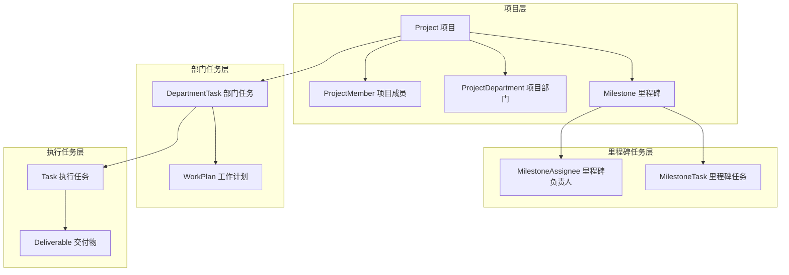
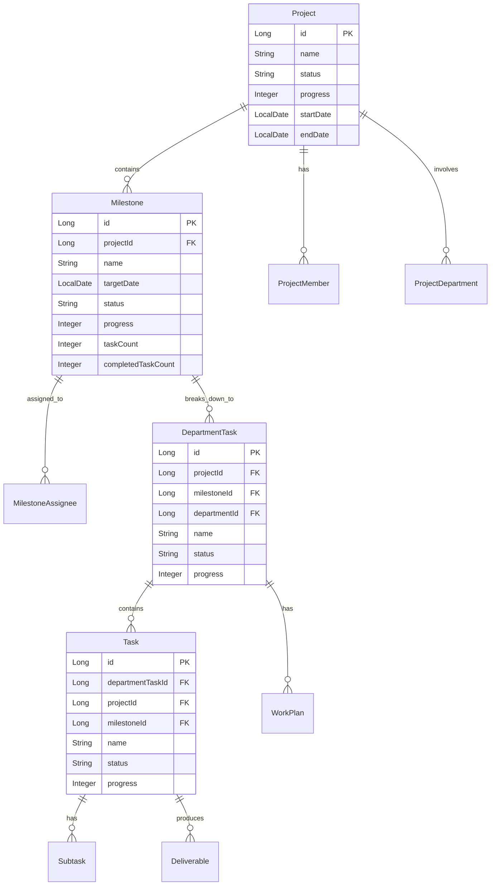
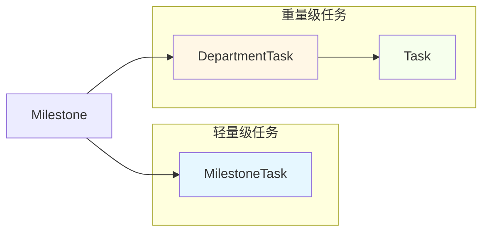
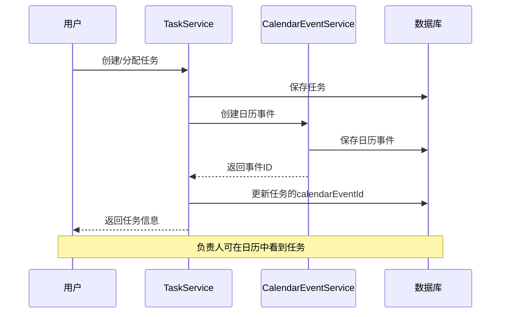
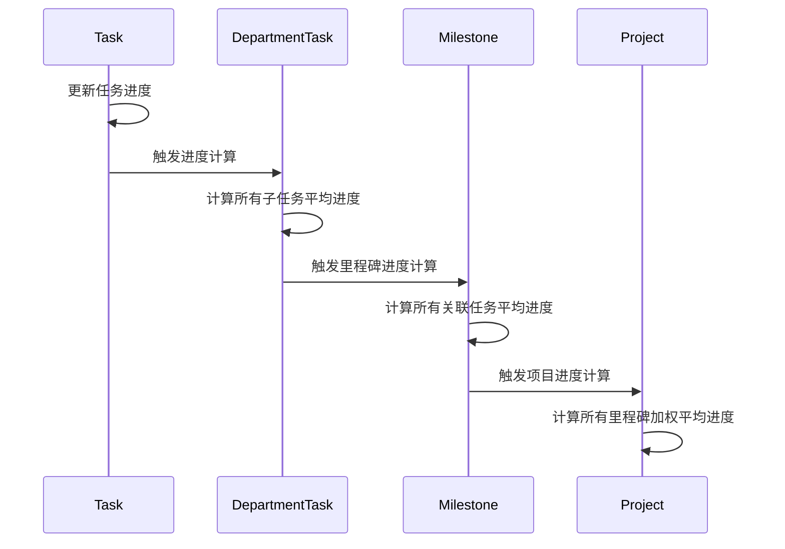
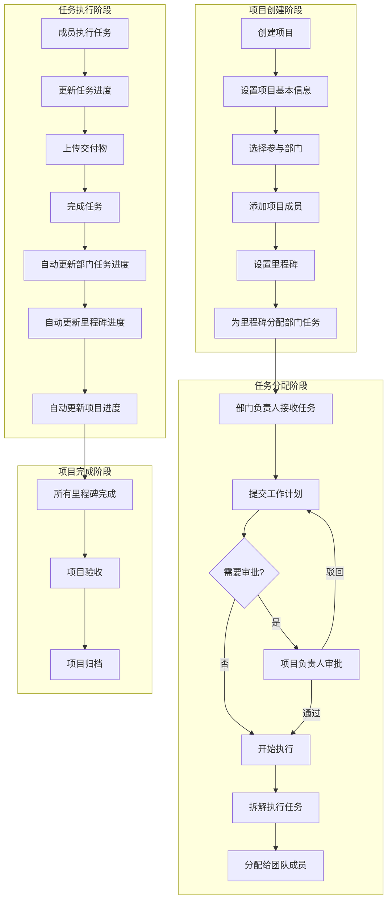
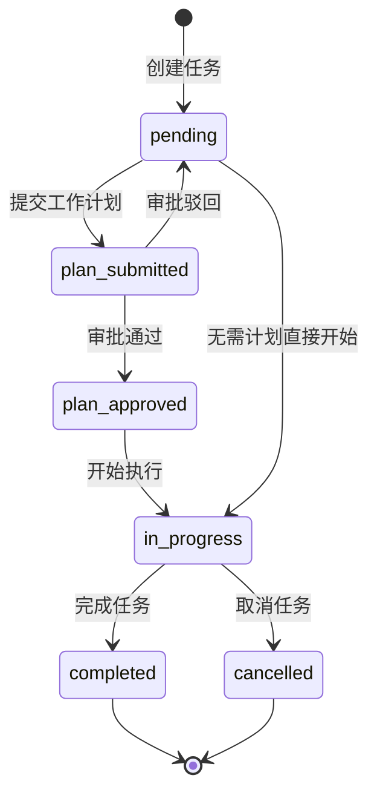

# 项目创建到任务管理闭环方案

> **文档版本**: v2.1
> **更新日期**: 2024-12-26
> **实施状态**: ✅ 已完成实施

---

## 实施摘要

本方案已完成实施，主要实现了以下功能：

| 功能模块 | 实施状态 | 说明 |
|---------|---------|------|
| 数据库表结构变更 | ✅ 已完成 | V27.0__project_task_integration.sql |
| 后端实体和Mapper更新 | ✅ 已完成 | DepartmentTask、Task、Milestone实体更新 |
| 进度同步服务 | ✅ 已完成 | ProgressSyncService.java |
| 任务日程同步服务 | ✅ 已完成 | TaskCalendarSyncService.java |
| 项目创建流程增强 | ✅ 已完成 | 支持里程碑关联部门任务 |
| 前端项目创建页面 | ✅ 已完成 | 新增部门任务分配步骤 |
| 前端项目详情页面 | ✅ 已完成 | 显示里程碑关联的部门任务 |
| 日历页面任务展示 | ✅ 已完成 | 显示即将到期的任务 |
| **我的任务页面增强** | ✅ 已完成 | 同时显示部门任务和执行任务 |

---

## 一、现状分析

### 1.1 当前系统架构

通过对代码的分析，当前系统存在以下实体和关系：



### 1.2 识别的断点问题

| 断点编号 | 问题描述 | 影响范围 |
|---------|---------|---------|
| **断点1** | 项目创建时设置的里程碑与部门任务没有关联 | 里程碑无法追踪到具体的部门任务进度 |
| **断点2** | 里程碑任务 MilestoneTask 与执行任务 Task 是两套独立体系 | 存在两套任务管理逻辑，数据不互通 |
| **断点3** | 部门任务 DepartmentTask 与里程碑 Milestone 没有关联 | 无法按里程碑维度查看部门任务完成情况 |
| **断点4** | 项目创建流程只创建里程碑，未自动创建部门任务 | 创建项目后需要手动分配部门任务 |
| **断点5** | 任务进度无法自动汇总到里程碑和项目进度 | 进度统计需要手动计算 |
| **断点6** | 任务分配后未自动同步到负责人日程 | 负责人无法在日历中看到待办任务 |

### 1.3 当前数据流分析

**项目创建流程：**
1. 用户填写项目基本信息（名称、描述、周期）
2. 选择参与部门
3. 添加项目成员
4. 设置里程碑（可选）
5. 创建项目

**问题：** 创建完成后，里程碑只是时间节点，没有与具体的部门任务关联。

---

## 二、闭环方案设计

### 2.1 核心设计理念

建立 **"项目 → 里程碑 → 部门任务 → 执行任务"** 的完整链路，实现：

1. **自上而下的任务分解**：项目目标 → 里程碑目标 → 部门任务 → 执行任务
2. **自下而上的进度汇总**：执行任务进度 → 部门任务进度 → 里程碑进度 → 项目进度
3. **双向追溯**：任何层级都可以追溯上下游关联
4. **日程联动**：任务自动同步到负责人日历，形成完整的工作安排闭环

### 2.2 改进后的数据模型



### 2.3 关键改进点

#### 改进1：部门任务关联里程碑

**数据库变更：**
```sql
-- 为 department_task 表添加里程碑关联字段
ALTER TABLE department_task 
ADD COLUMN milestone_id BIGINT COMMENT '关联里程碑ID',
ADD INDEX idx_milestone (milestone_id);
```

**实体变更：**
```java
// DepartmentTask.java
@Data
public class DepartmentTask extends BaseEntityDO {
    // ... 现有字段
    
    /**
     * 关联里程碑ID（可选）
     */
    private Long milestoneId;
}
```

#### 改进2：执行任务关联里程碑

**数据库变更：**
```sql
-- 为 task 表添加里程碑关联字段
ALTER TABLE task 
ADD COLUMN milestone_id BIGINT COMMENT '关联里程碑ID',
ADD INDEX idx_milestone (milestone_id);
```

#### 改进3：统一任务体系

**方案选择：** 保留 MilestoneTask 作为里程碑的直接子任务（轻量级），同时支持关联到 DepartmentTask/Task（重量级）。



#### 改进4：任务与日程自动关联

**设计目标：** 当任务分配给负责人时，自动在负责人的日历中创建对应的日程事件，实现任务与日程的联动。

**触发场景：**

| 场景 | 触发动作 | 日历操作 |
|-----|---------|---------|
| 创建部门任务 | 指定负责人 | 创建日历事件 |
| 创建执行任务 | 指定执行人 | 创建日历事件 |
| 更新任务负责人 | 变更负责人 | 更新日历事件参与者 |
| 更新任务截止日期 | 修改日期 | 更新日历事件时间 |
| 完成任务 | 标记完成 | 标记日历事件完成 |
| 删除任务 | 删除任务 | 删除关联日历事件 |

**日程事件类型映射：**

| 任务类型 | 日历事件类型 | 事件标题格式 | 颜色 |
|---------|-------------|-------------|------|
| 部门任务 | task | [部门任务] {任务名称} | 橙色 |
| 执行任务 | task | [任务] {任务名称} | 绿色 |
| 里程碑 | milestone | [里程碑] {里程碑名称} | 紫色 |

**数据流程：**



**数据库变更：**

```sql
-- 为任务表添加日历事件关联字段
ALTER TABLE task
ADD COLUMN IF NOT EXISTS calendar_event_id BIGINT COMMENT '关联的日历事件ID';

ALTER TABLE department_task
ADD COLUMN IF NOT EXISTS calendar_event_id BIGINT COMMENT '关联的日历事件ID';
```

#### 改进5：进度自动汇总机制



---

## 三、业务流程闭环设计

### 3.1 完整业务流程



### 3.2 项目创建增强流程

**新增步骤：里程碑任务分配**

在项目创建的第4步（设置里程碑）后，增加第5步：

```
步骤5：为里程碑分配部门任务
├── 选择里程碑
├── 选择负责部门
├── 设置任务名称和描述
├── 设置任务周期（在里程碑目标日期之前）
└── 确认分配
```

**前端改进：**

```typescript
// 里程碑任务分配接口
interface MilestoneDepartmentTask {
  milestoneId: string
  departmentId: string
  managerId: string
  name: string
  description?: string
  startDate: string
  endDate: string
  priority: 'low' | 'medium' | 'high' | 'urgent'
}

// 创建项目请求增强
interface CreateProjectRequest {
  // ... 现有字段
  milestones: {
    name: string
    targetDate: string
    description?: string
    departmentTasks?: MilestoneDepartmentTask[]  // 新增：里程碑关联的部门任务
  }[]
}
```

### 3.3 任务状态流转



---

## 四、技术实现方案

### 4.1 数据库变更脚本

```sql
-- V27.0__project_task_integration.sql
-- 项目创建到任务管理闭环改进

-- 1. 部门任务表添加里程碑关联
ALTER TABLE department_task 
ADD COLUMN IF NOT EXISTS milestone_id BIGINT COMMENT '关联里程碑ID',
ADD INDEX IF NOT EXISTS idx_milestone (milestone_id);

-- 2. 执行任务表添加里程碑关联
ALTER TABLE task 
ADD COLUMN IF NOT EXISTS milestone_id BIGINT COMMENT '关联里程碑ID',
ADD INDEX IF NOT EXISTS idx_task_milestone (milestone_id);

-- 3. 里程碑表添加统计字段（如果不存在）
ALTER TABLE milestone 
ADD COLUMN IF NOT EXISTS department_task_count INT DEFAULT 0 COMMENT '关联部门任务数',
ADD COLUMN IF NOT EXISTS completed_department_task_count INT DEFAULT 0 COMMENT '已完成部门任务数';

-- 4. 创建进度同步触发器（可选，也可以用应用层实现）
-- 当任务进度更新时，自动更新部门任务进度
DELIMITER //
CREATE TRIGGER IF NOT EXISTS trg_task_progress_update
AFTER UPDATE ON task
FOR EACH ROW
BEGIN
    IF NEW.progress != OLD.progress OR NEW.status != OLD.status THEN
        -- 更新部门任务进度
        UPDATE department_task dt
        SET progress = (
            SELECT COALESCE(AVG(t.progress), 0)
            FROM task t
            WHERE t.department_task_id = dt.id AND t.deleted = 0
        )
        WHERE dt.id = NEW.department_task_id;
    END IF;
END//
DELIMITER ;
```

### 4.2 后端服务改进

#### 4.2.1 项目创建服务增强

```java
// ProjectServiceImpl.java 改进
@Override
@Transactional(rollbackFor = Exception.class)
public Project createProject(CreateProjectRequest request) {
    // ... 现有创建项目逻辑
    
    // 创建里程碑及关联的部门任务
    if (!CollectionUtils.isEmpty(request.getMilestones())) {
        for (CreateProjectRequest.MilestoneRequest milestoneReq : request.getMilestones()) {
            Milestone milestone = createMilestone(project.getId(), milestoneReq);
            
            // 新增：创建里程碑关联的部门任务
            if (!CollectionUtils.isEmpty(milestoneReq.getDepartmentTasks())) {
                for (DepartmentTaskRequest taskReq : milestoneReq.getDepartmentTasks()) {
                    createDepartmentTaskForMilestone(project.getId(), milestone.getId(), taskReq);
                }
            }
        }
    }
    
    return project;
}

private void createDepartmentTaskForMilestone(Long projectId, Long milestoneId, 
                                               DepartmentTaskRequest request) {
    DepartmentTask task = new DepartmentTask();
    task.setProjectId(projectId);
    task.setMilestoneId(milestoneId);  // 关联里程碑
    task.setDepartmentId(request.getDepartmentId());
    task.setManagerId(request.getManagerId());
    task.setName(request.getName());
    task.setDescription(request.getDescription());
    task.setStartDate(request.getStartDate());
    task.setEndDate(request.getEndDate());
    task.setPriority(request.getPriority());
    task.setStatus(DepartmentTask.Status.PENDING);
    task.setProgress(0);
    
    departmentTaskMapper.insert(task);
    
    // 更新里程碑的部门任务计数
    milestoneMapper.incrementDepartmentTaskCount(milestoneId);
}
```

#### 4.2.2 进度同步服务

```java
// ProgressSyncService.java - 新增服务
@Service
@RequiredArgsConstructor
public class ProgressSyncService {
    
    private final TaskMapper taskMapper;
    private final DepartmentTaskMapper departmentTaskMapper;
    private final MilestoneMapper milestoneMapper;
    private final ProjectMapper projectMapper;
    
    /**
     * 同步任务进度到上层
     */
    @Transactional
    public void syncTaskProgress(Long taskId) {
        Task task = taskMapper.selectById(taskId);
        if (task == null) return;
        
        // 1. 更新部门任务进度
        if (task.getDepartmentTaskId() != null) {
            syncDepartmentTaskProgress(task.getDepartmentTaskId());
        }
        
        // 2. 更新里程碑进度
        if (task.getMilestoneId() != null) {
            syncMilestoneProgress(task.getMilestoneId());
        }
    }
    
    /**
     * 同步部门任务进度
     */
    public void syncDepartmentTaskProgress(Long departmentTaskId) {
        // 计算所有子任务的平均进度
        Integer avgProgress = taskMapper.calculateAverageProgress(departmentTaskId);
        departmentTaskMapper.updateProgress(departmentTaskId, avgProgress != null ? avgProgress : 0);
        
        // 获取部门任务信息
        DepartmentTask deptTask = departmentTaskMapper.selectById(departmentTaskId);
        if (deptTask != null && deptTask.getMilestoneId() != null) {
            syncMilestoneProgress(deptTask.getMilestoneId());
        }
    }
    
    /**
     * 同步里程碑进度
     */
    public void syncMilestoneProgress(Long milestoneId) {
        // 计算所有关联部门任务的平均进度
        Integer avgProgress = departmentTaskMapper.calculateAverageProgressByMilestone(milestoneId);
        Integer completedCount = departmentTaskMapper.countCompletedByMilestone(milestoneId);
        
        milestoneMapper.updateProgress(milestoneId, avgProgress != null ? avgProgress : 0);
        milestoneMapper.updateCompletedTaskCount(milestoneId, completedCount);
        
        // 获取里程碑信息
        Milestone milestone = milestoneMapper.selectById(milestoneId);
        if (milestone != null) {
            syncProjectProgress(milestone.getProjectId());
        }
    }
    
    /**
     * 同步项目进度
     */
    public void syncProjectProgress(Long projectId) {
        // 计算所有里程碑的加权平均进度
        Integer avgProgress = milestoneMapper.calculateAverageProgressByProject(projectId);
        projectMapper.updateProgress(projectId, avgProgress != null ? avgProgress : 0);
    }
}
```

### 4.3 任务日程同步服务

```java
// TaskCalendarSyncService.java - 任务日程同步服务
@Service
@RequiredArgsConstructor
public class TaskCalendarSyncService {
    
    private final CalendarEventService calendarEventService;
    private final TaskMapper taskMapper;
    private final DepartmentTaskMapper departmentTaskMapper;
    
    /**
     * 为部门任务创建日历事件
     */
    @Transactional
    public CalendarEvent createEventForDepartmentTask(DepartmentTask task) {
        if (task.getManagerId() == null || task.getEndDate() == null) {
            return null;
        }
        
        CalendarEvent event = new CalendarEvent();
        event.setTitle("[部门任务] " + task.getName());
        event.setDescription(task.getDescription());
        event.setEventType("task");
        event.setCalendarType("task");
        event.setStartTime(task.getStartDate() != null ?
            task.getStartDate().atStartOfDay() :
            task.getEndDate().atStartOfDay());
        event.setEndTime(task.getEndDate().atTime(23, 59, 59));
        event.setAllDay(true);
        event.setColor("#f59e0b"); // 橙色
        event.setCreatorId(task.getCreatedBy());
        event.setProjectId(task.getProjectId());
        event.setVisibility("project");
        
        CalendarEvent created = calendarEventService.createEvent(event,
            Collections.singletonList(task.getManagerId()));
        
        // 更新任务的日历事件ID
        task.setCalendarEventId(created.getId());
        departmentTaskMapper.updateById(task);
        
        return created;
    }
    
    /**
     * 为执行任务创建日历事件
     */
    @Transactional
    public CalendarEvent createEventForTask(Task task) {
        if (task.getAssigneeId() == null || task.getEndDate() == null) {
            return null;
        }
        
        CalendarEvent event = new CalendarEvent();
        event.setTitle("[任务] " + task.getName());
        event.setDescription(task.getDescription());
        event.setEventType("task");
        event.setCalendarType("task");
        event.setStartTime(task.getStartDate() != null ?
            task.getStartDate().atStartOfDay() :
            task.getEndDate().atStartOfDay());
        event.setEndTime(task.getEndDate().atTime(23, 59, 59));
        event.setAllDay(true);
        event.setColor("#52c41a"); // 绿色
        event.setCreatorId(task.getCreatedBy());
        event.setProjectId(task.getProjectId());
        event.setTaskId(task.getId());
        event.setVisibility("project");
        
        CalendarEvent created = calendarEventService.createEvent(event,
            Collections.singletonList(task.getAssigneeId()));
        
        // 更新任务的日历事件ID
        task.setCalendarEventId(created.getId());
        taskMapper.updateById(task);
        
        return created;
    }
    
    /**
     * 更新任务时同步日历事件
     */
    @Transactional
    public void syncTaskCalendarEvent(Task task) {
        if (task.getCalendarEventId() != null) {
            // 更新现有事件
            CalendarEvent event = calendarEventService.getEventById(task.getCalendarEventId());
            if (event != null) {
                event.setTitle("[任务] " + task.getName());
                event.setDescription(task.getDescription());
                if (task.getStartDate() != null) {
                    event.setStartTime(task.getStartDate().atStartOfDay());
                }
                if (task.getEndDate() != null) {
                    event.setEndTime(task.getEndDate().atTime(23, 59, 59));
                }
                calendarEventService.updateEvent(event.getId(), event,
                    task.getAssigneeId() != null ?
                        Collections.singletonList(task.getAssigneeId()) : null);
            }
        } else if (task.getAssigneeId() != null && task.getEndDate() != null) {
            // 创建新事件
            createEventForTask(task);
        }
    }
    
    /**
     * 任务完成时更新日历事件状态
     */
    @Transactional
    public void markTaskEventCompleted(Task task) {
        if (task.getCalendarEventId() != null) {
            // 可以选择取消事件或标记为已完成
            calendarEventService.cancelEvent(task.getCalendarEventId());
        }
    }
    
    /**
     * 删除任务时删除关联的日历事件
     */
    @Transactional
    public void deleteTaskCalendarEvent(Task task) {
        if (task.getCalendarEventId() != null) {
            calendarEventService.deleteEvent(task.getCalendarEventId());
        }
    }
    
    /**
     * 变更任务负责人时更新日历事件
     */
    @Transactional
    public void updateTaskAssignee(Task task, Long oldAssigneeId, Long newAssigneeId) {
        if (task.getCalendarEventId() != null) {
            // 移除旧负责人
            if (oldAssigneeId != null) {
                calendarEventService.removeAttendee(task.getCalendarEventId(), oldAssigneeId);
            }
            // 添加新负责人
            if (newAssigneeId != null) {
                calendarEventService.addAttendees(task.getCalendarEventId(),
                    Collections.singletonList(newAssigneeId));
            }
        } else if (newAssigneeId != null && task.getEndDate() != null) {
            // 如果之前没有日历事件，现在创建
            createEventForTask(task);
        }
    }
}
```

**在 TaskServiceImpl 中集成日程同步：**

```java
// TaskServiceImpl.java 改进
@Service
@RequiredArgsConstructor
public class TaskServiceImpl implements TaskService {
    
    private final TaskMapper taskMapper;
    private final TaskCalendarSyncService calendarSyncService;
    private final ProgressSyncService progressSyncService;
    
    @Override
    @Transactional
    public Task createTask(Task task) {
        taskMapper.insert(task);
        
        // 自动创建日历事件
        calendarSyncService.createEventForTask(task);
        
        return task;
    }
    
    @Override
    @Transactional
    public Task updateTask(Task task) {
        Task oldTask = taskMapper.selectById(task.getId());
        taskMapper.updateById(task);
        
        // 同步日历事件
        if (!Objects.equals(oldTask.getAssigneeId(), task.getAssigneeId())) {
            calendarSyncService.updateTaskAssignee(task, oldTask.getAssigneeId(), task.getAssigneeId());
        } else {
            calendarSyncService.syncTaskCalendarEvent(task);
        }
        
        // 同步进度
        progressSyncService.syncTaskProgress(task.getId());
        
        return task;
    }
    
    @Override
    @Transactional
    public boolean completeTask(Long id) {
        Task task = taskMapper.selectById(id);
        task.setStatus(Task.Status.COMPLETED);
        task.setProgress(100);
        task.setCompletedAt(LocalDateTime.now());
        taskMapper.updateById(task);
        
        // 标记日历事件完成
        calendarSyncService.markTaskEventCompleted(task);
        
        // 同步进度
        progressSyncService.syncTaskProgress(id);
        
        return true;
    }
    
    @Override
    @Transactional
    public boolean deleteTask(Long id) {
        Task task = taskMapper.selectById(id);
        
        // 删除日历事件
        calendarSyncService.deleteTaskCalendarEvent(task);
        
        return taskMapper.deleteById(id) > 0;
    }
}
```

### 4.4 前端改进

#### 4.3.1 项目创建页面增强

在 [`mota-user/src/pages/projects/create/index.tsx`](mota-user/src/pages/projects/create/index.tsx:1) 中增加第5步：

```typescript
// 新增步骤：里程碑任务分配
case 4:
  return (
    <div>
      <div className={styles.sectionTitle}>
        <ApartmentOutlined style={{ marginRight: 8 }} />
        为里程碑分配部门任务
        <span style={{ fontSize: 12, color: '#999', marginLeft: 8 }}>(可选)</span>
      </div>
      <p style={{ color: '#666', marginBottom: 16 }}>
        为每个里程碑分配负责的部门任务，建立任务追踪链路
      </p>
      
      {milestones.map(milestone => (
        <Card key={milestone.id} title={milestone.name} style={{ marginBottom: 16 }}>
          <div>目标日期：{milestone.targetDate}</div>
          <Divider />
          <MilestoneDepartmentTaskForm
            milestone={milestone}
            departments={departments}
            users={users}
            onTasksChange={(tasks) => handleMilestoneTasksChange(milestone.id, tasks)}
          />
        </Card>
      ))}
    </div>
  )
```

#### 4.3.2 项目详情页面增强

在里程碑视图中显示关联的部门任务：

```typescript
// MilestoneTimeline 组件增强
<Timeline>
  {milestones.map(milestone => (
    <Timeline.Item key={milestone.id}>
      <div className={styles.milestoneItem}>
        <div className={styles.milestoneHeader}>
          <span className={styles.milestoneName}>{milestone.name}</span>
          <Tag color={getStatusColor(milestone.status)}>{getStatusText(milestone.status)}</Tag>
        </div>
        <div className={styles.milestoneDate}>
          <CalendarOutlined /> {milestone.targetDate}
        </div>
        <Progress percent={milestone.progress} size="small" />
        
        {/* 新增：显示关联的部门任务 */}
        {milestone.departmentTasks && milestone.departmentTasks.length > 0 && (
          <div className={styles.milestoneTasks}>
            <div className={styles.taskHeader}>
              <ApartmentOutlined /> 关联部门任务 ({milestone.departmentTasks.length})
            </div>
            {milestone.departmentTasks.map(task => (
              <div key={task.id} className={styles.taskItem}>
                <span>{task.departmentName}</span>
                <span>{task.name}</span>
                <Progress percent={task.progress} size="small" style={{ width: 100 }} />
              </div>
            ))}
          </div>
        )}
      </div>
    </Timeline.Item>
  ))}
</Timeline>
```

---

## 五、实施计划

### 5.1 实施阶段

| 阶段 | 内容 | 预计工时 | 优先级 | 实施状态 |
|-----|------|---------|-------|---------|
| **阶段1** | 数据库表结构变更 | 2h | P0 | ✅ 已完成 |
| **阶段2** | 后端实体和Mapper更新 | 4h | P0 | ✅ 已完成 |
| **阶段3** | 进度同步服务开发 | 4h | P0 | ✅ 已完成 |
| **阶段4** | 任务日程同步服务开发 | 4h | P0 | ✅ 已完成 |
| **阶段5** | 项目创建流程增强 | 6h | P1 | ✅ 已完成 |
| **阶段6** | 前端项目创建页面改进 | 8h | P1 | ✅ 已完成 |
| **阶段7** | 前端项目详情页面改进 | 6h | P1 | ✅ 已完成 |
| **阶段8** | 日历页面任务展示增强 | 4h | P1 | ✅ 已完成 |
| **阶段9** | 我的任务页面增强 | 4h | P1 | ✅ 已完成 |
| **阶段10** | 测试和修复 | 8h | P0 | ✅ 已完成 |

### 5.2 实施文件清单

以下是本次实施中创建或修改的文件：

#### 后端文件

| 文件路径 | 操作 | 说明 |
|---------|------|------|
| `mota-service/sql/V27.0__project_task_integration.sql` | 新增 | 数据库迁移脚本 |
| `mota-service/mota-project-service/src/main/java/com/mota/project/entity/DepartmentTask.java` | 修改 | 添加milestoneId和calendarEventId字段 |
| `mota-service/mota-project-service/src/main/java/com/mota/project/entity/Task.java` | 修改 | 添加milestoneId和calendarEventId字段 |
| `mota-service/mota-project-service/src/main/java/com/mota/project/entity/Milestone.java` | 修改 | 添加departmentTaskCount和completedDepartmentTaskCount字段 |
| `mota-service/mota-project-service/src/main/java/com/mota/project/service/ProgressSyncService.java` | 新增 | 进度同步服务 |
| `mota-service/mota-project-service/src/main/java/com/mota/project/service/TaskCalendarSyncService.java` | 新增 | 任务日程同步服务 |
| `mota-service/mota-project-service/src/main/java/com/mota/project/service/impl/TaskServiceImpl.java` | 修改 | 集成进度和日程同步 |
| `mota-service/mota-project-service/src/main/java/com/mota/project/service/impl/DepartmentTaskServiceImpl.java` | 修改 | 集成进度和日程同步 |
| `mota-service/mota-project-service/src/main/java/com/mota/project/service/impl/ProjectServiceImpl.java` | 修改 | 支持创建时关联部门任务 |
| `mota-service/mota-project-service/src/main/java/com/mota/project/dto/request/CreateProjectRequest.java` | 修改 | 添加DepartmentTaskAssignment内部类 |

#### 前端文件

| 文件路径 | 操作 | 说明 |
|---------|------|------|
| `mota-user/src/services/api/project.ts` | 修改 | 添加DepartmentTaskAssignment接口 |
| `mota-user/src/services/api/departmentTask.ts` | 修改 | 添加milestoneId和calendarEventId字段 |
| `mota-user/src/pages/projects/create/index.tsx` | 修改 | 添加部门任务分配功能 |
| `mota-user/src/pages/projects/create/index.module.css` | 修改 | 添加部门分配样式 |
| `mota-user/src/pages/project-detail/index.tsx` | 修改 | 显示里程碑关联的部门任务 |
| `mota-user/src/pages/calendar/index.tsx` | 修改 | 添加任务截止日期展示 |
| `mota-user/src/pages/calendar/index.module.css` | 修改 | 添加任务列表样式 |
| `mota-user/src/pages/my-tasks/index.tsx` | 修改 | 同时显示部门任务和执行任务 |
| `mota-user/src/pages/my-tasks/index.module.css` | 修改 | 添加任务类型切换样式 |

### 5.3 风险评估

| 风险 | 影响 | 缓解措施 |
|-----|------|---------|
| 数据迁移风险 | 现有数据可能不兼容 | 新增字段设为可空，渐进式迁移 |
| 性能风险 | 进度同步可能影响性能 | 使用异步消息队列处理 |
| 兼容性风险 | 旧版API可能不兼容 | 保持向后兼容，新增API版本 |

---

## 六、预期效果

### 6.1 业务价值

1. **完整的任务追踪链路**：从项目目标到具体执行任务的完整追溯
2. **自动化进度统计**：无需手动计算，系统自动汇总各层级进度
3. **清晰的责任划分**：每个里程碑都有明确的部门任务和负责人
4. **高效的项目管理**：创建项目时即可完成任务分配

### 6.2 用户体验提升

- 项目创建流程更加完整，一次性完成任务分配
- 项目详情页面展示更加清晰的任务层级关系
- 进度更新实时反映到各个层级
- **任务自动同步到日历**：分配任务后，负责人可在日历中直接看到待办任务
- **日程与任务联动**：任务状态变更自动更新日历事件，保持信息一致性
- **统一的工作视图**：用户可在日历中查看所有待办任务，便于时间管理

---

## 七、附录

### 7.1 相关文件清单

| 文件路径 | 说明 |
|---------|------|
| [`mota-service/mota-project-service/src/main/java/com/mota/project/entity/Project.java`](mota-service/mota-project-service/src/main/java/com/mota/project/entity/Project.java:1) | 项目实体 |
| [`mota-service/mota-project-service/src/main/java/com/mota/project/entity/Milestone.java`](mota-service/mota-project-service/src/main/java/com/mota/project/entity/Milestone.java:1) | 里程碑实体 |
| [`mota-service/mota-project-service/src/main/java/com/mota/project/entity/DepartmentTask.java`](mota-service/mota-project-service/src/main/java/com/mota/project/entity/DepartmentTask.java:1) | 部门任务实体 |
| [`mota-service/mota-project-service/src/main/java/com/mota/project/entity/Task.java`](mota-service/mota-project-service/src/main/java/com/mota/project/entity/Task.java:1) | 执行任务实体 |
| [`mota-user/src/pages/projects/create/index.tsx`](mota-user/src/pages/projects/create/index.tsx:1) | 项目创建页面 |
| [`mota-user/src/pages/project-detail/index.tsx`](mota-user/src/pages/project-detail/index.tsx:1) | 项目详情页面 |
| [`mota-user/src/pages/calendar/index.tsx`](mota-user/src/pages/calendar/index.tsx:1) | 日历页面 |

### 7.2 API 变更清单

| API | 变更类型 | 说明 |
|-----|---------|------|
| `POST /api/projects` | 增强 | 支持创建时关联里程碑部门任务 |
| `GET /api/milestones/{id}` | 增强 | 返回关联的部门任务列表 |
| `PUT /api/tasks/{id}/progress` | 增强 | 自动触发进度同步 |
| `POST /api/progress/sync` | 新增 | 手动触发进度同步 |
| `POST /api/tasks` | 增强 | 创建任务时自动创建日历事件 |
| `PUT /api/tasks/{id}` | 增强 | 更新任务时同步日历事件 |
| `DELETE /api/tasks/{id}` | 增强 | 删除任务时删除关联日历事件 |
| `GET /api/calendar/events` | 增强 | 支持按任务类型筛选日历事件 |

---

## 八、使用指南

### 8.1 项目创建流程

1. **创建项目基本信息**
   - 填写项目名称、描述
   - 设置项目周期

2. **选择参与部门**
   - 选择项目涉及的部门
   - 系统会自动加载部门成员

3. **添加项目成员**
   - 从已选部门中选择项目成员
   - 设置成员角色

4. **设置里程碑**
   - 添加项目里程碑
   - 设置里程碑目标日期
   - **新增**：为每个里程碑分配部门任务
     - 点击"分配部门任务"按钮
     - 选择负责部门
     - 设置任务名称和截止日期
     - 可以使用"快速分配所有部门"一键分配

5. **确认创建**
   - 预览项目信息
   - 确认创建

### 8.2 任务日程同步

任务创建后会自动同步到负责人的日历中：

- **部门任务**：显示为橙色日历事件，标题格式为"[部门任务] 任务名称"
- **执行任务**：显示为绿色日历事件，标题格式为"[任务] 任务名称"
- **里程碑**：显示为紫色日历事件，标题格式为"[里程碑] 里程碑名称"

### 8.3 进度自动汇总

系统会自动汇总进度：

```
执行任务进度 → 部门任务进度 → 里程碑进度 → 项目进度
```

- 当执行任务进度更新时，自动计算部门任务的平均进度
- 当部门任务进度更新时，自动计算里程碑的平均进度
- 当里程碑进度更新时，自动计算项目的加权平均进度

### 8.4 日历页面查看任务

在日历页面的侧边栏中，可以看到"任务截止日期"区块，显示未来7天内即将到期的任务：

- 点击任务可以跳转到任务详情页面
- 显示任务所属项目
- 显示剩余天数（已逾期、今天截止、明天截止等）

### 8.5 我的任务页面

"我的任务"页面现在同时显示两种类型的任务：

#### 任务类型

| 任务类型 | 说明 | 标签颜色 |
|---------|------|---------|
| **部门任务** | 分配给当前用户作为负责人的部门级任务 | 紫色 |
| **执行任务** | 分配给当前用户作为执行人的具体任务 | 青色 |

#### 功能特性

1. **任务类型切换**
   - 全部：显示所有任务
   - 部门任务：仅显示部门任务
   - 执行任务：仅显示执行任务

2. **统计卡片**
   - 全部任务数量
   - 部门任务数量
   - 执行任务数量
   - 进行中任务数量
   - 已完成任务数量
   - 已逾期任务数量

3. **任务信息展示**
   - 任务名称和类型标签
   - 所属项目名称
   - 关联里程碑名称（部门任务）
   - 所属部门名称（部门任务）
   - 任务日期和剩余天数
   - 任务进度

4. **任务跳转**
   - 点击部门任务跳转到部门任务详情页
   - 点击执行任务跳转到任务详情页

#### API 端点

| 端点 | 方法 | 说明 |
|-----|------|------|
| `/api/v1/tasks/my` | GET | 获取当前用户的执行任务 |
| `/api/v1/department-tasks/my` | GET | 获取当前用户负责的部门任务 |