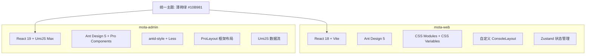
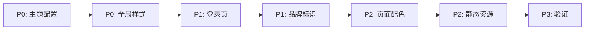

# 摩塔管理后台 UI 升级计划

## 问题分析

### 当前 mota-admin 的 UI 问题

mota-admin 目前基本使用 Ant Design Pro 的默认模板，存在以下问题：

| 问题 | 当前状态 | 目标状态 |
|------|---------|---------|
| 主色调 | 默认蓝 `#1890ff` | 薄荷绿 `#10B981` |
| 品牌标识 | "Ant Design Pro" + 支付宝 logo | "摩塔管理后台" + 摩塔 logo |
| 登录页 | Alipay CDN 背景图，通用表单 | 品牌分屏设计，左侧品牌展示 |
| Footer | 链接到 Ant Design Pro/GitHub | 摩塔品牌版权信息 |
| 欢迎页 | Ant Design Pro 模板介绍 | 摩塔管理后台品牌化欢迎页 |
| 图表配色 | 默认蓝色系 `#1890ff` | 薄荷绿主题色系 |
| 全局样式 | 几乎无自定义 | 匹配 mota-web 的设计规范 |
| 背景装饰 | Alipay CDN 图片 | 清洁简约风格 |

### mota-web 的设计标准（目标）

```
主色调: #10B981 (薄荷绿 Mint Green)
辅助色: #0EA5E9 (天空蓝 Sky Blue)
强调色: #F97316 (珊瑚橙 Coral Orange)
背景色: #F8FAFC (页面) / #FFFFFF (容器)
文字色: #1E293B (主) / #475569 (次) / #64748B (辅)
边框色: #E2E8F0
圆角: 8-12px
字体: Inter, 系统字体
```

## 技术架构对比



> **注意**: mota-admin 使用 ProLayout，不需要完全复制 mota-web 的自定义布局。
> 改造重点是**颜色主题、品牌标识、全局样式**，充分利用 ProLayout 的 token 配置能力。

## 改造范围

### 1. 全局主题配置 (`config/defaultSettings.ts`)

将主色从蓝色改为薄荷绿，更新品牌信息：

```typescript
const Settings = {
  navTheme: 'light',
  colorPrimary: '#10B981',  // 薄荷绿替代拂晓蓝
  layout: 'side',
  title: '摩塔管理后台',
  logo: '/logo.svg',       // 本地 logo
  token: {
    // ProLayout token 配置
    sider: { colorMenuBackground: '#fff' },
    header: { colorBgHeader: '#fff' },
    // ...
  },
};
```

### 2. Ant Design 主题 Token (`config/config.ts`)

在 antd 配置中注入完整的薄荷绿主题 token：

```typescript
antd: {
  configProvider: {
    theme: {
      cssVar: true,
      token: {
        colorPrimary: '#10B981',
        colorSuccess: '#22C55E',
        colorWarning: '#F59E0B',
        colorError: '#EF4444',
        colorInfo: '#0EA5E9',
        borderRadius: 8,
        colorBgLayout: '#F8FAFC',
        fontFamily: 'Inter, -apple-system, ...',
      },
    },
  },
},
```

### 3. 全局样式 (`src/global.less`)

添加 mota-web 的 CSS 变量体系和全局样式覆盖：

- CSS 变量定义（主色、辅助色、阴影、圆角等）
- Ant Design 组件全局覆盖
- 滚动条样式
- 过渡动画
- 选中文本样式

### 4. 登录页重设计 (`src/pages/user/login/index.tsx`)

从通用 LoginForm 升级为品牌化设计：

- 移除 Alipay CDN 背景图
- 采用薄荷绿渐变背景
- 左侧品牌展示区（可选，或纯色渐变背景）
- 更新 logo 和标题为"摩塔管理后台"
- 表单样式匹配薄荷绿主题

### 5. Footer 组件 (`src/components/Footer/index.tsx`)

```typescript
// 替换为摩塔品牌信息
copyright="2024 摩塔科技 Mota Tech"
links={[
  { title: '摩塔官网', href: '/' },
  { title: '帮助文档', href: '/help' },
]}
```

### 6. app.tsx 布局配置

- 移除 `bgLayoutImgList`（Alipay 背景图）
- 配置 ProLayout token 匹配绿色主题
- 更新 `menuHeaderRender`

### 7. Dashboard/Overview 图表配色

所有 ECharts 图表中硬编码的颜色替换：

| 原色值 | 新色值 | 用途 |
|-------|-------|------|
| `#1890ff` | `#10B981` | 主要数据系列 |
| `#52c41a` | `#0EA5E9` | 辅助数据系列 |
| `#faad14` | `#F97316` | 强调数据系列 |
| `#722ed1` | `#8B5CF6` | 额外数据系列 |

### 8. Welcome 页面

替换 Ant Design Pro 模板内容为摩塔管理后台欢迎信息。

### 9. 全局颜色扫描

搜索并替换所有硬编码的 `#1890ff` 等默认蓝色值。

### 10. 静态资源

- 生成摩塔品牌 logo SVG
- 更新 favicon

## 改造优先级



## 风险评估

| 风险 | 影响 | 缓解措施 |
|------|------|---------|
| ProLayout token 覆盖不完全 | 部分区域仍显示蓝色 | 使用 global.less 补充覆盖 |
| 硬编码颜色遗漏 | 个别组件配色不一致 | 全局搜索 #1890ff 确保替换完整 |
| antd-style 与 CSS 变量冲突 | 样式优先级问题 | 适当使用 !important |
| 第三方 CDN 资源不可用 | 登录页背景显示异常 | 改用本地资源或 CSS 渐变 |