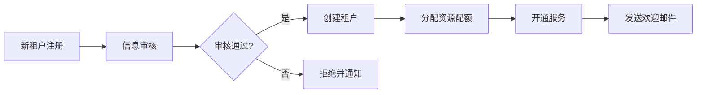
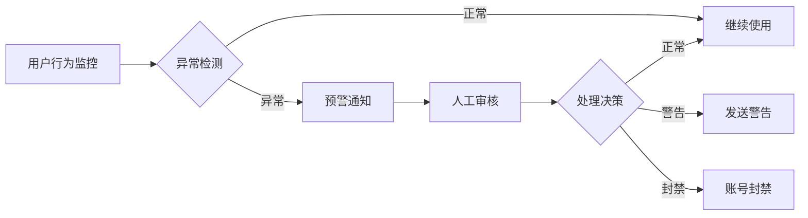

# 摩塔 Mota-Admin 管理后台技术方案

> **项目名称**: mota-admin (摩塔运营管理后台)  
> **版本**: v1.0  
> **创建日期**: 2026-01-30  
> **文档类型**: 技术架构方案

---

## 📋 目录

- [一、项目背景](#一项目背景)
- [二、需求分析](#二需求分析)
- [三、技术架构](#三技术架构)
- [四、功能模块设计](#四功能模块设计)
- [五、数据库设计](#五数据库设计)
- [六、API接口设计](#六api接口设计)
- [七、前端架构设计](#七前端架构设计)
- [八、后端服务设计](#八后端服务设计)
- [九、开发计划](#九开发计划)
- [十、部署方案](#十部署方案)

---

## 一、项目背景

### 1.1 mota项目现状

**摩塔 Mota** 是一款AI原生的项目管理和团队协作平台，目前已完成：

- ✅ **用户Web端** (mota-web): React + Vite，提供完整的项目管理功能
- ✅ **移动App端** (mota-app): uni-app，支持iOS/Android/鸿蒙
- ✅ **后端微服务** (mota-service): Spring Boot 3 + Spring Cloud微服务架构
  - mota-gateway (API网关)
  - mota-auth-service (认证服务)
  - mota-project-service (项目服务)
  - mota-ai-service (AI服务)
  - mota-knowledge-service (知识服务)
  - mota-notify-service (通知服务)
  - mota-calendar-service (日历服务)

### 1.2 管理后台的必要性

根据最佳技术架构方案文档，运营管理后台是第五阶段的关键交付物，其核心价值在于：

1. **运营支撑**: 租户管理、用户管理、数据统计
2. **内容管理**: 新闻管理、模板管理、内容审核
3. **系统配置**: AI模型配置、系统参数、权限配置
4. **数据分析**: 用户活跃度、收入分析、使用统计
5. **运维监控**: 系统监控、日志查询、告警管理

### 1.3 设计目标

- 🎯 **高效运营**: 提供完善的运营管理工具
- 🎯 **数据驱动**: 全面的数据统计和分析能力
- 🎯 **安全可靠**: 严格的权限控制和操作审计
- 🎯 **易于使用**: 友好的交互界面和操作体验
- 🎯 **可扩展性**: 支持功能模块的快速扩展

---

## 二、需求分析

### 2.1 核心功能模块

```
mota-admin 核心功能
├── 1. 运营仪表盘
│   ├── 数据概览
│   ├── 用户统计
│   ├── 项目统计
│   └── 收入分析
├── 2. 租户管理
│   ├── 租户列表
│   ├── 租户详情
│   ├── 套餐管理
│   └── 计费管理
├── 3. 用户管理
│   ├── 用户列表
│   ├── 用户详情
│   ├── 用户审核
│   └── 用户反馈
├── 4. 内容管理
│   ├── 新闻管理
│   ├── 模板管理
│   ├── 内容审核
│   └── 标签管理
├── 5. AI管理
│   ├── 模型配置
│   ├── 使用统计
│   ├── 成本控制
│   └── 质量监控
├── 6. 系统管理
│   ├── 系统配置
│   ├── 权限管理
│   ├── 操作日志
│   └── 系统监控
└── 7. 数据分析
    ├── 用户分析
    ├── 行为分析
    ├── 趋势分析
    └── 自定义报表
```

### 2.2 用户角色定义

| 角色 | 权限范围 | 主要职责 |
|------|---------|---------|
| **超级管理员** | 全部权限 | 系统配置、权限管理、数据管理 |
| **运营管理员** | 运营功能 | 租户管理、用户管理、内容管理 |
| **客服人员** | 用户支持 | 用户反馈、问题处理、数据查询 |
| **数据分析师** | 数据分析 | 数据统计、报表生成、趋势分析 |
| **技术运维** | 系统运维 | 系统监控、日志查询、故障处理 |

### 2.3 关键业务流程

#### 2.3.1 租户管理流程



#### 2.3.2 用户管理流程



---

## 三、技术架构

### 3.1 整体架构图

```
┌─────────────────────────────────────────────────────────────────┐
│                        浏览器 (Chrome/Edge/Safari)                │
└────────────────────────────┬────────────────────────────────────┘
                             │ HTTPS
                             ▼
┌─────────────────────────────────────────────────────────────────┐
│                          Nginx (反向代理)                         │
│                    • 负载均衡  • SSL终止  • 静态资源              │
└────────────────────────────┬────────────────────────────────────┘
                             │
              ┌──────────────┴──────────────┐
              │                             │
              ▼                             ▼
┌──────────────────────────┐   ┌──────────────────────────┐
│     前端应用 (SPA)        │   │    静态资源 (CDN)         │
│   React 18 + TypeScript   │   │   图片、字体、文件        │
│   Ant Design Pro 6.x      │   └──────────────────────────┘
│   • 运营仪表盘            │
│   • 租户管理              │
│   • 用户管理              │
│   • 内容管理              │
│   • 系统配置              │
└──────────────┬───────────┘
               │ HTTP/REST
               ▼
┌─────────────────────────────────────────────────────────────────┐
│                        API Gateway (8080)                         │
│                      Spring Cloud Gateway                         │
│               • 路由  • 认证  • 限流  • 日志追踪                   │
└────────────────────────────┬────────────────────────────────────┘
                             │
              ┌──────────────┼──────────────┐
              │              │              │
              ▼              ▼              ▼
┌──────────────────┐ ┌──────────────────┐ ┌──────────────────┐
│  mota-admin-bff  │ │ mota-user-service│ │mota-tenant-service│
│  (管理端BFF)      │ │  (用户服务)       │ │  (租户服务)       │
│  Node.js/NestJS  │ │  Spring Boot     │ │  Spring Boot     │
│  • 接口聚合       │ │  • 用户CRUD      │ │  • 租户管理       │
│  • 权限校验       │ │  • 权限管理      │ │  • 套餐管理       │
│  • 数据统计       │ │  • 审核管理      │ │  • 计费管理       │
└────────┬─────────┘ └────────┬─────────┘ └────────┬─────────┘
         │                    │                    │
         └────────────────────┼────────────────────┘
                              │
         ┌────────────────────┼────────────────────┐
         │                    │                    │
         ▼                    ▼                    ▼
┌──────────────────┐ ┌──────────────────┐ ┌──────────────────┐
│mota-ai-service   │ │mota-knowledge-svc│ │mota-notify-svc   │
│  (AI服务)         │ │  (知识服务)       │ │  (通知服务)       │
│  • 模型管理       │ │  • 内容管理       │ │  • 消息推送       │
│  • 使用统计       │ │  • 模板管理       │ │  • 邮件发送       │
│  • 成本控制       │ │  • 审核流程       │ │  • 通知配置       │
└────────┬─────────┘ └────────┬─────────┘ └────────┬─────────┘
         │                    │                    │
         └────────────────────┼────────────────────┘
                              │
┌─────────────────────────────┴────────────────────────────────────┐
│                          数据存储层                               │
├──────────────────┬──────────────────┬──────────────────┬─────────┤
│    MySQL 8.0     │    Redis 7.x     │  Elasticsearch   │  Kafka  │
│  • 业务数据      │  • 缓存          │  • 日志分析       │ • 消息  │
│  • 用户/租户     │  • 会话          │  • 全文搜索       │ • 事件  │
│  • 配置/权限     │  • 分布式锁      │  • 数据统计       │         │
└──────────────────┴──────────────────┴──────────────────┴─────────┘
```

### 3.2 技术栈选型

#### 3.2.1 前端技术栈

| 分类 | 技术选型 | 版本 | 说明 |
|------|---------|------|------|
| **基础框架** | React | 18.x | 主流UI框架，生态完善 |
| **开发语言** | TypeScript | 5.x | 类型安全，开发效率高 |
| **脚手架** | Ant Design Pro | 6.x | 企业级中后台解决方案 |
| **UI组件库** | Ant Design | 5.x | 成熟的企业级组件库 |
| **状态管理** | Zustand | 4.x | 轻量级状态管理 |
| **数据请求** | TanStack Query | 5.x | 服务端状态管理 |
| **路由管理** | React Router | 6.x | 声明式路由 |
| **图表库** | ECharts | 5.x | 丰富的数据可视化 |
| **表格组件** | ProTable | Latest | 高级表格组件 |
| **表单组件** | ProForm | Latest | 高级表单组件 |
| **代码编辑器** | Monaco Editor | Latest | VS Code编辑器核心 |
| **构建工具** | Vite | 5.x | 快速的开发构建工具 |

**为什么选择 Ant Design Pro?**

1. ✅ 开箱即用的中后台解决方案
2. ✅ 完善的权限管理和菜单配置
3. ✅ 丰富的ProComponents高级组件
4. ✅ 成熟的最佳实践和代码规范
5. ✅ 活跃的社区和详细的文档

#### 3.2.2 后端技术栈

| 分类 | 技术选型 | 版本 | 说明 |
|------|---------|------|------|
| **BFF层** | NestJS | 10.x | Node.js企业级框架 |
| **微服务** | Spring Boot | 3.2.x | 已有服务，复用架构 |
| **数据库** | MySQL | 8.0+ | 主数据存储 |
| **缓存** | Redis | 7.x | 缓存、会话 |
| **搜索** | Elasticsearch | 8.x | 日志分析、数据统计 |
| **消息队列** | Kafka | 3.x | 事件驱动 |

**为什么引入 BFF 层?**

1. ✅ 接口聚合：减少前端请求次数
2. ✅ 数据裁剪：只返回管理端需要的数据
3. ✅ 权限校验：统一的权限检查
4. ✅ 缓存优化：针对管理端的缓存策略
5. ✅ 技术栈统一：与用户端BFF保持一致

---

## 四、功能模块设计

### 4.1 运营仪表盘

#### 4.1.1 功能清单

```
运营仪表盘
├── 1.1 数据概览
│   ├── 总用户数
│   ├── 活跃用户数 (日/周/月)
│   ├── 新增用户数
│   ├── 总租户数
│   ├── 活跃租户数
│   ├── 总项目数
│   ├── 总任务数
│   └── AI调用量
├── 1.2 实时监控
│   ├── 在线用户数
│   ├── API请求量
│   ├── 系统负载
│   └── 服务健康状态
├── 1.3 用户趋势
│   ├── 用户增长趋势图
│   ├── 活跃度趋势图
│   ├── 留存率分析
│   └── 流失率分析
└── 1.4 收入分析
    ├── 总收入
    ├── 收入趋势
    ├── 套餐分布
    └── ARPU值
```

#### 4.1.2 页面布局

```
┌─────────────────────────────────────────────────────────────┐
│  运营仪表盘                                    刷新 | 导出     │
├─────────────────────────────────────────────────────────────┤
│  ┌──────────┐  ┌──────────┐  ┌──────────┐  ┌──────────┐    │
│  │总用户数   │  │活跃用户   │  │新增用户   │  │总租户数   │    │
│  │ 12,345   │  │  8,901   │  │   234    │  │   456    │    │
│  │ ↑ 12.5%  │  │ ↑ 8.3%   │  │ ↑ 15.2%  │  │ ↑ 5.6%   │    │
│  └──────────┘  └──────────┘  └──────────┘  └──────────┘    │
├─────────────────────────────────────────────────────────────┤
│  ┌───────────────────────────┐  ┌────────────────────────┐  │
│  │   用户增长趋势             │  │   活跃度分析            │  │
│  │                           │  │                        │  │
│  │   [折线图]                │  │   [柱状图]             │  │
│  │                           │  │                        │  │
│  └───────────────────────────┘  └────────────────────────┘  │
├─────────────────────────────────────────────────────────────┤
│  ┌───────────────────────────┐  ┌────────────────────────┐  │
│  │   收入趋势                 │  │   套餐分布              │  │
│  │                           │  │                        │  │
│  │   [面积图]                │  │   [饼图]               │  │
│  │                           │  │                        │  │
│  └───────────────────────────┘  └────────────────────────┘  │
└─────────────────────────────────────────────────────────────┘
```

### 4.2 租户管理

#### 4.2.1 功能清单

```
租户管理
├── 2.1 租户列表
│   ├── 筛选 (状态、套餐、创建时间)
│   ├── 搜索 (租户名、联系人)
│   ├── 排序 (创建时间、用户数、到期时间)
│   ├── 批量操作 (导出、通知)
│   └── 操作 (查看、编辑、禁用、删除)
├── 2.2 租户详情
│   ├── 基本信息 (名称、联系人、状态)
│   ├── 套餐信息 (当前套餐、到期时间、续费)
│   ├── 资源使用 (用户数、项目数、存储量)
│   ├── 成员列表 (查看、管理)
│   ├── 操作日志 (登录、配置变更)
│   └── 计费记录 (订单、支付、发票)
├── 2.3 套餐管理
│   ├── 套餐列表 (免费、专业、企业、定制)
│   ├── 套餐配置 (功能、配额、价格)
│   ├── 套餐启用/禁用
│   └── 套餐使用统计
└── 2.4 计费管理
    ├── 订单管理 (待支付、已支付、已取消)
    ├── 支付记录
    ├── 发票管理
    └── 续费提醒
```

#### 4.2.2 数据模型

```typescript
// 租户信息
interface Tenant {
  id: number;
  name: string;              // 租户名称
  code: string;              // 租户编码
  contactName: string;       // 联系人
  contactEmail: string;      // 联系邮箱
  contactPhone: string;      // 联系电话
  status: 'active' | 'suspended' | 'expired'; // 状态
  packageId: number;         // 套餐ID
  packageExpireAt: Date;     // 套餐到期时间
  maxUsers: number;          // 最大用户数
  maxProjects: number;       // 最大项目数
  maxStorage: number;        // 最大存储量(GB)
  currentUsers: number;      // 当前用户数
  currentProjects: number;   // 当前项目数
  currentStorage: number;    // 当前存储量
  createdAt: Date;
  updatedAt: Date;
}

// 套餐信息
interface Package {
  id: number;
  name: string;              // 套餐名称
  code: string;              // 套餐编码
  type: 'free' | 'pro' | 'enterprise' | 'custom'; // 类型
  price: number;             // 价格(元/月)
  maxUsers: number;          // 用户数限制
  maxProjects: number;       // 项目数限制
  maxStorage: number;        // 存储限制(GB)
  features: string[];        // 功能列表
  aiQuota: number;           // AI调用配额
  status: 'active' | 'inactive';
  description: string;
  createdAt: Date;
}
```

### 4.3 用户管理

#### 4.3.1 功能清单

```
用户管理
├── 3.1 用户列表
│   ├── 筛选 (状态、角色、注册时间)
│   ├── 搜索 (用户名、邮箱、手机号)
│   ├── 排序 (注册时间、最后登录)
│   ├── 批量操作 (导出、禁用、发送通知)
│   └── 操作 (查看、编辑、禁用、删除、重置密码)
├── 3.2 用户详情
│   ├── 基本信息 (用户名、邮箱、手机、头像)
│   ├── 账号状态 (状态、角色、权限)
│   ├── 所属租户
│   ├── 登录记录 (时间、IP、设备)
│   ├── 操作日志 (创建项目、任务等)
│   ├── AI使用统计
│   └── 反馈记录
├── 3.3 用户审核
│   ├── 待审核列表
│   ├── 审核详情
│   ├── 审核操作 (通过、拒绝)
│   └── 审核记录
└── 3.4 用户反馈
    ├── 反馈列表
    ├── 反馈详情
    ├── 处理状态
    └── 回复反馈
```

### 4.4 内容管理

#### 4.4.1 功能清单

```
内容管理
├── 4.1 新闻管理
│   ├── 新闻列表 (标题、分类、状态、发布时间)
│   ├── 新闻编辑 (富文本编辑器)
│   ├── 新闻发布/下架
│   ├── 新闻分类管理
│   └── 新闻推送配置
├── 4.2 模板管理
│   ├── 模板列表 (项目模板、任务模板、文档模板)
│   ├── 模板编辑
│   ├── 模板启用/禁用
│   ├── 模板分类
│   └── 模板使用统计
├── 4.3 内容审核
│   ├── 待审核列表 (文档、评论)
│   ├── 审核详情
│   ├── 审核操作 (通过、拒绝、删除)
│   └── 审核记录
└── 4.4 标签管理
    ├── 标签列表
    ├── 标签分类
    ├── 标签使用统计
    └── 标签维护
```

### 4.5 AI管理

#### 4.5.1 功能清单

```
AI管理
├── 5.1 模型配置
│   ├── 模型列表 (GPT-4、Claude、通义千问等)
│   ├── 模型参数配置
│   ├── 模型启用/禁用
│   ├── API密钥管理
│   └── 模型优先级设置
├── 5.2 使用统计
│   ├── 调用量统计 (总量、趋势)
│   ├── Token使用统计
│   ├── 成本统计 (按模型、按租户)
│   ├── 响应时间分析
│   └── 成功率分析
├── 5.3 成本控制
│   ├── 预算设置 (全局、租户级)
│   ├── 配额管理
│   ├── 成本告警
│   └── 成本优化建议
└── 5.4 质量监控
    ├── 响应质量评分
    ├── 错误日志
    ├── 异常请求监控
    └── 用户反馈分析
```

### 4.6 系统管理

#### 4.6.1 功能清单

```
系统管理
├── 6.1 系统配置
│   ├── 基础配置 (系统名称、Logo、域名)
│   ├── 邮件配置 (SMTP设置)
│   ├── 存储配置 (MinIO配置)
│   ├── 通知配置 (推送服务)
│   └── 安全配置 (密码策略、登录限制)
├── 6.2 权限管理
│   ├── 角色列表
│   ├── 角色权限配置
│   ├── 菜单权限
│   ├── 数据权限
│   └── API权限
├── 6.3 操作日志
│   ├── 日志列表 (用户、操作、时间、IP)
│   ├── 日志搜索
│   ├── 日志导出
│   └── 日志分析
└── 6.4 系统监控
    ├── 服务健康状态
    ├── 资源使用监控 (CPU、内存、磁盘)
    ├── API性能监控
    ├── 错误日志
    └── 告警配置
```

### 4.7 数据分析

#### 4.7.1 功能清单

```
数据分析
├── 7.1 用户分析
│   ├── 用户增长分析
│   ├── 用户活跃度分析
│   ├── 用户留存分析
│   ├── 用户流失分析
│   └── 用户画像分析
├── 7.2 行为分析
│   ├── 功能使用分析
│   ├── 用户路径分析
│   ├── 转化率分析
│   └── 热力图分析
├── 7.3 趋势分析
│   ├── 项目创建趋势
│   ├── 任务完成趋势
│   ├── AI使用趋势
│   └── 知识库增长趋势
└── 7.4 自定义报表
    ├── 报表模板
    ├── 报表配置
    ├── 报表生成
    └── 报表导出
```

---

## 五、数据库设计

### 5.1 核心数据表

#### 5.1.1 租户相关表

```sql
-- 租户表
CREATE TABLE `admin_tenant` (
    `id` BIGINT PRIMARY KEY AUTO_INCREMENT,
    `name` VARCHAR(100) NOT NULL COMMENT '租户名称',
    `code` VARCHAR(50) NOT NULL UNIQUE COMMENT '租户编码',
    `contact_name` VARCHAR(50) COMMENT '联系人',
    `contact_email` VARCHAR(100) COMMENT '联系邮箱',
    `contact_phone` VARCHAR(20) COMMENT '联系电话',
    `status` VARCHAR(20) DEFAULT 'active' COMMENT '状态: active-正常, suspended-暂停, expired-过期',
    `package_id` BIGINT COMMENT '套餐ID',
    `package_expire_at` DATETIME COMMENT '套餐到期时间',
    `max_users` INT DEFAULT 10 COMMENT '最大用户数',
    `max_projects` INT DEFAULT 10 COMMENT '最大项目数',
    `max_storage` INT DEFAULT 5 COMMENT '最大存储量(GB)',
    `current_users` INT DEFAULT 0 COMMENT '当前用户数',
    `current_projects` INT DEFAULT 0 COMMENT '当前项目数',
    `current_storage` DECIMAL(10,2) DEFAULT 0 COMMENT '当前存储量(GB)',
    `created_at` DATETIME DEFAULT CURRENT_TIMESTAMP,
    `updated_at` DATETIME DEFAULT CURRENT_TIMESTAMP ON UPDATE CURRENT_TIMESTAMP,
    INDEX `idx_status` (`status`),
    INDEX `idx_package` (`package_id`),
    INDEX `idx_expire` (`package_expire_at`)
) ENGINE=InnoDB DEFAULT CHARSET=utf8mb4 COMMENT='租户表';

-- 套餐表
CREATE TABLE `admin_package` (
    `id` BIGINT PRIMARY KEY AUTO_INCREMENT,
    `name` VARCHAR(50) NOT NULL COMMENT '套餐名称',
    `code` VARCHAR(30) NOT NULL UNIQUE COMMENT '套餐编码',
    `type` VARCHAR(20) NOT NULL COMMENT '类型: free-免费, pro-专业, enterprise-企业, custom-定制',
    `price` DECIMAL(10,2) DEFAULT 0 COMMENT '价格(元/月)',
    `max_users` INT DEFAULT 10 COMMENT '用户数限制',
    `max_projects` INT DEFAULT 10 COMMENT '项目数限制',
    `max_storage` INT DEFAULT 5 COMMENT '存储限制(GB)',
    `ai_quota` INT DEFAULT 1000 COMMENT 'AI调用配额(次/天)',
    `features` JSON COMMENT '功能列表',
    `status` VARCHAR(20) DEFAULT 'active' COMMENT '状态',
    `description` TEXT COMMENT '描述',
    `sort_order` INT DEFAULT 0 COMMENT '排序',
    `created_at` DATETIME DEFAULT CURRENT_TIMESTAMP,
    `updated_at` DATETIME DEFAULT CURRENT_TIMESTAMP ON UPDATE CURRENT_TIMESTAMP,
    INDEX `idx_type` (`type`),
    INDEX `idx_status` (`status`)
) ENGINE=InnoDB DEFAULT CHARSET=utf8mb4 COMMENT='套餐表';

-- 订单表
CREATE TABLE `admin_order` (
    `id` BIGINT PRIMARY KEY AUTO_INCREMENT,
    `order_no` VARCHAR(50) NOT NULL UNIQUE COMMENT '订单号',
    `tenant_id` BIGINT NOT NULL COMMENT '租户ID',
    `package_id` BIGINT NOT NULL COMMENT '套餐ID',
    `amount` DECIMAL(10,2) NOT NULL COMMENT '金额',
    `discount_amount` DECIMAL(10,2) DEFAULT 0 COMMENT '优惠金额',
    `paid_amount` DECIMAL(10,2) DEFAULT 0 COMMENT '实付金额',
    `status` VARCHAR(20) DEFAULT 'pending' COMMENT '状态: pending-待支付, paid-已支付, cancelled-已取消',
    `payment_method` VARCHAR(20) COMMENT '支付方式: alipay-支付宝, wechat-微信, bank-银行转账',
    `payment_time` DATETIME COMMENT '支付时间',
    `expire_time` DATETIME COMMENT '过期时间',
    `duration_months` INT DEFAULT 1 COMMENT '购买时长(月)',
    `remark` TEXT COMMENT '备注',
    `created_at` DATETIME DEFAULT CURRENT_TIMESTAMP,
    `updated_at` DATETIME DEFAULT CURRENT_TIMESTAMP ON UPDATE CURRENT_TIMESTAMP,
    INDEX `idx_tenant` (`tenant_id`),
    INDEX `idx_status` (`status`),
    INDEX `idx_created` (`created_at`)
) ENGINE=InnoDB DEFAULT CHARSET=utf8mb4 COMMENT='订单表';
```

#### 5.1.2 用户相关表

```sql
-- 管理员用户表
CREATE TABLE `admin_user` (
    `id` BIGINT PRIMARY KEY AUTO_INCREMENT,
    `username` VARCHAR(50) NOT NULL UNIQUE COMMENT '用户名',
    `password` VARCHAR(255) NOT NULL COMMENT '密码(加密)',
    `real_name` VARCHAR(50) COMMENT '真实姓名',
    `email` VARCHAR(100) COMMENT '邮箱',
    `phone` VARCHAR(20) COMMENT '手机号',
    `avatar` VARCHAR(255) COMMENT '头像',
    `role_id` BIGINT COMMENT '角色ID',
    `status` VARCHAR(20) DEFAULT 'active' COMMENT '状态: active-正常, disabled-禁用',
    `last_login_at` DATETIME COMMENT '最后登录时间',
    `last_login_ip` VARCHAR(50) COMMENT '最后登录IP',
    `created_at` DATETIME DEFAULT CURRENT_TIMESTAMP,
    `updated_at` DATETIME DEFAULT CURRENT_TIMESTAMP ON UPDATE CURRENT_TIMESTAMP,
    INDEX `idx_username` (`username`),
    INDEX `idx_role` (`role_id`),
    INDEX `idx_status` (`status`)
) ENGINE=InnoDB DEFAULT CHARSET=utf8mb4 COMMENT='管理员用户表';

-- 角色表
CREATE TABLE `admin_role` (
    `id` BIGINT PRIMARY KEY AUTO_INCREMENT,
    `name` VARCHAR(50) NOT NULL COMMENT '角色名称',
    `code` VARCHAR(30) NOT NULL UNIQUE COMMENT '角色编码',
    `description` VARCHAR(255) COMMENT '描述',
    `permissions` JSON COMMENT '权限列表',
    `status` VARCHAR(20) DEFAULT 'active' COMMENT '状态',
    `created_at` DATETIME DEFAULT CURRENT_TIMESTAMP,
    `updated_at` DATETIME DEFAULT CURRENT_TIMESTAMP ON UPDATE CURRENT_TIMESTAMP
) ENGINE=InnoDB DEFAULT CHARSET=utf8mb4 COMMENT='角色表';

-- 操作日志表
CREATE TABLE `admin_operation_log` (
    `id` BIGINT PRIMARY KEY AUTO_INCREMENT,
    `user_id` BIGINT NOT NULL COMMENT '操作用户ID',
    `username` VARCHAR(50) COMMENT '操作用户名',
    `module` VARCHAR(50) COMMENT '模块',
    `operation` VARCHAR(50) COMMENT '操作',
    `method` VARCHAR(10) COMMENT '请求方法',
    `url` VARCHAR(255) COMMENT '请求URL',
    `ip` VARCHAR(50) COMMENT 'IP地址',
    `location` VARCHAR(100) COMMENT 'IP归属地',
    `request_params` TEXT COMMENT '请求参数',
    `response_result` TEXT COMMENT '响应结果',
    `status` VARCHAR(20) COMMENT '状态: success-成功, failure-失败',
    `error_msg` TEXT COMMENT '错误信息',
    `execution_time` INT COMMENT '执行时长(ms)',
    `created_at` DATETIME DEFAULT CURRENT_TIMESTAMP,
    INDEX `idx_user` (`user_id`),
    INDEX `idx_module` (`module`),
    INDEX `idx_created` (`created_at`)
) ENGINE=InnoDB DEFAULT CHARSET=utf8mb4 COMMENT='操作日志表';
```

#### 5.1.3 内容管理表

```sql
-- 新闻表
CREATE TABLE `admin_news` (
    `id` BIGINT PRIMARY KEY AUTO_INCREMENT,
    `title` VARCHAR(200) NOT NULL COMMENT '标题',
    `category_id` BIGINT COMMENT '分类ID',
    `cover_image` VARCHAR(255) COMMENT '封面图',
    `summary` VARCHAR(500) COMMENT '摘要',
    `content` LONGTEXT COMMENT '内容',
    `source` VARCHAR(100) COMMENT '来源',
    `author` VARCHAR(50) COMMENT '作者',
    `tags` JSON COMMENT '标签',
    `status` VARCHAR(20) DEFAULT 'draft' COMMENT '状态: draft-草稿, published-已发布, archived-已归档',
    `view_count` INT DEFAULT 0 COMMENT '浏览量',
    `published_at` DATETIME COMMENT '发布时间',
    `created_by` BIGINT COMMENT '创建人ID',
    `created_at` DATETIME DEFAULT CURRENT_TIMESTAMP,
    `updated_at` DATETIME DEFAULT CURRENT_TIMESTAMP ON UPDATE CURRENT_TIMESTAMP,
    INDEX `idx_category` (`category_id`),
    INDEX `idx_status` (`status`),
    INDEX `idx_published` (`published_at`)
) ENGINE=InnoDB DEFAULT CHARSET=utf8mb4 COMMENT='新闻表';

-- 新闻分类表
CREATE TABLE `admin_news_category` (
    `id` BIGINT PRIMARY KEY AUTO_INCREMENT,
    `name` VARCHAR(50) NOT NULL COMMENT '分类名称',
    `code` VARCHAR(30) NOT NULL UNIQUE COMMENT '分类编码',
    `parent_id` BIGINT DEFAULT 0 COMMENT '父分类ID',
    `sort_order` INT DEFAULT 0 COMMENT '排序',
    `status` VARCHAR(20) DEFAULT 'active' COMMENT '状态',
    `created_at` DATETIME DEFAULT CURRENT_TIMESTAMP
) ENGINE=InnoDB DEFAULT CHARSET=utf8mb4 COMMENT='新闻分类表';

-- 模板表
CREATE TABLE `admin_template` (
    `id` BIGINT PRIMARY KEY AUTO_INCREMENT,
    `name` VARCHAR(100) NOT NULL COMMENT '模板名称',
    `type` VARCHAR(20) NOT NULL COMMENT '类型: project-项目, task-任务, document-文档',
    `category_id` BIGINT COMMENT '分类ID',
    `cover_image` VARCHAR(255) COMMENT '封面图',
    `description` TEXT COMMENT '描述',
    `content` LONGTEXT COMMENT '模板内容(JSON)',
    `status` VARCHAR(20) DEFAULT 'active' COMMENT '状态',
    `is_system` TINYINT(1) DEFAULT 0 COMMENT '是否系统模板',
    `usage_count` INT DEFAULT 0 COMMENT '使用次数',
    `created_by` BIGINT COMMENT '创建人ID',
    `created_at` DATETIME DEFAULT CURRENT_TIMESTAMP,
    `updated_at` DATETIME DEFAULT CURRENT_TIMESTAMP ON UPDATE CURRENT_TIMESTAMP,
    INDEX `idx_type` (`type`),
    INDEX `idx_status` (`status`)
) ENGINE=InnoDB DEFAULT CHARSET=utf8mb4 COMMENT='模板表';
```

#### 5.1.4 AI管理表

```sql
-- AI模型配置表
CREATE TABLE `admin_ai_model` (
    `id` BIGINT PRIMARY KEY AUTO_INCREMENT,
    `name` VARCHAR(50) NOT NULL COMMENT '模型名称',
    `code` VARCHAR(30) NOT NULL UNIQUE COMMENT '模型编码',
    `provider` VARCHAR(30) NOT NULL COMMENT '提供商: openai, anthropic, aliyun, baidu',
    `model_version` VARCHAR(50) COMMENT '模型版本',
    `api_key` VARCHAR(255) COMMENT 'API密钥(加密)',
    `api_endpoint` VARCHAR(255) COMMENT 'API端点',
    `max_tokens` INT DEFAULT 4096 COMMENT '最大Token数',
    `temperature` DECIMAL(3,2) DEFAULT 0.70 COMMENT '温度参数',
    `price_per_1k_tokens` DECIMAL(10,4) COMMENT '单价(元/1K tokens)',
    `priority` INT DEFAULT 0 COMMENT '优先级',
    `status` VARCHAR(20) DEFAULT 'active' COMMENT '状态',
    `config` JSON COMMENT '其他配置',
    `created_at` DATETIME DEFAULT CURRENT_TIMESTAMP,
    `updated_at` DATETIME DEFAULT CURRENT_TIMESTAMP ON UPDATE CURRENT_TIMESTAMP,
    INDEX `idx_provider` (`provider`),
    INDEX `idx_status` (`status`)
) ENGINE=InnoDB DEFAULT CHARSET=utf8mb4 COMMENT='AI模型配置表';

-- AI使用统计表
CREATE TABLE `admin_ai_usage` (
    `id` BIGINT PRIMARY KEY AUTO_INCREMENT,
    `tenant_id` BIGINT COMMENT '租户ID',
    `user_id` BIGINT COMMENT '用户ID',
    `model_id` BIGINT NOT NULL COMMENT '模型ID',
    `model_code` VARCHAR(30) COMMENT '模型编码',
    `request_tokens` INT DEFAULT 0 COMMENT '请求Token数',
    `response_tokens` INT DEFAULT 0 COMMENT '响应Token数',
    `total_tokens` INT DEFAULT 0 COMMENT '总Token数',
    `cost` DECIMAL(10,4) DEFAULT 0 COMMENT '成本(元)',
    `response_time` INT COMMENT '响应时间(ms)',
    `status` VARCHAR(20) COMMENT '状态: success-成功, failure-失败',
    `error_msg` TEXT COMMENT '错误信息',
    `created_at` DATETIME DEFAULT CURRENT_TIMESTAMP,
    INDEX `idx_tenant` (`tenant_id`),
    INDEX `idx_model` (`model_id`),
    INDEX `idx_created` (`created_at`)
) ENGINE=InnoDB DEFAULT CHARSET=utf8mb4 COMMENT='AI使用统计表';

-- AI成本预算表
CREATE TABLE `admin_ai_budget` (
    `id` BIGINT PRIMARY KEY AUTO_INCREMENT,
    `tenant_id` BIGINT COMMENT '租户ID(NULL表示全局)',
    `budget_type` VARCHAR(20) NOT NULL COMMENT '预算类型: daily-日, monthly-月',
    `budget_amount` DECIMAL(10,2) NOT NULL COMMENT '预算金额(元)',
    `used_amount` DECIMAL(10,2) DEFAULT 0 COMMENT '已使用金额',
    `alert_threshold` INT DEFAULT 80 COMMENT '告警阈值(%)',
    `status` VARCHAR(20) DEFAULT 'active' COMMENT '状态',
    `created_at` DATETIME DEFAULT CURRENT_TIMESTAMP,
    `updated_at` DATETIME DEFAULT CURRENT_TIMESTAMP ON UPDATE CURRENT_TIMESTAMP,
    INDEX `idx_tenant` (`tenant_id`),
    INDEX `idx_type` (`budget_type`)
) ENGINE=InnoDB DEFAULT CHARSET=utf8mb4 COMMENT='AI成本预算表';
```

### 5.2 数据字典

#### 5.2.1 状态枚举

| 表名 | 字段 | 枚举值 | 说明 |
|------|------|--------|------|
| admin_tenant | status | active | 正常 |
| | | suspended | 暂停 |
| | | expired | 过期 |
| admin_package | type | free | 免费版 |
| | | pro | 专业版 |
| | | enterprise | 企业版 |
| | | custom | 定制版 |
| admin_order | status | pending | 待支付 |
| | | paid | 已支付 |
| | | cancelled | 已取消 |
| admin_news | status | draft | 草稿 |
| | | published | 已发布 |
| | | archived | 已归档 |

---

## 六、API接口设计

### 6.1 RESTful API规范

#### 6.1.1 API命名规范

```
基础URL: https://api.mota.com/admin/v1

命名规则:
- 使用名词复数形式
- 使用小写字母和连字符
- 遵循RESTful标准

示例:
GET    /admin/v1/tenants              # 获取租户列表
GET    /admin/v1/tenants/:id          # 获取租户详情
POST   /admin/v1/tenants              # 创建租户
PUT    /admin/v1/tenants/:id          # 更新租户
DELETE /admin/v1/tenants/:id          # 删除租户
```

#### 6.1.2 统一响应格式

```typescript
// 成功响应
{
  "code": 200,
  "message": "success",
  "data": { ... },
  "timestamp": 1706601600000
}

// 分页响应
{
  "code": 200,
  "message": "success",
  "data": {
    "list": [ ... ],
    "total": 100,
    "page": 1,
    "pageSize": 20
  },
  "timestamp": 1706601600000
}

// 错误响应
{
  "code": 400,
  "message": "参数错误",
  "error": {
    "field": "email",
    "message": "邮箱格式不正确"
  },
  "timestamp": 1706601600000
}
```

### 6.2 核心API接口

#### 6.2.1 认证授权

```typescript
// 登录
POST /admin/v1/auth/login
Request: {
  username: string;
  password: string;
  captcha: string;
}
Response: {
  token: string;
  refreshToken: string;
  user: AdminUser;
}

// 登出
POST /admin/v1/auth/logout

// 刷新Token
POST /admin/v1/auth/refresh
Request: {
  refreshToken: string;
}
Response: {
  token: string;
}

// 获取当前用户信息
GET /admin/v1/auth/profile
Response: AdminUser

// 修改密码
PUT /admin/v1/auth/password
Request: {
  oldPassword: string;
  newPassword: string;
}
```

#### 6.2.2 运营仪表盘

```typescript
// 获取仪表盘数据
GET /admin/v1/dashboard/overview
Response: {
  totalUsers: number;
  activeUsers: number;
  newUsers: number;
  totalTenants: number;
  activeTenants: number;
  totalProjects: number;
  totalTasks: number;
  aiCallCount: number;
}

// 获取用户趋势
GET /admin/v1/dashboard/user-trend
Query: {
  startDate: string;
  endDate: string;
  granularity: 'day' | 'week' | 'month';
}
Response: {
  dates: string[];
  totalUsers: number[];
  newUsers: number[];
  activeUsers: number[];
}

// 获取收入分析
GET /admin/v1/dashboard/revenue
Query: {
  startDate: string;
  endDate: string;
}
Response: {
  totalRevenue: number;
  revenueByMonth: Array<{
    month: string;
    amount: number;
  }>;
  packageDistribution: Array<{
    packageName: string;
    count: number;
    revenue: number;
  }>;
}
```

#### 6.2.3 租户管理

```typescript
// 获取租户列表
GET /admin/v1/tenants
Query: {
  page?: number;
  pageSize?: number;
  status?: 'active' | 'suspended' | 'expired';
  packageId?: number;
  keyword?: string;
  sortBy?: 'createdAt' | 'userCount' | 'expireAt';
  sortOrder?: 'asc' | 'desc';
}
Response: PageResult<Tenant>

// 获取租户详情
GET /admin/v1/tenants/:id
Response: {
  tenant: Tenant;
  package: Package;
  members: User[];
  usage: {
    userCount: number;
    projectCount: number;
    storageUsed: number;
  };
  recentOrders: Order[];
}

// 创建租户
POST /admin/v1/tenants
Request: {
  name: string;
  code: string;
  contactName: string;
  contactEmail: string;
  contactPhone?: string;
  packageId: number;
}

// 更新租户
PUT /admin/v1/tenants/:id
Request: Partial<Tenant>

// 暂停/恢复租户
PUT /admin/v1/tenants/:id/status
Request: {
  status: 'active' | 'suspended';
  reason?: string;
}

// 删除租户
DELETE /admin/v1/tenants/:id
```

#### 6.2.4 套餐管理

```typescript
// 获取套餐列表
GET /admin/v1/packages
Response: Package[]

// 创建套餐
POST /admin/v1/packages
Request: {
  name: string;
  code: string;
  type: 'free' | 'pro' | 'enterprise' | 'custom';
  price: number;
  maxUsers: number;
  maxProjects: number;
  maxStorage: number;
  aiQuota: number;
  features: string[];
  description?: string;
}

// 更新套餐
PUT /admin/v1/packages/:id
Request: Partial<Package>

// 启用/禁用套餐
PUT /admin/v1/packages/:id/status
Request: {
  status: 'active' | 'inactive';
}
```

#### 6.2.5 用户管理

```typescript
// 获取用户列表
GET /admin/v1/users
Query: {
  page?: number;
  pageSize?: number;
  status?: 'active' | 'disabled';
  tenantId?: number;
  keyword?: string;
  sortBy?: 'createdAt' | 'lastLoginAt';
  sortOrder?: 'asc' | 'desc';
}
Response: PageResult<User>

// 获取用户详情
GET /admin/v1/users/:id
Response: {
  user: User;
  tenant: Tenant;
  loginRecords: LoginRecord[];
  operationLogs: OperationLog[];
  aiUsage: {
    totalCalls: number;
    totalTokens: number;
    totalCost: number;
  };
}

// 禁用/启用用户
PUT /admin/v1/users/:id/status
Request: {
  status: 'active' | 'disabled';
  reason?: string;
}

// 重置密码
PUT /admin/v1/users/:id/reset-password
Request: {
  newPassword: string;
}
```

#### 6.2.6 AI管理

```typescript
// 获取AI模型列表
GET /admin/v1/ai/models
Response: AiModel[]

// 更新模型配置
PUT /admin/v1/ai/models/:id
Request: Partial<AiModel>

// 获取AI使用统计
GET /admin/v1/ai/usage-stats
Query: {
  startDate: string;
  endDate: string;
  tenantId?: number;
  modelId?: number;
  granularity?: 'day' | 'week' | 'month';
}
Response: {
  totalCalls: number;
  totalTokens: number;
  totalCost: number;
  avgResponseTime: number;
  successRate: number;
  usage: Array<{
    date: string;
    calls: number;
    tokens: number;
    cost: number;
  }>;
  byModel: Array<{
    modelName: string;
    calls: number;
    cost: number;
  }>;
  byTenant: Array<{
    tenantName: string;
    calls: number;
    cost: number;
  }>;
}

// 获取成本预算
GET /admin/v1/ai/budgets
Query: {
  tenantId?: number;
}
Response: AiBudget[]

// 设置成本预算
POST /admin/v1/ai/budgets
Request: {
  tenantId?: number;
  budgetType: 'daily' | 'monthly';
  budgetAmount: number;
  alertThreshold: number;
}
```

### 6.3 BFF层接口聚合示例

```typescript
// BFF层聚合多个后端接口
// 前端一次请求获取仪表盘所有数据
GET /admin-bff/v1/dashboard/all
Response: {
  overview: {
    totalUsers: number;
    activeUsers: number;
    // ...
  };
  userTrend: {
    dates: string[];
    totalUsers: number[];
    // ...
  };
  revenue: {
    totalRevenue: number;
    // ...
  };
  topTenants: Tenant[];
  recentOrders: Order[];
}

// BFF层实现（NestJS）
@Get('dashboard/all')
async getDashboardAll() {
  const [overview, userTrend, revenue, topTenants, recentOrders] = 
    await Promise.all([
      this.dashboardService.getOverview(),
      this.dashboardService.getUserTrend(),
      this.dashboardService.getRevenue(),
      this.tenantService.getTopTenants(10),
      this.orderService.getRecentOrders(10)
    ]);
  
  return {
    overview,
    userTrend,
    revenue,
    topTenants,
    recentOrders
  };
}
```

---

## 七、前端架构设计

### 7.1 项目结构

```
mota-admin/
├── config/                     # 配置文件
│   ├── config.ts              # UmiJS配置
│   ├── routes.ts              # 路由配置
│   └── proxy.ts               # 代理配置
├── public/                     # 静态资源
│   ├── favicon.ico
│   └── logo.svg
├── src/
│   ├── .umi/                  # UmiJS临时文件
│   ├── assets/                # 资源文件
│   │   ├── images/
│   │   └── styles/
│   ├── components/            # 公共组件
│   │   ├── GlobalHeader/      # 全局头部
│   │   ├── GlobalFooter/      # 全局底部
│   │   ├── RightContent/      # 右侧内容
│   │   ├── Charts/            # 图表组件
│   │   │   ├── ChartCard/
│   │   │   ├── LineChart/
│   │   │   ├── BarChart/
│   │   │   └── PieChart/
│   │   └── ...
│   ├── layouts/               # 布局组件
│   │   ├── BasicLayout.tsx    # 基础布局
│   │   ├── BlankLayout.tsx    # 空白布局
│   │   └── UserLayout.tsx     # 用户布局
│   ├── pages/                 # 页面组件
│   │   ├── User/              # 用户相关
│   │   │   ├── Login/         # 登录页
│   │   │   └── Register/      # 注册页
│   │   ├── Dashboard/         # 仪表盘
│   │   │   ├── Overview/      # 数据概览
│   │   │   ├── Analysis/      # 数据分析
│   │   │   └── Monitor/       # 实时监控
│   │   ├── Tenant/            # 租户管理
│   │   │   ├── TenantList/    # 租户列表
│   │   │   ├── TenantDetail/  # 租户详情
│   │   │   ├── PackageList/   # 套餐列表
│   │   │   └── OrderList/     # 订单列表
│   │   ├── UserManage/        # 用户管理
│   │   │   ├── UserList/      # 用户列表
│   │   │   ├── UserDetail/    # 用户详情
│   │   │   └── Feedback/      # 用户反馈
│   │   ├── Content/           # 内容管理
│   │   │   ├── NewsList/      # 新闻列表
│   │   │   ├── NewsEdit/      # 新闻编辑
│   │   │   ├── TemplateList/  # 模板列表
│   │   │   └── Audit/         # 内容审核
│   │   ├── AI/                # AI管理
│   │   │   ├── ModelList/     # 模型列表
│   │   │   ├── UsageStats/    # 使用统计
│   │   │   └── CostControl/   # 成本控制
│   │   ├── System/            # 系统管理
│   │   │   ├── Config/        # 系统配置
│   │   │   ├── Role/          # 角色管理
│   │   │   ├── OperationLog/  # 操作日志
│   │   │   └── Monitor/       # 系统监控
│   │   └── Analysis/          # 数据分析
│   │       ├── UserAnalysis/  # 用户分析
│   │       ├── Behavior/      # 行为分析
│   │       └── Report/        # 自定义报表
│   ├── services/              # API服务
│   │   ├── auth.ts
│   │   ├── dashboard.ts
│   │   ├── tenant.ts
│   │   ├── user.ts
│   │   ├── content.ts
│   │   ├── ai.ts
│   │   └── system.ts
│   ├── models/                # 数据模型(dva)
│   │   ├── user.ts
│   │   ├── tenant.ts
│   │   └── global.ts
│   ├── utils/                 # 工具函数
│   │   ├── request.ts         # 请求封装
│   │   ├── authority.ts       # 权限工具
│   │   ├── utils.ts           # 通用工具
│   │   └── constants.ts       # 常量定义
│   ├── locales/               # 国际化
│   │   ├── zh-CN.ts
│   │   └── en-US.ts
│   ├── app.tsx                # 运行时配置
│   ├── global.less            # 全局样式
│   └── typings.d.ts           # 类型定义
├── .env                       # 环境变量
├── .env.development           # 开发环境
├── .env.production            # 生产环境
├── package.json
├── tsconfig.json
└── README.md
```

### 7.2 路由配置

```typescript
// config/routes.ts
export default [
  {
    path: '/user',
    layout: false,
    routes: [
      { path: '/user/login', component: './User/Login' },
      { path: '/user/register', component: './User/Register' },
    ],
  },
  {
    path: '/',
    component: '../layouts/BasicLayout',
    authority: ['admin', 'user'],
    routes: [
      { path: '/', redirect: '/dashboard/overview' },
      // 仪表盘
      {
        path: '/dashboard',
        name: '仪表盘',
        icon: 'dashboard',
        routes: [
          {
            path: '/dashboard/overview',
            name: '数据概览',
            component: './Dashboard/Overview',
          },
          {
            path: '/dashboard/analysis',
            name: '数据分析',
            component: './Dashboard/Analysis',
          },
          {
            path: '/dashboard/monitor',
            name: '实时监控',
            component: './Dashboard/Monitor',
          },
        ],
      },
      // 租户管理
      {
        path: '/tenant',
        name: '租户管理',
        icon: 'team',
        authority: ['admin', 'operator'],
        routes: [
          {
            path: '/tenant/list',
            name: '租户列表',
            component: './Tenant/TenantList',
          },
          {